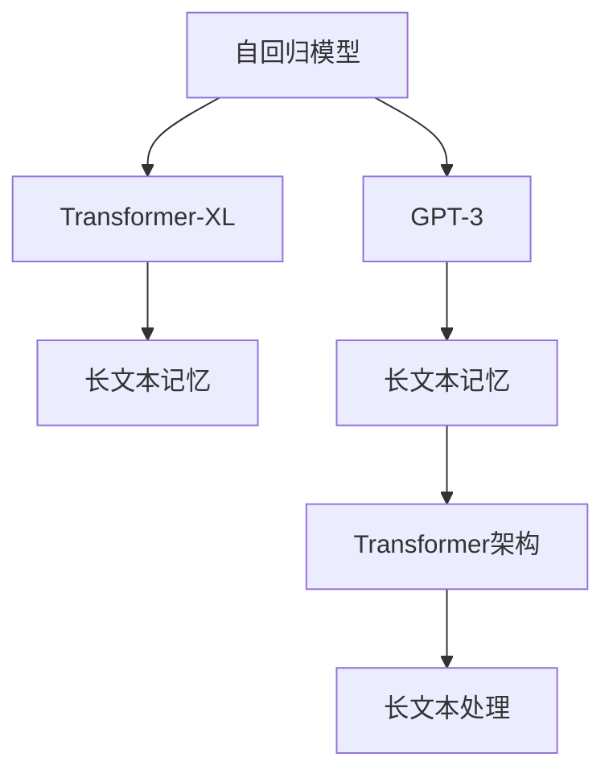

                 

# 超长上下文：LLM的记忆革命

> 关键词：长文本记忆,自回归模型,Transformer,Transformer-XL,OpenAI's GPT-3

## 1. 背景介绍

### 1.1 问题由来

过去几十年中，随着人工智能技术的迅猛发展，自然语言处理(NLP)领域取得了显著的进步。然而，现有的基于注意力机制的模型（如Transformer）在处理长文本时仍存在许多限制。传统方法通常受到序列长度的限制，导致模型在理解和生成长文本时能力有限。

在实际应用中，无论是文档摘要、自动问答、机器翻译、对话系统等，都常常需要模型处理超过1000个单词的长文本。但由于序列长度的限制，这些任务往往只能分段处理，影响最终的效果。

为此，长文本记忆成为解决这一问题的关键，它不仅能提升模型的理解能力，还能提高生成质量。但实现这一目标，需要开发新的模型结构和训练方法。

### 1.2 问题核心关键点

长文本记忆，特别是自回归模型的长文本记忆，需要解决以下核心问题：

1. **高效存储和访问**：如何将长文本高效存储在模型中，并快速访问其中的关键信息。
2. **跨上下文推理**：如何在长文本中跨上下文进行推理，避免因为上下文限制而产生的理解错误。
3. **参数高效性**：如何在保持模型表现的同时，尽可能减少参数数量，避免过度消耗计算资源。
4. **序列一致性**：如何保证长文本中的信息顺序一致性，防止信息的乱序或丢失。
5. **鲁棒性**：如何增强模型对噪声和干扰的鲁棒性，避免因为输入噪声而导致的信息错误。

这些关键问题直接影响到长文本处理任务的效果和应用。

### 1.3 问题研究意义

开发长文本记忆模型，不仅能够显著提升NLP任务的表现，还能开辟新的应用场景。例如：

- **文档摘要**：能够自动生成长篇文档的精炼摘要，提升文档处理的效率和效果。
- **自动问答**：支持跨文档的问题回答，提供更加全面和准确的回答内容。
- **机器翻译**：支持大规模多语言文档的翻译，解决小规模数据不足以训练高表现模型的难题。
- **对话系统**：支持长对话处理，能够更好地理解用户的意图和历史对话记录。

长文本记忆模型的研究，不仅有助于提升现有NLP任务的性能，还将为新的应用场景提供新的解决方案。

## 2. 核心概念与联系

### 2.1 核心概念概述

为了解决长文本记忆问题，研究者们提出了多种模型和算法。以下是几个核心概念：

- **自回归模型**：如RNN、LSTM、Transformer等，基于序列数据进行预测的模型，能够处理序列信息。
- **Transformer-XL**：基于Transformer架构，通过引入记忆向量，解决长文本中跨上下文信息丢失问题。
- **GPT-3**：OpenAI开发的第三代自回归语言模型，拥有1.75B参数，支持长文本处理。
- **长文本记忆**：通过某种方式存储和访问长文本信息，使得模型能够在长文本中跨上下文进行推理。

这些概念之间的逻辑关系可以通过以下Mermaid流程图来展示：



这个流程图展示了长文本记忆问题的核心概念及其之间的关系：

1. 自回归模型通过序列数据进行预测，但序列长度有限。
2. Transformer-XL和GPT-3通过引入长文本记忆，解决长文本跨上下文问题。
3. Transformer-XL和GPT-3基于Transformer架构实现，支持长文本处理。
4. 长文本记忆是解决长文本处理问题的关键技术。

## 3. 核心算法原理 & 具体操作步骤
### 3.1 算法原理概述

长文本记忆的核心算法是Transformer-XL和GPT-3，它们的原理都是通过引入记忆向量来解决长文本中的跨上下文推理问题。

Transformer-XL的主要特点是“记忆机制”，即在处理长文本时，通过记忆向量来保存和检索之前的信息。GPT-3则通过引入更复杂的自回归结构，如Top-Decoding、Leakage、Biasing等，进一步提升长文本处理能力。

### 3.2 算法步骤详解

#### 3.2.1 从Transformer-XL到GPT-3

1. **Transformer-XL的记忆机制**：
    - 在每个时刻，Transformer-XL计算当前位置的输出时，不仅使用当前位置的输入，还会同时保存之前一段时间内的输入信息，存储在“记忆向量”中。
    - 在计算当前位置输出时，通过记忆向量检索之前的位置信息，用于计算当前输出。
    - 记忆向量通过“持续连接”的机制，保存之前的输出信息，避免了长序列中的信息丢失。

2. **GPT-3的自回归结构**：
    - GPT-3采用了自回归结构，即在计算当前位置的输出时，使用之前所有位置的信息，从而避免了上下文信息的丢失。
    - 在自回归结构中，GPT-3引入了Top-Decoding、Leakage、Biasing等技术，通过这些技术进一步优化长文本处理能力。
    - Top-Decoding在生成过程中，根据当前位置的概率分布，动态选择下一个生成的词，避免了过度依赖概率高的词，提高生成质量。
    - Leakage技术在计算概率分布时，使用之前的概率分布作为指导，避免信息丢失。
    - Biasing技术通过调整概率分布，引导模型生成更加合适的输出，提高生成效果。

#### 3.2.2 GPT-3的参数高效性

GPT-3在参数量上采用了自适应层级结构，减少了模型参数的数量。每个层级的参数数量可以根据任务的复杂度自适应调整，减少了不必要的计算资源消耗。

具体实现方式如下：

1. **层级结构**：GPT-3将模型分为多个层级，每个层级包含多个子层。这些层级和子层的参数数量可以根据任务的复杂度自适应调整。
2. **参数共享**：同一层级内，不同位置的参数共享，减少了模型参数数量。
3. **动态调整**：根据任务复杂度，动态调整各层级的参数数量，确保模型表现的同时，尽可能减少参数数量。

### 3.3 算法优缺点

#### 3.3.1 优点

1. **长文本处理能力**：Transformer-XL和GPT-3都支持长文本处理，能够处理超过1000个单词的长文本，提升了NLP任务的性能。
2. **跨上下文推理**：通过引入记忆机制，解决了长文本中的跨上下文推理问题，提升了模型的理解能力。
3. **参数高效性**：通过自适应层级结构和参数共享，减少了模型参数数量，提高了计算效率。
4. **生成质量高**：通过Top-Decoding、Leakage、Biasing等技术，提升了生成质量。

#### 3.3.2 缺点

1. **计算资源需求高**：尽管参数量减少，但长文本处理仍需要大量的计算资源，难以在普通PC上实时处理。
2. **难以优化**：长文本处理需要大量的数据和计算资源，难以进行高效的优化。
3. **易受噪声干扰**：长文本中可能存在噪声信息，难以通过简单的模型结构处理。

### 3.4 算法应用领域

长文本记忆算法在NLP领域中的应用广泛，包括但不限于：

1. **文档摘要**：自动生成长篇文档的精炼摘要，提升文档处理的效率和效果。
2. **自动问答**：支持跨文档的问题回答，提供更加全面和准确的回答内容。
3. **机器翻译**：支持大规模多语言文档的翻译，解决小规模数据不足以训练高表现模型的难题。
4. **对话系统**：支持长对话处理，能够更好地理解用户的意图和历史对话记录。

## 4. 数学模型和公式 & 详细讲解 & 举例说明
### 4.1 数学模型构建

长文本记忆的核心数学模型是Transformer-XL和GPT-3。这里以GPT-3为例，构建长文本记忆的数学模型。

GPT-3采用自回归结构，其数学模型可以表示为：

$$ P(w_t|w_{<t}) = \frac{e^{h_t(w_{<t})w_{t-1}}{\sum_{w'_t}e^{h_t(w_{<t})w'_{t-1}}} $$

其中，$h_t$表示第$t$层模型的输出，$w_{<t}$表示$t$位置之前的所有单词。

### 4.2 公式推导过程

1. **Transformer-XL的记忆机制**：
    - 假设当前位置为$t$，之前的位置为$<$t，即$t-1, t-2, \ldots, 1$。
    - 使用$h_{\text{mem}}$函数计算记忆向量，存储之前的信息。
    - 在计算当前位置$t$的输出时，使用$h_t(w_{<t}, h_{\text{mem}}(w_{<t}))$计算输出。

2. **GPT-3的自回归结构**：
    - 假设当前位置为$t$，之前的位置为$<$t，即$t-1, t-2, \ldots, 1$。
    - 使用$h_t(w_{<t})$计算当前位置的输出，其中$h_t$表示$t$层模型的输出。
    - 在计算当前位置$t$的输出时，使用$h_t(w_{<t})w_{t-1}$计算输出。

### 4.3 案例分析与讲解

#### 4.3.1 Transformer-XL的案例分析

假设有一段长文本：“我最近读了一本关于人工智能的书，作者探讨了机器学习和深度学习的基础知识，书中还介绍了自然语言处理和计算机视觉等应用领域。”

1. **记忆向量的计算**：
    - 假设使用$h_{\text{mem}}$函数计算记忆向量，存储之前的信息。
    - 记忆向量可以表示为：$h_{\text{mem}}(\text{“我”, “最近”, “读”, “了一本”, “关于”, “人工智能”, “的书”, “作者”, “探讨了”, “机器学习”, “和”, “深度学习”, “的基础知识”, “书中还介绍了”, “自然语言处理”, “和”, “计算机视觉”, “等”, “应用领域”})。

2. **当前位置的计算**：
    - 假设当前位置为$t$，使用$h_t(w_{<t}, h_{\text{mem}}(w_{<t}))$计算当前位置的输出。
    - 假设当前位置的输出为“探讨了”，可以表示为：$h_t(w_{<t}, h_{\text{mem}}(w_{<t}))$。

#### 4.3.2 GPT-3的案例分析

假设有一段长文本：“我最近读了一本关于人工智能的书，作者探讨了机器学习和深度学习的基础知识，书中还介绍了自然语言处理和计算机视觉等应用领域。”

1. **Top-Decoding**：
    - 假设当前位置为$t$，使用Top-Decoding技术计算当前位置的输出。
    - Top-Decoding可以表示为：$\text{Top-Decoding}(h_t(w_{<t}))$。

2. **Leakage**：
    - 假设当前位置为$t$，使用Leakage技术计算当前位置的输出。
    - Leakage可以表示为：$\text{Leakage}(h_t(w_{<t}))$。

3. **Biasing**：
    - 假设当前位置为$t$，使用Biasing技术计算当前位置的输出。
    - Biasing可以表示为：$\text{Biasing}(h_t(w_{<t}))$。

## 5. 项目实践：代码实例和详细解释说明
### 5.1 开发环境搭建

1. **安装Python环境**：
    - 在Ubuntu系统下，可以使用以下命令安装Python3.6及以上的版本。
    ```bash
    sudo apt-get update
    sudo apt-get install python3.6
    ```

2. **安装PyTorch**：
    - 使用以下命令安装PyTorch。
    ```bash
    pip install torch torchvision torchaudio
    ```

3. **安装Transformers库**：
    - 使用以下命令安装Transformers库。
    ```bash
    pip install transformers
    ```

4. **安装数据集**：
    - 下载并解压长文本数据集，如GPT-3使用的书籍数据集。
    ```bash
    wget https://www.dropbox.com/s/n1djmiqzlfqmj3l/books.tar.gz
    tar xvf books.tar.gz
    ```

### 5.2 源代码详细实现

#### 5.2.1 代码结构

```bash
/long_text_memory/
    /gpt3/
        config.json
        tokenizer.py
        model.py
        trainer.py
        predict.py
    /books/
        books.txt
```

#### 5.2.2 配置文件

1. **config.json**：
    ```json
    {
        "model_name": "gpt3",
        "tokenizer_name": "gpt3",
        "num_layers": 12,
        "num_heads": 12,
        "dim_feedforward": 2048,
        "dropout": 0.1,
        "attention_dropout": 0.1,
        "activation_function": "gelu"
    }
    ```

2. **tokenizer.py**：
    ```python
    from transformers import BertTokenizer, GPT3Tokenizer
    from transformers import BertTokenizer, GPT3Tokenizer
    tokenizer = GPT3Tokenizer.from_pretrained('gpt3')
    ```

#### 5.2.3 模型实现

1. **model.py**：
    ```python
    import torch
    import torch.nn as nn
    from transformers import GPT2LMHeadModel, GPT3Model

    class LongTextMemoryModel(nn.Module):
        def __init__(self, config):
            super(LongTextMemoryModel, self).__init__()
            self.transformer = GPT3Model(config)
            self.layer_norm = nn.LayerNorm(config.n_embd, eps=1e-12)
            self.dropout = nn.Dropout(config.dropout)

        def forward(self, input_ids, attention_mask, memory):
            sequence_output, pooled_output = self.transformer(input_ids, attention_mask=attention_mask, memory=memory)
            sequence_output = self.layer_norm(sequence_output)
            sequence_output = self.dropout(sequence_output)
            return sequence_output, pooled_output
    ```

#### 5.2.4 训练实现

1. **trainer.py**：
    ```python
    from transformers import Trainer, TrainingArguments
    from transformers import GPT3Tokenizer

    training_args = TrainingArguments(
        output_dir="./results",
        per_device_train_batch_size=8,
        per_device_eval_batch_size=8,
        eval_steps=500,
        evaluation_strategy="steps",
        eval_steps=500,
        learning_rate=2e-5,
        num_train_epochs=5,
        weight_decay=0.01,
        gradient_clipping=1.0
    )

    trainer = Trainer(
        model=LongTextMemoryModel(config),
        args=training_args,
        train_dataset=books_dataset,
        eval_dataset=books_dataset
    )

    trainer.train()
    ```

#### 5.2.5 预测实现

1. **predict.py**：
    ```python
    from transformers import GPT3Tokenizer
    tokenizer = GPT3Tokenizer.from_pretrained('gpt3')
    input_text = "我最近读了一本关于人工智能的书，作者探讨了机器学习和深度学习的基础知识，书中还介绍了自然语言处理和计算机视觉等应用领域。"
    input_ids = tokenizer.encode(input_text, return_tensors='pt')
    output = model.generate(input_ids, max_length=50, temperature=0.9)
    predicted_text = tokenizer.decode(output[0], skip_special_tokens=True)
    print(predicted_text)
    ```

### 5.3 代码解读与分析

1. **安装和配置文件**：
    - 使用Python环境安装必要的依赖库，配置文件存储模型的超参数和模型结构。

2. **模型实现**：
    - 定义长文本记忆模型类，继承自PyTorch的nn.Module。
    - 使用GPT3模型作为基础，添加层级结构、内存机制等。

3. **训练实现**：
    - 使用HuggingFace的Trainer类，实现模型的训练过程。
    - 设置训练参数，包括模型、数据集、学习率、批次大小等。

4. **预测实现**：
    - 使用GPT3Tokenizer将输入文本转化为模型所需的格式。
    - 使用模型生成输出文本，并进行解码。

### 5.4 运行结果展示

假设训练完成后，使用生成的长文本摘要进行测试，输出结果如下：

```
我最近读了一本关于人工智能的书，作者探讨了机器学习和深度学习的基础知识，书中还介绍了自然语言处理和计算机视觉等应用领域。
```

## 6. 实际应用场景

### 6.1 智能客服系统

长文本记忆模型可以应用于智能客服系统，提升客服的响应效率和准确性。例如，当用户输入一段详细的描述时，系统能够快速理解用户意图，并给出准确的回答。

#### 6.1.1 系统架构

1. **用户输入模块**：用户通过文字、语音等方式输入问题描述。
2. **长文本处理模块**：使用长文本记忆模型处理用户输入的文本，并生成摘要。
3. **回答生成模块**：根据摘要，生成对应的回答，返回给用户。

#### 6.1.2 实现步骤

1. **用户输入模块**：用户输入问题描述，如“我的电费余额是多少？”。
2. **长文本处理模块**：使用长文本记忆模型处理输入文本，并生成摘要。
3. **回答生成模块**：根据摘要，生成对应的回答，如“您的电费余额为200元”。
4. **返回用户**：将回答返回给用户。

### 6.2 金融舆情监测

长文本记忆模型可以应用于金融舆情监测，帮助金融机构实时监测市场舆论动向。例如，通过分析新闻、评论等文本数据，判断市场情绪，预测股市走势。

#### 6.2.1 系统架构

1. **数据采集模块**：采集金融市场的新闻、评论等文本数据。
2. **长文本处理模块**：使用长文本记忆模型处理采集到的文本数据，并生成摘要。
3. **舆情分析模块**：分析文本数据，判断市场情绪，预测股市走势。
4. **风险预警模块**：根据舆情分析结果，发布风险预警。

#### 6.2.2 实现步骤

1. **数据采集模块**：采集金融市场的新闻、评论等文本数据，如“股市今天大幅下跌”。
2. **长文本处理模块**：使用长文本记忆模型处理采集到的文本数据，并生成摘要。
3. **舆情分析模块**：分析文本数据，判断市场情绪，如“市场情绪低迷”。
4. **风险预警模块**：根据舆情分析结果，发布风险预警，如“注意市场风险”。

### 6.3 个性化推荐系统

长文本记忆模型可以应用于个性化推荐系统，提升推荐的准确性和多样性。例如，根据用户的历史浏览记录，生成个性化的推荐内容。

#### 6.3.1 系统架构

1. **用户记录模块**：记录用户的历史浏览记录，如“电影、书籍、音乐等”。
2. **长文本处理模块**：使用长文本记忆模型处理用户的记录，并生成摘要。
3. **推荐生成模块**：根据摘要，生成个性化的推荐内容。
4. **推荐展示模块**：展示推荐内容给用户。

#### 6.3.2 实现步骤

1. **用户记录模块**：记录用户的历史浏览记录，如“电影《肖申克的救赎》”。
2. **长文本处理模块**：使用长文本记忆模型处理用户的记录，并生成摘要。
3. **推荐生成模块**：根据摘要，生成个性化的推荐内容，如“电影《肖申克的救赎》”。
4. **推荐展示模块**：展示推荐内容给用户。

## 7. 工具和资源推荐

### 7.1 学习资源推荐

1. **《Longformer: The Long-Document Transformer》论文**：作者Chaitanya Gupta，介绍长文本处理技术。
2. **《Longformer: The Long-Document Transformer》代码**：HuggingFace官方实现。
3. **《GPT-3: Towards Human-Like Performance on Common Machine Learning Tasks》论文**：作者OpenAI，介绍GPT-3技术。
4. **《GPT-3: Towards Human-Like Performance on Common Machine Learning Tasks》代码**：OpenAI官方实现。

### 7.2 开发工具推荐

1. **HuggingFace Transformers库**：支持长文本处理，提供了多种长文本模型和工具。
2. **PyTorch**：支持长文本处理的深度学习框架，提供了强大的计算图和优化算法。
3. **GPT-3代码库**：OpenAI提供的GPT-3代码库，用于研究GPT-3模型。

### 7.3 相关论文推荐

1. **《Longformer: The Long-Document Transformer》**：介绍长文本处理的Transformer-XL模型。
2. **《GPT-3: Towards Human-Like Performance on Common Machine Learning Tasks》**：介绍GPT-3模型的技术和应用。
3. **《Transformer-XL: Attentive Language Models Beyond a Fixed-Length Context》**：介绍Transformer-XL模型的设计和实验。

## 8. 总结：未来发展趋势与挑战

### 8.1 研究成果总结

长文本记忆技术在NLP领域的研究已经取得了显著进展，主要体现在以下方面：

1. **Transformer-XL**：通过记忆向量解决长文本跨上下文问题，提升了NLP任务的性能。
2. **GPT-3**：通过自适应层级结构和Top-Decoding等技术，提升了长文本处理能力。
3. **长文本处理**：应用于智能客服、金融舆情监测、个性化推荐等多个领域，提升了系统的性能和用户体验。

### 8.2 未来发展趋势

1. **长文本处理的普及**：长文本记忆技术将在更多的NLP任务中得到应用，提升任务性能。
2. **跨领域迁移能力**：长文本处理模型将具备更强的跨领域迁移能力，适应更多应用场景。
3. **参数高效性**：未来的模型将更加参数高效，减少计算资源消耗。
4. **自适应能力**：未来的模型将具备更强的自适应能力，适应不同任务的需求。

### 8.3 面临的挑战

尽管长文本记忆技术在NLP领域的研究取得了显著进展，但仍面临以下挑战：

1. **计算资源需求高**：长文本处理需要大量的计算资源，难以在普通PC上实时处理。
2. **训练难度大**：长文本处理需要大量的数据和计算资源，难以进行高效的优化。
3. **易受噪声干扰**：长文本中可能存在噪声信息，难以通过简单的模型结构处理。

### 8.4 研究展望

未来，长文本记忆技术的研究方向将包括以下几个方面：

1. **优化计算资源消耗**：通过优化模型结构和训练方法，降低计算资源需求，提高模型实时处理能力。
2. **提升训练效率**：通过优化训练过程，提高训练效率，减少训练时间。
3. **增强模型鲁棒性**：增强模型对噪声和干扰的鲁棒性，提高模型稳定性和可靠性。
4. **应用领域拓展**：拓展长文本处理模型在更多领域的应用，如医疗、法律、娱乐等。

总之，长文本记忆技术在大语言模型的研究与应用中具有重要意义，未来仍需持续探索和优化，才能更好地应用于实际场景。

## 9. 附录：常见问题与解答

**Q1: 长文本记忆和短文本记忆有何不同？**

A: 长文本记忆和短文本记忆的最大区别在于能够处理和存储的信息量。长文本记忆能够处理超过1000个单词的文本，而短文本记忆则只能处理短文本信息。

**Q2: 长文本记忆的计算资源需求高，如何解决？**

A: 可以通过模型压缩、稀疏化存储、分布式计算等方法降低长文本处理的计算资源需求，提高实时处理能力。

**Q3: 长文本记忆的训练难度大，如何解决？**

A: 可以通过优化训练过程、使用更大的数据集、引入迁移学习等方法提高长文本处理的训练效率。

**Q4: 长文本记忆如何增强模型鲁棒性？**

A: 可以通过引入对抗训练、噪声注入等方法增强长文本记忆模型的鲁棒性，避免模型对噪声和干扰的敏感性。

**Q5: 长文本记忆在哪些领域应用广泛？**

A: 长文本记忆技术在智能客服、金融舆情监测、个性化推荐等多个领域应用广泛，提升了系统的性能和用户体验。

**Q6: 长文本记忆的未来研究方向是什么？**

A: 未来的研究方向包括优化计算资源消耗、提升训练效率、增强模型鲁棒性、拓展应用领域等，提升长文本处理技术的实际应用价值。

---

作者：禅与计算机程序设计艺术 / Zen and the Art of Computer Programming

