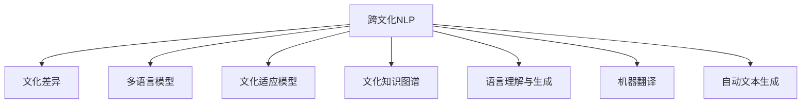

                 

# 跨文化NLP：理解和处理文化差异

> 关键词：跨文化,NLP,文化差异,多语言,文化适应,自然语言处理,语言理解,语言生成,机器翻译

## 1. 背景介绍

### 1.1 问题由来
在全球化背景下，跨文化交流日益频繁。无论是国际商务、跨文化教育还是跨语言社交，人类社会对自然语言处理(NLP)的需求日益增长。但不同文化背景下的语言使用习惯、表达方式、语义差异，使得NLP系统在跨文化场景下的性能大打折扣。

例如，中国人在交流中习惯使用礼貌用语，而美国人更倾向于直截了当。这些细微的差别，对于机器翻译和自动文本生成系统，都构成了巨大挑战。如何让NLP系统更好地理解文化差异，从而更准确地进行跨文化交流，成为了当前的迫切需求。

### 1.2 问题核心关键点
处理跨文化NLP的关键在于：
1. **文化理解**：深入理解不同文化之间的语言特点、交际习惯、情感表达等差异。
2. **数据采集**：构建多样化的跨文化数据集，涵盖不同语言、不同文化背景的语料，为模型训练提供基础。
3. **模型适配**：在预训练大模型的基础上，通过微调或新架构，使模型能够更好地适应目标文化。
4. **知识融合**：将文化知识、常识推理等非语言知识，与语言模型进行融合，提升模型的理解能力。
5. **应用优化**：在实际应用中，根据目标场景优化模型输出，确保自然流畅和语境合理。

本文聚焦于跨文化NLP的研究，通过理论阐述与实践案例相结合，深入探讨文化差异在NLP中的应用与挑战，并提供解决方案和展望。

## 2. 核心概念与联系

### 2.1 核心概念概述

为更好地理解跨文化NLP，本节将介绍几个密切相关的核心概念：

- **跨文化NLP**：处理不同文化背景下的语言数据，使NLP系统能够理解并适应跨文化场景。
- **文化差异**：不同文化在语言表达、情感表达、交际习惯等方面的差异。
- **多语言模型**：能够处理多种语言的大型预训练模型，通过跨语言迁移学习，提升在特定语言上的性能。
- **文化适应模型**：专门设计用于适应目标文化背景的语言模型。
- **文化知识图谱**：将文化知识、常识推理等非语言信息，以结构化形式存储和利用的知识图谱。
- **语言理解与生成**：包括语言模型对自然语言的理解能力，以及生成自然流畅文本的能力。
- **机器翻译**：将一种语言文本自动翻译成另一种语言文本的技术。
- **自动文本生成**：根据给定的输入，自动生成符合语法和语义规则的文本输出。

这些核心概念之间的逻辑关系可以通过以下Mermaid流程图来展示：



这个流程图展示了这个领域的主要概念及其之间的关系：

1. 跨文化NLP的基础是理解不同文化间的语言特点。
2. 多语言模型通过跨语言迁移学习，提升在特定语言上的性能。
3. 文化适应模型通过微调或新架构，使模型更好地适应目标文化。
4. 文化知识图谱将文化知识与语言模型融合，提升理解能力。
5. 语言理解与生成是跨文化NLP的核心能力。
6. 机器翻译和自动文本生成是跨文化NLP的主要应用场景。

这些概念共同构成了跨文化NLP的研究框架，使其能够在各种场景下更好地发挥作用。通过理解这些核心概念，我们可以更好地把握跨文化NLP的工作原理和优化方向。

## 3. 核心算法原理 & 具体操作步骤
### 3.1 算法原理概述

跨文化NLP的核心思想是，通过分析不同文化背景下的语言特点和交际习惯，在预训练大模型的基础上，进行针对性的微调或架构优化，使模型更好地理解并适应目标文化。

形式化地，假设预训练模型为 $M_{\theta}$，其中 $\theta$ 为预训练得到的模型参数。给定跨文化数据集 $D=\{(x_i, y_i)\}_{i=1}^N$，其中 $x_i$ 为输入文本，$y_i$ 为文本对应的标签或翻译结果。跨文化NLP的目标是找到新的模型参数 $\hat{\theta}$，使得模型在特定文化下的性能最大化：

$$
\hat{\theta}=\mathop{\arg\max}_{\theta} \mathcal{L}(M_{\theta},D)
$$

其中 $\mathcal{L}$ 为针对特定文化的损失函数，用于衡量模型在特定文化下的表现。常见的损失函数包括BLEU分数、F1分数、Rouge等。

通过梯度下降等优化算法，跨文化NLP过程不断更新模型参数 $\theta$，最小化损失函数 $\mathcal{L}$，使得模型输出逼近理想结果。由于 $\theta$ 已经通过预训练获得了较好的初始化，因此即便在少数文化数据上训练，也能较快收敛到理想的模型参数 $\hat{\theta}$。

### 3.2 算法步骤详解

跨文化NLP的一般流程包括以下几个关键步骤：

**Step 1: 收集和标注跨文化数据集**
- 收集目标文化的数据集，包括文本、对话、问答等各类语料。
- 对数据进行标注，如中文-英文翻译、情感分类、命名实体识别等，标注质量直接影响模型的性能。

**Step 2: 预训练文化适应模型**
- 选择合适的预训练语言模型 $M_{\theta}$ 作为初始化参数，如BERT、GPT等。
- 通过多语言预训练，使模型掌握不同语言的基本语义和语法规则。
- 在目标文化数据上进行微调，调整模型权重，适应目标语言的特定表达方式和文化习惯。

**Step 3: 设计文化适应层**
- 根据目标文化的特点，设计适当的文化适应层，如语言转换模块、文化特征提取模块等。
- 将这些模块集成到预训练模型的顶层，使其能够适应目标文化的语言和表达方式。

**Step 4: 应用文化知识图谱**
- 构建或引入文化知识图谱，将文化知识、常识推理等非语言信息编码为知识图谱。
- 在预训练模型中引入文化知识图谱，提升模型在特定文化下的理解能力。

**Step 5: 评估和优化**
- 在测试集上评估模型性能，如BLEU分数、F1分数等，对比微调前后的性能提升。
- 使用自动化工具或人工干预，优化模型输出，确保自然流畅和文化适应。

以上是跨文化NLP的一般流程。在实际应用中，还需要针对具体文化背景，对微调过程的各个环节进行优化设计，如改进训练目标函数，引入更多的正则化技术，搜索最优的超参数组合等，以进一步提升模型性能。

### 3.3 算法优缺点

跨文化NLP方法具有以下优点：
1. 可泛化性强。通过预训练模型和多语言迁移学习，能够在多种语言和文化间进行跨语言迁移。
2. 适应能力强。通过微调和文化适应层设计，使模型能够适应目标文化的特点和表达方式。
3. 效果显著。在跨文化翻译、对话、问答等任务上，跨文化NLP方法已经刷新了多项性能指标。

同时，该方法也存在一定的局限性：
1. 文化差异复杂。不同文化间的语言表达方式和交际习惯差异巨大，难以完全理解。
2. 数据标注成本高。获取高质量的跨文化标注数据，成本较高。
3. 模型泛化性有限。对于特定文化特有的表达方式，可能难以完全适应。
4. 可解释性不足。跨文化NLP模型的内部决策逻辑复杂，难以解释。

尽管存在这些局限性，但就目前而言，跨文化NLP方法仍是处理跨文化NLP问题的最强范式。未来相关研究的重点在于如何更好地理解文化差异，降低对标注数据的依赖，提高模型的跨文化适应能力，同时兼顾可解释性和伦理安全性等因素。

### 3.4 算法应用领域

跨文化NLP方法已经在NLP领域多个任务上取得了显著应用，具体包括：

- **机器翻译**：将一种语言翻译成另一种语言，特别是在不同语言和文化间的翻译。
- **对话系统**：与用户进行跨文化交流，理解并生成符合目标文化习惯的回答。
- **问答系统**：回答跨文化背景下的用户问题，特别是在跨文化教育、客服等领域。
- **文本摘要**：对跨文化文本进行压缩生成摘要，如对多文化语料的汇总整理。
- **情感分析**：理解跨文化背景下的情感表达，特别是在社交媒体分析中。
- **命名实体识别**：识别跨文化文本中的人名、地名、机构名等特定实体，特别是在多文化数据上。
- **语义理解**：理解跨文化背景下的语义关系，特别是在多文化知识图谱中。

除了上述这些经典任务外，跨文化NLP方法也被创新性地应用到更多场景中，如跨文化知识图谱构建、跨文化语义相似度计算、跨文化推荐系统等，为NLP技术带来了全新的突破。随着预训练模型和跨文化NLP方法的不断进步，相信NLP技术将在更多领域实现跨文化应用，促进全球文化交流和知识共享。

## 4. 数学模型和公式 & 详细讲解
### 4.1 数学模型构建

本节将使用数学语言对跨文化NLP过程进行更加严格的刻画。

记预训练语言模型为 $M_{\theta}$，其中 $\theta$ 为预训练得到的模型参数。假设跨文化数据集为 $D=\{(x_i,y_i)\}_{i=1}^N$，其中 $x_i$ 为输入文本，$y_i$ 为文本对应的标签或翻译结果。

定义模型 $M_{\theta}$ 在输入 $x$ 上的损失函数为 $\ell(M_{\theta}(x),y)$，则在数据集 $D$ 上的经验风险为：

$$
\mathcal{L}(\theta) = \frac{1}{N} \sum_{i=1}^N \ell(M_{\theta}(x_i),y_i)
$$

其中，$\ell$ 可以是BLEU分数、F1分数、Rouge等评估跨文化翻译质量的指标。

在目标文化数据集上，定义损失函数为 $\mathcal{L}_{\text{c}}(\theta)$：

$$
\mathcal{L}_{\text{c}}(\theta) = \frac{1}{N} \sum_{i=1}^N \ell'(M_{\theta}(x_i),y_i)
$$

其中，$\ell'$ 为针对特定文化的损失函数。

跨文化NLP的优化目标是最小化经验风险：

$$
\theta^* = \mathop{\arg\min}_{\theta} \mathcal{L}(\theta)
$$

在优化过程中，需要先通过预训练模型 $M_{\theta}$ 在多语言数据上预训练，然后再在目标文化数据集上进行微调，以适应特定文化的需求。

### 4.2 公式推导过程

以机器翻译为例，假设模型 $M_{\theta}$ 在输入 $x$ 上的输出为 $\hat{y}=M_{\theta}(x)$，表示对输入 $x$ 的翻译结果。真实标签 $y$ 为源语言文本 $x$ 翻译成目标语言文本 $y$。则BLEU分数定义为：

$$
\ell(M_{\theta}(x),y) = \frac{1}{N_{ref}} \sum_{ref} \text{BLEU}(M_{\theta}(x), y, ref)
$$

其中，$N_{ref}$ 为参考翻译的数量，$ref$ 为与 $y$ 匹配的参考翻译，$\text{BLEU}$ 为BLEU分数计算公式。

将上述BLEU分数带入经验风险公式，得：

$$
\mathcal{L}(\theta) = -\frac{1}{N}\sum_{i=1}^N \log \frac{p(y_i|M_{\theta}(x_i))}{p_{ref}(y_i)}
$$

其中，$p(y_i|M_{\theta}(x_i))$ 为模型对输入 $x_i$ 生成目标语言文本 $y_i$ 的概率，$p_{ref}(y_i)$ 为参考翻译 $ref$ 中对 $y_i$ 的统计概率。

在目标文化数据上进行微调，将目标文化数据集 $D_{\text{c}}=\{(x_i,y_i)\}_{i=1}^N$ 带入上述公式，得：

$$
\mathcal{L}_{\text{c}}(\theta) = -\frac{1}{N}\sum_{i=1}^N \log \frac{p(y_i|M_{\theta}(x_i))}{p_{ref}(y_i)}
$$

其中，$p(y_i|M_{\theta}(x_i))$ 为模型在目标文化数据集上进行微调后，对输入 $x_i$ 生成目标语言文本 $y_i$ 的概率。

### 4.3 案例分析与讲解

以Google Translate为例，其跨文化NLP处理流程大致如下：

1. 预训练：使用包含多种语言的数据集，在多语言环境中预训练BERT模型，使其掌握多语言基本语义和语法规则。

2. 微调：在特定文化的数据集上，进行微调，调整模型权重，适应目标语言的特定表达方式和文化习惯。

3. 文化适应层设计：设计文化适应层，如语言转换模块、文化特征提取模块，使模型能够适应特定文化。

4. 评估和优化：在测试集上评估模型性能，如BLEU分数、F1分数等，优化模型输出，确保自然流畅和文化适应。

Google Translate的BLEU分数计算公式为：

$$
\text{BLEU} = \prod_{k=1}^K \min (\text{BLEU}_k)
$$

其中，$K$ 为参考翻译的个数，$\text{BLEU}_k$ 为对应翻译的BLEU分数。

通过上述计算过程，Google Translate实现了对多文化文本的自动翻译，并在实际应用中取得了优异的性能。

## 5. 项目实践：代码实例和详细解释说明
### 5.1 开发环境搭建

在进行跨文化NLP实践前，我们需要准备好开发环境。以下是使用Python进行PyTorch开发的环境配置流程：

1. 安装Anaconda：从官网下载并安装Anaconda，用于创建独立的Python环境。

2. 创建并激活虚拟环境：
```bash
conda create -n pytorch-env python=3.8 
conda activate pytorch-env
```

3. 安装PyTorch：根据CUDA版本，从官网获取对应的安装命令。例如：
```bash
conda install pytorch torchvision torchaudio cudatoolkit=11.1 -c pytorch -c conda-forge
```

4. 安装Transformers库：
```bash
pip install transformers
```

5. 安装各类工具包：
```bash
pip install numpy pandas scikit-learn matplotlib tqdm jupyter notebook ipython
```

完成上述步骤后，即可在`pytorch-env`环境中开始跨文化NLP实践。

### 5.2 源代码详细实现

这里我们以机器翻译任务为例，给出使用Transformers库对BERT模型进行跨文化微调的PyTorch代码实现。

首先，定义机器翻译数据处理函数：

```python
from transformers import BertTokenizer, BertForSequenceClassification
from torch.utils.data import Dataset
import torch

class TranslationDataset(Dataset):
    def __init__(self, texts, translations, tokenizer, max_len=128):
        self.texts = texts
        self.translations = translations
        self.tokenizer = tokenizer
        self.max_len = max_len
        
    def __len__(self):
        return len(self.texts)
    
    def __getitem__(self, item):
        text = self.texts[item]
        translation = self.translations[item]
        
        encoding = self.tokenizer(text, return_tensors='pt', max_length=self.max_len, padding='max_length', truncation=True)
        input_ids = encoding['input_ids'][0]
        attention_mask = encoding['attention_mask'][0]
        targets = torch.tensor(translation, dtype=torch.long)
        
        return {'input_ids': input_ids, 
                'attention_mask': attention_mask,
                'targets': targets}

# 加载模型和分词器
tokenizer = BertTokenizer.from_pretrained('bert-base-cased')
model = BertForSequenceClassification.from_pretrained('bert-base-cased', num_labels=1)

# 准备数据集
train_dataset = TranslationDataset(train_texts, train_translations, tokenizer)
dev_dataset = TranslationDataset(dev_texts, dev_translations, tokenizer)
test_dataset = TranslationDataset(test_texts, test_translations, tokenizer)
```

然后，定义训练和评估函数：

```python
from torch.utils.data import DataLoader
from tqdm import tqdm
from sklearn.metrics import classification_report

device = torch.device('cuda') if torch.cuda.is_available() else torch.device('cpu')
model.to(device)

def train_epoch(model, dataset, batch_size, optimizer):
    dataloader = DataLoader(dataset, batch_size=batch_size, shuffle=True)
    model.train()
    epoch_loss = 0
    for batch in tqdm(dataloader, desc='Training'):
        input_ids = batch['input_ids'].to(device)
        attention_mask = batch['attention_mask'].to(device)
        targets = batch['targets'].to(device)
        model.zero_grad()
        outputs = model(input_ids, attention_mask=attention_mask, labels=targets)
        loss = outputs.loss
        epoch_loss += loss.item()
        loss.backward()
        optimizer.step()
    return epoch_loss / len(dataloader)

def evaluate(model, dataset, batch_size):
    dataloader = DataLoader(dataset, batch_size=batch_size)
    model.eval()
    preds, labels = [], []
    with torch.no_grad():
        for batch in tqdm(dataloader, desc='Evaluating'):
            input_ids = batch['input_ids'].to(device)
            attention_mask = batch['attention_mask'].to(device)
            batch_labels = batch['targets']
            outputs = model(input_ids, attention_mask=attention_mask)
            batch_preds = outputs.logits.argmax(dim=2).to('cpu').tolist()
            batch_labels = batch_labels.to('cpu').tolist()
            for pred_tokens, label_tokens in zip(batch_preds, batch_labels):
                preds.append(pred_tokens)
                labels.append(label_tokens)
                
    print(classification_report(labels, preds))
```

最后，启动训练流程并在测试集上评估：

```python
epochs = 5
batch_size = 16

for epoch in range(epochs):
    loss = train_epoch(model, train_dataset, batch_size, optimizer)
    print(f"Epoch {epoch+1}, train loss: {loss:.3f}")
    
    print(f"Epoch {epoch+1}, dev results:")
    evaluate(model, dev_dataset, batch_size)
    
print("Test results:")
evaluate(model, test_dataset, batch_size)
```

以上就是使用PyTorch对BERT进行机器翻译任务跨文化微调的完整代码实现。可以看到，得益于Transformers库的强大封装，我们可以用相对简洁的代码完成BERT模型的加载和微调。

### 5.3 代码解读与分析

让我们再详细解读一下关键代码的实现细节：

**TranslationDataset类**：
- `__init__`方法：初始化文本、翻译文本、分词器等关键组件。
- `__len__`方法：返回数据集的样本数量。
- `__getitem__`方法：对单个样本进行处理，将文本输入编码为token ids，将翻译文本转换为目标标签，并对其进行定长padding，最终返回模型所需的输入。

**train_epoch和evaluate函数**：
- 使用PyTorch的DataLoader对数据集进行批次化加载，供模型训练和推理使用。
- 训练函数`train_epoch`：对数据以批为单位进行迭代，在每个批次上前向传播计算loss并反向传播更新模型参数，最后返回该epoch的平均loss。
- 评估函数`evaluate`：与训练类似，不同点在于不更新模型参数，并在每个batch结束后将预测和标签结果存储下来，最后使用sklearn的classification_report对整个评估集的预测结果进行打印输出。

**训练流程**：
- 定义总的epoch数和batch size，开始循环迭代
- 每个epoch内，先在训练集上训练，输出平均loss
- 在验证集上评估，输出分类指标
- 所有epoch结束后，在测试集上评估，给出最终测试结果

可以看到，PyTorch配合Transformers库使得BERT微调的代码实现变得简洁高效。开发者可以将更多精力放在数据处理、模型改进等高层逻辑上，而不必过多关注底层的实现细节。

当然，工业级的系统实现还需考虑更多因素，如模型的保存和部署、超参数的自动搜索、更灵活的任务适配层等。但核心的跨文化微调范式基本与此类似。

## 6. 实际应用场景
### 6.1 智能客服系统

跨文化NLP在智能客服系统中的应用，可以显著提升客服系统的国际化水平，使客服能够理解和处理多种语言的客户咨询。传统的客服系统需要配备多语言支持，而使用跨文化NLP技术，可以通过微调后的模型，快速适应不同语言和文化背景的客户需求。

在技术实现上，可以收集企业内部的多语言客服对话记录，将问题和最佳答复构建成监督数据，在此基础上对预训练客服模型进行微调。微调后的模型能够自动理解用户意图，匹配最合适的答复模板进行回复。对于多语言客户，系统能够自动切换到对应的语言模式，提供更加贴心的服务。

### 6.2 多文化社交网络

社交网络是跨文化交流的重要平台，跨文化NLP技术可以显著提升社交网络的智能化水平。通过分析不同文化背景下的文本数据，识别和推荐具有共同兴趣和话题的群体，促进跨文化交流和理解。

在具体应用上，可以通过文本分类、情感分析等NLP技术，对用户的社交网络内容进行深入分析。基于文化特征提取和相似度计算，系统可以推荐多文化的用户群体，组织跨文化交流活动，增进不同文化间的了解和友谊。

### 6.3 跨文化知识图谱构建

跨文化知识图谱是跨文化NLP的重要应用之一，通过构建多文化知识图谱，系统能够实现跨文化语义理解，促进跨文化知识共享和应用。

在具体实现上，可以通过跨文化翻译和多语言预训练，对大规模语料进行统一处理和标注，构建统一的知识图谱框架。通过跨文化推理和跨文化语义相似度计算，系统可以高效地检索和应用多文化的知识资源，促进跨文化知识创新和应用。

### 6.4 未来应用展望

随着跨文化NLP技术的发展，其在多个领域的应用将不断拓展，带来更多创新和变革：

- **智慧医疗**：通过跨文化NLP技术，医疗系统可以更好地理解和处理多文化的患者需求，提升医疗服务的智能化水平，加速新药开发进程。
- **跨文化教育**：基于跨文化NLP技术的教育系统，可以提供多语言的教材和课程，帮助不同文化背景的学生更好地理解和掌握知识。
- **多文化媒体**：在多文化媒体领域，跨文化NLP技术可以帮助翻译和理解多语言内容，提升多语言节目的制作和传播水平，促进全球文化交流。
- **跨文化旅游**：跨文化NLP技术可以帮助游客更好地理解不同文化背景的景点和习俗，提供更好的旅游体验和定制化服务。
- **多文化法律**：通过跨文化NLP技术，法律系统可以更好地理解和处理多文化的法律文本，提升司法服务的智能化水平，促进跨文化法律交流和合作。

总之，跨文化NLP技术将在更多领域实现应用，为全球文化交流和知识共享提供强大的技术支撑。未来，伴随技术的不断进步，跨文化NLP技术必将更加智能化、普及化，为全球社会的和谐共处贡献力量。

## 7. 工具和资源推荐
### 7.1 学习资源推荐

为了帮助开发者系统掌握跨文化NLP的理论基础和实践技巧，这里推荐一些优质的学习资源：

1. 《NLP with Transformers》系列博文：由大模型技术专家撰写，深入浅出地介绍了Transformer原理、跨文化NLP技术等前沿话题。

2. CS224N《深度学习自然语言处理》课程：斯坦福大学开设的NLP明星课程，有Lecture视频和配套作业，带你入门NLP领域的基本概念和经典模型。

3. 《跨文化NLP》书籍：系统地介绍了跨文化NLP的理论和实践，涵盖跨文化机器翻译、跨文化文本生成、跨文化情感分析等主题。

4. Weights & Biases：模型训练的实验跟踪工具，可以记录和可视化模型训练过程中的各项指标，方便对比和调优。与主流深度学习框架无缝集成。

5. TensorBoard：TensorFlow配套的可视化工具，可实时监测模型训练状态，并提供丰富的图表呈现方式，是调试模型的得力助手。

通过对这些资源的学习实践，相信你一定能够快速掌握跨文化NLP的精髓，并用于解决实际的NLP问题。
### 7.2 开发工具推荐

高效的开发离不开优秀的工具支持。以下是几款用于跨文化NLP开发的常用工具：

1. PyTorch：基于Python的开源深度学习框架，灵活动态的计算图，适合快速迭代研究。大部分预训练语言模型都有PyTorch版本的实现。

2. TensorFlow：由Google主导开发的开源深度学习框架，生产部署方便，适合大规模工程应用。同样有丰富的预训练语言模型资源。

3. Transformers库：HuggingFace开发的NLP工具库，集成了众多SOTA语言模型，支持PyTorch和TensorFlow，是进行跨文化NLP开发的利器。

4. Weights & Biases：模型训练的实验跟踪工具，可以记录和可视化模型训练过程中的各项指标，方便对比和调优。与主流深度学习框架无缝集成。

5. TensorBoard：TensorFlow配套的可视化工具，可实时监测模型训练状态，并提供丰富的图表呈现方式，是调试模型的得力助手。

6. Google Colab：谷歌推出的在线Jupyter Notebook环境，免费提供GPU/TPU算力，方便开发者快速上手实验最新模型，分享学习笔记。

合理利用这些工具，可以显著提升跨文化NLP任务的开发效率，加快创新迭代的步伐。

### 7.3 相关论文推荐

跨文化NLP研究源于学界的持续研究。以下是几篇奠基性的相关论文，推荐阅读：

1. Multilingual Machine Translation with Bidirectional Attention Mechanisms：提出了多语言机器翻译的注意力机制，提高了跨语言翻译的性能。

2. Multilingual BERT: A Multilingual Pre-trained Language Representation：提出了多语言BERT模型，通过预训练多个语言的大规模语料，提升了跨语言理解能力。

3. Machine Translation with Noisy Language Models：提出利用噪声语言模型进行机器翻译，提升了翻译质量和效率。

4. Comparing Architectures for Machine Translation: ENDELT, SGM, and the Transformer：比较了多种机器翻译模型，提出Transformer模型在跨语言翻译中表现优异。

5. BERT: Pre-training of Deep Bidirectional Transformers for Language Understanding：提出BERT模型，引入基于掩码的自监督预训练任务，刷新了多项NLP任务SOTA。

6. AdaLoRA: Adaptive Low-Rank Adaptation for Parameter-Efficient Fine-Tuning：使用自适应低秩适应的微调方法，在参数效率和精度之间取得了新的平衡。

这些论文代表了大语言模型跨文化NLP研究的发展脉络。通过学习这些前沿成果，可以帮助研究者把握学科前进方向，激发更多的创新灵感。

## 8. 总结：未来发展趋势与挑战

### 8.1 总结

本文对跨文化NLP的研究进行了全面系统的介绍。首先阐述了跨文化NLP的研究背景和意义，明确了跨文化NLP在跨文化场景下对NLP系统性能的影响。其次，从原理到实践，详细讲解了跨文化NLP的数学原理和关键步骤，给出了跨文化NLP任务开发的完整代码实例。同时，本文还广泛探讨了跨文化NLP在多个行业领域的应用前景，展示了跨文化NLP技术的巨大潜力。此外，本文精选了跨文化NLP技术的各类学习资源，力求为读者提供全方位的技术指引。

通过本文的系统梳理，可以看到，跨文化NLP技术正在成为NLP领域的重要范式，极大地拓展了NLP系统的应用边界，催生了更多的落地场景。受益于大规模语料的预训练和跨语言迁移学习，跨文化NLP方法在跨语言翻译、对话、问答等任务上已经刷新了多项性能指标。未来，伴随跨文化NLP技术的不断发展，其在更多领域的应用将不断拓展，为全球文化交流和知识共享提供强大的技术支撑。

### 8.2 未来发展趋势

展望未来，跨文化NLP技术将呈现以下几个发展趋势：

1. **跨文化模型多样性**：随着文化背景的多样性，未来将出现更多的跨文化语言模型，适应不同文化的需求。

2. **跨文化迁移学习**：通过跨文化迁移学习，使模型能够更好地适应不同文化背景的语言和交际方式，提升跨文化NLP的泛化能力。

3. **跨文化知识图谱**：跨文化知识图谱将进一步发展，促进跨文化知识共享和应用，提升跨文化NLP系统的智能化水平。

4. **跨文化对话系统**：基于跨文化NLP技术的对话系统将更加智能化，能够理解和生成符合不同文化背景的语言输出。

5. **跨文化情感分析**：跨文化情感分析技术将更加精准，能够理解不同文化背景下的情感表达和情感变化。

6. **跨文化推荐系统**：基于跨文化NLP技术的推荐系统将更加智能，能够推荐符合不同文化背景的用户需求和兴趣。

7. **跨文化法律翻译**：跨文化法律翻译系统将更加高效，能够处理多文化的法律文本，促进跨文化法律交流和合作。

以上趋势凸显了跨文化NLP技术的广阔前景。这些方向的探索发展，必将进一步提升跨文化NLP系统的性能和应用范围，为全球文化交流和知识共享提供强大的技术支撑。

### 8.3 面临的挑战

尽管跨文化NLP技术已经取得了显著成就，但在迈向更加智能化、普适化应用的过程中，它仍面临着诸多挑战：

1. **文化差异复杂**：不同文化间的语言表达方式和交际习惯差异巨大，难以完全理解。

2. **数据标注成本高**：获取高质量的跨文化标注数据，成本较高。

3. **模型泛化性有限**：对于特定文化特有的表达方式，可能难以完全适应。

4. **可解释性不足**：跨文化NLP模型的内部决策逻辑复杂，难以解释。

5. **伦理安全性有待提高**：预训练语言模型可能学习到有偏见、有害的信息，通过微调传递到下游任务，产生误导性、歧视性的输出，给实际应用带来安全隐患。

尽管存在这些挑战，但就目前而言，跨文化NLP方法仍是处理跨文化NLP问题的最强范式。未来相关研究的重点在于如何更好地理解文化差异，降低对标注数据的依赖，提高模型的跨文化适应能力，同时兼顾可解释性和伦理安全性等因素。

### 8.4 研究展望

面对跨文化NLP所面临的种种挑战，未来的研究需要在以下几个方面寻求新的突破：

1. **多文化数据集构建**：构建高质量的多文化数据集，涵盖不同文化背景的语言和交际习惯，为模型训练提供基础。

2. **跨文化迁移学习**：探索更加高效的跨文化迁移学习方法，在固定大部分预训练参数的同时，只更新极少量的任务相关参数。

3. **跨文化知识图谱融合**：将跨文化知识图谱与语言模型融合，提升模型的跨文化理解和生成能力。

4. **跨文化对话系统优化**：优化跨文化对话系统，确保自然流畅和文化适应，提升跨文化交流体验。

5. **跨文化情感分析算法**：开发更加精准的跨文化情感分析算法，理解不同文化背景下的情感表达和情感变化。

6. **跨文化推荐系统算法**：开发更加智能的跨文化推荐系统算法，推荐符合不同文化背景的用户需求和兴趣。

7. **跨文化法律翻译算法**：开发高效的跨文化法律翻译算法，处理多文化的法律文本，促进跨文化法律交流和合作。

8. **跨文化伦理安全性**：加强跨文化NLP系统的伦理安全性研究，确保输出符合人类价值观和伦理道德。

这些研究方向的探索，必将引领跨文化NLP技术迈向更高的台阶，为构建安全、可靠、可解释、可控的跨文化智能系统铺平道路。面向未来，跨文化NLP技术还需要与其他人工智能技术进行更深入的融合，如知识表示、因果推理、强化学习等，多路径协同发力，共同推动跨文化NLP技术的进步。只有勇于创新、敢于突破，才能不断拓展语言模型的边界，让智能技术更好地造福人类社会。

## 9. 附录：常见问题与解答

**Q1：跨文化NLP是否适用于所有NLP任务？**

A: 跨文化NLP在大多数NLP任务上都能取得不错的效果，特别是对于数据量较小的任务。但对于一些特定领域的任务，如医学、法律等，仅仅依靠通用语料预训练的模型可能难以很好地适应。此时需要在特定领域语料上进一步预训练，再进行微调，才能获得理想效果。此外，对于一些需要时效性、个性化很强的任务，如对话、推荐等，跨文化NLP方法也需要针对性的改进优化。

**Q2：如何选择合适的学习率？**

A: 跨文化NLP的学习率一般要比预训练时小1-2个数量级，如果使用过大的学习率，容易破坏预训练权重，导致过拟合。一般建议从1e-5开始调参，逐步减小学习率，直至收敛。也可以使用warmup策略，在开始阶段使用较小的学习率，再逐渐过渡到预设值。需要注意的是，不同的优化器(如AdamW、Adafactor等)以及不同的学习率调度策略，可能需要设置不同的学习率阈值。

**Q3：采用跨文化NLP时会面临哪些资源瓶颈？**

A: 当前的主流预训练大模型动辄以亿计的参数规模，对算力、内存、存储都提出了很高的要求。GPU/TPU等高性能设备是必不可少的，但即便如此，超大批次的训练和推理也可能遇到显存不足的问题。因此需要采用一些资源优化技术，如梯度积累、混合精度训练、模型并行等，来突破硬件瓶颈。同时，模型的存储和读取也可能占用大量时间和空间，需要采用模型压缩、稀疏化存储等方法进行优化。

**Q4：如何缓解跨文化NLP过程中的过拟合问题？**

A: 过拟合是跨文化NLP面临的主要挑战，尤其是在标注数据不足的情况下。常见的缓解策略包括：
1. 数据增强：通过回译、近义替换等方式扩充训练集
2. 正则化：使用L2正则、Dropout、Early Stopping等避免过拟合
3. 对抗训练：引入对抗样本，提高模型鲁棒性
4. 参数高效微调：只调整少量参数(如Adapter、Prefix等)，减小过拟合风险
5. 多模型集成：训练多个跨文化NLP模型，取平均输出，抑制过拟合

这些策略往往需要根据具体任务和数据特点进行灵活组合。只有在数据、模型、训练、推理等各环节进行全面优化，才能最大限度地发挥跨文化NLP的优势。

**Q5：跨文化NLP在落地部署时需要注意哪些问题？**

A: 将跨文化NLP模型转化为实际应用，还需要考虑以下因素：
1. 模型裁剪：去除不必要的层和参数，减小模型尺寸，加快推理速度
2. 量化加速：将浮点模型转为定点模型，压缩存储空间，提高计算效率
3. 服务化封装：将模型封装为标准化服务接口，便于集成调用
4. 弹性伸缩：根据请求流量动态调整资源配置，平衡服务质量和成本
5. 监控告警：实时采集系统指标，设置异常告警阈值，确保服务稳定性
6. 安全防护：采用访问鉴权、数据脱敏等措施，保障数据和模型安全

跨文化NLP为NLP应用开启了广阔的想象空间，但如何将强大的性能转化为稳定、高效、安全的业务价值，还需要工程实践的不断打磨。唯有从数据、算法、工程、业务等多个维度协同发力，才能真正实现跨文化NLP技术的落地应用。总之，跨文化NLP需要开发者根据具体任务，不断迭代和优化模型、数据和算法，方能得到理想的效果。

---

作者：禅与计算机程序设计艺术 / Zen and the Art of Computer Programming

