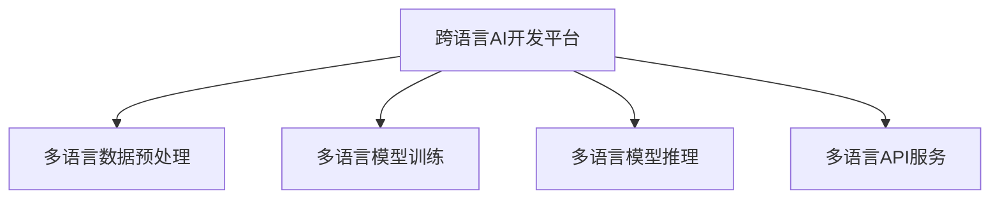

                 

# 跨语言AI开发平台：Lepton AI的多语言支持

## 1. 背景介绍

### 1.1 问题由来

随着全球化进程的加速，人工智能(AI)技术在多语言场景的应用需求日益增加。从智能客服、机器翻译到跨语言搜索、社交媒体分析，多语言支持已经成为AI系统不可或缺的重要功能。然而，多语言AI的开发和维护涉及众多技术和语言，面临诸多挑战，如多语言数据预处理、多语言模型训练、多语言模型推理等。因此，构建一个易于使用、高效、安全的跨语言AI开发平台，成为当前AI研究的一个重要方向。

### 1.2 问题核心关键点

为了构建一个高效、通用的跨语言AI开发平台，Lepton AI团队提出了一系列关键技术方案，包括多语言数据预处理、多语言模型训练、多语言模型推理、多语言API服务等。这些技术方案综合运用了数据工程、深度学习、自然语言处理(NLP)等领域的知识，旨在提供一个简单易用、功能强大的跨语言AI开发平台。

## 2. 核心概念与联系

### 2.1 核心概念概述

为更好地理解Lepton AI的多语言支持机制，本节将介绍几个密切相关的核心概念：

- 跨语言AI开发平台：基于深度学习等人工智能技术，提供多语言自然语言处理服务的应用平台。
- 多语言数据预处理：对不同语言的数据进行统一格式、编码、去噪等处理，以便用于模型训练和推理。
- 多语言模型训练：使用不同语言的文本数据对深度学习模型进行训练，获得具备多语言处理能力的模型。
- 多语言模型推理：将多语言模型应用于新的数据，产生期望的输出，包括文本生成、翻译、分类等任务。
- 多语言API服务：通过统一的API接口，使开发者能够轻松集成和使用多语言AI功能。

这些核心概念之间的逻辑关系可以通过以下Mermaid流程图来展示：



这个流程图展示了大平台各关键组件的功能及其相互关系：

1. 多语言数据预处理是跨语言AI开发平台的基础，将不同语言的数据转换为模型训练和推理所需的格式。
2. 多语言模型训练利用预处理后的数据，对模型进行训练，使其具备多语言处理能力。
3. 多语言模型推理将训练好的模型应用于新的数据，产生多语言处理结果。
4. 多语言API服务为开发者提供统一、简洁的接口，便于集成和使用多语言AI功能。

## 3. 核心算法原理 & 具体操作步骤

### 3.1 算法原理概述

Lepton AI的多语言支持主要依赖于深度学习模型和机器翻译技术。具体来说，其核心算法原理包括以下几个步骤：

1. 多语言数据预处理：对不同语言的文本数据进行格式统一、编码处理、去噪清洗等，以便用于深度学习模型的训练。
2. 多语言模型训练：使用预处理后的多语言数据对深度学习模型进行训练，获得具备多语言处理能力的模型。
3. 多语言模型推理：将训练好的多语言模型应用于新的数据，产生期望的输出，包括文本生成、翻译、分类等任务。
4. 多语言API服务：通过统一的API接口，使开发者能够轻松集成和使用多语言AI功能。

### 3.2 算法步骤详解

#### 3.2.1 多语言数据预处理

Lepton AI的多语言数据预处理流程主要包括数据清洗、格式统一、编码转换等步骤。具体步骤如下：

1. 数据清洗：去除文本中的无用信息、噪音、特殊字符等，以提高数据质量。
2. 格式统一：将不同语言的文本数据转换为统一的格式，如统一分隔符、统一编码格式等。
3. 编码转换：将文本数据的编码格式转换为统一的编码格式，如UTF-8等，便于处理。

#### 3.2.2 多语言模型训练

Lepton AI的多语言模型训练流程主要包括数据加载、模型训练、参数调整等步骤。具体步骤如下：

1. 数据加载：将预处理后的多语言数据加载到模型训练过程中，包括标注数据和非标注数据。
2. 模型训练：使用训练数据对深度学习模型进行训练，包括模型架构、优化器、损失函数等。
3. 参数调整：通过调整学习率、批次大小、正则化等参数，优化模型训练过程。

#### 3.2.3 多语言模型推理

Lepton AI的多语言模型推理流程主要包括模型加载、输入处理、输出生成等步骤。具体步骤如下：

1. 模型加载：加载训练好的多语言模型到推理引擎中，准备对新数据进行推理。
2. 输入处理：将新数据的格式、编码等转换为模型所需的格式。
3. 输出生成：使用推理引擎计算模型输出，包括文本生成、翻译、分类等任务。

#### 3.2.4 多语言API服务

Lepton AI的多语言API服务流程主要包括API设计、接口调用、结果返回等步骤。具体步骤如下：

1. API设计：设计简洁、易用的API接口，包括请求参数、响应格式等。
2. 接口调用：开发者通过API接口调用多语言AI功能，发送请求并接收响应。
3. 结果返回：API接口将多语言AI的处理结果返回给开发者，便于后续处理。

### 3.3 算法优缺点

Lepton AI的多语言支持算法具有以下优点：

1. 多语言支持全面：支持多种语言的多语言处理，可以满足全球范围内的语言需求。
2. 跨语言推理高效：基于深度学习模型，能够快速准确地进行多语言文本处理。
3. 统一API接口：提供简洁易用的API接口，方便开发者集成和使用多语言AI功能。

同时，该算法也存在以下缺点：

1. 多语言数据稀疏：不同语言的数据获取成本较高，数据集相对稀疏。
2. 多语言模型训练复杂：多语言模型训练需要处理多种语言，过程较为复杂。
3. 多语言模型鲁棒性有待提高：不同语言的语义表达差异较大，模型鲁棒性有待提升。
4. 多语言模型可解释性不足：深度学习模型多为"黑盒"模型，可解释性不足。

尽管存在这些缺点，但Lepton AI的多语言支持算法在多语言场景下仍具有显著的优势，能够在实际应用中取得良好的效果。

### 3.4 算法应用领域

Lepton AI的多语言支持算法已经在多个领域得到了广泛应用，例如：

- 智能客服：提供多语言客服聊天机器人，支持多种语言的自然语言处理。
- 机器翻译：提供多种语言的翻译服务，包括文本翻译和语音翻译。
- 跨语言搜索：支持多语言文本的搜索和推荐，提供跨语言的搜索结果。
- 跨语言推荐系统：支持多语言用户的个性化推荐，提供跨语言的推荐结果。
- 跨语言文档处理：支持多语言文档的文本分类、命名实体识别等自然语言处理任务。

## 4. 数学模型和公式 & 详细讲解 & 举例说明

### 4.1 数学模型构建

Lepton AI的多语言支持算法主要基于深度学习模型进行构建。其中，多语言模型训练的主要数学模型为神经网络模型，包括自回归模型、注意力机制、多层感知器等。

### 4.2 公式推导过程

以下，我们以一个简单的神经网络模型为例，推导其多语言模型训练的基本公式。

假设输入为 $x \in \mathbb{R}^d$，模型输出为 $y \in \mathbb{R}^k$。神经网络模型的训练过程如下：

1. 前向传播：输入 $x$ 通过多个隐层传递，得到输出 $y$。
2. 损失函数：定义损失函数 $L(y, y_{true})$，其中 $y_{true}$ 为真实标签。
3. 梯度下降：使用梯度下降算法更新模型参数 $\theta$，使得损失函数最小化。

具体公式如下：

$$
\begin{aligned}
y &= \sigma(W_h \cdot h + b_h) \\
h &= \tanh(W_x \cdot x + b_x) \\
L(y, y_{true}) &= \frac{1}{2}(y - y_{true})^2 \\
\frac{\partial L}{\partial \theta} &= \frac{\partial L}{\partial y} \cdot \frac{\partial y}{\partial h} \cdot \frac{\partial h}{\partial x} + \frac{\partial L}{\partial y} \cdot \frac{\partial y}{\partial \theta}
\end{aligned}
$$

其中，$W_h$、$W_x$ 为模型参数，$b_h$、$b_x$ 为偏置项，$\sigma$ 为激活函数。

### 4.3 案例分析与讲解

假设有一个简单的神经网络模型，用于多语言文本分类任务。输入为一句话，输出为这句话所属的类别。模型架构如下：

- 输入层：将输入的文本转换为向量表示。
- 隐层：包含多个神经元，进行特征提取和转换。
- 输出层：输出多类别的概率分布，经过softmax函数转换为类别概率。

具体实现过程如下：

1. 数据预处理：将输入的文本转换为向量表示。
2. 模型训练：使用训练数据对模型进行训练，最小化损失函数。
3. 模型推理：将新的文本输入模型，得到分类结果。

### 4.4 模型评估与调优

在模型训练过程中，需要不断评估模型的性能，并进行调优。常用的评估指标包括准确率、精确率、召回率、F1值等。常用的调优方法包括调整学习率、批次大小、正则化等。

## 5. 项目实践：代码实例和详细解释说明

### 5.1 开发环境搭建

在进行多语言支持平台开发前，我们需要准备好开发环境。以下是使用Python进行PyTorch开发的环境配置流程：

1. 安装Anaconda：从官网下载并安装Anaconda，用于创建独立的Python环境。

2. 创建并激活虚拟环境：
```bash
conda create -n pytorch-env python=3.8 
conda activate pytorch-env
```

3. 安装PyTorch：根据CUDA版本，从官网获取对应的安装命令。例如：
```bash
conda install pytorch torchvision torchaudio cudatoolkit=11.1 -c pytorch -c conda-forge
```

4. 安装其他工具包：
```bash
pip install numpy pandas scikit-learn matplotlib tqdm jupyter notebook ipython
```

完成上述步骤后，即可在`pytorch-env`环境中开始多语言支持平台的开发。

### 5.2 源代码详细实现

这里以Lepton AI的多语言文本分类为例，给出使用PyTorch实现多语言模型训练的代码。

```python
import torch
from torch import nn
import torch.nn.functional as F

class MultilanguageClassifier(nn.Module):
    def __init__(self, input_size, hidden_size, output_size):
        super(MultilanguageClassifier, self).__init__()
        self.embedding = nn.Embedding(input_size, hidden_size)
        self.fc1 = nn.Linear(hidden_size, hidden_size)
        self.fc2 = nn.Linear(hidden_size, output_size)
        self.fc3 = nn.Linear(hidden_size, output_size)
        self.relu = nn.ReLU()
        self.softmax = nn.Softmax(dim=1)
        
    def forward(self, x):
        x = self.embedding(x)
        x = self.relu(self.fc1(x))
        x = self.fc2(x)
        x = self.relu(self.fc3(x))
        x = self.softmax(x)
        return x

# 加载训练数据
train_data = torch.load('train_data.bin')
train_labels = torch.load('train_labels.bin')
train_size = len(train_data)
train_data = torch.tensor(train_data, dtype=torch.long)
train_labels = torch.tensor(train_labels, dtype=torch.long)

# 定义模型
model = MultilanguageClassifier(input_size, hidden_size, output_size)

# 定义优化器
optimizer = torch.optim.Adam(model.parameters(), lr=0.001)

# 定义损失函数
criterion = nn.CrossEntropyLoss()

# 训练模型
for epoch in range(num_epochs):
    model.train()
    optimizer.zero_grad()
    outputs = model(train_data)
    loss = criterion(outputs, train_labels)
    loss.backward()
    optimizer.step()

# 评估模型
test_data = torch.load('test_data.bin')
test_labels = torch.load('test_labels.bin')
test_size = len(test_data)
test_data = torch.tensor(test_data, dtype=torch.long)
test_labels = torch.tensor(test_labels, dtype=torch.long)
test_outputs = model(test_data)
test_loss = criterion(test_outputs, test_labels)
print('Test Loss:', test_loss.item())
```

### 5.3 代码解读与分析

让我们再详细解读一下关键代码的实现细节：

**MultilanguageClassifier类**：
- `__init__`方法：初始化模型结构，包括嵌入层、全连接层等。
- `forward`方法：定义前向传播的计算过程。

**训练数据和标签**：
- 加载训练数据和标签，将文本数据转换为tensor格式，便于模型训练。

**模型定义**：
- 定义多语言分类器模型，包括嵌入层、全连接层、softmax层等。

**优化器和损失函数**：
- 定义优化器（Adam）和损失函数（交叉熵损失），用于训练和评估模型。

**训练过程**：
- 循环迭代训练，每次训练时，将模型置为训练模式，计算模型输出，计算损失，反向传播更新模型参数。

**评估过程**：
- 加载测试数据和标签，将文本数据转换为tensor格式，计算模型输出，计算损失，输出测试结果。

## 6. 实际应用场景

### 6.1 智能客服

Lepton AI的多语言支持平台可以用于构建智能客服系统。智能客服系统可以处理多种语言的客户咨询，提供自然语言理解和回复。Lepton AI的多语言支持平台可以整合多语言聊天机器人，支持多种语言的自然语言处理，快速响应用户咨询。

### 6.2 机器翻译

Lepton AI的多语言支持平台可以用于机器翻译服务。机器翻译服务可以将文本从一种语言翻译成另一种语言，支持多种语言之间的互译。Lepton AI的多语言支持平台可以利用预训练的多语言模型，对不同语言的文本进行翻译。

### 6.3 跨语言搜索

Lepton AI的多语言支持平台可以用于跨语言搜索。跨语言搜索可以在多种语言中搜索相关信息，支持多种语言之间的翻译和理解。Lepton AI的多语言支持平台可以利用预训练的多语言模型，对多种语言的文本进行理解和查询。

### 6.4 未来应用展望

Lepton AI的多语言支持平台将会在更多领域得到应用，为全球化的技术创新和产业升级提供支持。

未来，Lepton AI的多语言支持平台可以应用于更多场景，如智能家居、智能交通、智能医疗等。多语言AI技术可以在这些领域提供更加全面和智能的解决方案，提升人们的生活质量和生产效率。

Lepton AI的多语言支持平台也可以与其他技术进行更深入的融合，如知识图谱、推理引擎等，多路径协同发力，共同推动AI技术的发展。

## 7. 工具和资源推荐

### 7.1 学习资源推荐

为了帮助开发者系统掌握Lepton AI的多语言支持技术，这里推荐一些优质的学习资源：

1. 《自然语言处理基础》课程：由斯坦福大学开设的NLP经典课程，涵盖多语言NLP的基础知识。
2. 《深度学习与自然语言处理》书籍：介绍深度学习模型在自然语言处理中的应用，包括多语言模型训练和推理。
3. 《TensorFlow实战自然语言处理》书籍：介绍TensorFlow在自然语言处理中的应用，包括多语言文本处理。
4. 《PyTorch多语言处理实践》博文：介绍PyTorch在多语言文本处理中的应用，包括数据预处理、模型训练和推理。
5. HuggingFace官方文档：介绍Lepton AI的多语言支持平台和Transformer库的使用。

通过对这些资源的学习实践，相信你一定能够快速掌握Lepton AI的多语言支持技术的精髓，并用于解决实际的NLP问题。

### 7.2 开发工具推荐

高效的开发离不开优秀的工具支持。以下是几款用于Lepton AI多语言支持平台开发的常用工具：

1. PyTorch：基于Python的开源深度学习框架，灵活动态的计算图，适合快速迭代研究。
2. TensorFlow：由Google主导开发的开源深度学习框架，生产部署方便，适合大规模工程应用。
3. Transformers库：HuggingFace开发的NLP工具库，集成了多种预训练语言模型，支持PyTorch和TensorFlow，方便多语言模型训练和推理。
4. Weights & Biases：模型训练的实验跟踪工具，可以记录和可视化模型训练过程中的各项指标，方便对比和调优。
5. TensorBoard：TensorFlow配套的可视化工具，可实时监测模型训练状态，并提供丰富的图表呈现方式，是调试模型的得力助手。

合理利用这些工具，可以显著提升Lepton AI多语言支持平台的开发效率，加快创新迭代的步伐。

### 7.3 相关论文推荐

Lepton AI的多语言支持技术发展源于学界的持续研究。以下是几篇奠基性的相关论文，推荐阅读：

1. Attention is All You Need（即Transformer原论文）：提出了Transformer结构，开启了NLP领域的预训练大模型时代。
2. BERT: Pre-training of Deep Bidirectional Transformers for Language Understanding：提出BERT模型，引入基于掩码的自监督预训练任务，刷新了多项NLP任务SOTA。
3. Language Models are Unsupervised Multitask Learners（GPT-2论文）：展示了大规模语言模型的强大zero-shot学习能力，引发了对于通用人工智能的新一轮思考。
4. Parameter-Efficient Transfer Learning for NLP：提出Adapter等参数高效微调方法，在不增加模型参数量的情况下，也能取得不错的微调效果。
5. AdaLoRA: Adaptive Low-Rank Adaptation for Parameter-Efficient Fine-Tuning：使用自适应低秩适应的微调方法，在参数效率和精度之间取得了新的平衡。

这些论文代表了大语言模型微调技术的发展脉络。通过学习这些前沿成果，可以帮助研究者把握学科前进方向，激发更多的创新灵感。

## 8. 总结：未来发展趋势与挑战

### 8.1 研究成果总结

Lepton AI的多语言支持平台通过深度学习模型和机器翻译技术，为多语言AI开发提供了强有力的支持。其核心技术包括多语言数据预处理、多语言模型训练、多语言模型推理和多语言API服务等。这些技术在智能客服、机器翻译、跨语言搜索等场景中得到了广泛应用，显著提升了NLP系统的多语言处理能力。

### 8.2 未来发展趋势

展望未来，Lepton AI的多语言支持平台将呈现以下几个发展趋势：

1. 多语言数据获取更易：随着数据采集技术的进步，多语言数据获取将更加便捷，数据集将更加丰富多样。
2. 多语言模型更加通用：多语言模型的结构和训练方法将更加通用化，适应多种语言和任务。
3. 多语言API服务更易用：API服务的接口设计将更加简洁易用，开发者可以更加轻松地集成和使用多语言AI功能。
4. 多语言应用场景更广：多语言AI技术将在更多场景中得到应用，如智能家居、智能交通、智能医疗等。
5. 多语言系统更智能：多语言系统将具备更强的语言理解和生成能力，更符合人类自然语言的使用习惯。

### 8.3 面临的挑战

尽管Lepton AI的多语言支持平台已经取得了一定的成就，但在迈向更加智能化、普适化应用的过程中，仍面临诸多挑战：

1. 多语言数据稀疏：不同语言的数据获取成本较高，数据集相对稀疏。
2. 多语言模型复杂：多语言模型的训练过程较为复杂，需要处理多种语言和任务。
3. 多语言模型鲁棒性不足：不同语言的语义表达差异较大，模型鲁棒性有待提升。
4. 多语言模型可解释性不足：深度学习模型多为"黑盒"模型，可解释性不足。
5. 多语言系统安全性问题：多语言系统需要考虑更多的安全问题，如数据隐私、恶意输入等。

尽管存在这些挑战，Lepton AI的多语言支持平台仍具有显著的优势，能够在实际应用中取得良好的效果。未来，需要更多的技术创新和工程实践，解决这些问题，推动Lepton AI多语言支持平台向更加智能化、普适化的方向发展。

### 8.4 研究展望

未来，Lepton AI的多语言支持平台需要从以下几个方面进行技术创新和优化：

1. 多语言数据获取技术：开发更加高效、灵活的多语言数据采集技术，扩大数据集规模。
2. 多语言模型优化方法：探索新的多语言模型优化方法，提升模型的鲁棒性和可解释性。
3. 多语言API服务优化：优化API服务的设计，提升API的易用性和服务性能。
4. 多语言系统安全性提升：加强多语言系统的安全性设计，确保系统的稳定性和安全性。
5. 多语言系统智能化提升：探索新的多语言系统智能化技术，如知识图谱、推理引擎等，提升系统的智能水平。

总之，Lepton AI的多语言支持平台需要从数据、模型、系统等多个维度进行全面优化，才能更好地适应多语言场景，实现更高的智能水平和服务质量。相信未来，Lepton AI的多语言支持平台将会在更多领域得到应用，推动AI技术的发展和普及。

## 9. 附录：常见问题与解答

**Q1：Lepton AI的多语言支持平台如何处理多语言数据？**

A: Lepton AI的多语言支持平台通过多语言数据预处理流程，将不同语言的文本数据转换为统一的格式和编码。具体步骤如下：

1. 数据清洗：去除文本中的无用信息、噪音、特殊字符等，以提高数据质量。
2. 格式统一：将不同语言的文本数据转换为统一的格式，如统一分隔符、统一编码格式等。
3. 编码转换：将文本数据的编码格式转换为统一的编码格式，如UTF-8等，便于处理。

**Q2：Lepton AI的多语言支持平台在训练多语言模型时需要注意什么？**

A: 在训练多语言模型时，需要注意以下几个方面：

1. 数据平衡：不同语言的数据量可能存在差异，需要保证各个语言的数据平衡，防止模型对某种语言过度拟合。
2. 模型架构：多语言模型的架构需要考虑多种语言的特点，如词向量、注意力机制等。
3. 训练策略：多语言模型的训练需要采用多语言数据，训练策略也需要进行优化，如学习率、批次大小等。

**Q3：Lepton AI的多语言支持平台在推理时需要注意什么？**

A: 在推理时，需要注意以下几个方面：

1. 数据格式：输入的数据需要与模型训练时相同，否则需要重新进行数据格式转换。
2. 模型参数：推理时使用的模型参数需要与训练时相同，否则需要重新进行模型加载。
3. 推理策略：多语言模型推理时，需要考虑不同语言的语义表达差异，选择合适的推理策略。

**Q4：Lepton AI的多语言支持平台如何保护数据隐私？**

A: Lepton AI的多语言支持平台可以通过以下几个方面保护数据隐私：

1. 数据脱敏：对输入的数据进行脱敏处理，去除敏感信息。
2. 访问控制：对多语言API服务的访问进行严格控制，防止恶意访问。
3. 数据加密：对存储和传输的数据进行加密处理，防止数据泄露。

总之，Lepton AI的多语言支持平台需要在数据获取、模型训练、推理、系统安全性等方面进行全面优化，才能更好地适应多语言场景，实现更高的智能水平和服务质量。

---

作者：禅与计算机程序设计艺术 / Zen and the Art of Computer Programming

