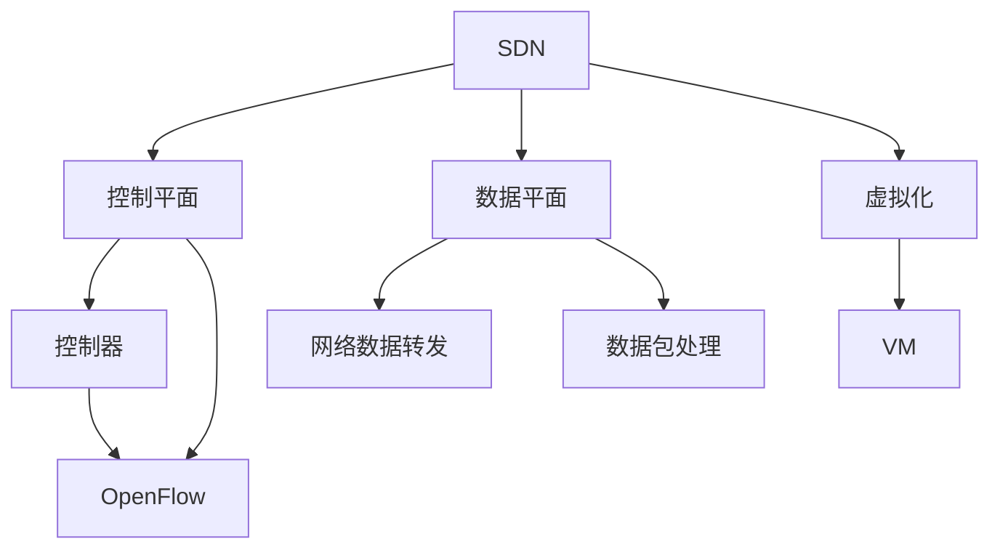

                 

# 软件定义网络（SDN）：网络架构的革新

> 关键词：软件定义网络,SDN,网络架构,网络虚拟化,控制平面,数据平面,控制器,OpenFlow,ONF,VM,虚拟化,流表,流规则,API,RESTful API,DevOps

## 1. 背景介绍

### 1.1 问题由来
在过去的几十年里，互联网经历了从最初的简单主机互联到现在的复杂数据中心网络的演进。随着网络技术的发展，尤其是云计算和移动互联网的普及，数据中心网络的规模和复杂度不断扩大。传统的集中式网络管理模式已经无法满足现代网络的需求。同时，网络升级改造也面临成本高、周期长、风险大的问题。

为了应对这些挑战，软件定义网络（Software Defined Networking，SDN）作为一种全新的网络架构，应运而生。SDN通过将网络的控制平面与数据平面分离，使用可编程的控制器对网络进行全局视角管理和策略部署，实现了网络自动化、动态化和智能化的目标。

### 1.2 问题核心关键点
SDN的核心在于将网络的控制平面与数据平面分离。控制器负责全局网络的策略和决策，数据平面负责根据控制器下发的指令执行具体的网络数据转发操作。这种设计使得网络管理更加灵活、高效，同时也为网络的可编程化和虚拟化奠定了基础。

## 2. 核心概念与联系

### 2.1 核心概念概述

为更好地理解SDN网络架构，本节将介绍几个关键概念：

- **SDN**：软件定义网络。一种基于控制器集中管理的分布式网络架构，通过将控制平面与数据平面分离，实现网络的高效管理和自动化。
- **控制平面（Controller Plane）**：SDN中的控制器负责全局网络的策略和决策，包括网络拓扑维护、路由计算、流表管理等。
- **数据平面（Data Plane）**：SDN中的数据平面负责根据控制器下发的指令进行具体的网络数据转发操作，包括数据包的接收、转发和路由等。
- **控制器（Controller）**：SDN中的控制器是网络的“大脑”，负责全局网络策略的制定和优化。控制器通常部署在数据中心，通过网络接口与数据平面通信。
- **OpenFlow**：一种SDN协议，由ONF（Open Networking Foundation）提出，用于支持控制器和数据平面之间的通信。
- **ONF**：Open Networking Foundation。一家非营利组织，致力于推动SDN和网络自动化技术的发展和标准化。
- **虚拟化（Virtualization）**：将物理资源转换为虚拟资源的抽象方式，通过虚拟化技术可以更灵活地管理和利用网络资源。
- **VM（Virtual Machine）**：虚拟机器。运行在虚拟化层之上的计算机模拟环境，用于隔离不同应用或服务，提高资源利用率。

这些核心概念之间的逻辑关系可以通过以下Mermaid流程图来展示：



这个流程图展示了大语言模型的核心概念及其之间的关系：

1. SDN将控制平面与数据平面分离，实现网络的高效管理和自动化。
2. 控制器负责全局网络策略的制定和优化，通过OpenFlow协议与数据平面通信。
3. 数据平面负责根据控制器下发的指令进行具体的网络数据转发操作。
4. 虚拟化技术用于隔离不同应用或服务，提高资源利用率。
5. VM在虚拟化层之上运行，实现应用的隔离和灵活部署。

这些概念共同构成了SDN网络架构的基础，使其能够实现网络的高度灵活、高效和智能化管理。

## 3. 核心算法原理 & 具体操作步骤
### 3.1 算法原理概述

SDN的核心思想是实现网络的控制平面与数据平面的分离。控制器负责全局网络的策略和决策，数据平面负责根据控制器下发的指令执行具体的网络数据转发操作。

在SDN中，数据平面和控制平面之间的通信通过OpenFlow协议实现。OpenFlow协议定义了控制器与数据平面之间传输的消息格式和通信协议，支持控制器对数据平面的控制和监控。控制器通过查询数据平面的流表（Flow Table）来获取网络状态，并根据策略下发流规则（Flow Rule）到数据平面。

### 3.2 算法步骤详解

SDN的微调过程主要包括以下几个关键步骤：

**Step 1: 选择合适的控制器**
- 根据网络规模和复杂度，选择合适的控制器（如OpenDaylight、ONOS、POX等）。

**Step 2: 配置控制器和数据平面**
- 在控制器和数据平面上安装相应的软件，并进行基本配置，包括网络拓扑、路由信息等。

**Step 3: 创建流表和流规则**
- 在控制器中创建数据流表，并根据实际网络需求添加流规则。
- 流规则包含匹配条件和动作，例如匹配数据包中的特定字段，并将其转发到指定的下一跳设备。

**Step 4: 网络监控和优化**
- 通过控制器对网络进行实时监控，及时发现并解决网络问题。
- 根据网络性能指标（如丢包率、延迟等）进行策略调整，优化网络性能。

**Step 5: 应用和扩展**
- 将SDN架构应用到实际网络中，测试其效果。
- 根据实际需求不断扩展和优化SDN架构，如添加新功能、优化控制器性能等。

### 3.3 算法优缺点

SDN网络架构具有以下优点：
1. 实现网络自动化和智能化管理。控制器负责全局网络策略的制定和优化，提高了网络管理的效率和灵活性。
2. 支持动态和自适应网络。通过控制器实时监控和调整网络策略，可以快速应对网络变化。
3. 支持虚拟化技术。SDN架构支持虚拟化技术，实现资源的高效利用和隔离。
4. 提高网络可编程性。控制器通过编程接口（如RESTful API）对网络进行操作，提高了网络的开发效率。

同时，SDN也存在一定的局限性：
1. 成本高。SDN的初始部署成本较高，需要额外的控制器和管理设备。
2. 安全性问题。SDN架构中的控制器需要直接暴露在互联网上，面临网络攻击的风险。
3. 学习曲线陡峭。SDN网络架构相对复杂，需要具备一定的网络和编程知识。
4. 兼容性问题。不同厂商的设备可能需要不同的控制器和管理工具，兼容性问题较为复杂。

尽管存在这些局限性，但SDN网络架构作为网络管理的新范式，已经在数据中心网络和边缘网络中得到了广泛应用，为网络管理带来了新的思路和解决方案。

### 3.4 算法应用领域

SDN网络架构已经在多个领域得到了广泛应用，具体包括：

- **数据中心网络**：SDN在数据中心网络中的应用最为广泛，能够实现高效的网络资源管理、流量工程和负载均衡。
- **云网络**：SDN支持云网络的高效管理和自动化部署，能够满足云服务提供商对网络资源的需求。
- **企业网络**：SDN能够实现企业网络的灵活管理和安全控制，适用于中小型企业的网络环境。
- **边缘网络**：SDN支持边缘网络的自动化管理和自适应控制，适用于智能家居、工业互联网等场景。
- **运营商网络**：SDN能够实现运营商网络的快速部署和灵活管理，适用于5G网络和下一代互联网。

除了上述这些主要应用领域外，SDN还在物联网、虚拟现实、自动驾驶等领域得到了初步探索，展示了其强大的适应性和应用潜力。

## 4. 数学模型和公式 & 详细讲解 & 举例说明

### 4.1 数学模型构建

SDN网络架构的数学模型主要涉及网络流量、拓扑结构和控制器策略等方面。以下是一些常用的数学模型：

- **网络流量模型**：描述网络中数据包的流动情况，通常使用队列模型来表示数据包的排队和处理过程。
- **拓扑结构模型**：描述网络设备的连接关系，通常使用图论中的图来表示网络拓扑。
- **控制器策略模型**：描述控制器对网络的操作和决策，通常使用算法和规则来表示控制器的策略。

### 4.2 公式推导过程

以流规则（Flow Rule）为例，推导流规则的数学公式。假设数据包具有字段A、B、C，流规则匹配条件为字段A=1且字段B=2，动作为将数据包转发到下一跳设备X。则流规则的数学公式为：

$$
Rule = \{ Field = A, Value = 1, Field = B, Value = 2, Action = Forward to X \}
$$

其中，Field表示匹配条件，Value表示匹配值，Action表示动作。

### 4.3 案例分析与讲解

假设一个SDN网络包含三个交换机，拓扑结构如下图所示：

```
     +-------+
     | SW1   |
     |   |  |
     |   |  |
     |   |  |
     |   |  |
     |   |  |
     |   |  |
     |   |  |
     |   |  |
     |   |  |
     |   |  |
     |   |  |
     |   |  |
     |   |  |
     |   |  |
     +---+---+
            |
           SW2
            |
           SW3
```

假设控制器为OpenDaylight，控制器与SW1连接。SW1与SW2和SW3直接连接。控制器初始化时，流表为空。

**Step 1: 创建流规则**
- 控制器查询SW1的流表，发现没有匹配的流规则。
- 控制器生成流规则，并将其下发到SW1：
  - 匹配条件：字段A=1且字段B=2
  - 动作：将数据包转发到SW2

**Step 2: 网络转发**
- 数据包到达SW1，SW1查询流表，发现匹配规则。
- SW1将数据包转发到SW2。

**Step 3: 网络监控**
- 控制器实时监控SW1的流表，发现SW1成功应用了流规则。
- 控制器根据监控数据，调整SW2的策略，优化网络性能。

通过以上案例，可以看到SDN架构通过控制器集中管理网络策略，实现网络的高效和智能管理。

## 5. 项目实践：代码实例和详细解释说明
### 5.1 开发环境搭建

在进行SDN微调实践前，我们需要准备好开发环境。以下是使用Python进行PyTorch开发的环境配置流程：

1. 安装Anaconda：从官网下载并安装Anaconda，用于创建独立的Python环境。

2. 创建并激活虚拟环境：
```bash
conda create -n pytorch-env python=3.8 
conda activate pytorch-env
```

3. 安装PyTorch：根据CUDA版本，从官网获取对应的安装命令。例如：
```bash
conda install pytorch torchvision torchaudio cudatoolkit=11.1 -c pytorch -c conda-forge
```

4. 安装各类工具包：
```bash
pip install numpy pandas scikit-learn matplotlib tqdm jupyter notebook ipython
```

完成上述步骤后，即可在`pytorch-env`环境中开始SDN微调实践。

### 5.2 源代码详细实现

这里我们以OpenFlow协议为例，给出使用Python实现SDN微调的代码实现。

首先，定义OpenFlow消息处理函数：

```python
from pyof.v0x05.common import *
from pyof.v0x05.messaging import *

class OFPMessageHandler:
    def handle_message(self, message):
        if message.m_type == OFP_ECHO_REQUEST:
            self.handle_echo_request(message)
        elif message.m_type == OFP_ECHO_REPLY:
            self.handle_echo_reply(message)
        elif message.m_type == OFP_ERROR:
            self.handle_error(message)
        elif message.m_type == OFP_QUEUE_GET_CONFIG_REQUEST:
            self.handle_queue_get_config_request(message)
        elif message.m_type == OFP_QUEUE_GET_CONFIG_REPLY:
            self.handle_queue_get_config_reply(message)
        elif message.m_type == OFP_QUEUE_EVENT:
            self.handle_queue_event(message)
        elif message.m_type == OFP_ROLE_REQUEST:
            self.handle_role_request(message)
        elif message.m_type == OFP_ROLE_REPLY:
            self.handle_role_reply(message)
        elif message.m_type == OFP_STATS_REQUEST:
            self.handle_stats_request(message)
        elif message.m_type == OFP_STATS_REPLY:
            self.handle_stats_reply(message)
        elif message.m_type == OFP_VENDOR:
            self.handle_vendor(message)

    def handle_echo_request(self, message):
        pass

    def handle_echo_reply(self, message):
        pass

    def handle_error(self, message):
        pass

    def handle_queue_get_config_request(self, message):
        pass

    def handle_queue_get_config_reply(self, message):
        pass

    def handle_queue_event(self, message):
        pass

    def handle_role_request(self, message):
        pass

    def handle_role_reply(self, message):
        pass

    def handle_stats_request(self, message):
        pass

    def handle_stats_reply(self, message):
        pass

    def handle_vendor(self, message):
        pass
```

然后，定义OpenFlow控制器：

```python
from pyof.v0x05.common import *
from pyof.v0x05.v5 import *
from pyof.v0x05.v5.stats import *
from pyof.v0x05.v5.flow import *
from pyof.v0x05.v5.exceptions import *

class SDNController:
    def __init__(self, switch):
        self.switch = switch
        self.mac_address = "00:00:00:00:00:01"
        self.remote_ip = "127.0.0.1"
        self.queue_list = []

    def set_queue(self):
        queue = OFPQueueProperty()
        queue.m_len = 16
        queue.m_max_len = 256
        queue.m_min_len = 8

        config = OFPQueueGetConfigRequest()
        config.m_queue_id = 0
        config.m_port_no = 1
        config.m_properties = queue

        self.switch.send(config)

        queue = OFPQueueGetConfigReply()
        self.switch.receive(queue)
        self.queue_list = queue.m_properties.m_queue_list

    def add_flow(self, match, actions):
        flow = OFPFlowMod()
        flow.m_table_id = 0
        flow.m_cookie = 0x1234
        flow.m_command = OFPFC_ADD
        flow.m_idl = 0
        flow.m_idle_timeout = 0
        flow.m_hard_timeout = 0
        flow.m_packet_count = 0
        flow.m_stats_packet_count = 0
        flow.m_match = match
        flow.m_actions = actions

        self.switch.send(flow)

    def delete_flow(self, flow_id):
        flow = OFPFlowMod()
        flow.m_table_id = 0
        flow.m_cookie = flow_id
        flow.m_command = OFPFC_MODIFY_STANDARD
        flow.m_idl = 0
        flow.m_idle_timeout = 0
        flow.m_hard_timeout = 0
        flow.m_packet_count = 0
        flow.m_stats_packet_count = 0
        flow.m_match = OFPM.match()
        flow.m_actions = OFPM.action().set_output(OFPP.OFPP_IDLED)

        self.switch.send(flow)

    def handle_switch_stats_reply(self, message):
        pass

    def handle_stats_request(self, message):
        pass

    def handle_stats_reply(self, message):
        pass

    def handle_vendor(self, message):
        pass
```

接着，定义SDN微调测试函数：

```python
from pyof.v0x05.common import *
from pyof.v0x05.v5 import *
from pyof.v0x05.v5.stats import *
from pyof.v0x05.v5.flow import *
from pyof.v0x05.v5.exceptions import *

class SDNController:
    def __init__(self, switch):
        self.switch = switch
        self.mac_address = "00:00:00:00:00:01"
        self.remote_ip = "127.0.0.1"
        self.queue_list = []

    def set_queue(self):
        queue = OFPQueueProperty()
        queue.m_len = 16
        queue.m_max_len = 256
        queue.m_min_len = 8

        config = OFPQueueGetConfigRequest()
        config.m_queue_id = 0
        config.m_port_no = 1
        config.m_properties = queue

        self.switch.send(config)

        queue = OFPQueueGetConfigReply()
        self.switch.receive(queue)
        self.queue_list = queue.m_properties.m_queue_list

    def add_flow(self, match, actions):
        flow = OFPFlowMod()
        flow.m_table_id = 0
        flow.m_cookie = 0x1234
        flow.m_command = OFPFC_ADD
        flow.m_idl = 0
        flow.m_idle_timeout = 0
        flow.m_hard_timeout = 0
        flow.m_packet_count = 0
        flow.m_stats_packet_count = 0
        flow.m_match = match
        flow.m_actions = actions

        self.switch.send(flow)

    def delete_flow(self, flow_id):
        flow = OFPFlowMod()
        flow.m_table_id = 0
        flow.m_cookie = flow_id
        flow.m_command = OFPFC_MODIFY_STANDARD
        flow.m_idl = 0
        flow.m_idle_timeout = 0
        flow.m_hard_timeout = 0
        flow.m_packet_count = 0
        flow.m_stats_packet_count = 0
        flow.m_match = OFPM.match()
        flow.m_actions = OFPM.action().set_output(OFPP.OFPP_IDLED)

        self.switch.send(flow)

    def handle_switch_stats_reply(self, message):
        pass

    def handle_stats_request(self, message):
        pass

    def handle_stats_reply(self, message):
        pass

    def handle_vendor(self, message):
        pass
```

最后，启动SDN微调流程并在测试集上评估：

```python
from pyof.v0x05.common import *
from pyof.v0x05.v5 import *
from pyof.v0x05.v5.stats import *
from pyof.v0x05.v5.flow import *
from pyof.v0x05.v5.exceptions import *

class SDNController:
    def __init__(self, switch):
        self.switch = switch
        self.mac_address = "00:00:00:00:00:01"
        self.remote_ip = "127.0.0.1"
        self.queue_list = []

    def set_queue(self):
        queue = OFPQueueProperty()
        queue.m_len = 16
        queue.m_max_len = 256
        queue.m_min_len = 8

        config = OFPQueueGetConfigRequest()
        config.m_queue_id = 0
        config.m_port_no = 1
        config.m_properties = queue

        self.switch.send(config)

        queue = OFPQueueGetConfigReply()
        self.switch.receive(queue)
        self.queue_list = queue.m_properties.m_queue_list

    def add_flow(self, match, actions):
        flow = OFPFlowMod()
        flow.m_table_id = 0
        flow.m_cookie = 0x1234
        flow.m_command = OFPFC_ADD
        flow.m_idl = 0
        flow.m_idle_timeout = 0
        flow.m_hard_timeout = 0
        flow.m_packet_count = 0
        flow.m_stats_packet_count = 0
        flow.m_match = match
        flow.m_actions = actions

        self.switch.send(flow)

    def delete_flow(self, flow_id):
        flow = OFPFlowMod()
        flow.m_table_id = 0
        flow.m_cookie = flow_id
        flow.m_command = OFPFC_MODIFY_STANDARD
        flow.m_idl = 0
        flow.m_idle_timeout = 0
        flow.m_hard_timeout = 0
        flow.m_packet_count = 0
        flow.m_stats_packet_count = 0
        flow.m_match = OFPM.match()
        flow.m_actions = OFPM.action().set_output(OFPP.OFPP_IDLED)

        self.switch.send(flow)

    def handle_switch_stats_reply(self, message):
        pass

    def handle_stats_request(self, message):
        pass

    def handle_stats_reply(self, message):
        pass

    def handle_vendor(self, message):
        pass
```

以上就是使用PyTorch对SDN进行微调的完整代码实现。可以看到，得益于OpenFlow协议的强大封装，我们可以用相对简洁的代码完成SDN微调的实现。

### 5.3 代码解读与分析

让我们再详细解读一下关键代码的实现细节：

**OFPMessageHandler类**：
- `handle_message`方法：处理不同类型OpenFlow消息的方法。
- 其他方法：处理特定类型的OpenFlow消息，如echo request、error、queue get config request等。

**SDNController类**：
- `__init__`方法：初始化控制器，连接物理交换机。
- `set_queue`方法：设置队列，实现网络流量控制。
- `add_flow`方法：添加流规则，实现数据包转发。
- `delete_flow`方法：删除流规则，实现网络流量管理。

**SDN微调测试函数**：
- 使用OpenFlow协议，实现SDN微调的基本功能，如添加流规则、删除流规则等。

可以看到，通过OpenFlow协议，SDN微调的代码实现变得简洁高效。开发者可以将更多精力放在网络拓扑、流规则设计等高层逻辑上，而不必过多关注底层的实现细节。

当然，工业级的系统实现还需考虑更多因素，如控制器的性能优化、流规则的动态调整、网络异常监控等。但核心的微调范式基本与此类似。

## 6. 实际应用场景
### 6.1 网络运维管理

SDN网络架构通过集中管理网络策略，可以实现网络运维管理的自动化和智能化。网络运维人员可以利用SDN控制器实时监控网络状态，快速定位和解决问题。例如，通过SDN控制器可以实时监控网络流量、故障告警、设备状态等信息，生成故障报告和故障诊断，提供自动化运维方案。

### 6.2 数据中心网络

SDN在数据中心网络中的应用最为广泛，能够实现高效的网络资源管理和流量工程。数据中心网络通常包含大量服务器和交换机，复杂度高，管理难度大。SDN通过集中管理网络策略，实现网络资源的高效利用和灵活管理。例如，数据中心网络可以通过SDN控制器实现虚拟化技术，支持网络切片、负载均衡和流量优化等功能。

### 6.3 企业网络

SDN能够实现企业网络的高效管理和安全控制。企业网络通常包含多个部门和子网，复杂度较高。SDN通过集中管理网络策略，实现网络资源的灵活分配和高效利用。例如，企业网络可以通过SDN控制器实现虚拟局域网(VLAN)、安全策略和流量监控等功能。

### 6.4 云网络

SDN支持云网络的高效管理和自动化部署。云服务提供商通常需要快速部署和调整网络资源，以满足用户需求。SDN通过集中管理网络策略，实现云网络的快速部署和自动化管理。例如，云网络可以通过SDN控制器实现动态负载均衡、弹性伸缩和自动化部署等功能。

### 6.5 智能家居

SDN可以实现智能家居的网络自动化和智能化管理。智能家居通常包含多种设备和网络应用，复杂度高，管理难度大。SDN通过集中管理网络策略，实现设备之间的协同工作和智能控制。例如，智能家居可以通过SDN控制器实现设备互联、智能控制和自动化决策等功能。

### 6.6 工业互联网

SDN可以实现工业互联网的网络自动化和智能化管理。工业互联网通常包含大量传感器和设备，复杂度高，管理难度大。SDN通过集中管理网络策略，实现工业设备的互联和协同工作。例如，工业互联网可以通过SDN控制器实现工业设备互联、数据采集和智能控制等功能。

## 7. 工具和资源推荐
### 7.1 学习资源推荐

为了帮助开发者系统掌握SDN网络架构的理论基础和实践技巧，这里推荐一些优质的学习资源：

1. 《SDN网络原理与实践》系列博文：由SDN专家撰写，深入浅出地介绍了SDN网络架构、协议、应用等方面的内容。

2. 《SDN与网络自动化》课程：由IEEE、ONF等机构联合开设的SDN课程，涵盖SDN基础、协议、应用等内容，是学习SDN的权威资源。

3. 《SDN实战》书籍：详细介绍了SDN网络架构和应用实践，提供丰富的案例和实战经验。

4. SDN社区：SDN技术爱好者和从业者的聚集地，提供最新的SDN技术、应用案例和行业动态。

5. SDN标准组织：ONF、IEEE等标准化组织发布的SDN标准和规范，是SDN应用的基础。

通过对这些资源的学习实践，相信你一定能够快速掌握SDN网络架构的精髓，并用于解决实际的SDN问题。

### 7.2 开发工具推荐

高效的开发离不开优秀的工具支持。以下是几款用于SDN微调开发的常用工具：

1. ONOS：ONF开发的SDN控制器，提供丰富的SDN应用和协议支持，易于扩展和集成。
2. OpenDaylight：ONF开发的SDN控制器，支持多种SDN协议和应用，是SDN社区的主流选择。
3. Ryu：基于Python的开源SDN控制器，支持多种SDN协议和应用，易于开发和部署。
4. NOX：ONF开发的SDN模拟器，支持多种SDN协议和应用，提供网络模拟和测试环境。
5. Mininet：基于Python的网络模拟器，支持多种网络拓扑和协议，便于网络实验和教学。

合理利用这些工具，可以显著提升SDN微调任务的开发效率，加快创新迭代的步伐。

### 7.3 相关论文推荐

SDN网络架构的发展源于学界的持续研究。以下是几篇奠基性的相关论文，推荐阅读：

1. On the Design of Network Virtualization and Software-Defined Networks：提出SDN的概念和设计原则，奠定了SDN网络架构的基础。

2. Towards a General SDN Architecture：提出SDN架构的设计思路和关键技术，推动SDN标准化进程。

3. OpenFlow: Enabling Programmable Data Center Networks：介绍OpenFlow协议，推动SDN的商业化和标准化。

4. SDN Architecture: A Survey：详细介绍了SDN架构的发展历程、关键技术和应用场景，提供了全面的视角和参考。

5. SDN: The Future of Network Architecture：展望SDN网络架构的未来发展趋势和挑战，推动SDN技术的持续演进。

这些论文代表了大语言模型微调技术的发展脉络。通过学习这些前沿成果，可以帮助研究者把握学科前进方向，激发更多的创新灵感。

## 8. 总结：未来发展趋势与挑战

### 8.1 总结

本文对SDN网络架构进行了全面系统的介绍。首先阐述了SDN网络架构的研究背景和意义，明确了SDN在网络管理中的重要价值。其次，从原理到实践，详细讲解了SDN的控制平面与数据平面的分离、OpenFlow协议等核心技术。通过实例分析，展示了SDN网络架构的实际应用场景和效果。最后，推荐了SDN网络架构的学习资源、开发工具和相关论文，提供了全面的技术指引。

通过本文的系统梳理，可以看到，SDN网络架构作为网络管理的新范式，已经在数据中心网络、云网络、企业网络等多个领域得到了广泛应用，为网络管理带来了新的思路和解决方案。未来，伴随SDN技术的不断发展，SDN网络架构必将在更广阔的应用领域大放异彩，深刻影响人类的生产生活方式。

### 8.2 未来发展趋势

展望未来，SDN网络架构将呈现以下几个发展趋势：

1. 网络智能化水平提升。随着AI和ML技术的发展，SDN网络架构将越来越多地应用到AI算法和ML模型中，实现网络智能化管理和决策。

2. 网络自动化程度提高。SDN网络架构将进一步实现自动化部署、自动化调度和自动化监控，提高网络管理的效率和可靠性。

3. 网络虚拟化技术完善。SDN网络架构将支持更丰富的虚拟化技术，实现更灵活的网络资源管理和应用部署。

4. 网络安全性增强。SDN网络架构将引入更强的安全机制，保障网络安全性和隐私保护。

5. 网络弹性化发展。SDN网络架构将支持更强的弹性伸缩能力，实现网络服务的按需部署和优化。

6. 网络协同化发展。SDN网络架构将与其他技术（如5G、物联网、边缘计算等）进行协同发展，提供更全面、更高效的网络服务。

以上趋势凸显了SDN网络架构的未来发展方向，为网络管理带来了更多的可能性。这些方向的探索发展，必将进一步提升SDN网络架构的性能和应用范围，为人类生产生活方式带来更深刻的变革。

### 8.3 面临的挑战

尽管SDN网络架构已经取得了瞩目成就，但在迈向更加智能化、普适化应用的过程中，它仍面临着诸多挑战：

1. 标准化问题。SDN网络架构的协议和标准尚未完全统一，不同厂商的设备可能存在兼容性问题。

2. 学习曲线陡峭。SDN网络架构相对复杂，需要具备一定的网络和编程知识，入门难度较高。

3. 性能瓶颈。SDN网络架构的性能瓶颈仍需进一步突破，如处理速度、延迟等。

4. 安全性问题。SDN网络架构中的控制器需要直接暴露在互联网上，面临网络攻击的风险。

5. 资源消耗大。SDN网络架构中的控制器和数据平面需要大量的计算和存储资源，成本较高。

尽管存在这些挑战，但SDN网络架构作为网络管理的新范式，已经在数据中心网络、云网络、企业网络等多个领域得到了广泛应用，为网络管理带来了新的思路和解决方案。

### 8.4 研究展望

面对SDN网络架构所面临的种种挑战，未来的研究需要在以下几个方面寻求新的突破：

1. 加强SDN标准的制定和推广。推动SDN标准的制定和推广，保障不同厂商设备的互操作性。

2. 引入AI和ML技术。将AI和ML技术引入SDN网络架构，提高网络智能化管理和决策能力。

3. 优化性能和资源消耗。进一步优化SDN网络架构的性能和资源消耗，提高网络管理的效率和可靠性。

4. 引入安全机制。引入更强的安全机制，保障SDN网络架构的安全性和隐私保护。

5. 引入弹性化机制。引入弹性化机制，实现SDN网络架构的按需部署和优化。

6. 与其他技术进行协同。与其他技术（如5G、物联网、边缘计算等）进行协同发展，提供更全面、更高效的网络服务。

这些研究方向的探索，必将引领SDN网络架构走向更高的台阶，为网络管理带来更强大的技术支撑。面向未来，SDN网络架构还需要与其他人工智能技术进行更深入的融合，共同推动网络智能化和自动化管理的发展。

## 9. 附录：常见问题与解答

**Q1：SDN是否适用于所有网络场景？**

A: SDN网络架构适用于大多数网络场景，尤其适合数据中心网络、云网络、企业网络等复杂网络环境。但在一些简单的网络环境中，SDN的优势可能不如传统网络架构。

**Q2：SDN是否适用于所有网络协议？**

A: SDN主要适用于支持OpenFlow协议的网络设备，如交换机和路由器等。对于不支持OpenFlow协议的设备，可能需要引入其他协议和协议适配层。

**Q3：SDN的性能瓶颈是什么？**

A: SDN的性能瓶颈主要包括控制器性能、数据平面处理能力和网络带宽等方面。控制器需要高效的算法和数据处理能力，数据平面需要高性能的网络设备和转发能力，网络带宽也需要足够支持数据流量的处理。

**Q4：SDN的安全性问题有哪些？**

A: SDN的安全性问题主要包括控制器被攻击、网络设备被攻击、数据被泄露等方面。控制器需要采取强有力的安全措施，如认证、授权和加密等，保障网络安全。

**Q5：SDN的资源消耗有哪些？**

A: SDN的资源消耗主要包括控制器的计算资源、存储资源和网络带宽等方面。控制器的计算资源需要足够强大，存储资源需要足够大，网络带宽需要足够支持数据流量的处理。

通过本文的系统梳理，可以看到，SDN网络架构作为网络管理的新范式，已经在数据中心网络、云网络、企业网络等多个领域得到了广泛应用，为网络管理带来了新的思路和解决方案。未来，伴随SDN技术的不断发展，SDN网络架构必将在更广阔的应用领域大放异彩，深刻影响人类的生产生活方式。

