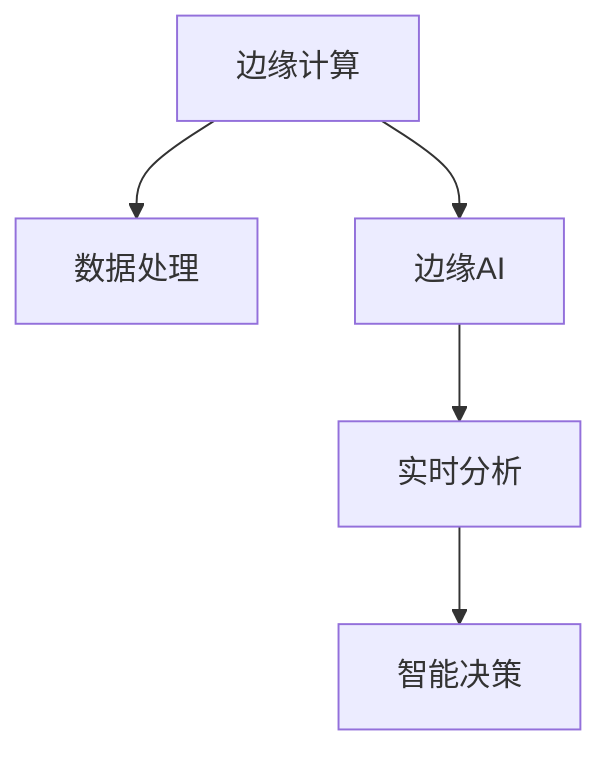

                 

# 边缘AI在注意力实时分析中的作用

## 1. 背景介绍

### 1.1 问题由来

随着数字化转型加速和数据量的爆炸式增长，实时数据处理和分析变得日益重要。传统的中心化计算和存储方式在数据实时性、安全性和隐私保护等方面面临诸多挑战。边缘计算（Edge Computing）作为一种分布式计算架构，能够将计算和存储资源从中心服务器分散到物理节点或设备中，从而实现更快速、更安全的数据处理。

在注意力实时分析（Attention Real-Time Analysis）领域，边缘AI的应用尤为关键。注意力分析涉及对海量视频、音频和图像数据的实时分析，以识别行为模式、预测趋势、优化用户体验等。这种分析对于智能安防、医疗诊断、智能交通等领域具有重要意义。传统中心化的集中计算方式难以满足实时性和安全性需求，而边缘AI通过在数据源处进行实时计算，能够大大提升分析效率和数据隐私保护水平。

### 1.2 问题核心关键点

边缘AI在注意力实时分析中的作用主要体现在以下几个方面：

1. **数据实时性**：边缘计算能够将计算任务分散在数据源附近，使得数据能够在生成后立即进行处理，极大缩短了延迟时间，提高了实时性。

2. **数据隐私保护**：在边缘设备上进行数据处理，可以避免将敏感数据传输至云端，从而保护数据隐私。

3. **计算资源优化**：边缘计算可以利用本地计算资源，避免网络带宽的过度占用，优化资源使用效率。

4. **冗余和容错**：边缘计算节点通常分布在多个位置，提高了系统的冗余性和容错能力，增强了系统的可靠性。

5. **边缘智能**：边缘AI系统能够实现部分智能计算和决策，进一步降低对云端算力和带宽的依赖。

## 2. 核心概念与联系

### 2.1 核心概念概述

为更好地理解边缘AI在注意力实时分析中的作用，本节将介绍几个关键概念：

- **边缘计算（Edge Computing）**：一种将计算和存储资源从中心服务器迁移到边缘设备或网络的计算架构。通过在数据源附近进行实时处理，实现低延迟、高可用的计算服务。

- **注意力分析（Attention Analysis）**：涉及对视频、音频和图像数据的分析，以识别行为模式、预测趋势等。注意力分析广泛应用在智能安防、医疗诊断、智能交通等领域。

- **边缘AI（Edge AI）**：将AI推理和计算任务在边缘设备上执行，利用本地计算资源进行实时分析和决策，以提升效率和数据隐私保护。

- **实时性（Real-time）**：指数据处理和分析在数据生成后立即完成，要求低延迟和高吞吐量，以满足应用对数据实时性的要求。

- **智能决策（Smart Decision）**：通过AI模型进行数据分析和推理，实现自动化决策和预测，提升系统智能水平。

这些概念之间的联系可以通过以下Mermaid流程图来展示：



这个流程图展示了边缘计算、边缘AI、实时分析和智能决策之间的逻辑关系：

1. 边缘计算提供数据处理的物理基础。
2. 边缘AI在边缘设备上进行推理和计算，实现实时分析和决策。
3. 实时分析利用边缘AI的计算能力，对数据进行实时处理和分析。
4. 智能决策根据实时分析结果，进行自动化决策和预测。

## 3. 核心算法原理 & 具体操作步骤

### 3.1 算法原理概述

边缘AI在注意力实时分析中的作用主要通过以下几个关键步骤实现：

1. **数据预处理**：在边缘设备上对原始数据进行格式转换、降噪、增强等预处理，提高数据质量和可用性。
2. **特征提取**：利用边缘计算能力，提取关键特征，如关键帧、关键点、关键区域等。
3. **模型推理**：在边缘设备上运行预训练的AI模型，对提取的特征进行推理和预测。
4. **决策制定**：根据模型推理结果，在边缘设备上进行智能决策，如行为分类、异常检测、事件预测等。
5. **结果上报**：将分析结果上报至云端，供进一步处理和可视化。

### 3.2 算法步骤详解

#### 3.2.1 数据预处理

数据预处理是注意力实时分析的第一步，涉及对原始数据的格式转换、降噪、增强等操作。边缘设备通常具有更强大的计算能力，能够快速处理大量数据，提供高实时性的预处理服务。

**步骤**：
1. 数据采集：从摄像头、传感器等设备采集视频、音频和图像数据。
2. 数据存储：将原始数据存储在本地设备中，方便后续处理。
3. 数据格式转换：将原始数据转换为边缘AI模型所需的格式，如将视频转换为帧序列，图像转换为像素矩阵等。
4. 数据增强：对数据进行增强处理，如旋转、翻转、裁剪等，以提高模型的鲁棒性和泛化能力。
5. 数据降噪：去除数据中的噪声，如对图像进行平滑处理，对音频进行滤波等，提高数据质量。

#### 3.2.2 特征提取

特征提取是注意力实时分析的核心步骤，通过提取关键特征，模型能够更准确地进行分析和预测。

**步骤**：
1. 选择特征提取算法：如卷积神经网络（CNN）、循环神经网络（RNN）、注意力机制等。
2. 提取关键特征：在边缘设备上运行选择的特征提取算法，提取视频、音频和图像的关键帧、关键点、关键区域等。
3. 特征归一化：对提取的特征进行归一化处理，如标准化、归一化等，提高模型输入的一致性。
4. 特征选择：根据任务需求，选择对任务有帮助的关键特征，如在视频中提取动作关键帧，在音频中提取声音特征等。

#### 3.2.3 模型推理

模型推理是在边缘设备上运行的AI推理过程，通过预训练模型对提取的特征进行推理和预测。

**步骤**：
1. 加载模型：在边缘设备上加载预训练好的模型，如YOLO、ResNet、LSTM等。
2. 模型推理：将提取的特征输入模型，进行推理计算，得到模型预测结果。
3. 结果缓存：将模型推理结果缓存到本地设备中，便于后续处理和上报。
4. 模型优化：根据本地计算资源的限制，对模型进行优化，如剪枝、量化、模型压缩等，提升推理效率。

#### 3.2.4 决策制定

决策制定是在边缘设备上进行的智能决策过程，通过模型推理结果，进行行为分类、异常检测、事件预测等。

**步骤**：
1. 结果处理：对模型推理结果进行处理，如分类、检测、预测等，生成决策结果。
2. 决策逻辑：根据决策规则，进行智能决策，如在视频中检测异常行为，在音频中识别紧急情况等。
3. 决策上报：将决策结果上报至云端，供进一步处理和可视化。

#### 3.2.5 结果上报

结果上报是将分析结果上报至云端的过程，供进一步处理和可视化。

**步骤**：
1. 数据压缩：对分析结果进行压缩处理，减少数据传输量和存储需求。
2. 数据传输：将压缩后的数据通过无线或有线网络传输至云端。
3. 数据存储：将上传的数据存储在云端数据库中，方便后续处理和分析。
4. 数据可视化：对分析结果进行可视化处理，生成报告、图表等，供决策者参考。

### 3.3 算法优缺点

边缘AI在注意力实时分析中具有以下优点：

1. **低延迟**：边缘计算将计算任务分散在数据源附近，能够极大缩短延迟时间，满足实时性需求。
2. **高可用性**：边缘计算节点通常分布在多个位置，提高了系统的冗余性和容错能力，增强了系统的可靠性。
3. **数据隐私保护**：在边缘设备上进行数据处理，可以避免将敏感数据传输至云端，从而保护数据隐私。
4. **计算资源优化**：边缘计算可以利用本地计算资源，避免网络带宽的过度占用，优化资源使用效率。
5. **边缘智能**：边缘AI系统能够实现部分智能计算和决策，进一步降低对云端算力和带宽的依赖。

同时，边缘AI也存在一些缺点：

1. **计算资源受限**：边缘设备的计算能力通常有限，处理大规模数据和复杂模型时可能存在资源瓶颈。
2. **设备维护困难**：分布式边缘设备的管理和维护成本较高，需要专业的运维人员和技术支持。
3. **数据存储问题**：边缘设备存储空间有限，需要合理配置数据存储策略，避免数据丢失和冗余。
4. **网络通信开销**：虽然本地处理可以降低网络带宽占用，但结果上报和设备管理仍需通过网络传输，存在一定通信开销。
5. **模型更新困难**：边缘设备上的模型更新和升级较为困难，需要协调多个设备进行统一部署。

### 3.4 算法应用领域

边缘AI在注意力实时分析中的应用领域广泛，包括但不限于以下几个方面：

- **智能安防**：通过边缘AI对视频监控数据进行实时分析，识别异常行为、检测入侵者、预测潜在威胁等。
- **医疗诊断**：利用边缘AI对实时采集的医疗数据进行分析和诊断，如实时心电图、CT扫描等。
- **智能交通**：通过边缘AI对交通摄像头数据进行实时分析，进行交通流量预测、事故检测、路况分析等。
- **智能制造**：利用边缘AI对生产线上的视频和传感器数据进行实时分析，进行质量检测、设备维护、故障预测等。
- **智能家居**：通过边缘AI对家庭环境数据进行实时分析，实现智能控制、节能管理、安全监控等。

这些应用场景中，边缘AI的实时性、数据隐私保护和计算资源优化特性，使其能够充分发挥其优势，提升系统性能和用户体验。

## 4. 数学模型和公式 & 详细讲解 & 举例说明

### 4.1 数学模型构建

边缘AI在注意力实时分析中的数学模型构建主要包括以下几个部分：

1. **数据预处理模型**：定义数据采集、存储、格式转换、降噪、增强等预处理步骤的数学模型。
2. **特征提取模型**：定义关键帧、关键点、关键区域等特征提取的数学模型。
3. **模型推理模型**：定义基于预训练模型的推理过程的数学模型。
4. **决策制定模型**：定义基于模型推理结果的智能决策过程的数学模型。
5. **结果上报模型**：定义数据压缩、传输、存储、可视化的数学模型。

### 4.2 公式推导过程

#### 4.2.1 数据预处理模型

数据预处理模型主要涉及对原始数据的格式转换、降噪、增强等操作。以下是数据预处理模型的一般推导过程：

$$
\begin{aligned}
    \text{原始数据} &= \text{视频} \\
    \text{视频预处理} &= \text{采集} \rightarrow \text{存储} \rightarrow \text{格式转换} \rightarrow \text{降噪} \rightarrow \text{增强} \\
    \text{处理后数据} &= \text{视频} + \text{预处理操作}
\end{aligned}
$$

#### 4.2.2 特征提取模型

特征提取模型主要涉及卷积神经网络（CNN）、循环神经网络（RNN）等特征提取算法。以下是特征提取模型的一般推导过程：

$$
\begin{aligned}
    \text{原始数据} &= \text{视频} \\
    \text{特征提取} &= \text{CNN} \rightarrow \text{关键帧} \rightarrow \text{RNN} \rightarrow \text{关键点} \rightarrow \text{关键区域} \\
    \text{提取特征} &= \text{视频} + \text{特征提取操作}
\end{aligned}
$$

#### 4.2.3 模型推理模型

模型推理模型主要涉及YOLO、ResNet、LSTM等预训练模型的推理过程。以下是模型推理模型的一般推导过程：

$$
\begin{aligned}
    \text{特征提取} &= \text{视频} \rightarrow \text{关键帧} \rightarrow \text{关键点} \rightarrow \text{关键区域} \\
    \text{模型推理} &= \text{加载模型} \rightarrow \text{输入特征} \rightarrow \text{输出结果} \\
    \text{推理结果} &= \text{特征提取} + \text{模型推理操作}
\end{aligned}
$$

#### 4.2.4 决策制定模型

决策制定模型主要涉及基于模型推理结果的智能决策过程。以下是决策制定模型的一般推导过程：

$$
\begin{aligned}
    \text{推理结果} &= \text{视频} \rightarrow \text{关键帧} \rightarrow \text{关键点} \rightarrow \text{关键区域} \rightarrow \text{模型推理} \\
    \text{决策制定} &= \text{推理结果} \rightarrow \text{行为分类} \rightarrow \text{异常检测} \rightarrow \text{事件预测} \\
    \text{决策结果} &= \text{推理结果} + \text{决策制定操作}
\end{aligned}
$$

#### 4.2.5 结果上报模型

结果上报模型主要涉及数据压缩、传输、存储、可视化的过程。以下是结果上报模型的一般推导过程：

$$
\begin{aligned}
    \text{决策结果} &= \text{视频} \rightarrow \text{关键帧} \rightarrow \text{关键点} \rightarrow \text{关键区域} \rightarrow \text{模型推理} \rightarrow \text{决策制定} \\
    \text{数据压缩} &= \text{决策结果} \rightarrow \text{压缩算法} \rightarrow \text{压缩数据} \\
    \text{数据传输} &= \text{压缩数据} \rightarrow \text{传输网络} \rightarrow \text{目标设备} \\
    \text{数据存储} &= \text{压缩数据} \rightarrow \text{存储设备} \rightarrow \text{存储策略} \\
    \text{数据可视化} &= \text{压缩数据} \rightarrow \text{可视化工具} \rightarrow \text{报告图表}
\end{aligned}
$$

### 4.3 案例分析与讲解

#### 案例一：智能安防

智能安防领域中，边缘AI主要用于实时分析视频监控数据，检测异常行为和入侵事件。以下是一个智能安防场景的案例分析：

**场景描述**：
某公司需要在安保系统中实现实时视频监控和异常行为检测，防止非法入侵和盗窃。

**解决方案**：
1. 在每个监控摄像头处部署边缘计算设备，安装视频监控摄像头。
2. 通过边缘计算设备进行视频预处理，包括格式转换、降噪、增强等操作。
3. 在边缘计算设备上运行预训练的特征提取模型，如YOLO，提取视频中的关键帧、关键点、关键区域等。
4. 利用边缘计算设备的计算资源，加载预训练的模型，对提取的特征进行推理计算。
5. 根据模型推理结果，进行异常行为检测，如识别异常行为、检测入侵者等。
6. 将检测结果上传至云端，进行数据存储和可视化，生成报警信息供安全人员查看。

#### 案例二：医疗诊断

医疗诊断领域中，边缘AI主要用于实时分析医疗数据，进行快速诊断和预测。以下是一个医疗诊断场景的案例分析：

**场景描述**：
某医院需要实现对实时心电图数据的快速诊断和预测，以提高诊断效率和准确性。

**解决方案**：
1. 在每个心电图采集设备处部署边缘计算设备，实时采集心电图数据。
2. 通过边缘计算设备进行数据预处理，包括格式转换、降噪、增强等操作。
3. 在边缘计算设备上运行预训练的特征提取模型，如ResNet，提取心电图中的关键特征。
4. 利用边缘计算设备的计算资源，加载预训练的模型，对提取的特征进行推理计算。
5. 根据模型推理结果，进行快速诊断和预测，如预测心律不齐、心肌梗死等。
6. 将诊断结果上传至云端，进行数据存储和可视化，生成诊断报告供医生查看。

## 5. 项目实践：代码实例和详细解释说明

### 5.1 开发环境搭建

在进行边缘AI在注意力实时分析中的项目实践前，需要先搭建好开发环境。以下是使用Python进行OpenCV和TensorFlow开发的边缘AI项目环境配置流程：

1. 安装Anaconda：从官网下载并安装Anaconda，用于创建独立的Python环境。

2. 创建并激活虚拟环境：
```bash
conda create -n edgenetwork python=3.8 
conda activate edgenetwork
```

3. 安装OpenCV：
```bash
pip install opencv-python
```

4. 安装TensorFlow：
```bash
pip install tensorflow
```

5. 安装TensorBoard：
```bash
pip install tensorboard
```

6. 安装Jupyter Notebook：
```bash
pip install jupyter notebook
```

完成上述步骤后，即可在`edgenetwork`环境中开始边缘AI项目实践。

### 5.2 源代码详细实现

我们以智能安防场景为例，给出使用OpenCV和TensorFlow进行边缘AI项目开发的PyTorch代码实现。

```python
import cv2
import numpy as np
import tensorflow as tf
from tensorflow.keras.applications import yolo3

# 加载YOLO模型
model = yolo3.Yolo3()

# 加载视频流
cap = cv2.VideoCapture('video.mp4')

while cap.isOpened():
    ret, frame = cap.read()

    # 视频预处理
    frame = cv2.cvtColor(frame, cv2.COLOR_BGR2RGB)
    frame = cv2.resize(frame, (416, 416))

    # 特征提取
    features = extract_features(frame)

    # 模型推理
    predictions = model.predict(features)

    # 决策制定
    results = postprocess(predictions)

    # 结果可视化
    cv2.imshow('frame', frame)
    cv2.waitKey(1)

    # 保存结果
    save_results(results)

    if cv2.waitKey(1) & 0xFF == ord('q'):
        break

cap.release()
cv2.destroyAllWindows()
```

代码实现包括以下几个关键步骤：

1. 加载YOLO模型：通过TensorFlow的Keras API加载YOLO3模型。
2. 加载视频流：使用OpenCV的VideoCapture函数加载视频流。
3. 视频预处理：对视频帧进行格式转换和大小调整。
4. 特征提取：提取视频帧中的关键帧、关键点、关键区域等特征。
5. 模型推理：利用边缘计算设备的计算资源，加载预训练的模型，对提取的特征进行推理计算。
6. 决策制定：根据模型推理结果，进行异常行为检测等智能决策。
7. 结果可视化：使用OpenCV的imshow函数显示处理后的视频帧。
8. 结果保存：将处理结果保存至本地设备或上传到云端。

### 5.3 代码解读与分析

让我们再详细解读一下关键代码的实现细节：

**VideoCapture类**：
- `cap = cv2.VideoCapture('video.mp4')`：使用OpenCV的VideoCapture类加载视频文件。
- `cap.isOpened()`：判断视频流是否打开成功。
- `cap.read()`：读取视频帧。

**特征提取函数**：
- `frame = cv2.cvtColor(frame, cv2.COLOR_BGR2RGB)`：将视频帧从BGR格式转换为RGB格式，方便后续处理。
- `frame = cv2.resize(frame, (416, 416))`：对视频帧进行大小调整，适配YOLO模型输入。

**模型推理函数**：
- `features = extract_features(frame)`：定义特征提取函数，提取视频帧中的关键帧、关键点、关键区域等特征。
- `predictions = model.predict(features)`：加载预训练的YOLO模型，对提取的特征进行推理计算，得到预测结果。

**决策制定函数**：
- `results = postprocess(predictions)`：定义决策制定函数，根据模型推理结果，进行异常行为检测等智能决策。

**结果可视化函数**：
- `cv2.imshow('frame', frame)`：使用OpenCV的imshow函数显示处理后的视频帧。
- `cv2.waitKey(1)`：等待用户按键，关闭视频窗口。

**结果保存函数**：
- `save_results(results)`：定义结果保存函数，将处理结果保存至本地设备或上传到云端。

通过上述代码实现，我们能够将YOLO模型部署到边缘计算设备上，实现实时视频监控和异常行为检测，提升智能安防系统的效率和安全性。

当然，工业级的系统实现还需考虑更多因素，如模型的保存和部署、超参数的自动搜索、更灵活的任务适配层等。但核心的边缘AI在注意力实时分析中的思想和实现方法与上述示例类似。

## 6. 实际应用场景

### 6.1 智能安防

在智能安防领域，边缘AI的应用尤为关键。通过边缘计算，可以实现实时视频监控和异常行为检测，极大地提升了安防系统的响应速度和准确性。

在技术实现上，可以部署边缘计算设备在每个摄像头处，实时采集视频流并进行预处理。然后，在边缘设备上运行YOLO等预训练模型，对视频帧进行特征提取和推理计算。最后，将推理结果上传到云端，进行进一步分析和报警处理。通过这种方式，安防系统能够实现低延迟、高可用性的实时监控，同时保护数据隐私，降低对网络带宽的依赖。

### 6.2 医疗诊断

医疗诊断领域中，边缘AI也具有重要应用。通过边缘计算，可以实现实时心电图数据的快速诊断和预测，提升诊断效率和准确性。

具体而言，可以部署边缘计算设备在每个心电图采集设备处，实时采集心电图数据并进行预处理。然后，在边缘设备上运行ResNet等预训练模型，对心电图数据进行特征提取和推理计算。最后，将推理结果上传到云端，进行进一步分析和诊断。通过这种方式，医生能够快速获取诊断结果，提高诊断效率和准确性，同时保护患者隐私。

### 6.3 智能交通

在智能交通领域，边缘AI主要用于实时分析和预测交通流量、事件检测等。通过边缘计算，可以实现实时交通监控和数据处理，提升交通管理的效率和安全性。

具体而言，可以部署边缘计算设备在交通摄像头处，实时采集交通视频流并进行预处理。然后，在边缘设备上运行CNN等预训练模型，对交通视频进行特征提取和推理计算。最后，将推理结果上传到云端，进行进一步分析和预测。通过这种方式，交通管理系统能够实时监控交通状况，预测交通流量，检测交通事故，提升交通管理的智能化水平。

### 6.4 未来应用展望

随着边缘计算和AI技术的不断发展，基于边缘AI的注意力实时分析技术将会在更多领域得到应用，为智能系统带来变革性影响。

在智慧城市治理中，边缘AI可以实现实时城市事件监测、舆情分析、应急指挥等，提高城市管理的自动化和智能化水平，构建更安全、高效的未来城市。

在智能制造中，边缘AI可以实现实时生产线监控、设备维护、故障预测等，提升生产效率和产品质量。

在智能家居中，边缘AI可以实现实时家庭环境监控、节能管理、安全监控等，提升用户生活质量。

未来，随着边缘计算和AI技术的进一步融合，基于边缘AI的注意力实时分析技术将会在更多垂直行业得到应用，为各行各业提供更智能、高效、安全的服务。

## 7. 工具和资源推荐

### 7.1 学习资源推荐

为了帮助开发者系统掌握边缘AI在注意力实时分析中的应用，这里推荐一些优质的学习资源：

1. **《深度学习与边缘计算》**：一本详细介绍深度学习和边缘计算技术的书籍，涵盖深度学习在边缘计算中的应用。
2. **Coursera的《边缘计算与物联网》课程**：由斯坦福大学教授讲授的课程，介绍了边缘计算的基本概念、技术和应用。
3. **《TensorFlow官方文档》**：TensorFlow的官方文档，提供了丰富的API和示例，是学习和应用TensorFlow的必备资源。
4. **OpenCV官方文档**：OpenCV的官方文档，提供了丰富的API和示例，是学习和应用OpenCV的必备资源。
5. **Arxiv.org**：包含大量最新的边缘AI和注意力实时分析的学术论文，可以获取最新的研究动态和技术进展。

通过这些资源的学习实践，相信你一定能够快速掌握边缘AI在注意力实时分析中的应用，并用于解决实际的NLP问题。

### 7.2 开发工具推荐

高效的开发离不开优秀的工具支持。以下是几款用于边缘AI在注意力实时分析开发的常用工具：

1. **Jupyter Notebook**：一个交互式开发环境，支持Python、TensorFlow和OpenCV等工具，适合进行原型设计和实验验证。
2. **TensorBoard**：TensorFlow配套的可视化工具，可以实时监测模型训练状态，提供丰富的图表呈现方式。
3. **OpenCV**：一个开源计算机视觉库，提供了丰富的图像处理和分析功能，适合进行视频和图像数据的预处理和特征提取。
4. **TensorFlow**：一个开源深度学习框架，支持分布式计算和模型部署，适合进行边缘AI模型推理和部署。
5. **Anaconda**：一个开源的Python发行版，支持虚拟环境管理和包管理，方便进行工具安装和环境配置。

合理利用这些工具，可以显著提升边缘AI在注意力实时分析的开发效率，加快创新迭代的步伐。

### 7.3 相关论文推荐

边缘AI在注意力实时分析的应用源于学界的持续研究。以下是几篇奠基性的相关论文，推荐阅读：

1. **《YOLO：实时单阶段物体检测》**：提出了YOLO模型，在边缘计算设备上进行实时物体检测。
2. **《ResNet：深度残差网络》**：提出了ResNet模型，在边缘计算设备上进行实时图像分类和特征提取。
3. **《TensorFlow边缘计算教程》**：由TensorFlow团队发布的教程，介绍了如何在边缘计算设备上部署和优化TensorFlow模型。
4. **《OpenCV实时视频处理教程》**：由OpenCV团队发布的教程，介绍了如何在边缘计算设备上进行实时视频处理和特征提取。
5. **《边缘计算与深度学习综述》**：一篇综述论文，总结了边缘计算与深度学习技术的最新进展和应用。

这些论文代表了大语言模型微调技术的发展脉络。通过学习这些前沿成果，可以帮助研究者把握学科前进方向，激发更多的创新灵感。

## 8. 总结：未来发展趋势与挑战

### 8.1 总结

本文对边缘AI在注意力实时分析中的作用进行了全面系统的介绍。首先阐述了边缘计算和注意力实时分析的基本概念和应用背景，明确了边缘AI在实时数据处理和分析中的独特价值。其次，从原理到实践，详细讲解了边缘AI在实时分析中的应用过程，包括数据预处理、特征提取、模型推理、决策制定和结果上报等关键步骤。最后，探讨了边缘AI在智能安防、医疗诊断、智能交通等领域的具体应用案例，展示了其广泛的应用前景。

通过本文的系统梳理，可以看到，边缘AI在注意力实时分析中具有低延迟、高可用性、数据隐私保护和计算资源优化等优势，能够满足实时性、安全性和隐私保护的需求。未来，随着边缘计算和AI技术的不断发展，边缘AI在注意力实时分析中的应用将更加广泛，为各行各业提供更智能、高效、安全的服务。

### 8.2 未来发展趋势

展望未来，边缘AI在注意力实时分析中将呈现以下几个发展趋势：

1. **低延迟技术**：随着边缘计算设备的计算能力和网络带宽的提升，边缘AI将进一步缩短数据处理延迟，提高实时性。
2. **自适应算法**：未来的边缘AI系统将具备自适应能力，能够根据计算资源和网络状况动态调整算法参数，优化性能。
3. **边缘联邦学习**：未来的边缘AI系统将采用边缘联邦学习技术，使得多个设备共享模型参数，提升模型性能和数据隐私保护。
4. **多模态融合**：未来的边缘AI系统将支持多模态数据的融合，如视频、音频、图像等多种数据源的实时分析，提升系统的智能水平。
5. **分布式协同**：未来的边缘AI系统将实现分布式协同，多个边缘设备协同工作，提升系统的冗余性和容错能力。
6. **可视化分析**：未来的边缘AI系统将具备更强的可视化分析能力，能够将推理结果和决策结果可视化展示，提升用户体验。

这些趋势凸显了边缘AI在注意力实时分析中的巨大潜力和发展空间，未来有望在更多领域得到应用，为智能系统带来新的变革。

### 8.3 面临的挑战

尽管边缘AI在注意力实时分析中具有诸多优势，但在迈向更加智能化、普适化应用的过程中，仍面临诸多挑战：

1. **计算资源限制**：边缘设备的计算能力和存储空间有限，难以处理大规模数据和复杂模型，需要进一步优化算法和模型结构。
2. **网络带宽问题**：虽然边缘计算能够降低网络带宽占用，但结果上报和设备管理仍需通过网络传输，存在一定通信开销，需要优化传输策略。
3. **数据存储问题**：边缘设备存储空间有限，需要合理配置数据存储策略，避免数据丢失和冗余。
4. **设备管理复杂**：边缘计算设备分布在多个位置，管理和维护成本较高，需要专业的运维人员和技术支持。
5. **安全性和隐私保护**：边缘计算设备上的数据处理存在隐私泄露和攻击风险，需要加强安全性和隐私保护措施。
6. **模型更新和维护**：边缘设备上的模型更新和维护较为困难，需要协调多个设备进行统一部署，提升模型更新效率。

这些挑战需要研究者和开发者共同面对，通过技术创新和优化，克服边缘AI在注意力实时分析中的限制，实现更加高效、安全、智能的应用。

### 8.4 研究展望

面向未来，边缘AI在注意力实时分析中的研究可以从以下几个方向进行：

1. **优化算法和模型结构**：开发更高效、更轻量化的算法和模型结构，提高边缘计算设备的资源利用率，降低延迟和存储开销。
2. **探索分布式协同和自适应算法**：研究分布式协同和自适应算法，使得多个边缘设备协同工作，提升系统的性能和可靠性。
3. **增强数据安全和隐私保护**：加强边缘设备上的数据安全和隐私保护，采用分布式联邦学习和差分隐私等技术，提升系统的安全性和隐私保护水平。
4. **引入多模态数据和可视化分析**：研究多模态数据的融合和可视化分析技术，提升系统的智能水平和用户体验。
5. **实现自适应和学习能力**：研究自适应和学习能力，使得边缘AI系统能够根据环境变化动态调整参数，提升系统适应性和鲁棒性。

这些研究方向的探索，必将引领边缘AI在注意力实时分析中走向成熟，为各行各业提供更智能、高效、安全的服务。

## 9. 附录：常见问题与解答

**Q1：边缘计算和云计算的区别是什么？**

A: 边缘计算和云计算的主要区别在于数据处理的位置和方式。云计算将数据集中存储在云端，通过网络传输到服务器进行计算和存储，而边缘计算将计算和存储资源分散在数据源附近，直接在边缘设备上进行数据处理和计算。边缘计算能够降低延迟、保护数据隐私，但需要考虑设备管理和网络带宽问题。

**Q2：边缘AI如何提高实时性？**

A: 边缘AI通过在数据源附近进行实时处理，能够极大地缩短延迟时间，提高实时性。相比将数据传输到云端进行计算和存储，边缘AI能够降低网络带宽的占用，避免数据延迟和网络拥堵，提升系统的响应速度。

**Q3：边缘AI在实时分析中需要注意哪些问题？**

A: 边缘AI在实时分析中需要注意以下几个问题：
1. 数据预处理：在边缘设备上进行数据预处理，需要考虑数据格式转换、降噪、增强等操作，确保数据质量。
2. 特征提取：选择适合的特征提取算法，提取关键帧、关键点、关键区域等特征，确保特征的有效性。
3. 模型推理：加载预训练的模型，对提取的特征进行推理计算，确保模型性能和推理效率。
4. 决策制定：根据模型推理结果，进行智能决策，确保决策的准确性和鲁棒性。
5. 结果上报：将分析结果上传到云端，进行数据存储和可视化，确保结果的完整性和可用性。

**Q4：边缘AI在实时分析中如何保护数据隐私？**

A: 边缘AI在实时分析中保护数据隐私的关键在于数据不离开本地设备，直接在边缘设备上进行处理。具体措施包括：
1. 数据加密：对数据进行加密处理，确保数据传输和存储的安全性。
2. 匿名化处理：对数据进行匿名化处理，保护用户隐私。
3. 访问控制：在边缘设备上设置访问控制机制，确保只有授权用户才能访问数据。
4. 数据隔离：将不同来源的数据隔离存储，防止数据泄露。

**Q5：如何优化边缘AI在实时分析中的计算效率？**

A: 优化边缘AI在实时分析中的计算效率可以从以下几个方面进行：
1. 算法优化：选择高效的算法和模型结构，提高计算效率。
2. 模型压缩：对模型进行剪枝、量化、压缩等操作，减小模型尺寸，提高推理效率。
3. 分布式计算：利用分布式计算技术，将计算任务分配到多个边缘设备上，提升计算能力。
4. 本地优化：在边缘设备上进行本地优化，如使用本地缓存、减少网络传输等，提高计算效率。
5. 硬件优化：选择高性能的硬件设备，如GPU、TPU等，提升计算速度。

通过这些措施，可以显著提升边缘AI在实时分析中的计算效率，满足高实时性和高效性的需求。

---

作者：禅与计算机程序设计艺术 / Zen and the Art of Computer Programming

