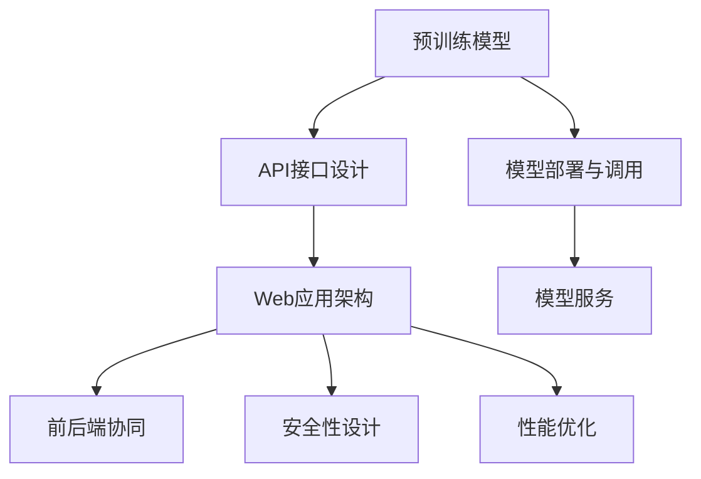
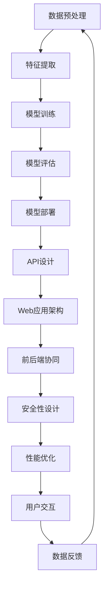

                 

# 部署AI模型：从API到Web应用

## 1. 背景介绍

### 1.1 问题由来
随着人工智能技术的发展，越来越多的企业开始构建基于AI的智能应用，提升其业务水平和服务质量。部署AI模型是这些应用开发的核心环节之一，确保了模型能够在实际环境中稳定运行并产生价值。

AI模型的部署方式多种多样，既有传统的API调用，也有复杂的前端Web应用。本文将深入探讨如何从API到Web应用，全面解析这一过程的核心原理和技术细节，提供详细的实践指南。

### 1.2 问题核心关键点
部署AI模型从API到Web应用的核心在于，如何设计高效、稳定、安全的模型调用机制，将复杂而高效的算法模型适配到不同场景下实际的应用环境中。这其中涉及API设计和接口调用、Web应用架构和前后端协同、安全性保障和性能优化等多个关键环节。

## 2. 核心概念与联系

### 2.1 核心概念概述

为了更好地理解从API到Web应用的部署过程，本节将介绍几个关键概念：

- API：应用程序接口（Application Programming Interface），是提供给其他应用程序的编程接口，用于数据交换、模型调用等。
- RESTful API：基于HTTP协议和标准接口，支持资源描述、状态管理等功能，是目前API设计的主流方式。
- Web应用：以网页形式呈现的交互式应用，基于HTTP协议进行数据交互，适合展示复杂界面和互动。
- 前后端协同：Web应用中前端和后端的协作机制，确保数据一致性和用户体验。
- 安全性：确保Web应用中的数据和模型调用过程不被非法篡改，保障应用安全。
- 性能优化：优化Web应用的加载速度和响应性能，提升用户体验。

这些概念通过以下Mermaid流程图相互联系，展示了部署AI模型的全流程：



这个流程图展示了预训练模型部署至Web应用的全流程：

1. 预训练模型在服务器上进行部署和调用。
2. 基于API接口设计，用户通过API接口访问模型服务。
3. Web应用基于API接口进行架构设计。
4. 在前后端协同机制下，数据流和调用过程顺利进行。
5. 安全性设计保障了数据和模型调用的安全性。
6. 性能优化提升Web应用的响应速度。

### 2.2 核心概念原理和架构的 Mermaid 流程图



这个流程图展示了模型部署和调用过程中的各个环节，各环节通过数据流和调用链条连接，形成闭环。

## 3. 核心算法原理 & 具体操作步骤

### 3.1 算法原理概述

部署AI模型的核心在于将复杂的预训练模型和算法适配到Web应用环境中，实现高效、稳定、安全的模型调用。其基本原理包括以下几个关键步骤：

1. **数据预处理**：将用户输入的数据转换为模型所需的格式。
2. **特征提取**：通过算法模型将原始数据转化为特征向量。
3. **模型训练**：在大量标注数据上训练模型，学习从输入特征到输出标签的映射关系。
4. **模型评估**：通过验证集评估模型性能，选择最佳模型。
5. **模型部署**：将模型和相关资源部署到服务器，生成API接口。
6. **API设计**：定义接口的功能、参数和返回值，确保API调用流畅。
7. **Web应用架构**：根据API接口设计，构建Web应用架构。
8. **前后端协同**：确保前后端数据一致性和交互流畅。
9. **安全性设计**：通过访问控制、数据加密等手段保障Web应用的安全性。
10. **性能优化**：通过缓存、负载均衡等手段提升Web应用的性能。

### 3.2 算法步骤详解

#### 3.2.1 数据预处理

数据预处理是模型调用的第一步，将用户输入的数据转换为模型所需的格式。这一过程涉及数据的清洗、归一化、标准化等操作，具体步骤如下：

1. **数据清洗**：去除无用数据，如HTML标签、特殊字符等，确保数据质量。
2. **数据标准化**：将数据转化为标准格式，如将日期字符串转化为时间戳，处理缺失值和异常值等。
3. **数据归一化**：将数据转化为模型所需的格式，如将文本数据转化为向量表示，便于模型处理。

#### 3.2.2 特征提取

特征提取是将原始数据转化为模型所需的特征向量。常见的特征提取方法包括词袋模型、TF-IDF、词嵌入等，其目的是将文本数据转化为模型可处理的向量表示。

- **词袋模型**：将文本数据转化为词频矩阵，统计每个词在文本中出现的次数。
- **TF-IDF**：通过统计词频和逆文档频率，赋予权重，反映词的重要性。
- **词嵌入**：将单词映射到低维向量空间，保留单词的语义信息。

#### 3.2.3 模型训练

模型训练是在大量标注数据上训练模型，学习从输入特征到输出标签的映射关系。这一过程通常使用监督学习算法，如回归、分类、聚类等。

1. **数据准备**：准备训练集和验证集，划分为训练集、验证集和测试集。
2. **模型选择**：选择合适的算法模型，如线性回归、逻辑回归、决策树等。
3. **模型训练**：使用训练集数据训练模型，并通过验证集评估模型性能。
4. **模型调参**：通过调整超参数，优化模型性能，如学习率、正则化系数等。

#### 3.2.4 模型评估

模型评估是通过验证集评估模型性能，选择最佳模型。评估指标包括准确率、召回率、F1值等，具体步骤如下：

1. **划分数据集**：将数据集划分为训练集和验证集。
2. **训练模型**：在训练集上训练模型。
3. **评估模型**：在验证集上评估模型性能，选择最佳模型。

#### 3.2.5 模型部署

模型部署是将模型和相关资源部署到服务器，生成API接口。这一过程涉及模型导出、资源准备和API生成等步骤。

1. **模型导出**：将训练好的模型导出为可被调用的格式，如TensorFlow SavedModel、PyTorch Serialized等。
2. **资源准备**：准备API调用所需的资源，如模型文件、依赖库等。
3. **API生成**：根据模型调用需求，设计API接口，生成API文档和代码。

#### 3.2.6 API设计

API设计是定义接口的功能、参数和返回值，确保API调用流畅。API设计遵循RESTful原则，支持资源描述、状态管理等功能。

1. **接口设计**：定义API接口的功能和参数，如GET、POST、PUT等请求方法，输入参数、返回值等。
2. **接口文档**：生成API文档，详细说明接口参数、返回值和错误处理机制。

#### 3.2.7 Web应用架构

Web应用架构是根据API接口设计，构建Web应用架构。常见架构包括MVC、RESTful、微服务等，其目的是实现前后端协同，确保数据一致性和交互流畅。

1. **前后端协同**：设计前后端数据流，确保数据一致性和交互流畅。
2. **系统架构**：选择合适的架构模式，如MVC、RESTful、微服务等。

#### 3.2.8 安全性设计

安全性设计是通过访问控制、数据加密等手段保障Web应用的安全性。具体措施包括：

1. **访问控制**：设计访问控制策略，限制非法访问。
2. **数据加密**：对传输和存储的数据进行加密，防止数据泄露。

#### 3.2.9 性能优化

性能优化是通过缓存、负载均衡等手段提升Web应用的响应速度。具体措施包括：

1. **缓存机制**：设计缓存策略，缓存热点数据，减少数据访问和处理。
2. **负载均衡**：设计负载均衡策略，分散服务器负载，提升系统性能。

### 3.3 算法优缺点

部署AI模型从API到Web应用方法具有以下优点：

1. **灵活性高**：根据不同应用场景，设计灵活的API接口和Web应用架构，适应性强。
2. **易于扩展**：通过API接口调用，方便新增模型和服务，易于扩展。
3. **稳定性高**：API接口调用机制，确保了数据和模型调用的稳定性。
4. **安全性好**：通过访问控制和数据加密等手段，保障了Web应用的安全性。

同时，该方法也存在一定的局限性：

1. **开发成本高**：需要设计API接口和Web应用架构，开发和测试成本较高。
2. **系统复杂性高**：涉及前后端协同和安全性设计，系统复杂性较高。
3. **性能瓶颈**：API调用机制可能导致系统响应速度慢，影响用户体验。

尽管存在这些局限性，但就目前而言，从API到Web应用的部署方式仍是主流范式。未来相关研究的重点在于如何进一步简化系统架构，降低开发成本，提高系统性能。

### 3.4 算法应用领域

从API到Web应用的部署方法，在多个领域得到广泛应用，例如：

- **智能推荐系统**：基于用户行为和历史数据，通过API接口调用推荐模型，实现个性化推荐。
- **智能客服系统**：通过API接口调用对话模型，实现自然语言理解和生成，提升客服系统的人性化和智能化。
- **金融风险评估**：基于用户行为和金融数据，通过API接口调用风险评估模型，实现智能风险管理。
- **医疗诊断系统**：基于病人数据和医学知识库，通过API接口调用诊断模型，辅助医生进行诊疗决策。
- **智慧交通系统**：基于交通数据和模型，通过API接口调用分析模型，实现交通流量预测和优化。

除了这些经典应用外，从API到Web应用的部署方法还被创新性地应用到更多场景中，如智能搜索、内容推荐、情感分析等，为各行业带来了新的突破。

## 4. 数学模型和公式 & 详细讲解 & 举例说明

### 4.1 数学模型构建

为了更好地理解部署AI模型的数学原理，本节将构建一个简单的数学模型，用于描述模型调用过程。

假设我们有一个预训练模型 $M$，用于处理文本数据 $x$，输出标签 $y$。我们将通过API接口调用该模型，具体步骤如下：

1. **数据预处理**：将用户输入的文本数据 $x$ 转化为标准格式 $x'$。
2. **特征提取**：将处理后的数据 $x'$ 转化为模型所需的特征向量 $f(x')$。
3. **模型调用**：通过API接口调用模型 $M$，输入特征向量 $f(x')$，得到预测结果 $\hat{y}$。
4. **结果输出**：根据预测结果 $\hat{y}$，输出最终结果 $y$。

### 4.2 公式推导过程

我们将上述过程用数学公式表示：

1. **数据预处理**：
   $$
   x' = f_{preprocess}(x)
   $$
   其中 $f_{preprocess}$ 为数据预处理函数。

2. **特征提取**：
   $$
   f(x') = f_{features}(x')
   $$
   其中 $f_{features}$ 为特征提取函数。

3. **模型调用**：
   $$
   \hat{y} = M(f(x'))
   $$
   其中 $M$ 为预训练模型，$f(x')$ 为特征向量。

4. **结果输出**：
   $$
   y = f_{output}(\hat{y})
   $$
   其中 $f_{output}$ 为结果输出函数。

### 4.3 案例分析与讲解

下面我们以智能推荐系统为例，讲解基于API的模型部署过程。

假设我们有一个基于协同过滤的推荐模型 $M$，用于处理用户行为数据 $x$，输出推荐结果 $y$。具体步骤如下：

1. **数据预处理**：将用户行为数据 $x$ 转化为标准格式 $x'$。
2. **特征提取**：将处理后的数据 $x'$ 转化为特征向量 $f(x')$。
3. **模型调用**：通过API接口调用推荐模型 $M$，输入特征向量 $f(x')$，得到推荐结果 $\hat{y}$。
4. **结果输出**：根据推荐结果 $\hat{y}$，输出最终推荐结果 $y$。

具体实现步骤如下：

1. **数据预处理**：
   $$
   x' = f_{preprocess}(x)
   $$

2. **特征提取**：
   $$
   f(x') = f_{features}(x')
   $$

3. **模型调用**：
   $$
   \hat{y} = M(f(x'))
   $$

4. **结果输出**：
   $$
   y = f_{output}(\hat{y})
   $$

通过上述步骤，我们可以将复杂的推荐模型适配到Web应用中，实现高效、稳定的模型调用。

## 5. 项目实践：代码实例和详细解释说明

### 5.1 开发环境搭建

在进行项目实践前，我们需要准备好开发环境。以下是使用Python进行Flask开发的环境配置流程：

1. 安装Anaconda：从官网下载并安装Anaconda，用于创建独立的Python环境。

2. 创建并激活虚拟环境：
   ```bash
   conda create -n pytorch-env python=3.8 
   conda activate pytorch-env
   ```

3. 安装Flask：
   ```bash
   pip install flask
   ```

4. 安装TensorFlow和Keras：
   ```bash
   pip install tensorflow
   pip install keras
   ```

5. 安装Flask-RESTful和Flask-SQLAlchemy：
   ```bash
   pip install flask-restful
   pip install flask-sqlalchemy
   ```

6. 安装Flask-Mail：
   ```bash
   pip install Flask-Mail
   ```

完成上述步骤后，即可在`pytorch-env`环境中开始项目实践。

### 5.2 源代码详细实现

下面我们以智能推荐系统为例，给出使用Flask框架对推荐模型进行API部署的PyTorch代码实现。

首先，定义推荐模型类：

```python
from tensorflow.keras.models import Sequential
from tensorflow.keras.layers import Dense
from tensorflow.keras.preprocessing.text import Tokenizer
from tensorflow.keras.preprocessing.sequence import pad_sequences

class RecommendationModel:
    def __init__(self, vocab_size, embedding_dim, num_words):
        self.model = Sequential()
        self.model.add(Embedding(vocab_size, embedding_dim, input_length=num_words))
        self.model.add(Dense(128, activation='relu'))
        self.model.add(Dense(1, activation='sigmoid'))

    def compile_model(self):
        self.model.compile(loss='binary_crossentropy', optimizer='adam', metrics=['accuracy'])
```

然后，定义API接口：

```python
from flask import Flask, request
from flask_restful import Resource, Api
from recommendation_model import RecommendationModel

app = Flask(__name__)
api = Api(app)

class RecommendationApi(Resource):
    def __init__(self):
        self.model = RecommendationModel(vocab_size, embedding_dim, num_words)

    def get(self):
        user_input = request.args.get('user_input')
        tokenized_input = tokenize_input(user_input)
        feature_vector = extract_features(tokenized_input)
        prediction = predict(user_input)
        return {'prediction': prediction}

    def post(self):
        user_input = request.json.get('user_input')
        tokenized_input = tokenize_input(user_input)
        feature_vector = extract_features(tokenized_input)
        prediction = predict(user_input)
        return {'prediction': prediction}

def tokenize_input(user_input):
    # 将用户输入转化为特征向量
    pass

def extract_features(feature_vector):
    # 将特征向量转化为模型所需的格式
    pass

def predict(user_input):
    # 通过API接口调用推荐模型，获取预测结果
    pass

api.add_resource(RecommendationApi, '/recommendation')
```

最后，启动API服务：

```python
if __name__ == '__main__':
    app.run(debug=True)
```

以上就是使用Flask对推荐模型进行API部署的完整代码实现。可以看到，通过Flask框架，我们能够方便地构建RESTful API接口，实现对推荐模型的调用。

### 5.3 代码解读与分析

让我们再详细解读一下关键代码的实现细节：

**RecommendationModel类**：
- `__init__`方法：初始化模型参数，定义模型结构。
- `compile_model`方法：编译模型，设置优化器、损失函数和评价指标。

**RecommendationApi类**：
- `__init__`方法：初始化API接口，定义API调用方法。
- `get`方法：处理GET请求，调用推荐模型获取预测结果。
- `post`方法：处理POST请求，调用推荐模型获取预测结果。

**API接口定义**：
- `/api/recommendation`：定义API接口的调用方式，支持GET和POST请求。
- `get`方法：获取预测结果。
- `post`方法：获取预测结果。

**Flask框架**：
- `Flask`：用于创建Web应用，提供路由和视图功能。
- `Flask-RESTful`：用于构建RESTful API接口，提供资源和请求处理方法。
- `Flask-SQLAlchemy`：用于管理数据库操作，方便数据持久化。
- `Flask-Mail`：用于发送邮件，方便数据传输和处理。

通过Flask框架，我们可以方便地构建Web应用和API接口，实现对推荐模型的调用。开发者可以将更多精力放在模型训练和数据处理上，而不必过多关注底层的实现细节。

## 6. 实际应用场景

### 6.1 智能推荐系统

基于API的推荐系统可以快速响应用户请求，实现高效、稳定的推荐服务。传统推荐系统往往依赖中心服务器，响应速度慢，难以满足实时性需求。

在技术实现上，可以构建一个基于API的推荐系统，用户通过API接口调用推荐模型，实时获取推荐结果。这种方式具有以下优势：

- **实时响应**：基于API调用机制，可以快速响应用户请求，满足实时性需求。
- **扩展性强**：通过API接口调用，方便新增模型和服务，易于扩展。
- **易于维护**：API接口调用机制，降低了系统复杂性，便于维护。

### 6.2 智能客服系统

基于API的智能客服系统可以实现自然语言理解和生成，提升客服系统的人性化和智能化。传统客服系统依赖人工坐席，成本高、效率低。

在技术实现上，可以构建一个基于API的智能客服系统，用户通过API接口调用对话模型，实现自然语言理解和生成。这种方式具有以下优势：

- **响应速度快**：基于API调用机制，可以快速响应用户请求，提升客服系统的人性化水平。
- **成本低**：减少人工坐席的投入，降低系统成本。
- **可扩展性强**：通过API接口调用，方便新增对话模型和服务，易于扩展。

### 6.3 金融风险评估

基于API的金融风险评估系统可以快速处理用户数据，实现智能风险管理。传统金融系统依赖人工审核，效率低、准确性差。

在技术实现上，可以构建一个基于API的金融风险评估系统，用户通过API接口调用风险评估模型，实现智能风险管理。这种方式具有以下优势：

- **处理速度快**：基于API调用机制，可以快速处理用户数据，提升金融系统效率。
- **准确率高**：模型基于大量标注数据训练，准确率高，减少人工审核的误差。
- **可扩展性强**：通过API接口调用，方便新增模型和服务，易于扩展。

### 6.4 未来应用展望

随着AI技术的发展，从API到Web应用的部署方法将在更多领域得到应用，为各行业带来新的突破。

在智慧医疗领域，基于API的智能诊断系统可以快速处理病人数据，实现智能诊断。通过API接口调用，医生可以快速获取诊断结果，提升诊疗效率。

在智能教育领域，基于API的智能推荐系统可以快速处理学生数据，实现个性化推荐。通过API接口调用，学生可以快速获取推荐内容，提升学习效率。

在智慧交通领域，基于API的智能分析系统可以快速处理交通数据，实现交通流量预测和优化。通过API接口调用，交通管理部门可以快速获取分析结果，优化交通管理。

此外，在企业生产、社会治理、文娱传媒等众多领域，基于API的AI应用也将不断涌现，为各行业带来新的发展机遇。

## 7. 工具和资源推荐

### 7.1 学习资源推荐

为了帮助开发者系统掌握从API到Web应用的部署方法，这里推荐一些优质的学习资源：

1. Flask官方文档：提供全面的API接口设计和Web应用开发指南，适合新手入门。
2. RESTful API设计指南：详细讲解RESTful API的设计原则和最佳实践，帮助开发者设计高效、稳定的API接口。
3. TensorFlow官方文档：提供全面的TensorFlow框架和Keras库使用指南，适合进阶学习。
4. PyTorch官方文档：提供全面的PyTorch框架和TensorFlow库使用指南，适合进阶学习。
5. Flask-RESTful官方文档：提供全面的Flask-RESTful库使用指南，适合进阶学习。
6. Flask-SQLAlchemy官方文档：提供全面的Flask-SQLAlchemy库使用指南，适合进阶学习。
7. Flask-Mail官方文档：提供全面的Flask-Mail库使用指南，适合进阶学习。

通过对这些资源的学习实践，相信你一定能够快速掌握从API到Web应用的部署方法，并用于解决实际的NLP问题。

### 7.2 开发工具推荐

高效的开发离不开优秀的工具支持。以下是几款用于从API到Web应用部署开发的常用工具：

1. Flask：基于Python的开源Web框架，提供路由和视图功能，易于开发API接口。
2. RESTful API设计工具：如Swagger、Postman等，用于设计API接口，生成API文档。
3. TensorFlow：基于Python的开源深度学习框架，提供高效模型训练和部署功能。
4. PyTorch：基于Python的开源深度学习框架，提供高效模型训练和部署功能。
5. Flask-RESTful：基于Flask的RESTful API接口库，提供API接口和请求处理方法。
6. Flask-SQLAlchemy：基于Flask和SQLAlchemy的数据库库，提供数据库操作功能。
7. Flask-Mail：基于Flask的邮件库，提供邮件发送功能。

合理利用这些工具，可以显著提升从API到Web应用的开发效率，加快创新迭代的步伐。

### 7.3 相关论文推荐

从API到Web应用的部署方法源于学界的持续研究。以下是几篇奠基性的相关论文，推荐阅读：

1. RESTful Web Services (RWS)：提出RESTful Web服务的概念，定义了RESTful API的设计原则和最佳实践。
2. TensorFlow官方博客：TensorFlow团队发表的多篇技术博客，详细介绍TensorFlow框架和Keras库的使用方法。
3. PyTorch官方博客：PyTorch团队发表的多篇技术博客，详细介绍PyTorch框架的使用方法。
4. Flask官方博客：Flask团队发表的多篇技术博客，详细介绍Flask框架的使用方法。
5. Flask-RESTful官方博客：Flask-RESTful团队发表的多篇技术博客，详细介绍Flask-RESTful库的使用方法。
6. Flask-SQLAlchemy官方博客：Flask-SQLAlchemy团队发表的多篇技术博客，详细介绍Flask-SQLAlchemy库的使用方法。
7. Flask-Mail官方博客：Flask-Mail团队发表的多篇技术博客，详细介绍Flask-Mail库的使用方法。

这些论文代表了大规模Web应用部署的技术发展脉络。通过学习这些前沿成果，可以帮助研究者把握学科前进方向，激发更多的创新灵感。

## 8. 总结：未来发展趋势与挑战

### 8.1 研究成果总结

本文对从API到Web应用的部署方法进行了全面系统的介绍。首先阐述了基于API的模型部署的必要性和可行性，明确了部署方法在AI应用中的重要性。其次，从原理到实践，详细讲解了部署方法的关键步骤，提供了完整的代码实现。同时，本文还广泛探讨了部署方法在智能推荐、智能客服、金融风险评估等诸多领域的应用前景，展示了部署方法的巨大潜力。

通过本文的系统梳理，可以看到，从API到Web应用的部署方法已经成为AI应用的重要范式，极大地拓展了模型调用的应用边界，催生了更多的落地场景。受益于API接口调用机制，模型在实际环境中的稳定性和响应速度得到了保证，便于扩展和维护。

### 8.2 未来发展趋势

展望未来，从API到Web应用的部署方法将呈现以下几个发展趋势：

1. **微服务架构**：微服务架构将进一步普及，各微服务通过API接口调用，相互协同，提升系统扩展性和稳定性。
2. **容器化部署**：通过Docker等容器化技术，提升系统部署和管理的效率，实现快速迭代和部署。
3. **API网关**：API网关将进一步普及，通过统一接口管理，简化API接口的设计和管理，提升系统安全性。
4. **DevOps文化**：DevOps文化将进一步普及，实现开发、测试、运维的一体化，提升系统交付速度和质量。
5. **AI中台**：AI中台将进一步普及，实现AI应用的全生命周期管理，提升系统开发和运维效率。

以上趋势凸显了从API到Web应用的部署方法的广阔前景。这些方向的探索发展，必将进一步提升Web应用的系统性能和用户体验，加速AI技术在各行业的落地应用。

### 8.3 面临的挑战

尽管从API到Web应用的部署方法已经取得了瞩目成就，但在迈向更加智能化、普适化应用的过程中，它仍面临着诸多挑战：

1. **系统复杂性高**：涉及前后端协同和安全性设计，系统复杂性较高。
2. **开发成本高**：需要设计API接口和Web应用架构，开发和测试成本较高。
3. **性能瓶颈**：API调用机制可能导致系统响应速度慢，影响用户体验。
4. **安全问题**：API接口调用过程中，可能存在数据泄露、访问控制等安全问题。
5. **系统稳定性**：系统设计和部署过程中，可能存在冗余资源、数据一致性等问题，影响系统稳定性。

尽管存在这些挑战，但就目前而言，从API到Web应用的部署方法仍是主流范式。未来相关研究的重点在于如何进一步简化系统架构，降低开发成本，提高系统性能，保障系统安全性。

### 8.4 研究展望

面对从API到Web应用的部署所面临的挑战，未来的研究需要在以下几个方面寻求新的突破：

1. **系统架构优化**：优化系统架构，提升系统性能和稳定性，降低开发成本。
2. **安全性设计**：设计更高效、更安全的API接口和Web应用，保障数据和系统安全。
3. **性能优化**：优化系统性能，提升响应速度，满足实时性需求。
4. **自动化部署**：引入DevOps文化，实现自动化部署和运维，提升系统交付速度和质量。
5. **AI中台建设**：构建AI中台，实现AI应用的全生命周期管理，提升系统开发和运维效率。

这些研究方向的探索，必将引领从API到Web应用的部署方法迈向更高的台阶，为构建高效、稳定、安全的智能系统铺平道路。面向未来，从API到Web应用的部署方法需要与其他AI技术进行更深入的融合，如知识表示、因果推理、强化学习等，多路径协同发力，共同推动AI技术的不断进步。只有勇于创新、敢于突破，才能不断拓展AI应用的边界，让智能技术更好地造福人类社会。

## 9. 附录：常见问题与解答

**Q1：如何选择合适的API接口调用方式？**

A: 选择合适的API接口调用方式需要考虑多个因素，包括系统的扩展性、响应速度、安全性等。一般来说，RESTful API是主流选择，支持多种HTTP请求方法，易于扩展和维护。而GraphQL等接口调用方式，支持灵活的参数查询，适用于复杂的API接口设计。

**Q2：API接口调用过程中如何保障数据安全？**

A: API接口调用过程中，保障数据安全需要采取多种措施，包括数据加密、访问控制、日志记录等。数据加密可以防止数据泄露，访问控制可以限制非法访问，日志记录可以追溯和审计数据访问行为。

**Q3：API接口调用过程中如何优化性能？**

A: 优化API接口调用性能需要采取多种措施，包括缓存、负载均衡、异步处理等。缓存机制可以减少数据访问和处理，负载均衡可以分散服务器负载，异步处理可以提高系统响应速度。

**Q4：如何设计高效的API接口？**

A: 设计高效的API接口需要遵循RESTful原则，定义清晰的资源描述、请求方法、输入参数和输出结果。使用API网关可以统一接口管理，简化接口设计和管理。同时，设计合理的接口版本策略，避免向后不兼容，保障系统稳定性。

**Q5：如何处理API接口调用中的错误？**

A: 处理API接口调用中的错误需要设计合理的错误处理机制，包括错误码、错误信息、错误处理流程等。使用HTTP状态码和错误码可以准确描述错误信息，错误处理流程可以及时解决问题，保障系统稳定性。

**Q6：如何设计微服务架构？**

A: 设计微服务架构需要遵循微服务的原则，包括单一职责、自治性、通信协议等。使用API网关可以统一接口管理，简化微服务设计和管理。同时，使用容器化技术可以实现快速迭代和部署，提升系统效率。

**Q7：如何保障微服务架构的安全性？**

A: 保障微服务架构的安全性需要采取多种措施，包括API网关、认证授权、服务治理等。API网关可以统一接口管理，保障接口安全；认证授权可以限制非法访问，保障服务安全；服务治理可以监控和管理微服务，保障系统稳定性。

通过对这些问题的解答，相信你一定能够更好地理解和应用从API到Web应用的部署方法，并用于解决实际的NLP问题。

---

作者：禅与计算机程序设计艺术 / Zen and the Art of Computer Programming

