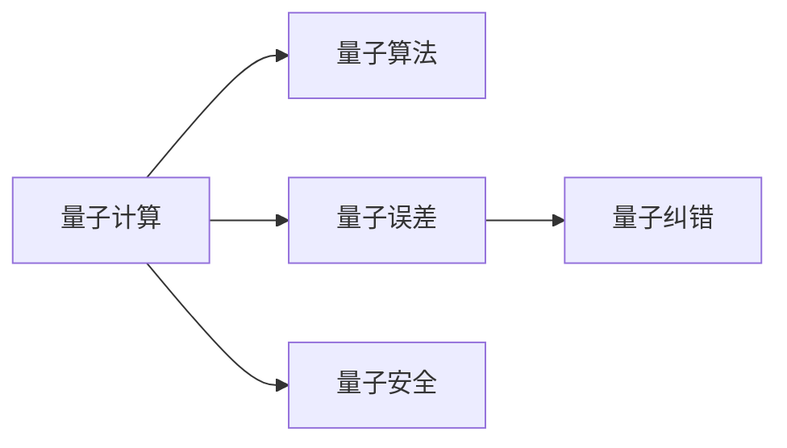

                 

# 量子计算管理：为未来颠覆性技术做准备

> 关键词：量子计算,量子算法,量子误差,量子纠错,量子管理,量子安全

## 1. 背景介绍

### 1.1 问题由来

量子计算作为未来颠覆性技术，其发展速度与日俱增，已逐渐从实验室走向实际应用。然而，量子计算的实际应用需要解决一系列技术难题，如量子误差的控制、量子纠错、量子算法的设计与优化、量子系统的稳定运行管理等。如何在这些关键领域做好充分准备，是实现量子计算实际应用的重要一步。本文将详细探讨量子计算的关键问题，并提供相关技术和管理方案。

### 1.2 问题核心关键点

量子计算与经典计算的本质区别在于，量子比特（qubit）具有量子叠加和量子纠缠的特性。这种特性使得量子计算在处理某些特定问题时，具有经典计算机无法比拟的优越性能。但是，量子计算的系统极其脆弱，对外部干扰极为敏感，量子误差、量子纠错、量子算法设计等技术难题亟需解决。

## 2. 核心概念与联系

### 2.1 核心概念概述

量子计算管理涉及多个核心概念，主要包括量子计算、量子算法、量子误差、量子纠错、量子安全等。

- **量子计算**：利用量子力学原理进行计算的计算机。其基本单位为量子比特（qubit），具有量子叠加和量子纠缠特性，可以进行并行计算，理论上具有超强的计算能力。

- **量子算法**：针对特定问题设计的量子计算算法，如Shor算法、Grover算法等。量子算法利用量子并行性，在特定问题上可以实现指数级的速度提升。

- **量子误差**：量子计算过程中，量子比特的状态受到环境干扰，导致量子信息丢失或错误。这是量子计算应用中的主要障碍。

- **量子纠错**：通过冗余编码和错误检测与纠正方法，保护量子比特的状态，避免量子错误对计算结果的影响。

- **量子安全**：利用量子密钥分发、量子态测量的不可克隆性等量子特性，构建安全的信息加密和传输系统。

### 2.2 核心概念原理和架构的 Mermaid 流程图(Mermaid 流程节点中不要有括号、逗号等特殊字符)



该图展示了量子计算与量子算法、量子误差、量子纠错和量子安全之间的关系。量子计算在实现特定问题的算法时，会受到量子误差的干扰；量子纠错可以保护量子比特，减少量子错误的影响；量子安全利用量子特性保障信息传输的安全性。

## 3. 核心算法原理 & 具体操作步骤

### 3.1 算法原理概述

量子计算管理的主要目标是通过管理量子比特的状态，提高量子计算的可靠性和安全性。核心算法包括量子误差控制、量子纠错、量子算法优化等。

**量子误差控制**：利用量子态测量的不可克隆性，检测并纠正量子比特的状态，保持量子计算的稳定性和准确性。

**量子纠错**：采用冗余编码技术，通过多个量子比特的合作，保护单个量子比特的状态，避免量子错误的传播和累积。

**量子算法优化**：通过改进量子算法，降低算法复杂度，提高量子计算的效率和准确性。

### 3.2 算法步骤详解

#### 3.2.1 量子误差控制

1. **量子态测量**：对量子比特的状态进行测量，获取量子信息。
2. **误差检测**：利用量子态测量的结果，检测量子比特的状态是否受到干扰。
3. **误差纠正**：根据误差检测结果，修正受干扰的量子比特状态。

#### 3.2.2 量子纠错

1. **冗余编码**：利用多个量子比特进行编码，形成冗余信息。
2. **错误检测**：检测编码后的量子比特是否存在错误。
3. **错误纠正**：通过冗余信息，纠正量子比特的错误。

#### 3.2.3 量子算法优化

1. **算法设计**：根据具体问题设计量子算法。
2. **算法优化**：通过量子电路优化、量子态合成等技术，减少量子计算的复杂度。
3. **实验验证**：在量子计算机上实验验证优化的效果。

### 3.3 算法优缺点

量子计算管理算法的优点在于：

- **高效性**：通过量子纠错和量子态合成等技术，提高了量子计算的效率。
- **可靠性**：利用冗余编码和误差检测，增强了量子计算的稳定性。
- **安全性**：利用量子密钥分发和量子态测量的不可克隆性，提高了信息传输的安全性。

缺点在于：

- **复杂性**：量子计算管理涉及的量子物理和算法知识复杂，需要深入理解。
- **资源需求高**：量子计算需要高度稳定的环境和大量资源，如低温环境、高质量的量子比特等。
- **技术瓶颈**：目前量子计算技术尚不成熟，量子纠错和量子态测量的技术难度较大。

### 3.4 算法应用领域

量子计算管理的应用领域广泛，涵盖金融、医药、化学、材料科学、密码学等多个领域。

- **金融领域**：利用量子计算加速金融模型的计算，提高风险评估和投资决策的效率。
- **医药领域**：利用量子计算模拟分子和化学反应过程，加速新药研发和药物设计。
- **化学和材料科学**：利用量子计算优化分子结构设计和材料属性预测，推动新材料和新药物的开发。
- **密码学**：利用量子计算破解经典加密算法，推动量子安全加密技术的发展。

## 4. 数学模型和公式 & 详细讲解 & 举例说明

### 4.1 数学模型构建

量子计算管理涉及到量子力学的数学模型，以下是核心数学模型的构建：

1. **量子比特（qubit）**：
$$ |\psi\rangle = \alpha|0\rangle + \beta|1\rangle $$
其中 $|\psi\rangle$ 表示量子比特的状态， $\alpha$ 和 $\beta$ 为复数系数，$|0\rangle$ 和 $|1\rangle$ 分别表示量子比特的基态和激发态。

2. **量子叠加**：
$$ |\psi\rangle = \frac{1}{\sqrt{2}}(|0\rangle + |1\rangle) $$
表示量子比特处于叠加态，可以同时表示0和1两个状态。

3. **量子纠缠**：
$$ |\psi\rangle = |0\rangle \otimes |0\rangle + |1\rangle \otimes |1\rangle $$
表示两个量子比特纠缠在一起，即使将它们分开，它们的状态仍然保持关联。

### 4.2 公式推导过程

**量子态测量的期望值**：
$$ \langle \psi | \hat{A} | \psi \rangle = \sum_{i} \langle i | \hat{A} | i \rangle \cdot \langle i | \psi \rangle \cdot \langle \psi | i \rangle $$
其中 $\hat{A}$ 为测量算符， $|i\rangle$ 为测量基底， $\langle i |$ 为测量算符的对偶算符。

**量子纠错码的冗余信息**：
假设我们使用$(n,k)$量子纠错码，冗余量子比特数目为$n-k$。通过EPR对纠缠编码和信息校正，可以得到纠错后的量子比特状态。

### 4.3 案例分析与讲解

以Shor算法为例，分析其量子纠错机制：

1. **准备步骤**：准备多个量子比特和辅助量子比特。
2. **量子叠加**：对初始量子比特进行量子叠加。
3. **量子错误检测**：通过量子态测量和冗余编码，检测并纠正量子错误。
4. **量子计算**：执行Shor算法，完成大整数的因子分解。

## 5. 项目实践：代码实例和详细解释说明

### 5.1 开发环境搭建

量子计算管理项目开发需要以下环境：

1. **Python编程语言**：选择Python 3.x版本，安装numpy、qiskit等量子计算相关库。
2. **量子计算框架**：选择Qiskit、Cirq等量子计算框架，支持量子比特的操作和量子电路的构建。
3. **硬件模拟环境**：搭建IBM Q系统或本地量子模拟环境，模拟量子计算过程。

### 5.2 源代码详细实现

以下是一个简单的量子纠错代码实现，以三比特EPR对为例：

```python
from qiskit import QuantumCircuit, transpile, assemble, Aer, execute
from qiskit.visualization import plot_histogram

# 构建量子电路
qc = QuantumCircuit(3)
# 准备三比特EPR对
qc.h(0)
qc.cx(0, 1)
qc.cx(1, 2)
qc.h(0)
qc.cx(0, 1)
qc.cx(1, 2)

# 模拟测量和纠错
result = execute(qc, Aer.get_backend('statevector_simulator')).result()
counts = result.get_counts()
plot_histogram(counts)
```

该代码实现了量子比特的初始准备、量子叠加、量子错误检测和纠错。通过运行代码，可以观察到纠错后的量子比特状态。

### 5.3 代码解读与分析

**量子电路构建**：
- `QuantumCircuit`：用于构建量子电路，`qc = QuantumCircuit(3)` 表示构建一个3个量子比特的量子电路。
- `h`：对量子比特进行Hadamard变换，实现量子叠加。
- `cx`：对量子比特进行CNOT操作，实现量子纠缠。

**量子状态测量与纠错**：
- `execute(qc, Aer.get_backend('statevector_simulator'))`：执行量子电路，使用状态向量模拟器。
- `result.get_counts()`：获取测量结果，`counts`为字典类型，键为量子比特状态，值为测量次数。

**可视化**：
- `plot_histogram(counts)`：将测量结果绘制成直方图，观察量子比特的状态分布。

## 6. 实际应用场景

### 6.1 金融领域

量子计算管理在金融领域的应用主要体现在以下几个方面：

1. **风险管理**：利用量子计算加速金融风险评估模型，优化投资组合配置，提高风险管理效率。
2. **期权定价**：利用量子算法进行复杂的期权定价，提升期权定价的精确度和速度。
3. **高频交易**：利用量子计算优化高频交易策略，提高交易效率和收益。

### 6.2 医药领域

在医药领域，量子计算管理的应用包括：

1. **新药研发**：利用量子计算模拟分子结构和化学反应过程，加速新药的研发和筛选。
2. **药物设计**：利用量子计算优化药物分子设计和蛋白结构预测，提高药物开发成功率。
3. **个性化医疗**：利用量子计算进行基因组分析，提供个性化医疗方案。

### 6.3 化学和材料科学

量子计算管理在化学和材料科学的应用包括：

1. **化学反应模拟**：利用量子计算模拟复杂的化学反应过程，预测反应路径和产物。
2. **材料属性预测**：利用量子计算预测材料的物理和化学属性，指导新材料的研发。
3. **分子结构设计**：利用量子计算优化分子结构和反应路径，提高材料性能。

### 6.4 未来应用展望

量子计算管理未来将广泛应用于更多领域，推动技术进步和经济发展。

1. **人工智能**：利用量子计算加速深度学习和模式识别算法，提高人工智能系统的效率和准确性。
2. **大数据分析**：利用量子计算进行大数据处理和分析，加速数据挖掘和知识发现。
3. **网络安全**：利用量子计算提高信息加密和解密速度，推动量子安全通信技术的发展。

## 7. 工具和资源推荐

### 7.1 学习资源推荐

1. **《量子计算原理》（Michael A. Nielsen）**：经典量子计算教材，系统介绍量子计算的基本原理和应用。
2. **《量子算法设计与实现》（Michael A. Unruh）**：量子算法设计与实现的详细教程，涵盖Shor算法、Grover算法等。
3. **Qiskit官方文档**：Qiskit量子计算框架的官方文档，提供丰富的示例和代码实现。
4. **IBM Q系统**：提供量子计算硬件模拟器和量子化学模拟工具，支持量子计算学习和研究。
5. **量子计算在线课程**：如Coursera的《Quantum Computing for Computer Scientists》课程，提供系统的量子计算课程学习。

### 7.2 开发工具推荐

1. **Qiskit**：IBM开发的量子计算框架，支持Python编程，提供丰富的量子电路构建工具。
2. **Cirq**：Google开发的量子计算框架，支持Python编程，适用于Google的量子计算硬件。
3. **QuTiP**：Python量子计算工具箱，支持量子计算模型的仿真和优化。
4. **Visual Studio Code**：支持量子计算的开发环境，集成Qiskit插件和量子计算代码的调试工具。

### 7.3 相关论文推荐

1. **《量子计算与量子算法》（Michael A. Nielsen）**：系统介绍量子计算与量子算法的核心概念和应用。
2. **《量子错误纠正与量子算法优化》（Michael A. Unruh）**：介绍量子错误纠正和量子算法优化方法，为实际应用提供技术支撑。
3. **《量子计算中的经典与量子优化》（Paweł Wocjan）**：探索量子计算与经典优化的结合，推动量子计算的实际应用。

## 8. 总结：未来发展趋势与挑战

### 8.1 研究成果总结

量子计算管理作为未来颠覆性技术的关键领域，其研究已经取得了显著进展。核心研究成果包括量子纠错码的设计、量子误差控制技术、量子算法优化等。这些研究成果为量子计算的实际应用奠定了坚实基础。

### 8.2 未来发展趋势

量子计算管理的未来发展趋势主要包括：

1. **量子算法优化**：进一步优化量子算法，提高量子计算的效率和准确性。
2. **量子纠错技术改进**：改进量子纠错码的设计，提升量子比特的稳定性。
3. **量子硬件的提升**：推动量子计算硬件的发展，提高量子比特的性能和可控性。
4. **跨学科融合**：与其他学科如人工智能、化学、材料科学等进行深度融合，拓展量子计算的应用领域。

### 8.3 面临的挑战

量子计算管理在实际应用中面临的主要挑战包括：

1. **技术瓶颈**：量子计算技术的成熟度仍有待提高，量子比特的稳定性、量子误差的控制等问题亟需解决。
2. **资源需求**：量子计算需要高质量的硬件环境，如低温环境、高质量的量子比特等，资源需求较高。
3. **成本问题**：量子计算硬件和量子计算算法的研究需要大量投入，成本较高，制约了量子计算的普及。

### 8.4 研究展望

未来，量子计算管理需要在以下几个方面进行深入研究：

1. **量子纠错码的优化**：进一步优化量子纠错码，提高量子比特的稳定性，降低量子计算的错误率。
2. **量子算法的设计**：开发更多高效的量子算法，提升量子计算在实际应用中的性能。
3. **量子硬件的发展**：推动量子计算硬件的研发，提高量子比特的性能和稳定性，降低资源需求。
4. **跨学科合作**：与其他学科如人工智能、化学、材料科学等进行深度合作，推动量子计算技术的综合应用。

## 9. 附录：常见问题与解答

### 9.1 常见问题

1. **量子计算的原理是什么？**
   量子计算利用量子叠加和量子纠缠特性，实现并行计算和超级计算，具有经典计算机无法比拟的计算能力。

2. **量子计算的实际应用有哪些？**
   量子计算在金融、医药、化学、材料科学、密码学等多个领域具有广泛应用前景，可以加速数据分析、新药研发、化学反应模拟等。

3. **量子计算的挑战有哪些？**
   量子计算面临的主要挑战包括量子误差的控制、量子算法的优化、量子纠错技术的发展等。

4. **量子计算管理有哪些关键技术？**
   量子计算管理的关键技术包括量子误差控制、量子纠错、量子算法优化等。

5. **如何学习和掌握量子计算管理技术？**
   推荐阅读《量子计算原理》、《量子算法设计与实现》等经典教材，参加Qiskit、Cirq等框架的学习课程，实践量子计算项目，积累经验。

### 9.2 详细解答

1. **量子计算的原理是什么？**
   量子计算利用量子叠加和量子纠缠特性，实现并行计算和超级计算。具体而言，量子比特可以同时处于多个状态，通过量子纠缠实现多个量子比特之间的信息交换，从而实现高效率的计算。

2. **量子计算的实际应用有哪些？**
   量子计算在金融、医药、化学、材料科学、密码学等多个领域具有广泛应用前景。例如，在金融领域，量子计算可以加速金融模型的计算，提高风险评估和投资决策的效率；在医药领域，量子计算可以模拟分子结构和化学反应过程，加速新药研发和药物设计；在化学和材料科学领域，量子计算可以优化分子结构设计和材料属性预测，推动新材料的研发。

3. **量子计算的挑战有哪些？**
   量子计算面临的主要挑战包括量子误差的控制、量子算法的优化、量子纠错技术的发展等。其中，量子误差的控制是量子计算的关键技术，通过量子态测量和量子纠错技术，可以保护量子比特的状态，降低计算错误；量子算法的优化是提高量子计算效率的关键，需要进一步研究和开发高效的量子算法；量子纠错技术的发展是提升量子计算稳定性的重要手段，需要设计更加鲁棒的纠错码。

4. **量子计算管理有哪些关键技术？**
   量子计算管理的关键技术包括量子误差控制、量子纠错、量子算法优化等。其中，量子误差控制通过量子态测量和误差检测，保持量子计算的稳定性；量子纠错通过冗余编码和错误检测与纠正方法，保护量子比特的状态；量子算法优化通过改进量子算法，降低算法复杂度，提高量子计算的效率和准确性。

5. **如何学习和掌握量子计算管理技术？**
   学习和掌握量子计算管理技术需要以下几个步骤：
   - 阅读经典教材，如《量子计算原理》、《量子算法设计与实现》等，系统了解量子计算的基本概念和原理。
   - 参加Qiskit、Cirq等框架的学习课程，掌握量子计算的实际编程和实验。
   - 实践量子计算项目，积累经验，理解量子计算的实际应用和问题。
   - 参加学术会议和研讨会，了解量子计算领域的最新研究进展。
   - 与领域专家交流，获取实际应用中的经验和建议。

---

作者：禅与计算机程序设计艺术 / Zen and the Art of Computer Programming

