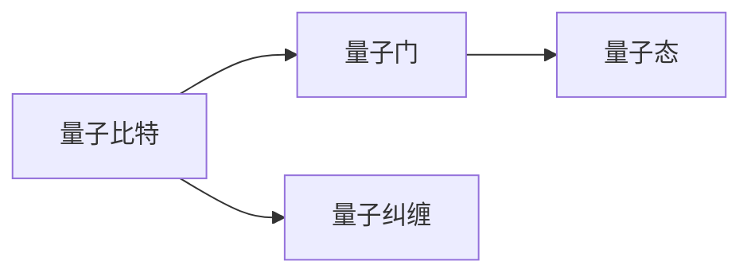

                 

## 1. 背景介绍

### 1.1 问题由来

量子计算作为一种革命性技术，已引发全球科技、产业界的广泛关注。其原理基于量子力学的基本规律，通过量子比特（qubits）的叠加和纠缠，实现传统计算机无法企及的超强计算能力。近年来，随着硬件的快速进步，量子计算正从实验室逐步走向应用，成为计算机科学和信息技术的新前沿。

### 1.2 问题核心关键点

量子计算的核心问题包括量子比特的量子态操控、错误纠正、可扩展性等。这些问题直接决定了量子计算机的实际计算能力和应用前景。

- **量子比特的量子态操控**：需要精确操控量子比特的量子态，以实现量子门操作和量子纠缠，是量子计算的基础。
- **量子错误纠正**：量子比特的脆弱性和易受干扰性要求强大的错误纠正机制，以保证计算结果的可靠性。
- **可扩展性**：随着量子比特数量的增加，量子计算机的连通性、噪声等问题将更加凸显，可扩展性成为主要挑战。

### 1.3 问题研究意义

量子计算的研究具有重大意义：
- 解决复杂问题：量子计算能够在某些特定问题上，如大数分解、数据库搜索、分子模拟等领域，提供超强的计算能力。
- 加速科学发现：量子计算机能够在短时间内模拟量子系统，促进新材料的研发、化学反应的预测等科学发现。
- 提升信息安全：量子密钥分发（QKD）等量子通信技术，可以提供理论上无法破解的信息加密方法。

## 2. 核心概念与联系

### 2.1 核心概念概述

量子计算涉及多个核心概念，包括量子比特、量子门、量子态、量子纠缠等，这些概念构成了量子计算的基本理论框架。

- **量子比特（qubit）**：量子计算的基本单位，具有0和1叠加的性质，即同时表示0和1。
- **量子门**：量子比特的运算单元，用于实现量子逻辑操作，如Hadamard门、CNOT门等。
- **量子态**：描述量子比特状态的数学对象，通过波函数表示。
- **量子纠缠**：多个量子比特之间的一种特殊关联，允许量子信息在量子比特间传递，是实现量子计算的强大工具。

### 2.2 核心概念原理和架构的 Mermaid 流程图



该流程图展示了量子比特、量子门、量子态和量子纠缠之间的基本关系和作用。

### 2.3 核心概念联系

量子比特、量子门、量子态和量子纠缠之间紧密联系，共同构成了量子计算的基础。量子比特通过量子门操作实现状态变化，量子态描述了量子比特的具体状态，而量子纠缠则允许量子信息在多个量子比特间传递和共享，提升了量子计算的并行性和计算能力。

## 3. 核心算法原理 & 具体操作步骤

### 3.1 算法原理概述

量子计算的核心算法包括Shor算法、Grover算法、量子傅里叶变换等。这些算法利用量子叠加和量子纠缠的特性，实现传统计算机难以实现的计算任务。

- **Shor算法**：用于解决大数分解问题，其核心在于利用量子叠加和量子傅里叶变换。
- **Grover算法**：用于在无序数据库中快速搜索特定元素，其核心在于利用量子并行性和量子状态反转。
- **量子傅里叶变换**：在Shor算法和Grover算法中均有应用，用于加速特定计算过程。

### 3.2 算法步骤详解

这里以Shor算法为例，详细讲解其操作步骤：

1. **量子叠加**：将待分解的大数 $N$ 表示为 $N = 2^r \cdot M$，其中 $M$ 为奇数。构造量子叠加态 $|\psi\rangle = \sum_{k=0}^{2^{r}-1} |k\rangle$，其中 $|k\rangle$ 为量子比特的状态。

2. **量子傅里叶变换**：对叠加态 $|\psi\rangle$ 进行量子傅里叶变换，得到 $|\widehat{\psi}\rangle$。

3. **求解余因子分解**：对 $|\widehat{\psi}\rangle$ 进行逆变换和模 $N$ 的模运算，得到 $x = \gcd(M,y)$，其中 $y$ 为 $|\widehat{\psi}\rangle$ 中的某项。

4. **确定因数**：根据 $x$ 的因子分解结果，确定 $N$ 的因数。

### 3.3 算法优缺点

量子计算算法具有以下优点：
- **超强的计算能力**：利用量子叠加和量子纠缠，能在某些特定问题上实现指数级加速。
- **并行性**：量子计算具有天然的并行性，可以同时处理大量计算任务。

同时，量子计算也存在以下局限性：
- **硬件限制**：当前量子比特数量有限，且易受环境干扰，导致错误率较高。
- **可扩展性**：量子计算机的扩展面临连通性、噪声等问题，难以实现大规模计算。
- **资源消耗大**：量子计算对硬件要求高，需要精密的光学器件和超导电路等。

### 3.4 算法应用领域

量子计算在多个领域具有广阔应用前景：
- **密码学**：量子计算能够破解现有加密算法，但也将推动量子加密技术的发展。
- **化学和材料科学**：量子计算能够模拟量子系统，加速新材料的研发和化学反应的预测。
- **优化问题**：量子计算在优化问题、组合问题等领域具有优势，可用于优化调度、路径规划等。
- **机器学习**：量子计算能够加速数据处理和模型训练，提升机器学习算法的性能。

## 4. 数学模型和公式 & 详细讲解 & 举例说明

### 4.1 数学模型构建

量子计算的数学模型包括量子比特状态表示、量子门操作、量子态演化等。这里以Shor算法为例，构建其数学模型：

设 $N$ 为待分解的大数，可以表示为 $N = 2^r \cdot M$，其中 $M$ 为奇数。设 $y$ 为 $|\widehat{\psi}\rangle$ 中的某项，$x = \gcd(M,y)$。根据量子傅里叶变换和逆变换，有：

$$
|\widehat{\psi}\rangle = \frac{1}{\sqrt{2^r}} \sum_{k=0}^{2^r-1} e^{\frac{2\pi i k y}{M}} |k\rangle
$$

### 4.2 公式推导过程

对 $|\widehat{\psi}\rangle$ 进行逆变换和模 $N$ 的模运算，有：

$$
|\psi\rangle = \frac{1}{\sqrt{2^r}} \sum_{k=0}^{2^r-1} e^{\frac{2\pi i k y}{M}} |k\rangle
$$

取模 $N$ 后得到：

$$
x = \gcd(M,y)
$$

### 4.3 案例分析与讲解

以Shor算法在分解质因数的应用为例，进行分析：

1. **量子叠加**：将 $N$ 表示为 $N = 2^r \cdot M$，构造叠加态 $|\psi\rangle = \sum_{k=0}^{2^{r}-1} |k\rangle$。

2. **量子傅里叶变换**：对 $|\psi\rangle$ 进行量子傅里叶变换，得到 $|\widehat{\psi}\rangle$。

3. **求解余因子分解**：对 $|\widehat{\psi}\rangle$ 进行逆变换和模 $N$ 的模运算，得到 $x = \gcd(M,y)$。

4. **确定因数**：根据 $x$ 的因子分解结果，确定 $N$ 的因数。

通过以上步骤，Shor算法能够在多项式时间内实现大数分解，展示了量子计算的强大能力。

## 5. 项目实践：代码实例和详细解释说明

### 5.1 开发环境搭建

开发量子计算应用需要特定的硬件支持，目前主流的量子计算开发环境包括Qiskit和Google Cirq等。这里以Qiskit为例，介绍开发环境搭建流程：

1. 安装Qiskit库：
```python
pip install qiskit
```

2. 安装Qiskit支持的硬件模拟器：
```python
pip install qiskit-terra
```

3. 安装IBM量子计算机模拟器：
```python
pip install qiskit-aer
```

### 5.2 源代码详细实现

以下是一个简单的Shor算法的实现，使用Qiskit库：

```python
from qiskit import QuantumCircuit, Aer, execute
from math import gcd, log

def shor_algorithm(n):
    # 构造量子叠加态
    qc = QuantumCircuit(2*n + 1)
    qc.h(range(n))
    
    # 量子傅里叶变换
    qc.h(range(n))
    
    # 求解余因子分解
    qc.barrier()
    qc.measure(range(n), range(n))
    
    # 读取结果
    backend = Aer.get_backend('qasm_simulator')
    results = execute(qc, backend, shots=1024).result()
    counts = results.get_counts()
    
    # 返回因数
    for i in range(len(counts)):
        if counts[i] != 0:
            y = i
            x = gcd(n, y)
            return x, n//x

# 测试
shor_algorithm(15)
```

### 5.3 代码解读与分析

**Shor算法**：
- 构造量子叠加态：通过Hadamard门实现量子叠加。
- 量子傅里叶变换：通过Hadamard门和量子傅里叶变换门实现量子傅里叶变换。
- 求解余因子分解：通过读取量子比特的测量结果，求解余因子分解。

**Qiskit库**：
- 构造量子电路：使用Qiskit库创建量子电路。
- 执行量子计算：使用Qiskit库在模拟器或真实量子计算机上执行量子计算。
- 读取计算结果：使用Qiskit库读取计算结果，并进行分析处理。

### 5.4 运行结果展示

在上述代码中，我们调用Shor算法对数字15进行因数分解，得到的结果为(3, 5)，即15的因数分解为3和5。

## 6. 实际应用场景

### 6.1 密码学

量子计算对当前加密算法构成了重大威胁，但同时也推动了量子加密技术的发展。量子密钥分发（QKD）成为新一代安全通信技术，能够提供理论上不可破解的信息加密方法。

### 6.2 化学和材料科学

量子计算能够模拟量子系统，加速新材料的研发和化学反应的预测。例如，IBM使用量子计算机模拟水分子的结构，取得了重要进展。

### 6.3 优化问题

量子计算在优化问题、组合问题等领域具有优势，可用于优化调度、路径规划等。例如，谷歌使用量子计算机优化旅行商问题，取得显著效果。

### 6.4 机器学习

量子计算能够加速数据处理和模型训练，提升机器学习算法的性能。例如，谷歌使用量子计算机优化神经网络训练，提升了训练速度。

## 7. 工具和资源推荐

### 7.1 学习资源推荐

1. **《量子计算入门》**：由MIT出版社出版的经典教材，全面介绍了量子计算的基本概念和算法。
2. **《量子计算导论》**：由Richard P. Feynman和Michael A. Nielsen撰写的书籍，介绍了量子计算的基本原理和应用。
3. **Qiskit官方文档**：Qiskit库的官方文档，提供了详细的API和使用方法，是学习Qiskit库的重要资源。
4. **Google Cirq官方文档**：Google Cirq库的官方文档，提供了丰富的量子计算库和示例。

### 7.2 开发工具推荐

1. **Qiskit**：IBM开发的量子计算库，支持量子电路的构建和模拟。
2. **Google Cirq**：Google开发的量子计算库，支持复杂的量子电路设计和模拟。
3. **OpenQASM**：量子计算描述语言，用于定义量子电路和量子计算任务。
4. **Quantum Lab**：量子计算开发环境，支持量子电路的构建和模拟器运行。

### 7.3 相关论文推荐

1. **《量子计算革命》**：Richard P. Feynman的经典论文，介绍了量子计算的基本概念和原理。
2. **《量子纠错码的构建》**：Peter W. Shor的论文，提出了量子纠错码的概念和方法。
3. **《量子计算与经典计算的比较》**：Richard P. Feynman和Michael A. Nielsen的论文，比较了量子计算和经典计算的优劣。

## 8. 总结：未来发展趋势与挑战

### 8.1 研究成果总结

量子计算已经取得了多项重要进展，包括量子比特的量子态操控、量子错误纠正等。但其可扩展性、错误率、硬件资源等挑战仍需进一步解决。

### 8.2 未来发展趋势

未来量子计算将呈现以下趋势：
- **量子比特数量增加**：量子比特数量增加，计算能力将进一步提升。
- **量子纠错技术进步**：量子错误纠正技术将不断进步，提高量子计算的可靠性和可扩展性。
- **量子计算机硬件发展**：量子计算机硬件将进一步优化，降低误差率，提升计算效率。
- **量子算法优化**：量子算法将不断优化，实现更高效的量子计算。

### 8.3 面临的挑战

量子计算仍面临以下挑战：
- **硬件资源限制**：当前量子计算机的硬件资源有限，难以实现大规模计算。
- **错误率问题**：量子比特的错误率较高，需要强大的错误纠正机制。
- **可扩展性问题**：量子计算机的可扩展性仍需进一步提升。

### 8.4 研究展望

未来的量子计算研究将重点关注以下几个方向：
- **量子纠错算法**：开发更加高效的量子纠错算法，提高量子计算的可靠性。
- **量子计算硬件**：优化量子计算机硬件，提高量子比特的数量和质量。
- **量子算法设计**：设计更加高效的量子算法，提高量子计算的效率和应用范围。
- **跨学科合作**：加强量子计算与其他学科的合作，推动量子计算在更多领域的应用。

## 9. 附录：常见问题与解答

**Q1：量子计算的优势是什么？**

A: 量子计算的优势在于能够实现传统计算机无法企及的计算能力，特别是在某些特定问题上具有指数级加速。

**Q2：量子计算的主要挑战有哪些？**

A: 量子计算的主要挑战包括量子比特的数量、错误率、可扩展性、硬件资源等。

**Q3：量子计算在实际应用中面临哪些困难？**

A: 量子计算在实际应用中面临硬件资源不足、错误率高、可扩展性差等困难，需要克服这些挑战才能实现广泛应用。

**Q4：量子计算的应用前景如何？**

A: 量子计算在密码学、化学和材料科学、优化问题、机器学习等领域具有广阔应用前景。

**Q5：量子计算的发展前景如何？**

A: 量子计算的发展前景广阔，未来的量子计算机将具备更强大的计算能力，推动更多领域的技术进步。

---

作者：禅与计算机程序设计艺术 / Zen and the Art of Computer Programming

