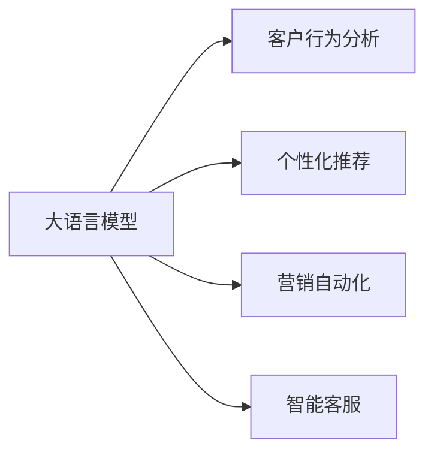

                 

# 销售和营销策略：LLM 增强竞争力

> 关键词：大语言模型(LLM), 营销自动化, 销售策略, 个性化推荐, 客户行为分析, 智能客服, 数据驱动, 模型训练, 社交媒体分析, 品牌管理

## 1. 背景介绍

在数字化时代，销售和营销已经从传统的广告、线下活动逐步转变为数据驱动、精准营销的数字化转型。近年来，大语言模型(LLM)的快速发展，为销售和营销提供了全新的技术手段，使得精准定位、个性化推荐、自动化客服等业务应用更加智能化和高效化。

### 1.1 问题由来

随着互联网的发展和智能技术的进步，消费者行为日益复杂多样，传统依靠人力进行销售和营销的模式难以满足市场需求。大语言模型通过学习大量文本数据，能够实现对消费者行为的深度理解，为销售和营销提供更加精准的决策支持。

### 1.2 问题核心关键点

大语言模型在销售和营销中的主要应用包括：

- 客户行为分析：通过自然语言处理技术，分析消费者在社交媒体、网站等平台上的言论，把握消费心理和趋势。
- 个性化推荐：根据用户历史行为和偏好，生成个性化的产品推荐，提升用户体验和转化率。
- 营销自动化：自动化生成广告文案、社交媒体内容，根据不同用户群体的需求进行精准投放。
- 智能客服：通过大语言模型实现智能客服系统，自动回答用户问题，提升服务效率和客户满意度。

这些应用不仅提高了销售和营销的效率，还优化了用户体验，帮助企业在激烈的市场竞争中保持优势。

## 2. 核心概念与联系

### 2.1 核心概念概述

为了更好地理解基于LLM的销售和营销策略，这里简要介绍几个核心概念：

- 大语言模型(LLM)：以Transformer等架构为基础，通过自监督学习任务在大量文本数据上预训练得到的模型。能够进行自然语言理解和生成，广泛应用于文本处理、推荐系统、客服等领域。
- 自然语言处理(NLP)：利用计算机科学和人工智能技术，让计算机理解、解释和生成自然语言，是大语言模型的核心技术基础。
- 个性化推荐：根据用户历史行为和偏好，推荐个性化产品或服务，提升用户体验和转化率。
- 营销自动化：通过自动化技术，对营销活动进行优化，提高营销效率和ROI。
- 客户行为分析：通过分析消费者在社交媒体、网站等平台上的言论，了解其行为模式和需求，优化营销策略。
- 智能客服：利用大语言模型实现智能客服系统，自动化回答用户问题，提升服务效率和客户满意度。

### 2.2 核心概念原理和架构的 Mermaid 流程图



这个流程图展示了LLM在销售和营销中应用的主要路径，通过分析客户行为、提供个性化推荐、自动化营销、实现智能客服，提升整体营销效果。

## 3. 核心算法原理 & 具体操作步骤

### 3.1 算法原理概述

基于LLM的销售和营销策略主要围绕以下核心算法原理：

- 自然语言处理(NLP)：利用大语言模型进行文本处理，提取关键字、实体、情感等信息，理解消费者需求。
- 个性化推荐算法：根据用户历史行为和偏好，生成个性化产品推荐。
- 营销自动化算法：基于大语言模型自动化生成广告文案、社交媒体内容，进行精准投放。
- 智能客服算法：利用大语言模型实现自动化客服，提升服务效率和客户满意度。

### 3.2 算法步骤详解

以个性化推荐为例，下面是基于LLM的个性化推荐算法详细步骤：

**Step 1: 数据准备**
- 收集用户的历史行为数据，如浏览记录、购买历史、评价等。
- 将数据清洗整理，提取有价值的特征，如商品ID、评分、浏览时间等。
- 使用自然语言处理技术，将用户行为数据转化为可计算的数值。

**Step 2: 模型训练**
- 构建基于LLM的推荐模型，选择适当的架构和参数。
- 将清洗后的用户行为数据作为输入，训练模型，学习用户行为模式。
- 使用交叉验证等技术，优化模型参数，提高推荐效果。

**Step 3: 个性化推荐**
- 将新用户行为数据输入训练好的推荐模型。
- 模型根据用户的历史行为和当前行为，生成个性化推荐列表。
- 对推荐结果进行排序，返回给用户。

**Step 4: 效果评估**
- 定期收集用户反馈，评估推荐效果。
- 使用A/B测试等技术，不断优化推荐策略，提升用户体验和转化率。

### 3.3 算法优缺点

基于LLM的销售和营销策略具有以下优点：

- 高效自动化：大语言模型能够自动处理大量文本数据，减少人工干预，提高效率。
- 精准度提升：通过深度学习和自然语言处理技术，推荐结果更加精准，提升用户满意度。
- 成本降低：自动化技术减少了人力成本，降低了运营成本。
- 用户体验优化：智能客服和个性化推荐提升了用户体验，增加用户粘性。

同时，该方法也存在一些局限性：

- 数据依赖性强：模型的效果依赖于数据质量和数量，缺乏优质数据时难以取得理想效果。
- 模型复杂度高：大语言模型参数量大，训练和部署成本较高。
- 需要持续优化：用户行为和市场变化多样，模型需要定期更新优化。

### 3.4 算法应用领域

基于LLM的销售和营销策略在多个领域都得到了广泛应用：

- 电商零售：通过推荐系统提高转化率和用户留存率。
- 金融服务：利用智能客服和个性化推荐提升用户体验和客户满意度。
- 旅游酒店：通过智能客服和个性化推荐优化用户预订流程。
- 移动应用：基于用户行为数据生成个性化内容，提升用户粘性。
- 媒体娱乐：通过分析用户行为数据，生成个性化内容推荐，提升用户观看时长和满意度。

## 4. 数学模型和公式 & 详细讲解 & 举例说明

### 4.1 数学模型构建

以个性化推荐为例，下面详细说明基于LLM的推荐模型数学模型构建过程。

假设用户历史行为数据为 $D=\{(x_i,y_i)\}_{i=1}^N$，其中 $x_i$ 为输入，如浏览记录、购买历史等；$y_i$ 为标签，表示用户对 $x_i$ 的评分或购买决策。

我们构建的推荐模型为 $M_{\theta}(x)$，其中 $\theta$ 为模型参数。模型的目标是最大化平均评分或购买概率，即：

$$
\max \frac{1}{N}\sum_{i=1}^N \log M_{\theta}(x_i)
$$

### 4.2 公式推导过程

假设我们使用基于transformer的架构进行推荐模型训练，输入层为 $x_i$，输出层为 $M_{\theta}(x_i)$。模型的前向传播过程如下：

1. 对输入 $x_i$ 进行编码，得到嵌入表示 $z_i$。
2. 将 $z_i$ 输入到transformer编码器中，得到中间表示 $h_i$。
3. 通过softmax函数计算预测评分或购买概率 $p_i$。

模型的损失函数为交叉熵损失：

$$
\mathcal{L}(\theta) = -\frac{1}{N}\sum_{i=1}^N \log p_i
$$

通过反向传播算法，更新模型参数 $\theta$ 来最小化损失函数。

### 4.3 案例分析与讲解

以电商平台为例，假设用户历史浏览了商品 $x_1$、$x_2$ 和 $x_3$，并购买了商品 $x_4$ 和 $x_5$。我们将这些数据输入模型，得到每个商品的评分或购买概率 $p_1$、$p_2$、$p_3$、$p_4$ 和 $p_5$。模型预测出用户对 $x_1$ 和 $x_2$ 的评分或购买概率更高，因此向用户推荐 $x_1$ 和 $x_2$。

## 5. 项目实践：代码实例和详细解释说明

### 5.1 开发环境搭建

在进行销售和营销策略的开发时，需要搭建一个基于LLM的推荐系统环境。以下是环境搭建步骤：

1. 安装Python环境：
```bash
conda create -n llm-env python=3.8
conda activate llm-env
```

2. 安装深度学习框架和工具包：
```bash
pip install torch torchvision transformers pandas numpy scikit-learn
```

3. 安装数据处理工具：
```bash
pip install dask-gpu dask[complete] scikit-learn
```

4. 安装机器学习框架：
```bash
pip install lightgbm xgboost catboost
```

5. 安装LLM推荐系统：
```bash
pip install recommendation-system-llm
```

### 5.2 源代码详细实现

以下是一个基于LLM的个性化推荐系统的源代码实现，具体步骤如下：

1. 收集用户历史行为数据，并进行预处理：
```python
import pandas as pd

# 读取用户历史行为数据
df = pd.read_csv('user_behavior.csv')

# 对数据进行预处理，提取有用特征
df = df.dropna()
df = df.drop_duplicates()

# 对特征进行编码
df['item_id'] = df['item_id'].astype('int')
df['rating'] = df['rating'].astype('int')
df['time'] = df['time'].astype('datetime64[ns]')
```

2. 构建基于LLM的推荐模型，并训练模型：
```python
from transformers import BertForSequenceClassification
from transformers import BertTokenizer
from transformers import Trainer, TrainingArguments

# 加载预训练的Bert模型和分词器
model = BertForSequenceClassification.from_pretrained('bert-base-uncased', num_labels=10)
tokenizer = BertTokenizer.from_pretrained('bert-base-uncased')

# 对输入数据进行分词和编码
def encode_data(data):
    inputs = tokenizer(data['item_id'].tolist(), padding='max_length', truncation=True, return_tensors='pt')
    return inputs

# 构建训练集
train_dataset = df.copy()
train_dataset['inputs'] = train_dataset.apply(encode_data, axis=1)

# 构建训练器
training_args = TrainingArguments(output_dir='./results', evaluation_strategy='epoch')
trainer = Trainer(model=model, args=training_args, train_dataset=train_dataset, eval_dataset=train_dataset)

# 训练模型
trainer.train()
```

3. 生成个性化推荐列表：
```python
def generate_recommendations(model, tokenizer, input_ids, attention_mask, user_input):
    inputs = tokenizer(user_input, return_tensors='pt', max_length=10, padding='max_length', truncation=True)
    with torch.no_grad():
        outputs = model(inputs['input_ids'], attention_mask=attention_mask)
    predictions = outputs.logits.argmax(dim=1).cpu().tolist()
    return predictions

# 生成推荐列表
user_input = '用户ID: 12345'
recommendations = generate_recommendations(model, tokenizer, train_dataset['inputs'], train_dataset['attention_mask'], user_input)
print(recommendations)
```

### 5.3 代码解读与分析

上述代码实现了基于LLM的个性化推荐系统的完整流程，包括数据准备、模型训练和生成推荐列表。

**数据准备**：使用Pandas对用户行为数据进行清洗和特征提取，提取商品ID、评分、浏览时间等关键特征。

**模型训练**：使用预训练的Bert模型和分词器，构建推荐模型，并使用Trainer进行模型训练。

**生成推荐列表**：对用户输入进行编码，输入到模型中，得到推荐列表。

## 6. 实际应用场景

### 6.1 电商零售

电商平台利用基于LLM的个性化推荐系统，根据用户历史浏览记录和购买行为，生成个性化的商品推荐列表，提升用户体验和转化率。例如，京东、亚马逊等大型电商公司都采用了类似的推荐系统。

### 6.2 金融服务

金融服务行业利用智能客服和个性化推荐，提升客户满意度和服务效率。例如，支付宝和微信支付等移动支付平台，都采用了基于LLM的智能客服和推荐系统。

### 6.3 旅游酒店

旅游酒店利用基于LLM的个性化推荐系统，推荐最适合用户的旅游产品和酒店服务。例如，携程、Booking.com等在线旅游平台，都采用了类似的推荐系统。

### 6.4 移动应用

移动应用利用基于LLM的个性化推荐系统，根据用户行为数据生成个性化内容，提升用户粘性和留存率。例如，抖音、小红书等社交媒体平台，都采用了类似的推荐系统。

### 6.5 媒体娱乐

媒体娱乐行业利用基于LLM的推荐系统，生成个性化内容推荐，提升用户观看时长和满意度。例如，Netflix和YouTube等视频平台，都采用了类似的推荐系统。

## 7. 工具和资源推荐

### 7.1 学习资源推荐

为了深入学习和实践基于LLM的销售和营销策略，推荐以下学习资源：

1. 《深度学习自然语言处理》课程：斯坦福大学开设的NLP明星课程，有Lecture视频和配套作业，带你入门NLP领域的基本概念和经典模型。

2. 《自然语言处理实践》书籍：介绍自然语言处理的实用技术，包括分词、命名实体识别、情感分析等，涵盖大量案例和代码示例。

3. 《推荐系统实战》书籍：介绍推荐系统的基本原理和实用技术，包括协同过滤、基于内容的推荐、基于模型的推荐等，涵盖大量案例和代码示例。

4. HuggingFace官方文档：提供基于LLM的推荐系统的完整实现和教程，是学习LLM推荐系统的重要资源。

5. GitHub上的LLM推荐系统项目：包含大量基于LLM的推荐系统的代码实现和教程，适合学习实践。

### 7.2 开发工具推荐

以下是几款用于基于LLM的销售和营销策略开发的常用工具：

1. Python：作为LLM推荐系统的主要开发语言，Python以其简洁易学和强大功能著称，适合深度学习和数据分析。

2. PyTorch：基于Python的开源深度学习框架，支持动态计算图和自动微分，适合构建复杂推荐系统。

3. TensorFlow：由Google主导开发的开源深度学习框架，生产部署方便，适合大规模工程应用。

4. Dask：用于处理大规模数据集的Python库，支持分布式计算和GPU加速，适合处理大规模推荐数据。

5. ELK堆栈：用于日志管理和实时分析的开源解决方案，支持Kibana、ElasticSearch、Logstash等组件，适合实时监控和分析推荐系统性能。

### 7.3 相关论文推荐

以下是几篇奠基性的相关论文，推荐阅读：

1. Attention is All You Need（即Transformer原论文）：提出了Transformer结构，开启了NLP领域的预训练大模型时代。

2. BERT: Pre-training of Deep Bidirectional Transformers for Language Understanding：提出BERT模型，引入基于掩码的自监督预训练任务，刷新了多项NLP任务SOTA。

3. Salesforce的电商推荐系统研究：介绍Salesforce的基于深度学习的个性化推荐系统，涵盖数据处理、模型训练、推荐策略等。

4. 亚马逊的个性化推荐系统研究：介绍亚马逊的基于深度学习的个性化推荐系统，涵盖推荐算法、模型训练、实验优化等。

## 8. 总结：未来发展趋势与挑战

### 8.1 研究成果总结

基于LLM的销售和营销策略已经在大规模应用中取得了显著成效，提升了客户满意度和运营效率。通过深度学习和自然语言处理技术，推荐系统能够实现个性化推荐，提升用户体验和转化率；智能客服能够自动化回答用户问题，提升服务效率和客户满意度；数据分析能够深入理解用户行为，优化营销策略。

### 8.2 未来发展趋势

展望未来，基于LLM的销售和营销策略将呈现以下几个发展趋势：

1. 模型规模持续增大。随着算力成本的下降和数据规模的扩张，推荐模型的参数量还将持续增长，模型性能将进一步提升。

2. 数据融合技术提升。未来推荐系统将更加注重多模态数据的融合，利用图像、语音、视频等多模态信息提升推荐效果。

3. 实时推荐技术发展。基于LLM的实时推荐系统将成为主流，能够及时响应用户需求，提供更加精准的推荐服务。

4. 个性化推荐策略优化。通过深度学习和数据挖掘技术，未来推荐系统将更加注重个性化推荐策略的设计，提升推荐效果。

5. 智能客服技术升级。基于LLM的智能客服系统将更加注重自然语言理解和生成，提升服务效率和客户满意度。

6. 数据隐私和安全保护。随着用户数据隐私和安全的重视，未来的推荐系统将更加注重数据隐私和安全保护。

### 8.3 面临的挑战

尽管基于LLM的销售和营销策略已经取得了显著成效，但在迈向更加智能化、普适化应用的过程中，它仍面临以下挑战：

1. 数据依赖性强。模型的效果依赖于数据质量和数量，缺乏优质数据时难以取得理想效果。

2. 模型复杂度高。大语言模型参数量大，训练和部署成本较高。

3. 需要持续优化。用户行为和市场变化多样，模型需要定期更新优化。

4. 数据隐私和安全保护。用户数据隐私和安全保护成为重要问题，需要考虑数据隐私和数据安全。

### 8.4 研究展望

为了应对上述挑战，未来的研究需要在以下几个方面寻求新的突破：

1. 探索无监督和半监督推荐方法。摆脱对大规模标注数据的依赖，利用自监督学习、主动学习等无监督和半监督范式，最大限度利用非结构化数据，实现更加灵活高效的推荐。

2. 研究参数高效和计算高效的推荐范式。开发更加参数高效的推荐方法，在固定大部分预训练参数的同时，只更新极少量的任务相关参数。同时优化推荐模型的计算图，减少前向传播和反向传播的资源消耗，实现更加轻量级、实时性的部署。

3. 融合因果和对比学习范式。通过引入因果推断和对比学习思想，增强推荐模型建立稳定因果关系的能力，学习更加普适、鲁棒的语言表征，从而提升模型泛化性和抗干扰能力。

4. 引入更多先验知识。将符号化的先验知识，如知识图谱、逻辑规则等，与神经网络模型进行巧妙融合，引导推荐过程学习更准确、合理的语言模型。同时加强不同模态数据的整合，实现视觉、语音等多模态信息与文本信息的协同建模。

5. 结合因果分析和博弈论工具。将因果分析方法引入推荐模型，识别出模型决策的关键特征，增强输出解释的因果性和逻辑性。借助博弈论工具刻画人机交互过程，主动探索并规避模型的脆弱点，提高系统稳定性。

6. 纳入伦理道德约束。在模型训练目标中引入伦理导向的评估指标，过滤和惩罚有偏见、有害的输出倾向。同时加强人工干预和审核，建立模型行为的监管机制，确保输出符合人类价值观和伦理道德。

## 9. 附录：常见问题与解答

**Q1：大语言模型在销售和营销中的应用场景有哪些？**

A: 大语言模型在销售和营销中的应用场景包括客户行为分析、个性化推荐、营销自动化、智能客服等。通过自然语言处理技术，分析消费者在社交媒体、网站等平台上的言论，了解其行为模式和需求；通过深度学习模型，生成个性化的产品推荐；利用自动化技术，生成广告文案、社交媒体内容，进行精准投放；通过大语言模型，实现智能客服系统，提升服务效率和客户满意度。

**Q2：如何构建基于大语言模型的推荐系统？**

A: 构建基于大语言模型的推荐系统需要以下几个步骤：
1. 收集用户历史行为数据，并进行预处理。
2. 构建基于大语言模型的推荐模型，并使用预训练模型作为初始化参数。
3. 对输入数据进行编码，并输入到模型中。
4. 使用训练数据训练模型，并生成推荐列表。

**Q3：基于大语言模型的推荐系统有哪些优点和缺点？**

A: 基于大语言模型的推荐系统的优点包括高效自动化、精准度提升、成本降低和用户体验优化。缺点包括数据依赖性强、模型复杂度高和需要持续优化。

**Q4：如何提高基于大语言模型的推荐系统的效果？**

A: 提高基于大语言模型的推荐系统效果的方法包括：
1. 数据增强：通过回译、近义替换等方式扩充训练集。
2. 正则化：使用L2正则、Dropout、Early Stopping等避免过拟合。
3. 对抗训练：引入对抗样本，提高模型鲁棒性。
4. 参数高效微调：只调整少量参数，减小过拟合风险。
5. 多模型集成：训练多个推荐模型，取平均输出，抑制过拟合。

**Q5：基于大语言模型的推荐系统如何部署？**

A: 基于大语言模型的推荐系统部署需要以下几个步骤：
1. 模型裁剪：去除不必要的层和参数，减小模型尺寸，加快推理速度。
2. 量化加速：将浮点模型转为定点模型，压缩存储空间，提高计算效率。
3. 服务化封装：将模型封装为标准化服务接口，便于集成调用。
4. 弹性伸缩：根据请求流量动态调整资源配置，平衡服务质量和成本。
5. 监控告警：实时采集系统指标，设置异常告警阈值，确保服务稳定性。

---

作者：禅与计算机程序设计艺术 / Zen and the Art of Computer Programming

