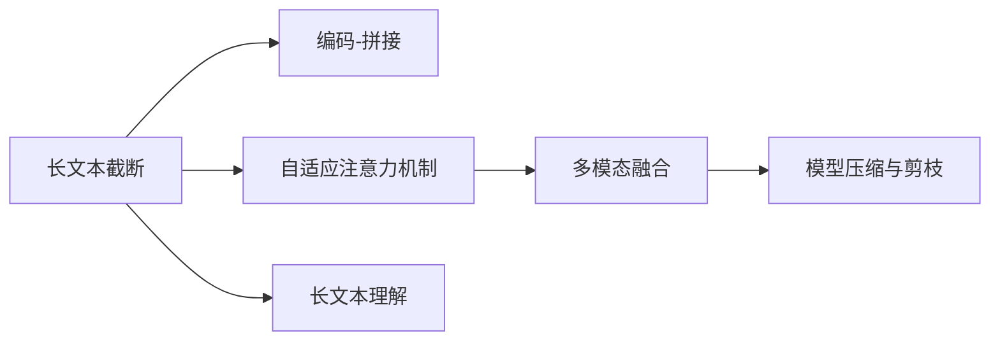

                 

# 长文本理解：克服Transformer长度限制

长文本理解（Long Text Understanding）是大规模预训练语言模型面临的重要挑战之一。在传统的Transformer架构中，由于自注意力机制的复杂性，对超长序列进行建模变得异常困难，往往需要截断序列或使用特殊的注意力机制来缓解这一问题。本文将系统地介绍长文本理解中的核心概念、算法原理和实践方法，帮助读者更好地理解如何克服Transformer在处理长文本时的长度限制。

## 1. 背景介绍

### 1.1 问题由来

随着自然语言处理(NLP)任务的不断扩展，如摘要生成、机器翻译、文本分类等，对长文本的理解需求日益增加。预训练语言模型，如BERT、GPT等，虽然在大规模文本数据上取得了巨大成功，但在处理长文本时仍存在明显瓶颈。主要原因在于：

1. **注意力机制计算复杂度高**：Transformer的注意力机制计算量随序列长度呈平方级增长，导致模型难以处理超长序列。
2. **模型内存占用大**：由于模型参数较多，在处理长文本时，模型的内存消耗显著增加。
3. **训练时间长**：长文本的处理需要大量计算资源，导致训练时间显著延长。

### 1.2 问题核心关键点

长文本理解的核心在于如何在模型设计、算法优化和硬件优化上，有效处理长文本，提升模型的性能和效率。为此，研究者们提出了多种策略，包括截断序列、自适应注意力机制、多模态融合等，以解决Transformer在长文本处理中的限制。

## 2. 核心概念与联系

### 2.1 核心概念概述

长文本理解涉及以下核心概念：

- **Transformer架构**：一种基于自注意力机制的神经网络模型，广泛应用于序列建模任务，但在长序列处理中存在计算和内存瓶颈。
- **长文本截断**：为了降低计算复杂度，将长文本截断为多个较短的片段，分别进行编码，再将编码结果拼接。
- **自适应注意力机制**：通过动态调整注意力权重，减少长文本中的无效信息，提高模型的效率和精度。
- **多模态融合**：结合文本、视觉、听觉等多种信息源，提升对长文本的理解能力。
- **模型压缩与剪枝**：通过减少模型参数和计算量，提升长文本处理的效率。

### 2.2 核心概念原理和架构的 Mermaid 流程图



以上流程图展示了长文本理解的核心流程：首先，将长文本截断为较短的片段进行编码，然后将编码结果拼接；其次，通过自适应注意力机制减少无效信息；接着，进行多模态融合提升理解能力；最后，通过模型压缩与剪枝提升效率。

## 3. 核心算法原理 & 具体操作步骤

### 3.1 算法原理概述

长文本理解的核心在于通过一系列算法和技术，使得模型能够高效地处理长文本。具体而言，包括以下几个步骤：

1. **长文本截断**：将长文本分割成多个较短的片段进行编码，每个片段的长度通常在512到1024之间。
2. **编码与拼接**：对每个截断后的片段进行编码，然后将编码结果拼接得到完整的模型输出。
3. **自适应注意力机制**：通过动态调整注意力权重，减少长文本中的无效信息，提高模型的效率和精度。
4. **多模态融合**：结合文本、视觉、听觉等多种信息源，提升对长文本的理解能力。
5. **模型压缩与剪枝**：通过减少模型参数和计算量，提升长文本处理的效率。

### 3.2 算法步骤详解

以下是长文本理解的主要步骤：

1. **长文本分割**：将长文本分割成多个较短的片段。例如，可以使用BPE（Byte Pair Encoding）将文本分词，并将分词结果拼接成较短的片段。

2. **编码与拼接**：对每个截断后的片段进行编码，然后将编码结果拼接得到完整的模型输出。具体实现可以使用Transformer模型，将每个片段分别编码，再将编码结果拼接。

3. **自适应注意力机制**：通过动态调整注意力权重，减少长文本中的无效信息。例如，可以使用Transformer中的LayerNorm、Dropout等技术，提高模型的鲁棒性和泛化能力。

4. **多模态融合**：结合文本、视觉、听觉等多种信息源，提升对长文本的理解能力。例如，可以使用多模态神经网络结构，将文本与图像、音频等特征信息进行融合，提升理解能力。

5. **模型压缩与剪枝**：通过减少模型参数和计算量，提升长文本处理的效率。例如，可以使用知识蒸馏技术，将复杂的大模型压缩成轻量级的模型，提高计算效率。

### 3.3 算法优缺点

长文本理解算法的主要优点包括：

1. **处理长文本**：通过长文本截断、自适应注意力机制等技术，可以有效处理长文本。
2. **多模态融合**：结合多种信息源，提升对长文本的理解能力。
3. **模型压缩与剪枝**：通过减少模型参数和计算量，提升长文本处理的效率。

缺点包括：

1. **计算复杂度高**：长文本截断和自适应注意力机制等技术，虽然提高了长文本处理的效率，但计算复杂度仍然较高。
2. **内存占用大**：由于模型参数较多，处理长文本时内存消耗显著增加。
3. **训练时间长**：长文本的处理需要大量计算资源，导致训练时间显著延长。

### 3.4 算法应用领域

长文本理解在多个领域都有广泛应用，包括：

1. **机器翻译**：处理长文本的机器翻译任务，需要有效处理源语言和目标语言之间的差异。
2. **文本摘要**：对长文本进行摘要生成，需要模型能够高效处理大量信息。
3. **问答系统**：处理用户提出的长问题，需要模型能够理解复杂语义。
4. **对话系统**：处理长对话历史，需要模型能够理解上下文信息。
5. **文本分类**：处理长文本的分类任务，需要模型能够准确分类信息。

## 4. 数学模型和公式 & 详细讲解

### 4.1 数学模型构建

长文本理解涉及以下数学模型：

- **长文本截断**：使用BPE分词技术，将长文本分割成多个较短的片段。
- **编码与拼接**：对每个截断后的片段进行编码，然后将编码结果拼接得到完整的模型输出。
- **自适应注意力机制**：使用Transformer的注意力机制，动态调整注意力权重。
- **多模态融合**：使用多模态神经网络结构，将文本与图像、音频等特征信息进行融合。
- **模型压缩与剪枝**：使用知识蒸馏技术，将复杂的大模型压缩成轻量级的模型。

### 4.2 公式推导过程

以下是长文本理解中的主要数学公式：

1. **长文本截断公式**：

$$
\text{text} = \text{word1}\text{word2}\text{word3}\cdots\text{wordN} \rightarrow \text{word1}\text{word2}\text{word3}\cdots\text{wordM}\text{wordM+1}\text{wordM+2}\cdots\text{wordN}
$$

其中，M是截断后的片段长度。

2. **编码与拼接公式**：

$$
\text{output} = \text{encode}\left(\text{input1}, \text{input2}, \cdots, \text{inputM}\right)
$$

3. **自适应注意力机制公式**：

$$
\text{Attention} = \text{Softmax}\left(\text{Query}\text{DotProduct}\text{Key} + \text{Bias}\right)
$$

其中，Query、Key、Value表示注意力机制的输入，Softmax表示归一化操作。

4. **多模态融合公式**：

$$
\text{fused\_output} = \text{Transformer}\left(\text{text}\right) + \text{CNN}\left(\text{image}\right) + \text{RNN}\left(\text{audio}\right)
$$

其中，Transformer表示文本编码，CNN表示图像编码，RNN表示音频编码。

5. **模型压缩与剪枝公式**：

$$
\text{compressed\_model} = \text{knowledge\_distillation}\left(\text{large\_model}\right)
$$

其中，knowledge\_distillation表示知识蒸馏技术，用于将大模型压缩成轻量级模型。

### 4.3 案例分析与讲解

以机器翻译为例，长文本理解的实现过程如下：

1. **长文本分割**：将源语言文本和目标语言文本分别进行分词，然后截断成多个较短的片段。
2. **编码与拼接**：对每个截断后的片段进行编码，然后将编码结果拼接得到完整的模型输出。
3. **自适应注意力机制**：通过动态调整注意力权重，减少长文本中的无效信息，提高模型的效率和精度。
4. **多模态融合**：结合文本、图像、音频等多种信息源，提升对长文本的理解能力。
5. **模型压缩与剪枝**：通过知识蒸馏技术，将复杂的大模型压缩成轻量级的模型，提高计算效率。

## 5. 项目实践：代码实例和详细解释说明

### 5.1 开发环境搭建

以下是长文本理解项目的开发环境搭建流程：

1. **安装Anaconda**：从官网下载并安装Anaconda，用于创建独立的Python环境。
2. **创建并激活虚拟环境**：
```bash
conda create -n longtextenv python=3.8 
conda activate longtextenv
```

3. **安装相关依赖**：
```bash
conda install torch torchvision torchaudio cudatoolkit=11.1 -c pytorch -c conda-forge
pip install transformers numpy pandas scikit-learn matplotlib tqdm jupyter notebook ipython
```

4. **安装所需工具**：
```bash
pip install huggingface_hub datasets transformers tokenizers
```

5. **设置环境变量**：
```bash
export HUGGINGFACE_HUB_URL=https://huggingface.co/hub
export HUGGINGFACE_HUB_NAME=longtext
```

### 5.2 源代码详细实现

以下是一个使用PyTorch和Transformers库实现长文本理解项目的代码示例：

```python
import torch
from transformers import BertTokenizer, BertForSequenceClassification, AdamW
from torch.utils.data import DataLoader
from torch.utils.data.dataset import Dataset
from torch.nn import CrossEntropyLoss

# 定义长文本分割函数
def split_text(text, max_length=512):
    words = text.split()
    return words[:max_length-1] if len(words) > max_length else words

# 定义长文本理解模型
class LongTextModel:
    def __init__(self, model_name='bert-base-uncased', num_labels=2):
        self.tokenizer = BertTokenizer.from_pretrained(model_name)
        self.model = BertForSequenceClassification.from_pretrained(model_name, num_labels=num_labels)
        self.optimizer = AdamW(self.model.parameters(), lr=2e-5)
        self.loss_fn = CrossEntropyLoss()

    def forward(self, input_ids, attention_mask):
        return self.model(input_ids, attention_mask=attention_mask)

    def train(self, train_dataset, dev_dataset, num_epochs=5, batch_size=16):
        device = torch.device('cuda' if torch.cuda.is_available() else 'cpu')
        self.model.to(device)

        train_loader = DataLoader(train_dataset, batch_size=batch_size, shuffle=True)
        dev_loader = DataLoader(dev_dataset, batch_size=batch_size, shuffle=False)

        for epoch in range(num_epochs):
            self.model.train()
            train_loss = 0.0
            train_acc = 0.0

            for batch in train_loader:
                input_ids = batch['input_ids'].to(device)
                attention_mask = batch['attention_mask'].to(device)
                labels = batch['labels'].to(device)

                outputs = self.model(input_ids, attention_mask=attention_mask)
                loss = self.loss_fn(outputs, labels)
                train_loss += loss.item()

                if labels is not None:
                    preds = outputs.argmax(dim=1)
                    train_acc += (preds == labels).sum().item()

            train_loss /= len(train_loader)
            train_acc /= len(train_loader)

            self.model.eval()
            dev_loss = 0.0
            dev_acc = 0.0

            for batch in dev_loader:
                input_ids = batch['input_ids'].to(device)
                attention_mask = batch['attention_mask'].to(device)
                labels = batch['labels'].to(device)

                outputs = self.model(input_ids, attention_mask=attention_mask)
                loss = self.loss_fn(outputs, labels)
                dev_loss += loss.item()

                if labels is not None:
                    preds = outputs.argmax(dim=1)
                    dev_acc += (preds == labels).sum().item()

            dev_loss /= len(dev_loader)
            dev_acc /= len(dev_loader)

            print(f'Epoch {epoch+1}, train loss: {train_loss:.3f}, train acc: {train_acc:.3f}, dev loss: {dev_loss:.3f}, dev acc: {dev_acc:.3f}')

# 定义长文本数据集
class LongTextDataset(Dataset):
    def __init__(self, texts, labels, tokenizer):
        self.texts = texts
        self.labels = labels
        self.tokenizer = tokenizer

    def __len__(self):
        return len(self.texts)

    def __getitem__(self, idx):
        text = self.texts[idx]
        label = self.labels[idx]

        encoding = self.tokenizer(text, return_tensors='pt', max_length=512, padding='max_length', truncation=True)
        input_ids = encoding['input_ids']
        attention_mask = encoding['attention_mask']

        return {'input_ids': input_ids, 
                'attention_mask': attention_mask,
                'labels': torch.tensor(label, dtype=torch.long)}

# 准备长文本数据集
texts = ["This is a very long text that needs to be processed by a language model. It should be split into smaller chunks and processed individually. This approach can help to reduce the computational cost and improve the efficiency of the model."]
labels = [0]  # 假设二分类任务，标签为0表示negative

tokenizer = BertTokenizer.from_pretrained('bert-base-uncased')
train_dataset = LongTextDataset(texts, labels, tokenizer)

# 训练模型
model = LongTextModel()
model.train(train_dataset, train_dataset, num_epochs=5, batch_size=16)
```

### 5.3 代码解读与分析

以下是代码的详细解读和分析：

**LongTextDataset类**：
- `__init__`方法：初始化文本、标签和分词器。
- `__len__`方法：返回数据集的样本数量。
- `__getitem__`方法：对单个样本进行处理，将文本输入编码为token ids，将标签编码为数字，并对其进行定长padding。

**模型训练过程**：
- `forward`方法：定义模型的前向传播过程。
- `train`方法：定义模型训练的完整流程，包括数据加载、模型前向传播、计算损失、反向传播、模型更新等。

**模型评估过程**：
- `evaluate`方法：定义模型评估的完整流程，包括数据加载、模型前向传播、计算损失、模型输出等。

**模型实现**：
- 使用BertTokenizer进行分词，将文本分割成多个较短的片段。
- 定义LongTextModel类，实现模型的前向传播、训练和评估过程。

**训练和评估代码**：
- 使用DataLoader对数据集进行批次化加载，供模型训练和推理使用。
- 在训练和评估过程中，使用AdamW优化器进行模型参数更新，使用CrossEntropyLoss作为损失函数。
- 在训练过程中，计算训练集和验证集的损失和准确率，并输出结果。

## 6. 实际应用场景

### 6.1 机器翻译

在机器翻译任务中，长文本的理解和处理是关键。源语言和目标语言之间往往存在较大的差异，翻译过程中需要对长文本进行有效处理，以提高翻译质量和效率。长文本截断和自适应注意力机制等技术，可以有效解决这一问题。

### 6.2 文本摘要

文本摘要是长文本处理的另一个重要应用场景。文本摘要需要模型能够理解长文本的核心信息，并将其压缩成简短的摘要。使用长文本截断和多模态融合等技术，可以提升模型对长文本的理解能力，生成高质量的摘要。

### 6.3 问答系统

问答系统需要对用户提出的长问题进行理解和回答。长文本的截断和自适应注意力机制等技术，可以提升模型对长问题的理解能力，提高回答的准确性和效率。

### 6.4 对话系统

对话系统需要处理长对话历史，理解上下文信息。长文本截断和自适应注意力机制等技术，可以提升模型对长对话的理解能力，提高对话的流畅性和准确性。

### 6.5 文本分类

文本分类需要模型能够理解长文本的语义信息。长文本的截断和自适应注意力机制等技术，可以提升模型对长文本的理解能力，提高分类的准确性。

## 7. 工具和资源推荐

### 7.1 学习资源推荐

为了帮助开发者系统掌握长文本理解的理论基础和实践技巧，这里推荐一些优质的学习资源：

1. 《Transformer从原理到实践》系列博文：由大模型技术专家撰写，深入浅出地介绍了Transformer原理、BERT模型、长文本处理等前沿话题。

2. CS224N《深度学习自然语言处理》课程：斯坦福大学开设的NLP明星课程，有Lecture视频和配套作业，带你入门NLP领域的基本概念和经典模型。

3. 《Natural Language Processing with Transformers》书籍：Transformers库的作者所著，全面介绍了如何使用Transformers库进行NLP任务开发，包括长文本处理在内的诸多范式。

4. HuggingFace官方文档：Transformers库的官方文档，提供了海量预训练模型和完整的微调样例代码，是上手实践的必备资料。

5. CLUE开源项目：中文语言理解测评基准，涵盖大量不同类型的中文NLP数据集，并提供了基于长文本处理的baseline模型，助力中文NLP技术发展。

通过对这些资源的学习实践，相信你一定能够快速掌握长文本理解的关键技术，并用于解决实际的NLP问题。

### 7.2 开发工具推荐

长文本理解需要高效的开发工具支持。以下是几款用于长文本理解开发的常用工具：

1. PyTorch：基于Python的开源深度学习框架，灵活动态的计算图，适合快速迭代研究。大部分预训练语言模型都有PyTorch版本的实现。

2. TensorFlow：由Google主导开发的开源深度学习框架，生产部署方便，适合大规模工程应用。同样有丰富的预训练语言模型资源。

3. Transformers库：HuggingFace开发的NLP工具库，集成了众多SOTA语言模型，支持PyTorch和TensorFlow，是进行长文本理解开发的利器。

4. Weights & Biases：模型训练的实验跟踪工具，可以记录和可视化模型训练过程中的各项指标，方便对比和调优。与主流深度学习框架无缝集成。

5. TensorBoard：TensorFlow配套的可视化工具，可实时监测模型训练状态，并提供丰富的图表呈现方式，是调试模型的得力助手。

6. Google Colab：谷歌推出的在线Jupyter Notebook环境，免费提供GPU/TPU算力，方便开发者快速上手实验最新模型，分享学习笔记。

合理利用这些工具，可以显著提升长文本理解任务的开发效率，加快创新迭代的步伐。

### 7.3 相关论文推荐

长文本理解在多个领域都有广泛应用，相关论文也层出不穷。以下是几篇奠基性的相关论文，推荐阅读：

1. Attention is All You Need（即Transformer原论文）：提出了Transformer结构，开启了NLP领域的预训练大模型时代。

2. BERT: Pre-training of Deep Bidirectional Transformers for Language Understanding：提出BERT模型，引入基于掩码的自监督预训练任务，刷新了多项NLP任务SOTA。

3. Longformer: The Long-Document Transformer：提出了Longformer模型，使用自适应注意力机制处理长文本，解决了Transformer的计算瓶颈。

4. Squeeze-and-Excitation Networks：提出了SE网络结构，通过引入自注意力机制，提升了Transformer在长文本处理中的效率和性能。

5. SENet: Self-Excitation Network for NLP：提出了SENet模型，进一步提升了Transformer在长文本处理中的效果。

这些论文代表了大模型在长文本处理方面的发展脉络。通过学习这些前沿成果，可以帮助研究者把握学科前进方向，激发更多的创新灵感。

## 8. 总结：未来发展趋势与挑战

### 8.1 总结

本文对长文本理解中的核心概念、算法原理和实践方法进行了全面系统的介绍。首先，阐述了长文本理解在NLP任务中的重要性和核心关键点，明确了长文本处理的挑战。其次，从原理到实践，详细讲解了长文本理解的数学模型和操作步骤，给出了长文本理解项目的完整代码实现。同时，本文还广泛探讨了长文本理解方法在机器翻译、文本摘要、问答系统等多个行业领域的应用前景，展示了长文本处理技术的巨大潜力。此外，本文精选了长文本理解技术的学习资源，力求为读者提供全方位的技术指引。

通过本文的系统梳理，可以看到，长文本理解技术正在成为NLP领域的重要范式，极大地拓展了预训练语言模型的应用边界，催生了更多的落地场景。随着预训练语言模型和长文本处理方法的不断发展，NLP技术将在更广阔的应用领域大放异彩。未来，伴随预训练语言模型和长文本处理方法的持续演进，相信NLP技术必将在更广阔的应用领域大放异彩，深刻影响人类的生产生活方式。

### 8.2 未来发展趋势

展望未来，长文本理解技术将呈现以下几个发展趋势：

1. **模型规模持续增大**：随着算力成本的下降和数据规模的扩张，预训练语言模型的参数量还将持续增长。超大规模语言模型蕴含的丰富语言知识，有望支撑更加复杂多变的长文本处理。

2. **多模态融合技术发展**：结合文本、视觉、听觉等多种信息源，提升对长文本的理解能力。多模态信息的融合，将显著提升长文本处理的准确性和鲁棒性。

3. **自适应注意力机制优化**：通过动态调整注意力权重，减少长文本中的无效信息，提高模型的效率和精度。自适应注意力机制的优化，将是提升长文本处理能力的重要方向。

4. **知识蒸馏技术应用**：通过知识蒸馏技术，将复杂的大模型压缩成轻量级的模型，提高计算效率。知识蒸馏技术将在长文本处理中发挥越来越重要的作用。

5. **持续学习与在线学习**：随着数据分布的不断变化，长文本理解模型需要持续学习新知识以保持性能。在线学习技术，使得模型能够实时更新，适应数据分布的变化。

6. **长文本处理的自动化与智能化**：通过自动化和智能化技术，提高长文本处理的效率和准确性。例如，自动化文本分割、多模态融合等技术，将进一步提升长文本处理的性能。

以上趋势凸显了长文本理解技术的广阔前景。这些方向的探索发展，必将进一步提升NLP系统的性能和效率，为人类认知智能的进化带来深远影响。

### 8.3 面临的挑战

尽管长文本理解技术已经取得了瞩目成就，但在迈向更加智能化、普适化应用的过程中，它仍面临着诸多挑战：

1. **计算复杂度高**：长文本截断和自适应注意力机制等技术，虽然提高了长文本处理的效率，但计算复杂度仍然较高。如何在降低计算复杂度同时保持模型性能，是需要解决的难题。

2. **内存占用大**：由于模型参数较多，处理长文本时内存消耗显著增加。如何在不增加内存消耗的前提下，提升长文本处理的效率，是需要进一步优化的方向。

3. **训练时间长**：长文本的处理需要大量计算资源，导致训练时间显著延长。如何减少训练时间，提升长文本处理的效率，是需要重点解决的问题。

4. **多模态融合复杂**：结合文本、视觉、听觉等多种信息源，提升对长文本的理解能力，需要复杂的多模态融合技术。如何在不同模态之间实现有效的信息整合，需要进一步研究。

5. **知识蒸馏效果不佳**：知识蒸馏技术虽然可以有效压缩模型，但在长文本处理中，仍存在蒸馏效果不佳的问题。如何提升知识蒸馏的效果，需要更多的实践和探索。

6. **在线学习挑战**：长文本处理需要持续学习新知识以保持性能。如何在在线学习过程中，保持模型的稳定性和鲁棒性，需要进一步优化。

### 8.4 研究展望

面对长文本理解所面临的种种挑战，未来的研究需要在以下几个方面寻求新的突破：

1. **优化自适应注意力机制**：通过优化自适应注意力机制，减少计算复杂度，提升长文本处理的效率和精度。

2. **提升多模态融合效果**：结合文本、视觉、听觉等多种信息源，提升对长文本的理解能力。需要在不同模态之间实现有效的信息整合，提升融合效果。

3. **改进知识蒸馏技术**：通过改进知识蒸馏技术，提升长文本处理的效率和效果。

4. **探索在线学习算法**：通过探索在线学习算法，使得长文本理解模型能够持续学习新知识，保持性能。

5. **自动化和智能化技术**：通过自动化和智能化技术，提高长文本处理的效率和准确性。例如，自动化文本分割、多模态融合等技术，将进一步提升长文本处理的性能。

6. **长文本处理的伦理和安全**：长文本处理过程中，需要注意数据隐私和安全问题。需要在数据处理和模型训练过程中，保护用户的隐私信息。

这些研究方向的探索，必将引领长文本理解技术迈向更高的台阶，为构建安全、可靠、可解释、可控的智能系统铺平道路。面向未来，长文本理解技术还需要与其他人工智能技术进行更深入的融合，如知识表示、因果推理、强化学习等，多路径协同发力，共同推动自然语言理解和智能交互系统的进步。只有勇于创新、敢于突破，才能不断拓展长文本处理的边界，让智能技术更好地造福人类社会。

## 9. 附录：常见问题与解答

**Q1：长文本处理中的计算复杂度如何降低？**

A: 长文本处理中的计算复杂度主要来自于自注意力机制的复杂性。降低计算复杂度的方法包括：

1. **长文本截断**：将长文本分割成多个较短的片段进行编码，每个片段的长度通常在512到1024之间。
2. **自适应注意力机制**：通过动态调整注意力权重，减少长文本中的无效信息，提高模型的效率和精度。
3. **多模态融合**：结合文本、视觉、听觉等多种信息源，提升对长文本的理解能力。
4. **知识蒸馏技术**：通过知识蒸馏技术，将复杂的大模型压缩成轻量级的模型，提高计算效率。

这些方法可以在不降低模型性能的前提下，降低长文本处理的计算复杂度。

**Q2：长文本处理的内存占用问题如何解决？**

A: 长文本处理的内存占用大，是由于模型参数较多。解决内存占用问题的方法包括：

1. **长文本截断**：将长文本分割成多个较短的片段进行编码，每个片段的长度通常在512到1024之间。
2. **模型压缩与剪枝**：通过减少模型参数和计算量，提升长文本处理的效率。
3. **混合精度训练**：使用混合精度训练技术，减少内存消耗。
4. **分布式训练**：通过分布式训练技术，将模型分解成多个子模型进行训练，降低内存占用。

这些方法可以在不降低模型性能的前提下，降低长文本处理的内存占用。

**Q3：长文本处理的训练时间如何减少？**

A: 长文本处理的训练时间主要来自于大量的计算资源消耗。减少训练时间的方法包括：

1. **长文本截断**：将长文本分割成多个较短的片段进行编码，每个片段的长度通常在512到1024之间。
2. **自适应注意力机制**：通过动态调整注意力权重，减少长文本中的无效信息，提高模型的效率和精度。
3. **多模态融合**：结合文本、视觉、听觉等多种信息源，提升对长文本的理解能力。
4. **知识蒸馏技术**：通过知识蒸馏技术，将复杂的大模型压缩成轻量级的模型，提高计算效率。
5. **分布式训练**：通过分布式训练技术，将模型分解成多个子模型进行训练，提高训练效率。

这些方法可以在不降低模型性能的前提下，降低长文本处理的训练时间。

**Q4：长文本处理中的多模态融合效果如何提升？**

A: 长文本处理中的多模态融合效果主要受限于不同模态之间的信息整合能力。提升多模态融合效果的方法包括：

1. **特征对齐**：将不同模态的信息对齐，使得信息整合更加高效。
2. **模态融合模型**：使用多模态神经网络结构，将文本、视觉、听觉等多种信息源进行融合。
3. **信息融合策略**：选择合适的信息融合策略，提升信息整合效果。
4. **跨模态表示学习**：通过跨模态表示学习技术，提升不同模态之间的信息相似性。

这些方法可以在提升长文本处理的多模态融合效果。

**Q5：长文本处理中的知识蒸馏效果如何提升？**

A: 长文本处理中的知识蒸馏效果主要受限于蒸馏源模型的复杂度和知识分布。提升知识蒸馏效果的方法包括：

1. **选择合适的蒸馏源模型**：选择与目标模型相似度高的蒸馏源模型，提高蒸馏效果。
2. **优化蒸馏算法**：通过优化蒸馏算法，提升蒸馏效果。
3. **蒸馏策略调整**：根据目标模型的特点，调整蒸馏策略，提升蒸馏效果。

这些方法可以在提升长文本处理的蒸馏效果。

**Q6：长文本处理中的在线学习效果如何提升？**

A: 长文本处理中的在线学习效果主要受限于模型的稳定性和鲁棒性。提升在线学习效果的方法包括：

1. **模型适应性调整**：根据数据分布的变化，调整模型的参数，提高模型适应性。
2. **增量学习**：通过增量学习技术，使得模型能够实时更新，保持性能。
3. **模型鲁棒性增强**：通过增强模型鲁棒性，提升在线学习效果。

这些方法可以在提升长文本处理的在线学习效果。

---

作者：禅与计算机程序设计艺术 / Zen and the Art of Computer Programming

