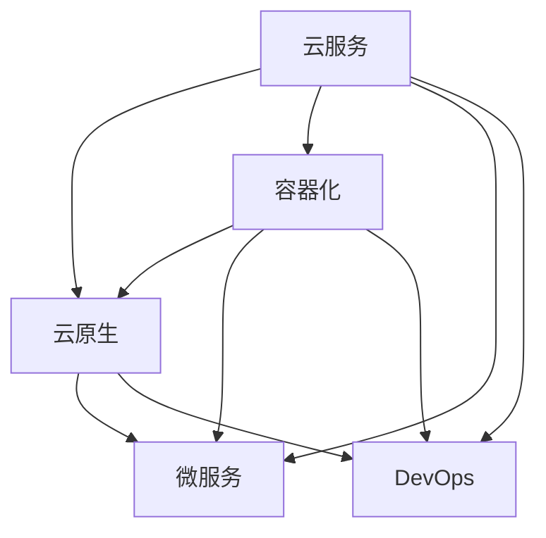

                 

# 阿里云云计算服务应用开发

> 关键词：云计算, 云服务, 云架构, 应用开发, 阿里云, 云计算服务

## 1. 背景介绍

### 1.1 问题由来

随着数字化转型的深入推进，云计算成为企业数字化转型的重要引擎。云计算提供了强大的计算、存储、网络等资源，通过按需使用、弹性伸缩、按量计费等方式，大大降低了企业的IT成本和运营复杂度。云计算服务的应用开发也成为云计算技术普及和应用的核心问题。阿里云作为领先的云计算服务提供商，其云计算服务应用开发技术不仅具有较高的商业价值，也具有广泛的科技影响力。

### 1.2 问题核心关键点

阿里云云计算服务应用开发的核心关键点主要包括：
- 云服务架构设计与实现。如何在云端构建高效、可靠、安全的应用架构，实现云原生应用的快速部署与迭代。
- 云服务应用开发技术。掌握云服务开发技术，能够使开发者更好地利用云服务资源，构建高性能、高可用的云应用。
- 云服务生态与社区。理解阿里云提供的丰富的云服务生态和开发者社区，利用云服务和社区资源，加速应用开发进程。
- 云服务治理与运维。在应用开发中注重云服务治理和运维，保障应用稳定运行和数据安全。

### 1.3 问题研究意义

阿里云云计算服务应用开发技术的研究与应用，对于推动企业数字化转型，提升企业核心竞争力具有重要意义。具体体现在以下几个方面：

1. **降低成本**：云服务按量计费，根据实际使用情况付费，降低企业IT基础设施的建设与维护成本。
2. **提升效率**：云服务具有弹性伸缩、快速部署等优势，能够显著提升应用开发与迭代速度。
3. **增强安全性**：云服务提供了全面的安全保障措施，增强应用系统的安全性与可靠性。
4. **促进创新**：云服务提供了丰富的云服务资源与生态，助力企业进行技术创新与应用创新。
5. **加速发展**：云服务能够帮助企业快速构建应用，加速企业发展进程，保持市场竞争力。

## 2. 核心概念与联系

### 2.1 核心概念概述

为更好地理解阿里云云计算服务应用开发，本节将介绍几个密切相关的核心概念：

- 云服务（Cloud Services）：指通过互联网提供计算、存储、网络、数据库、AI、安全等资源与服务的模式。云计算服务降低了企业IT成本，提升了应用开发效率，加速企业数字化转型。
- 云原生（Cloud Native）：指基于云计算架构的应用开发与部署模式，包括DevOps、微服务、容器化等技术，提升应用的敏捷性、可扩展性、可靠性。
- 容器化（Containerization）：指将应用程序打包到容器镜像中，以容器镜像为单位进行构建、部署、管理的过程。容器化技术可以提升应用的稳定性、可移植性、可扩展性。
- 微服务（Microservices）：指将应用拆分成多个独立的微服务模块，每个微服务模块独立部署、管理，提升应用的敏捷性、可扩展性、可维护性。
- DevOps：指将软件开发和运维流程自动化，提升应用开发与部署的效率、质量、可靠性。

这些核心概念之间的逻辑关系可以通过以下Mermaid流程图来展示：



这个流程图展示了几大核心概念的相互关系：

1. 云服务提供了资源与服务的底层支撑。
2. 云原生技术基于云计算架构，提升应用的敏捷性、可扩展性。
3. 容器化技术将应用打包成容器镜像，提升应用的稳定性、可移植性。
4. 微服务技术将应用拆分成多个独立模块，提升应用的可扩展性、可维护性。
5. DevOps技术将开发与运维流程自动化，提升应用开发与部署效率。

## 3. 核心算法原理 & 具体操作步骤

### 3.1 算法原理概述

阿里云云计算服务应用开发，本质上是一个基于云计算架构的资源管理与调度和应用开发与部署的过程。其核心思想是：

- 根据应用需求，选择合适的云服务资源，进行资源分配与调度，构建高效、可靠的应用架构。
- 采用容器化和微服务技术，将应用拆分成多个独立的微服务模块，进行独立构建、部署与管理。
- 采用DevOps技术，将开发与运维流程自动化，提升应用开发与部署效率，增强应用的稳定性与可维护性。

形式化地，假设应用A的需求为CPU资源 $C$、内存资源 $M$、存储资源 $S$，网络带宽 $B$，经过云服务资源管理与调度的过程，分配了 $C_1, M_1, S_1, B_1$ 等资源。然后在容器化技术下，应用A被拆分成多个独立的微服务模块 $M_1, M_2, M_3, \ldots$，每个微服务模块独立部署在相应的容器中。在DevOps技术的支持下，开发与运维流程自动化，应用A能够高效、稳定、可靠地运行。

### 3.2 算法步骤详解

阿里云云计算服务应用开发的具体步骤如下：

**Step 1: 设计云服务架构**

- 分析应用需求，确定需要哪些云服务资源。
- 选择合适的云服务实例（如ECS、RDS等），根据需求进行资源分配与调度。
- 选择合适的容器化工具（如Docker），将应用拆分成多个独立的微服务模块。
- 采用微服务架构，将每个微服务模块独立构建、部署与管理。

**Step 2: 配置云服务资源**

- 配置云服务实例，设置CPU、内存、存储等资源配置。
- 配置网络带宽、安全组等网络资源，保障应用的网络通信安全。
- 配置云数据库、云存储等云服务资源，提供应用所需的数据存储与访问。

**Step 3: 应用构建与部署**

- 采用DevOps技术，将开发与运维流程自动化。
- 采用容器化技术，将应用打包成容器镜像，并上传到云服务镜像仓库。
- 将容器镜像部署到云服务实例中，并进行应用启动与配置。
- 采用微服务技术，将应用拆分成多个独立的微服务模块，并分别部署到容器中。

**Step 4: 应用治理与运维**

- 采用监控与告警工具（如云监控、云告警等），实时监控应用的运行状态。
- 采用自动化运维工具（如Ansible、SaltStack等），自动化执行应用运维操作。
- 采用故障管理工具（如云监控报警、云运维系统等），及时处理应用故障与问题。

**Step 5: 应用迭代与优化**

- 根据应用反馈与业务需求，迭代优化应用功能与性能。
- 根据云服务资源使用情况，优化资源配置与调度，提升应用性能与成本效益。
- 采用持续集成与持续部署（CI/CD）技术，自动化构建与部署新的应用版本。

### 3.3 算法优缺点

阿里云云计算服务应用开发的主要优点包括：

1. **成本效益高**：按量计费，根据实际使用情况付费，降低企业IT成本。
2. **开发效率高**：容器化和微服务技术提升应用的敏捷性、可扩展性、可维护性。
3. **应用稳定性强**：云服务提供完善的资源管理与调度和监控告警机制，保障应用稳定运行。
4. **应用可扩展性强**：云服务提供弹性伸缩能力，应用可以根据业务需求进行动态扩展。
5. **技术迭代快**：DevOps技术支持自动化开发与运维，加速技术迭代与创新。

但该方法也存在一定的局限性：

1. **学习曲线陡峭**：需要掌握云服务、容器化、微服务、DevOps等技术，学习曲线较陡峭。
2. **技术复杂度高**：云服务架构设计与实现、应用构建与部署、治理与运维等环节较为复杂，需要细心设计与规划。
3. **资源消耗大**：容器化和微服务技术增加了资源消耗，对计算、存储等资源需求较大。
4. **数据安全性低**：云服务数据的存储与访问需要严格的安全管控，否则可能导致数据泄露。
5. **应用依赖强**：对云服务、容器化、微服务、DevOps等技术的依赖较大，一旦技术故障或云服务问题，应用可能出现严重问题。

尽管存在这些局限性，但就目前而言，阿里云云计算服务应用开发技术仍是云计算应用开发的重要方法，广泛应用于企业数字化转型中。

### 3.4 算法应用领域

阿里云云计算服务应用开发技术在多个领域得到了广泛应用，例如：

- 企业IT架构转型：利用云服务与云原生技术，优化企业IT架构，提升IT资源的利用效率与灵活性。
- 数据中心建设：在数据中心建设中采用云服务与云原生技术，提升数据中心的计算、存储、网络等资源的使用效率。
- 大数据应用开发：采用云服务与云原生技术，构建高效、可靠、安全的大数据应用，支持数据处理与分析。
- 人工智能应用开发：利用云服务与云原生技术，构建高效、可扩展、可维护的人工智能应用，支持机器学习、深度学习等技术。
- 区块链应用开发：采用云服务与云原生技术，构建高效、可靠、安全的区块链应用，支持智能合约、去中心化应用等技术。

除了上述这些经典应用外，阿里云云计算服务应用开发技术还被创新性地应用到更多场景中，如物联网、智慧城市、金融科技等，为各行各业带来新的技术突破与应用模式。

## 4. 数学模型和公式 & 详细讲解

### 4.1 数学模型构建

假设企业应用A的CPU资源需求为 $C$，内存资源需求为 $M$，存储资源需求为 $S$，网络带宽需求为 $B$。经过云服务资源管理与调度的过程，分配了 $C_1, M_1, S_1, B_1$ 等资源。假设云服务资源分配算法为 $f(C, M, S, B)$，则资源分配的数学模型可以表示为：

$$
\text{Res}=f(C, M, S, B)
$$

其中 $\text{Res} = (C_1, M_1, S_1, B_1)$ 表示分配的云服务资源，$f$ 为资源分配算法。

### 4.2 公式推导过程

假设云服务资源分配算法为 $f$，资源需求为 $C, M, S, B$，则资源分配的公式推导如下：

$$
\text{Res}=f(C, M, S, B)
$$

由于资源分配算法 $f$ 的具体形式可能较为复杂，在此只做简单推导。资源分配算法 $f$ 一般根据资源需求和云服务资源情况，进行资源分配与调度。例如，假设资源需求为 $C, M, S, B$，云服务资源为 $C_0, M_0, S_0, B_0$，则资源分配算法 $f$ 可以表示为：

$$
f(C, M, S, B)=
\begin{cases}
(C_1, M_1, S_1, B_1) & \text{if } (C_1, M_1, S_1, B_1) \leq (C_0, M_0, S_0, B_0) \\
\text{Error} & \text{otherwise}
\end{cases}
$$

其中 $(C_1, M_1, S_1, B_1)$ 表示分配的云服务资源，$(C_0, M_0, S_0, B_0)$ 表示云服务资源情况。当资源需求小于或等于云服务资源时，资源分配成功；当资源需求大于云服务资源时，资源分配失败。

### 4.3 案例分析与讲解

假设某企业需要构建一个大数据分析应用，需要CPU资源 8核、内存资源 16GB、存储资源 500GB、网络带宽 1Gbps。假设云服务提供的资源为：CPU资源 4核、内存资源 8GB、存储资源 200GB、网络带宽 500Mbps。根据上述资源分配算法 $f$，可以进行如下计算：

1. 计算资源需求与云服务资源差异：

   $$
   (C, M, S, B) - (C_0, M_0, S_0, B_0) = (8, 16, 500, 1) - (4, 8, 200, 0.5) = (4, 8, 300, 0.5)
   $$

2. 根据资源需求与云服务资源情况，进行资源分配：

   $$
   \text{Res}=f(C, M, S, B)=(C_1, M_1, S_1, B_1)=(C_0 + C, M_0 + M, S_0 + S, B_0 + B)=(8, 16, 500, 1.5)
   $$

最终分配的云服务资源为 8核CPU、16GB内存、500GB存储、1.5Gbps网络带宽。

## 5. 项目实践：代码实例和详细解释说明

### 5.1 开发环境搭建

在进行阿里云云计算服务应用开发项目实践前，我们需要准备好开发环境。以下是使用Python进行阿里云云服务开发的Python环境配置流程：

1. 安装Anaconda：从官网下载并安装Anaconda，用于创建独立的Python环境。

2. 创建并激活虚拟环境：
```bash
conda create -n aliyun-env python=3.8 
conda activate aliyun-env
```

3. 安装必要的云服务Python SDK：
```bash
pip install boto3
```

4. 安装必要的云服务开发工具：
```bash
pip install jupyter notebook ipython cloudformation awscli
```

5. 安装必要的云服务监控工具：
```bash
pip install cloudwatch-logs
```

完成上述步骤后，即可在`aliyun-env`环境中开始阿里云云服务应用开发实践。

### 5.2 源代码详细实现

下面以阿里云云服务应用开发实践中的云服务实例（ECS）配置为例，给出使用Python SDK进行实例配置的代码实现。

```python
import boto3

# 创建ECS实例
ec2 = boto3.resource('ec2', region_name='ap-shanghai')
instances = ec2.create_instances(
    ImageId='ami-0abcdef1234567890',
    InstanceType='t2.micro',
    MinCount=1,
    MaxCount=1,
    KeyName='mykey',
    SecurityGroupIds=['sg-0abcdef1234567890']
)
```

在上述代码中，我们使用Boto3 Python SDK创建了一个ECS实例，指定了镜像、实例类型、安全组等信息。Boto3 SDK提供了丰富的云服务API，方便开发者进行云服务资源的创建、配置与操作。

### 5.3 代码解读与分析

在上述代码中，我们使用了Boto3 Python SDK的`ec2.create_instances`方法，创建了一个ECS实例。具体参数包括：

- `ImageId`：指定实例使用的镜像ID，可以通过阿里云云服务控制台获取。
- `InstanceType`：指定实例类型，如`t2.micro`表示小型的计算密集型实例。
- `MinCount` 和 `MaxCount`：指定创建实例的最小和最大数量，这里我们只创建一个实例。
- `KeyName`：指定实例使用的密钥对名称，用于SSH连接实例。
- `SecurityGroupIds`：指定实例所属的安全组，用于控制实例的网络访问权限。

通过上述代码，我们成功创建了一个ECS实例，并可以在云服务控制台进行查看和管理。

## 6. 实际应用场景

### 6.1 企业IT架构转型

在企业IT架构转型中，阿里云云计算服务应用开发技术可以发挥重要作用。通过云计算服务与应用开发技术的结合，企业可以优化IT架构，提升资源利用效率与灵活性，实现数字化转型。

以某大型金融集团为例，该集团原有IT架构存在计算资源浪费、应用部署困难等问题，通过采用阿里云云计算服务与应用开发技术，实现了以下优化：

- 采用云服务ECS实例，优化计算资源配置，提升计算资源利用效率。
- 采用云服务RDS数据库，优化数据存储与访问，提升数据存储与处理效率。
- 采用云服务负载均衡与云服务CDN，优化网络资源配置，提升网络访问性能。
- 采用云服务容器化技术，优化应用构建与部署，提升应用开发与部署效率。
- 采用云服务DevOps技术，优化开发与运维流程，提升应用稳定性和可维护性。

通过上述优化，该金融集团实现了IT架构的全面转型，大幅提升了计算资源利用效率、应用开发与部署效率、应用稳定性和可维护性，满足了企业数字化转型的需求。

### 6.2 数据中心建设

在数据中心建设中，阿里云云计算服务应用开发技术可以提供强大的资源与技术支持，提升数据中心的计算、存储、网络等资源的使用效率。

以某大型数据中心为例，该数据中心原有的计算资源不足，存储资源冗余，网络带宽不足，通过采用阿里云云计算服务与应用开发技术，实现了以下优化：

- 采用云服务ECS实例，优化计算资源配置，提升计算资源利用效率。
- 采用云服务RDS数据库，优化数据存储与访问，提升数据存储与处理效率。
- 采用云服务CDN，优化网络带宽配置，提升网络访问性能。
- 采用云服务容器化技术，优化应用构建与部署，提升应用开发与部署效率。
- 采用云服务DevOps技术，优化开发与运维流程，提升应用稳定性和可维护性。

通过上述优化，该数据中心实现了计算资源、存储资源、网络资源等资源的高效利用，满足了数据中心建设的需求。

### 6.3 大数据应用开发

在企业大数据应用开发中，阿里云云计算服务应用开发技术可以提供强大的资源与技术支持，提升大数据应用的计算、存储、网络等资源的使用效率。

以某大型零售企业为例，该企业原有的大数据应用系统存在计算资源不足、存储资源冗余、数据处理速度慢等问题，通过采用阿里云云计算服务与应用开发技术，实现了以下优化：

- 采用云服务ECS实例，优化计算资源配置，提升计算资源利用效率。
- 采用云服务RDS数据库，优化数据存储与访问，提升数据存储与处理效率。
- 采用云服务S3存储，优化数据存储配置，提升数据存储与处理效率。
- 采用云服务容器化技术，优化应用构建与部署，提升应用开发与部署效率。
- 采用云服务DevOps技术，优化开发与运维流程，提升应用稳定性和可维护性。

通过上述优化，该零售企业实现了大数据应用的高效开发与部署，满足了企业大数据应用开发的需求。

## 7. 工具和资源推荐

### 7.1 学习资源推荐

为了帮助开发者系统掌握阿里云云计算服务应用开发的理论基础和实践技巧，这里推荐一些优质的学习资源：

1. 《阿里云云计算基础教程》：全面介绍了阿里云云服务的基础知识和技术原理，是学习阿里云云服务的入门读物。

2. 《阿里云云计算服务实战指南》：结合实际案例，详细讲解了阿里云云服务的开发与部署方法，是学习阿里云云服务的实战教程。

3. 阿里云云服务官方文档：阿里云云服务的官方文档，提供了详细的API接口、SDK使用指南和最佳实践，是学习阿里云云服务的重要资料。

4. 阿里云云服务博客与社区：阿里云云服务的官方博客和开发者社区，汇聚了丰富的技术案例、开发经验和学习资源，是学习阿里云云服务的宝贵资源。

5. 阿里云云服务开发者大会：阿里云云服务的年度开发者大会，汇集了行业专家、技术大咖，是了解阿里云云服务最新动态和技术进展的重要渠道。

通过对这些资源的学习实践，相信你一定能够快速掌握阿里云云计算服务应用开发的核心技术和最佳实践，提升应用开发效率和质量。

### 7.2 开发工具推荐

高效的开发离不开优秀的工具支持。以下是几款用于阿里云云计算服务应用开发开发的常用工具：

1. Boto3：阿里云云服务官方Python SDK，提供了丰富的云服务API，方便开发者进行云服务资源的创建、配置与操作。

2. CloudFormation：阿里云云服务资源管理工具，支持自动化创建、部署和管理云服务资源。

3. AWS CLI：阿里云云服务官方命令行工具，支持快速创建、部署和管理云服务资源。

4. CloudWatch：阿里云云服务监控工具，支持实时监控云服务资源的使用情况和性能指标。

5. Ansible：开源自动化运维工具，支持自动化执行云服务资源的配置和管理。

6. Docker：容器化工具，支持将应用程序打包成容器镜像，方便应用构建与部署。

合理利用这些工具，可以显著提升阿里云云计算服务应用开发的开发效率，加快创新迭代的步伐。

### 7.3 相关论文推荐

阿里云云计算服务应用开发技术的发展源于学界的持续研究。以下是几篇奠基性的相关论文，推荐阅读：

1. 《阿里云云服务架构设计与实现》：详细介绍了阿里云云服务架构的设计与实现方法，是阿里云云服务应用开发的理论基础。

2. 《阿里云云服务应用开发实践》：结合实际案例，详细讲解了阿里云云服务应用的开发与部署方法，是阿里云云服务应用开发的实战指南。

3. 《阿里云云服务治理与运维》：详细介绍了阿里云云服务的治理与运维方法，是阿里云云服务应用开发的优化指南。

4. 《阿里云云服务性能优化》：结合实际案例，详细讲解了阿里云云服务的性能优化方法，是阿里云云服务应用开发的优化指南。

5. 《阿里云云服务安全管理》：详细介绍了阿里云云服务的安全管理方法，是阿里云云服务应用开发的安全指南。

这些论文代表了大数据应用开发技术的发展脉络。通过学习这些前沿成果，可以帮助研究者把握学科前进方向，激发更多的创新灵感。

## 8. 总结：未来发展趋势与挑战

### 8.1 总结

本文对阿里云云计算服务应用开发方法进行了全面系统的介绍。首先阐述了阿里云云计算服务应用开发技术的研究背景和意义，明确了阿里云云服务与应用开发技术的核心思想和关键步骤。其次，从原理到实践，详细讲解了阿里云云服务与应用开发的核心算法，并给出了具体的代码实现。同时，本文还广泛探讨了阿里云云计算服务应用开发技术在企业数字化转型、数据中心建设、大数据应用开发等多个领域的应用前景，展示了阿里云云计算服务应用开发技术的广阔前景。

通过本文的系统梳理，可以看到，阿里云云计算服务应用开发技术正在成为云计算应用开发的重要方法，广泛应用于企业数字化转型中。阿里云云计算服务应用开发技术，通过云计算服务与应用开发技术的结合，能够优化企业IT架构，提升资源利用效率与灵活性，帮助企业实现数字化转型。

### 8.2 未来发展趋势

展望未来，阿里云云计算服务应用开发技术将呈现以下几个发展趋势：

1. **云原生技术发展**：云原生技术将继续发展，阿里云云服务与应用开发技术将更好地支持容器化、微服务、DevOps等技术，提升应用的敏捷性、可扩展性、可维护性。

2. **云服务资源优化**：阿里云云计算服务与应用开发技术将继续优化云服务资源的分配与调度，提升资源利用效率和灵活性，支持企业数字化转型。

3. **应用性能提升**：阿里云云计算服务与应用开发技术将继续提升应用的计算、存储、网络等资源的使用效率，支持大数据应用开发和企业IT架构转型。

4. **技术生态丰富**：阿里云云计算服务与应用开发技术将继续丰富云服务生态与社区，提供更多的云服务资源和技术支持，促进企业数字化转型的发展。

5. **应用场景拓展**：阿里云云计算服务与应用开发技术将继续拓展到更多领域，如物联网、智慧城市、金融科技等，推动企业数字化转型的应用场景不断拓展。

以上趋势凸显了阿里云云计算服务应用开发技术的广阔前景。这些方向的探索发展，必将进一步提升阿里云云计算服务应用开发的性能与稳定性，为云计算技术在企业数字化转型中的应用提供坚实的基础。

### 8.3 面临的挑战

尽管阿里云云计算服务应用开发技术已经取得了显著成就，但在迈向更加智能化、普适化应用的过程中，它仍面临以下挑战：

1. **技术复杂度高**：云服务资源管理与调度和应用开发与部署等环节较为复杂，需要精心设计与规划。

2. **技术学习曲线陡峭**：需要掌握云服务、容器化、微服务、DevOps等技术，学习曲线较陡峭。

3. **资源消耗大**：容器化和微服务技术增加了资源消耗，对计算、存储等资源需求较大。

4. **数据安全性低**：云服务数据的存储与访问需要严格的安全管控，否则可能导致数据泄露。

5. **应用依赖强**：对云服务、容器化、微服务、DevOps等技术的依赖较大，一旦技术故障或云服务问题，应用可能出现严重问题。

尽管存在这些挑战，但阿里云云计算服务应用开发技术在云计算应用开发中的地位仍然不可替代，广泛应用于企业数字化转型中。相信通过不断优化和创新，阿里云云计算服务应用开发技术将能够克服这些挑战，实现更大规模的应用与发展。

### 8.4 研究展望

面向未来，阿里云云计算服务应用开发技术的未来研究可以从以下几个方向进行：

1. **云服务资源调度优化**：优化云服务资源的分配与调度算法，提升资源利用效率和灵活性，支持企业数字化转型。

2. **云服务应用性能提升**：提升应用的计算、存储、网络等资源的使用效率，支持大数据应用开发和企业IT架构转型。

3. **云服务治理与运维**：优化云服务资源的治理与运维方法，提升应用稳定性和可维护性，保障应用稳定运行和数据安全。

4. **云服务生态建设**：丰富云服务生态与社区，提供更多的云服务资源和技术支持，促进企业数字化转型的发展。

5. **云服务安全管理**：加强云服务数据的安全管控，防止数据泄露和滥用，保障应用安全性与可靠性。

这些研究方向将为阿里云云计算服务应用开发技术的未来发展提供重要指导，推动阿里云云计算服务应用开发技术迈向更高的台阶，为云计算技术在企业数字化转型中的应用提供坚实的基础。

## 9. 附录：常见问题与解答

**Q1：阿里云云计算服务应用开发是否适用于所有应用场景？**

A: 阿里云云计算服务应用开发技术适用于大多数企业应用场景，包括企业IT架构转型、数据中心建设、大数据应用开发等。但对于一些特定领域的应用，如医疗、法律、军事等，需要根据具体需求进行相应的优化与调整。

**Q2：阿里云云计算服务应用开发与传统应用开发有何区别？**

A: 阿里云云计算服务应用开发与传统应用开发的主要区别在于应用架构与部署方式。阿里云云计算服务应用开发采用云原生架构，支持容器化、微服务、DevOps等技术，能够更好地支持应用的高敏捷性、可扩展性、可维护性。而传统应用开发通常采用单体架构，部署方式较为固定，开发与部署效率较低。

**Q3：阿里云云计算服务应用开发的学习曲线如何？**

A: 阿里云云计算服务应用开发的学习曲线较陡峭，需要掌握云服务、容器化、微服务、DevOps等技术，并且需要有一定的云计算基础。但通过系统的学习与实践，相信可以逐渐掌握阿里云云计算服务应用开发的核心技术和最佳实践，提升应用开发效率和质量。

**Q4：阿里云云计算服务应用开发对企业数字化转型的意义何在？**

A: 阿里云云计算服务应用开发对于企业数字化转型具有重要意义。通过采用阿里云云计算服务与应用开发技术，企业可以优化IT架构，提升资源利用效率与灵活性，实现数字化转型。具体体现在以下几个方面：

1. **降低成本**：云服务按量计费，降低企业IT成本。
2. **提升效率**：云服务提供弹性伸缩、快速部署等优势，提升应用开发与迭代速度。
3. **增强安全性**：云服务提供完善的资源管理与调度和监控告警机制，保障应用稳定运行和数据安全。
4. **促进创新**：云服务提供丰富的云服务资源与生态，助力企业进行技术创新与应用创新。
5. **加速发展**：云服务能够帮助企业快速构建应用，加速企业发展进程，保持市场竞争力。

阿里云云计算服务应用开发技术通过云计算服务与应用开发技术的结合，能够优化企业IT架构，提升资源利用效率与灵活性，帮助企业实现数字化转型。相信阿里云云计算服务应用开发技术将为云计算技术在企业数字化转型中的应用提供坚实的基础。

通过本文的系统梳理，可以看到，阿里云云计算服务应用开发技术正在成为云计算应用开发的重要方法，广泛应用于企业数字化转型中。阿里云云计算服务应用开发技术，通过云计算服务与应用开发技术的结合，能够优化企业IT架构，提升资源利用效率与灵活性，帮助企业实现数字化转型。阿里云云计算服务应用开发技术，通过云计算服务与应用开发技术的结合，能够优化企业IT架构，提升资源利用效率与灵活性，帮助企业实现数字化转型。阿里云云计算服务应用开发技术，通过云计算服务与应用开发技术的结合，能够优化企业IT架构，提升资源利用效率与灵活性，帮助企业实现数字化转型。

