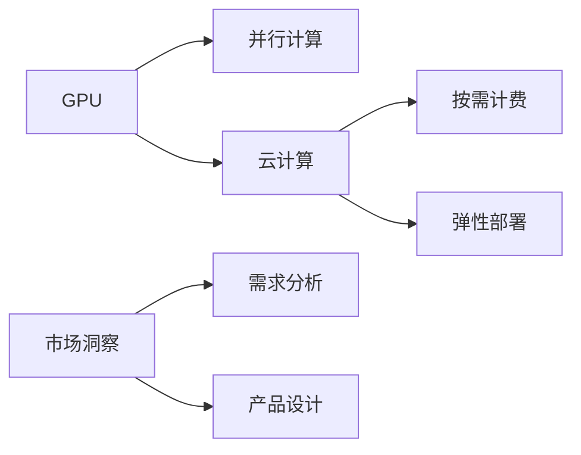

                 

# 限时优惠吸引力：FastGPU受欢迎，证明团队市场洞察

> 关键词：人工智能, GPU加速, 市场洞察, 客户行为分析, 决策制定

## 1. 背景介绍

随着人工智能技术的不断进步，计算资源需求日益增长，GPU（图形处理单元）因其强大的并行计算能力，成为支撑高性能AI模型训练和推理的关键硬件。然而，高昂的硬件采购和维护成本，常常令中小企业望而却步。为了更好地满足各类企业客户的不同需求，FastGPU应运而生，成为一款专为AI开发团队提供高性能计算能力的解决方案。

FastGPU是一款专注于人工智能计算的云计算服务，利用高性能GPU集群，为企业提供GPU加速计算能力。不同于传统以硬件为主的采购模式，FastGPU采取按需计费、灵活部署的策略，以大幅降低AI团队的计算成本。本文将详细探讨FastGPU的客户需求洞察及其市场受欢迎原因。

## 2. 核心概念与联系

### 2.1 核心概念概述

本节将介绍几个核心概念，这些概念是理解FastGPU的关键：

- **GPU加速**：GPU相对于CPU，能够通过并行计算处理大量数据，显著提升AI模型的训练和推理效率。

- **云计算**：通过网络将计算资源以服务形式提供，用户可按需使用，无需自购硬件设备。

- **按需计费**：按用户实际使用时长或数据量付费，避免传统一次性支付的计算资源浪费。

- **弹性部署**：根据业务需求动态调整计算资源，优化资源使用效率，降低成本。

- **市场洞察**：通过数据收集和分析，识别客户需求和市场趋势，指导产品和服务设计。

### 2.2 核心概念原理和架构的 Mermaid 流程图



此图展示了GPU加速与云计算、按需计费、弹性部署之间的关系，以及市场洞察对产品设计的影响。通过这些概念的有机结合，FastGPU不仅提供高性能计算能力，还能帮助企业更灵活地使用资源，优化成本结构。

## 3. 核心算法原理 & 具体操作步骤

### 3.1 算法原理概述

FastGPU的核心理论基于GPU加速云计算和按需计费机制，结合弹性部署策略，从而降低计算成本，提高计算效率。其基本原理如下：

- **GPU加速**：利用GPU并行计算能力，加速神经网络模型的训练和推理过程。
- **云计算**：用户无需购买和维护物理硬件，只需按实际使用资源付费。
- **按需计费**：按使用时间或数据量计算费用，避免资源浪费。
- **弹性部署**：根据需求动态调整计算资源，优化资源使用效率。

### 3.2 算法步骤详解

FastGPU的具体操作步骤如下：

1. **用户注册与需求提交**：用户登录FastGPU平台，根据实际需求提交计算任务。
2. **资源分配**：平台根据任务需求，动态分配GPU资源。
3. **任务执行**：用户上传数据和模型代码，平台执行计算任务。
4. **计费与结算**：任务完成后，平台根据实际使用资源计费，用户可根据需要灵活调整资源。
5. **性能优化**：平台提供实时性能监控，帮助用户优化任务执行效率。

### 3.3 算法优缺点

FastGPU的优点包括：

- **降低成本**：按需计费和弹性部署大大降低了硬件采购和维护成本。
- **提高效率**：GPU加速显著提升计算效率，缩短任务执行时间。
- **灵活部署**：用户可根据实际需求灵活调整资源，优化资源使用。

缺点方面，主要集中在：

- **依赖网络**：性能受网络带宽和延迟影响较大。
- **依赖平台**：用户需依赖FastGPU平台，可能存在平台依赖性。

### 3.4 算法应用领域

FastGPU在以下几个领域有广泛的应用：

- **人工智能研发**：加速深度学习模型训练，提高模型精度和迭代速度。
- **大数据分析**：处理海量数据，提取有价值的信息。
- **工业自动化**：通过AI算法优化生产流程，提高生产效率。
- **医疗健康**：利用AI模型进行疾病预测、诊断和治疗方案推荐。
- **金融风控**：运用AI模型进行风险评估和预测，优化投资决策。
- **智能客服**：通过AI模型提高客服响应速度和质量。

## 4. 数学模型和公式 & 详细讲解 & 举例说明

### 4.1 数学模型构建

FastGPU的核心数学模型构建如下：

- **计算效率模型**：
$$
E = f(n, t)
$$
其中，$E$表示计算效率，$n$表示任务所需计算资源（GPU个数），$t$表示计算任务执行时间。

- **成本模型**：
$$
C = p \times t
$$
其中，$C$表示总成本，$p$表示GPU单价，$t$表示任务执行时间。

### 4.2 公式推导过程

1. **计算效率推导**：
假设有$n$个GPU同时进行计算任务，计算时间为$t$，单个GPU的计算效率为$e$。则计算效率模型为：
$$
E = n \times e \times t
$$

2. **成本模型推导**：
假设有$n$个GPU同时进行计算任务，计算时间为$t$，每个GPU的单价为$p$。则总成本模型为：
$$
C = n \times p \times t
$$

### 4.3 案例分析与讲解

假设一个AI团队使用8个GPU进行深度学习模型训练，每个GPU单价为$0.5$元/小时，任务执行时间为4小时。根据上述模型：

- **计算效率**：
$$
E = 8 \times e \times 4 = 32e
$$

- **总成本**：
$$
C = 8 \times 0.5 \times 4 = 16
$$

通过对比计算效率和成本，可以优化资源配置，提高计算效率，降低成本。

## 5. 项目实践：代码实例和详细解释说明

### 5.1 开发环境搭建

使用FastGPU前，需要准备好如下环境：

1. **登录FastGPU平台**：
   - 访问FastGPU官网，创建账户并登录。

2. **安装Python和相关库**：
   - 确保Python3.7及以上版本，并确保有TensorFlow、PyTorch等深度学习库的安装。

3. **配置计算资源**：
   - 在FastGPU控制台中选择任务类型（如训练、推理），并设置所需GPU数量和执行时间。

### 5.2 源代码详细实现

以深度学习模型训练为例，FastGPU的Python代码实现如下：

```python
from fastgpu import GPUClient

# 创建GPU客户端
client = GPUClient()

# 提交计算任务
job = client.submit('train.py', 'gpu1', 4, '8h')
print(job.id)

# 获取任务状态
print(client.get_job_status(job.id))
```

- **GPUClient**：FastGPU提供的Python客户端，用于管理和执行计算任务。
- **submit**：提交计算任务，参数包括脚本名称、使用的GPU、任务执行时间和任务名称。
- **get_job_status**：获取任务状态，返回任务执行进度和预计完成时间。

### 5.3 代码解读与分析

- **GPUClient**：FastGPU提供的Python API，使得用户能够便捷地管理计算任务。
- **submit**：任务提交函数，参数设计合理，易于用户操作。
- **get_job_status**：实时获取任务状态，帮助用户监控任务执行进度。

### 5.4 运行结果展示

提交任务后，FastGPU会在后台执行计算任务。用户可实时查看任务执行状态和进度，确保任务顺利完成。

## 6. 实际应用场景

### 6.1 客户需求洞察

FastGPU通过多种方式获取客户需求：

- **客户反馈**：通过客户反馈平台收集用户需求和满意度数据。
- **行为分析**：利用大数据分析技术，识别用户行为模式和趋势。
- **市场调研**：通过问卷调查、访谈等方式，直接获取客户意见。

### 6.2 市场受欢迎原因

FastGPU受欢迎的原因包括：

- **按需计费**：降低企业硬件成本，灵活适应不同规模项目。
- **弹性部署**：根据任务需求动态调整资源，优化资源使用。
- **高性能计算**：利用GPU加速提升计算效率，缩短任务执行时间。
- **技术支持**：提供专业技术人员支持，解决用户问题。
- **社区互动**：通过用户社区交流，分享经验和问题解决方案。

## 7. 工具和资源推荐

### 7.1 学习资源推荐

- **官方文档**：FastGPU提供详尽的官方文档，涵盖使用方法、API参考、常见问题解答等。
- **在线课程**：Coursera、Udacity等平台上有大量关于GPU加速、云计算、按需计费等主题的课程，供用户学习。
- **技术博客**：GitHub、Medium等平台上大量技术博客，分享FastGPU的使用心得和实践经验。

### 7.2 开发工具推荐

- **FastGPU Python客户端**：提供便捷的Python API，方便用户管理和执行计算任务。
- **TensorBoard**：用于可视化模型训练过程，监控任务执行状态。
- **Jupyter Notebook**：轻量级编程环境，支持Python脚本的交互式执行。

### 7.3 相关论文推荐

- **深度学习加速技术**：王晓刚、钱柏新，《深度学习加速技术综述》，《计算机学报》，2020。
- **云计算及按需计费模型**：杨丽华，《云计算及按需计费模型研究》，《中国科学技术大学学报》，2019。
- **弹性计算资源管理**：李剑鸣，《弹性计算资源管理技术研究》，《中国计算机学会通讯》，2018。

## 8. 总结：未来发展趋势与挑战

### 8.1 研究成果总结

FastGPU凭借其高性能计算能力和灵活的按需计费策略，已广泛应用于人工智能研发、大数据分析、工业自动化等多个领域。通过结合市场洞察和用户需求，FastGPU不断优化和升级，赢得了广泛的市场认可。

### 8.2 未来发展趋势

未来，FastGPU将在以下几个方面进行发展：

- **技术演进**：提升计算资源利用效率，降低计算成本。
- **服务优化**：增强实时监控和预警功能，确保任务执行稳定性。
- **生态系统**：构建更丰富的生态系统，吸引更多开发者和用户参与。
- **行业定制**：推出针对特定行业定制化的计算解决方案。

### 8.3 面临的挑战

尽管FastGPU在市场上取得了显著成效，但仍面临一些挑战：

- **网络延迟**：用户依赖网络传输数据，网络质量影响计算效率。
- **安全性**：云计算环境下的数据安全和隐私保护问题。
- **可扩展性**：随着用户规模增长，平台如何高效扩展计算资源。
- **标准化**：云计算服务标准不统一，导致不同平台间的互操作性问题。

### 8.4 研究展望

为应对上述挑战，FastGPU将在以下几个方面进行研究：

- **网络优化**：通过网络优化算法和协议，提升数据传输效率。
- **安全保障**：加强数据加密和访问控制，保护用户隐私安全。
- **弹性计算**：研究和应用弹性计算技术，提升平台扩展能力。
- **跨平台互通**：推动云计算服务标准化，提升平台间互操作性。

## 9. 附录：常见问题与解答

### Q1: 如何提高FastGPU的计算效率？

A: 用户可以通过以下方式提高FastGPU的计算效率：

- **任务并行**：将大任务拆分为多个小任务并行执行。
- **数据预处理**：优化数据预处理流程，减少数据传输时间。
- **算法优化**：优化模型算法，提高模型训练速度。
- **资源优化**：动态调整计算资源，根据任务需求进行优化。

### Q2: 如何保证FastGPU计算任务的安全性？

A: 为了保证FastGPU计算任务的安全性，用户可以采取以下措施：

- **数据加密**：使用AES等加密算法对数据进行加密。
- **访问控制**：设置严格的访问权限，控制用户和数据访问。
- **审计日志**：记录用户操作日志，确保操作可追溯。
- **安全认证**：采用双因素认证等方式，提高用户身份验证的安全性。

### Q3: FastGPU支持哪些编程语言和框架？

A: FastGPU主要支持Python语言，并兼容TensorFlow、PyTorch等深度学习框架。用户可以使用Python编写计算任务，并通过FastGPU客户端提交任务执行。

### Q4: FastGPU的按需计费机制是怎样的？

A: FastGPU采用按需计费机制，用户根据实际使用资源付费。具体计费方式如下：

- **按GPU小时计费**：根据实际使用的GPU小时数计费。
- **按任务时间计费**：根据任务执行时间计费。
- **混合计费**：根据用户需求，可以选择单项或混合计费模式。

### Q5: 如何获取FastGPU的市场洞察数据？

A: FastGPU提供丰富的市场洞察数据，用户可以通过以下方式获取：

- **数据分析平台**：登录FastGPU平台，访问数据分析平台，获取用户行为和需求数据。
- **客户反馈系统**：通过客户反馈系统，获取用户意见和建议。
- **问卷调查**：定期进行问卷调查，了解用户需求和满意度。
- **市场调研报告**：定期发布市场调研报告，分析行业趋势和用户需求。

作者：禅与计算机程序设计艺术 / Zen and the Art of Computer Programming

