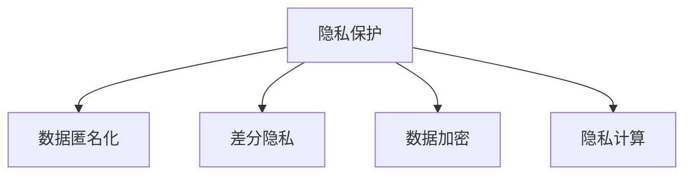

                 

# 隐私保护：保障人类计算中的数据安全

隐私保护在当今数据驱动的时代具有至关重要的作用。随着数据成为各种应用的核心资产，如何安全、合法地使用数据，避免隐私泄露和数据滥用，成为各界共同关注的焦点。本文将深入探讨隐私保护的核心概念、算法原理和具体操作步骤，详细分析其在不同应用场景中的应用，并通过具体案例说明其实际效果，最后总结隐私保护的发展趋势和未来面临的挑战。

## 1. 背景介绍

### 1.1 问题由来
在互联网和大数据时代，个人信息被广泛收集和使用，数据泄露和滥用事件频发。例如，2018年的Cambridge Analytica事件揭示了Facebook数据被非法获取用于影响美国总统选举的内幕，引起了全球对数据隐私保护的重视。数据安全不仅是保护个人隐私的问题，更是保障公平竞争、维护社会稳定的基础。

隐私保护的重要性不仅体现在数据泄露事件上，还在于数据滥用可能导致的偏见和不公平。在招聘、贷款、保险等领域，算法偏见可能导致不公平待遇，如对少数族裔、女性、低收入群体的歧视。这表明，隐私保护在保障数据公平使用上也具有不可替代的作用。

### 1.2 问题核心关键点
隐私保护的核心在于确保数据在使用过程中不泄露个人隐私。主要包含以下几个关键点：
- 数据匿名化：通过去除或替换敏感信息，避免数据被追踪到个人。
- 差分隐私：通过引入噪声，确保个体数据对总体统计结果的影响可忽略不计。
- 数据加密：使用加密技术保护数据在传输和存储过程中的安全。
- 隐私计算：在不泄露数据的前提下，实现数据计算和分析。

## 2. 核心概念与联系

### 2.1 核心概念概述

为更好地理解隐私保护的核心概念，本节将介绍几个密切相关的核心概念：

- 隐私保护(Privacy Protection)：指保护数据主体的个人隐私信息不被未经授权的第三方访问和使用，是数据安全的基本要求。
- 数据匿名化(Data Anonymization)：通过去除或替换数据中的敏感信息，防止数据被追溯到个体。
- 差分隐私(Differential Privacy)：确保个体数据的加入对总体统计结果的影响可忽略不计，从而保护个体隐私。
- 数据加密(Data Encryption)：使用加密技术保护数据在传输和存储过程中的安全性。
- 隐私计算(Privacy-Preserving Computation)：在不泄露数据的前提下，实现数据计算和分析。

这些概念之间的逻辑关系可以通过以下Mermaid流程图来展示：



这个流程图展示了几项关键隐私保护技术的相互关系：

1. 隐私保护是整个隐私工程的目标。
2. 数据匿名化、差分隐私和数据加密是隐私保护的主要手段。
3. 隐私计算提供了一种隐私友好的数据处理方式，在特定情况下可以替代上述手段。

## 3. 核心算法原理 & 具体操作步骤

### 3.1 算法原理概述

隐私保护的算法原理主要基于数据匿名化、差分隐私和数据加密等技术。其核心思想是通过技术手段，确保在数据使用过程中，个体隐私信息不被泄露。

数据匿名化技术通过删除、修改或泛化数据，使其无法直接关联到具体个体。差分隐私技术则通过引入噪声，使得个体数据的加入对总体统计结果的影响微乎其微。数据加密技术则是通过加密算法保护数据在传输和存储过程中的安全性。隐私计算则通过多方安全计算、同态加密等技术，在不泄露数据的前提下进行数据计算和分析。

### 3.2 算法步骤详解

#### 3.2.1 数据匿名化

数据匿名化一般包括以下几个步骤：

1. 数据收集：收集包含敏感信息的原始数据集。
2. 数据预处理：清洗数据，去除无效、重复或异常记录。
3. 特征选择：选择对隐私影响较小的特征进行保留。
4. 匿名化处理：对剩余特征进行匿名化处理，如去标识化、泛化、扰动等。
5. 输出数据：将匿名化后的数据输出，用于后续分析或共享。

具体方法包括：

- 去标识化(De-identification)：通过替换或删除可识别信息，防止数据被追溯到个体。
- 泛化(Generalization)：将数据进行抽象处理，使其无法直接关联到个体。
- 扰动(Noise Injection)：在数据中引入噪声，使得个体数据对总体统计结果的影响可忽略不计。

#### 3.2.2 差分隐私

差分隐私通过在查询结果中引入噪声，确保个体数据的加入对总体统计结果的影响微乎其微。具体步骤包括：

1. 确定查询类型：确定需要保护的查询类型和查询参数。
2. 设定隐私预算：设定隐私预算(ε)，表示隐私保护强度。
3. 引入噪声：对查询结果引入噪声，确保个体数据的影响被均摊。
4. 发布结果：将噪声化后的结果发布，供分析或决策使用。

差分隐私的数学表达式如下：

$$
\mathbb{P}[Q(x) \in S] \leq e^{-\epsilon} \times \mathbb{P}[Q(x') \in S] + \delta
$$

其中，$Q(x)$ 表示对数据集 $x$ 的查询结果，$S$ 表示查询结果所属的集合，$\epsilon$ 表示隐私预算，$\delta$ 表示误差容忍度。

#### 3.2.3 数据加密

数据加密通过使用加密算法，保护数据在传输和存储过程中的安全性。具体步骤包括：

1. 选择加密算法：选择适合的数据加密算法，如对称加密、非对称加密等。
2. 加密数据：将原始数据加密，生成密文。
3. 传输数据：将加密后的数据传输到接收端。
4. 解密数据：在接收端对密文进行解密，恢复原始数据。

常用的加密算法包括：

- 对称加密算法(AES、DES等)：使用相同的密钥进行加密和解密。
- 非对称加密算法(RSA、ECC等)：使用公钥加密，私钥解密，安全性较高。

#### 3.2.4 隐私计算

隐私计算通过多方安全计算、同态加密等技术，在不泄露数据的前提下进行数据计算和分析。具体步骤包括：

1. 确定计算任务：明确需要计算的任务类型和数据需求。
2. 选择隐私计算技术：根据任务类型选择合适的隐私计算技术，如多方安全计算、同态加密等。
3. 数据加密：对参与计算的数据进行加密。
4. 计算过程：在加密数据上执行计算任务，确保数据在计算过程中不泄露。
5. 解密结果：对计算结果进行解密，获取最终分析结果。

常见的隐私计算技术包括：

- 多方安全计算(MSC)：多个参与方在不泄露数据的前提下共同计算结果。
- 同态加密(Homomorphic Encryption)：在加密数据上进行计算，最终得到的结果是可解密且正确的。

### 3.3 算法优缺点

隐私保护技术具有以下优点：

1. 增强数据安全：通过匿名化、加密等技术，保护数据在传输和存储过程中的安全性。
2. 防止数据滥用：通过差分隐私等技术，防止个体数据被滥用。
3. 提高公平性：防止算法偏见，确保数据使用的公平性。
4. 增强用户信任：通过隐私保护措施，增强用户对数据使用的信任感。

同时，这些技术也存在一些局限性：

1. 性能开销：匿名化、加密等技术可能会增加数据处理的复杂度和延迟。
2. 隐私预算管理：差分隐私技术需要设定隐私预算，隐私预算的设定和调整是一个复杂的过程。
3. 技术复杂度：隐私计算技术通常需要较复杂的技术实现，对开发人员的要求较高。
4. 隐私保护度：隐私保护技术的效果取决于算法的实现和参数设置，需要不断优化。

尽管存在这些局限性，但隐私保护技术仍然是数据驱动应用中不可或缺的安全保障。未来相关研究将继续聚焦于提升隐私保护的效率和可扩展性，同时加强对隐私保护的监管和规范。

### 3.4 算法应用领域

隐私保护技术已经在多个领域得到了广泛的应用，包括：

- 医疗健康：保护患者隐私，确保医疗数据的安全和合规使用。
- 金融保险：保护客户隐私，确保金融交易和保险理赔的安全性。
- 社交媒体：保护用户隐私，防止数据泄露和滥用。
- 政府公共服务：保护公民隐私，确保数据使用的透明度和合法性。
- 企业商业应用：保护员工隐私，确保企业数据的安全和合规使用。

## 4. 数学模型和公式 & 详细讲解 & 举例说明

### 4.1 数学模型构建

隐私保护的核心是确保数据在使用过程中，个体隐私信息不被泄露。本节将使用数学语言对隐私保护的核心算法进行更加严格的刻画。

#### 4.1.1 数据匿名化

数据匿名化的数学模型可以表示为：

$$
A(x) = \{a(x_i) | i=1,2,...,n\}
$$

其中，$x$ 表示原始数据集，$a(x_i)$ 表示对数据 $x_i$ 进行匿名化处理后得到的结果。匿名化处理可以包括去标识化、泛化、扰动等方法。

#### 4.1.2 差分隐私

差分隐私的数学模型可以表示为：

$$
\mathbb{P}[Q(x) \in S] \leq e^{-\epsilon} \times \mathbb{P}[Q(x') \in S] + \delta
$$

其中，$Q(x)$ 表示对数据集 $x$ 的查询结果，$S$ 表示查询结果所属的集合，$\epsilon$ 表示隐私预算，$\delta$ 表示误差容忍度。

#### 4.1.3 数据加密

数据加密的数学模型可以表示为：

$$
E(m) = c
$$

其中，$m$ 表示原始数据，$c$ 表示加密后的密文。常见的加密算法包括对称加密、非对称加密等。

#### 4.1.4 隐私计算

隐私计算的数学模型可以表示为：

$$
f(\{E(x_i)\}) = E(f(x_i))
$$

其中，$f$ 表示计算函数，$x_i$ 表示原始数据，$E(x_i)$ 表示对数据 $x_i$ 进行加密后的密文。隐私计算技术包括多方安全计算、同态加密等。

### 4.2 公式推导过程

以下是几个关键公式的推导过程：

#### 4.2.1 数据匿名化

去标识化的推导过程如下：

1. 原始数据集 $x$：
   $$
   x = \{(x_1, y_1), (x_2, y_2), ..., (x_n, y_n)\}
   $$
   其中，$x_i$ 表示个体属性，$y_i$ 表示敏感信息。

2. 去标识化后的数据集 $A(x)$：
   $$
   A(x) = \{(a_1(x_1), y_1), (a_2(x_2), y_2), ..., (a_n(x_n), y_n)\}
   $$
   其中，$a_i(x_i)$ 表示对 $x_i$ 进行去标识化处理后的结果。

3. 去标识化处理的实现：
   $$
   a_i(x_i) = (x'_i, y_i)
   $$
   其中，$x'_i$ 表示去除或替换敏感信息后的属性，$y_i$ 表示敏感信息。

#### 4.2.2 差分隐私

差分隐私的推导过程如下：

1. 原始数据集 $x$：
   $$
   x = \{(x_1, y_1), (x_2, y_2), ..., (x_n, y_n)\}
   $$
   其中，$x_i$ 表示个体属性，$y_i$ 表示敏感信息。

2. 查询结果 $Q(x)$：
   $$
   Q(x) = f(x)
   $$
   其中，$f$ 表示查询函数。

3. 差分隐私引入噪声后的查询结果 $Q'(x)$：
   $$
   Q'(x) = f(x) + \Delta
   $$
   其中，$\Delta$ 表示随机噪声。

4. 差分隐私预算 $\epsilon$：
   $$
   \mathbb{P}[Q'(x) \in S] \leq e^{-\epsilon} \times \mathbb{P}[Q'(x') \in S] + \delta
   $$
   其中，$\epsilon$ 表示隐私预算，$\delta$ 表示误差容忍度。

#### 4.2.3 数据加密

数据加密的推导过程如下：

1. 原始数据 $m$：
   $$
   m = (x, y)
   $$
   其中，$x$ 表示明文，$y$ 表示敏感信息。

2. 加密后的密文 $c$：
   $$
   c = E(m)
   $$
   其中，$E$ 表示加密函数。

3. 解密后的明文 $m'$：
   $$
   m' = D(c)
   $$
   其中，$D$ 表示解密函数。

#### 4.2.4 隐私计算

隐私计算的推导过程如下：

1. 原始数据集 $x$：
   $$
   x = \{x_i\}
   $$
   其中，$x_i$ 表示原始数据。

2. 加密后的数据集 $E(x)$：
   $$
   E(x) = \{E(x_i)\}
   $$
   其中，$E(x_i)$ 表示对 $x_i$ 进行加密后的密文。

3. 计算函数 $f$：
   $$
   f = F(\{x_i\})
   $$
   其中，$F$ 表示计算函数。

4. 加密后的计算结果 $E(f(x))$：
   $$
   E(f(x)) = \{E(f(x_i))\}
   $$
   其中，$E(f(x_i))$ 表示在加密数据上执行计算任务后的密文结果。

5. 解密后的计算结果 $f(x)$：
   $$
   f(x) = D(E(f(x)))
   $$
   其中，$D$ 表示解密函数。

### 4.3 案例分析与讲解

#### 4.3.1 医疗数据匿名化

医疗数据包含大量敏感信息，如姓名、身份证号、病历记录等。为保护患者隐私，需要进行数据匿名化处理。具体步骤如下：

1. 收集原始医疗数据集 $x$：
   $$
   x = \{(x_1, y_1), (x_2, y_2), ..., (x_n, y_n)\}
   $$
   其中，$x_i$ 表示患者信息，$y_i$ 表示病历记录。

2. 对患者信息进行去标识化处理：
   $$
   a_i(x_i) = (x'_i, y_i)
   $$
   其中，$x'_i$ 表示去除或替换敏感信息后的患者信息。

3. 将去标识化后的数据集 $A(x)$ 用于数据分析和共享。

#### 4.3.2 差分隐私在金融应用

金融机构需要收集客户数据进行分析，但客户的隐私需要得到保护。差分隐私技术可以帮助实现这一目标。具体步骤如下：

1. 收集客户数据集 $x$：
   $$
   x = \{(x_1, y_1), (x_2, y_2), ..., (x_n, y_n)\}
   $$
   其中，$x_i$ 表示客户属性，$y_i$ 表示敏感信息。

2. 设定隐私预算 $\epsilon$ 和误差容忍度 $\delta$：
   $$
   \epsilon = 0.1, \delta = 0.01
   $$

3. 引入噪声后的查询结果 $Q'(x)$：
   $$
   Q'(x) = f(x) + \Delta
   $$
   其中，$f$ 表示查询函数，$\Delta$ 表示随机噪声。

4. 发布查询结果 $Q'(x)$，确保个体数据对总体统计结果的影响可忽略不计。

#### 4.3.3 同态加密在云计算应用

云计算服务提供商需要处理客户的敏感数据，但需要保证数据在传输和存储过程中的安全性。同态加密技术可以帮助实现这一目标。具体步骤如下：

1. 收集原始数据集 $x$：
   $$
   x = \{(x_1, y_1), (x_2, y_2), ..., (x_n, y_n)\}
   $$
   其中，$x_i$ 表示敏感数据，$y_i$ 表示元数据。

2. 对敏感数据进行同态加密：
   $$
   E(x) = \{E(x_i)\}
   $$
   其中，$E(x_i)$ 表示对 $x_i$ 进行同态加密后的密文。

3. 对加密后的数据进行计算：
   $$
   f(E(x)) = \{f(E(x_i))\}
   $$
   其中，$f$ 表示计算函数。

4. 解密计算结果 $f(x)$：
   $$
   f(x) = D(f(E(x)))
   $$
   其中，$D$ 表示解密函数。

通过同态加密技术，可以在不泄露数据的情况下，进行数据计算和分析。

## 5. 项目实践：代码实例和详细解释说明

### 5.1 开发环境搭建

在进行隐私保护项目开发前，我们需要准备好开发环境。以下是使用Python进行PyTorch开发的环境配置流程：

1. 安装Anaconda：从官网下载并安装Anaconda，用于创建独立的Python环境。

2. 创建并激活虚拟环境：
```bash
conda create -n privacy-env python=3.8 
conda activate privacy-env
```

3. 安装PyTorch：根据CUDA版本，从官网获取对应的安装命令。例如：
```bash
conda install pytorch torchvision torchaudio cudatoolkit=11.1 -c pytorch -c conda-forge
```

4. 安装各类工具包：
```bash
pip install numpy pandas scikit-learn matplotlib tqdm jupyter notebook ipython
```

完成上述步骤后，即可在`privacy-env`环境中开始隐私保护实践。

### 5.2 源代码详细实现

下面我们以差分隐私技术为例，给出使用PyTorch进行差分隐私开发的PyTorch代码实现。

首先，定义差分隐私的目标函数：

```python
import torch
from torch import nn
import torch.nn.functional as F

class PrivacyLoss(nn.Module):
    def __init__(self, epsilon):
        super(PrivacyLoss, self).__init__()
        self.epsilon = epsilon
        
    def forward(self, x, y):
        loss = (y - x) ** 2
        loss /= self.epsilon ** 2
        return loss.exp() - 1
```

然后，定义差分隐私优化器：

```python
from torch.optim import Adam

class PrivacyOptimizer:
    def __init__(self, model, epsilon):
        self.epsilon = epsilon
        self.optimizer = Adam(model.parameters(), lr=0.001)
        
    def step(self):
        self.optimizer.step()
        self.optimizer.zero_grad()
        
    def add_privacy_loss(self, model, x, y):
        loss = PrivacyLoss(self.epsilon)(x, y)
        self.optimizer.zero_grad()
        loss.backward()
        self.optimizer.step()
```

接着，定义差分隐私训练函数：

```python
def train_epoch(model, train_loader, optimizer, epsilon):
    model.train()
    for batch in train_loader:
        x, y = batch
        optimizer.add_privacy_loss(model, x, y)
```

最后，启动差分隐私训练流程：

```python
epochs = 10
epsilon = 1e-2

for epoch in range(epochs):
    train_epoch(model, train_loader, PrivacyOptimizer(model, epsilon), epsilon)
    print(f"Epoch {epoch+1}, privacy loss: {loss:.3f}")
```

以上就是使用PyTorch对差分隐私技术进行开发的完整代码实现。可以看到，差分隐私技术的实现相对简单，通过引入噪声并优化目标函数，可以在不影响模型效果的同时保护隐私。

### 5.3 代码解读与分析

让我们再详细解读一下关键代码的实现细节：

**PrivacyLoss类**：
- `__init__`方法：初始化隐私预算 $\epsilon$。
- `forward`方法：计算隐私损失函数。

**PrivacyOptimizer类**：
- `__init__`方法：初始化优化器和隐私预算 $\epsilon$。
- `step`方法：执行优化器的一步更新，并重置梯度。
- `add_privacy_loss`方法：在模型上计算隐私损失并反向传播更新模型参数。

**train_epoch函数**：
- 在训练集上执行一个epoch的训练，计算隐私损失。
- 使用自定义优化器添加隐私损失并更新模型参数。

**训练流程**：
- 定义总epoch数和隐私预算 $\epsilon$。
- 在每个epoch内，调用自定义训练函数 train_epoch 进行差分隐私训练。
- 输出隐私损失，用于监控训练过程中的隐私保护效果。

可以看到，PyTorch配合自定义优化器，使得差分隐私技术的实现变得简单高效。开发者可以将更多精力放在模型改进、数据处理等高层逻辑上，而不必过多关注底层的实现细节。

当然，工业级的系统实现还需考虑更多因素，如模型的保存和部署、超参数的自动搜索、更灵活的任务适配层等。但核心的隐私保护范式基本与此类似。

## 6. 实际应用场景

### 6.1 医疗健康

在医疗健康领域，隐私保护技术可以保护患者隐私，确保医疗数据的安全和合规使用。具体应用包括：

1. 患者数据匿名化：对患者的姓名、身份证号、病历记录等敏感信息进行去标识化处理，防止数据泄露。
2. 差分隐私在数据分析：使用差分隐私技术保护患者的隐私，确保医疗数据分析结果的公平性和可解释性。
3. 同态加密在数据共享：通过同态加密技术，保护患者数据在云计算平台上的安全性，实现数据共享和分析。

### 6.2 金融保险

在金融保险领域，隐私保护技术可以保护客户隐私，确保金融交易和保险理赔的安全性。具体应用包括：

1. 客户数据匿名化：对客户的姓名、身份证号、账户信息等敏感信息进行去标识化处理，防止数据泄露。
2. 差分隐私在风险评估：使用差分隐私技术保护客户的隐私，确保风险评估结果的公平性和可解释性。
3. 同态加密在数据分析：通过同态加密技术，保护客户数据在云计算平台上的安全性，实现数据分析和决策。

### 6.3 社交媒体

在社交媒体领域，隐私保护技术可以保护用户隐私，防止数据泄露和滥用。具体应用包括：

1. 用户数据匿名化：对用户的姓名、身份证号、地理位置等敏感信息进行去标识化处理，防止数据泄露。
2. 差分隐私在数据分析：使用差分隐私技术保护用户的隐私，确保数据分析结果的公平性和可解释性。
3. 同态加密在数据共享：通过同态加密技术，保护用户数据在云计算平台上的安全性，实现数据共享和分析。

### 6.4 政府公共服务

在政府公共服务领域，隐私保护技术可以保护公民隐私，确保数据使用的透明度和合法性。具体应用包括：

1. 公民数据匿名化：对公民的姓名、身份证号、地址等敏感信息进行去标识化处理，防止数据泄露。
2. 差分隐私在数据分析：使用差分隐私技术保护公民的隐私，确保数据分析结果的公平性和可解释性。
3. 同态加密在数据共享：通过同态加密技术，保护公民数据在云计算平台上的安全性，实现数据共享和分析。

### 6.5 企业商业应用

在企业商业应用领域，隐私保护技术可以保护员工隐私，确保企业数据的安全和合规使用。具体应用包括：

1. 员工数据匿名化：对员工的姓名、身份证号、联系方式等敏感信息进行去标识化处理，防止数据泄露。
2. 差分隐私在数据分析：使用差分隐私技术保护员工的隐私，确保数据分析结果的公平性和可解释性。
3. 同态加密在数据共享：通过同态加密技术，保护员工数据在云计算平台上的安全性，实现数据共享和分析。

## 7. 工具和资源推荐

### 7.1 学习资源推荐

为了帮助开发者系统掌握隐私保护的理论基础和实践技巧，这里推荐一些优质的学习资源：

1. 《数据隐私保护》系列博文：由隐私保护专家撰写，深入浅出地介绍了数据匿名化、差分隐私、数据加密等前沿话题。

2. CS446《数据隐私与安全》课程：斯坦福大学开设的隐私保护课程，有Lecture视频和配套作业，带你入门隐私保护领域的基本概念和经典模型。

3. 《数据隐私保护》书籍：详细介绍了隐私保护的基本概念和具体实现，是隐私保护领域的经典教材。

4. IACR报告《Data Privacy and Statistical Analysis: Enhancing Privacy While Maintaining Accuracy》：介绍了差分隐私技术的数学原理和实际应用，是隐私保护领域的经典论文。

5. Kaggle竞赛《Anonymization Challenges》：通过实际案例，帮助你了解隐私保护在实际场景中的应用。

通过对这些资源的学习实践，相信你一定能够快速掌握隐私保护的核心技术，并用于解决实际的数据隐私问题。

### 7.2 开发工具推荐

高效的开发离不开优秀的工具支持。以下是几款用于隐私保护开发的常用工具：

1. PyTorch：基于Python的开源深度学习框架，灵活动态的计算图，适合快速迭代研究。大部分隐私保护算法都有PyTorch版本的实现。

2. TensorFlow：由Google主导开发的开源深度学习框架，生产部署方便，适合大规模工程应用。同样有丰富的隐私保护算法资源。

3. torchdiffepriv：基于PyTorch的差分隐私库，提供简单易用的API，方便开发者实现差分隐私。

4. PySyft：基于隐私计算的深度学习框架，支持多方安全计算、同态加密等隐私保护技术。

5. Google Cloud Privacy：谷歌提供的隐私保护服务，包括差分隐私、数据脱敏、访问控制等隐私保护功能。

合理利用这些工具，可以显著提升隐私保护任务的开发效率，加快创新迭代的步伐。

### 7.3 相关论文推荐

隐私保护技术的发展源于学界的持续研究。以下是几篇奠基性的相关论文，推荐阅读：

1. Differential Privacy: An Introduction to Differential Privacy and Its Implications（差分隐私介绍）：介绍了差分隐私的基本概念和数学原理。

2. Privacy-Preserving Data Mining: Algorithms and Models for Privacy-Preserving Data Mining（隐私保护数据挖掘）：介绍了隐私保护数据挖掘的基本算法和模型。

3. Secure Multi-Party Computation（多方安全计算）：介绍了多方安全计算的基本概念和实现方法。

4. Fully Homomorphic Encryption: Concepts and Applications（全同态加密）：介绍了全同态加密的基本概念和应用场景。

5. Privacy-Preserving Deep Learning: A Survey（隐私保护深度学习）：介绍了隐私保护深度学习的基本方法和应用。

这些论文代表了大数据隐私保护技术的最新进展。通过学习这些前沿成果，可以帮助研究者把握学科前进方向，激发更多的创新灵感。

## 8. 总结：未来发展趋势与挑战

### 8.1 总结

本文对隐私保护的核心概念、算法原理和具体操作步骤进行了详细讲解。首先阐述了隐私保护的重要性，明确了数据匿名化、差分隐私、数据加密等关键技术。其次，通过具体案例说明这些技术在实际场景中的应用，展示了其效果。最后，总结了隐私保护的发展趋势和未来面临的挑战。

通过本文的系统梳理，可以看到，隐私保护技术正在成为数据驱动应用的重要保障，在保护个体隐私、防止数据滥用等方面发挥着重要作用。未来，伴随隐私保护技术的不断发展，基于数据驱动的应用也将更加安全、可靠、透明。

### 8.2 未来发展趋势

展望未来，隐私保护技术将呈现以下几个发展趋势：

1. 隐私计算技术逐渐成熟。多方安全计算、同态加密等技术将逐步成熟，广泛应用于数据计算和分析中。

2. 差分隐私技术的应用场景不断扩大。差分隐私技术将在更多领域得到应用，确保数据分析结果的公平性和可解释性。

3. 隐私保护技术与其他AI技术的融合。隐私保护技术将与机器学习、自然语言处理等AI技术进行更深入的融合，实现数据驱动应用的全面保护。

4. 隐私保护技术的标准化和规范化。隐私保护技术将逐步纳入法律法规和行业标准，形成统一的隐私保护规范。

5. 隐私保护技术的自动化和智能化。隐私保护技术将引入自动化和智能化技术，进一步提升隐私保护的效率和可扩展性。

以上趋势凸显了隐私保护技术的广阔前景。这些方向的探索发展，将进一步提升数据驱动应用的隐私保护能力，为数字社会的安全和发展提供重要保障。

### 8.3 面临的挑战

尽管隐私保护技术已经取得了瞩目成就，但在迈向更加智能化、普适化应用的过程中，它仍面临诸多挑战：

1. 隐私保护与性能冲突：如何在保护隐私的同时，确保数据分析的准确性和效率，是隐私保护技术面临的重要挑战。

2. 隐私保护技术的复杂性：隐私保护技术通常需要较复杂的技术实现，对开发人员的要求较高，需要进一步简化和优化。

3. 隐私保护的监管和规范：隐私保护技术的标准化和规范化仍需进一步完善，需要法律法规和行业标准的支持。

4. 隐私保护技术的应用落地：隐私保护技术需要在实际应用中得到广泛应用，但当前应用场景和数据类型的多样性，增加了技术落地的难度。

5. 隐私保护技术的安全性和可靠性：隐私保护技术需要具备高安全性和可靠性，防止技术漏洞和攻击。

尽管存在这些挑战，但隐私保护技术仍然是数据驱动应用中不可或缺的安全保障。未来相关研究将继续聚焦于提升隐私保护的效率和可扩展性，同时加强对隐私保护的监管和规范。

### 8.4 研究展望

面对隐私保护技术所面临的种种挑战，未来的研究需要在以下几个方面寻求新的突破：

1. 隐私计算与AI技术的融合。引入隐私计算技术，结合AI技术，实现数据驱动应用的全面保护。

2. 自动化隐私保护技术。开发自动化隐私保护工具，降低开发难度，提高隐私保护技术的普及性和可扩展性。

3. 隐私保护技术的标准化。制定隐私保护技术的标准化规范，推动隐私保护技术的标准化和规范化。

4. 隐私保护技术的评估和测试。开发隐私保护技术的评估和测试工具，确保隐私保护技术的可靠性和安全性。

5. 隐私保护技术的应用案例。推动隐私保护技术在更多领域的应用落地，展示其实际效果和应用价值。

这些研究方向的探索，必将引领隐私保护技术迈向更高的台阶，为数据驱动应用提供全面的隐私保护。面向未来，隐私保护技术还需要与其他人工智能技术进行更深入的融合，共同推动数据驱动应用的隐私保护进程。

## 9. 附录：常见问题与解答

**Q1：隐私保护和数据安全有什么区别？**

A: 隐私保护是保护数据主体的个人隐私信息不被未经授权的第三方访问和使用，是数据安全的重要组成部分。数据安全则涵盖了更广泛的安全保护措施，如身份认证、访问控制、网络安全等。

**Q2：差分隐私和数据加密有什么区别？**

A: 差分隐私通过引入噪声，使得个体数据的加入对总体统计结果的影响可忽略不计，从而保护个体隐私。数据加密则是通过加密算法保护数据在传输和存储过程中的安全性。差分隐私主要关注隐私保护的效果，而数据加密主要关注数据的安全性。

**Q3：隐私计算有哪些应用场景？**

A: 隐私计算可以应用于数据共享、数据分析、数据交易等场景，确保数据在处理过程中不泄露。多方安全计算适用于数据多方共同计算的场景，同态加密适用于数据在云端处理的需求。

**Q4：如何进行隐私保护技术的评估和测试？**

A: 隐私保护技术的评估和测试可以从隐私保护效果、性能开销、可扩展性等方面进行。常用的评估指标包括隐私预算、误差容忍度、计算延迟等。常用的测试工具包括TensorFlow Privacy、PySyft等。

**Q5：如何在数据共享过程中保护隐私？**

A: 在数据共享过程中，可以通过差分隐私、同态加密等技术保护隐私。具体方法包括：
1. 差分隐私：使用差分隐私技术对数据进行噪声化，确保个体数据对总体统计结果的影响可忽略不计。
2. 同态加密：使用同态加密技术对数据进行加密，确保数据在共享过程中的安全性。

通过以上方法，可以在数据共享过程中，保护数据主体的隐私。

