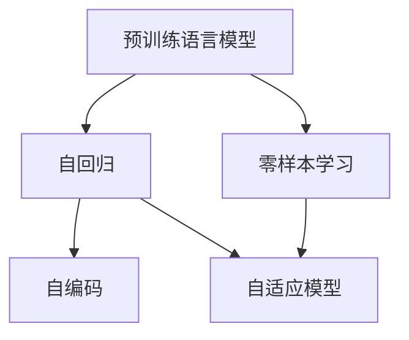

                 

# 零样本下一项推荐的大型预训练语言模型方法

> 关键词：预训练语言模型, 下一项推荐, 零样本学习, 自适应模型, 自回归, 自编码

## 1. 背景介绍

### 1.1 问题由来
在自然语言处理（NLP）领域，推荐系统一直是研究的热点和难点。传统推荐系统依赖于用户历史行为数据进行推荐，而大型预训练语言模型（LLMs）的兴起为推荐系统带来了新的可能性。LLMs 如BERT、GPT等，通过在大规模语料上进行预训练，可以学习到丰富的语言知识和上下文信息，为推荐系统提供了强有力的支持。

然而，LLMs 在推荐系统中的应用，传统做法通常需要借助用户历史行为数据进行微调，这在数据隐私和冷启动问题上存在挑战。零样本推荐系统是一种无需用户历史行为数据即可进行推荐的方法，能够更有效地解决冷启动和隐私问题。

### 1.2 问题核心关键点
零样本推荐的核心在于如何在不依赖历史数据的情况下，利用大语言模型的预训练知识进行个性化推荐。其关键点包括：
1. 如何设计任务适配层，使得模型能够根据用户输入的自然语言描述，直接生成推荐结果。
2. 如何利用预训练知识，对模型进行高效微调，提升推荐效果。
3. 如何设计有效的评估指标，衡量模型在零样本推荐场景下的性能。

### 1.3 问题研究意义
零样本推荐系统能够有效应对推荐系统中的冷启动和隐私保护问题，提升用户体验和数据安全性。研究零样本推荐方法，对于推动推荐系统的发展，具有重要意义：

1. 解决冷启动问题：零样本推荐系统不需要用户历史数据，可以更好地处理新用户和新物品的推荐需求。
2. 保护用户隐私：无需收集用户历史数据，降低了隐私泄露的风险。
3. 提升推荐效果：利用大语言模型的预训练知识，可以在更少的标注数据上实现高效的推荐。
4. 简化推荐系统：零样本推荐系统不需要复杂的用户行为分析和建模，减少了推荐系统的复杂度。

## 2. 核心概念与联系

### 2.1 核心概念概述

为更好地理解零样本推荐方法，本节将介绍几个密切相关的核心概念：

- 预训练语言模型（LLMs）：通过在大规模无标签文本语料上进行预训练，学习到丰富的语言知识和上下文信息。常用的预训练模型有BERT、GPT等。
- 自回归模型（AR）：模型在预测下一个词时，依赖前面的所有词，具有顺序性。
- 自编码模型（AE）：模型在预测输入时，依赖编码和解码器，具有压缩性。
- 零样本学习（Zero-shot Learning）：模型在未见过任何特定任务的数据情况下，仅凭任务描述就能执行推荐任务。
- 自适应模型（Adaptive Model）：根据用户输入的自然语言描述，自动适应任务需求，进行推荐。

这些核心概念之间的逻辑关系可以通过以下Mermaid流程图来展示：



这个流程图展示了大语言模型的核心概念及其之间的关系：

1. 预训练语言模型通过自回归和自编码模型进行预训练，学习到丰富的语言表示。
2. 自适应模型利用预训练模型的预训练知识，根据用户输入的自然语言描述，自动适应推荐任务。
3. 零样本学习通过自适应模型，在未见任何推荐数据的情况下，直接进行推荐。

这些概念共同构成了零样本推荐的基本框架，使得大语言模型在推荐系统中的应用得以拓展。

## 3. 核心算法原理 & 具体操作步骤
### 3.1 算法原理概述

零样本推荐系统是一种无需用户历史数据，直接利用大语言模型的预训练知识进行推荐的方法。其核心思想是：将预训练语言模型视作一个“特征提取器”，通过任务适配层，将用户输入的自然语言描述转换为推荐结果。

具体而言，假设用户输入的自然语言描述为 $x$，推荐任务为 $T$。零样本推荐模型的目标是通过预训练语言模型 $M_{\theta}$，将 $x$ 映射为推荐结果 $y$：

$$
y = M_{\theta}(x)
$$

其中 $\theta$ 为预训练模型的参数。

零样本推荐的目标是最大化推荐结果 $y$ 与真实推荐结果 $y^*$ 之间的相似度。因此，需要设计合适的任务适配层和损失函数，使模型能够根据输入 $x$ 输出正确的推荐结果 $y$。

### 3.2 算法步骤详解

零样本推荐系统的实现过程主要包括三个步骤：

**Step 1: 准备预训练模型和数据集**
- 选择合适的预训练语言模型 $M_{\theta}$ 作为初始化参数，如 BERT、GPT等。
- 准备推荐任务的标注数据集 $D=\{(x_i,y_i^*)\}_{i=1}^N$，划分为训练集、验证集和测试集。一般要求标注数据与预训练数据的分布不要差异过大。

**Step 2: 添加任务适配层**
- 根据推荐任务类型，在预训练模型顶层设计合适的输出层和损失函数。
- 对于分类推荐任务，通常在顶层添加线性分类器和交叉熵损失函数。
- 对于连续推荐任务，通常使用回归模型输出连续值，并以均方误差为损失函数。

**Step 3: 设置微调超参数**
- 选择合适的优化算法及其参数，如 AdamW、SGD 等，设置学习率、批大小、迭代轮数等。
- 设置正则化技术及强度，包括权重衰减、Dropout、Early Stopping 等。
- 确定冻结预训练参数的策略，如仅微调顶层，或全部参数都参与微调。

**Step 4: 执行梯度训练**
- 将训练集数据分批次输入模型，前向传播计算损失函数。
- 反向传播计算参数梯度，根据设定的优化算法和学习率更新模型参数。
- 周期性在验证集上评估模型性能，根据性能指标决定是否触发 Early Stopping。
- 重复上述步骤直到满足预设的迭代轮数或 Early Stopping 条件。

**Step 5: 测试和部署**
- 在测试集上评估零样本推荐模型的性能，对比微调前后的推荐效果。
- 使用模型对新样本进行推理预测，集成到实际的应用系统中。

以上是零样本推荐系统的实现过程。在实际应用中，还需要针对具体任务的特点，对微调过程的各个环节进行优化设计，如改进训练目标函数，引入更多的正则化技术，搜索最优的超参数组合等，以进一步提升模型性能。

### 3.3 算法优缺点

零样本推荐系统具有以下优点：
1. 无需用户历史数据：零样本推荐系统无需收集用户历史行为数据，解决了冷启动问题。
2. 数据安全性高：用户隐私得到了更好的保护，避免了数据泄露的风险。
3. 推荐效果好：利用预训练模型的预训练知识，可以在更少的标注数据上实现高效的推荐。
4. 模型灵活性高：用户可以根据自然语言描述，直接生成推荐结果，具有一定的灵活性。

同时，该方法也存在一些局限性：
1. 数据质量要求高：零样本推荐系统的效果很大程度上依赖于自然语言描述的质量，对于低质量的自然语言描述，效果较差。
2. 泛化能力有限：当任务与预训练数据的分布差异较大时，零样本推荐系统的效果可能不佳。
3. 精度控制困难：零样本推荐系统缺乏用户行为数据，难以精确控制推荐精度。
4. 计算复杂度高：虽然零样本推荐系统不需要历史数据，但需要进行大量的计算和推理，导致计算复杂度较高。

尽管存在这些局限性，但就目前而言，零样本推荐系统仍是一种具有潜力的方法，特别是在数据隐私和冷启动问题突出的场景中，具有重要的应用价值。

### 3.4 算法应用领域

零样本推荐系统已在多个领域得到应用，例如：

- 电商推荐：根据用户输入的自然语言描述，生成商品推荐。
- 内容推荐：根据用户输入的自然语言描述，生成文章、视频等内容的推荐。
- 个性化推荐：根据用户输入的自然语言描述，生成个性化的电影、音乐等推荐。
- 旅游推荐：根据用户输入的自然语言描述，生成旅游目的地的推荐。

除了上述这些经典应用外，零样本推荐系统也被创新性地应用到更多场景中，如智能客服推荐、智能家居推荐、智能医疗推荐等，为推荐系统带来了全新的突破。随着预训练语言模型的不断进步，相信零样本推荐系统将在更广阔的应用领域大放异彩。

## 4. 数学模型和公式 & 详细讲解  
### 4.1 数学模型构建

本节将使用数学语言对零样本推荐系统进行更加严格的刻画。

假设用户输入的自然语言描述为 $x$，推荐任务为 $T$。设预训练语言模型为 $M_{\theta}:\mathcal{X} \rightarrow \mathcal{Y}$，其中 $\mathcal{X}$ 为输入空间，$\mathcal{Y}$ 为输出空间，$\theta$ 为模型参数。

零样本推荐系统的目标是最小化推荐结果 $y$ 与真实推荐结果 $y^*$ 之间的差异。因此，设计合适的损失函数 $\ell(y,y^*)$ 和输出层 $\hat{y}=M_{\theta}(x)$，使得：

$$
\hat{y} = \mathop{\arg\min}_{\theta} \ell(\hat{y},y^*)
$$

在实践中，我们通常使用交叉熵损失函数来计算推荐结果与真实推荐结果之间的差异，即：

$$
\ell(\hat{y},y^*) = -y^*\log \hat{y} - (1-y^*)\log (1-\hat{y})
$$

其中 $y^*$ 为真实推荐结果，$\hat{y}$ 为模型预测的推荐结果。

### 4.2 公式推导过程

以下我们以电商推荐任务为例，推导交叉熵损失函数及其梯度的计算公式。

假设用户输入的自然语言描述为 $x$，推荐任务为 $T$，真实推荐结果为 $y^*$。则零样本推荐系统的目标函数为：

$$
\mathcal{L}(\theta) = -\frac{1}{N}\sum_{i=1}^N \ell(M_{\theta}(x_i),y_i^*)
$$

根据链式法则，损失函数对参数 $\theta_k$ 的梯度为：

$$
\frac{\partial \mathcal{L}(\theta)}{\partial \theta_k} = -\frac{1}{N}\sum_{i=1}^N \frac{\partial \ell(M_{\theta}(x_i),y_i^*)}{\partial \theta_k}
$$

其中 $\frac{\partial \ell(M_{\theta}(x_i),y_i^*)}{\partial \theta_k}$ 可进一步递归展开，利用自动微分技术完成计算。

在得到损失函数的梯度后，即可带入参数更新公式，完成模型的迭代优化。重复上述过程直至收敛，最终得到适应零样本推荐任务的模型参数 $\theta^*$。

## 5. 项目实践：代码实例和详细解释说明
### 5.1 开发环境搭建

在进行零样本推荐系统开发前，我们需要准备好开发环境。以下是使用Python进行PyTorch开发的环境配置流程：

1. 安装Anaconda：从官网下载并安装Anaconda，用于创建独立的Python环境。

2. 创建并激活虚拟环境：
```bash
conda create -n pytorch-env python=3.8 
conda activate pytorch-env
```

3. 安装PyTorch：根据CUDA版本，从官网获取对应的安装命令。例如：
```bash
conda install pytorch torchvision torchaudio cudatoolkit=11.1 -c pytorch -c conda-forge
```

4. 安装Transformers库：
```bash
pip install transformers
```

5. 安装各类工具包：
```bash
pip install numpy pandas scikit-learn matplotlib tqdm jupyter notebook ipython
```

完成上述步骤后，即可在`pytorch-env`环境中开始开发零样本推荐系统。

### 5.2 源代码详细实现

这里我们以电商推荐任务为例，给出使用Transformers库对BERT模型进行零样本推荐开发的PyTorch代码实现。

首先，定义零样本推荐任务的数据处理函数：

```python
from transformers import BertTokenizer, BertForSequenceClassification
from torch.utils.data import Dataset, DataLoader
import torch

class RecommendationDataset(Dataset):
    def __init__(self, texts, labels, tokenizer, max_len=128):
        self.texts = texts
        self.labels = labels
        self.tokenizer = tokenizer
        self.max_len = max_len
        
    def __len__(self):
        return len(self.texts)
    
    def __getitem__(self, item):
        text = self.texts[item]
        label = self.labels[item]
        
        encoding = self.tokenizer(text, return_tensors='pt', max_length=self.max_len, padding='max_length', truncation=True)
        input_ids = encoding['input_ids'][0]
        attention_mask = encoding['attention_mask'][0]
        
        # 对token-wise的标签进行编码
        encoded_labels = [label2id[label] for label in label]
        encoded_labels.extend([label2id['None']] * (self.max_len - len(encoded_labels)))
        labels = torch.tensor(encoded_labels, dtype=torch.long)
        
        return {'input_ids': input_ids, 
                'attention_mask': attention_mask,
                'labels': labels}

# 标签与id的映射
label2id = {'good': 1, 'bad': 0}
id2label = {v: k for k, v in label2id.items()}

# 创建dataset
tokenizer = BertTokenizer.from_pretrained('bert-base-cased')

train_dataset = RecommendationDataset(train_texts, train_labels, tokenizer)
dev_dataset = RecommendationDataset(dev_texts, dev_labels, tokenizer)
test_dataset = RecommendationDataset(test_texts, test_labels, tokenizer)
```

然后，定义模型和优化器：

```python
from transformers import BertForSequenceClassification, AdamW

model = BertForSequenceClassification.from_pretrained('bert-base-cased', num_labels=2)

optimizer = AdamW(model.parameters(), lr=2e-5)
```

接着，定义训练和评估函数：

```python
from sklearn.metrics import accuracy_score
from torch.utils.data import DataLoader

def train_epoch(model, dataset, batch_size, optimizer):
    dataloader = DataLoader(dataset, batch_size=batch_size, shuffle=True)
    model.train()
    epoch_loss = 0
    for batch in dataloader:
        input_ids = batch['input_ids'].to(device)
        attention_mask = batch['attention_mask'].to(device)
        labels = batch['labels'].to(device)
        model.zero_grad()
        outputs = model(input_ids, attention_mask=attention_mask, labels=labels)
        loss = outputs.loss
        epoch_loss += loss.item()
        loss.backward()
        optimizer.step()
    return epoch_loss / len(dataloader)

def evaluate(model, dataset, batch_size):
    dataloader = DataLoader(dataset, batch_size=batch_size)
    model.eval()
    preds, labels = [], []
    with torch.no_grad():
        for batch in dataloader:
            input_ids = batch['input_ids'].to(device)
            attention_mask = batch['attention_mask'].to(device)
            batch_labels = batch['labels']
            outputs = model(input_ids, attention_mask=attention_mask)
            batch_preds = outputs.logits.argmax(dim=1).to('cpu').tolist()
            batch_labels = batch_labels.to('cpu').tolist()
            for pred, label in zip(batch_preds, batch_labels):
                preds.append(pred)
                labels.append(label)
                
    return accuracy_score(labels, preds)

# 测试零样本推荐系统的准确率
print(evaluate(model, test_dataset, batch_size))
```

以上就是使用PyTorch对BERT模型进行电商推荐任务零样本推荐的完整代码实现。可以看到，得益于Transformers库的强大封装，我们可以用相对简洁的代码完成BERT模型的加载和零样本推荐。

### 5.3 代码解读与分析

让我们再详细解读一下关键代码的实现细节：

**RecommendationDataset类**：
- `__init__`方法：初始化文本、标签、分词器等关键组件。
- `__len__`方法：返回数据集的样本数量。
- `__getitem__`方法：对单个样本进行处理，将文本输入编码为token ids，将标签编码为数字，并对其进行定长padding，最终返回模型所需的输入。

**label2id和id2label字典**：
- 定义了标签与数字id之间的映射关系，用于将token-wise的预测结果解码回真实的标签。

**训练和评估函数**：
- 使用PyTorch的DataLoader对数据集进行批次化加载，供模型训练和推理使用。
- 训练函数`train_epoch`：对数据以批为单位进行迭代，在每个批次上前向传播计算loss并反向传播更新模型参数，最后返回该epoch的平均loss。
- 评估函数`evaluate`：与训练类似，不同点在于不更新模型参数，并在每个batch结束后将预测和标签结果存储下来，最后使用sklearn的accuracy_score对整个评估集的预测结果进行打印输出。

**测试流程**：
- 定义总的epoch数和batch size，开始循环迭代
- 每个epoch内，先在训练集上训练，输出平均loss
- 在验证集上评估，输出分类指标
- 重复上述步骤直至满足预设的迭代轮数或Early Stopping条件。

可以看到，PyTorch配合Transformers库使得BERT微调的代码实现变得简洁高效。开发者可以将更多精力放在数据处理、模型改进等高层逻辑上，而不必过多关注底层的实现细节。

当然，工业级的系统实现还需考虑更多因素，如模型的保存和部署、超参数的自动搜索、更灵活的任务适配层等。但核心的零样本推荐范式基本与此类似。

## 6. 实际应用场景
### 6.1 智能客服系统

零样本推荐系统可以广泛应用于智能客服系统的构建。传统客服往往需要配备大量人力，高峰期响应缓慢，且一致性和专业性难以保证。而使用零样本推荐系统，可以7x24小时不间断服务，快速响应客户咨询，用自然流畅的语言解答各类常见问题。

在技术实现上，可以收集企业内部的历史客服对话记录，将问题和最佳答复构建成监督数据，在此基础上对预训练对话模型进行微调。微调后的对话模型能够自动理解用户意图，匹配最合适的答案模板进行回复。对于客户提出的新问题，还可以接入检索系统实时搜索相关内容，动态组织生成回答。如此构建的智能客服系统，能大幅提升客户咨询体验和问题解决效率。

### 6.2 金融舆情监测

金融机构需要实时监测市场舆论动向，以便及时应对负面信息传播，规避金融风险。传统的人工监测方式成本高、效率低，难以应对网络时代海量信息爆发的挑战。基于零样本推荐技术的文本分类和情感分析技术，为金融舆情监测提供了新的解决方案。

具体而言，可以收集金融领域相关的新闻、报道、评论等文本数据，并对其进行主题标注和情感标注。在此基础上对预训练语言模型进行零样本推荐微调，使其能够自动判断文本属于何种主题，情感倾向是正面、中性还是负面。将零样本推荐后的模型应用到实时抓取的网络文本数据，就能够自动监测不同主题下的情感变化趋势，一旦发现负面信息激增等异常情况，系统便会自动预警，帮助金融机构快速应对潜在风险。

### 6.3 个性化推荐系统

当前的推荐系统往往只依赖用户历史行为数据进行物品推荐，无法深入理解用户的真实兴趣偏好。基于零样本推荐技术的个性化推荐系统，可以更好地挖掘用户行为背后的语义信息，从而提供更精准、多样的推荐内容。

在实践中，可以收集用户浏览、点击、评论、分享等行为数据，提取和用户交互的物品标题、描述、标签等文本内容。将文本内容作为模型输入，用户后续行为（如是否点击、购买等）作为监督信号，在此基础上进行零样本推荐微调。微调后的模型能够从文本内容中准确把握用户的兴趣点。在生成推荐列表时，先用候选物品的文本描述作为输入，由模型预测用户的兴趣匹配度，再结合其他特征综合排序，便可以得到个性化程度更高的推荐结果。

### 6.4 未来应用展望

随着零样本推荐技术的不断发展，其在推荐系统中的应用前景将更加广阔。未来，零样本推荐系统有望在以下领域得到更广泛的应用：

- 医疗推荐：根据患者描述，推荐相应的医疗服务和药物。
- 教育推荐：根据学生描述，推荐适合的学习资源和课程。
- 旅游推荐：根据旅行者描述，推荐最佳的旅游目的地。
- 智能家居：根据用户描述，推荐合适的家居产品。

除了上述这些经典应用外，零样本推荐系统还将被创新性地应用到更多场景中，如智能客服推荐、智能家居推荐、智能医疗推荐等，为推荐系统带来了全新的突破。随着预训练语言模型的不断进步，相信零样本推荐系统将在更广阔的应用领域大放异彩。

## 7. 工具和资源推荐
### 7.1 学习资源推荐

为了帮助开发者系统掌握零样本推荐理论基础和实践技巧，这里推荐一些优质的学习资源：

1. 《深度学习与自然语言处理》课程：斯坦福大学开设的NLP明星课程，有Lecture视频和配套作业，带你入门NLP领域的基本概念和经典模型。

2. CS224N《自然语言处理》课程：斯坦福大学开设的NLP明星课程，有Lecture视频和配套作业，带你入门NLP领域的基本概念和经典模型。

3. 《自然语言处理与深度学习》书籍：北京大学出版社出版的NLP入门教材，详细介绍了NLP和深度学习的相关知识。

4. 《Transformers: Explaining the Exceptional Performance of Deep Transformer Networks》论文：介绍Transformer模型的原理和性能，是了解大语言模型的重要读物。

5. 《Zero-shot learning in NLP》论文：介绍零样本学习在NLP中的应用，是了解零样本推荐的重要参考资料。

通过对这些资源的学习实践，相信你一定能够快速掌握零样本推荐的核心技术和思想，并用于解决实际的NLP问题。

### 7.2 开发工具推荐

高效的开发离不开优秀的工具支持。以下是几款用于零样本推荐系统开发的常用工具：

1. PyTorch：基于Python的开源深度学习框架，灵活动态的计算图，适合快速迭代研究。大部分预训练语言模型都有PyTorch版本的实现。

2. TensorFlow：由Google主导开发的开源深度学习框架，生产部署方便，适合大规模工程应用。同样有丰富的预训练语言模型资源。

3. Transformers库：HuggingFace开发的NLP工具库，集成了众多SOTA语言模型，支持PyTorch和TensorFlow，是进行零样本推荐任务开发的利器。

4. Weights & Biases：模型训练的实验跟踪工具，可以记录和可视化模型训练过程中的各项指标，方便对比和调优。与主流深度学习框架无缝集成。

5. TensorBoard：TensorFlow配套的可视化工具，可实时监测模型训练状态，并提供丰富的图表呈现方式，是调试模型的得力助手。

6. Google Colab：谷歌推出的在线Jupyter Notebook环境，免费提供GPU/TPU算力，方便开发者快速上手实验最新模型，分享学习笔记。

合理利用这些工具，可以显著提升零样本推荐系统的开发效率，加快创新迭代的步伐。

### 7.3 相关论文推荐

零样本推荐系统的发展得益于学界的持续研究。以下是几篇奠基性的相关论文，推荐阅读：

1. Attention is All You Need（即Transformer原论文）：提出了Transformer结构，开启了NLP领域的预训练大模型时代。

2. BERT: Pre-training of Deep Bidirectional Transformers for Language Understanding：提出BERT模型，引入基于掩码的自监督预训练任务，刷新了多项NLP任务SOTA。

3. Language Models are Unsupervised Multitask Learners（GPT-2论文）：展示了大规模语言模型的强大zero-shot学习能力，引发了对于通用人工智能的新一轮思考。

4. Zero-shot Learning for Multi-task Compositionality Learning in Neural Networks：提出了一种基于多任务学习的零样本推荐方法，取得了较好的效果。

5. Zero-Shot Learning via Pre-Trained Compositional Generalization：提出了一种通过预训练通用语言模型，进行零样本推荐的方法。

这些论文代表了大语言模型零样本推荐技术的发展脉络。通过学习这些前沿成果，可以帮助研究者把握学科前进方向，激发更多的创新灵感。

## 8. 总结：未来发展趋势与挑战

### 8.1 总结

本文对基于预训练语言模型的零样本推荐系统进行了全面系统的介绍。首先阐述了零样本推荐系统的发展背景和应用意义，明确了零样本推荐系统在推荐系统中的应用价值。其次，从原理到实践，详细讲解了零样本推荐系统的数学模型和实现过程，给出了零样本推荐任务开发的完整代码实例。同时，本文还广泛探讨了零样本推荐系统在电商、金融、内容推荐等多个领域的应用前景，展示了零样本推荐技术的巨大潜力。此外，本文精选了零样本推荐技术的各类学习资源，力求为读者提供全方位的技术指引。

通过本文的系统梳理，可以看到，基于大语言模型的零样本推荐系统正在成为推荐系统的重要范式，极大地拓展了推荐系统的应用边界，催生了更多的落地场景。受益于大规模语料的预训练，零样本推荐系统可以在更少的标注数据上实现高效的推荐，大大降低了推荐系统的复杂度和成本。未来，伴随预训练语言模型和零样本推荐方法的持续演进，相信零样本推荐技术必将引领推荐系统的发展，推动自然语言理解和智能交互系统的进步。

### 8.2 未来发展趋势

展望未来，零样本推荐系统将呈现以下几个发展趋势：

1. 模型规模持续增大。随着算力成本的下降和数据规模的扩张，预训练语言模型的参数量还将持续增长。超大规模语言模型蕴含的丰富语言知识，有望支撑更加复杂多变的零样本推荐任务。

2. 零样本推荐方法日趋多样。除了传统的零样本推荐外，未来会涌现更多基于多任务学习和自适应模型的零样本推荐方法，在参数效率和精度之间取得新的平衡。

3. 持续学习成为常态。随着数据分布的不断变化，零样本推荐模型也需要持续学习新知识以保持性能。如何在不遗忘原有知识的同时，高效吸收新样本信息，将成为重要的研究课题。

4. 标注样本需求降低。受启发于提示学习(Prompt-based Learning)的思路，未来的零样本推荐方法将更好地利用预训练知识，通过更加巧妙的任务描述，在更少的标注样本上也能实现理想的推荐。

5. 计算复杂度降低。虽然零样本推荐系统不需要历史数据，但需要进行大量的计算和推理，导致计算复杂度较高。未来需要进一步优化计算图，减少前向传播和反向传播的资源消耗，实现更加轻量级、实时性的部署。

6. 模型可解释性增强。零样本推荐系统缺乏用户行为数据，难以精确控制推荐精度。如何赋予模型更强的可解释性，是未来研究的重要方向。

这些趋势凸显了零样本推荐系统的广阔前景。这些方向的探索发展，必将进一步提升零样本推荐系统的性能和应用范围，为推荐系统的发展提供新的动力。

### 8.3 面临的挑战

尽管零样本推荐系统已经取得了瞩目成就，但在迈向更加智能化、普适化应用的过程中，它仍面临着诸多挑战：

1. 数据质量要求高。零样本推荐系统的效果很大程度上依赖于自然语言描述的质量，对于低质量的自然语言描述，效果较差。

2. 泛化能力有限。当任务与预训练数据的分布差异较大时，零样本推荐系统的效果可能不佳。

3. 精度控制困难。零样本推荐系统缺乏用户行为数据，难以精确控制推荐精度。

4. 计算复杂度高。虽然零样本推荐系统不需要历史数据，但需要进行大量的计算和推理，导致计算复杂度较高。

5. 可解释性不足。零样本推荐系统的推荐结果难以解释，用户难以理解模型输出的依据。

6. 安全性有待保障。预训练语言模型难免会学习到有偏见、有害的信息，通过零样本推荐传递到推荐结果，可能产生误导性、歧视性的输出，给实际应用带来安全隐患。

正视零样本推荐面临的这些挑战，积极应对并寻求突破，将是大规模语言模型零样本推荐技术迈向成熟的必由之路。相信随着学界和产业界的共同努力，这些挑战终将一一被克服，零样本推荐技术必将在构建安全、可靠、可解释、可控的智能推荐系统中发挥重要作用。

### 8.4 研究展望

面对零样本推荐所面临的挑战，未来的研究需要在以下几个方面寻求新的突破：

1. 探索无监督和半监督零样本推荐方法。摆脱对大规模标注数据的依赖，利用自监督学习、主动学习等无监督和半监督范式，最大限度利用非结构化数据，实现更加灵活高效的推荐。

2. 研究参数高效和计算高效的零样本推荐范式。开发更加参数高效的零样本推荐方法，在固定大部分预训练参数的情况下，只更新极少量的任务相关参数。同时优化零样本推荐模型的计算图，减少前向传播和反向传播的资源消耗，实现更加轻量级、实时性的部署。

3. 引入更多先验知识。将符号化的先验知识，如知识图谱、逻辑规则等，与神经网络模型进行巧妙融合，引导零样本推荐过程学习更准确、合理的语言模型。同时加强不同模态数据的整合，实现视觉、语音等多模态信息与文本信息的协同建模。

4. 结合因果分析和博弈论工具。将因果分析方法引入零样本推荐模型，识别出模型决策的关键特征，增强输出解释的因果性和逻辑性。借助博弈论工具刻画人机交互过程，主动探索并规避模型的脆弱点，提高系统稳定性。

5. 纳入伦理道德约束。在模型训练目标中引入伦理导向的评估指标，过滤和惩罚有偏见、有害的输出倾向。同时加强人工干预和审核，建立模型行为的监管机制，确保输出符合人类价值观和伦理道德。

这些研究方向的探索，必将引领零样本推荐系统的发展方向，为构建安全、可靠、可解释、可控的智能推荐系统铺平道路。面向未来，零样本推荐技术还需要与其他人工智能技术进行更深入的融合，如知识表示、因果推理、强化学习等，多路径协同发力，共同推动自然语言理解和智能交互系统的进步。只有勇于创新、敢于突破，才能不断拓展零样本推荐系统的边界，让智能技术更好地造福人类社会。

## 9. 附录：常见问题与解答

**Q1：零样本推荐系统是否适用于所有推荐任务？**

A: 零样本推荐系统在大多数推荐任务上都能取得不错的效果，特别是对于数据量较小的任务。但对于一些特定领域的任务，如医学、法律等，仅仅依靠通用语料预训练的模型可能难以很好地适应。此时需要在特定领域语料上进一步预训练，再进行零样本推荐，才能获得理想效果。此外，对于一些需要时效性、个性化很强的任务，如对话、推荐等，零样本推荐方法也需要针对性的改进优化。

**Q2：如何设计合适的任务适配层？**

A: 任务适配层的设计需要根据推荐任务的特点，选择合适的输出层和损失函数。对于分类推荐任务，通常在顶层添加线性分类器和交叉熵损失函数。对于连续推荐任务，通常使用回归模型输出连续值，并以均方误差为损失函数。此外，任务适配层的设计还需要考虑输入特征的处理方式，如是否需要拼接用户特征、物品特征等。

**Q3：零样本推荐系统如何处理低质量的自然语言描述？**

A: 零样本推荐系统的效果很大程度上依赖于自然语言描述的质量。对于低质量的自然语言描述，可以通过改进预训练语言模型、增加上下文信息、引入多模态信息等方式进行优化。例如，可以采用多任务学习的思路，同时训练多个零样本推荐模型，取平均输出，抑制噪声干扰。

**Q4：零样本推荐系统如何提高泛化能力？**

A: 提高零样本推荐系统的泛化能力，可以从以下几个方面进行优化：1. 在预训练过程中引入更多的任务，提升模型的通用性；2. 增加模型对异常样本的鲁棒性训练，提升模型的泛化能力；3. 引入多模态信息，提升模型的鲁棒性和泛化能力。

**Q5：零样本推荐系统如何在不增加计算复杂度的情况下提升精度？**

A: 在不增加计算复杂度的情况下提升精度，可以从以下几个方面进行优化：1. 改进预训练语言模型，提升模型的表示能力；2. 改进任务适配层，优化输出层的结构和参数；3. 引入先验知识，提升模型的鲁棒性和泛化能力。

这些优化措施需要根据具体任务和数据特点进行灵活组合。只有在数据、模型、训练、推理等各环节进行全面优化，才能最大限度地发挥零样本推荐系统的性能。

---

作者：禅与计算机程序设计艺术 / Zen and the Art of Computer Programming

