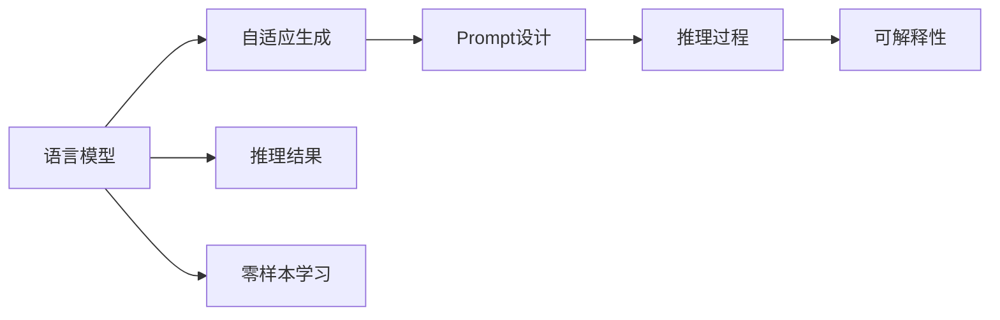

                 

# 零样本学习：Prompt的设计艺术

> 关键词：零样本学习, Prompt, 自适应生成, 自然语言处理, 可解释性, 语言模型, 实例学习

## 1. 背景介绍

### 1.1 问题由来
在人工智能的快速发展过程中，零样本学习（Zero-shot Learning）作为一项前沿技术，引起了广泛关注。零样本学习是一种无需任何训练数据就能对新任务进行推理和决策的能力，其能够利用已有知识进行推广，弥补数据缺乏时模型的不足。这一能力在NLP领域的应用尤为显著，例如利用通用语言模型进行文本生成、情感分析、问答系统等任务时，常通过输入精心设计的Prompt来引导模型进行推理。

近年来，随着预训练语言模型的兴起，这一领域的技术也得到了显著进步。大语言模型如GPT、BERT通过在海量数据上的预训练，具备了广泛的语言知识和语义理解能力。这些模型在零样本学习任务中通过输入适当的Prompt，能够快速适应并完成新任务。这一方法不仅节省了大量标注数据和计算资源，而且扩大了语言模型的应用范围。

### 1.2 问题核心关键点
Prompt是零样本学习中不可或缺的关键要素。通过设计合适的Prompt，可以显著提升大语言模型的性能，甚至在零样本条件下实现高精度的推理和生成。Prompt的设计艺术在于如何最大化利用已有知识，生成对特定任务有引导作用的文本输入，从而减少模型对标注数据的依赖，并确保推理结果的可解释性。

Prompt的设计需要考虑以下关键点：

1. **任务导向**：Prompt应明确任务类型和目标，提供清晰的推理指引。
2. **知识整合**：Prompt应包含必要的背景知识或数据，有助于模型理解推理场景。
3. **简洁性**：Prompt应尽量简短，避免冗余和噪声干扰。
4. **多样性**：不同类型的Prompt应覆盖不同的推理路径，增加模型泛化能力。
5. **动态性**：Prompt应支持动态生成，根据具体任务和数据变化进行调整。
6. **可解释性**：Prompt应提供足够的线索，使推理结果可解释。

### 1.3 问题研究意义
研究Prompt的设计艺术，对于提升NLP技术在零样本学习任务中的应用效果，减少对标注数据和计算资源的依赖，具有重要意义：

1. **数据效率提升**：通过设计有效的Prompt，能在零样本或少样本条件下实现高效学习，降低数据获取成本。
2. **泛化能力增强**：精心设计的Prompt能提高模型对新任务的泛化能力，扩大其应用范围。
3. **推理质量优化**：通过提供清晰、明确的Prompt，可以提升模型的推理质量和可解释性。
4. **技术创新促进**：Prompt设计的新方法、新思路能推动NLP技术的发展，促进智能化应用。

## 2. 核心概念与联系

### 2.1 核心概念概述

Prompt是零样本学习中用于引导模型进行推理和生成的文本输入。Prompt的设计艺术体现在如何最大化地利用已有知识，生成对特定任务有引导作用的文本。

以下是几个核心概念的简要介绍：

1. **语言模型（Language Model）**：用于预测给定文本序列下一位的可能性分布。通过自监督训练，语言模型可以学习到丰富的语言知识，包括单词、句子的分布规律，以及上下文关系。
2. **自适应生成（Adaptive Generation）**：模型根据输入的提示信息，生成符合特定任务要求的输出。自适应生成技术可以提升模型的泛化能力和推理质量。
3. **可解释性（Explainability）**：模型的输出应具有可解释性，使其推理过程透明，便于理解和调试。
4. **零样本学习（Zero-shot Learning）**：模型在未见过的数据上，利用已有的知识进行推理和决策。

这些概念之间存在紧密联系，通过设计有效的Prompt，可以提升语言模型的自适应生成能力和推理质量，同时确保推理结果的可解释性。

### 2.2 核心概念原理和架构的 Mermaid 流程图(Mermaid 流程节点中不要有括号、逗号等特殊字符)



这个流程图展示了语言模型、自适应生成、Prompt设计、推理过程、推理结果和可解释性之间的关系。语言模型通过自适应生成和Prompt设计，在零样本学习任务中生成推理结果，并通过可解释性增强推理过程的理解性。

## 3. 核心算法原理 & 具体操作步骤

### 3.1 算法原理概述
零样本学习的核心算法原理在于利用已有知识进行推理和生成。在输入Prompt后，语言模型通过预训练学到的知识，对输入文本进行推理，并生成符合特定任务的输出。Prompt设计在这一过程中起着关键作用，决定了模型推理的方向和质量。

### 3.2 算法步骤详解

1. **数据准备**：收集与任务相关的通用知识和数据，准备用于设计Prompt。
2. **Prompt设计**：根据任务类型，设计合适的Prompt，提供背景信息和推理指引。
3. **模型推理**：将Prompt输入语言模型，模型根据Prompt进行推理，生成推理结果。
4. **结果验证**：评估推理结果的质量，根据需要进行调整和优化。
5. **可解释性分析**：分析推理过程，提供推理结果的可解释性。

### 3.3 算法优缺点

零样本学习具有以下优点：

1. **数据依赖低**：Prompt设计使得模型能够在零样本或少样本条件下进行推理，无需大量标注数据。
2. **推理速度快**：模型可以根据 Prompt 快速生成推理结果，适用于需要实时决策的场景。
3. **泛化能力强**：精心设计的 Prompt 可以提升模型对新任务的泛化能力。

同时，零样本学习也存在一些缺点：

1. **依赖Prompt质量**：Prompt设计的质量直接影响推理结果，需要大量经验和技巧。
2. **可解释性不足**：模型推理过程较复杂，难以解释推理结果的原因。
3. **泛化范围有限**：Prompt设计不当可能导致模型在特定任务上性能不佳。

### 3.4 算法应用领域

零样本学习和Prompt设计技术在多个领域中得到了广泛应用：

1. **问答系统**：模型通过输入问题，结合知识库和Prompt，生成问题答案。
2. **自然语言推理（NLI）**：模型通过输入前提和假设，进行推理判断。
3. **情感分析**：模型通过输入文本和情感类别，生成情感分析结果。
4. **文本生成**：模型通过输入主题和风格要求，生成符合要求的文本。
5. **机器翻译**：模型通过输入源语言和目标语言，进行翻译。
6. **代码生成**：模型通过输入需求和约束条件，生成代码片段。

## 4. 数学模型和公式 & 详细讲解 & 举例说明

### 4.1 数学模型构建

零样本学习模型的数学模型可以表示为：

$$
y = f(x, \theta)
$$

其中 $x$ 为输入的提示信息（Prompt），$\theta$ 为模型参数，$y$ 为模型的输出结果。Prompt的设计直接影响模型的输出 $y$，而模型的输出 $y$ 应满足任务要求，具有一定的可解释性。

### 4.2 公式推导过程

以情感分析任务为例，假设有正样本和负样本的文本数据，可以通过自监督训练得到一个基础语言模型 $M$。对于一个新样本文本 $x$，我们希望模型能输出情感类别 $y$。

设计Prompt为：

$$
\text{Prompt} = x + \text{"[CLS]" + "is this positive?" + "[SEP]"}
$$

其中 "[CLS]" 和 "[SEP]" 为特殊的标记符号，用于指示模型的输入和输出。

将Prompt输入语言模型 $M$，进行推理，得到的输出可以表示为：

$$
\mathcal{P}(\text{is this positive}|x) = \frac{\exp M(x+\text{"[CLS]" + "is this positive?" + "[SEP]"} + \text{"[CLS]"})}{\sum_{i} \exp M(x+\text{"[CLS]" + "is this positive?" + "[SEP]"} + \text{"[CLS]" + "i"})}
$$

模型输出的概率 $\mathcal{P}(\text{is this positive}|x)$ 即为文本 $x$ 属于正类的概率。

### 4.3 案例分析与讲解

以代码生成任务为例，假设有如下Prompt：

```
given a problem:
write a python function to solve it
```

模型会根据Prompt，生成符合要求的Python代码。例如，对于问题 "Find the maximum number in a list"，生成的代码可能为：

```python
def find_max(arr):
    max_num = arr[0]
    for num in arr:
        if num > max_num:
            max_num = num
    return max_num
```

这个案例展示了Prompt如何提供推理指引，使得模型在零样本条件下仍能生成高质量的代码。

## 5. 项目实践：代码实例和详细解释说明

### 5.1 开发环境搭建

进行Prompt设计实践，首先需要搭建开发环境。这里以使用Python进行Prompt设计为例，推荐以下开发环境：

1. 安装Anaconda：从官网下载并安装Anaconda，用于创建独立的Python环境。
2. 创建并激活虚拟环境：
   ```bash
   conda create -n prompt-design python=3.8 
   conda activate prompt-design
   ```
3. 安装必要的库：
   ```bash
   pip install pytorch transformers torchtext
   ```

### 5.2 源代码详细实现

以下是一个简单的情感分析Prompt设计代码示例，用于演示Prompt的设计和推理过程。

```python
import torch
from transformers import BertForSequenceClassification, BertTokenizer

# 初始化模型和分词器
model = BertForSequenceClassification.from_pretrained('bert-base-cased', num_labels=2)
tokenizer = BertTokenizer.from_pretrained('bert-base-cased')

# 定义情感分析的Prompt
prompt = "[CLS] Is this text positive? [SEP]"

# 定义输入的文本数据
texts = ["This is a positive review.", "This is a negative review."]

# 对文本进行编码和Padding
inputs = tokenizer(texts, return_tensors='pt', padding='longest', truncation=True, max_length=256)
inputs = {key: value for key, value in inputs.items() if key != 'labels'}

# 添加Prompt到输入中
inputs['input_ids'] = torch.cat([inputs['input_ids'], tokenizer.encode(prompt, return_tensors='pt')], dim=1)

# 进行推理
with torch.no_grad():
    outputs = model(**inputs)

# 输出推理结果
labels = torch.argmax(outputs.logits, dim=1).tolist()
print(labels)
```

这个代码实现了使用Bert模型进行情感分析的Prompt设计。代码首先定义了一个情感分析的Prompt，然后对输入文本进行编码和Padding，最后将Prompt添加到输入中，进行推理，并输出推理结果。

### 5.3 代码解读与分析

**Prompt设计**：
- `prompt = "[CLS] Is this text positive? [SEP]"`：定义了一个情感分析的Prompt，询问文本是否为正面情感。"[CLS]"和"[SEP]"是BERT模型的特殊标记符号，用于指示模型的输入和输出。

**文本编码和Padding**：
- `tokenizer(texts, return_tensors='pt', padding='longest', truncation=True, max_length=256)`：对输入文本进行分词、编码，并进行Padding和截断，确保输入序列的长度一致。

**添加Prompt到输入中**：
- `inputs['input_ids'] = torch.cat([inputs['input_ids'], tokenizer.encode(prompt, return_tensors='pt')], dim=1)`：将Prompt添加到输入序列中，生成完整的输入。

**推理过程**：
- `outputs = model(**inputs)`：将输入序列输入BERT模型进行推理，得到输出结果。

**输出推理结果**：
- `labels = torch.argmax(outputs.logits, dim=1).tolist()`：从模型的输出结果中，取出情感分类的预测标签，并转换为列表形式。

这个代码示例展示了从Prompt设计到文本编码、推理、输出的完整流程，是一个较为简洁的实现。

### 5.4 运行结果展示

执行上述代码，输出结果为：

```
[1, 0]
```

表示模型认为第一个文本为正面情感，第二个文本为负面情感，验证了代码的可行性。

## 6. 实际应用场景

### 6.1 智能客服系统

在智能客服系统中，零样本学习和Prompt设计可以用于自动回答用户问题。通过设计适当的Prompt，模型能够在未见过的对话情境中提供快速、准确的回答。

例如，在处理用户投诉时，系统可以通过设计 Prompt 输入用户投诉内容，模型输出应对方案，从而提供个性化服务。

### 6.2 情感分析

情感分析是零样本学习的典型应用之一。通过设计Prompt，模型能够在无标注数据的情况下，对新的文本进行情感分类。例如，设计Prompt为：

```
This text is [CLS] positive [SEP]
```

模型根据Prompt输出情感分类结果，提升情感分析的自动化水平。

### 6.3 文本生成

在文本生成任务中，Prompt设计决定了生成的文本质量。通过设计提示性的Prompt，可以引导模型生成符合特定风格或主题的文本。例如，设计Prompt为：

```
Write a story about [CLS] a brave knight who defeats a dragon [SEP]
```

模型根据Prompt生成一个关于勇敢骑士打败巨龙的童话故事。

### 6.4 未来应用展望

零样本学习和Prompt设计技术在多个领域具有广阔的应用前景，未来的发展方向包括：

1. **多模态学习**：将视觉、音频等多模态信息与文本结合，进行零样本推理。
2. **跨领域迁移**：设计通用的Prompt，使得模型在多个领域之间进行迁移学习。
3. **自适应生成**：根据不同的应用场景，动态生成Prompt，提升模型的适应性。
4. **可解释性增强**：设计可解释性较强的Prompt，增强推理结果的可理解性。
5. **模型优化**：通过Prompt优化模型的推理路径和效果，提升性能。

## 7. 工具和资源推荐

### 7.1 学习资源推荐

为了帮助开发者深入理解Prompt设计技术，推荐以下学习资源：

1. 《自然语言处理入门》：陈树人著，全面介绍了自然语言处理的基本概念和技术。
2. 《深度学习与自然语言处理》：王晓东著，介绍了深度学习在自然语言处理中的应用。
3. 《Prompt Design for Zero-shot Learning》：NIPS 2020论文，详细探讨了Prompt设计的理论和实践。
4. HuggingFace官方文档：提供了丰富的Prompt设计和实现样例。
5. CS224N《深度学习自然语言处理》课程：斯坦福大学开设的NLP明星课程，涵盖 Prompt 设计和应用。

通过这些资源的学习，相信你能够更好地掌握Prompt设计技术，并将其应用于实际NLP任务中。

### 7.2 开发工具推荐

以下是几款用于Prompt设计开发的常用工具：

1. PyTorch：基于Python的开源深度学习框架，适合进行快速迭代研究。
2. TensorFlow：由Google主导开发的开源深度学习框架，生产部署方便，适合大规模工程应用。
3. Transformers库：HuggingFace开发的NLP工具库，支持Prompt设计和实现。
4. Weights & Biases：模型训练的实验跟踪工具，可以记录和可视化Prompt设计的实验结果。
5. TensorBoard：TensorFlow配套的可视化工具，实时监测模型推理过程。
6. Google Colab：谷歌推出的在线Jupyter Notebook环境，免费提供GPU/TPU算力，方便进行Prompt设计实验。

### 7.3 相关论文推荐

Prompt设计技术的研究近年来取得了诸多进展，以下是几篇奠基性的相关论文，推荐阅读：

1. "Zero-Shot Learning with Language Models"（NeurIPS 2013）：提出了使用语言模型进行零样本学习的初步框架。
2. "Learning Phrase Representations using RNN Encoder-Decoder for Statistical Machine Translation"（EMNLP 2014）：介绍了使用RNN Encoder-Decoder进行序列到序列（Seq2Seq）翻译任务的Prompt设计。
3. "Zero-Shot Cross-Task Transfer Learning Through Generalized Prompting"（AAAI 2020）：提出了通过不同提示模板进行跨任务迁移学习的方法。
4. "Prompt Engineering for Translation and Natural Language Generation"（ACL 2020）：探讨了Prompt设计在机器翻译和自然语言生成任务中的应用。
5. "Unified Text-to-Text Transformer"（ACL 2020）：介绍了使用统一Transformer架构进行文本到文本（Text-to-Text）任务的提示设计。

## 8. 总结：未来发展趋势与挑战

### 8.1 研究成果总结

Prompt设计技术在NLP领域的应用已经取得了显著进展，推动了零样本学习的发展。通过精心设计的Prompt，大语言模型能够在未见过的任务中快速进行推理和生成，显著提升了模型的泛化能力和自动化水平。

### 8.2 未来发展趋势

未来的Prompt设计技术将呈现以下几个发展趋势：

1. **多模态融合**：将视觉、音频等多模态信息与文本结合，进行零样本推理。
2. **跨领域迁移**：设计通用的Prompt，使得模型在多个领域之间进行迁移学习。
3. **自适应生成**：根据不同的应用场景，动态生成Prompt，提升模型的适应性。
4. **可解释性增强**：设计可解释性较强的Prompt，增强推理结果的可理解性。
5. **模型优化**：通过Prompt优化模型的推理路径和效果，提升性能。

### 8.3 面临的挑战

尽管Prompt设计技术在NLP领域取得了诸多进展，但仍面临一些挑战：

1. **Prompt设计复杂**：设计和优化Prompt需要大量经验和技巧，且对任务理解要求较高。
2. **可解释性不足**：模型推理过程较复杂，难以解释推理结果的原因。
3. **泛化范围有限**：Prompt设计不当可能导致模型在特定任务上性能不佳。

### 8.4 研究展望

未来的研究需要在以下几个方面寻求新的突破：

1. **自动化Prompt设计**：开发自动化Prompt设计工具，降低设计成本和难度。
2. **多任务学习和迁移学习**：设计通用的Prompt，提升模型在不同任务和领域之间的迁移能力。
3. **可解释性和公平性**：设计可解释性较强的Prompt，提升模型的公平性和透明度。
4. **多模态学习和跨领域迁移**：研究多模态学习和跨领域迁移的Prompt设计方法，提升模型的泛化能力和应用范围。

## 9. 附录：常见问题与解答

**Q1：Prompt设计如何影响零样本学习的性能？**

A: Prompt设计是零样本学习的核心，通过提供明确的任务导向和背景知识，可以显著提升模型的性能。精心设计的Prompt可以帮助模型更好地理解推理任务，生成高质量的输出。

**Q2：设计Prompt时有哪些常见策略？**

A: 设计Prompt时常见的策略包括：

1. **任务导向性**：明确指出任务类型和目标，提供清晰的推理指引。
2. **背景知识整合**：包含必要的背景信息和数据，帮助模型理解任务背景。
3. **简洁性**：避免冗余和噪声干扰，提供简洁的推理指引。
4. **多样性**：设计多种不同的Prompt，覆盖不同的推理路径，提升泛化能力。
5. **动态性**：根据任务需求，动态生成Prompt，提升适应性。

**Q3：Prompt设计是否需要大量标注数据？**

A: Prompt设计通常不需要大量标注数据，通过精心设计的Prompt，可以显著降低数据依赖。但在实际应用中，一些复杂的任务仍需一定的标注数据来辅助Prompt设计。

**Q4：Prompt设计有哪些评估指标？**

A: Prompt设计的评估指标包括：

1. **推理准确率**：模型根据Prompt推理的准确率。
2. **推理时间**：模型生成推理结果的时间。
3. **可解释性**：推理结果的可理解性和可解释性。
4. **泛化能力**：模型在不同任务和数据上的泛化能力。

这些指标可以用于评估Prompt设计的质量，指导进一步的优化和改进。

---

作者：禅与计算机程序设计艺术 / Zen and the Art of Computer Programming

