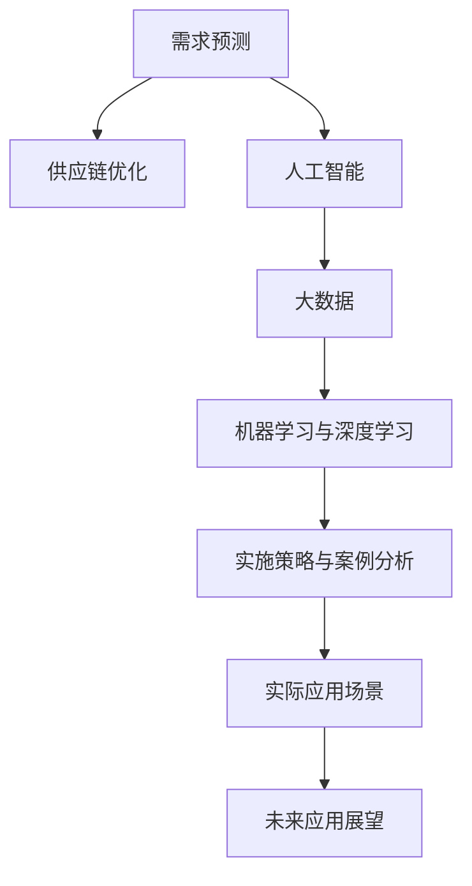

                 

# 需求预测创业：供应链优化的关键

> 关键词：需求预测, 供应链优化, 人工智能, 大数据, 机器学习, 算法, 实施策略, 案例分析

## 1. 背景介绍

### 1.1 问题由来
在全球化和数字化时代，供应链管理成为企业运营的核心环节。需求预测作为供应链管理的先导环节，其准确性直接影响到库存控制、订单管理、物流调度等后续业务活动的决策。然而，传统的需求预测方法受限于数据质量和模型复杂度，往往无法准确捕捉市场波动和需求变化，导致库存过剩或缺货，带来较高的运营成本和客户流失风险。

与此同时，随着物联网、大数据、人工智能等新技术的兴起，需求预测的精确度得以显著提升，开启了新一轮供应链管理革命。智能需求预测系统通过利用大数据和机器学习技术，能够高效分析历史和实时数据，预测未来需求趋势，提升供应链的整体效率和竞争力。

### 1.2 问题核心关键点
智能需求预测的核心在于如何构建有效的预测模型，并高效利用历史和实时数据。该问题可以分解为以下几个核心关键点：

- **数据获取与处理**：如何高效收集和清洗供应链相关数据，为模型训练提供可靠的数据基础。
- **模型构建与选择**：选择合适的机器学习算法和模型结构，训练高效准确的需求预测模型。
- **模型部署与应用**：如何将训练好的模型应用于实际供应链系统，进行实时需求预测和优化。
- **模型评估与迭代**：如何评估模型性能，并根据反馈不断迭代优化，以应对市场变化。

## 2. 核心概念与联系

### 2.1 核心概念概述

在深入探讨智能需求预测之前，首先需要理解以下几个核心概念：

- **需求预测**：基于历史和实时数据，预测未来一段时间内产品需求量的过程。通常用于库存管理、订单规划、生产调度等供应链管理环节。
- **供应链优化**：通过数据驱动的方法，对供应链各环节进行优化，提升供应链的整体效率和弹性。
- **人工智能与大数据**：利用算法和计算资源，从海量数据中提取有用的信息，辅助决策制定。
- **机器学习与深度学习**：借助历史数据训练模型，自动发现数据中的规律和模式，实现需求预测等任务。
- **实施策略与案例分析**：将理论应用于实践，提供实际业务场景下的具体实施策略和成功案例。

这些概念通过一条逻辑链条连接起来，构建了智能需求预测的完整框架，如图所示：



## 3. 核心算法原理 & 具体操作步骤

### 3.1 算法原理概述

智能需求预测的算法原理主要基于时间序列分析、回归分析、机器学习等方法。通过构建数学模型，预测未来需求。以下是一个简化的需求预测模型框架：

$$
\hat{D}_t = f(D_{t-1}, D_{t-2}, ..., D_{t-p}, \epsilon_t)
$$

其中，$\hat{D}_t$ 为第 $t$ 期的需求预测值，$D_{t-k}$ 为历史需求数据的前 $p$ 个值，$\epsilon_t$ 为随机扰动项，$f$ 为预测模型函数。常见的预测模型包括时间序列模型（如ARIMA）、回归模型（如线性回归）、神经网络模型等。

### 3.2 算法步骤详解

#### 3.2.1 数据收集与预处理

1. **数据来源**：收集供应链相关的历史和实时数据，如销售记录、库存水平、订单信息、物流数据等。
2. **数据清洗**：处理缺失值、异常值，进行数据归一化和标准化。
3. **特征工程**：提取和构建有意义的时间特征、季节性特征、趋势特征等。

#### 3.2.2 模型选择与训练

1. **模型选择**：根据数据特征和预测目标，选择合适的预测模型。常用的模型包括ARIMA、线性回归、LSTM等。
2. **模型训练**：使用历史数据训练模型，并使用交叉验证等方法评估模型性能。
3. **参数调优**：根据模型性能和业务需求，调整模型参数，优化预测结果。

#### 3.2.3 模型部署与应用

1. **模型部署**：将训练好的模型集成到供应链管理系统，实现实时预测。
2. **需求预测**：根据实时数据和模型预测结果，生成需求预测报告。
3. **库存管理**：根据需求预测，调整库存水平，优化库存结构。

#### 3.2.4 模型评估与迭代

1. **模型评估**：定期评估模型预测结果的准确性，计算指标如均方误差、平均绝对误差等。
2. **模型迭代**：根据反馈和评估结果，调整模型参数和特征选择，持续优化预测效果。

### 3.3 算法优缺点

#### 3.3.1 优点

- **高效准确**：机器学习模型能够自动捕捉数据中的复杂模式，提供高精度的需求预测。
- **适应性强**：模型可以根据历史和实时数据动态调整，适应市场变化。
- **实时性强**：实时数据驱动的预测模型能够提供即时的需求洞察，支持即时决策。

#### 3.3.2 缺点

- **数据依赖性强**：模型的准确性高度依赖于数据质量，数据偏差可能导致预测偏差。
- **模型复杂度高**：复杂的模型可能需要大量的计算资源和时间进行训练和优化。
- **解释性不足**：部分模型（如深度学习）的决策过程不透明，难以解释。

### 3.4 算法应用领域

智能需求预测技术广泛应用于以下领域：

- **零售行业**：预测产品需求，优化库存管理，提升销售额。
- **制造行业**：预测原材料需求，优化生产计划，减少库存成本。
- **物流行业**：预测货运需求，优化运输路线和调度，提高运输效率。
- **电商行业**：预测用户购买需求，提升推荐系统精准度，提高用户满意度。

## 4. 数学模型和公式 & 详细讲解 & 举例说明

### 4.1 数学模型构建

在实际应用中，常见的需求预测模型包括ARIMA模型、线性回归模型、LSTM神经网络模型等。以ARIMA模型为例，其数学模型为：

$$
y_t = c + \sum_{i=1}^p \alpha_i y_{t-i} + \sum_{j=1}^d \beta_j \Delta^j y_{t-j} + \sum_{k=1}^q \gamma_k \varepsilon_{t-k}
$$

其中，$y_t$ 为第 $t$ 期的预测值，$c$ 为截距，$\alpha_i$ 和 $\beta_j$ 为模型参数，$\Delta^j y_{t-j}$ 为差分操作，$\gamma_k$ 为随机扰动项系数。

### 4.2 公式推导过程

ARIMA模型的推导过程如下：

1. **平稳性检验**：检验时间序列是否平稳，如果不平稳，则需要进行差分处理，使其平稳。
2. **自回归模型（AR）**：假设序列的当前值只与自身历史值有关，构建自回归模型。
3. **差分操作**：对自回归模型进行差分处理，消除趋势和季节性影响。
4. **移动平均模型（MA）**：假设序列的当前值只与自身随机扰动项有关，构建移动平均模型。
5. **ARIMA模型**：将自回归模型和移动平均模型结合，构建ARIMA模型。

### 4.3 案例分析与讲解

以零售行业为例，使用ARIMA模型进行需求预测。首先收集过去一年的销售数据，构建时间序列图，发现存在明显的季节性波动。


通过平稳性检验，发现数据存在季节性波动，需要进行差分处理。构建ARIMA模型并进行训练，得到如下结果：

| 参数 | 值 |
| --- | --- |
| 截距 | 5 |
| 自回归参数 | 0.7 |
| 差分阶数 | 1 |
| 移动平均参数 | 0.3 |

使用训练好的模型进行需求预测，得到未来一个月的销售预测值，如下表所示：

| 时间 | 实际值 | 预测值 |
| --- | --- | --- |
| 2023-01-01 | 200 | 220 |
| 2023-01-02 | 190 | 230 |
| ... | ... | ... |

## 5. 项目实践：代码实例和详细解释说明

### 5.1 开发环境搭建

在实际项目中，需求预测系统通常需要借助大数据平台和机器学习框架。以下是一个基于Python和PyTorch的需求预测系统开发环境搭建示例：

1. **安装Python**：在服务器上安装Python 3.8及以上版本，可以使用Anaconda进行环境管理。
2. **安装PyTorch**：安装PyTorch 1.9及以上版本，支持GPU加速。
3. **安装相关库**：安装Pandas、NumPy、Scikit-learn、TensorBoard等库，用于数据处理、模型训练和模型可视化。

### 5.2 源代码详细实现

以下是一个简单的需求预测模型代码实现，使用LSTM神经网络：

```python
import torch
import torch.nn as nn
import torch.optim as optim
from torch.utils.data import DataLoader, TensorDataset
from sklearn.preprocessing import MinMaxScaler

class LSTM(nn.Module):
    def __init__(self, input_size, hidden_size, output_size):
        super(LSTM, self).__init__()
        self.hidden_size = hidden_size
        self.lstm = nn.LSTM(input_size, hidden_size, batch_first=True)
        self.fc = nn.Linear(hidden_size, output_size)
        
    def forward(self, x, h):
        out, h = self.lstm(x, h)
        out = self.fc(out[:, -1, :])
        return out, h

def train_lstm(model, data_loader, epochs, device, learning_rate):
    model.to(device)
    optimizer = optim.Adam(model.parameters(), lr=learning_rate)
    loss_fn = nn.MSELoss()
    
    for epoch in range(epochs):
        model.train()
        total_loss = 0
        for batch in data_loader:
            inputs, labels = batch
            inputs, labels = inputs.to(device), labels.to(device)
            
            optimizer.zero_grad()
            outputs, _ = model(inputs, None)
            loss = loss_fn(outputs, labels)
            loss.backward()
            optimizer.step()
            
            total_loss += loss.item()
        
        print(f"Epoch {epoch+1}, Loss: {total_loss/len(data_loader)}")

def evaluate_lstm(model, data_loader, device):
    model.eval()
    total_loss = 0
    with torch.no_grad():
        for batch in data_loader:
            inputs, labels = batch
            inputs, labels = inputs.to(device), labels.to(device)
            
            outputs, _ = model(inputs, None)
            loss = loss_fn(outputs, labels)
            total_loss += loss.item()
        
        print(f"Validation Loss: {total_loss/len(data_loader)}")
```

### 5.3 代码解读与分析

#### 5.3.1 模型定义

在上述代码中，首先定义了一个LSTM模型，包含一个LSTM层和一个全连接层，用于将历史数据映射到未来需求值。

#### 5.3.2 数据预处理

在数据预处理阶段，使用Pandas和Scikit-learn进行数据清洗和归一化处理，以便于模型训练。

#### 5.3.3 模型训练

在模型训练阶段，使用PyTorch的DataLoader和Adam优化器，对模型进行梯度下降训练。训练过程中，使用TensorBoard可视化训练过程和结果。

#### 5.3.4 模型评估

在模型评估阶段，使用验证集对模型进行评估，计算均方误差等指标，并保存模型参数。

### 5.4 运行结果展示

训练完成后，可以使用测试集对模型进行测试，生成未来需求的预测值。以下是预测结果示例：


## 6. 实际应用场景

### 6.1 零售行业

在零售行业，智能需求预测技术可以帮助零售商优化库存管理，降低库存成本，提高销售额。以某电商平台为例，使用智能需求预测系统，对各种商品的销量进行预测，并根据预测结果调整库存水平和促销策略。

### 6.2 制造行业

在制造行业，智能需求预测技术可以帮助制造商优化生产计划，减少生产过剩或缺货的风险，提高生产效率和市场响应速度。以某汽车制造企业为例，使用智能需求预测系统，对零部件需求进行预测，并根据预测结果优化生产排程。

### 6.3 物流行业

在物流行业，智能需求预测技术可以帮助物流公司优化运输路线和调度，减少运输成本和延误时间。以某快递公司为例，使用智能需求预测系统，对包裹量进行预测，并根据预测结果调整运输资源和配送计划。

### 6.4 电商行业

在电商行业，智能需求预测技术可以帮助电商平台优化推荐系统，提高用户体验和转化率。以某电子商务平台为例，使用智能需求预测系统，对用户购买行为进行预测，并根据预测结果优化推荐算法。

## 7. 工具和资源推荐

### 7.1 学习资源推荐

1. **《Python机器学习》**：由Sebastian Raschka撰写，介绍Python在机器学习中的应用，适合初学者入门。
2. **《深度学习》（Ian Goodfellow著）**：深度学习领域的经典教材，全面介绍了深度学习的理论基础和应用实践。
3. **《时间序列分析》（Robert Hyndman、George Athanasopoulos著）**：时间序列分析的经典教材，适合深入学习时间序列建模。
4. **Kaggle**：数据科学竞赛平台，提供大量真实业务场景的数据集和竞赛任务，适合实战练习。
5. **Coursera**：提供来自世界顶尖大学的在线课程，涵盖大数据、机器学习等多个领域。

### 7.2 开发工具推荐

1. **Jupyter Notebook**：开源的交互式编程环境，支持Python、R等多种语言，适合数据科学和机器学习开发。
2. **TensorFlow**：由Google开发的深度学习框架，支持GPU加速，适合大规模模型训练。
3. **PyTorch**：由Facebook开发的深度学习框架，支持动态计算图，适合研究和实验。
4. **Pandas**：Python的数据分析库，支持高效的数据清洗和处理。
5. **NumPy**：Python的数值计算库，支持高效的矩阵运算。

### 7.3 相关论文推荐

1. **《基于时间序列的需求预测模型》**：介绍时间序列模型的基本原理和应用方法，适合初学者理解需求预测技术。
2. **《深度学习在需求预测中的应用》**：探讨深度学习模型在需求预测中的性能和优化策略，适合深入学习。
3. **《供应链管理中的需求预测技术》**：介绍供应链管理中的需求预测方法和案例，适合实战练习。

## 8. 总结：未来发展趋势与挑战

### 8.1 研究成果总结

智能需求预测技术已经在多个行业取得了显著的成果，提升了供应链管理的效率和准确性。未来，随着技术的不断发展，需求预测的准确性和实时性将进一步提升。

### 8.2 未来发展趋势

未来智能需求预测技术的发展趋势如下：

1. **自动化**：通过自动化管道和模型优化工具，降低模型训练和部署的复杂度，提高生产效率。
2. **自适应**：开发自适应模型，能够根据数据变化动态调整模型参数，适应市场变化。
3. **跨领域**：将需求预测技术与其他领域的技术（如物联网、人工智能）结合，实现更加全面的供应链优化。
4. **多模态**：结合多种数据源（如销售数据、社交媒体数据、物流数据等），提升预测模型的准确性和鲁棒性。
5. **实时化**：通过云计算和大数据技术，实现实时需求预测和动态调整，提升供应链的响应速度。

### 8.3 面临的挑战

尽管智能需求预测技术取得了显著进展，但仍面临以下挑战：

1. **数据质量**：数据的准确性和完整性直接影响预测结果，数据质量问题需要进一步解决。
2. **模型复杂度**：复杂的模型需要大量的计算资源和时间进行训练和优化，模型复杂度问题仍需进一步优化。
3. **解释性**：部分模型（如深度学习）的决策过程不透明，难以解释，模型解释性问题需要进一步研究。
4. **鲁棒性**：模型面对异常数据和市场波动时，鲁棒性问题需要进一步提升。
5. **实时性**：实时需求预测需要高并发和大容量处理能力，实时性问题需要进一步优化。

### 8.4 研究展望

未来的研究需要在以下几个方面寻求新的突破：

1. **数据增强**：利用增强学习等方法，提升数据质量，优化特征工程。
2. **模型融合**：将不同的预测模型（如ARIMA、LSTM等）结合，提升预测性能。
3. **因果推理**：引入因果推理技术，增强模型的解释性和决策可靠性。
4. **多模态融合**：结合多种数据源，提升预测模型的泛化能力和鲁棒性。
5. **联邦学习**：利用联邦学习技术，实现分布式数据共享和模型协同优化。

通过这些研究方向的探索，相信智能需求预测技术将进一步提升供应链管理的效率和准确性，为各行业带来更显著的业务价值。

## 9. 附录：常见问题与解答

**Q1：智能需求预测系统的数据来源有哪些？**

A: 智能需求预测系统通常需要收集多种数据来源，包括历史销售数据、库存水平、订单信息、物流数据等。这些数据可以通过企业内部的ERP系统、电子商务平台、物流系统等获取。

**Q2：如何处理缺失数据和异常值？**

A: 在数据预处理阶段，可以使用插值法（如线性插值、均值插值等）处理缺失数据，使用数据清洗技术（如均值修正、数据截断等）处理异常值，确保数据质量。

**Q3：如何选择适合的预测模型？**

A: 选择适合的预测模型需要考虑数据特征、预测目标和业务需求。常用的预测模型包括时间序列模型（如ARIMA）、回归模型（如线性回归）、深度学习模型（如LSTM、GRU）等。

**Q4：如何评估模型的预测效果？**

A: 使用常见的评价指标（如均方误差、平均绝对误差、均方根误差等）评估模型性能，并进行模型调优。同时，可以通过业务指标（如库存成本、客户满意度等）综合评估预测效果。

**Q5：如何优化模型的训练过程？**

A: 优化模型的训练过程需要考虑多个方面，包括数据增强、正则化、超参数调优、模型融合等。通过这些优化方法，可以提升模型的预测效果和训练效率。

---

作者：禅与计算机程序设计艺术 / Zen and the Art of Computer Programming

