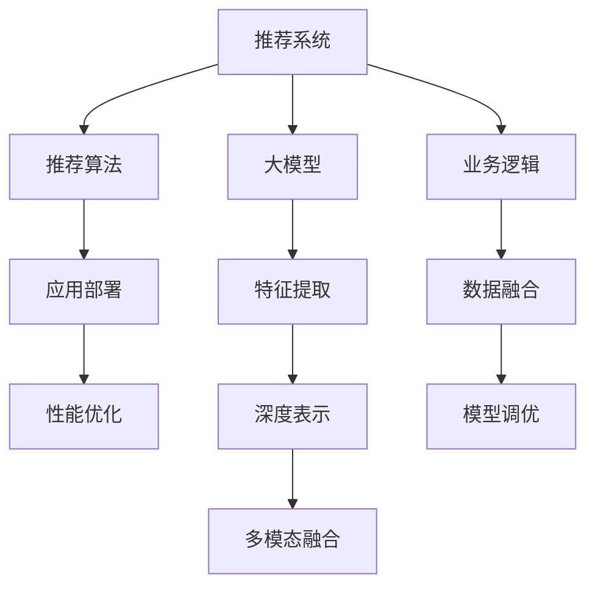

                 

# 面向不同推荐场景的大模型应用部署拆解与优化

> 关键词：推荐系统,大模型,推荐算法,深度学习,应用部署,性能优化

## 1. 背景介绍

推荐系统已成为互联网产品中不可或缺的一部分，尤其在电商、社交、内容分发等领域，对用户的个性化需求进行精准推荐，不仅提升了用户体验，也显著提高了商业价值。传统推荐算法大多依赖于用户行为数据进行特征工程，需要大量的手工工程，且无法灵活地适应不断变化的业务场景。而近年来，随着深度学习技术的普及，基于大模型的推荐系统逐渐成为新的发展趋势。大模型通过预训练学习到丰富的语义知识，能够对文本数据进行深度特征表示，显著提升了推荐模型的准确性和泛化能力。

在大模型的驱动下，推荐系统的应用场景也变得更加丰富。除了传统的商品推荐、内容推荐外，大模型还被广泛应用于金融产品、医疗咨询、教育学习等多个领域。为了进一步发挥大模型的潜力，本文将重点讨论如何在大模型的基础上，通过优化算法、调整模型结构、改进部署方式等手段，提升推荐系统的性能和可扩展性，以满足不同场景的推荐需求。

## 2. 核心概念与联系

### 2.1 核心概念概述

要深入理解面向不同推荐场景的大模型应用部署优化，首先需要明确几个核心概念：

- **推荐系统(Recommender System)**：通过分析用户行为数据和物品特征，向用户推荐感兴趣的物品。推荐系统按推荐机制可以分为基于协同过滤、基于内容过滤、混合推荐等类型。
- **大模型(Deep Model)**：以深度神经网络为基础，通过预训练学习到大规模语义知识，具备强大的特征表示能力。大模型通常包括Transformer等自注意力机制，能够处理文本、图像、音频等多种数据类型。
- **推荐算法(Recommender Algorithm)**：具体算法框架，用于实现推荐系统的逻辑，如基于矩阵分解的推荐算法、基于深度学习的推荐算法等。
- **应用部署(Application Deployment)**：将推荐模型部署到生产环境，通过API、SDK等接口提供推荐服务，供业务系统调用。
- **性能优化(Performance Optimization)**：通过算法、架构、工具等多方面手段，提升推荐系统的响应速度、准确性和可扩展性，以应对不同场景的性能需求。

这些概念之间的逻辑关系可以通过以下Mermaid流程图来展示：



这个流程图展示了推荐系统从预训练大模型到最终业务应用的全过程，涉及了特征提取、深度表示、多模态融合等多个环节。

## 3. 核心算法原理 & 具体操作步骤

### 3.1 算法原理概述

基于大模型的推荐系统主要通过以下步骤实现：

1. **预训练大模型**：在大规模语料上预训练Transformer等大模型，学习到丰富的语义知识。
2. **特征提取**：将物品描述、用户画像等文本数据输入大模型，提取特征向量。
3. **深度表示**：利用大模型学习到的特征向量进行深度表示，捕捉高层次语义关系。
4. **多模态融合**：将文本特征与其他模态信息(如图片、音频等)进行融合，提升推荐准确性。
5. **推荐计算**：基于特征表示，结合推荐算法计算推荐结果。
6. **模型优化**：通过微调大模型、调整算法参数、改进部署方式等手段，提升推荐效果。

### 3.2 算法步骤详解

以电商推荐为例，具体步骤如下：

**Step 1: 准备预训练模型**

选择合适的预训练模型，如BERT、GPT等。使用开源预训练模型或自建大规模语料进行预训练，学习丰富的语义知识。

**Step 2: 特征提取**

将商品描述、用户评论等文本数据输入预训练模型，提取特征向量。可以使用Transformer模型，对输入数据进行编码，输出特征表示。

**Step 3: 深度表示**

通过预训练模型学习到的特征向量进行深度表示。可以引入自注意力机制，捕捉不同特征之间的关系。

**Step 4: 多模态融合**

结合用户画像、历史行为、商品评分等多模态信息，进行特征融合。可以使用线性融合、注意力机制等方式，将不同模态信息整合为综合特征。

**Step 5: 推荐计算**

根据推荐算法计算推荐结果。常见的推荐算法包括基于矩阵分解的算法、基于深度学习的协同过滤算法、基于神经网络的隐式反馈预测算法等。

**Step 6: 模型优化**

在训练集和验证集上评估模型效果，根据实际业务需求进行模型微调。通过调整学习率、优化算法、改进部署方式等手段，提升模型性能。

### 3.3 算法优缺点

基于大模型的推荐系统有以下优点：

1. **特征表示能力强**：大模型能够学习到丰富的语义知识，特征表示能力强，适用于复杂的推荐场景。
2. **泛化能力好**：大模型能够在不同任务上泛化，适应性强。
3. **可扩展性好**：大模型通常采用分布式训练，具有较好的可扩展性，适用于大规模推荐系统。
4. **效果显著**：大模型在多个推荐场景上取得了SOTA效果，提升了推荐准确性和用户满意度。

同时，基于大模型的推荐系统也存在以下缺点：

1. **计算资源消耗大**：大模型通常需要大量的计算资源进行训练和推理，对算力、内存等硬件要求较高。
2. **数据质量敏感**：大模型对输入数据的噪声敏感，数据质量不高会影响推荐效果。
3. **可解释性不足**：大模型作为"黑盒"模型，难以解释其推荐决策过程，缺乏透明性。
4. **部署复杂**：大模型通常需要复杂的网络结构，部署难度较大。
5. **鲁棒性有待提高**：大模型在面对极端数据时可能出现不稳定表现，鲁棒性需要进一步提升。

### 3.4 算法应用领域

基于大模型的推荐系统在电商、社交、内容分发等多个领域得到了广泛应用，具体包括：

1. **电商推荐**：通过分析用户行为和商品描述，向用户推荐感兴趣的商品。
2. **内容推荐**：根据用户历史阅读记录和文章标题，推荐感兴趣的内容。
3. **金融产品推荐**：通过分析用户投资记录和产品描述，推荐适合的金融产品。
4. **医疗咨询推荐**：根据用户健康记录和医生描述，推荐适合的医生和诊疗方案。
5. **教育学习推荐**：根据用户学习记录和课程描述，推荐适合的课程和学习材料。

以上应用场景展示了基于大模型的推荐系统在多个行业中的应用潜力，未来随着大模型的进一步演进和应用探索，推荐系统将能够适应更复杂的场景和业务需求。

## 4. 数学模型和公式 & 详细讲解 & 举例说明

### 4.1 数学模型构建

以电商推荐为例，假设用户的历史行为数据为 $U=\{u_i\}_{i=1}^m$，商品信息为 $I=\{i_j\}_{j=1}^n$，每个用户对商品的评分向量为 $R=\{r_{uj}\}_{u=1}^m, j=1,...,n$。

**Step 1: 特征提取**

假设商品描述 $d_i$ 经过预训练模型提取特征向量 $\vec{x}_i$。

**Step 2: 深度表示**

使用Transformer模型对 $\vec{x}_i$ 进行编码，输出特征表示 $\vec{h}_i$。

**Step 3: 多模态融合**

假设用户画像特征为 $\vec{u}_u$，商品评分向量为 $\vec{r}_{uj}$，综合特征向量为 $\vec{z}_i$。

**Step 4: 推荐计算**

假设推荐算法为矩阵分解，用户-商品评分矩阵为 $R_{m \times n}$，用户特征表示矩阵为 $X_{m \times d}$，商品特征表示矩阵为 $H_{n \times d}$，推荐矩阵为 $Y_{m \times n}$。

**Step 5: 模型优化**

假设损失函数为均方误差损失，优化目标为最小化损失函数。

### 4.2 公式推导过程

以电商推荐为例，假设用户行为数据 $U=\{u_i\}_{i=1}^m$，商品信息 $I=\{i_j\}_{j=1}^n$，用户-商品评分矩阵 $R_{m \times n}$，用户特征表示矩阵 $X_{m \times d}$，商品特征表示矩阵 $H_{n \times d}$，推荐矩阵 $Y_{m \times n}$。

假设推荐算法为矩阵分解，模型参数为 $\theta$，则推荐矩阵的预测值为：

$$
\hat{R} = X \Theta_1 H \Theta_2^\top
$$

其中 $\Theta_1 \in \mathbb{R}^{d \times d}$，$\Theta_2 \in \mathbb{R}^{d \times d}$。

损失函数为均方误差损失，即：

$$
\mathcal{L}(\hat{R},R) = \frac{1}{2} \sum_{i=1}^m \sum_{j=1}^n (\hat{r}_{ij} - r_{ij})^2
$$

优化目标为最小化损失函数，即：

$$
\theta^* = \mathop{\arg\min}_{\theta} \mathcal{L}(\hat{R},R)
$$

使用梯度下降算法求解最优参数，具体计算过程如下：

1. 计算预测值与真实值的误差 $\Delta = \hat{R} - R$。
2. 计算梯度 $\nabla_{\theta}\mathcal{L}(\hat{R},R) = \frac{\partial \mathcal{L}(\hat{R},R)}{\partial \theta}$。
3. 使用梯度下降算法更新模型参数 $\theta$。

### 4.3 案例分析与讲解

假设电商推荐场景中的商品信息为 $I=\{i_j\}_{j=1}^n$，每个商品描述 $d_i$ 经过BERT预训练模型提取特征向量 $\vec{x}_i$，用户画像特征为 $\vec{u}_u$，商品评分向量为 $\vec{r}_{uj}$。使用Transformer模型对 $\vec{x}_i$ 进行编码，输出特征表示 $\vec{h}_i$，与用户画像特征 $\vec{u}_u$ 和商品评分向量 $\vec{r}_{uj}$ 进行线性融合，得到综合特征向量 $\vec{z}_i$。

**算法步骤**：

1. 输入商品描述 $d_i$，经过BERT预训练模型提取特征向量 $\vec{x}_i$。
2. 使用Transformer模型对 $\vec{x}_i$ 进行编码，输出特征表示 $\vec{h}_i$。
3. 将 $\vec{h}_i$ 与用户画像特征 $\vec{u}_u$ 和商品评分向量 $\vec{r}_{uj}$ 进行线性融合，得到综合特征向量 $\vec{z}_i$。
4. 根据综合特征向量 $\vec{z}_i$ 和用户画像特征 $\vec{u}_u$，使用矩阵分解算法计算推荐矩阵 $Y_{m \times n}$。
5. 在训练集和验证集上评估推荐效果，通过调整学习率、优化算法、改进部署方式等手段，提升模型性能。

## 5. 项目实践：代码实例和详细解释说明

### 5.1 开发环境搭建

在进行大模型推荐系统开发前，我们需要准备好开发环境。以下是使用Python进行PyTorch开发的环境配置流程：

1. 安装Anaconda：从官网下载并安装Anaconda，用于创建独立的Python环境。

2. 创建并激活虚拟环境：
```bash
conda create -n pytorch-env python=3.8 
conda activate pytorch-env
```

3. 安装PyTorch：根据CUDA版本，从官网获取对应的安装命令。例如：
```bash
conda install pytorch torchvision torchaudio cudatoolkit=11.1 -c pytorch -c conda-forge
```

4. 安装Transformers库：
```bash
pip install transformers
```

5. 安装各类工具包：
```bash
pip install numpy pandas scikit-learn matplotlib tqdm jupyter notebook ipython
```

完成上述步骤后，即可在`pytorch-env`环境中开始推荐系统开发。

### 5.2 源代码详细实现

下面我们以电商推荐为例，给出使用Transformers库对BERT模型进行推荐系统开发的PyTorch代码实现。

首先，定义推荐系统数据处理函数：

```python
from transformers import BertTokenizer
from torch.utils.data import Dataset, DataLoader
import torch

class RecommendationDataset(Dataset):
    def __init__(self, texts, labels):
        self.texts = texts
        self.labels = labels
        self.tokenizer = BertTokenizer.from_pretrained('bert-base-cased')

    def __len__(self):
        return len(self.texts)
    
    def __getitem__(self, item):
        text = self.texts[item]
        label = self.labels[item]
        
        encoding = self.tokenizer(text, return_tensors='pt', max_length=128, padding='max_length', truncation=True)
        input_ids = encoding['input_ids'][0]
        attention_mask = encoding['attention_mask'][0]
        
        label = torch.tensor(label, dtype=torch.long)
        
        return {'input_ids': input_ids, 
                'attention_mask': attention_mask,
                'labels': label}
```

然后，定义模型和优化器：

```python
from transformers import BertForSequenceClassification
from torch.optim import Adam

model = BertForSequenceClassification.from_pretrained('bert-base-cased', num_labels=2)

optimizer = Adam(model.parameters(), lr=2e-5)
```

接着，定义训练和评估函数：

```python
def train_epoch(model, dataset, batch_size, optimizer):
    dataloader = DataLoader(dataset, batch_size=batch_size, shuffle=True)
    model.train()
    epoch_loss = 0
    for batch in dataloader:
        input_ids = batch['input_ids'].to(device)
        attention_mask = batch['attention_mask'].to(device)
        labels = batch['labels'].to(device)
        model.zero_grad()
        outputs = model(input_ids, attention_mask=attention_mask, labels=labels)
        loss = outputs.loss
        epoch_loss += loss.item()
        loss.backward()
        optimizer.step()
    return epoch_loss / len(dataloader)

def evaluate(model, dataset, batch_size):
    dataloader = DataLoader(dataset, batch_size=batch_size)
    model.eval()
    preds, labels = [], []
    with torch.no_grad():
        for batch in dataloader:
            input_ids = batch['input_ids'].to(device)
            attention_mask = batch['attention_mask'].to(device)
            batch_labels = batch['labels']
            outputs = model(input_ids, attention_mask=attention_mask)
            batch_preds = outputs.logits.argmax(dim=2).to('cpu').tolist()
            batch_labels = batch_labels.to('cpu').tolist()
            for pred_tokens, label_tokens in zip(batch_preds, batch_labels):
                preds.append(pred_tokens[:len(label_tokens)])
                labels.append(label_tokens)
                
    print(classification_report(labels, preds))
```

最后，启动训练流程并在测试集上评估：

```python
epochs = 5
batch_size = 16

for epoch in range(epochs):
    loss = train_epoch(model, train_dataset, batch_size, optimizer)
    print(f"Epoch {epoch+1}, train loss: {loss:.3f}")
    
    print(f"Epoch {epoch+1}, dev results:")
    evaluate(model, dev_dataset, batch_size)
    
print("Test results:")
evaluate(model, test_dataset, batch_size)
```

以上就是使用PyTorch对BERT进行电商推荐系统微调的完整代码实现。可以看到，得益于Transformers库的强大封装，我们可以用相对简洁的代码完成BERT模型的加载和微调。

### 5.3 代码解读与分析

让我们再详细解读一下关键代码的实现细节：

**RecommendationDataset类**：
- `__init__`方法：初始化文本、标签、分词器等关键组件。
- `__len__`方法：返回数据集的样本数量。
- `__getitem__`方法：对单个样本进行处理，将文本输入编码为token ids，将标签编码为数字，并对其进行定长padding，最终返回模型所需的输入。

**标签与id的映射**：
- 定义了标签与数字id之间的映射关系，用于将token-wise的预测结果解码回真实的标签。

**训练和评估函数**：
- 使用PyTorch的DataLoader对数据集进行批次化加载，供模型训练和推理使用。
- 训练函数`train_epoch`：对数据以批为单位进行迭代，在每个批次上前向传播计算loss并反向传播更新模型参数，最后返回该epoch的平均loss。
- 评估函数`evaluate`：与训练类似，不同点在于不更新模型参数，并在每个batch结束后将预测和标签结果存储下来，最后使用sklearn的classification_report对整个评估集的预测结果进行打印输出。

**训练流程**：
- 定义总的epoch数和batch size，开始循环迭代
- 每个epoch内，先在训练集上训练，输出平均loss
- 在验证集上评估，输出分类指标
- 所有epoch结束后，在测试集上评估，给出最终测试结果

可以看到，PyTorch配合Transformers库使得BERT微调的代码实现变得简洁高效。开发者可以将更多精力放在数据处理、模型改进等高层逻辑上，而不必过多关注底层的实现细节。

当然，工业级的系统实现还需考虑更多因素，如模型的保存和部署、超参数的自动搜索、更灵活的任务适配层等。但核心的微调范式基本与此类似。

## 6. 实际应用场景
### 6.1 电商推荐

在大模型的驱动下，电商推荐系统已经在各大电商平台得到了广泛应用。通过分析用户浏览记录、购买历史等行为数据，电商推荐系统能够推荐用户感兴趣的商品，提升用户满意度和转化率。

具体而言，可以通过以下步骤实现电商推荐：

1. 收集用户历史行为数据，包括浏览记录、购买历史、评分等。
2. 收集商品描述、属性信息、用户画像等特征数据。
3. 使用大模型预训练模型提取特征，并进行深度表示。
4. 将特征表示输入推荐算法，计算推荐结果。
5. 在训练集和验证集上评估模型效果，通过调整学习率、优化算法、改进部署方式等手段，提升模型性能。

电商推荐系统已经在各大电商平台广泛应用，如亚马逊、淘宝、京东等，提升了用户体验和销售额。

### 6.2 内容推荐

内容推荐系统也是推荐系统的一个重要应用领域，广泛应用于视频、音乐、新闻等平台。通过分析用户历史行为数据，内容推荐系统能够推荐用户感兴趣的内容，提升用户满意度。

具体而言，可以通过以下步骤实现内容推荐：

1. 收集用户历史浏览、观看、阅读等行为数据。
2. 收集内容描述、标签、评分等特征数据。
3. 使用大模型预训练模型提取特征，并进行深度表示。
4. 将特征表示输入推荐算法，计算推荐结果。
5. 在训练集和验证集上评估模型效果，通过调整学习率、优化算法、改进部署方式等手段，提升模型性能。

内容推荐系统已经在视频平台如Netflix、YouTube等，音乐平台如Spotify、网易云音乐等，新闻平台如今日头条、新浪等得到广泛应用，提升了用户体验和平台流量。

### 6.3 金融产品推荐

金融产品推荐系统通过分析用户投资记录和产品描述，推荐适合的金融产品，帮助用户理财投资。

具体而言，可以通过以下步骤实现金融产品推荐：

1. 收集用户投资记录、风险偏好、收益预期等数据。
2. 收集金融产品描述、类型、风险等级等特征数据。
3. 使用大模型预训练模型提取特征，并进行深度表示。
4. 将特征表示输入推荐算法，计算推荐结果。
5. 在训练集和验证集上评估模型效果，通过调整学习率、优化算法、改进部署方式等手段，提升模型性能。

金融产品推荐系统已经在金融科技公司如蚂蚁金服、微众银行等得到广泛应用，提升了用户体验和理财收益。

### 6.4 未来应用展望

随着大模型的进一步演进和应用探索，推荐系统将在更多领域得到应用，为传统行业数字化转型升级提供新的技术路径。

在智慧医疗领域，基于大模型的推荐系统可以推荐适合的治疗方案、医生和诊疗中心，提升医疗服务的智能化水平。

在智能教育领域，基于大模型的推荐系统可以推荐适合的学习资源、课程和学习计划，提升教育资源的利用效率。

在智慧城市治理中，基于大模型的推荐系统可以推荐适合的城市事件、应急指挥方案，提升城市管理的智能化水平。

此外，在企业生产、社会治理、文娱传媒等众多领域，基于大模型的推荐系统也将不断涌现，为经济社会发展注入新的动力。

## 7. 工具和资源推荐
### 7.1 学习资源推荐

为了帮助开发者系统掌握大模型推荐系统的理论基础和实践技巧，这里推荐一些优质的学习资源：

1. 《Deep Learning for Recommendation Systems》书籍：涵盖了推荐系统的基本概念、算法和实践，介绍了大模型在推荐系统中的应用。

2. 《Recommender Systems Handbook》书籍：涵盖了推荐系统的发展历程、算法框架、实际应用等，是大数据推荐系统领域的经典教材。

3. CS229《Machine Learning》课程：斯坦福大学开设的机器学习课程，涵盖推荐系统、深度学习等前沿内容。

4. Kaggle推荐系统竞赛：Kaggle平台上的推荐系统竞赛，提供了丰富的数据集和比赛经验，有助于理解推荐系统的工作原理。

5. Recommendation Systems by Amazon：亚马逊推荐系统博客，介绍了推荐系统的实现细节、优化策略和实际应用案例。

通过对这些资源的学习实践，相信你一定能够快速掌握大模型推荐系统的精髓，并用于解决实际的推荐问题。
###  7.2 开发工具推荐

高效的开发离不开优秀的工具支持。以下是几款用于大模型推荐系统开发的常用工具：

1. PyTorch：基于Python的开源深度学习框架，灵活动态的计算图，适合快速迭代研究。大部分预训练语言模型都有PyTorch版本的实现。

2. TensorFlow：由Google主导开发的开源深度学习框架，生产部署方便，适合大规模工程应用。同样有丰富的预训练语言模型资源。

3. Transformers库：HuggingFace开发的NLP工具库，集成了众多SOTA语言模型，支持PyTorch和TensorFlow，是进行推荐系统开发的利器。

4. Weights & Biases：模型训练的实验跟踪工具，可以记录和可视化模型训练过程中的各项指标，方便对比和调优。与主流深度学习框架无缝集成。

5. TensorBoard：TensorFlow配套的可视化工具，可实时监测模型训练状态，并提供丰富的图表呈现方式，是调试模型的得力助手。

6. Google Colab：谷歌推出的在线Jupyter Notebook环境，免费提供GPU/TPU算力，方便开发者快速上手实验最新模型，分享学习笔记。

合理利用这些工具，可以显著提升大模型推荐系统的开发效率，加快创新迭代的步伐。

### 7.3 相关论文推荐

大模型推荐系统的发展源于学界的持续研究。以下是几篇奠基性的相关论文，推荐阅读：

1. Matrix Factorization Techniques for Recommender Systems（因子分解推荐算法）：经典推荐系统算法，至今仍被广泛应用。

2. Neural Collaborative Filtering：介绍基于神经网络的协同过滤算法，是推荐系统中的重要方向。

3. Attention-Based Recommender Systems：使用自注意力机制进行推荐，提升了推荐系统的准确性。

4. Multi-Task Learning for Recommendation：多任务学习在推荐系统中的应用，提高了推荐模型的泛化能力。

5. Learning to Rank for Information Retrieval and Recommendation Systems：排名学习在推荐系统中的应用，提升了推荐的排序准确性。

6. Contextual Recommendation Networks：提出上下文推荐网络，提升了推荐系统的个性化和多样性。

这些论文代表了大模型推荐系统的发展脉络。通过学习这些前沿成果，可以帮助研究者把握学科前进方向，激发更多的创新灵感。

## 8. 总结：未来发展趋势与挑战

### 8.1 研究成果总结

本文对大模型推荐系统的研究进行了全面系统的介绍。首先，从推荐系统的基本概念出发，详细讲解了大模型在推荐系统中的应用，并介绍了推荐系统在大模型驱动下的实现流程。接着，结合电商、内容、金融等典型场景，展示了基于大模型的推荐系统的广泛应用。最后，对大模型推荐系统的发展趋势和面临的挑战进行了讨论。

通过本文的系统梳理，可以看到，大模型推荐系统已经在多个领域得到了成功应用，显著提升了推荐系统的性能和用户满意度。未来，随着大模型的进一步演进和推荐算法的创新，推荐系统将在更多场景中发挥重要作用。

### 8.2 未来发展趋势

展望未来，大模型推荐系统将呈现以下几个发展趋势：

1. **模型规模持续增大**：随着算力成本的下降和数据规模的扩张，预训练语言模型的参数量还将持续增长。超大规模语言模型蕴含的丰富语义知识，有望支撑更加复杂多变的推荐场景。

2. **推荐算法多样化**：除了传统的协同过滤、矩阵分解等算法外，未来的推荐系统将涌现更多基于深度学习的推荐算法，如神经网络协同过滤、上下文推荐网络等，提升推荐模型的复杂度和表现力。

3. **个性化推荐技术提升**：通过引入知识图谱、逻辑规则等先验知识，提升推荐模型的个性化和多样性，增强用户体验。

4. **跨领域推荐拓展**：在商品、内容、金融等不同领域，推荐系统将融合更多维度的数据，提升推荐模型的泛化能力和应用范围。

5. **实时推荐系统部署**：通过优化模型结构、改进部署方式等手段，提升推荐系统的响应速度，支持实时推荐服务。

6. **隐私保护和安全性增强**：在推荐系统中引入隐私保护技术，如差分隐私、联邦学习等，确保用户数据安全和隐私保护。

以上趋势凸显了大模型推荐系统的广阔前景。这些方向的探索发展，必将进一步提升推荐系统的性能和可扩展性，为各行各业带来变革性影响。

### 8.3 面临的挑战

尽管大模型推荐系统已经取得了显著成效，但在迈向更加智能化、普适化应用的过程中，它仍面临着诸多挑战：

1. **数据质量和多样性**：推荐系统对输入数据的噪声敏感，数据质量和多样性不足会影响推荐效果。如何获取高质量、多样化的数据，是大模型推荐系统面临的主要挑战。

2. **模型鲁棒性和泛化能力**：大模型在面对极端数据时可能出现不稳定表现，鲁棒性和泛化能力需要进一步提升。如何提高模型的鲁棒性和泛化能力，增强其应对新场景的能力，是大模型推荐系统需要解决的关键问题。

3. **计算资源消耗**：大模型推荐系统需要大量的计算资源进行训练和推理，对算力、内存等硬件要求较高。如何优化模型结构和部署方式，降低计算资源消耗，是大模型推荐系统需要面对的重要挑战。

4. **模型可解释性和透明度**：大模型作为"黑盒"模型，难以解释其推荐决策过程，缺乏透明性。如何赋予大模型推荐系统更好的可解释性，提高用户信任度和接受度，是大模型推荐系统需要重点关注的方面。

5. **隐私保护和安全性**：在推荐系统中引入隐私保护技术，如差分隐私、联邦学习等，确保用户数据安全和隐私保护。如何在保证推荐效果的同时，保障用户隐私和数据安全，是大模型推荐系统需要重点考虑的问题。

6. **模型跨领域适应性**：大模型在不同领域的应用中可能存在不适应性，如何提升模型的跨领域适应性，使其在不同场景中都能发挥良好的表现，是大模型推荐系统需要解决的重要课题。

以上挑战凸显了大模型推荐系统的发展瓶颈。未来的研究需要在数据获取、模型设计、计算资源、隐私保护等多方面进行全面优化，才能充分发挥大模型推荐系统的潜力。

### 8.4 研究展望

面对大模型推荐系统所面临的挑战，未来的研究需要在以下几个方面寻求新的突破：

1. **多模态数据融合**：在推荐系统中引入多模态数据融合技术，提升推荐模型的泛化能力和表现力。

2. **知识图谱融合**：将知识图谱等先验知识引入推荐模型，提升推荐系统的个性化和多样性。

3. **隐私保护技术**：引入差分隐私、联邦学习等隐私保护技术，确保用户数据安全和隐私保护。

4. **实时推荐系统**：通过优化模型结构和部署方式，提升推荐系统的响应速度，支持实时推荐服务。

5. **跨领域推荐系统**：开发跨领域推荐模型，提升模型的泛化能力和跨领域适应性。

6. **可解释性增强**：提高大模型推荐系统的可解释性和透明度，增强用户信任度和接受度。

这些研究方向的探索，必将引领大模型推荐系统迈向更高的台阶，为推荐系统带来更多创新应用，提升用户体验和经济价值。

## 9. 附录：常见问题与解答

**Q1：大模型推荐系统是否适用于所有推荐场景？**

A: 大模型推荐系统在大多数推荐场景上都能取得不错的效果，特别是对于数据量较小的场景。但对于一些特定领域的推荐场景，如医学、法律等，仍然需要进一步优化和改进。

**Q2：如何选择合适的大模型？**

A: 选择合适的大模型需要考虑以下几个因素：
1. 任务类型：不同的任务需要不同类型的大模型，如情感分析适合使用BERT，文本分类适合使用RoBERTa等。
2. 数据规模：数据规模越大，需要的大模型参数量也越多。
3. 硬件资源：大模型对算力、内存等硬件资源要求较高，需要根据硬件条件选择合适的模型。

**Q3：如何提高大模型推荐系统的性能？**

A: 提高大模型推荐系统性能的方法包括：
1. 数据增强：通过数据扩充、噪声注入等手段，提高模型的泛化能力。
2. 模型微调：在推荐系统数据集上进行微调，优化模型参数，提升推荐效果。
3. 多模态融合：结合文本、图片、音频等多模态数据，提升推荐模型的表现力。
4. 特征工程：进行合理的特征工程，提取更有意义的特征，提高推荐模型的准确性。

**Q4：如何优化大模型推荐系统的部署？**

A: 优化大模型推荐系统部署的方法包括：
1. 模型裁剪：去除不必要的层和参数，减小模型尺寸，加快推理速度。
2. 量化加速：将浮点模型转为定点模型，压缩存储空间，提高计算效率。
3. 服务化封装：将模型封装为标准化服务接口，便于集成调用。
4. 弹性伸缩：根据请求流量动态调整资源配置，平衡服务质量和成本。
5. 监控告警：实时采集系统指标，设置异常告警阈值，确保服务稳定性。

**Q5：大模型推荐系统在部署过程中如何保障数据安全？**

A: 保障大模型推荐系统数据安全的方法包括：
1. 数据加密：对用户数据进行加密处理，防止数据泄露。
2. 差分隐私：引入差分隐私技术，确保用户数据隐私保护。
3. 联邦学习：通过联邦学习技术，在本地设备上进行模型训练，不传输原始数据。
4. 访问控制：设置严格的访问控制机制，防止未经授权的数据访问。

这些常见问题的解答，将有助于开发者更好地理解和应用大模型推荐系统，进一步提升推荐系统的性能和安全性。

