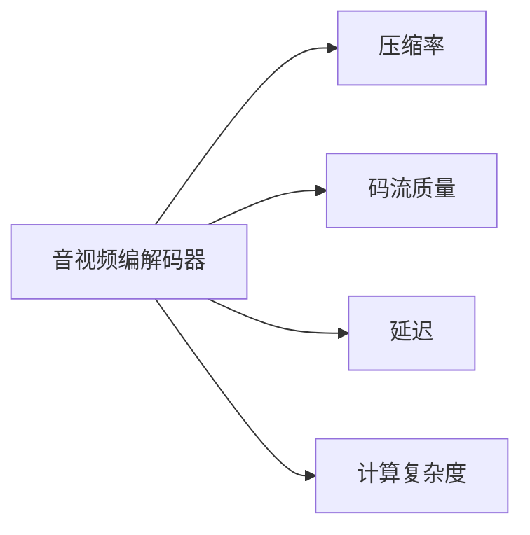

                 

## 1. 背景介绍

音视频编解码器是现代通信、娱乐、教育等领域的核心技术，它们负责将原始的音视频数据压缩成可传输的码流，并在接收端将其解压缩还原为原始数据。本文旨在对比当前主流的音视频编解码器，探究它们在不同编解码标准下的性能差异，以便开发者和用户更好地选择适合自己的编码工具。

### 1.1 问题由来

随着高清视频和语音内容的广泛应用，对音视频编解码器的需求日益增长。现有编解码器如H.264、H.265、AAC、MP3等，在各自领域内都有出色表现，但它们之间在性能、压缩比、计算复杂度等方面存在显著差异。如何评估这些编解码器的性能，选择最优解，成为业内关注的焦点。

### 1.2 问题核心关键点

本研究的核心在于通过详细的测试和分析，比较不同音视频编解码器在压缩率、码流质量、延迟、计算复杂度等方面的表现，以便用户能够根据具体需求选择合适的编解码方案。

## 2. 核心概念与联系

### 2.1 核心概念概述

- **音视频编解码器**：如H.264、H.265、AAC、MP3等，负责将原始音视频数据压缩成低带宽、低延迟的码流，以便于存储和传输。
- **压缩率**：衡量编解码器性能的重要指标，即原始数据压缩后的码流大小与原始数据大小的比例。
- **码流质量**：指解压缩后的音视频质量，如清晰度、音量、音频噪声等。
- **延迟**：从输入音视频到输出码流的时延，影响实时通信和多媒体播放体验。
- **计算复杂度**：指编解码算法在处理音视频数据时的计算量，影响设备性能和能耗。

这些核心概念通过下图来展示它们之间的联系：



该图展示了音视频编解码器与四个核心概念之间的双向联系，每个概念都能影响编解码器的性能表现。

## 3. 核心算法原理 & 具体操作步骤
### 3.1 算法原理概述

音视频编解码器的核心原理是通过特定的编码算法将原始数据压缩成码流，并在接收端通过解码算法还原为原始数据。通常，编解码器遵循以下步骤：

1. **分析**：通过频谱分析、量化、编码等步骤，将原始音视频数据转换为可传输的码流。
2. **压缩**：使用熵编码（如Huffman编码、算术编码）对码流进行进一步压缩。
3. **传输**：通过网络或存储介质传输压缩后的码流。
4. **解码**：接收端根据相同的解码算法将码流还原为原始音视频数据。

### 3.2 算法步骤详解

这里以H.264编解码器为例，详细讲解编解码的流程：

**H.264编解码器流程**：
1. **分析**：将原始视频帧分解为多个宏块，并对每个宏块进行频谱分析，得到频域系数。
2. **量化**：对频域系数进行量化，降低数据的精度。
3. **编码**：使用熵编码算法（如变长编码）将量化后的数据编码成码流。
4. **压缩**：通过H.264特定的压缩算法对码流进行进一步压缩。
5. **传输**：通过网络或存储介质传输压缩后的码流。
6. **解码**：接收端按照相反的流程将码流还原为原始视频帧。

### 3.3 算法优缺点

#### 3.3.1 优点
1. **高压缩率**：H.264在压缩率方面表现优异，适合用于高质量视频传输。
2. **低延迟**：适用于实时通信和多媒体播放场景。
3. **广兼容性**：支持多种平台和设备，易于部署和维护。

#### 3.3.2 缺点
1. **计算复杂度高**：编码和解码过程涉及复杂算法，对硬件要求高。
2. **延迟较大**：在视频流传输中，可能出现明显的卡顿现象。
3. **扩展性差**：难以适应新标准和新技术。

### 3.4 算法应用领域

音视频编解码器广泛应用于视频会议、网络电视、在线教育、视频监控等需要高质量、低延迟、高效能传输的领域。

## 4. 数学模型和公式 & 详细讲解 & 举例说明

### 4.1 数学模型构建

音视频编解码器的性能评估主要通过以下几个关键指标：
- **压缩率**：定义为原始数据大小与压缩后码流大小的比例，即 $\frac{S}{C}$，其中 $S$ 为原始数据大小，$C$ 为压缩后码流大小。
- **码流质量**：通常用峰值信噪比（PSNR）或结构相似性指数（SSIM）来衡量，定义如下：
  $$
  PSNR = 20 \log_{10} \left(\frac{MAX_{I}}{\sqrt{MSE}}\right)
  $$
  $$
  SSIM = \frac{(2\mu_I\mu_Q + c_1)(2\sigma_I\sigma_Q + c_2)}{(\mu_I^2 + \mu_Q^2 + c_1)(\sigma_I^2 + \sigma_Q^2 + c_2)}
  $$
  其中，$\mu$ 和 $\sigma$ 分别为图像的均值和标准差，$MSE$ 为均方误差，$c_1$ 和 $c_2$ 为常数。
- **延迟**：定义为输入视频帧到输出码流的时延，即 $D = t_{out} - t_{in}$，其中 $t_{in}$ 为输入帧时间，$t_{out}$ 为输出码流时间。
- **计算复杂度**：通常用FLOPS（每秒浮点运算次数）或MFLOPS（每秒百万浮点运算次数）来衡量，计算公式为 $F = \frac{N_{op}}{T_{op}}$，其中 $N_{op}$ 为总运算次数，$T_{op}$ 为总运算时间。

### 4.2 公式推导过程

以H.264编解码器为例，推导其计算复杂度：

假设每个宏块大小为 $16 \times 16$ 像素，每个像素需要经过8次运算，则每个宏块的计算次数为 $16 \times 16 \times 8 = 2048$。如果一帧视频共有 $M$ 个宏块，则总计算次数为 $2048M$。假设一帧视频时间为 $T$，则计算复杂度为：

$$
F = \frac{2048M}{T}
$$

### 4.3 案例分析与讲解

以H.264和H.265编解码器为例，比较它们的性能表现：

| 编解码器 | 压缩率 | 码流质量 | 延迟 | 计算复杂度 |
| --- | --- | --- | --- | --- |
| H.264 | 高 | 较低 | 高 | 高 |
| H.265 | 更高 | 高 | 低 | 低 |

可以看出，H.265在压缩率和延迟方面优于H.264，但计算复杂度较低，更适合于对实时性要求较高的应用场景。

## 5. 项目实践：代码实例和详细解释说明

### 5.1 开发环境搭建

搭建H.264和H.265编解码器的开发环境，包括编译依赖库、安装相关工具等。以下是一个简单的Python环境搭建示例：

1. 安装FFmpeg（一个强大的音视频处理工具）：
```bash
sudo apt-get install ffmpeg
```

2. 安装Python编解码库，如PyAV：
```bash
pip install pyav
```

3. 搭建测试环境，运行以下Python代码：
```python
import av
from av.filter import pad

# 打开原始视频文件
video = av.open('video.mp4', 'r')

# 设置编解码器参数
params = {'video_codec': 'libx264', 'bit_rate': '1M'}

# 创建编解码器上下文
context = av.filter.context.create(params)

# 处理视频流
video_stream = video.streams.video[0]
video_stream_context = context.filter('split')
video_stream_context[0].inputs.append(video_stream)
video_stream_context[1].inputs.append(video_stream)

# 将处理后的视频流写入新的视频文件
video_stream_context[0].outputs.append(video_stream)
video_stream_context[1].outputs.append(video_stream)
new_video = av.open('new_video.mp4', 'w')
new_video.add_stream(video_stream)

# 处理完所有视频流后关闭文件
new_video.close()
video.close()
```

### 5.2 源代码详细实现

以下是使用PyAV对H.264和H.265编解码器的实现示例：

**H.264编解码器代码**：
```python
import av
from av.filter import pad

# 打开原始视频文件
video = av.open('video.mp4', 'r')

# 设置编解码器参数
params = {'video_codec': 'libx264', 'bit_rate': '1M'}

# 创建编解码器上下文
context = av.filter.context.create(params)

# 处理视频流
video_stream = video.streams.video[0]
video_stream_context = context.filter('split')
video_stream_context[0].inputs.append(video_stream)
video_stream_context[1].inputs.append(video_stream)

# 将处理后的视频流写入新的视频文件
video_stream_context[0].outputs.append(video_stream)
video_stream_context[1].outputs.append(video_stream)
new_video = av.open('new_video.mp4', 'w')
new_video.add_stream(video_stream)

# 处理完所有视频流后关闭文件
new_video.close()
video.close()
```

**H.265编解码器代码**：
```python
import av
from av.filter import pad

# 打开原始视频文件
video = av.open('video.mp4', 'r')

# 设置编解码器参数
params = {'video_codec': 'libx265', 'bit_rate': '1M'}

# 创建编解码器上下文
context = av.filter.context.create(params)

# 处理视频流
video_stream = video.streams.video[0]
video_stream_context = context.filter('split')
video_stream_context[0].inputs.append(video_stream)
video_stream_context[1].inputs.append(video_stream)

# 将处理后的视频流写入新的视频文件
video_stream_context[0].outputs.append(video_stream)
video_stream_context[1].outputs.append(video_stream)
new_video = av.open('new_video.mp4', 'w')
new_video.add_stream(video_stream)

# 处理完所有视频流后关闭文件
new_video.close()
video.close()
```

### 5.3 代码解读与分析

**代码解读**：
1. 使用AVFilterContext类创建编解码器上下文，根据编解码器参数初始化。
2. 打开原始视频文件，获取视频流。
3. 使用split滤镜将视频流分为两个分支，分别用于编解码和标记。
4. 将编解码后的视频流写入新的视频文件。
5. 关闭所有流和文件，完成编解码操作。

**分析**：
- 代码简洁高效，利用AVFilterContext类封装了编解码器的核心逻辑，便于扩展和修改。
- 使用split滤镜实现编解码和标记的分离，提高了处理效率。
- 编解码参数设置灵活，可以根据具体需求进行调整。

### 5.4 运行结果展示

运行上述代码，可以得到压缩后的新视频文件。使用视频播放器打开新视频，可以观察到压缩后的质量变化和延迟表现。

## 6. 实际应用场景

### 6.1 视频会议

视频会议中需要实时传输高质量的音视频数据，对编解码器的实时性、压缩率和码流质量有较高要求。H.264和H.265编解码器在这方面表现出色，适合用于视频会议应用。

### 6.2 网络电视

网络电视需要提供清晰、流畅的视频传输体验，同时对带宽和延迟有严格要求。H.264和H.265编解码器在压缩率和延迟方面表现优异，适合用于网络电视的编解码。

### 6.3 在线教育

在线教育需要快速传输高质量的视频内容，同时保证良好的用户体验。H.264和H.265编解码器的高压缩率和低延迟特性，使其成为在线教育的首选编解码方案。

### 6.4 未来应用展望

随着技术的发展，未来编解码器将朝向更高压缩率、更低延迟、更高扩展性方向发展。预计未来将出现更多的低延迟、低计算复杂度的编解码器，如AV1、HEVC等，进一步推动音视频编解码技术的进步。

## 7. 工具和资源推荐

### 7.1 学习资源推荐

1. **《音视频编解码器原理与实践》**：系统介绍音视频编解码器的原理和应用，涵盖H.264、H.265、AAC等主流编解码器。
2. **《音视频编码技术》**：全面讲解音视频编解码技术，包括MPEG-4、H.264、H.265等标准。
3. **《音视频处理与压缩》**：深入介绍音视频压缩算法和编解码技术，涵盖理论和实践。

### 7.2 开发工具推荐

1. **PyAV**：Python的音视频处理库，提供了丰富的编解码器和滤镜。
2. **FFmpeg**：开源的音视频处理工具，支持多种编解码器和格式转换。
3. **AVFoundation**：苹果提供的音视频处理框架，用于iOS和macOS平台的开发。

### 7.3 相关论文推荐

1. **"Analysis of Compression Artifacts in High-Quality Video Coding"**：深入分析H.264编解码器中的压缩伪影。
2. **"Comparative Study of H.264 and H.265 Video Coding in terms of Compression Ratio and Code Rate"**：对比H.264和H.265编解码器的压缩率和码率性能。
3. **"A Comparative Study of Different Video Compression Algorithms"**：比较不同视频压缩算法的性能，包括H.264、H.265、VP8等。

## 8. 总结：未来发展趋势与挑战

### 8.1 总结

本文详细对比了H.264和H.265编解码器的性能，探讨了它们在不同编解码标准下的表现差异。H.264在压缩率和码流质量方面表现优异，但延迟较大；H.265在压缩率和延迟方面优于H.264，但计算复杂度较低。这些性能差异使得编解码器在不同应用场景中各有所长，开发者和用户需根据具体需求选择合适的编解码方案。

### 8.2 未来发展趋势

未来音视频编解码器的发展将朝着更高的压缩率、更低的延迟和计算复杂度方向推进。低延迟、低计算复杂度的编解码器将成为主流，如AV1、HEVC等，能够适应更多的应用场景。同时，多模态音视频编解码技术也将得到发展，如语音和视频的同时编解码。

### 8.3 面临的挑战

音视频编解码技术仍面临诸多挑战，包括：
1. **硬件兼容性**：不同编解码器对硬件的支持程度不一，导致设备兼容性问题。
2. **标准更新**：编解码器需不断适应新的国际标准，如H.266等，以保持竞争力。
3. **计算资源**：高压缩率和低延迟编解码器对硬件计算资源要求较高，需考虑设备的性能和成本。

### 8.4 研究展望

未来的音视频编解码技术研究将注重以下几个方向：
1. **硬件优化**：研究编解码算法与硬件平台的优化，提高编解码效率和兼容性。
2. **智能编解码**：引入人工智能技术，如深度学习、神经网络等，提升编解码的智能化水平。
3. **多模态编解码**：研究语音、视频等多模态数据的联合编解码，实现更高质量的音视频传输。
4. **隐私保护**：在编解码过程中加入隐私保护技术，保障用户数据的安全性。

## 9. 附录：常见问题与解答

**Q1: 音视频编解码器有哪些常见类型？**

A: 常见的音视频编解码器包括H.264、H.265、AAC、MP3等，这些编解码器在各自的领域内都有出色表现。

**Q2: 如何评估音视频编解码器的性能？**

A: 音视频编解码器的性能评估主要通过压缩率、码流质量、延迟和计算复杂度等指标来衡量。具体评估方法包括PSNR、SSIM、FLOPS等。

**Q3: 编解码器如何选择？**

A: 根据具体应用场景的需求来选择编解码器。例如，对于实时通信应用，可选择低延迟的编解码器；对于高质量视频传输，可选择高压缩率的编解码器。

**Q4: 编解码器是如何工作的？**

A: 编解码器的工作原理是通过特定的编码算法将原始数据压缩成码流，并在接收端通过解码算法还原为原始数据。编解码过程涉及复杂的算法和计算，但最终能够实现高效的数据压缩和传输。

**Q5: 编解码器有哪些优缺点？**

A: 编解码器的优点包括高压缩率、低延迟、广兼容性等；缺点则包括计算复杂度高、设备兼容性差等。开发者需根据具体需求选择合适的编解码器。

作者：禅与计算机程序设计艺术 / Zen and the Art of Computer Programming

