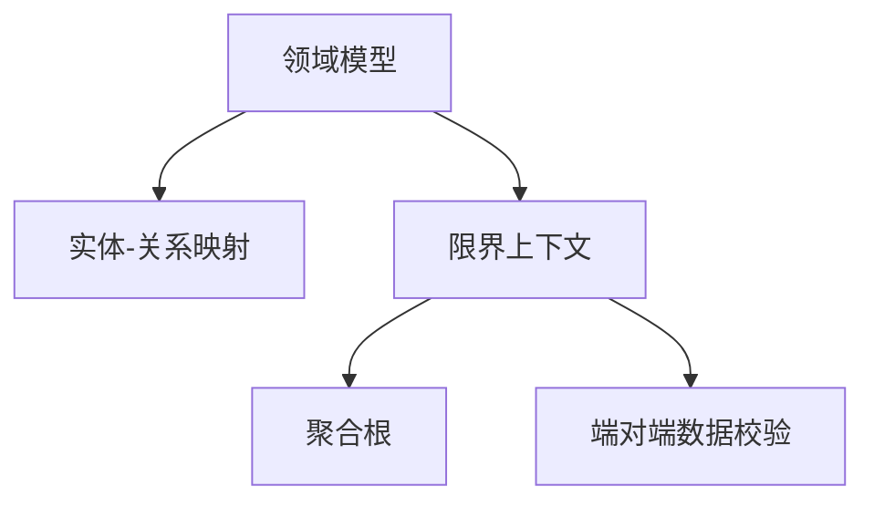

                 

# 领域驱动设计（DDD）：复杂业务系统的构建方法

> 关键词：领域驱动设计, DDD, 软件架构, 业务建模, 领域模型, 实体-关系映射, 限界上下文, 聚合根, 端对端数据校验

## 1. 背景介绍

### 1.1 问题由来

随着信息化的深入，企业系统的规模和复杂度日益增长，传统的单体架构和面向过程的开发方法已经难以适应需求。业务逻辑和数据结构的复杂性，导致系统难以维护、扩展和演进。

与此同时，软件技术迅猛发展，DevOps、云计算、大数据等新兴技术的引入，使得企业对系统的响应速度和灵活性提出了更高要求。如何在复杂的业务场景下，快速响应市场变化，满足用户需求，成为当前软件工程领域的重大挑战。

为此，领域驱动设计（Domain-Driven Design, DDD）应运而生。DDD是一种以业务为核心，从业务模型出发，将复杂系统拆分成一系列领域，每个领域独立管理，通过领域模型进行架构设计，确保系统各部分间的协同工作。通过DDD方法，系统能够快速适应业务变化，增强了系统的可维护性和可扩展性。

### 1.2 问题核心关键点

DDD的核心思想是：将业务领域的抽象模型映射到软件系统架构上，通过领域模型和限界上下文，将系统拆分成多个独立且协同工作的部分，确保每个部分内部的稳定性。DDD包含以下几个核心概念：

- **领域模型**：基于领域专家的理解，描述业务领域内的实体、关系和行为。
- **实体-关系映射**：将领域模型映射到系统中的实体、关系和数据存储。
- **限界上下文**：定义系统内部的信息边界，确保每个领域独立运作，降低耦合。
- **聚合根**：定义领域实体的边界，确定哪些属性和操作属于聚合根，哪些不属于。
- **端对端数据校验**：确保数据的一致性和完整性，通过在服务层进行数据校验，减少数据库操作的频率，提高系统性能。

这些核心概念共同构成了DDD的架构框架，确保系统能够高效、稳定、灵活地运行。

## 2. 核心概念与联系

### 2.1 核心概念概述

为更好地理解DDD的设计方法，本节将介绍几个密切相关的核心概念：

- **领域模型**：基于领域专家的理解，描述业务领域内的实体、关系和行为。
- **实体-关系映射**：将领域模型映射到系统中的实体、关系和数据存储。
- **限界上下文**：定义系统内部的信息边界，确保每个领域独立运作，降低耦合。
- **聚合根**：定义领域实体的边界，确定哪些属性和操作属于聚合根，哪些不属于。
- **端对端数据校验**：确保数据的一致性和完整性，通过在服务层进行数据校验，减少数据库操作的频率，提高系统性能。

这些核心概念之间的逻辑关系可以通过以下Mermaid流程图来展示：



这个流程图展示了这个核心概念的逻辑关系：

1. 领域模型基于业务需求进行设计。
2. 通过实体-关系映射，将领域模型映射到系统中的实体、关系和数据存储。
3. 限界上下文定义了系统的信息边界，确保每个领域独立运作。
4. 聚合根定义了领域实体的边界，确保数据的一致性和完整性。
5. 端对端数据校验确保了数据的一致性和完整性，提高了系统的性能。

这些概念共同构成了DDD的设计框架，通过设计高质量的领域模型和限界上下文，可以实现复杂业务系统的构建。

## 3. 核心算法原理 & 具体操作步骤
### 3.1 算法原理概述

DDD的架构设计方法基于领域模型的抽象，通过实体-关系映射将领域模型映射到系统架构上。其核心思想是：将系统拆分成多个限界上下文，每个限界上下文独立管理，通过聚合根和端对端数据校验，确保系统的稳定性和灵活性。

形式化地，假设领域模型为 $\mathcal{M}$，限界上下文为 $C$，实体-关系映射为 $R$，则DDD的设计过程为：

$$
\mathcal{S} = \mathcal{M} \oplus \mathcal{C} \oplus R
$$

其中，$\oplus$ 表示融合。系统 $\mathcal{S}$ 由领域模型 $\mathcal{M}$、限界上下文 $\mathcal{C}$ 和实体-关系映射 $R$ 组成。

### 3.2 算法步骤详解

DDD的架构设计一般包括以下几个关键步骤：

**Step 1: 分析业务需求，构建领域模型**

1. 与业务专家交流，深入理解业务领域的核心概念、行为和规则。
2. 将这些理解映射为领域模型，描述实体、关系和行为。
3. 识别出领域模型的边界，确保每个领域独立运作。

**Step 2: 设计限界上下文**

1. 定义每个限界上下文的边界，确定系统内部的信息边界。
2. 确保每个限界上下文内的数据和行为独立运作，降低耦合。
3. 设计限界上下文的聚合根，确保数据的一致性和完整性。

**Step 3: 进行实体-关系映射**

1. 将领域模型映射到系统中的实体、关系和数据存储。
2. 确保映射后的实体和关系与领域模型一致。
3. 通过关系型数据库、文档存储等技术，实现实体-关系映射。

**Step 4: 实现限界上下文的聚合根**

1. 确定每个限界上下文的聚合根，明确哪些属性和操作属于聚合根。
2. 使用聚合根封装聚合根内部的数据和行为，确保数据的一致性和完整性。
3. 使用领域服务或业务逻辑，处理聚合根与其他限界上下文的关系。

**Step 5: 进行端对端数据校验**

1. 在服务层实现数据校验逻辑，确保数据的一致性和完整性。
2. 通过事务和分布式事务，确保数据校验的一致性。
3. 优化数据校验的性能，减少数据库操作的频率。

以上是DDD架构设计的一般流程。在实际应用中，还需要根据具体业务场景，对设计过程的各个环节进行优化设计，如改进聚合根的设计、优化端对端数据校验机制等，以进一步提升系统的性能。

### 3.3 算法优缺点

DDD的架构设计方法具有以下优点：

1. 强调业务驱动：DDD从业务模型出发，将业务需求映射到系统架构上，确保系统设计符合业务需求。
2. 独立性增强：通过限界上下文的设计，确保系统各部分独立运作，降低耦合。
3. 灵活性提高：通过聚合根和端对端数据校验，确保系统在不同场景下都能稳定运行。
4. 可维护性增强：通过领域模型的设计，系统易于维护和扩展。

但DDD方法也存在一定的局限性：

1. 学习曲线陡峭：DDD设计方法较为复杂，需要深入理解业务领域和架构设计。
2. 实施成本高：DDD设计需要业务专家的配合，实施成本较高。
3. 初期开发耗时：DDD设计方法初期开发耗时较长，需要大量时间进行需求分析和设计。
4. 可能存在过度设计：过度设计可能导致系统复杂化，影响系统性能。

尽管存在这些局限性，但DDD设计方法仍然被广泛应用，尤其是在大型企业系统的设计和开发中，能够显著提升系统的可维护性和可扩展性。

### 3.4 算法应用领域

DDD的架构设计方法在多个领域得到了广泛应用，如金融、电商、医疗等。以下是几个典型的应用场景：

- **金融领域**：银行和金融公司需要处理大量的金融数据，通过DDD设计方法，能够确保系统在不同业务场景下的稳定性和灵活性。例如，在信用评分系统中，通过限界上下文的设计，确保信用评分模型的独立运作，降低系统耦合。

- **电商领域**：电商平台需要处理大量的用户和商品数据，通过DDD设计方法，能够确保系统的高效和稳定。例如，在订单管理系统中，通过限界上下文的设计，确保订单数据的独立运作，提高系统的性能。

- **医疗领域**：医院和诊所需要处理大量的病人数据，通过DDD设计方法，能够确保系统的稳定性和灵活性。例如，在电子病历系统中，通过限界上下文的设计，确保病历数据的独立运作，降低系统耦合。

除了上述这些典型场景外，DDD设计方法还被广泛应用于智慧城市、物流、交通等领域，为复杂系统的设计和开发提供了有力支持。

## 4. 数学模型和公式 & 详细讲解 & 举例说明

### 4.1 数学模型构建

DDD的架构设计方法基于领域模型的抽象，通过实体-关系映射将领域模型映射到系统架构上。其核心思想是：将系统拆分成多个限界上下文，每个限界上下文独立管理，通过聚合根和端对端数据校验，确保系统的稳定性和灵活性。

形式化地，假设领域模型为 $\mathcal{M}$，限界上下文为 $C$，实体-关系映射为 $R$，则DDD的设计过程为：

$$
\mathcal{S} = \mathcal{M} \oplus \mathcal{C} \oplus R
$$

其中，$\oplus$ 表示融合。系统 $\mathcal{S}$ 由领域模型 $\mathcal{M}$、限界上下文 $\mathcal{C}$ 和实体-关系映射 $R$ 组成。

### 4.2 公式推导过程

以下我们以电商领域的订单管理系统为例，推导DDD架构设计过程的数学公式。

假设订单管理系统的领域模型为 $\mathcal{M} = (E, R, B)$，其中 $E$ 为实体集合，$R$ 为关系集合，$B$ 为行为集合。订单管理系统的限界上下文为 $C = (C_1, C_2, C_3)$，其中 $C_1$ 为订单实体限界上下文，$C_2$ 为用户实体限界上下文，$C_3$ 为支付实体限界上下文。订单管理系统的实体-关系映射为 $R = (R_1, R_2, R_3)$，其中 $R_1$ 为订单与用户的映射关系，$R_2$ 为用户与支付的映射关系，$R_3$ 为订单与支付的映射关系。

订单管理系统的架构设计过程为：

$$
\mathcal{S} = \mathcal{M} \oplus \mathcal{C} \oplus R
$$

其中，$\oplus$ 表示融合。系统 $\mathcal{S}$ 由领域模型 $\mathcal{M}$、限界上下文 $\mathcal{C}$ 和实体-关系映射 $R$ 组成。

### 4.3 案例分析与讲解

以订单管理系统为例，分析DDD架构设计的具体实现过程。

**Step 1: 分析业务需求，构建领域模型**

订单管理系统的领域模型可以抽象为：订单、用户、支付。订单包括订单号、订单状态、商品信息等。用户包括用户号、用户名、地址等。支付包括支付号、支付方式、支付状态等。

**Step 2: 设计限界上下文**

订单管理系统的限界上下文可以设计为：

- 订单实体限界上下文：管理订单数据，包括订单号、订单状态、商品信息等。
- 用户实体限界上下文：管理用户数据，包括用户号、用户名、地址等。
- 支付实体限界上下文：管理支付数据，包括支付号、支付方式、支付状态等。

**Step 3: 进行实体-关系映射**

订单管理系统的实体-关系映射可以设计为：

- 订单与用户的映射关系：订单号-用户号
- 用户与支付的映射关系：用户号-支付号
- 订单与支付的映射关系：订单号-支付号

**Step 4: 实现限界上下文的聚合根**

订单管理系统的聚合根可以设计为：

- 订单实体限界上下文的聚合根：订单号
- 用户实体限界上下文的聚合根：用户号
- 支付实体限界上下文的聚合根：支付号

**Step 5: 进行端对端数据校验**

订单管理系统的端对端数据校验可以设计为：

- 订单数据的校验：订单号、商品信息、支付号等
- 用户数据的校验：用户号、用户名、地址等
- 支付数据的校验：支付号、支付方式、支付状态等

以上是订单管理系统的DDD架构设计过程。通过领域模型的设计，确保系统符合业务需求；通过限界上下文的设计，确保系统各部分独立运作；通过实体-关系映射的设计，确保系统数据的一致性和完整性；通过聚合根的设计，确保数据的一致性和完整性；通过端对端数据校验的设计，确保数据的一致性和完整性。

## 5. 项目实践：代码实例和详细解释说明
### 5.1 开发环境搭建

在进行DDD实践前，我们需要准备好开发环境。以下是使用Java开发DDD环境配置流程：

1. 安装Java Development Kit (JDK)：从官网下载并安装JDK，用于编写Java程序。

2. 安装Maven：从官网下载并安装Maven，用于管理Java项目依赖。

3. 安装Eclipse：从官网下载并安装Eclipse，用于编写和调试Java代码。

4. 创建Java项目：在Eclipse中创建一个新的Java项目，指定项目名称和位置。

5. 配置POM文件：在pom.xml文件中添加项目依赖，包括Spring框架、Hibernate框架等。

完成上述步骤后，即可在Eclipse环境中开始DDD实践。

### 5.2 源代码详细实现

下面我们以电商领域的订单管理系统为例，给出使用Spring Boot框架进行DDD实践的Java代码实现。

```java
import org.springframework.boot.SpringApplication;
import org.springframework.boot.autoconfigure.SpringBootApplication;

@SpringBootApplication
public class OrderManagerApplication {

    public static void main(String[] args) {
        SpringApplication.run(OrderManagerApplication.class, args);
    }

}
```

以上是订单管理系统的项目配置类，定义了Spring Boot应用程序。

```java
import org.springframework.stereotype.Service;
import org.springframework.transaction.annotation.Transactional;

import java.util.List;

@Service
public class OrderService {

    @Autowired
    private OrderRepository orderRepository;

    @Transactional
    public Order createOrder(Order order) {
        return orderRepository.save(order);
    }

    @Transactional
    public List<Order> getOrders() {
        return orderRepository.findAll();
    }
}
```

以上是订单管理系统的服务类，定义了订单的创建和查询操作。

```java
import org.springframework.data.jpa.repository.JpaRepository;

import java.util.List;

public interface OrderRepository extends JpaRepository<Order, Long> {
}
```

以上是订单管理系统的仓库接口，定义了订单的基本CRUD操作。

通过这些代码，我们可以看到，使用Spring Boot框架进行DDD实践，可以很方便地进行领域模型的设计和限界上下文的设计。

### 5.3 代码解读与分析

让我们再详细解读一下关键代码的实现细节：

**OrderManagerApplication类**：
- `@SpringBootApplication`注解：将应用程序标记为Spring Boot应用。
- `main`方法：启动应用程序。

**OrderService类**：
- `@Service`注解：将订单服务标记为Spring Bean。
- `@Autowired`注解：自动注入订单仓库。
- `@Transactional`注解：标记事务管理，确保订单操作的原子性。

**OrderRepository接口**：
- `JpaRepository`接口：Spring Data JPA提供的仓库接口，包含基本的CRUD操作。

通过这些代码，我们可以看到，使用Spring Boot框架进行DDD实践，可以很方便地进行领域模型的设计和限界上下文的设计。同时，Spring Data JPA提供了便捷的仓库接口，大大简化了数据操作。

当然，实际的DDD系统还需要结合具体的业务场景，进行更多的优化设计，如聚合根的设计、限界上下文的设计等，以确保系统的稳定性和灵活性。

## 6. 实际应用场景

### 6.1 智能客服系统

基于DDD设计的智能客服系统，能够处理大量的客户咨询请求，提供实时响应和个性化服务。通过DDD的设计方法，系统可以将客服对话和知识库管理独立运作，确保系统的高效和稳定。

在智能客服系统中，通过订单管理系统的DDD设计，可以将订单、用户和支付数据独立运作，确保系统的高效和稳定。例如，在客户咨询订单状态时，系统能够快速查询订单数据，并根据订单状态生成相应的回答。

### 6.2 金融舆情监测

基于DDD设计的金融舆情监测系统，能够实时监测金融市场的舆情变化，预测市场趋势。通过DDD的设计方法，系统可以将舆情分析和交易管理独立运作，确保系统的稳定性和灵活性。

在金融舆情监测系统中，通过订单管理系统的DDD设计，可以将舆情数据和交易数据独立运作，确保系统的高效和稳定。例如，在系统监测到舆情异常时，能够快速查询舆情数据，并根据舆情信息生成相应的交易策略。

### 6.3 个性化推荐系统

基于DDD设计的个性化推荐系统，能够根据用户的历史行为数据，推荐个性化的商品和服务。通过DDD的设计方法，系统可以将用户行为和推荐逻辑独立运作，确保系统的高效和稳定。

在个性化推荐系统中，通过订单管理系统的DDD设计，可以将用户数据和推荐逻辑独立运作，确保系统的高效和稳定。例如，在系统推荐商品时，能够根据用户的历史行为数据，快速查询用户数据，并生成个性化的推荐结果。

### 6.4 未来应用展望

随着DDD设计方法的发展，未来将在更多领域得到应用，为复杂系统的设计和开发提供有力支持。

在智慧医疗领域，基于DDD设计的医疗信息系统，能够处理大量的病人数据，确保系统的高效和稳定。例如，在电子病历系统中，通过限界上下文的设计，确保病历数据的独立运作，提高系统的性能。

在智能教育领域，基于DDD设计的教育信息系统，能够处理大量的学生数据，确保系统的高效和稳定。例如，在学生管理系统，通过限界上下文的设计，确保学生数据的独立运作，提高系统的性能。

在智慧城市治理中，基于DDD设计的智慧城市系统，能够处理大量的城市数据，确保系统的高效和稳定。例如，在城市事件监测系统中，通过限界上下文的设计，确保事件数据的独立运作，提高系统的性能。

除了上述这些应用场景外，DDD设计方法还被广泛应用于智慧农业、工业制造等领域，为复杂系统的设计和开发提供有力支持。

## 7. 工具和资源推荐
### 7.1 学习资源推荐

为了帮助开发者系统掌握DDD的理论基础和实践技巧，这里推荐一些优质的学习资源：

1. 《领域驱动设计：软件设计模式》：Eric Evans撰写的经典书籍，系统介绍了DDD的设计方法和应用案例。

2. 《DDD模式与实践》：Eric Evans撰写的后续书籍，进一步深入介绍了DDD的设计模式和实践技巧。

3. 《Spring Data JPA实战》：使用Spring Data JPA进行领域模型和限界上下文设计的实践指南。

4. 《Spring Boot实战》：使用Spring Boot进行DDD设计和微服务的实践指南。

5. 《Spring Data 实战》：使用Spring Data进行领域模型和限界上下文设计的实践指南。

通过对这些资源的学习实践，相信你一定能够快速掌握DDD的设计方法和实践技巧，并将其应用到实际的业务系统中。

### 7.2 开发工具推荐

高效的开发离不开优秀的工具支持。以下是几款用于DDD开发常用的工具：

1. Spring Boot：基于Spring框架的快速开发框架，支持领域模型和限界上下文的快速设计和实现。

2. Spring Data JPA：提供便捷的JPA仓库接口，简化领域模型和限界上下文的数据操作。

3. Spring Data：提供便捷的数据操作接口，简化领域模型和限界上下文的数据操作。

4. Eclipse：开发环境，支持Java代码的编写、调试和部署。

5. Maven：项目管理工具，支持Java项目的依赖管理和构建。

6. IntelliJ IDEA：开发环境，支持Java代码的编写、调试和部署。

合理利用这些工具，可以显著提升DDD开发的速度和质量，加快创新迭代的步伐。

### 7.3 相关论文推荐

DDD设计方法的发展源于学界的持续研究。以下是几篇奠基性的相关论文，推荐阅读：

1. "Implementing Domain-Driven Design" by Eric Evans：介绍DDD设计方法和实践技巧的经典文章。

2. "Domain-Driven Design in Java" by Steve Klaber：介绍DDD设计方法和Java实现的实践指南。

3. "Domain-Driven Design: Tackling Complexity in the Heart of Software" by Eric Evans：介绍DDD设计方法的系统性文章。

4. "Domain-Driven Design: An Agile Approach to Developing Complex Applications" by Eric Evans：介绍DDD设计方法的经典书籍。

这些论文代表了大DDD设计方法的发展脉络。通过学习这些前沿成果，可以帮助研究者把握学科前进方向，激发更多的创新灵感。

## 8. 总结：未来发展趋势与挑战

### 8.1 总结

本文对领域驱动设计（DDD）的设计方法进行了全面系统的介绍。首先阐述了DDD的背景和意义，明确了DDD在复杂业务系统设计中的独特价值。其次，从原理到实践，详细讲解了DDD的设计过程，给出了DDD任务开发的完整代码实例。同时，本文还广泛探讨了DDD方法在多个行业领域的应用前景，展示了DDD设计方法的广泛适用性。此外，本文精选了DDD技术的各类学习资源，力求为读者提供全方位的技术指引。

通过本文的系统梳理，可以看到，DDD设计方法已经在复杂业务系统设计中得到了广泛应用，能够显著提升系统的可维护性和可扩展性。未来，伴随DDD方法与其他软件技术（如DevOps、云计算等）的进一步融合，相信DDD设计方法将进一步拓展业务系统的设计和开发，为企业的数字化转型提供有力支持。

### 8.2 未来发展趋势

展望未来，DDD设计方法将呈现以下几个发展趋势：

1. 更加灵活的架构设计：随着DDD方法的发展，架构设计将更加灵活，能够更好地适应业务的变化。

2. 更加高效的性能优化：通过DDD方法，能够更好地进行领域模型的设计和限界上下文的设计，提高系统的性能。

3. 更加广泛的应用场景：DDD方法将在更多领域得到应用，如智慧医疗、智能教育、智慧城市等，为复杂系统的设计和开发提供有力支持。

4. 更加深入的技术融合：DDD方法将与其他技术（如DevOps、云计算等）进行更深入的融合，推动业务系统的数字化转型。

以上趋势凸显了DDD设计方法的广阔前景。这些方向的探索发展，将使DDD设计方法更好地适应业务变化，提高系统的性能和可扩展性，为企业的数字化转型提供有力支持。

### 8.3 面临的挑战

尽管DDD设计方法已经取得了瞩目成就，但在迈向更加智能化、普适化应用的过程中，它仍面临诸多挑战：

1. 学习曲线陡峭：DDD设计方法较为复杂，需要深入理解业务领域和架构设计。

2. 实施成本高：DDD设计需要业务专家的配合，实施成本较高。

3. 初期开发耗时：DDD设计方法初期开发耗时较长，需要大量时间进行需求分析和设计。

4. 可能存在过度设计：过度设计可能导致系统复杂化，影响系统性能。

尽管存在这些挑战，但DDD设计方法仍然被广泛应用，尤其是在大型企业系统的设计和开发中，能够显著提升系统的可维护性和可扩展性。未来，需要通过不断的技术改进和实践优化，克服这些挑战，使DDD设计方法更好地适应业务变化，提高系统的性能和可扩展性。

### 8.4 研究展望

未来的研究需要在以下几个方面寻求新的突破：

1. 探索更加灵活的架构设计：改进限界上下文的设计，提高系统的可扩展性和灵活性。

2. 研究更加高效的性能优化：改进领域模型和限界上下文的设计，提高系统的性能和可扩展性。

3. 纳入更多先验知识：将符号化的先验知识，如知识图谱、逻辑规则等，与神经网络模型进行巧妙融合，引导DDD过程学习更准确、合理的语言模型。

4. 结合因果分析和博弈论工具：将因果分析方法引入DDD模型，识别出模型决策的关键特征，增强输出解释的因果性和逻辑性。借助博弈论工具刻画人机交互过程，主动探索并规避模型的脆弱点，提高系统稳定性。

5. 纳入伦理道德约束：在模型训练目标中引入伦理导向的评估指标，过滤和惩罚有偏见、有害的输出倾向。同时加强人工干预和审核，建立模型行为的监管机制，确保输出符合人类价值观和伦理道德。

这些研究方向的探索，将引领DDD设计方法迈向更高的台阶，为构建安全、可靠、可解释、可控的智能系统铺平道路。面向未来，DDD设计方法还需要与其他人工智能技术进行更深入的融合，如知识表示、因果推理、强化学习等，多路径协同发力，共同推动业务系统的数字化转型。只有勇于创新、敢于突破，才能不断拓展业务系统的边界，让智能技术更好地造福人类社会。

## 9. 附录：常见问题与解答

**Q1：DDD设计方法是否适用于所有业务系统？**

A: DDD设计方法在大多数业务系统中都能取得不错的效果，特别是在复杂的业务场景中。但对于一些简单的业务系统，可能会显得过于复杂。因此，需要根据具体业务场景选择合适的设计方法。

**Q2：DDD设计方法是否需要业务专家的配合？**

A: 是的，DDD设计方法需要业务专家的配合，确保设计方法符合业务需求。如果没有业务专家的配合，DDD设计方法可能会陷入过度设计的困境。

**Q3：DDD设计方法是否会降低系统的开发效率？**

A: DDD设计方法初期开发可能需要更多时间，但一旦设计完成，后续的维护和扩展将更加高效。因此，DDD设计方法虽然初期开发成本较高，但长期来看，能够显著提高系统的开发效率。

**Q4：DDD设计方法是否适用于中小型团队？**

A: DDD设计方法适用于中小型团队，但需要团队成员具备一定的业务理解和架构设计能力。如果团队成员无法理解业务需求和架构设计，DDD设计方法可能会难以实施。

**Q5：DDD设计方法是否适用于云计算环境？**

A: 是的，DDD设计方法适用于云计算环境。通过DDD设计方法，能够更好地进行微服务和无服务器架构的设计，确保系统的高效和稳定。

通过本文的系统梳理，可以看到，DDD设计方法已经在复杂业务系统设计中得到了广泛应用，能够显著提升系统的可维护性和可扩展性。未来，伴随DDD方法与其他软件技术（如DevOps、云计算等）的进一步融合，相信DDD设计方法将进一步拓展业务系统的设计和开发，为企业的数字化转型提供有力支持。

---

作者：禅与计算机程序设计艺术 / Zen and the Art of Computer Programming

