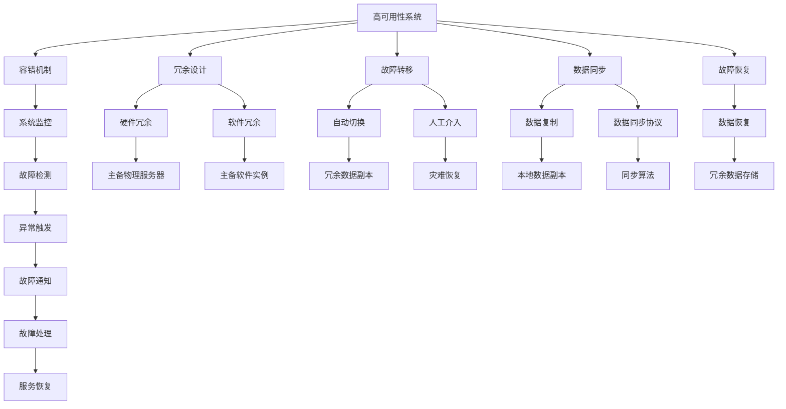

                 

# 高可用性系统的设计策略

## 1. 背景介绍

随着互联网应用的日益普及，用户对系统服务稳定性的要求也日益提高。高可用性（High Availability, HA）系统指的是能够在特定时间段内，尽可能不间断地对外提供服务的系统。系统的高可用性是企业数字化转型的基础，能够确保业务的连续性和数据的完整性，保障企业服务稳定运行。然而，构建高可用性系统是一个复杂的工程问题，涉及系统架构设计、容错机制、数据同步、故障恢复等多个层面。本文将系统阐述高可用性系统的设计策略，力求为相关开发者提供全面的指导和参考。

## 2. 核心概念与联系

### 2.1 核心概念概述

- **高可用性（High Availability, HA）**：指系统在一定时间内不间断对外提供服务的能力，通常以“几个9”的可用性来衡量。
- **容错（Fault Tolerance）**：指系统在故障发生时仍能正常工作，或快速恢复到正常状态的能力。
- **冗余（Redundancy）**：指通过增加硬件或软件的副本，以确保关键组件故障时系统仍能正常运行。
- **故障转移（Failover）**：指当系统检测到故障时，能够快速切换到备用资源，恢复系统服务的能力。
- **数据同步（Data Synchronization）**：指在系统多节点间同步数据，确保数据一致性的过程。
- **故障恢复（Fault Recovery）**：指系统检测到故障后，恢复到正常状态的过程。

### 2.2 核心概念原理和架构的 Mermaid 流程图



这个流程图展示了高可用性系统的核心组件和运作流程：

1. **高可用性系统**从**容错机制**中获取保障。
2. **冗余设计**通过**硬件冗余**和**软件冗余**实现。
3. **故障转移**通过**自动切换**和**人工介入**完成。
4. **数据同步**利用**数据复制**和**数据同步协议**实现。
5. **故障恢复**通过**数据恢复**和**冗余数据存储**保证。
6. **系统监控**负责**故障检测**和**故障通知**。

这些组件相互配合，共同维护系统的高可用性。

## 3. 核心算法原理 & 具体操作步骤

### 3.1 算法原理概述

高可用性系统通常采用多层次、多组件的架构设计，结合不同的容错和冗余技术，实现系统的不间断服务。其核心算法原理可以总结如下：

1. **主从架构**：将系统分为一个主节点和多个从节点，主节点负责服务，从节点监控主节点的状态。当主节点故障时，从节点自动接管服务。
2. **冗余设计**：通过增加副本，确保关键组件故障时系统仍能正常运行。
3. **故障转移**：检测系统故障，快速切换到备用资源。
4. **数据同步**：确保多个节点间数据一致，避免数据丢失。
5. **故障恢复**：在系统检测到故障后，恢复到正常状态。

### 3.2 算法步骤详解

构建高可用性系统的具体操作步骤如下：

1. **需求分析**：根据业务需求，确定系统的高可用性目标和可用性指标。
2. **系统设计**：设计系统架构，选择合适的容错和冗余技术。
3. **冗余实现**：实现硬件和软件冗余，确保关键组件的可靠性和可用性。
4. **故障检测和监控**：部署系统监控，及时检测系统故障。
5. **故障转移和恢复**：实现自动和人工故障转移机制，数据同步和恢复策略。
6. **性能调优**：优化系统性能，提升系统负载能力和响应速度。
7. **测试和验证**：对系统进行全面测试，验证其高可用性。

### 3.3 算法优缺点

高可用性系统的主要优点包括：

- **提升服务稳定性**：通过冗余和故障转移机制，确保系统不间断服务。
- **保障数据安全**：通过数据同步和故障恢复机制，保障数据一致性和完整性。
- **提高业务连续性**：在系统故障时，快速切换到备用资源，保障业务连续性。

然而，高可用性系统也存在以下缺点：

- **成本较高**：硬件和软件冗余会增加系统成本。
- **复杂度高**：系统架构设计复杂，需要专业知识。
- **性能损耗**：冗余设计可能会增加系统响应时间和资源消耗。

### 3.4 算法应用领域

高可用性系统广泛应用于金融、电商、云服务、物联网等高业务连续性要求领域，保障核心业务的服务稳定性和数据完整性。例如：

- **金融交易系统**：高可用性系统保障金融交易系统的高稳定性，防止因故障导致交易中断。
- **电商平台**：高可用性系统保障电商平台的稳定运行，避免因故障导致购物车数据丢失。
- **云服务平台**：高可用性系统保障云服务平台的服务连续性，防止因故障导致服务中断。
- **物联网设备**：高可用性系统保障物联网设备的稳定运行，防止因故障导致数据丢失。

## 4. 数学模型和公式 & 详细讲解 & 举例说明

### 4.1 数学模型构建

高可用性系统通常采用多层次、多组件的架构设计，结合不同的容错和冗余技术，实现系统的不间断服务。

假设系统有n个节点，每个节点服务能力为C，每个节点的故障率为f，则系统的总服务能力为：

$$
TotCapacity = n \times C
$$

系统的可用性可以用以下数学模型表示：

$$
A = (1 - f)^n
$$

其中A为系统的可用性，f为单个节点的故障率，n为节点数量。

### 4.2 公式推导过程

由上述模型可以看出，系统的可用性随着节点数量n的增加而提升。但当节点数量增加到一定程度时，继续增加节点对提升可用性的效果将逐渐减弱。因此，合理设计节点数量n是提升系统可用性的关键。

### 4.3 案例分析与讲解

假设系统有3个节点，每个节点的服务能力为100%，单个节点的故障率为0.1%，则系统的可用性计算如下：

$$
A = (1 - 0.001)^3 \approx 0.997
$$

因此，该系统的高可用性约为99.7%。

## 5. 项目实践：代码实例和详细解释说明

### 5.1 开发环境搭建

为了搭建一个高可用性系统，首先需要安装和配置相关软件和工具，如Linux操作系统、Kubernetes、Docker等。

1. **安装Linux操作系统**：在服务器上安装Linux系统，如Ubuntu、CentOS等。
2. **安装Docker**：安装Docker容器引擎，便于容器化应用管理。
3. **安装Kubernetes**：在Linux服务器上安装Kubernetes集群，用于容器编排和管理。
4. **配置网络和存储**：配置网络和服务器的存储系统，确保容器间通信和数据存储的稳定性。

### 5.2 源代码详细实现

以下是一个基于Kubernetes的高可用性系统的Python代码实现示例：

```python
from kubernetes import client, config
import logging

# 配置Kubernetes客户端
logging.basicConfig(level=logging.INFO)
config.load_kube_config()

# 创建Kubernetes API客户端
v1 = client.CoreV1Api()

# 创建Pod
pod_name = 'my_app'
pod_labels = {'hello': 'world'}
v1.create_namespaced_pod(
    api_version='v1',
    metadata={
        'name': pod_name,
        'labels': pod_labels
    }
)
```

这段代码创建了一个名为`my_app`的Pod，并将其标签设置为`{'hello': 'world'}`。在实际应用中，可以进一步配置Pod的容器镜像、资源需求、环境变量等，实现应用的容器化部署。

### 5.3 代码解读与分析

以上代码展示了如何使用Kubernetes API创建一个Pod，其实现步骤如下：

1. **导入Kubernetes客户端和配置**：导入Kubernetes客户端和配置，用于与Kubernetes集群通信。
2. **创建Pod对象**：创建Pod对象，并设置Pod的标签信息。
3. **调用API创建Pod**：调用Kubernetes API的create_namespaced_pod方法，创建Pod资源。

此示例仅为高可用性系统的基础实现，实际应用中还需要配置更多细节，如资源限制、副本数、重启策略等。

### 5.4 运行结果展示

在成功创建Pod后，可以通过Kubernetes的命令工具（如kubectl）查看Pod的状态：

```bash
kubectl get pods
```

该命令将列出当前集群中所有Pod的状态信息，包括创建时间、状态、IP地址等。

## 6. 实际应用场景

### 6.1 金融交易系统

金融交易系统是高可用性系统的典型应用场景之一。系统需要保障交易的实时性和稳定性，防止因故障导致交易中断或数据丢失。

在金融交易系统中，高可用性系统通常采用以下策略：

- **主从架构**：设置主从节点，主节点负责交易处理，从节点负责监控主节点的状态，当主节点故障时，从节点自动接管服务。
- **数据同步**：通过数据库复制技术，确保数据在不同节点间一致。
- **故障转移**：采用自动故障转移机制，快速切换到备用节点。
- **故障恢复**：通过备份数据库和日志，在系统恢复后快速恢复数据和交易记录。

### 6.2 电商平台

电商平台需要保障购物车的稳定性和连续性，防止因故障导致订单丢失。

在电商平台中，高可用性系统通常采用以下策略：

- **缓存和负载均衡**：通过缓存和负载均衡技术，减轻数据库压力，提升系统响应速度。
- **主从架构**：设置主从节点，主节点负责购物车处理，从节点负责监控主节点的状态，当主节点故障时，从节点自动接管服务。
- **数据同步**：通过数据库复制技术，确保购物车数据在不同节点间一致。
- **故障转移**：采用自动故障转移机制，快速切换到备用节点。
- **故障恢复**：通过备份购物车数据和日志，在系统恢复后快速恢复订单状态。

### 6.3 云服务平台

云服务平台需要保障服务的稳定性和连续性，防止因故障导致服务中断。

在云服务平台中，高可用性系统通常采用以下策略：

- **主从架构**：设置主从节点，主节点负责服务处理，从节点负责监控主节点的状态，当主节点故障时，从节点自动接管服务。
- **负载均衡**：通过负载均衡技术，分配请求到可用节点。
- **数据同步**：通过数据库复制技术，确保数据在不同节点间一致。
- **故障转移**：采用自动故障转移机制，快速切换到备用节点。
- **故障恢复**：通过备份数据和日志，在系统恢复后快速恢复服务状态。

### 6.4 物联网设备

物联网设备需要保障数据的稳定性和完整性，防止因故障导致数据丢失。

在物联网设备中，高可用性系统通常采用以下策略：

- **主从架构**：设置主从节点，主节点负责数据处理，从节点负责监控主节点的状态，当主节点故障时，从节点自动接管服务。
- **数据同步**：通过消息队列和数据库复制技术，确保数据在不同节点间一致。
- **故障转移**：采用自动故障转移机制，快速切换到备用节点。
- **故障恢复**：通过备份数据和日志，在系统恢复后快速恢复数据状态。

## 7. 工具和资源推荐

### 7.1 学习资源推荐

为了深入理解高可用性系统的设计和实现，推荐以下学习资源：

1. **《Kubernetes权威指南》**：该书详细介绍了Kubernetes集群的管理和应用，是学习Kubernetes的必备资源。
2. **《高可用性系统设计》**：该书深入探讨了高可用性系统的设计和实现，涵盖了主从架构、冗余设计、故障转移等内容。
3. **《分布式系统原理与实践》**：该书系统介绍了分布式系统的原理和实践，包括故障检测、容错机制、数据同步等内容。
4. **《系统架构之美》**：该书通过多个实际案例，介绍了系统架构的设计和优化，是理解高可用性系统的好书。

### 7.2 开发工具推荐

高可用性系统的开发和部署离不开专业的开发工具和平台。以下是推荐的开发工具：

1. **Kubernetes**：开源容器编排平台，用于管理和部署容器化应用。
2. **Docker**：开源容器引擎，用于构建和运行容器化应用。
3. **Prometheus**：开源监控系统，用于监控集群中的应用和服务。
4. **Grafana**：开源可视化工具，用于展示和分析监控数据。
5. **Knative**：开源事件驱动平台，用于部署和运行函数和微服务。
6. **Elasticsearch**：开源搜索引擎，用于存储和搜索海量数据。
7. **Fluentd**：开源日志收集和分析工具，用于收集和分析应用日志。

### 7.3 相关论文推荐

以下是几篇关于高可用性系统的经典论文，推荐阅读：

1. **《Practical Resilient Systems: Building Scalable Services for Data Intensive Environments》**：该书介绍了在数据密集环境中构建可伸缩系统的实践经验。
2. **《Building Scalable and High-Availability Systems with Kubernetes》**：该论文介绍了在Kubernetes上构建可扩展和高可用性系统的实践。
3. **《Fault Tolerant Systems: Design Principles and Paradigms》**：该书深入探讨了容错系统的设计原理和实践，是理解高可用性系统的经典之作。
4. **《Availability and Reliability in System Design》**：该论文介绍了系统设计中可用性和可靠性的原则和方法，是理解高可用性系统的重要文献。

## 8. 总结：未来发展趋势与挑战

### 8.1 总结

本文系统介绍了高可用性系统的设计策略，涵盖容错机制、冗余设计、故障转移、数据同步和故障恢复等多个方面。通过学习本文，读者可以掌握高可用性系统的核心概念和设计方法，为开发高可用性系统提供坚实的基础。

高可用性系统是保障业务连续性和数据完整性的重要手段，应用场景广泛，涉及金融、电商、云服务、物联网等多个领域。本文通过多个实际案例，展示了高可用性系统的具体应用和设计策略，有助于读者理解和实践高可用性系统的构建。

### 8.2 未来发展趋势

高可用性系统的未来发展趋势如下：

1. **自动化运维**：随着AI和自动化技术的发展，高可用性系统将逐步实现自动化运维，减少人工干预和故障处理时间。
2. **边缘计算**：边缘计算将实现数据本地处理，减少网络延迟和带宽消耗，提升系统响应速度。
3. **区块链**：区块链技术可以提升数据一致性和安全性，成为高可用性系统的有力补充。
4. **微服务架构**：微服务架构将提升系统的可扩展性和灵活性，方便高可用性系统的设计和部署。
5. **云原生技术**：云原生技术将提升高可用性系统的部署效率和资源利用率，降低运维成本。

### 8.3 面临的挑战

高可用性系统面临的挑战如下：

1. **复杂度提升**：随着系统复杂度的增加，高可用性系统的设计和管理难度将增加。
2. **成本上升**：高可用性系统需要增加硬件和软件冗余，导致成本上升。
3. **性能损耗**：冗余设计可能会增加系统响应时间和资源消耗，影响系统性能。
4. **安全性和隐私问题**：高可用性系统需要保障数据的安全性和隐私，防止数据泄露和滥用。
5. **系统协同问题**：高可用性系统需要多个组件协同工作，系统间的协同问题亟需解决。

### 8.4 研究展望

未来的研究应在以下几个方面进行深入探讨：

1. **自动化运维**：探索自动化运维技术，减少人工干预和故障处理时间，提升系统稳定性。
2. **边缘计算**：研究边缘计算技术，提升系统响应速度和数据处理能力。
3. **区块链**：研究区块链技术在高可用性系统中的应用，提升数据一致性和安全性。
4. **微服务架构**：研究微服务架构的设计和优化，提升系统的可扩展性和灵活性。
5. **云原生技术**：研究云原生技术在高可用性系统中的应用，提升系统的部署效率和资源利用率。

通过不断探索和创新，高可用性系统必将在未来发展中更加高效、稳定、可靠，为数字化转型提供坚实保障。

## 9. 附录：常见问题与解答

**Q1: 高可用性系统的核心是什么？**

A: 高可用性系统的核心是实现系统的冗余和故障转移，确保系统在故障发生时能够快速切换到备用资源，保障服务连续性。

**Q2: 如何设计高可用性系统？**

A: 高可用性系统的设计需要考虑多个方面，包括需求分析、系统架构、冗余设计、故障检测和监控、故障转移和恢复等。具体设计时，需要结合业务需求和系统特点，选择合适的技术方案。

**Q3: 高可用性系统面临的挑战有哪些？**

A: 高可用性系统面临的挑战包括复杂度提升、成本上升、性能损耗、安全性和隐私问题、系统协同问题等。解决这些挑战需要综合运用多种技术和方法，提升系统的稳定性和安全性。

**Q4: 高可用性系统在未来有哪些发展趋势？**

A: 高可用性系统的发展趋势包括自动化运维、边缘计算、区块链、微服务架构和云原生技术等。这些新技术的应用将提升系统的可扩展性、响应速度和安全性。

---

作者：禅与计算机程序设计艺术 / Zen and the Art of Computer Programming

