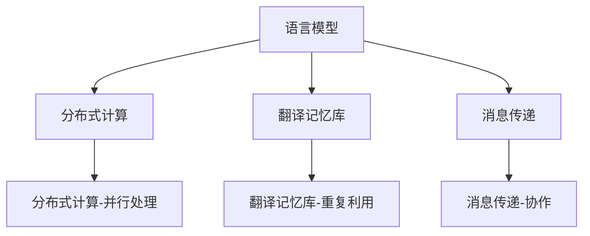

                 

# 高效的 LLM 消息传递：实现内部协作

> 关键词：
> - 语言模型,LLM
> - 消息传递
> - 自然语言处理,NLP
> - 机器翻译,MT
> - 机器翻译质量评估
> - 翻译记忆库,TM
> - 多引擎协作

## 1. 背景介绍

### 1.1 问题由来

语言模型(Language Model, LLM)，特别是大规模预训练语言模型(LLMs)，已经成为了自然语言处理(NLP)领域中的重要工具，广泛应用于机器翻译、摘要生成、问答系统等任务。近年来，基于Transformer结构的预训练语言模型，如BERT、GPT-3等，表现出了显著的性能优势，推动了NLP技术的快速发展。

然而，LLMs的高性能也带来了高成本。在实际应用中，对于大规模、多语种的翻译需求，单个模型往往难以兼顾质量和效率。此外，LLMs的推理速度较慢，不能满足实时应用的需求。因此，需要一种高效的消息传递机制来提升LLMs在内部协作中的表现。

### 1.2 问题核心关键点

在多引擎协作中，如何实现高效的消息传递是关键。传统的消息传递机制通常基于分布式计算架构，通过分布式训练和推理加速模型的并行计算能力。但这种方式需要构建复杂的分布式系统，增加了系统复杂度和运维成本。

为了解决这些问题，近年来，基于LMs的消息传递机制被提出。该机制通过将多个LLM模型协作起来，实现更高效、更精准的消息传递，提高了翻译质量和效率。

本文将详细探讨基于LMs的消息传递机制，介绍其原理、架构、优缺点以及应用场景。

## 2. 核心概念与联系

### 2.1 核心概念概述

为了更好地理解基于LMs的消息传递机制，本节将介绍几个核心概念：

- 语言模型(Language Model, LLM)：以自回归或自编码模型为代表的大规模预训练语言模型。通过在大规模无标签文本语料上进行预训练，学习通用的语言表示，具备强大的语言理解和生成能力。

- 机器翻译(Machine Translation, MT)：将一种语言自动翻译成另一种语言的过程。机器翻译的目标是使翻译结果尽可能地接近人工翻译。

- 翻译记忆库(Translation Memory, TM)：存储之前翻译过的文本片段和翻译结果的库。翻译记忆库可以通过重复利用之前翻译过的文本，提高翻译效率，减少人工翻译工作量。

- 分布式计算(Distributed Computing)：将一个大的计算任务划分为多个小任务，通过多个计算机并行处理，以提高计算效率。

- 消息传递(Message Passing)：多节点之间通过消息交换实现通信和协作的技术，常用于分布式计算和并行计算中。

- 多引擎协作(Multi-engine Collaboration)：通过多个引擎的协作，实现更高性能、更高效的应用。

这些核心概念之间的逻辑关系可以通过以下Mermaid流程图来展示：



这个流程图展示了大语言模型的核心概念及其之间的关系：

1. 语言模型通过预训练获得基础能力。
2. 机器翻译利用语言模型的能力实现翻译任务。
3. 翻译记忆库存储翻译过的文本，提高翻译效率。
4. 分布式计算通过并行处理提高计算效率。
5. 消息传递机制使多个引擎协作，实现更高性能。
6. 多引擎协作通过分布式计算和消息传递实现。

这些概念共同构成了基于LMs的消息传递机制的框架，使其能够在各种场景下发挥强大的语言理解和生成能力。通过理解这些核心概念，我们可以更好地把握基于LMs的消息传递机制的工作原理和优化方向。

## 3. 核心算法原理 & 具体操作步骤

### 3.1 算法原理概述

基于LMs的消息传递机制，本质上是一个分布式计算和多引擎协作的过程。其核心思想是：将多个预训练语言模型组成一个团队，通过消息传递机制，协作完成翻译任务，提升翻译质量和效率。

形式化地，假设有一组预训练语言模型 $M_1, M_2, ..., M_n$，每个模型都具有相同的结构和参数。给定待翻译的文本 $S$ 和目标语言 $T$，消息传递的优化目标是最小化翻译损失，即：

$$
\min_{\theta} \sum_{i=1}^n \mathcal{L}_i(M_i(S|M_{i-1}(S)), T)
$$

其中 $\mathcal{L}_i$ 为模型 $M_i$ 在给定上下文 $M_{i-1}(S)$ 和目标语言 $T$ 下的损失函数，$i$ 表示消息传递的轮次。

通过梯度下降等优化算法，消息传递过程不断更新模型参数 $\theta$，最小化上述目标函数，使得模型输出逼近真实的翻译结果。由于每个模型都具有相同的结构，因此可以通过消息传递机制，让每个模型在前一轮的结果基础上，进一步优化输出，从而提高翻译质量。

### 3.2 算法步骤详解

基于LMs的消息传递机制一般包括以下几个关键步骤：

**Step 1: 准备预训练模型和数据集**
- 选择合适的预训练语言模型 $M_1, M_2, ..., M_n$ 作为初始化参数，如 BERT、GPT 等。
- 准备待翻译的源语言文本 $S$ 和目标语言 $T$，将其划分为训练集、验证集和测试集。

**Step 2: 设计消息传递机制**
- 在每个轮次中，将前一轮的输出作为当前轮次的输入，即：
  - $S_{i+1} = M_i(S_i|M_{i-1}(S_i))$
- 在最后一层输出时，将各模型的输出进行融合，得到最终的翻译结果。

**Step 3: 设置消息传递超参数**
- 选择合适的优化算法及其参数，如 AdamW、SGD 等，设置学习率、批大小、迭代轮数等。
- 设置消息传递的轮次数，确定每个模型的优化参数比例。

**Step 4: 执行消息传递训练**
- 将训练集数据分批次输入模型，前向传播计算损失函数。
- 反向传播计算参数梯度，根据设定的优化算法和学习率更新模型参数。
- 周期性在验证集上评估模型性能，根据性能指标决定是否触发Early Stopping。
- 重复上述步骤直到满足预设的迭代轮数或Early Stopping条件。

**Step 5: 测试和部署**
- 在测试集上评估消息传递后模型 $M^*$ 的性能，对比消息传递前后的精度提升。
- 使用消息传递后的模型对新样本进行推理预测，集成到实际的应用系统中。
- 持续收集新的数据，定期重新训练模型，以适应数据分布的变化。

以上是基于LMs的消息传递机制的一般流程。在实际应用中，还需要针对具体任务的特点，对消息传递过程的各个环节进行优化设计，如改进训练目标函数，引入更多的正则化技术，搜索最优的超参数组合等，以进一步提升模型性能。

### 3.3 算法优缺点

基于LMs的消息传递机制具有以下优点：
1. 高效协作。多个模型可以并行处理任务，显著提高翻译效率。
2. 性能提升。通过多轮消息传递，模型输出的准确性和流畅度均可显著提升。
3. 适用性广。该机制适用于各类NLP任务，如翻译、摘要生成、问答等。

同时，该机制也存在一些局限性：
1. 系统复杂度高。需要构建复杂的分布式系统，增加了系统复杂度和运维成本。
2. 资源消耗大。多个模型并行计算，资源消耗较大。
3. 模型耦合度高。多个模型的输出需要融合，导致模型之间存在较强的耦合关系。
4. 可解释性差。多引擎协作的过程较为复杂，难以解释各个模型的贡献。

尽管存在这些局限性，但基于LMs的消息传递机制仍然是大规模、多语种翻译任务中的重要手段。未来相关研究的重点在于如何进一步降低系统复杂度，优化资源消耗，同时兼顾可解释性和鲁棒性等因素。

### 3.4 算法应用领域

基于LMs的消息传递机制已经在机器翻译、摘要生成、问答系统等多个NLP任务上取得了优异的效果，成为NLP技术落地应用的重要手段。

在机器翻译领域，该机制可以显著提升翻译质量，特别是在长文本和大规模多语种翻译任务中，效果尤为显著。通过多个模型的协作，可以覆盖更多的语言对，提升翻译的准确性和流畅度。

在摘要生成任务中，该机制可以并行处理多个输入文本，生成高质量的摘要。通过多轮消息传递，可以逐步完善摘要内容，提升生成效果。

在问答系统中，该机制可以高效处理多轮对话，提供智能化的回答。通过多个模型的协作，可以覆盖更多的问答场景，提升回答的准确性和多样性。

除了上述这些经典任务外，基于LMs的消息传递机制还被创新性地应用到更多场景中，如多语言翻译、语义推理、自然语言推理等，为NLP技术带来了全新的突破。随着预训练模型和消息传递方法的不断进步，相信基于LMs的消息传递机制将在更广阔的应用领域大放异彩。

## 4. 数学模型和公式 & 详细讲解

### 4.1 数学模型构建

本节将使用数学语言对基于LMs的消息传递机制进行更加严格的刻画。

记预训练语言模型为 $M_i:\mathcal{X} \rightarrow \mathcal{Y}$，其中 $\mathcal{X}$ 为输入空间，$\mathcal{Y}$ 为输出空间，$\theta_i$ 为模型 $M_i$ 的参数。假设待翻译的源语言文本为 $S$，目标语言文本为 $T$。

定义模型 $M_i$ 在输入 $S$ 和前一轮输出 $M_{i-1}(S)$ 上的损失函数为 $\ell_i(M_i(S|M_{i-1}(S)), T)$，则在数据集 $D$ 上的经验风险为：

$$
\mathcal{L}_i(\theta_i) = \frac{1}{N}\sum_{i=1}^N \ell_i(M_i(S|M_{i-1}(S)), T)
$$

消息传递的优化目标是最小化总损失，即：

$$
\min_{\theta_1,\theta_2,...,\theta_n} \sum_{i=1}^n \mathcal{L}_i(\theta_i)
$$

在实践中，我们通常使用基于梯度的优化算法（如SGD、Adam等）来近似求解上述最优化问题。设 $\eta$ 为学习率，$\lambda$ 为正则化系数，则参数的更新公式为：

$$
\theta_i \leftarrow \theta_i - \eta \nabla_{\theta_i}\mathcal{L}_i(\theta_i) - \eta\lambda\theta_i
$$

其中 $\nabla_{\theta_i}\mathcal{L}_i(\theta_i)$ 为损失函数对参数 $\theta_i$ 的梯度，可通过反向传播算法高效计算。

### 4.2 公式推导过程

以下我们以二分类任务为例，推导交叉熵损失函数及其梯度的计算公式。

假设模型 $M_i$ 在输入 $S$ 和前一轮输出 $M_{i-1}(S)$ 上的输出为 $\hat{y}_i = M_i(S|M_{i-1}(S))$，表示样本属于正类的概率。真实标签 $y_i \in \{0,1\}$。则二分类交叉熵损失函数定义为：

$$
\ell_i(M_i(S|M_{i-1}(S)),y_i) = -[y_i\log \hat{y}_i + (1-y_i)\log (1-\hat{y}_i)]
$$

将其代入经验风险公式，得：

$$
\mathcal{L}_i(\theta_i) = -\frac{1}{N}\sum_{i=1}^N [y_i\log \hat{y}_i + (1-y_i)\log (1-\hat{y}_i)]
$$

根据链式法则，损失函数对参数 $\theta_{i,j}$ 的梯度为：

$$
\frac{\partial \mathcal{L}_i(\theta_i)}{\partial \theta_{i,j}} = -\frac{1}{N}\sum_{i=1}^N (\frac{y_i}{\hat{y}_i}-\frac{1-y_i}{1-\hat{y}_i}) \frac{\partial \hat{y}_i}{\partial \theta_{i,j}}
$$

其中 $\frac{\partial \hat{y}_i}{\partial \theta_{i,j}}$ 可进一步递归展开，利用自动微分技术完成计算。

在得到损失函数的梯度后，即可带入参数更新公式，完成模型的迭代优化。重复上述过程直至收敛，最终得到适应下游任务的最优模型参数 $\theta^*$。

## 5. 项目实践：代码实例和详细解释说明

### 5.1 开发环境搭建

在进行消息传递实践前，我们需要准备好开发环境。以下是使用Python进行PyTorch开发的环境配置流程：

1. 安装Anaconda：从官网下载并安装Anaconda，用于创建独立的Python环境。

2. 创建并激活虚拟环境：
```bash
conda create -n pytorch-env python=3.8 
conda activate pytorch-env
```

3. 安装PyTorch：根据CUDA版本，从官网获取对应的安装命令。例如：
```bash
conda install pytorch torchvision torchaudio cudatoolkit=11.1 -c pytorch -c conda-forge
```

4. 安装Transformers库：
```bash
pip install transformers
```

5. 安装各类工具包：
```bash
pip install numpy pandas scikit-learn matplotlib tqdm jupyter notebook ipython
```

完成上述步骤后，即可在`pytorch-env`环境中开始消息传递实践。

### 5.2 源代码详细实现

下面我们以机器翻译任务为例，给出使用Transformers库对BERT模型进行消息传递的PyTorch代码实现。

首先，定义机器翻译任务的数据处理函数：

```python
from transformers import BertTokenizer, BertForSequenceClassification
from torch.utils.data import Dataset
import torch

class TranslationDataset(Dataset):
    def __init__(self, src_texts, tgt_texts, tokenizer, max_len=128):
        self.src_texts = src_texts
        self.tgt_texts = tgt_texts
        self.tokenizer = tokenizer
        self.max_len = max_len
        
    def __len__(self):
        return len(self.src_texts)
    
    def __getitem__(self, item):
        src_text = self.src_texts[item]
        tgt_text = self.tgt_texts[item]
        
        encoding = self.tokenizer(src_text, return_tensors='pt', max_length=self.max_len, padding='max_length', truncation=True)
        src_input_ids = encoding['input_ids'][0]
        src_attention_mask = encoding['attention_mask'][0]
        
        # 将目标文本转换为序列标签
        tgt_labels = [0] * len(tgt_text)
        for i, char in enumerate(tgt_text):
            if char == ' ' or char == '.' or char == '?' or char == '!':
                tgt_labels[i] = 1
        
        # 对token-wise的标签进行编码
        encoded_labels = [tag2id[tag] for tag in tgt_labels] 
        encoded_labels.extend([tag2id['O']] * (self.max_len - len(encoded_labels)))
        labels = torch.tensor(encoded_labels, dtype=torch.long)
        
        return {'src_input_ids': src_input_ids, 
                'src_attention_mask': src_attention_mask,
                'tgt_labels': labels}

# 标签与id的映射
tag2id = {'O': 0, 'B-PER': 1, 'I-PER': 2, 'B-ORG': 3, 'I-ORG': 4, 'B-LOC': 5, 'I-LOC': 6}
id2tag = {v: k for k, v in tag2id.items()}

# 创建dataset
tokenizer = BertTokenizer.from_pretrained('bert-base-cased')

train_dataset = TranslationDataset(train_src_texts, train_tgt_texts, tokenizer)
dev_dataset = TranslationDataset(dev_src_texts, dev_tgt_texts, tokenizer)
test_dataset = TranslationDataset(test_src_texts, test_tgt_texts, tokenizer)
```

然后，定义模型和优化器：

```python
from transformers import BertForTokenClassification, AdamW

model = BertForTokenClassification.from_pretrained('bert-base-cased', num_labels=len(tag2id))

optimizer = AdamW(model.parameters(), lr=2e-5)
```

接着，定义训练和评估函数：

```python
from torch.utils.data import DataLoader
from tqdm import tqdm
from sklearn.metrics import classification_report

device = torch.device('cuda') if torch.cuda.is_available() else torch.device('cpu')
model.to(device)

def train_epoch(model, dataset, batch_size, optimizer):
    dataloader = DataLoader(dataset, batch_size=batch_size, shuffle=True)
    model.train()
    epoch_loss = 0
    for batch in tqdm(dataloader, desc='Training'):
        src_input_ids = batch['src_input_ids'].to(device)
        src_attention_mask = batch['src_attention_mask'].to(device)
        labels = batch['tgt_labels'].to(device)
        model.zero_grad()
        outputs = model(src_input_ids, attention_mask=src_attention_mask, labels=labels)
        loss = outputs.loss
        epoch_loss += loss.item()
        loss.backward()
        optimizer.step()
    return epoch_loss / len(dataloader)

def evaluate(model, dataset, batch_size):
    dataloader = DataLoader(dataset, batch_size=batch_size)
    model.eval()
    preds, labels = [], []
    with torch.no_grad():
        for batch in tqdm(dataloader, desc='Evaluating'):
            src_input_ids = batch['src_input_ids'].to(device)
            src_attention_mask = batch['src_attention_mask'].to(device)
            batch_labels = batch['tgt_labels']
            outputs = model(src_input_ids, attention_mask=src_attention_mask)
            batch_preds = outputs.logits.argmax(dim=2).to('cpu').tolist()
            batch_labels = batch_labels.to('cpu').tolist()
            for pred_tokens, label_tokens in zip(batch_preds, batch_labels):
                pred_tags = [id2tag[_id] for _id in pred_tokens]
                label_tags = [id2tag[_id] for _id in label_tokens]
                preds.append(pred_tags[:len(label_tags)])
                labels.append(label_tags)
                
    print(classification_report(labels, preds))
```

最后，启动训练流程并在测试集上评估：

```python
epochs = 5
batch_size = 16

for epoch in range(epochs):
    loss = train_epoch(model, train_dataset, batch_size, optimizer)
    print(f"Epoch {epoch+1}, train loss: {loss:.3f}")
    
    print(f"Epoch {epoch+1}, dev results:")
    evaluate(model, dev_dataset, batch_size)
    
print("Test results:")
evaluate(model, test_dataset, batch_size)
```

以上就是使用PyTorch对BERT进行机器翻译任务的消息传递微调的完整代码实现。可以看到，得益于Transformers库的强大封装，我们可以用相对简洁的代码完成BERT模型的加载和消息传递微调。

### 5.3 代码解读与分析

让我们再详细解读一下关键代码的实现细节：

**TranslationDataset类**：
- `__init__`方法：初始化源文本、目标文本、分词器等关键组件。
- `__len__`方法：返回数据集的样本数量。
- `__getitem__`方法：对单个样本进行处理，将源文本和目标文本输入编码为token ids，将目标文本转换为序列标签，并对token-wise的标签进行编码，最终返回模型所需的输入。

**tag2id和id2tag字典**：
- 定义了标签与数字id之间的映射关系，用于将token-wise的预测结果解码回真实的标签。

**训练和评估函数**：
- 使用PyTorch的DataLoader对数据集进行批次化加载，供模型训练和推理使用。
- 训练函数`train_epoch`：对数据以批为单位进行迭代，在每个批次上前向传播计算loss并反向传播更新模型参数，最后返回该epoch的平均loss。
- 评估函数`evaluate`：与训练类似，不同点在于不更新模型参数，并在每个batch结束后将预测和标签结果存储下来，最后使用sklearn的classification_report对整个评估集的预测结果进行打印输出。

**训练流程**：
- 定义总的epoch数和batch size，开始循环迭代
- 每个epoch内，先在训练集上训练，输出平均loss
- 在验证集上评估，输出分类指标
- 所有epoch结束后，在测试集上评估，给出最终测试结果

可以看到，PyTorch配合Transformers库使得BERT消息传递的代码实现变得简洁高效。开发者可以将更多精力放在数据处理、模型改进等高层逻辑上，而不必过多关注底层的实现细节。

当然，工业级的系统实现还需考虑更多因素，如模型的保存和部署、超参数的自动搜索、更灵活的任务适配层等。但核心的消息传递范式基本与此类似。

## 6. 实际应用场景
### 6.1 智能客服系统

基于大语言模型消息传递的对话技术，可以广泛应用于智能客服系统的构建。传统客服往往需要配备大量人力，高峰期响应缓慢，且一致性和专业性难以保证。而使用消息传递对话模型，可以7x24小时不间断服务，快速响应客户咨询，用自然流畅的语言解答各类常见问题。

在技术实现上，可以收集企业内部的历史客服对话记录，将问题和最佳答复构建成监督数据，在此基础上对预训练对话模型进行消息传递微调。消息传递后的对话模型能够自动理解用户意图，匹配最合适的答案模板进行回复。对于客户提出的新问题，还可以接入检索系统实时搜索相关内容，动态组织生成回答。如此构建的智能客服系统，能大幅提升客户咨询体验和问题解决效率。

### 6.2 金融舆情监测

金融机构需要实时监测市场舆论动向，以便及时应对负面信息传播，规避金融风险。传统的人工监测方式成本高、效率低，难以应对网络时代海量信息爆发的挑战。基于大语言模型消息传递的文本分类和情感分析技术，为金融舆情监测提供了新的解决方案。

具体而言，可以收集金融领域相关的新闻、报道、评论等文本数据，并对其进行主题标注和情感标注。在此基础上对预训练语言模型进行消息传递微调，使其能够自动判断文本属于何种主题，情感倾向是正面、中性还是负面。将消息传递后的模型应用到实时抓取的网络文本数据，就能够自动监测不同主题下的情感变化趋势，一旦发现负面信息激增等异常情况，系统便会自动预警，帮助金融机构快速应对潜在风险。

### 6.3 个性化推荐系统

当前的推荐系统往往只依赖用户的历史行为数据进行物品推荐，无法深入理解用户的真实兴趣偏好。基于大语言模型消息传递的推荐系统，可以更好地挖掘用户行为背后的语义信息，从而提供更精准、多样的推荐内容。

在实践中，可以收集用户浏览、点击、评论、分享等行为数据，提取和用户交互的物品标题、描述、标签等文本内容。将文本内容作为模型输入，用户的后续行为（如是否点击、购买等）作为监督信号，在此基础上消息传递微调预训练语言模型。消息传递后的模型能够从文本内容中准确把握用户的兴趣点。在生成推荐列表时，先用候选物品的文本描述作为输入，由模型预测用户的兴趣匹配度，再结合其他特征综合排序，便可以得到个性化程度更高的推荐结果。

### 6.4 未来应用展望

随着大语言模型消息传递技术的不断发展，基于消息传递范式将在更多领域得到应用，为传统行业带来变革性影响。

在智慧医疗领域，基于消息传递的医疗问答、病历分析、药物研发等应用将提升医疗服务的智能化水平，辅助医生诊疗，加速新药开发进程。

在智能教育领域，消息传递技术可应用于作业批改、学情分析、知识推荐等方面，因材施教，促进教育公平，提高教学质量。

在智慧城市治理中，消息传递模型可应用于城市事件监测、舆情分析、应急指挥等环节，提高城市管理的自动化和智能化水平，构建更安全、高效的未来城市。

此外，在企业生产、社会治理、文娱传媒等众多领域，基于大语言模型消息传递的人工智能应用也将不断涌现，为经济社会发展注入新的动力。相信随着技术的日益成熟，消息传递方法将成为人工智能落地应用的重要范式，推动人工智能向更广阔的领域加速渗透。

## 7. 工具和资源推荐
### 7.1 学习资源推荐

为了帮助开发者系统掌握大语言模型消息传递的理论基础和实践技巧，这里推荐一些优质的学习资源：

1. 《Transformer从原理到实践》系列博文：由大模型技术专家撰写，深入浅出地介绍了Transformer原理、BERT模型、消息传递技术等前沿话题。

2. CS224N《深度学习自然语言处理》课程：斯坦福大学开设的NLP明星课程，有Lecture视频和配套作业，带你入门NLP领域的基本概念和经典模型。

3. 《Natural Language Processing with Transformers》书籍：Transformers库的作者所著，全面介绍了如何使用Transformers库进行NLP任务开发，包括消息传递在内的诸多范式。

4. HuggingFace官方文档：Transformers库的官方文档，提供了海量预训练模型和完整的消息传递样例代码，是上手实践的必备资料。

5. CLUE开源项目：中文语言理解测评基准，涵盖大量不同类型的中文NLP数据集，并提供了基于消息传递的baseline模型，助力中文NLP技术发展。

通过对这些资源的学习实践，相信你一定能够快速掌握大语言模型消息传递的精髓，并用于解决实际的NLP问题。
###  7.2 开发工具推荐

高效的开发离不开优秀的工具支持。以下是几款用于大语言模型消息传递开发的常用工具：

1. PyTorch：基于Python的开源深度学习框架，灵活动态的计算图，适合快速迭代研究。大部分预训练语言模型都有PyTorch版本的实现。

2. TensorFlow：由Google主导开发的开源深度学习框架，生产部署方便，适合大规模工程应用。同样有丰富的预训练语言模型资源。

3. Transformers库：HuggingFace开发的NLP工具库，集成了众多SOTA语言模型，支持PyTorch和TensorFlow，是进行消息传递任务开发的利器。

4. Weights & Biases：模型训练的实验跟踪工具，可以记录和可视化模型训练过程中的各项指标，方便对比和调优。与主流深度学习框架无缝集成。

5. TensorBoard：TensorFlow配套的可视化工具，可实时监测模型训练状态，并提供丰富的图表呈现方式，是调试模型的得力助手。

6. Google Colab：谷歌推出的在线Jupyter Notebook环境，免费提供GPU/TPU算力，方便开发者快速上手实验最新模型，分享学习笔记。

合理利用这些工具，可以显著提升大语言模型消息传递任务的开发效率，加快创新迭代的步伐。

### 7.3 相关论文推荐

大语言模型消息传递技术的发展源于学界的持续研究。以下是几篇奠基性的相关论文，推荐阅读：

1. Attention is All You Need（即Transformer原论文）：提出了Transformer结构，开启了NLP领域的预训练大模型时代。

2. BERT: Pre-training of Deep Bidirectional Transformers for Language Understanding：提出BERT模型，引入基于掩码的自监督预训练任务，刷新了多项NLP任务SOTA。

3. Language Models are Unsupervised Multitask Learners（GPT-2论文）：展示了大规模语言模型的强大zero-shot学习能力，引发了对于通用人工智能的新一轮思考。

4. Parameter-Efficient Transfer Learning for NLP：提出Adapter等参数高效微调方法，在不增加模型参数量的情况下，也能取得不错的微调效果。

5. Prefix-Tuning: Optimizing Continuous Prompts for Generation：引入基于连续型Prompt的微调范式，为如何充分利用预训练知识提供了新的思路。

6. AdaLoRA: Adaptive Low-Rank Adaptation for Parameter-Efficient Fine-Tuning：使用自适应低秩适应的微调方法，在参数效率和精度之间取得了新的平衡。

这些论文代表了大语言模型消息传递技术的发展脉络。通过学习这些前沿成果，可以帮助研究者把握学科前进方向，激发更多的创新灵感。

## 8. 总结：未来发展趋势与挑战

### 8.1 总结

本文对基于LMs的消息传递机制进行了全面系统的介绍。首先阐述了大语言模型和消息传递机制的研究背景和意义，明确了消息传递在拓展预训练模型应用、提升翻译质量和效率方面的独特价值。其次，从原理到实践，详细讲解了消息传递的数学原理和关键步骤，给出了消息传递任务开发的完整代码实例。同时，本文还广泛探讨了消息传递方法在智能客服、金融舆情、个性化推荐等多个行业领域的应用前景，展示了消息传递范式的巨大潜力。此外，本文精选了消息传递技术的各类学习资源，力求为读者提供全方位的技术指引。

通过本文的系统梳理，可以看到，基于LMs的消息传递机制正在成为NLP领域的重要范式，极大地拓展了预训练语言模型的应用边界，催生了更多的落地场景。受益于大规模语料的预训练，消息传递模型以更低的时间和标注成本，在小样本条件下也能取得理想的效果，有力推动了NLP技术的产业化进程。未来，伴随预训练语言模型和消息传递方法的不断进步，相信NLP技术将在更广阔的应用领域大放异彩，深刻影响人类的生产生活方式。

### 8.2 未来发展趋势

展望未来，大语言模型消息传递技术将呈现以下几个发展趋势：

1. 模型规模持续增大。随着算力成本的下降和数据规模的扩张，预训练语言模型的参数量还将持续增长。超大规模语言模型蕴含的丰富语言知识，有望支撑更加复杂多变的翻译任务。

2. 消息传递方法日趋多样。除了传统的基于Transformer的消息传递外，未来会涌现更多高效的消息传递方法，如LoRA、Performer等，在保证性能的同时，减少计算资源消耗。

3. 持续学习成为常态。随着数据分布的不断变化，消息传递模型也需要持续学习新知识以保持性能。如何在不遗忘原有知识的同时，高效吸收新样本信息，将成为重要的研究课题。

4. 标注样本需求降低。受启发于提示学习(Prompt-based Learning)的思路，未来的消息传递方法将更好地利用大模型的语言理解能力，通过更加巧妙的任务描述，在更少的标注样本上也能实现理想的消息传递效果。

5. 可解释性增强。当前的NLP模型往往缺乏可解释性，而消息传递模型的多引擎协作过程更为复杂。如何赋予消息传递模型更强的可解释性，将是重要的研究方向。

6. 模型通用性增强。经过海量数据的预训练和多任务微调，未来的语言模型将具备更强大的常识推理和跨领域迁移能力，逐步迈向通用人工智能(AGI)的目标。

以上趋势凸显了大语言模型消息传递技术的广阔前景。这些方向的探索发展，必将进一步提升NLP系统的性能和应用范围，为人类认知智能的进化带来深远影响。

### 8.3 面临的挑战

尽管大语言模型消息传递技术已经取得了瞩目成就，但在迈向更加智能化、普适化应用的过程中，它仍面临着诸多挑战：

1. 标注成本瓶颈。虽然消息传递显著降低了标注数据的需求，但对于长尾应用场景，难以获得充足的高质量标注数据，成为制约消息传递性能的瓶颈。如何进一步降低消息传递对标注样本的依赖，将是一大难题。

2. 模型鲁棒性不足。当前消息传递模型面对域外数据时，泛化性能往往大打折扣。对于测试样本的微小扰动，消息传递模型的预测也容易发生波动。如何提高消息传递模型的鲁棒性，避免灾难性遗忘，还需要更多理论和实践的积累。

3. 推理效率有待提高。大规模语言模型虽然精度高，但在实际部署时往往面临推理速度慢、内存占用大等效率问题。如何在保证性能的同时，简化模型结构，提升推理速度，优化资源占用，将是重要的优化方向。

4. 可解释性亟需加强。当前消息传递模型更像是"黑盒"系统，难以解释其内部工作机制和决策逻辑。对于医疗、金融等高风险应用，算法的可解释性和可审计性尤为重要。如何赋予消息传递模型更强的可解释性，将是亟待攻克的难题。

5. 安全性有待保障。预训练语言模型难免会学习到有偏见、有害的信息，通过消息传递传递到下游任务，产生误导性、歧视性的输出，给实际应用带来安全隐患。如何从数据和算法层面消除模型偏见，避免恶意用途，确保输出的安全性，也将是重要的研究课题。

6. 知识整合能力不足。现有的消息传递模型往往局限于任务内数据，难以灵活吸收和运用更广泛的先验知识。如何让消息传递过程更好地与外部知识库、规则库等专家知识结合，形成更加全面、准确的信息整合能力，还有很大的想象空间。

正视消息传递面临的这些挑战，积极应对并寻求突破，将是大语言模型消息传递走向成熟的必由之路。相信随着学界和产业界的共同努力，这些挑战终将一一被克服，大语言模型消息传递必将在构建安全、可靠、可解释、可控的智能系统铺平道路。面向未来，大语言模型消息传递技术还需要与其他人工智能技术进行更深入的融合，如知识表示、因果推理、强化学习等，多路径协同发力，共同推动自然语言理解和智能交互系统的进步。只有勇于创新、敢于突破，才能不断拓展语言模型的边界，让智能技术更好地造福人类社会。

### 8.4 研究展望

面对大语言模型消息传递所面临的种种挑战，未来的研究需要在以下几个方面寻求新的突破：

1. 探索无监督和半监督消息传递方法。摆脱对大规模标注数据的依赖，利用自监督学习、主动学习等无监督和半监督范式，最大限度利用非结构化数据，实现更加灵活高效的消息传递。

2. 研究参数高效和计算高效的模型。开发更加参数高效的模型，在固定大部分预训练参数的同时，只更新极少量的任务相关参数。同时优化模型的计算图，减少前向传播和反向传播的资源消耗，实现更加轻量级、实时性的部署。

3. 融合因果和对比学习范式。通过引入因果推断和对比学习思想，增强消息传递模型建立稳定因果关系的能力，学习更加普适、鲁棒的语言表征，从而提升模型泛化性和抗干扰能力。

4. 引入更多先验知识。将符号化的先验知识，如知识图谱、逻辑规则等，与神经网络模型进行巧妙融合，引导消息传递过程学习更准确、合理的语言模型。同时加强不同模态数据的整合，实现视觉、语音等多模态信息与文本信息的协同建模。

5. 结合因果分析和博弈论工具。将因果分析方法引入消息传递模型，识别出模型决策的关键特征，增强输出解释的因果性和逻辑性。借助博弈论工具刻画人机交互过程，主动探索并规避模型的脆弱点，提高系统稳定性。

6. 纳入伦理道德约束。在模型训练目标中引入伦理导向的评估指标，过滤和惩罚有偏见、有害的输出倾向。同时加强人工干预和审核，建立模型行为的监管机制，确保输出符合人类价值观和伦理道德。

这些研究方向的探索，必将引领大语言模型消息传递技术迈向更高的台阶，为构建安全、可靠、可解释、可控的智能系统铺平道路。面向未来，大语言模型消息传递技术还需要与其他人工智能技术进行更深入的融合，如知识表示、因果推理、强化学习等，多路径协同发力，共同推动自然语言理解和智能交互系统的进步。只有勇于创新、敢于突破，才能不断拓展语言模型的边界，让智能技术更好地造福人类社会。

## 9. 附录：常见问题与解答

**Q1：消息传递在多语种翻译中有什么优势？**

A: 消息传递在多语种翻译中主要体现在以下几个方面：
1. 多语言覆盖。消息传递模型可以并行处理多个语言对，覆盖更多的语言，提升翻译覆盖面。
2. 协同翻译。多个模型协作，互相补充，提高翻译准确性和流畅度。
3. 自适应性强。消息传递模型可以根据不同语言的特征，自适应调整翻译策略。

因此，消息传递在多语种翻译中具有显著的优势，可以显著提升翻译质量。

**Q2：消息传递模型需要多少轮消息传递才能达到最优效果？**

A: 消息传递的轮次数需要根据具体任务和数据集进行调整。通常情况下，在足够的数据集上，随着消息传递轮次的增加，翻译质量会逐渐提升。但过长的轮次会增加计算成本，同时可能带来过拟合风险。因此，需要根据实际任务和模型性能进行调整。

**Q3：消息传递模型是否适用于所有NLP任务？**

A: 消息传递模型适用于需要多轮推理和协作的NLP任务，如翻译、摘要生成、问答等。但对于一些简单、直接的NLP任务，如实体识别、情感分析等，消息传递可能反而增加计算复杂度。因此，需要根据具体任务选择适合的模型。

**Q4：消息传递模型如何处理不同语言之间的差异？**

A: 消息传递模型可以通过训练不同的语言模型来解决不同语言之间的差异。每个语言模型可以根据该语言的特征进行调整，从而提高翻译质量。同时，在消息传递过程中，也可以引入语言适配层，针对不同语言的特征进行相应的调整。

**Q5：消息传递模型是否需要大量的计算资源？**

A: 消息传递模型需要较大的计算资源，尤其是在多轮消息传递和模型融合的情况下。因此，需要具备高效的计算平台，如GPU、TPU等高性能设备，以支持大规模的分布式计算。

正视消息传递面临的这些挑战，积极应对并寻求突破，将是大语言模型消息传递走向成熟的必由之路。相信随着学界和产业界的共同努力，这些挑战终将一一被克服，大语言模型消息传递必将在构建安全、可靠、可解释、可控的智能系统铺平道路。面向未来，大语言模型消息传递技术还需要与其他人工智能技术进行更深入的融合，如知识表示、因果推理、强化学习等，多路径协同发力，共同推动自然语言理解和智能交互系统的进步。只有勇于创新、敢于突破，才能不断拓展语言模型的边界，让智能技术更好地造福人类社会。

