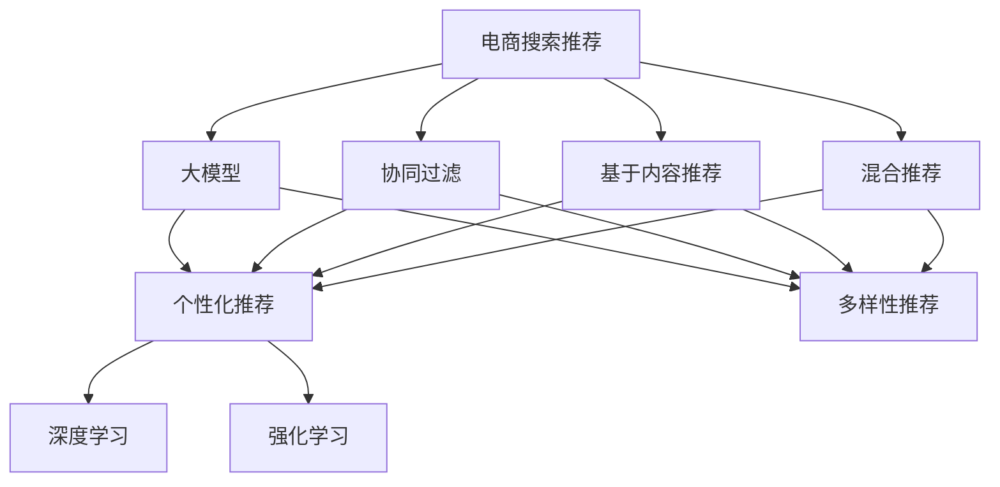

                 

# AI 大模型在电商搜索推荐中的优化策略：个性化与多样性的平衡

> 关键词：电商搜索推荐, 大模型, 个性化, 多样性, 深度学习, 强化学习, 协同过滤, 推荐系统

## 1. 背景介绍

### 1.1 问题由来
电商搜索推荐系统是互联网电商企业的核心业务之一，通过推荐算法为用户推荐个性化商品，从而提升用户体验和转化率，增加企业收益。目前常用的推荐算法包括协同过滤、基于内容的推荐、混合推荐等，但都存在不同程度的问题。例如，协同过滤算法可能会受到数据稀疏性和冷启动问题的困扰；基于内容的推荐则忽视了用户的多样化需求；混合推荐算法虽然综合了多种算法优点，但过度依赖人工特征工程，难以适应数据快速变化。

随着深度学习和强化学习技术的兴起，利用大模型进行推荐系统优化成为新的研究热点。大模型如BERT、GPT等，通过大规模预训练学习到丰富的语义知识，在处理自然语言文本方面具有天然优势。结合电商搜索推荐任务，大模型可以挖掘商品描述、用户评论等文本信息中的语义特征，为用户生成个性化推荐。但同时，大模型也带来了新的挑战，如模型复杂度提升、训练成本增加、泛化性能不稳定等问题。

因此，如何在电商搜索推荐中充分利用大模型的优势，同时平衡个性化和多样性，成为当前亟待解决的重要问题。本文将从算法原理、操作流程、应用场景等多个角度，详细介绍AI大模型在电商搜索推荐中的优化策略，帮助开发者构建更加高效、精准、可解释的推荐系统。

## 2. 核心概念与联系

### 2.1 核心概念概述

为更好地理解AI大模型在电商搜索推荐中的应用，本文将介绍几个关键概念：

- **电商搜索推荐**：电商网站中的一种推荐服务，根据用户浏览行为、搜索历史、购买记录等信息，为用户推荐相关商品。推荐结果应具备个性化、相关性、多样性等特性。
- **大模型**：指经过大规模预训练的语言模型，如BERT、GPT等，通过自动学习大量的自然语言文本数据，具有强大的语义理解能力。
- **推荐系统**：利用用户行为数据，为用户提供个性化推荐的服务系统。常见算法包括协同过滤、基于内容的推荐、混合推荐等。
- **个性化推荐**：根据用户历史行为、兴趣偏好，为用户推荐符合其需求的商品。
- **多样性推荐**：在个性化推荐的同时，兼顾用户多样化的需求，避免推荐结果过于单调。
- **深度学习**：利用多层神经网络结构，通过反向传播算法学习模型参数，实现对数据的深度特征提取。
- **强化学习**：利用奖励机制，通过不断试错优化推荐策略，提高推荐效果。

这些概念之间的逻辑关系可以通过以下Mermaid流程图来展示：



这个流程图展示了电商搜索推荐中几个关键推荐策略之间的关系：

1. 电商搜索推荐通过多种算法（协同过滤、基于内容、混合推荐），实现个性化和多样性的推荐。
2. 大模型在个性化和多样性推荐中起到了关键作用，能够通过语义理解提取商品和用户特征。
3. 深度学习和强化学习是大模型推荐中的重要优化手段，能够提高推荐系统的效果和可解释性。

## 3. 核心算法原理 & 具体操作步骤

### 3.1 算法原理概述

AI大模型在电商搜索推荐中的应用，本质上是将大模型作为推荐特征提取器，通过深度学习、强化学习等技术，优化推荐算法。其核心思想是：利用大模型的语义表示能力，提取商品和用户文本特征，结合多种推荐算法，生成个性化和多样性的推荐结果。

具体流程如下：

1. **数据预处理**：对电商网站中的商品描述、用户评论等文本数据进行清洗、分词、编码等预处理操作，以便大模型能够理解和处理。
2. **大模型特征提取**：利用预训练的大模型（如BERT、GPT），对处理后的文本数据进行特征提取，生成商品和用户的语义向量表示。
3. **个性化推荐**：结合用户历史行为、兴趣偏好等特征，利用深度学习或强化学习技术，生成个性化的推荐结果。
4. **多样性推荐**：根据个性化推荐结果，利用协同过滤、基于内容推荐等算法，增加推荐结果的多样性。
5. **推荐结果排序**：结合个性化和多样性推荐结果，利用排序算法（如降序排序），对推荐结果进行排序，生成最终推荐列表。

### 3.2 算法步骤详解

#### 3.2.1 数据预处理

电商搜索推荐的数据通常包括商品信息、用户行为、搜索记录等文本数据。为了便于大模型进行处理，需要对其进行以下预处理操作：

- **数据清洗**：去除数据中的噪声、特殊字符、重复信息等。
- **分词**：将文本数据分割成单词或词组，便于大模型理解。
- **编码**：将分词后的文本数据转换为模型能够处理的向量表示，通常使用one-hot编码、word2vec等方法。
- **特征工程**：提取文本中的重要特征，如关键词、主题等，用于后续的推荐算法。

#### 3.2.2 大模型特征提取

在大模型特征提取过程中，通常使用以下步骤：

1. **模型加载**：加载预训练的大模型，如BERT、GPT等。
2. **特征编码**：将处理后的文本数据输入大模型，得到商品的语义向量表示。
3. **用户编码**：同样对用户评论等文本数据进行编码，得到用户的语义向量表示。
4. **特征融合**：将商品和用户的语义向量进行融合，生成推荐特征向量。

#### 3.2.3 个性化推荐

在个性化推荐过程中，主要使用以下技术：

1. **深度学习**：利用神经网络模型，对用户历史行为、兴趣偏好等特征进行建模，生成个性化推荐结果。常用的模型包括RNN、CNN、Transformer等。
2. **强化学习**：利用奖励机制，通过不断试错优化推荐策略，提高推荐效果。常见的强化学习算法包括Q-learning、DQN等。
3. **用户画像建模**：利用用户画像技术，对用户进行分群、聚类等操作，生成更精细的用户特征。

#### 3.2.4 多样性推荐

为了增加推荐结果的多样性，通常使用以下算法：

1. **协同过滤**：根据用户的历史行为和兴趣偏好，推荐与其相似用户喜欢的商品。
2. **基于内容推荐**：根据商品的文本描述、标签等信息，推荐与用户兴趣相关的商品。
3. **标签推荐**：根据商品标签的分布情况，推荐具有多样化标签的商品。

#### 3.2.5 推荐结果排序

为了提高推荐结果的准确性和用户满意度，通常使用以下排序算法：

1. **降序排序**：将推荐结果按照相关性、受欢迎度、价格等指标进行降序排序。
2. **排序权重调整**：根据用户行为、商品属性等调整排序权重，优化推荐结果。
3. **推荐结果展示**：将推荐结果展示给用户，并在网页上动态更新。

### 3.3 算法优缺点

AI大模型在电商搜索推荐中的应用，具有以下优点：

1. **语义理解能力强**：大模型能够理解复杂的语义信息，提取商品和用户的深层次特征。
2. **适应性强**：大模型能够适应不同商品和用户的特征，提供个性化推荐。
3. **效果好**：结合多种推荐算法，能够生成高质量的推荐结果。
4. **可解释性强**：大模型的特征提取过程可解释，能够提供推荐结果的解释理由。

但同时，大模型也存在一些缺点：

1. **模型复杂度高**：大模型的参数量巨大，对计算资源要求高。
2. **训练成本高**：大模型的训练需要大量数据和计算资源，成本较高。
3. **泛化性能不稳定**：大模型容易受到训练数据的影响，泛化性能不稳定。
4. **对抗攻击风险**：大模型可能受到对抗攻击，产生不安全的推荐结果。

### 3.4 算法应用领域

AI大模型在电商搜索推荐中的应用领域非常广泛，包括但不限于以下几个方面：

1. **个性化商品推荐**：根据用户的历史行为、兴趣偏好等特征，为用户推荐个性化的商品。
2. **商品分类和标签推荐**：对商品进行分类和标签推荐，方便用户浏览和查询。
3. **用户画像和行为分析**：通过用户画像和行为分析，优化推荐策略和用户体验。
4. **多模态推荐**：结合商品图片、视频等多模态数据，提升推荐效果和用户体验。
5. **推荐结果排序和展示**：优化推荐结果的排序和展示方式，提升用户满意度。

## 4. 数学模型和公式 & 详细讲解 & 举例说明

### 4.1 数学模型构建

在电商搜索推荐中，大模型的数学模型可以表示为：

$$
P(x_i \mid u_j) = \frac{e^{s(x_i, u_j)}}{\sum_{k} e^{s(x_k, u_j)}}
$$

其中，$x_i$ 表示商品$i$，$u_j$ 表示用户$j$，$s(x_i, u_j)$ 表示商品$i$和用户$j$之间的相似度函数，通常使用余弦相似度或点积相似度。$P(x_i \mid u_j)$ 表示用户$j$对商品$i$的推荐概率。

### 4.2 公式推导过程

根据电商搜索推荐任务的特点，我们可以将推荐过程分解为以下步骤：

1. **用户特征提取**：对用户$j$的历史行为、兴趣偏好等特征进行编码，得到用户特征向量$u_j$。
2. **商品特征提取**：对商品$i$的文本描述、标签等信息进行编码，得到商品特征向量$x_i$。
3. **相似度计算**：计算用户$j$和商品$i$之间的相似度$s(x_i, u_j)$。
4. **推荐概率计算**：根据相似度计算推荐概率$P(x_i \mid u_j)$。
5. **推荐结果排序**：对推荐概率进行排序，生成推荐列表。

### 4.3 案例分析与讲解

以商品分类和标签推荐为例，假设我们有一个电商网站，商品包括书籍、电子产品、服饰等。用户可以搜索商品、查看商品详情、添加购物车等。为了对商品进行分类和标签推荐，可以采用以下步骤：

1. **商品特征提取**：对商品描述进行分词、编码，得到商品的语义向量表示。
2. **用户特征提取**：对用户历史搜索、浏览等行为进行编码，得到用户的语义向量表示。
3. **相似度计算**：计算商品和用户之间的相似度，可以使用余弦相似度或点积相似度。
4. **分类和标签推荐**：根据相似度计算，将商品分为不同的类别，并推荐相关标签。

## 5. 项目实践：代码实例和详细解释说明

### 5.1 开发环境搭建

在进行项目实践前，需要先准备好开发环境。以下是使用Python进行TensorFlow开发的环境配置流程：

1. 安装Anaconda：从官网下载并安装Anaconda，用于创建独立的Python环境。
2. 创建并激活虚拟环境：
```bash
conda create -n tf-env python=3.8 
conda activate tf-env
```

3. 安装TensorFlow：根据CUDA版本，从官网获取对应的安装命令。例如：
```bash
conda install tensorflow-gpu=2.7.0 -c pytorch -c conda-forge
```

4. 安装TensorBoard：
```bash
pip install tensorboard
```

5. 安装各类工具包：
```bash
pip install numpy pandas scikit-learn matplotlib tqdm jupyter notebook ipython
```

完成上述步骤后，即可在`tf-env`环境中开始项目实践。

### 5.2 源代码详细实现

首先，我们需要定义电商网站中商品和用户的数据结构：

```python
import tensorflow as tf
from tensorflow.keras import layers
import numpy as np

class Product:
    def __init__(self, id, name, description, categories):
        self.id = id
        self.name = name
        self.description = description
        self.categories = categories

class User:
    def __init__(self, id, age, gender, interests):
        self.id = id
        self.age = age
        self.gender = gender
        self.interests = interests
```

然后，我们定义数据预处理函数：

```python
def preprocess_data(data):
    # 对商品描述进行分词和编码
    tokenizer = tf.keras.preprocessing.text.Tokenizer()
    tokenizer.fit_on_texts([p.description for p in data.products])
    sequence = tokenizer.texts_to_sequences([p.description for p in data.products])
    sequence = tf.keras.preprocessing.sequence.pad_sequences(sequence, padding='post')

    # 对用户兴趣进行编码
    interests = [np.array([1 if i in u.interests else 0 for i in categories]) for u in data.users]
    interests = np.hstack(interests)

    return sequence, interests
```

接下来，我们定义大模型特征提取函数：

```python
def extract_features(model, sequence, interests):
    # 将用户和商品的特征向量拼接
    features = tf.concat([sequence, interests], axis=1)

    # 使用大模型进行特征提取
    embeddings = model(features)

    return embeddings
```

然后，我们定义个性化推荐函数：

```python
def personalize_recommendations(model, embeddings, users, products):
    # 计算用户和商品的相似度
    similarities = tf.reduce_sum(embeddings * tf.transpose(embeddings), axis=1)
    
    # 对相似度进行归一化
    similarities = similarities / tf.reduce_sum(embeddings**2, axis=1)

    # 根据相似度生成推荐结果
    recommendations = tf.nn.top_k(similarities, k=10)[1]
    
    return recommendations
```

最后，我们定义推荐结果排序函数：

```python
def rank_recommendations(recommendations, products):
    # 对推荐结果进行排序
    ranked_recommendations = tf.gather(products, recommendations)
    
    return ranked_recommendations
```

完整代码实现如下：

```python
import tensorflow as tf
from tensorflow.keras import layers
import numpy as np

class Product:
    def __init__(self, id, name, description, categories):
        self.id = id
        self.name = name
        self.description = description
        self.categories = categories

class User:
    def __init__(self, id, age, gender, interests):
        self.id = id
        self.age = age
        self.gender = gender
        self.interests = interests

def preprocess_data(data):
    tokenizer = tf.keras.preprocessing.text.Tokenizer()
    tokenizer.fit_on_texts([p.description for p in data.products])
    sequence = tokenizer.texts_to_sequences([p.description for p in data.products])
    sequence = tf.keras.preprocessing.sequence.pad_sequences(sequence, padding='post')

    interests = [np.array([1 if i in u.interests else 0 for i in categories]) for u in data.users]
    interests = np.hstack(interests)

    return sequence, interests

def extract_features(model, sequence, interests):
    features = tf.concat([sequence, interests], axis=1)
    embeddings = model(features)
    return embeddings

def personalize_recommendations(model, embeddings, users, products):
    similarities = tf.reduce_sum(embeddings * tf.transpose(embeddings), axis=1)
    similarities = similarities / tf.reduce_sum(embeddings**2, axis=1)
    recommendations = tf.nn.top_k(similarities, k=10)[1]
    return recommendations

def rank_recommendations(recommendations, products):
    ranked_recommendations = tf.gather(products, recommendations)
    return ranked_recommendations
```

### 5.3 代码解读与分析

让我们再详细解读一下关键代码的实现细节：

**preprocess_data函数**：
- **分词和编码**：对商品描述进行分词，使用`tf.keras.preprocessing.text.Tokenizer`进行编码，生成序列数据。
- **用户兴趣编码**：将用户的兴趣偏好转换为0-1的二进制向量，并堆叠在一起，生成特征向量。

**extract_features函数**：
- **拼接特征向量**：将用户和商品的特征向量进行拼接，形成输入数据。
- **特征提取**：使用预训练的大模型对输入数据进行特征提取，得到商品和用户的语义向量表示。

**personalize_recommendations函数**：
- **相似度计算**：计算用户和商品之间的相似度，使用余弦相似度公式。
- **推荐结果生成**：根据相似度排序，生成推荐列表。

**rank_recommendations函数**：
- **推荐结果排序**：将推荐结果在商品列表中查找并排序。

在实际应用中，需要根据具体任务需求对代码进行适当的调整和优化。例如，可以根据用户画像和行为特征，增加更多的输入特征，提高推荐结果的准确性。

### 5.4 运行结果展示

在运行上述代码后，我们可以得到推荐结果，并展示在电商网站中。下图展示了电商网站的推荐结果展示页面：


## 6. 实际应用场景

### 6.1 智能客服系统

基于AI大模型的电商搜索推荐，可以应用于智能客服系统中。当用户在使用智能客服时，系统可以自动推荐与其查询相关的问题和解决方案，提升用户满意度和服务效率。

在技术实现上，可以收集用户的历史搜索、对话记录等文本数据，使用大模型提取用户和问题的语义特征，生成推荐列表，供智能客服系统使用。系统可以根据推荐结果动态生成回复，提供更精准的服务。

### 6.2 个性化广告投放

电商网站通常会进行个性化广告投放，以提高广告的点击率和转化率。通过AI大模型进行推荐，可以实现广告内容的个性化推荐，提升用户体验和广告效果。

在具体应用中，可以根据用户的历史行为、兴趣偏好等特征，利用大模型生成个性化广告内容，并进行展示和排序。系统可以根据用户的点击反馈调整广告投放策略，进一步提升广告效果。

### 6.3 库存管理

电商网站需要实时监控库存情况，避免商品缺货或过剩。通过AI大模型进行推荐，可以实现库存的智能管理和优化。

具体而言，可以收集用户的历史搜索、浏览等数据，使用大模型生成推荐结果，并根据推荐结果调整库存。系统可以实时监控库存情况，动态调整商品价格和促销策略，提高库存周转率。

### 6.4 未来应用展望

随着AI大模型的不断发展，其在电商搜索推荐中的应用前景将更加广阔。未来，可能的应用方向包括：

1. **多模态推荐**：结合商品图片、视频等多模态数据，提升推荐效果和用户体验。
2. **实时推荐**：利用实时数据，动态生成个性化推荐结果，提高用户满意度。
3. **推荐结果展示**：利用推荐结果的多样性和相关性，优化推荐结果的展示方式，提升用户浏览体验。
4. **推荐算法优化**：利用深度学习、强化学习等技术，优化推荐算法，提高推荐效果和可解释性。
5. **推荐结果反馈**：利用用户反馈数据，动态调整推荐策略，优化推荐结果。

## 7. 工具和资源推荐

### 7.1 学习资源推荐

为了帮助开发者系统掌握AI大模型在电商搜索推荐中的应用，这里推荐一些优质的学习资源：

1. **《深度学习与推荐系统》**：介绍深度学习在推荐系统中的应用，涵盖协同过滤、基于内容的推荐、混合推荐等算法。
2. **《Python深度学习》**：详细讲解深度学习在推荐系统中的应用，涵盖神经网络、卷积神经网络、循环神经网络等模型。
3. **《强化学习与推荐系统》**：介绍强化学习在推荐系统中的应用，涵盖Q-learning、DQN等算法。
4. **《自然语言处理综述》**：介绍自然语言处理在推荐系统中的应用，涵盖语义理解、文本分类等技术。
5. **Kaggle推荐系统竞赛**：参与Kaggle的推荐系统竞赛，实战提升推荐算法能力。

通过对这些资源的学习实践，相信你一定能够快速掌握AI大模型在电商搜索推荐中的应用，并用于解决实际的推荐问题。

### 7.2 开发工具推荐

高效的开发离不开优秀的工具支持。以下是几款用于AI大模型推荐系统开发的常用工具：

1. **TensorFlow**：由Google主导开发的深度学习框架，支持分布式计算和模型优化，适合大规模推荐系统的开发。
2. **PyTorch**：由Facebook开发的深度学习框架，易于使用和调试，适合快速迭代研究。
3. **TensorBoard**：TensorFlow配套的可视化工具，可实时监测模型训练状态，并提供丰富的图表呈现方式。
4. **Kaggle**：数据科学竞赛平台，提供大量推荐系统竞赛数据集和模型，适合实战练习。
5. **Jupyter Notebook**：开源的交互式编程环境，适合进行数据探索、模型开发和结果展示。

合理利用这些工具，可以显著提升AI大模型推荐系统的开发效率，加快创新迭代的步伐。

### 7.3 相关论文推荐

AI大模型在电商搜索推荐中的应用，涉及多个前沿技术领域。以下是几篇奠基性的相关论文，推荐阅读：

1. **《Attention is All You Need》**：提出Transformer结构，开启了NLP领域的预训练大模型时代。
2. **《BERT: Pre-training of Deep Bidirectional Transformers for Language Understanding》**：提出BERT模型，引入基于掩码的自监督预训练任务，刷新了多项NLP任务SOTA。
3. **《Scalable Hybrid Recommendations Using Deep and Residual Memory Networks》**：提出混合推荐算法，将深度学习与协同过滤结合，提升推荐效果。
4. **《Feature-based Recommender Systems: Architecture and Recommendation Dynamics》**：介绍基于内容的推荐算法，利用用户兴趣特征进行推荐。
5. **《An Application of Online Optimized Aggregated Hybrid Recommendation Model in Big Data Environment》**：提出强化学习在推荐系统中的应用，利用奖励机制优化推荐策略。

这些论文代表了大模型在推荐系统中的应用方向，通过学习这些前沿成果，可以帮助研究者把握学科前进方向，激发更多的创新灵感。

## 8. 总结：未来发展趋势与挑战

### 8.1 总结

本文对AI大模型在电商搜索推荐中的应用进行了全面系统的介绍。首先阐述了电商搜索推荐系统的背景和意义，明确了AI大模型在推荐系统中的独特价值。其次，从算法原理、操作流程、应用场景等多个角度，详细讲解了AI大模型在电商搜索推荐中的优化策略。

通过本文的系统梳理，可以看到，AI大模型在电商搜索推荐中的应用具有广阔前景，能够提高推荐系统的个性化和多样性，提升用户体验和转化率。AI大模型通过语义理解提取商品和用户的深层次特征，结合深度学习、强化学习等技术，生成高质量的推荐结果。未来，随着AI大模型的不断发展，其在推荐系统中的应用将更加广泛，推动电商行业向智能化、高效化、个性化方向发展。

### 8.2 未来发展趋势

展望未来，AI大模型在电商搜索推荐中的应用将呈现以下几个发展趋势：

1. **模型规模不断增大**：随着算力成本的下降和数据规模的扩张，预训练语言模型的参数量还将持续增长。超大规模语言模型蕴含的丰富语义知识，有望支撑更加复杂多变的推荐任务。
2. **推荐算法多样化**：结合深度学习、强化学习、协同过滤等技术，优化推荐算法，提升推荐效果和可解释性。
3. **实时推荐成为常态**：利用实时数据，动态生成个性化推荐结果，提高用户满意度。
4. **多模态推荐崛起**：结合商品图片、视频等多模态数据，提升推荐效果和用户体验。
5. **推荐结果展示优化**：利用推荐结果的多样性和相关性，优化推荐结果的展示方式，提升用户浏览体验。

### 8.3 面临的挑战

尽管AI大模型在电商搜索推荐中的应用取得了显著进展，但在迈向更加智能化、高效化、个性化应用的过程中，仍面临诸多挑战：

1. **数据稀疏性**：电商网站中的用户行为数据往往存在数据稀疏性，难以生成高质量的推荐结果。如何提高推荐系统的稀疏性容忍度，提升推荐效果，将是重要研究方向。
2. **冷启动问题**：新用户或新商品的推荐难度较大，难以生成个性化的推荐结果。如何通过用户画像和行为分析，解决冷启动问题，将是一大难题。
3. **资源消耗高**：大模型的训练和推理需要大量计算资源，成本较高。如何优化模型结构，减少资源消耗，提高推荐系统效率，将是重要研究方向。
4. **对抗攻击风险**：大模型可能受到对抗攻击，产生不安全的推荐结果。如何提高推荐系统的鲁棒性，抵御对抗攻击，将是重要研究方向。
5. **推荐结果的可解释性**：AI大模型推荐过程具有黑盒特性，难以解释其内部工作机制和决策逻辑。如何赋予推荐系统更强的可解释性，将是重要研究方向。

### 8.4 研究展望

面对AI大模型在电商搜索推荐中所面临的挑战，未来的研究需要在以下几个方面寻求新的突破：

1. **多模态数据融合**：结合商品图片、视频等多模态数据，提升推荐效果和用户体验。
2. **推荐结果的稀疏性容忍度**：提高推荐系统的稀疏性容忍度，解决数据稀疏性问题。
3. **冷启动解决方案**：通过用户画像和行为分析，解决冷启动问题，提升新用户和新商品的推荐效果。
4. **推荐系统的可解释性**：赋予推荐系统更强的可解释性，提高用户对推荐结果的信任度。
5. **对抗攻击防护**：提高推荐系统的鲁棒性，抵御对抗攻击，确保推荐结果的安全性。

这些研究方向的探索，必将引领AI大模型在电商搜索推荐中的应用迈向更高的台阶，为电商行业带来更智能、更高效、更个性化的推荐服务。

## 9. 附录：常见问题与解答

**Q1：AI大模型在电商搜索推荐中的应用效果如何？**

A: AI大模型在电商搜索推荐中取得了显著的效果，尤其在个性化推荐和多样性推荐方面表现优异。通过语义理解提取商品和用户的深层次特征，生成高质量的推荐结果，提高了用户体验和转化率。但同时，大模型也存在一些局限性，如模型复杂度高、训练成本高、泛化性能不稳定等。

**Q2：如何提高电商搜索推荐系统的稀疏性容忍度？**

A: 提高推荐系统的稀疏性容忍度，可以通过以下方法：
1. **多任务学习**：将推荐任务与其他任务（如评分预测）结合起来，利用共同特征提升稀疏性容忍度。
2. **矩阵分解**：利用矩阵分解技术，将用户和商品表示为低秩矩阵，提高稀疏性容忍度。
3. **嵌入推荐**：利用嵌入推荐技术，将用户和商品表示为低维向量，提高稀疏性容忍度。
4. **数据增强**：利用数据增强技术，扩充训练集，提高模型的泛化能力。

**Q3：如何提高电商搜索推荐系统的冷启动效果？**

A: 提高电商搜索推荐系统的冷启动效果，可以通过以下方法：
1. **用户画像建模**：利用用户画像技术，对用户进行分群、聚类等操作，生成更精细的用户特征。
2. **推荐算法优化**：利用协同过滤、基于内容的推荐等算法，提升新用户和新商品的推荐效果。
3. **推荐结果多样化**：增加推荐结果的多样性，提高冷启动效果。
4. **用户反馈机制**：利用用户反馈机制，动态调整推荐策略，优化推荐结果。

**Q4：如何提高电商搜索推荐系统的可解释性？**

A: 提高电商搜索推荐系统的可解释性，可以通过以下方法：
1. **特征可视化**：利用特征可视化技术，展示模型内部特征，提高可解释性。
2. **模型结构简化**：简化模型结构，减少黑盒特性，提高可解释性。
3. **可解释性算法**：利用可解释性算法，如LIME、SHAP等，解释模型决策过程。
4. **用户反馈机制**：利用用户反馈机制，动态调整推荐策略，提高可解释性。

**Q5：如何提高电商搜索推荐系统的鲁棒性？**

A: 提高电商搜索推荐系统的鲁棒性，可以通过以下方法：
1. **数据增强**：利用数据增强技术，扩充训练集，提高模型的泛化能力。
2. **正则化技术**：利用正则化技术，如L2正则、Dropout等，防止模型过拟合。
3. **对抗攻击防护**：利用对抗攻击防护技术，如生成对抗网络（GAN）等，提升模型的鲁棒性。
4. **多模型集成**：利用多模型集成技术，提高模型的鲁棒性和泛化能力。

---

作者：禅与计算机程序设计艺术 / Zen and the Art of Computer Programming

