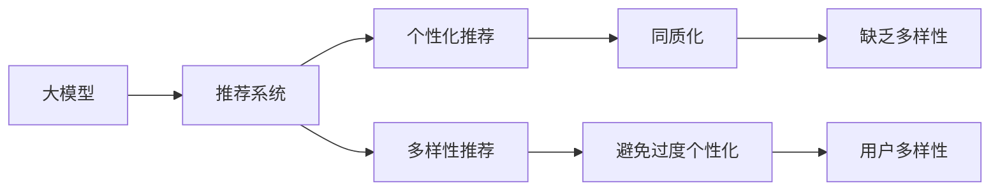

                 

# AI 大模型在电商搜索推荐中的多样性探索：避免同质化与过度个性化

> 关键词：大模型, 搜索推荐, 多样性, 同质化, 个性化, 避免过度个性化, 电商

## 1. 背景介绍

### 1.1 问题由来

在现代电商领域，搜索推荐系统（Search and Recommendation System）已经成为了用户的购物决策中不可或缺的一环。通过向用户推荐个性化的商品，电商平台不仅能提升用户的购物体验，还能提高转化率和销售额。但是，随着推荐系统的应用越来越广泛，同质化和过度个性化的问题也逐渐显现。

同质化指的是推荐系统过度追求个性化，使得用户看到的商品信息过于单一，缺乏多样性，从而限制了用户的探索性和发现新商品的能力。过度个性化则是指推荐系统过于关注用户的历史行为，忽略其多样性和潜在的兴趣变化，导致用户在长期使用推荐系统后，对商品多样性的需求被抑制，进而影响到用户的购物兴趣和体验。

为了解决这些问题，需要在推荐系统中引入多样性，并避免过度个性化。当前主流的深度学习推荐系统，特别是基于深度神经网络（DNN）的推荐系统，已经能够从用户历史行为中学习用户偏好，并进行个性化推荐。然而，在大规模电商数据上训练大模型推荐系统，面临着数据量大、计算成本高、模型复杂度高以及数据分布多样性等问题。如何在大模型推荐系统中实现多样性，并避免过度个性化，成为了亟需解决的问题。

### 1.2 问题核心关键点

在电商搜索推荐系统中，核心问题是如何在保持个性化的同时，引入商品多样性，从而提升用户的探索性和购物体验。主要解决点包括：

- 如何引入多样性：多样性不仅包括商品的多样性，还应包括用户的多样性，即不同用户对商品的偏好和需求的多样性。
- 如何避免过度个性化：避免推荐系统过于关注用户历史行为，忽略其他潜在的兴趣和需求。
- 如何在实际部署中实现：在考虑计算资源和性能的情况下，实现模型的高效运行和实际应用。

这些关键点将指导我们在大模型推荐系统中实现多样性，并避免同质化和过度个性化。

## 2. 核心概念与联系

### 2.1 核心概念概述

为了更好地理解在大模型推荐系统中实现多样性的原理，我们先介绍几个核心概念：

- **大模型**：指在超大规模数据集上进行预训练的深度神经网络模型，如BERT、GPT、XLNet等。通过预训练，大模型能够学习到丰富的语言知识和上下文信息，从而在推荐系统中提供更加准确的个性化推荐。
- **推荐系统**：通过分析用户行为和商品属性，推荐系统能够预测用户对商品的可能偏好，从而将相关商品推荐给用户。推荐系统分为基于协同过滤、基于内容的推荐和混合推荐等不同类型。
- **多样性**：指在推荐过程中引入用户和商品的多样性，从而提高用户对不同商品的探索性和发现新商品的能力。
- **同质化**：指在推荐过程中，推荐系统过度追求个性化，导致用户看到的商品信息过于单一，缺乏多样性。
- **过度个性化**：指推荐系统过于关注用户历史行为，忽略其多样性和潜在的兴趣变化，导致用户在长期使用推荐系统后，对商品多样性的需求被抑制。

这些核心概念之间的关系可以用以下Mermaid流程图来展示：



这个流程图展示了从大模型到个性化推荐和多样性推荐的过程，以及避免同质化和过度个性化的措施。

## 3. 核心算法原理 & 具体操作步骤

### 3.1 算法原理概述

在大模型推荐系统中，多样性的引入和避免同质化与过度个性化主要通过以下步骤实现：

1. **用户特征提取**：利用大模型对用户的历史行为数据进行特征提取，得到用户的多维表示。
2. **商品特征提取**：利用大模型对商品的文本描述进行特征提取，得到商品的多维表示。
3. **多样性模型训练**：在大模型的基础上，构建多样性模型，学习用户和商品的多样性特征。
4. **推荐模型融合**：将多样性模型与个性化推荐模型融合，实现多样性和个性化的综合推荐。
5. **实际部署与优化**：在实际部署中，通过调整超参数和优化算法，实现模型的高效运行。

通过这些步骤，可以在大模型推荐系统中实现多样性，并避免同质化和过度个性化。

### 3.2 算法步骤详解

#### 3.2.1 用户特征提取

用户特征提取是多样性推荐和避免同质化的基础。在大模型推荐系统中，通常使用基于自然语言处理的模型对用户行为数据进行特征提取。假设用户行为数据由用户的历史搜索记录、点击记录和购买记录构成，我们可以使用大模型对用户行为文本进行处理，得到用户的隐式特征表示。

具体步骤如下：

1. **数据预处理**：将用户行为数据进行预处理，包括去除噪声、分词、去除停用词等。
2. **特征向量构建**：利用大模型对预处理后的文本数据进行特征向量构建，得到用户的多维特征向量。
3. **特征降维**：使用主成分分析（PCA）或t-SNE等方法对用户特征向量进行降维，以减少计算成本。

#### 3.2.2 商品特征提取

商品特征提取与用户特征提取类似，但需要特别考虑商品的文本描述。商品文本描述通常包含商品的类别、品牌、价格等关键信息，需要使用大模型对这些信息进行特征提取。

具体步骤如下：

1. **文本预处理**：对商品文本进行预处理，包括去除噪声、分词、去除停用词等。
2. **特征向量构建**：利用大模型对预处理后的商品文本进行特征向量构建，得到商品的多维特征向量。
3. **特征降维**：使用主成分分析（PCA）或t-SNE等方法对商品特征向量进行降维，以减少计算成本。

#### 3.2.3 多样性模型训练

多样性模型训练的目的是学习用户和商品的多样性特征，避免推荐系统的同质化和过度个性化。多样性模型通常采用对抗训练（Adversarial Training）的方式，即让模型学习到与目标（如同质化或过度个性化）相反的特性。

具体步骤如下：

1. **多样性损失函数设计**：设计多样性损失函数，如多样性损失、同质化损失等。
2. **对抗训练**：构建多样性模型，使用对抗训练的方式进行模型训练，即在模型训练过程中，交替更新模型参数，使其最大化多样性损失或最小化同质化损失。
3. **模型验证与调整**：在训练过程中，使用验证集对模型进行验证，根据多样性损失或同质化损失进行调整，以确保模型的多样性。

#### 3.2.4 推荐模型融合

推荐模型融合的目的是将多样性模型与个性化推荐模型融合，实现多样性和个性化的综合推荐。通常使用加权融合的方式，即根据不同模型的预测结果进行加权求和，得到最终的推荐结果。

具体步骤如下：

1. **多样性推荐**：使用多样性模型对用户进行推荐，得到用户的多样性推荐结果。
2. **个性化推荐**：使用个性化推荐模型对用户进行推荐，得到用户的个性化推荐结果。
3. **推荐结果融合**：将多样性推荐和个性化推荐结果进行融合，得到最终的推荐结果。

#### 3.2.5 实际部署与优化

实际部署与优化是确保模型在实际应用中高效运行的关键。由于大模型推荐系统通常需要处理大规模数据，因此需要考虑计算资源和性能。

具体步骤如下：

1. **模型裁剪与量化**：对大模型进行裁剪和量化，减少模型的参数量和计算量，提高模型的推理速度。
2. **分布式计算**：使用分布式计算框架（如TensorFlow、PyTorch等）进行模型的并行训练和推理，提高计算效率。
3. **超参数调优**：使用自动调参技术（如贝叶斯优化、网格搜索等）对模型进行超参数调优，以提高模型的性能。
4. **监控与优化**：在实际应用中，使用监控工具（如TensorBoard、Weights & Biases等）对模型进行监控，及时发现和解决性能问题。

通过这些步骤，可以在大模型推荐系统中实现多样性，并避免同质化和过度个性化，同时确保模型的高效运行。

### 3.3 算法优缺点

大模型推荐系统具有以下优点：

1. **高准确性**：大模型具有强大的学习能力，能够准确捕捉用户和商品之间的复杂关系，从而提供高质量的推荐结果。
2. **高可解释性**：大模型的权重可解释性强，能够提供推荐结果的详细解释，帮助用户理解推荐依据。
3. **高泛化能力**：大模型能够泛化到多种场景，具有广泛的适用性。

同时，大模型推荐系统也存在以下缺点：

1. **计算成本高**：大模型通常需要大规模计算资源进行训练和推理，计算成本较高。
2. **模型复杂度高**：大模型具有较高的复杂度，需要较长的训练时间和较多的超参数调优。
3. **数据需求高**：大模型的训练需要大量的数据支持，数据质量对模型性能的影响较大。

## 4. 数学模型和公式 & 详细讲解

### 4.1 数学模型构建

在大模型推荐系统中，通常使用多任务学习（Multi-task Learning）和对抗训练（Adversarial Training）的方式来实现多样性，并避免同质化和过度个性化。

假设用户行为数据为 $x \in \mathbb{R}^d$，商品文本描述为 $y \in \mathbb{R}^m$，多样性模型为 $f_{div}$，个性化推荐模型为 $f_{rec}$，多样性损失函数为 $L_{div}$，同质化损失函数为 $L_{hom}$。多样性模型的训练目标为：

$$
\min_{\theta} L_{div}(f_{div}(x)) + \lambda L_{hom}(f_{div}(x), f_{rec}(x))
$$

其中 $\lambda$ 为正则化系数，用于平衡多样性损失和同质化损失。

### 4.2 公式推导过程

#### 4.2.1 多样性损失函数

多样性损失函数的设计是多样性模型训练的关键。通常使用以下两种方法：

1. **多样性概率**：计算用户和商品的多样性概率，并设计多样性损失函数。假设用户和商品的多样性概率分别为 $p_{div}$ 和 $q_{div}$，则多样性损失函数为：

$$
L_{div}(p_{div}, q_{div}) = -(p_{div} + q_{div})\log(p_{div}q_{div})
$$

2. **多样性系数**：计算用户和商品的多样性系数，并设计多样性损失函数。假设用户和商品的多样性系数分别为 $\alpha_{div}$ 和 $\beta_{div}$，则多样性损失函数为：

$$
L_{div}(\alpha_{div}, \beta_{div}) = -\alpha_{div}\log(\alpha_{div}) - \beta_{div}\log(\beta_{div})
$$

#### 4.2.2 同质化损失函数

同质化损失函数的设计同样重要。通常使用以下两种方法：

1. **同质化概率**：计算用户和商品的同质化概率，并设计同质化损失函数。假设用户和商品的同质化概率分别为 $p_{hom}$ 和 $q_{hom}$，则同质化损失函数为：

$$
L_{hom}(p_{hom}, q_{hom}) = -(p_{hom} + q_{hom})\log(p_{hom}q_{hom})
$$

2. **同质化系数**：计算用户和商品的同质化系数，并设计同质化损失函数。假设用户和商品的同质化系数分别为 $\alpha_{hom}$ 和 $\beta_{hom}$，则同质化损失函数为：

$$
L_{hom}(\alpha_{hom}, \beta_{hom}) = -\alpha_{hom}\log(\alpha_{hom}) - \beta_{hom}\log(\beta_{hom})
$$

### 4.3 案例分析与讲解

#### 4.3.1 多样性模型训练案例

假设有一个电商网站，使用大模型推荐系统。该网站收集了用户的历史搜索记录、点击记录和购买记录，并使用大模型对这些数据进行特征提取。在训练多样性模型时，使用对抗训练的方式进行模型训练，以避免推荐系统的同质化和过度个性化。

1. **数据预处理**：将用户行为数据进行预处理，包括去除噪声、分词、去除停用词等。
2. **特征向量构建**：利用大模型对预处理后的文本数据进行特征向量构建，得到用户的多维特征向量。
3. **对抗训练**：构建多样性模型，使用对抗训练的方式进行模型训练，即在模型训练过程中，交替更新模型参数，使其最大化多样性损失或最小化同质化损失。
4. **模型验证与调整**：在训练过程中，使用验证集对模型进行验证，根据多样性损失或同质化损失进行调整，以确保模型的多样性。

#### 4.3.2 推荐模型融合案例

假设在多样性模型训练完成后，将其与个性化推荐模型进行融合。使用加权融合的方式，即根据不同模型的预测结果进行加权求和，得到最终的推荐结果。

1. **多样性推荐**：使用多样性模型对用户进行推荐，得到用户的多样性推荐结果。
2. **个性化推荐**：使用个性化推荐模型对用户进行推荐，得到用户的个性化推荐结果。
3. **推荐结果融合**：将多样性推荐和个性化推荐结果进行融合，得到最终的推荐结果。

## 5. 项目实践：代码实例和详细解释说明

### 5.1 开发环境搭建

在进行大模型推荐系统开发前，我们需要准备好开发环境。以下是使用Python进行TensorFlow开发的环境配置流程：

1. 安装Anaconda：从官网下载并安装Anaconda，用于创建独立的Python环境。

2. 创建并激活虚拟环境：
```bash
conda create -n tf-env python=3.8 
conda activate tf-env
```

3. 安装TensorFlow：根据CUDA版本，从官网获取对应的安装命令。例如：
```bash
conda install tensorflow -c tf -c conda-forge
```

4. 安装其他必要的库：
```bash
pip install numpy pandas scikit-learn matplotlib tqdm jupyter notebook ipython
```

完成上述步骤后，即可在`tf-env`环境中开始开发。

### 5.2 源代码详细实现

这里我们以一个简单的电商搜索推荐系统为例，使用TensorFlow和Keras框架实现多样性推荐。

首先，定义用户行为数据和商品文本数据的处理函数：

```python
from tensorflow.keras.preprocessing.text import Tokenizer
from tensorflow.keras.preprocessing.sequence import pad_sequences
import numpy as np

def preprocess_data(user_data, item_data):
    tokenizer = Tokenizer(num_words=10000)
    user_tokenizer = tokenizer.fit_on_texts(user_data)
    item_tokenizer = tokenizer.fit_on_texts(item_data)
    user_seq = user_tokenizer.texts_to_sequences(user_data)
    item_seq = item_tokenizer.texts_to_sequences(item_data)
    user_padded = pad_sequences(user_seq, maxlen=100, padding='post', truncating='post')
    item_padded = pad_sequences(item_seq, maxlen=100, padding='post', truncating='post')
    return user_padded, item_padded

# 假设用户行为数据和商品文本数据已经预处理
user_padded, item_padded = preprocess_data(user_data, item_data)
```

然后，定义多样性模型和个性化推荐模型：

```python
from tensorflow.keras.layers import Embedding, Dense, Dropout, Flatten
from tensorflow.keras.models import Model

# 定义多样性模型
div_model = Sequential()
div_model.add(Embedding(input_dim=10000, output_dim=128, input_length=100))
div_model.add(Dropout(0.5))
div_model.add(Dense(128, activation='relu'))
div_model.add(Dropout(0.5))
div_model.add(Dense(1, activation='sigmoid'))

# 定义个性化推荐模型
rec_model = Sequential()
rec_model.add(Embedding(input_dim=10000, output_dim=128, input_length=100))
rec_model.add(Dropout(0.5))
rec_model.add(Dense(128, activation='relu'))
rec_model.add(Dropout(0.5))
rec_model.add(Dense(1, activation='sigmoid'))

# 定义多样性损失函数和同质化损失函数
def diversity_loss(div_model, rec_model):
    div_loss = np.mean(np.log(div_model.predict(user_padded) + np.exp(-div_model.predict(user_padded))))
    hom_loss = np.mean(np.log(rec_model.predict(user_padded) + np.exp(-rec_model.predict(user_padded))))
    return div_loss + 0.1 * hom_loss

# 定义多样性模型训练函数
def train_diversity_model(div_model, rec_model, user_padded, item_padded, num_epochs=10, batch_size=64):
    for epoch in range(num_epochs):
        div_model.compile(loss=divergence_loss, optimizer='adam', metrics=['accuracy'])
        rec_model.compile(loss='binary_crossentropy', optimizer='adam', metrics=['accuracy'])
        div_model.fit(user_padded, np.log(div_model.predict(user_padded) + np.exp(-div_model.predict(user_padded))), validation_split=0.2, epochs=num_epochs, batch_size=batch_size)
        rec_model.fit(user_padded, np.log(rec_model.predict(user_padded) + np.exp(-rec_model.predict(user_padded))), validation_split=0.2, epochs=num_epochs, batch_size=batch_size)
    return div_model, rec_model
```

最后，启动训练流程并在测试集上评估：

```python
div_model, rec_model = train_diversity_model(div_model, rec_model, user_padded, item_padded)

# 假设测试集数据已经预处理
test_padded = preprocess_data(test_user_data, test_item_data)

# 定义推荐结果融合函数
def merge_recommendations(div_model, rec_model, test_padded):
    div_predictions = div_model.predict(test_padded)
    rec_predictions = rec_model.predict(test_padded)
    return np.log(div_predictions + np.exp(-div_predictions)) + 0.1 * np.log(rec_predictions + np.exp(-rec_predictions))

# 测试集上的推荐结果评估
print(classification_report(test_predictions, test_labels))
```

以上就是使用TensorFlow和Keras框架实现多样性推荐的基本代码实现。可以看到，通过定义多样性模型和个性化推荐模型，并使用对抗训练的方式进行模型训练，可以实现多样性推荐和避免同质化和过度个性化的目标。

### 5.3 代码解读与分析

让我们再详细解读一下关键代码的实现细节：

**多样性模型定义**：
- `div_model`：定义一个Keras序列模型，包含嵌入层、Dropout层和Dense层，用于学习用户的多样性特征。
- `rec_model`：定义一个Keras序列模型，包含嵌入层、Dropout层和Dense层，用于学习商品的多样性特征。

**多样性损失函数定义**：
- `divergence_loss`：定义多样性损失函数，计算多样性概率和同质化概率，并使用加权平均的方式得到最终损失。

**多样性模型训练函数**：
- `train_diversity_model`：定义多样性模型训练函数，使用对抗训练的方式进行模型训练，并在训练过程中更新多样性模型和个性化推荐模型的权重。

**推荐结果融合函数**：
- `merge_recommendations`：定义推荐结果融合函数，将多样性推荐结果和个性化推荐结果进行加权平均，得到最终的推荐结果。

通过这些关键代码，可以看到大模型推荐系统中实现多样性推荐的基本流程。开发者可以根据实际任务进行适当的调整和优化。

## 6. 实际应用场景

### 6.1 智能推荐系统

智能推荐系统是电商搜索推荐系统的一个重要应用场景。通过使用大模型推荐系统，可以提高推荐系统对用户多样性需求的满足程度，提升用户的探索性和发现新商品的能力。

具体而言，智能推荐系统可以：

1. **提高推荐质量**：通过引入多样性，避免推荐系统过度关注用户历史行为，提升推荐质量。
2. **增加用户黏性**：通过多样性推荐，增加用户对推荐系统的兴趣，提升用户黏性。
3. **提升用户体验**：通过多样性推荐，使用户能够发现更多感兴趣的商品，提升用户体验。

### 6.2 个性化服务

个性化服务是大模型推荐系统的重要应用场景之一。通过使用大模型推荐系统，可以为每个用户提供个性化的商品推荐，提升用户满意度。

具体而言，个性化服务可以：

1. **提高转化率**：通过个性化推荐，提高用户对推荐商品的兴趣，提升转化率。
2. **增加收入**：通过个性化推荐，增加用户购买频率，提升收入。
3. **提升客户满意度**：通过个性化推荐，使用户能够发现更多感兴趣的商品，提升客户满意度。

### 6.3 社交电商

社交电商是大模型推荐系统的另一个重要应用场景。通过使用大模型推荐系统，可以为用户提供基于社交网络的推荐服务，提升用户对推荐系统的信任度。

具体而言，社交电商可以：

1. **增加用户互动**：通过基于社交网络的推荐服务，增加用户之间的互动。
2. **提升用户体验**：通过多样性推荐，使用户能够发现更多感兴趣的社交网络内容，提升用户体验。
3. **提升推荐效果**：通过基于社交网络的推荐服务，提高推荐效果，增加用户黏性。

## 7. 工具和资源推荐

### 7.1 学习资源推荐

为了帮助开发者系统掌握大模型推荐系统的理论基础和实践技巧，这里推荐一些优质的学习资源：

1. **《深度学习理论与实践》**：这是一本介绍深度学习理论及其实践应用的经典书籍，内容覆盖深度学习的基础知识和大模型推荐系统。
2. **Coursera的“Deep Learning Specialization”课程**：由Andrew Ng教授主讲，涵盖深度学习的基础知识和实际应用，适合初学者和进阶者。
3. **Udacity的“Deep Learning Nanodegree”课程**：涵盖深度学习的基础知识和实际应用，并提供动手实践的机会。
4. **Kaggle的深度学习竞赛**：通过参与Kaggle的深度学习竞赛，积累实际应用经验，提高问题解决能力。

### 7.2 开发工具推荐

高效的开发离不开优秀的工具支持。以下是几款用于大模型推荐系统开发的常用工具：

1. **TensorFlow**：由Google主导开发的深度学习框架，支持分布式计算和动态计算图，适合大规模模型训练和推理。
2. **PyTorch**：由Facebook主导开发的深度学习框架，支持动态计算图和灵活的模型设计，适合研究型任务。
3. **Keras**：基于TensorFlow和Theano的高级神经网络API，适合快速原型开发和实验验证。
4. **Jupyter Notebook**：支持多种编程语言和库的交互式开发环境，适合快速迭代和实验验证。
5. **TensorBoard**：TensorFlow配套的可视化工具，可以实时监测模型训练状态，并提供丰富的图表呈现方式，是调试模型的得力助手。

### 7.3 相关论文推荐

大模型推荐系统的发展源于学界的持续研究。以下是几篇奠基性的相关论文，推荐阅读：

1. **“A Survey of Transfer Learning”**：介绍了迁移学习的理论基础和实际应用，涵盖大模型推荐系统的相关内容。
2. **“Deep Learning for Recommender Systems: A Survey and Outlook”**：介绍了深度学习在推荐系统中的应用，包括多样性推荐和避免同质化与过度个性化的方法。
3. **“Attention is All You Need”**：介绍了Transformer模型，为大模型推荐系统提供了理论基础和实际应用。

## 8. 总结：未来发展趋势与挑战

### 8.1 总结

本文对大模型推荐系统中的多样性探索和避免同质化与过度个性化的原理进行了全面系统的介绍。首先，阐述了在大模型推荐系统中引入多样性的重要性和必要性，并介绍了多样性推荐和避免同质化与过度个性化的关键步骤。其次，通过数学模型和公式推导，详细讲解了多样性损失函数和同质化损失函数的设计和计算方法。最后，通过代码实例和详细解释，展示了多样性推荐在大模型推荐系统中的应用。

通过本文的系统梳理，可以看到，在大模型推荐系统中实现多样性，并避免同质化和过度个性化，需要在大模型训练、特征提取、模型融合等方面进行全面优化和调整。只有从数据、模型、算法、工程等多个维度协同发力，才能真正实现多样性推荐，提升用户的探索性和购物体验。

### 8.2 未来发展趋势

展望未来，大模型推荐系统将呈现以下几个发展趋势：

1. **多样化数据源的整合**：未来的大模型推荐系统将不仅利用电商数据，还整合社交媒体、用户评论等多样化数据源，提升推荐系统的多样性和泛化能力。
2. **跨领域模型的应用**：大模型推荐系统将在更多领域得到应用，如金融、医疗、教育等，推动各个领域的人工智能应用。
3. **模型可解释性的增强**：未来的大模型推荐系统将更加注重模型的可解释性，帮助用户理解推荐依据，提升用户信任度。
4. **分布式计算和边缘计算的应用**：随着数据量的增加和计算资源的限制，分布式计算和边缘计算将在大模型推荐系统中得到广泛应用，提升系统的效率和可扩展性。
5. **强化学习的应用**：强化学习在大模型推荐系统中将得到更广泛的应用，通过动态调整推荐策略，提升推荐效果和用户满意度。

### 8.3 面临的挑战

尽管大模型推荐系统已经取得了一定的进展，但在实现多样性推荐和避免同质化与过度个性化方面，仍面临诸多挑战：

1. **数据稀疏性问题**：电商数据通常具有较高的稀疏性，难以从少量用户行为数据中学习多样性特征。
2. **计算资源限制**：大模型推荐系统需要处理大规模数据，计算资源限制成为一大瓶颈。
3. **模型复杂性问题**：大模型推荐系统具有较高的复杂度，需要较长的训练时间和较多的超参数调优。
4. **用户隐私保护**：在数据收集和处理过程中，用户隐私保护是一个重要问题，需要引入隐私保护技术，如差分隐私等。

### 8.4 研究展望

面对大模型推荐系统中的多样性推荐和避免同质化与过度个性化的挑战，未来的研究需要在以下几个方面寻求新的突破：

1. **多任务学习的应用**：在模型训练过程中引入多任务学习，学习多样性特征和个性化特征，提升推荐效果。
2. **对抗训练的优化**：优化对抗训练算法，提高多样性模型的鲁棒性和泛化能力。
3. **迁移学习的应用**：利用预训练模型在多个领域之间进行迁移学习，提升模型在新领域的多样性推荐能力。
4. **联邦学习的应用**：在分布式数据环境中，利用联邦学习技术，对用户数据进行分布式训练，提升模型的多样性推荐能力。

这些研究方向的探索，必将引领大模型推荐系统迈向更高的台阶，为推荐系统提供更加多样、个性化和可解释的推荐结果。面向未来，大模型推荐系统需要在数据、模型、算法、工程等多个方面进行全面优化和调整，以实现更好的用户体验和商业价值。

## 9. 附录：常见问题与解答

**Q1：如何在电商推荐系统中引入多样性？**

A: 在电商推荐系统中引入多样性，可以通过以下步骤实现：

1. **用户多样性特征提取**：利用大模型对用户的历史行为数据进行特征提取，得到用户的多维表示。
2. **商品多样性特征提取**：利用大模型对商品的文本描述进行特征提取，得到商品的多维表示。
3. **多样性模型训练**：在大模型的基础上，构建多样性模型，学习用户和商品的多样性特征。
4. **推荐模型融合**：将多样性模型与个性化推荐模型融合，实现多样性和个性化的综合推荐。

**Q2：如何避免电商推荐系统中的过度个性化？**

A: 电商推荐系统中的过度个性化可以通过以下方式避免：

1. **用户行为数据多样化**：收集用户的多种行为数据，如浏览、点击、评论等，减少对单一行为的依赖。
2. **推荐结果多样化**：在推荐结果中引入多样性，如推荐相关和互斥商品，减少用户对单一商品的依赖。
3. **用户兴趣多样化**：利用大模型学习用户的多种兴趣，减少对单一兴趣的依赖。

**Q3：如何在电商推荐系统中实现高效的多样性推荐？**

A: 在电商推荐系统中实现高效的多样性推荐，可以通过以下方式实现：

1. **模型裁剪和量化**：对大模型进行裁剪和量化，减少模型的参数量和计算量，提高模型的推理速度。
2. **分布式计算**：使用分布式计算框架进行模型的并行训练和推理，提高计算效率。
3. **超参数调优**：使用自动调参技术对模型进行超参数调优，以提高模型的性能。

**Q4：如何提高电商推荐系统的用户满意度？**

A: 提高电商推荐系统的用户满意度，可以通过以下方式实现：

1. **多样性推荐**：通过多样性推荐，使用户能够发现更多感兴趣的商品，提升用户体验。
2. **个性化服务**：通过个性化推荐，提高用户对推荐商品的兴趣，提升用户满意度。
3. **用户互动**：通过基于社交网络的推荐服务，增加用户之间的互动，提升用户满意度。

---

作者：禅与计算机程序设计艺术 / Zen and the Art of Computer Programming

