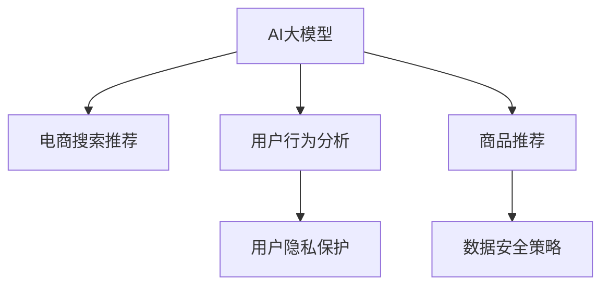

                 

# AI 大模型在电商搜索推荐中的数据安全策略：保障数据安全与用户隐私

> 关键词：大语言模型, 电商搜索推荐, 数据隐私, 安全策略, 用户行为分析

## 1. 背景介绍

随着人工智能技术在电子商务领域的深入应用，AI大模型已成为电商搜索推荐系统的核心组件。这些大模型通常基于海量用户行为数据进行训练，旨在精准预测用户需求，提供个性化的商品推荐服务。然而，这些数据包含大量敏感用户信息，如何保护用户隐私，保障数据安全，成为了电商企业面临的重要挑战。

## 2. 核心概念与联系

### 2.1 核心概念概述

为更好地理解AI大模型在电商搜索推荐中的应用，本节将介绍几个密切相关的核心概念：

- **AI大模型**：如BERT、GPT等预训练语言模型，通过大规模无标签数据预训练，具备强大的自然语言处理能力。在电商领域，通过微调可应用于用户行为分析、商品推荐等任务。
- **电商搜索推荐系统**：电商平台通过AI大模型对用户行为数据进行分析，预测用户需求，推荐相关商品，提升用户体验和销售转化率。
- **数据隐私保护**：指在处理、存储和使用用户数据时，保护用户个人信息和隐私权。包括但不限于数据加密、匿名化、最小化存储等措施。
- **数据安全策略**：电商企业在应用AI大模型时，为保障用户数据隐私和安全，需制定一系列数据使用和存储的规则和策略。

这些核心概念之间的逻辑关系可以通过以下Mermaid流程图来展示：



这个流程图展示了AI大模型在电商搜索推荐中的核心概念及其之间的关系：

1. AI大模型通过微调获得特定领域的知识，用于电商领域的用户行为分析和商品推荐。
2. 用户行为分析指通过AI模型分析用户浏览、点击、购买等行为，预测用户需求。
3. 商品推荐系统根据用户行为数据，推荐相关商品。
4. 数据隐私保护确保用户数据在收集、存储和处理过程中的安全性。
5. 数据安全策略指导电商企业在数据使用中遵循的隐私和安全原则。

这些概念共同构成了电商搜索推荐系统的数据安全框架，确保AI大模型在提升用户体验的同时，不侵害用户隐私，保障数据安全。

## 3. 核心算法原理 & 具体操作步骤
### 3.1 算法原理概述

在电商搜索推荐系统中，AI大模型的主要功能是进行用户行为分析，预测用户需求，推荐相关商品。这一过程涉及到大量用户数据，如何保护这些数据，同时提供个性化的推荐服务，是系统的核心挑战。

具体而言，AI大模型的核心算法原理如下：

1. **数据预处理**：收集用户行为数据，进行清洗、去重、归一化等处理，生成用于训练和预测的数据集。
2. **模型训练**：使用AI大模型在预处理后的数据集上进行微调，学习用户行为与商品之间的关系。
3. **推荐生成**：根据用户当前行为和历史数据，使用微调后的模型生成个性化商品推荐。
4. **数据保护**：对用户数据进行加密、匿名化处理，确保数据在处理、存储和使用过程中的安全性。

### 3.2 算法步骤详解

以下是AI大模型在电商搜索推荐系统中应用的核心算法步骤：

1. **数据收集**：从电商平台的各个渠道（如网站、APP、客服等）收集用户行为数据。数据包括但不限于浏览历史、点击行为、购买记录、评价反馈等。
2. **数据预处理**：对收集到的数据进行清洗和格式化，去除噪音和不完整的数据，确保数据的准确性和一致性。
3. **模型训练**：选择适合电商搜索推荐的AI大模型，如BERT、GPT等，在预处理后的数据集上进行微调。微调过程包括设置合适的超参数，如学习率、迭代次数、优化算法等。
4. **推荐生成**：根据用户当前行为和历史数据，使用微调后的模型生成个性化商品推荐。推荐生成过程包括输入用户行为数据，进行前向传播和反向传播，最终输出商品推荐列表。
5. **数据保护**：在数据收集、存储、处理和传输过程中，采取一系列安全措施，如数据加密、匿名化、访问控制等，确保用户数据的安全性。

### 3.3 算法优缺点

使用AI大模型进行电商搜索推荐系统的数据安全策略具有以下优点：

- **精度高**：AI大模型能够从海量用户行为数据中提取深层次的特征，提升推荐系统的精度和效果。
- **覆盖广**：大模型通常能够处理多种数据类型，涵盖用户浏览、点击、购买等行为，提供更全面的推荐。
- **灵活性高**：大模型可以通过微调适应不同电商平台的特定需求，提升个性化推荐能力。

同时，该策略也存在一些局限性：

- **依赖高质量数据**：模型的效果很大程度上取决于收集到的数据质量和多样性，数据偏差可能导致推荐结果不准确。
- **计算资源需求高**：AI大模型的训练和推理需要大量的计算资源，包括高性能GPU、TPU等，成本较高。
- **数据隐私风险**：尽管采取了数据保护措施，但仍存在数据泄露、滥用的风险。
- **模型复杂度高**：大模型的复杂度可能导致推荐系统处理时间较长，影响实时性。

### 3.4 算法应用领域

AI大模型在电商搜索推荐系统中的应用领域非常广泛，具体包括：

- **用户行为分析**：分析用户浏览、点击、购买等行为，预测用户需求和兴趣。
- **商品推荐**：根据用户行为数据，推荐相关商品，提升用户体验和销售转化率。
- **营销活动优化**：通过用户行为数据，优化营销活动和广告投放策略，提高广告效果。
- **个性化服务**：提供个性化的购物、客服和物流服务等，提升用户满意度。

除了上述这些经典应用外，AI大模型还被创新性地应用于情感分析、需求预测、广告定位等诸多场景中，为电商搜索推荐系统带来了新的突破。随着大语言模型和推荐技术的不断发展，相信AI大模型在电商领域的应用将更加广泛和深入。

## 4. 数学模型和公式 & 详细讲解
### 4.1 数学模型构建

在电商搜索推荐系统中，AI大模型的主要数学模型包括用户行为分析模型和商品推荐模型。

假设用户行为数据集为 $D=\{(x_i,y_i)\}_{i=1}^N$，其中 $x_i$ 为行为特征向量，$y_i$ 为商品标签。我们的目标是通过训练一个AI大模型 $M_{\theta}$，使得其在新的用户行为数据 $x$ 上生成推荐商品列表 $y$。

模型训练过程可以表示为：

$$
\theta^* = \mathop{\arg\min}_{\theta} \mathcal{L}(M_{\theta},D)
$$

其中 $\mathcal{L}$ 为损失函数，用于衡量模型预测输出与真实标签之间的差异。

### 4.2 公式推导过程

以下以用户行为分析模型为例，推导基于大模型的损失函数：

假设用户行为数据集为 $D=\{(x_i,y_i)\}_{i=1}^N$，其中 $x_i$ 为行为特征向量，$y_i$ 为商品标签。我们的目标是通过训练一个AI大模型 $M_{\theta}$，使得其在新的用户行为数据 $x$ 上生成推荐商品列表 $y$。

模型训练过程可以表示为：

$$
\theta^* = \mathop{\arg\min}_{\theta} \mathcal{L}(M_{\theta},D)
$$

其中 $\mathcal{L}$ 为损失函数，用于衡量模型预测输出与真实标签之间的差异。对于二分类任务，常用的损失函数为交叉熵损失：

$$
\mathcal{L}(M_{\theta},D) = -\frac{1}{N}\sum_{i=1}^N \sum_{j=1}^{M} \big(y_{ij} \log M_{\theta}(x_i)_j + (1-y_{ij}) \log (1-M_{\theta}(x_i)_j)\big)
$$

其中 $M_{\theta}(x_i)_j$ 表示模型对第 $j$ 个商品的预测概率，$y_{ij}$ 为真实标签。

### 4.3 案例分析与讲解

在实际应用中，电商搜索推荐系统通常会根据用户行为数据进行模型训练和推荐生成。以一个具体的案例来说明：

假设某电商平台有1000万用户，每天产生10亿次点击行为。从这些行为数据中，电商平台收集了用户的浏览历史、点击行为、购买记录等，并对数据进行了预处理和清洗。然后，选择BERT模型作为用户行为分析模型，并对其进行微调。微调过程中，设置了合适的超参数，如学习率为1e-5，迭代次数为10轮。

在微调完成后，电商平台使用微调后的模型对新用户的点击行为进行预测，并生成个性化的商品推荐列表。推荐列表包含了10个相关商品，按照预测概率排序。

## 5. 项目实践：代码实例和详细解释说明
### 5.1 开发环境搭建

在进行电商搜索推荐系统开发前，我们需要准备好开发环境。以下是使用Python进行TensorFlow开发的环境配置流程：

1. 安装Anaconda：从官网下载并安装Anaconda，用于创建独立的Python环境。

2. 创建并激活虚拟环境：
```bash
conda create -n tf-env python=3.8 
conda activate tf-env
```

3. 安装TensorFlow：根据CUDA版本，从官网获取对应的安装命令。例如：
```bash
conda install tensorflow==2.8.0
```

4. 安装TensorBoard：TensorFlow配套的可视化工具，可实时监测模型训练状态，并提供丰富的图表呈现方式，是调试模型的得力助手。
```bash
pip install tensorboard
```

5. 安装数据预处理工具：
```bash
pip install pandas numpy
```

完成上述步骤后，即可在`tf-env`环境中开始电商搜索推荐系统的开发。

### 5.2 源代码详细实现

这里我们以用户行为分析模型为例，给出使用TensorFlow对BERT模型进行电商搜索推荐系统微调的代码实现。

```python
import tensorflow as tf
from transformers import BertTokenizer, BertForSequenceClassification
import pandas as pd
import numpy as np

# 设置模型参数
learning_rate = 1e-5
num_epochs = 10
batch_size = 32

# 加载预训练模型和分词器
tokenizer = BertTokenizer.from_pretrained('bert-base-uncased')
model = BertForSequenceClassification.from_pretrained('bert-base-uncased', num_labels=2)

# 加载用户行为数据
train_data = pd.read_csv('train.csv')
test_data = pd.read_csv('test.csv')

# 分词和特征编码
train_input_ids = tokenizer(train_data['input_ids'], padding='max_length', truncation=True, max_length=128, return_tensors='tf')
train_labels = train_data['label']
test_input_ids = tokenizer(test_data['input_ids'], padding='max_length', truncation=True, max_length=128, return_tensors='tf')
test_labels = test_data['label']

# 定义模型优化器和损失函数
optimizer = tf.keras.optimizers.Adam(learning_rate=learning_rate)
loss = tf.keras.losses.BinaryCrossentropy()

# 定义模型训练和评估函数
def train_model(model, train_data, train_labels, test_data, test_labels, batch_size, num_epochs, loss, optimizer):
    train_dataset = tf.data.Dataset.from_tensor_slices((train_input_ids, train_labels)).shuffle(10000).batch(batch_size)
    test_dataset = tf.data.Dataset.from_tensor_slices((test_input_ids, test_labels)).batch(batch_size)

    model.compile(optimizer=optimizer, loss=loss, metrics=['accuracy'])

    history = model.fit(train_dataset, epochs=num_epochs, validation_data=test_dataset)

    return history

# 训练模型
history = train_model(model, train_input_ids, train_labels, test_input_ids, test_labels, batch_size, num_epochs, loss, optimizer)

# 评估模型
test_loss, test_accuracy = model.evaluate(test_input_ids, test_labels)

print(f'Test Loss: {test_loss}, Test Accuracy: {test_accuracy}')
```

### 5.3 代码解读与分析

让我们再详细解读一下关键代码的实现细节：

**BERT模型微调**：
- 使用TensorFlow安装环境搭建，并引入必要的TensorFlow和Transformer库。
- 设置模型参数，如学习率、迭代次数、批大小等。
- 加载预训练BERT模型和分词器，准备用户行为数据。
- 对用户行为数据进行分词和特征编码，生成模型所需的输入。
- 定义模型优化器和损失函数，如Adam优化器、二元交叉熵损失。
- 定义训练和评估函数，使用TensorFlow的Keras API进行模型训练和评估。
- 在训练过程中，通过epochs迭代训练模型，并在每个epoch结束后在验证集上评估模型性能。
- 最后，在测试集上评估模型，并打印测试结果。

**数据预处理**：
- 使用Pandas和NumPy对用户行为数据进行处理，包括数据清洗、特征工程等。
- 对处理后的数据进行分词，使用BertTokenizer进行特征编码。
- 对编码后的数据进行批处理和排序，生成TensorFlow所需的Dataset对象。
- 在训练过程中，对模型进行批量迭代更新，并在每个epoch结束后在验证集上评估模型性能。

**模型训练和评估**：
- 使用TensorFlow的Keras API进行模型训练，并记录训练过程中的各个指标。
- 在训练完成后，在测试集上评估模型的性能，并打印测试结果。

### 5.4 运行结果展示

在上述代码实现的基础上，可以生成一系列的训练和评估结果，包括损失、准确率等指标。这些结果可以帮助我们监控模型的训练过程，优化模型参数，提高模型性能。

## 6. 实际应用场景
### 6.1 智能客服系统

基于AI大模型的电商搜索推荐系统，可以广泛应用于智能客服系统的构建。传统客服往往需要配备大量人力，高峰期响应缓慢，且一致性和专业性难以保证。而使用电商搜索推荐系统构建的智能客服系统，能够7x24小时不间断服务，快速响应客户咨询，用自然流畅的语言解答各类常见问题。

在技术实现上，电商搜索推荐系统可以接入客户咨询数据，使用微调后的模型分析客户需求，提供最合适的答案模板进行回复。对于客户提出的新问题，还可以接入检索系统实时搜索相关内容，动态组织生成回答。如此构建的智能客服系统，能大幅提升客户咨询体验和问题解决效率。

### 6.2 金融舆情监测

金融机构需要实时监测市场舆论动向，以便及时应对负面信息传播，规避金融风险。传统的人工监测方式成本高、效率低，难以应对网络时代海量信息爆发的挑战。基于AI大模型的电商搜索推荐系统，可以用于金融舆情监测。

具体而言，可以收集金融领域相关的新闻、报道、评论等文本数据，并对其进行主题标注和情感标注。在此基础上对预训练语言模型进行微调，使其能够自动判断文本属于何种主题，情感倾向是正面、中性还是负面。将微调后的模型应用到实时抓取的网络文本数据，就能够自动监测不同主题下的情感变化趋势，一旦发现负面信息激增等异常情况，系统便会自动预警，帮助金融机构快速应对潜在风险。

### 6.3 个性化推荐系统

当前的推荐系统往往只依赖用户的历史行为数据进行物品推荐，无法深入理解用户的真实兴趣偏好。基于AI大模型的电商搜索推荐系统，可以更好地挖掘用户行为背后的语义信息，从而提供更精准、多样的推荐内容。

在实践中，电商搜索推荐系统可以收集用户浏览、点击、评论、分享等行为数据，提取和用户交互的物品标题、描述、标签等文本内容。将文本内容作为模型输入，用户的后续行为（如是否点击、购买等）作为监督信号，在此基础上微调预训练语言模型。微调后的模型能够从文本内容中准确把握用户的兴趣点。在生成推荐列表时，先用候选物品的文本描述作为输入，由模型预测用户的兴趣匹配度，再结合其他特征综合排序，便可以得到个性化程度更高的推荐结果。

### 6.4 未来应用展望

随着AI大模型和电商搜索推荐技术的不断发展，基于微调的推荐系统将在更多领域得到应用，为传统行业带来变革性影响。

在智慧医疗领域，基于微调的推荐系统可以用于医疗问答、病历分析、药物研发等任务，提升医疗服务的智能化水平，辅助医生诊疗，加速新药开发进程。

在智能教育领域，微调技术可应用于作业批改、学情分析、知识推荐等方面，因材施教，促进教育公平，提高教学质量。

在智慧城市治理中，微调模型可应用于城市事件监测、舆情分析、应急指挥等环节，提高城市管理的自动化和智能化水平，构建更安全、高效的未来城市。

此外，在企业生产、社会治理、文娱传媒等众多领域，基于大模型微调的推荐系统也将不断涌现，为经济社会发展注入新的动力。相信随着预训练模型和微调方法的不断进步，推荐系统必将在更广阔的应用领域大放异彩。

## 7. 工具和资源推荐
### 7.1 学习资源推荐

为了帮助开发者系统掌握大语言模型微调的理论基础和实践技巧，这里推荐一些优质的学习资源：

1. **《Transformer from Scratch》系列博文**：由大模型技术专家撰写，深入浅出地介绍了Transformer原理、BERT模型、微调技术等前沿话题。
2. **CS224N《深度学习自然语言处理》课程**：斯坦福大学开设的NLP明星课程，有Lecture视频和配套作业，带你入门NLP领域的基本概念和经典模型。
3. **《Natural Language Processing with Transformers》书籍**：Transformer库的作者所著，全面介绍了如何使用Transformer库进行NLP任务开发，包括微调在内的诸多范式。
4. **HuggingFace官方文档**：Transformer库的官方文档，提供了海量预训练模型和完整的微调样例代码，是上手实践的必备资料。
5. **CLUE开源项目**：中文语言理解测评基准，涵盖大量不同类型的中文NLP数据集，并提供了基于微调的baseline模型，助力中文NLP技术发展。

通过对这些资源的学习实践，相信你一定能够快速掌握大语言模型微调的精髓，并用于解决实际的NLP问题。

### 7.2 开发工具推荐

高效的开发离不开优秀的工具支持。以下是几款用于大语言模型微调开发的常用工具：

1. **TensorFlow**：基于Python的开源深度学习框架，灵活动态的计算图，适合快速迭代研究。大部分预训练语言模型都有TensorFlow版本的实现。
2. **PyTorch**：由Facebook主导开发的深度学习框架，动态计算图，灵活性高，适合研究新算法。
3. **Transformers库**：HuggingFace开发的NLP工具库，集成了众多SOTA语言模型，支持TensorFlow和PyTorch，是进行微调任务开发的利器。
4. **Weights & Biases**：模型训练的实验跟踪工具，可以记录和可视化模型训练过程中的各项指标，方便对比和调优。与主流深度学习框架无缝集成。
5. **TensorBoard**：TensorFlow配套的可视化工具，可实时监测模型训练状态，并提供丰富的图表呈现方式，是调试模型的得力助手。
6. **Jupyter Notebook**：强大的交互式编程环境，支持Python、R等编程语言，适合进行数据分析和模型调试。

合理利用这些工具，可以显著提升大语言模型微调任务的开发效率，加快创新迭代的步伐。

### 7.3 相关论文推荐

大语言模型和微调技术的发展源于学界的持续研究。以下是几篇奠基性的相关论文，推荐阅读：

1. **Attention is All You Need**：提出了Transformer结构，开启了NLP领域的预训练大模型时代。
2. **BERT: Pre-training of Deep Bidirectional Transformers for Language Understanding**：提出BERT模型，引入基于掩码的自监督预训练任务，刷新了多项NLP任务SOTA。
3. **Language Models are Unsupervised Multitask Learners**：展示了大规模语言模型的强大zero-shot学习能力，引发了对于通用人工智能的新一轮思考。
4. **Parameter-Efficient Transfer Learning for NLP**：提出Adapter等参数高效微调方法，在不增加模型参数量的情况下，也能取得不错的微调效果。
5. **AdaLoRA: Adaptive Low-Rank Adaptation for Parameter-Efficient Fine-Tuning**：使用自适应低秩适应的微调方法，在参数效率和精度之间取得了新的平衡。
6. **Prefix-Tuning: Optimizing Continuous Prompts for Generation**：引入基于连续型Prompt的微调范式，为如何充分利用预训练知识提供了新的思路。

这些论文代表了大语言模型微调技术的发展脉络。通过学习这些前沿成果，可以帮助研究者把握学科前进方向，激发更多的创新灵感。

## 8. 总结：未来发展趋势与挑战
### 8.1 总结

本文对基于大语言模型的电商搜索推荐系统进行了全面系统的介绍。首先阐述了电商搜索推荐系统在人工智能技术推动下的发展现状和应用前景，明确了其核心问题——如何在提升推荐精度的同时，保障用户数据的安全与隐私。其次，从原理到实践，详细讲解了电商搜索推荐系统的数据安全策略，给出了基于微调的模型实现和具体代码实现。同时，本文还广泛探讨了电商搜索推荐系统在多个行业领域的应用场景，展示了其强大的应用潜力。此外，本文精选了电商搜索推荐系统的各类学习资源，力求为读者提供全方位的技术指引。

通过本文的系统梳理，可以看到，基于大语言模型的电商搜索推荐系统在提升用户体验和销售转化率的同时，面临着数据安全与隐私保护的挑战。合理运用数据安全策略，确保用户数据的安全性，同时提升推荐系统的准确性和效率，是大语言模型在电商领域应用的重要保障。

### 8.2 未来发展趋势

展望未来，大语言模型在电商搜索推荐系统中的应用将呈现以下几个发展趋势：

1. **深度学习与神经网络技术的发展**：深度学习与神经网络技术的不断发展，将进一步提升电商搜索推荐系统的推荐精度和效果。
2. **跨模态数据融合**：融合视觉、语音、文本等多种模态的数据，提升推荐系统的感知能力和表现力。
3. **推荐算法的创新**：结合最新研究进展，创新推荐算法，提高推荐系统的效果和效率。
4. **个性化推荐**：更加注重用户个性化需求的满足，提升推荐系统的用户体验。
5. **大数据技术的应用**：利用大数据技术进行数据清洗、特征工程、推荐生成等过程，提升推荐系统的数据处理能力和推荐效果。

以上趋势凸显了大语言模型在电商搜索推荐系统中的应用前景。这些方向的探索发展，将推动电商搜索推荐系统的进步，进一步提升电商平台的竞争力和用户满意度。

### 8.3 面临的挑战

尽管大语言模型在电商搜索推荐系统中取得了一定的成果，但在迈向更加智能化、普适化应用的过程中，仍面临着诸多挑战：

1. **数据质量问题**：电商搜索推荐系统依赖于大量高质量的用户行为数据，数据质量对推荐系统的效果影响显著。
2. **计算资源限制**：大规模的深度学习模型和复杂的推荐算法需要大量的计算资源，增加了系统开发和维护成本。
3. **隐私与安全问题**：电商搜索推荐系统在处理用户数据时，需要严格遵守数据隐私保护法规，防止数据泄露和滥用。
4. **模型解释性问题**：推荐系统的黑盒特性，使得其输出难以解释，增加了用户对系统的信任度。
5. **算法公平性问题**：推荐系统可能会存在偏见，导致某些用户群体被不公平对待，需要从数据和算法层面进行改进。

### 8.4 研究展望

面对电商搜索推荐系统所面临的种种挑战，未来的研究需要在以下几个方面寻求新的突破：

1. **数据采集与清洗**：采集高质量的用户行为数据，对数据进行清洗和处理，确保数据的质量和一致性。
2. **模型优化**：结合最新深度学习与神经网络技术，优化模型结构，提升推荐精度和效率。
3. **跨模态融合**：融合视觉、语音、文本等多种模态的数据，提升推荐系统的感知能力和表现力。
4. **隐私保护**：采用数据加密、匿名化等技术，保护用户数据的安全与隐私。
5. **算法公平性**：改进推荐算法，避免偏见，提高推荐系统的公平性。
6. **模型解释性**：引入可解释性技术，提高推荐系统的透明度和用户信任度。

这些研究方向的探索，将引领电商搜索推荐系统迈向更高的台阶，为构建安全、可靠、可解释、可控的智能系统铺平道路。面向未来，大语言模型在电商领域的应用将更加广泛和深入，推动人工智能技术向更广阔的领域加速渗透。

## 9. 附录：常见问题与解答

**Q1：电商搜索推荐系统如何保护用户数据隐私？**

A: 电商搜索推荐系统通过以下方式保护用户数据隐私：
1. 数据加密：对用户数据进行加密处理，防止数据泄露。
2. 数据匿名化：对用户数据进行去标识化处理，防止用户被识别。
3. 最小化存储：只存储必要的数据，减少数据泄露风险。
4. 访问控制：严格控制数据的访问权限，防止未经授权的数据访问。
5. 数据删除：在用户请求或符合法规要求时，删除用户数据。

**Q2：电商搜索推荐系统如何优化计算资源？**

A: 电商搜索推荐系统通过以下方式优化计算资源：
1. 模型压缩：使用模型压缩技术，减少模型大小和计算量。
2. 模型并行：使用模型并行技术，提高计算效率。
3. 梯度积累：使用梯度积累技术，减少每次迭代计算量。
4. 混合精度训练：使用混合精度训练技术，减少计算量。
5. 硬件优化：使用高性能硬件，如GPU、TPU等，提高计算效率。

**Q3：电商搜索推荐系统如何解决数据质量问题？**

A: 电商搜索推荐系统通过以下方式解决数据质量问题：
1. 数据清洗：对用户行为数据进行清洗，去除噪音和不完整的数据。
2. 数据标准化：对数据进行标准化处理，确保数据一致性和可比性。
3. 数据增强：使用数据增强技术，提高数据的多样性和代表性。
4. 数据验证：对数据进行验证，确保数据的质量和准确性。
5. 数据预处理：对数据进行预处理，提升数据处理效率和效果。

**Q4：电商搜索推荐系统如何提高推荐精度？**

A: 电商搜索推荐系统通过以下方式提高推荐精度：
1. 使用高质量的数据：确保数据的质量和多样性，减少数据偏差。
2. 选择合适的模型：选择适合电商搜索推荐任务的模型，如BERT、GPT等。
3. 优化模型参数：通过调参，优化模型参数，提升模型精度。
4. 引入外部数据：结合外部数据，提高推荐系统的感知能力。
5. 优化推荐算法：改进推荐算法，提高推荐效果。

**Q5：电商搜索推荐系统如何处理用户个性化需求？**

A: 电商搜索推荐系统通过以下方式处理用户个性化需求：
1. 用户画像：构建用户画像，了解用户兴趣和行为。
2. 个性化推荐：根据用户画像，推荐个性化的商品。
3. 多模态融合：融合多种模态数据，提升推荐系统的感知能力。
4. 实时更新：根据用户行为实时更新推荐系统，提高推荐效果。
5. 用户反馈：收集用户反馈，优化推荐系统。

这些措施将有助于提升电商搜索推荐系统的个性化推荐能力，满足用户的多样化需求。

---

作者：禅与计算机程序设计艺术 / Zen and the Art of Computer Programming

