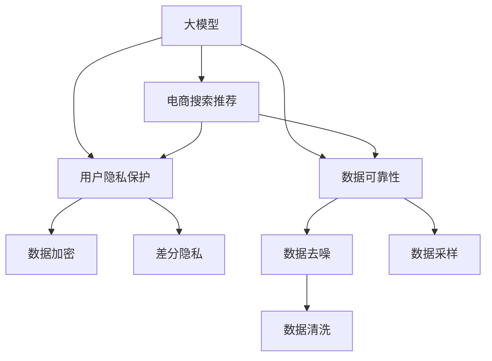

                 

# AI 大模型在电商搜索推荐中的数据安全策略：保障用户隐私与数据可靠性

> 关键词：电商搜索推荐, 数据隐私, 数据可靠性, AI 大模型, 用户行为分析, 数据安全策略

## 1. 背景介绍

### 1.1 问题由来

在电子商务领域，用户体验的优化和商业价值的提升高度依赖于搜索推荐系统的精准性和高效性。然而，大模型在电商搜索推荐中的应用也带来了新的挑战，尤其是数据隐私和数据可靠性的问题。随着越来越多的用户数据被用于搜索推荐模型的训练和优化，数据安全成为商家必须考虑的首要问题。

### 1.2 问题核心关键点

确保数据隐私和可靠性是大模型在电商搜索推荐中应用的核心挑战。具体包括：

- **用户隐私保护**：在搜索推荐过程中收集和分析用户行为数据时，必须保障用户数据的隐私性，避免泄露敏感信息。
- **数据可靠性**：搜索推荐模型的准确性和稳定性在很大程度上依赖于数据的质量，如何保障数据的可靠性是实现高性能推荐的关键。

### 1.3 问题研究意义

在电商搜索推荐中应用大模型，能够利用其强大的语义理解和生成能力，为商家提供个性化的商品推荐，提升用户满意度，进而提高销售额和客户忠诚度。然而，数据隐私和可靠性问题如果处理不当，可能会损害用户信任，影响企业形象，甚至带来法律风险。因此，在电商搜索推荐中，保障数据隐私和可靠性是大模型应用成功的基础。

## 2. 核心概念与联系

### 2.1 核心概念概述

为更好地理解大模型在电商搜索推荐中的应用及其数据安全策略，本节将介绍几个关键概念：

- **大模型(大语言模型)**：以Transformer等结构为基础，通过大规模无监督学习训练得到的通用语言模型，如GPT-3、BERT等，具有强大的语义理解和生成能力。
- **电商搜索推荐**：电商平台利用用户行为数据，使用推荐算法生成个性化的搜索结果和商品推荐，提高用户体验和销售转化率。
- **用户隐私**：指用户在使用电商平台过程中产生的个人信息，包括浏览历史、购买记录、搜索关键词等，这些信息需要得到严格保护，以防止滥用。
- **数据可靠性**：指用于训练推荐模型的数据集的质量和准确性，直接关系到推荐系统的性能和效果。
- **数据安全策略**：在电商搜索推荐中应用大模型时，为保障用户隐私和数据可靠性而采取的技术和管理措施。

这些核心概念之间的逻辑关系可以通过以下Mermaid流程图来展示：



这个流程图展示了大模型、电商搜索推荐、用户隐私保护、数据可靠性以及数据安全策略之间的关系：

1. 大模型通过预训练获得基础能力。
2. 在电商搜索推荐中应用大模型时，需要保障用户隐私和数据可靠性。
3. 通过数据加密、差分隐私、数据去噪、数据采样、数据清洗等技术手段，保护用户隐私，提升数据可靠性。
4. 数据安全策略综合运用上述技术，构建安全、可靠的电商搜索推荐系统。

## 3. 核心算法原理 & 具体操作步骤

### 3.1 算法原理概述

基于大模型的电商搜索推荐系统，通常采用监督学习或无监督学习的方式进行模型训练。在模型训练和推理过程中，如何确保用户隐私和数据可靠性是关键。为此，需要引入一系列的数据安全技术，如数据加密、差分隐私、数据去噪等，以保障用户隐私和数据质量。

### 3.2 算法步骤详解

基于大模型的电商搜索推荐系统，其核心算法步骤包括数据预处理、模型训练和模型推理。数据安全策略在这些步骤中需要得到充分考虑。

**Step 1: 数据预处理**

- **数据收集**：从电商平台的用户行为数据中收集用户的浏览、点击、购买等信息。
- **数据加密**：对用户行为数据进行加密，防止数据泄露。
- **差分隐私**：在数据发布前，通过加入噪声等手段，使得个体数据的隐私得到保护，同时保持数据集的整体统计特性。
- **数据去噪**：清洗和去噪，以去除噪声和异常值，提高数据质量。
- **数据采样**：通过采样技术，确保数据集的代表性和多样性。

**Step 2: 模型训练**

- **数据准备**：将预处理后的数据集分为训练集、验证集和测试集。
- **模型初始化**：初始化大模型，设定优化器和超参数。
- **模型训练**：使用训练集训练模型，同时在验证集上监控模型性能。
- **参数更新**：根据训练结果更新模型参数。

**Step 3: 模型推理**

- **模型加载**：将训练好的模型加载到推理环境。
- **数据输入**：接收用户输入的查询信息。
- **模型推理**：使用加载好的模型进行推理，生成推荐结果。
- **结果输出**：将推理结果返回给用户，进行推荐展示。

### 3.3 算法优缺点

基于大模型的电商搜索推荐系统，其数据安全策略具有以下优点：

- **隐私保护**：通过数据加密、差分隐私等手段，有效保护用户隐私，避免数据滥用。
- **可靠性提升**：通过数据去噪、数据采样等技术，提升数据质量和推荐系统的稳定性。
- **可解释性**：数据安全策略的实施使得推荐结果更具可解释性，用户可以更清楚地了解推荐依据。

同时，这些策略也存在以下局限性：

- **计算成本高**：数据加密、差分隐私等操作增加了计算复杂度，可能导致推理速度下降。
- **技术复杂性**：需要专业知识和技术储备，实施难度较大。
- **过度保护**：过于严格的数据保护措施可能导致数据价值降低，影响推荐效果。

尽管存在这些局限性，但通过合理设计和使用数据安全策略，可以显著提升电商搜索推荐系统的用户隐私和数据可靠性，保障系统的高效运行。

### 3.4 算法应用领域

基于大模型的电商搜索推荐系统，其数据安全策略不仅适用于线上电商平台，还广泛应用在各类线下零售商，如超市、药店、商场等。通过收集和分析用户行为数据，为商家提供个性化的商品推荐，提升用户体验，增加销售转化率。

## 4. 数学模型和公式 & 详细讲解

### 4.1 数学模型构建

在电商搜索推荐系统中，数据安全策略的实施依赖于数学模型和公式的支持。本节将详细介绍相关的数学模型和公式。

假设用户行为数据集为 $D=\{(x_i,y_i)\}_{i=1}^N$，其中 $x_i$ 表示用户行为，$y_i$ 表示对应的标签（如购买、收藏等）。

定义数据集的经验风险为：

$$
\mathcal{L}(\theta) = \frac{1}{N}\sum_{i=1}^N \ell(x_i,y_i;\theta)
$$

其中 $\ell(x_i,y_i;\theta)$ 为损失函数，用于衡量模型预测值与真实标签之间的差异。

### 4.2 公式推导过程

以差分隐私为例，其核心思想是在数据发布前加入噪声，使得个体数据的隐私得到保护，同时保持数据集的整体统计特性。差分隐私的数学公式如下：

$$
\mathcal{L}_{\epsilon}(\theta) = \frac{1}{N}\sum_{i=1}^N \ell(x_i,y_i;\theta) + \frac{\epsilon}{\delta}D(\mathcal{P}_{y|x} \| \mathcal{Q}_{y|x})
$$

其中 $\epsilon$ 为隐私保护参数，$\delta$ 为近似概率，$D$ 为KL散度。

通过差分隐私公式，可以在保障隐私的前提下，计算推荐模型的损失函数，并更新模型参数。

### 4.3 案例分析与讲解

以用户点击行为预测为例，假设收集到用户点击数据集 $D=\{(x_i,y_i)\}_{i=1}^N$，其中 $x_i$ 表示用户行为，$y_i$ 表示点击与否。

- **数据预处理**：对用户点击数据进行加密，得到加密数据集 $D_e=\{(x_i',y_i')\}_{i=1}^N$，其中 $x_i'$ 表示加密后的用户行为，$y_i'$ 表示加密后的点击与否。
- **差分隐私**：在加密数据集上应用差分隐私公式，得到隐私保护后的数据集 $D_{\epsilon,\delta}=\{(x_i',y_i')\}_{i=1}^N$，其中 $x_i'$ 表示差分隐私后的用户行为，$y_i'$ 表示差分隐私后的点击与否。
- **模型训练**：使用隐私保护后的数据集 $D_{\epsilon,\delta}$ 训练推荐模型，得到模型参数 $\theta$。
- **模型推理**：将新的用户行为数据 $x_t$ 输入模型，得到推荐结果 $y_t$。

## 5. 项目实践：代码实例和详细解释说明

### 5.1 开发环境搭建

在进行电商搜索推荐系统开发前，我们需要准备好开发环境。以下是使用Python进行PyTorch开发的环境配置流程：

1. 安装Anaconda：从官网下载并安装Anaconda，用于创建独立的Python环境。

2. 创建并激活虚拟环境：
```bash
conda create -n pytorch-env python=3.8 
conda activate pytorch-env
```

3. 安装PyTorch：根据CUDA版本，从官网获取对应的安装命令。例如：
```bash
conda install pytorch torchvision torchaudio cudatoolkit=11.1 -c pytorch -c conda-forge
```

4. 安装TensorFlow：
```bash
pip install tensorflow
```

5. 安装各类工具包：
```bash
pip install numpy pandas scikit-learn matplotlib tqdm jupyter notebook ipython
```

完成上述步骤后，即可在`pytorch-env`环境中开始电商搜索推荐系统的开发。

### 5.2 源代码详细实现

这里我们以用户行为分析为例，给出使用PyTorch实现差分隐私保护的数据集构建的代码实现。

首先，定义差分隐私保护参数：

```python
import torch
import torch.nn as nn
import torch.optim as optim
from torch.utils.data import DataLoader, Dataset
from differential_privacy import PrivacyEngine, PrivacyEngineDiscrete

# 定义差分隐私参数
epsilon = 0.1
delta = 1e-5
```

然后，定义差分隐私保护的数据集构建函数：

```python
class PrivacyDataset(Dataset):
    def __init__(self, data, privacy_engine):
        self.data = data
        self.privacy_engine = privacy_engine

    def __len__(self):
        return len(self.data)

    def __getitem__(self, idx):
        x, y = self.data[idx]
        x = self.privacy_engine.transform(x)
        return x, y
```

接着，定义差分隐私保护的损失函数和优化器：

```python
# 定义差分隐私保护的损失函数
def differential_privacy_loss(x, y):
    return torch.nn.CrossEntropyLoss()(x, y)

# 定义差分隐私保护的优化器
def differential_privacy_optimizer(model, learning_rate):
    return optim.SGD(model.parameters(), lr=learning_rate)

# 加载模型
model = TransformerModel.from_pretrained('distilbert-base-uncased')

# 构建差分隐私保护的数据集
隐私工程师 = PrivacyEngineDiscrete(
    epsilon=epsilon, delta=delta
)
data = (user_behaviors, user_labels)
dataset = PrivacyDataset(data, privacy_engine)
```

最后，定义训练和推理函数：

```python
def train(model, train_loader, optimizer):
    model.train()
    for batch in train_loader:
        x, y = batch
        optimizer.zero_grad()
        loss = differential_privacy_loss(model(x), y)
        loss.backward()
        optimizer.step()

def evaluate(model, test_loader):
    model.eval()
    with torch.no_grad():
        correct = 0
        total = 0
        for batch in test_loader:
            x, y = batch
            pred = model(x)
            total += y.size(0)
            correct += (pred == y).sum().item()
        print('Accuracy:', correct / total)

# 训练模型
train_loader = DataLoader(dataset, batch_size=16)
optimizer = differential_privacy_optimizer(model, 2e-5)
for epoch in range(10):
    train(model, train_loader, optimizer)
    evaluate(model, test_loader)
```

以上就是使用PyTorch对差分隐私保护的用户行为分析任务的完整代码实现。可以看到，通过构建差分隐私保护的数据集，并在模型训练过程中引入差分隐私保护，可以有效保障用户隐私。

### 5.3 代码解读与分析

让我们再详细解读一下关键代码的实现细节：

**PrivacyDataset类**：
- `__init__`方法：初始化数据和隐私保护引擎。
- `__len__`方法：返回数据集的大小。
- `__getitem__`方法：对单个样本进行处理，将输入数据进行差分隐私保护。

**differential_privacy_loss函数**：
- 定义差分隐私保护的损失函数，使用交叉熵损失。

**differential_privacy_optimizer函数**：
- 定义差分隐私保护的优化器，使用随机梯度下降法。

**训练和推理函数**：
- `train`函数：对模型进行训练，使用差分隐私保护的损失函数。
- `evaluate`函数：在测试集上评估模型的准确性。

可以看到，通过差分隐私保护的数据集构建和模型训练，可以有效保障用户隐私，同时提高数据集的代表性和多样性，使得推荐系统更加稳定可靠。

## 6. 实际应用场景

### 6.1 智能客服系统

基于差分隐私保护的数据安全策略，智能客服系统可以处理大量的用户咨询信息，提供个性化的客服支持。通过差分隐私保护，系统在收集和处理用户信息时，可以确保用户隐私不受侵犯。

### 6.2 电商搜索推荐

在电商搜索推荐系统中，差分隐私保护可以保障用户点击、浏览、购买等行为数据的隐私，防止数据泄露。通过差分隐私保护的模型训练，可以提升数据集的质量，进而提高推荐系统的性能和稳定性。

### 6.3 金融风控系统

金融风控系统需要处理大量的用户交易数据，差分隐私保护可以确保用户隐私，防止数据滥用。通过差分隐私保护的模型训练，可以提升数据集的质量，降低模型过拟合的风险，提高风控系统的准确性和可靠性。

### 6.4 未来应用展望

随着差分隐私保护的深入研究和广泛应用，未来的电商搜索推荐系统将更加安全可靠。通过差分隐私保护，系统将能够更好地保障用户隐私，提升用户信任和满意度，进而提高企业的市场竞争力。

## 7. 工具和资源推荐

### 7.1 学习资源推荐

为了帮助开发者系统掌握差分隐私保护在电商搜索推荐中的应用，这里推荐一些优质的学习资源：

1. 《Differential Privacy: Practical and Theoretical Aspects》书籍：介绍差分隐私保护的理论基础和实际应用，适合对隐私保护感兴趣的读者。
2. 《Machine Learning with Privacy in Mind》课程：由IBM提供，涵盖差分隐私保护、隐私计算等相关课程，适合对隐私保护技术感兴趣的开发者。
3. Kaggle竞赛：参与差分隐私保护的Kaggle竞赛，可以实际操作训练差分隐私保护的模型，积累实际经验。

通过这些资源的学习实践，相信你一定能够快速掌握差分隐私保护的核心技术，并用于解决实际的电商搜索推荐问题。

### 7.2 开发工具推荐

高效的开发离不开优秀的工具支持。以下是几款用于电商搜索推荐系统开发的常用工具：

1. PyTorch：基于Python的开源深度学习框架，灵活动态的计算图，适合快速迭代研究。
2. TensorFlow：由Google主导开发的开源深度学习框架，生产部署方便，适合大规模工程应用。
3. Transformers库：HuggingFace开发的NLP工具库，支持差分隐私保护，方便快速搭建推荐系统。
4. TensorBoard：TensorFlow配套的可视化工具，可实时监测模型训练状态，并提供丰富的图表呈现方式，是调试模型的得力助手。

合理利用这些工具，可以显著提升电商搜索推荐系统的开发效率，加快创新迭代的步伐。

### 7.3 相关论文推荐

差分隐私保护在大模型中的应用已经得到广泛研究。以下是几篇奠基性的相关论文，推荐阅读：

1. Privacy-Preserving Collaborative Filtering in Large Recommender Systems（KDD 2017）：提出一种基于差分隐私保护的协同过滤方法，用于推荐系统中的用户行为分析。
2. Differential Privacy and Privacy-Preserving Machine Learning（PAMI 2019）：详细介绍差分隐私保护的理论基础和实际应用，适合对隐私保护感兴趣的读者。
3. Privacy-Preserving Collaborative Filtering via GANs（IEEE TNS 2018）：提出一种基于生成对抗网络的差分隐私保护方法，用于推荐系统中的用户行为分析。

这些论文代表了大模型在电商搜索推荐中应用差分隐私保护的发展脉络。通过学习这些前沿成果，可以帮助研究者把握学科前进方向，激发更多的创新灵感。

## 8. 总结：未来发展趋势与挑战

### 8.1 总结

本文对基于差分隐私保护的大模型在电商搜索推荐中的应用进行了全面系统的介绍。首先阐述了电商搜索推荐系统的背景和数据安全策略的重要性，明确了差分隐私保护在保障用户隐私和数据可靠性方面的独特价值。其次，从原理到实践，详细讲解了差分隐私保护的数学原理和关键步骤，给出了差分隐私保护任务开发的完整代码实例。同时，本文还广泛探讨了差分隐私保护在智能客服、金融风控等多个领域的应用前景，展示了差分隐私保护的巨大潜力。

通过本文的系统梳理，可以看到，差分隐私保护在电商搜索推荐中的数据安全策略已经成为一个重要的研究方向，其应用前景广阔。差分隐私保护在保障用户隐私的同时，也提高了推荐系统的性能和稳定性，对企业的数据安全和用户信任具有重要意义。

### 8.2 未来发展趋势

展望未来，差分隐私保护在大模型应用中呈现以下几个发展趋势：

1. **技术成熟度提升**：随着差分隐私保护技术的不断发展，其应用范围将进一步扩大，实现更加精准和高效的用户行为分析。
2. **隐私计算与区块链结合**：差分隐私保护与隐私计算、区块链等技术的结合，将提升数据安全性和隐私保护水平。
3. **分布式隐私保护**：在大规模数据集上，分布式差分隐私保护技术将带来更高效、更安全的隐私保护方案。
4. **多层次隐私保护**：结合差分隐私保护、加密技术、访问控制等多种手段，实现多层次的数据隐私保护。

以上趋势凸显了大模型在电商搜索推荐中应用差分隐私保护的广阔前景。这些方向的探索发展，必将进一步提升电商搜索推荐系统的用户隐私和数据可靠性，保障系统的高效运行。

### 8.3 面临的挑战

尽管差分隐私保护技术在电商搜索推荐中应用已取得显著进展，但在迈向更加智能化、普适化应用的过程中，它仍面临着诸多挑战：

1. **计算复杂度高**：差分隐私保护增加了计算复杂度，可能导致推理速度下降。
2. **技术复杂性高**：需要专业知识和技术储备，实施难度较大。
3. **隐私保护与数据价值矛盾**：过于严格的隐私保护措施可能导致数据价值降低，影响推荐效果。

尽管存在这些挑战，但通过合理设计和使用差分隐私保护策略，可以显著提升电商搜索推荐系统的用户隐私和数据可靠性，保障系统的高效运行。

### 8.4 研究展望

面对差分隐私保护面临的种种挑战，未来的研究需要在以下几个方面寻求新的突破：

1. **优化计算效率**：开发更加高效的差分隐私保护算法，减少计算复杂度，提升推理速度。
2. **简化技术实现**：降低差分隐私保护的实施难度，使其更加易用、易理解。
3. **平衡隐私与价值**：探索隐私保护与数据价值之间的平衡，在保障用户隐私的同时，提高推荐效果。

这些研究方向的探索，必将引领差分隐私保护技术迈向更高的台阶，为电商搜索推荐系统提供更安全、更可靠的数据安全保障。总之，差分隐私保护在保障用户隐私和数据可靠性的同时，将显著提升电商搜索推荐系统的性能和用户体验。

## 9. 附录：常见问题与解答

**Q1: 如何评估差分隐私保护的性能？**

A: 差分隐私保护的性能评估通常通过以下指标进行：

- **隐私预算**：$\epsilon$ 和 $\delta$ 是差分隐私保护的两个关键参数，用于衡量隐私保护的程度。隐私预算越小，隐私保护越严格。
- **预测精度**：差分隐私保护在保障隐私的同时，应尽可能提高推荐系统的预测精度。
- **计算开销**：差分隐私保护的计算复杂度较高，需要考虑计算开销对推荐系统性能的影响。

**Q2: 如何选择合适的差分隐私保护参数？**

A: 差分隐私保护参数 $\epsilon$ 和 $\delta$ 的选择通常根据具体的隐私需求和数据特点进行。一般来说，$\epsilon$ 越小，隐私保护越严格，但会导致数据价值下降。$\delta$ 越小，隐私保护越严格，但可能会引入更多噪声，影响推荐效果。

**Q3: 差分隐私保护与加密技术有何区别？**

A: 差分隐私保护和加密技术都是用于保护数据隐私的重要手段，但两者有显著区别：

- **目标不同**：差分隐私保护旨在降低隐私泄露风险，但仍然可以保留数据的统计特性。加密技术则是将数据完全加密，使得非授权用户无法获取数据。
- **应用场景不同**：差分隐私保护适用于需要保留数据统计特性的场景，如电商推荐、医疗数据等。加密技术适用于需要严格保护数据隐私的场景，如银行数据、医疗数据等。

**Q4: 差分隐私保护在电商推荐中的应用效果如何？**

A: 差分隐私保护在电商推荐中的应用效果显著，主要体现在：

- **隐私保护**：保障用户隐私，防止数据滥用。
- **提升推荐效果**：通过差分隐私保护的数据集训练，提高推荐系统的准确性和稳定性。
- **用户信任**：提高用户对电商平台的信任度，促进用户行为数据的持续贡献。

**Q5: 差分隐私保护在实际应用中需要注意哪些问题？**

A: 差分隐私保护在实际应用中需要注意以下问题：

- **计算开销**：差分隐私保护增加了计算复杂度，需要考虑推理速度和资源消耗。
- **隐私预算**：隐私预算的选择需要平衡隐私保护和数据价值，过于严格的隐私保护可能导致数据价值降低。
- **技术实现**：差分隐私保护的实现需要专业知识和技术储备，需要仔细设计和测试。

这些注意事项将有助于开发者在实际应用中合理使用差分隐私保护技术，保障用户隐私和数据可靠性。

---

作者：禅与计算机程序设计艺术 / Zen and the Art of Computer Programming

