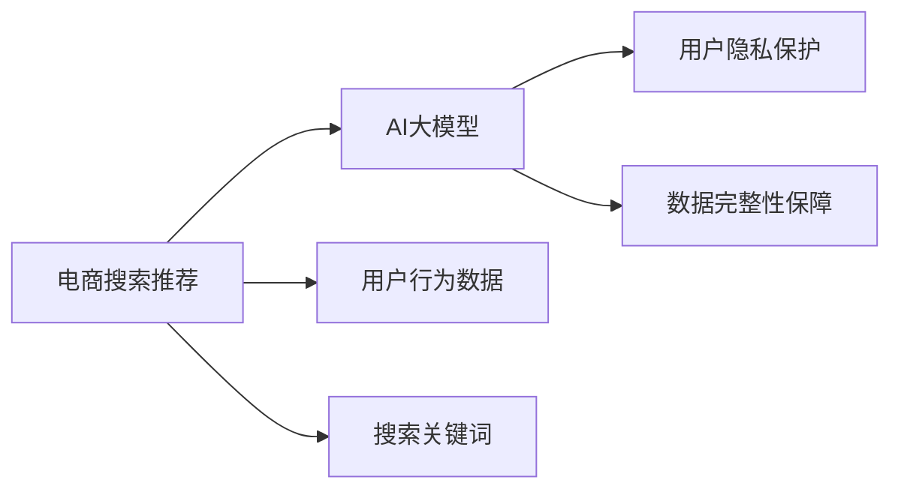
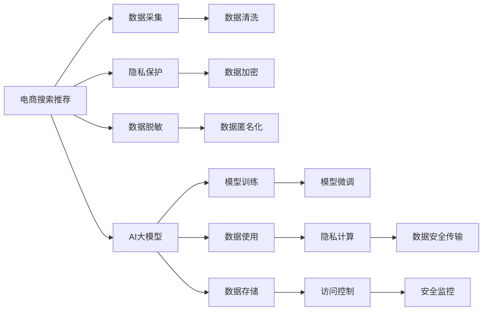

                 

# AI 大模型在电商搜索推荐中的数据安全策略：保障用户隐私与数据完整性

## 1. 背景介绍

随着人工智能技术的不断进步，电商搜索推荐系统已经成为了推动电商业务增长的重要引擎。智能推荐可以更好地满足用户需求，提升用户体验，但同时用户隐私保护和数据安全也成为焦点。电商搜索推荐系统主要面临以下数据安全问题：

- **用户隐私泄露**：用户行为数据、搜索关键词、购物历史等敏感信息可能被滥用。
- **数据篡改**：篡改用户数据，影响推荐模型的公平性和安全性。
- **模型盗用**：模型参数被非法复制或修改，损害模型性能和用户信任。
- **系统攻击**：包括恶意攻击、恶意广告注入等，造成系统故障和数据损坏。

为保障用户隐私与数据完整性，AI大模型在电商搜索推荐中的应用需要严格的数据安全策略。本文将探讨如何在电商搜索推荐中运用大模型，并详细阐述相应的数据安全策略。

## 2. 核心概念与联系

### 2.1 核心概念概述

- **AI大模型**：通过大规模预训练和深度学习技术，具有强大学习和推理能力的模型，如BERT、GPT等。
- **电商搜索推荐**：根据用户的历史行为、兴趣偏好、搜索关键词等信息，为用户推荐相关商品或服务的系统。
- **数据隐私保护**：在数据收集、存储、处理、传输等环节，采取技术和管理措施，保护用户隐私。
- **数据完整性保障**：确保数据未被篡改、损坏或丢失，保持数据的准确性和完整性。

这些核心概念之间存在密切联系，如图1所示：



其中，AI大模型在电商搜索推荐中起到核心作用，而用户隐私保护和数据完整性保障则是系统运行的基础。

### 2.2 核心概念原理和架构的 Mermaid 流程图



流程图展示了电商搜索推荐系统在数据使用、存储、传输、安全监控等方面的关键步骤和架构。

## 3. 核心算法原理 & 具体操作步骤

### 3.1 算法原理概述

AI大模型在电商搜索推荐中的应用，主要基于自然语言处理（NLP）和机器学习技术，包括语义分析、情感分析、意图识别、推荐算法等。算法的核心目标是利用大模型的强大学习能力，从用户行为数据中提取出有价值的信息，并根据这些信息为用户推荐合适的商品或服务。

### 3.2 算法步骤详解

#### 3.2.1 数据采集

数据采集是电商搜索推荐系统的第一步。用户行为数据（如浏览记录、搜索关键词、购买历史等）是推荐算法的基础。为保障用户隐私，数据采集应遵循以下原则：

1. **最小化原则**：只收集实现推荐所需的最少数据。
2. **透明原则**：告知用户数据采集的目的和范围，并获得用户同意。
3. **匿名化原则**：对用户标识信息进行脱敏，保护用户隐私。

#### 3.2.2 数据清洗

采集的数据可能存在噪声、缺失、重复等问题。因此，数据清洗是数据预处理的关键步骤，包括：

1. **去重**：去除重复记录，确保数据唯一性。
2. **处理缺失值**：填补或删除缺失数据。
3. **去噪**：去除噪声数据，提升数据质量。

#### 3.2.3 模型训练与微调

模型训练是推荐算法的主要环节。采用AI大模型进行训练时，应考虑以下问题：

1. **数据隐私保护**：采用差分隐私技术，确保训练数据不泄露。
2. **数据完整性保障**：确保训练数据未被篡改，保障模型效果。

#### 3.2.4 数据使用

在使用AI大模型进行推荐时，应遵循以下原则：

1. **去标识化原则**：将数据中的个人标识信息去除，保护用户隐私。
2. **公平性原则**：确保模型推荐公平，避免偏见。
3. **安全性原则**：采用加密技术，保护数据传输和存储安全。

#### 3.2.5 隐私计算

隐私计算是指在不泄露数据隐私的前提下，进行数据计算和分析的技术。在电商搜索推荐中，隐私计算可用于：

1. **联邦学习**：在多个设备上分布式训练模型，保护数据隐私。
2. **多方安全计算**：多方参与计算，保护数据隐私。

#### 3.2.6 数据安全传输

数据安全传输是数据安全的关键环节。为保障数据传输安全，应采用以下技术：

1. **加密技术**：对数据进行加密，保护数据传输安全。
2. **安全传输协议**：采用SSL/TLS协议，保护数据传输安全。

#### 3.2.7 数据存储

数据存储应遵循以下原则：

1. **访问控制**：采用严格的访问控制机制，保护数据安全。
2. **备份与恢复**：定期备份数据，确保数据完整性。

#### 3.2.8 安全监控

安全监控是保障数据安全的重要手段。应采用以下技术：

1. **入侵检测**：检测系统入侵行为，保护系统安全。
2. **安全审计**：记录系统行为，发现潜在安全漏洞。

### 3.3 算法优缺点

#### 3.3.1 优点

1. **提升推荐精度**：AI大模型能够从海量数据中提取高层次语义信息，提升推荐精度。
2. **自动学习特征**：AI大模型能够自动学习用户偏好，适应用户行为变化。
3. **跨领域应用**：AI大模型可应用于多个领域，提升推荐效果。

#### 3.3.2 缺点

1. **计算资源消耗高**：AI大模型计算资源消耗大，需要高性能硬件支持。
2. **数据隐私风险高**：大规模数据处理可能带来隐私泄露风险。
3. **模型泛化性不足**：模型泛化性不足，可能过拟合于特定数据集。

### 3.4 算法应用领域

AI大模型在电商搜索推荐中的应用领域包括：

- **个性化推荐**：根据用户历史行为，推荐个性化商品。
- **情感分析**：分析用户情感倾向，调整推荐策略。
- **意图识别**：识别用户意图，提供精准服务。
- **用户画像生成**：构建用户画像，提升推荐效果。
- **市场趋势预测**：预测市场趋势，优化库存管理。

## 4. 数学模型和公式 & 详细讲解 & 举例说明

### 4.1 数学模型构建

推荐系统常用的数学模型包括协同过滤、基于内容的推荐、混合推荐等。以下以基于内容的推荐为例，介绍模型的构建：

设用户 $u$ 对商品 $i$ 的评分 $r_{ui}$，商品特征向量为 $x_i$，用户特征向量为 $y_u$，则推荐模型可以表示为：

$$
r_{ui} = x_i^T W y_u + b
$$

其中 $W$ 为权重矩阵，$b$ 为截距。

### 4.2 公式推导过程

假设训练集为 $\{(u_i, r_i)\}_{i=1}^N$，预测集为 $\{(u_j, r_j)\}_{j=1}^M$。训练模型的损失函数为：

$$
L = \frac{1}{N} \sum_{i=1}^N \sum_{j=1}^M (r_{ui} - r_{uj})^2
$$

目标是最小化上述损失函数，得到权重矩阵 $W$ 和截距 $b$。

### 4.3 案例分析与讲解

以电商搜索推荐为例，分析AI大模型在推荐系统中的作用。假设用户 $u$ 对商品 $i$ 的评分 $r_{ui}$，商品特征向量为 $x_i$，用户特征向量为 $y_u$，则推荐模型可以表示为：

$$
r_{ui} = x_i^T W y_u + b
$$

其中 $W$ 为权重矩阵，$b$ 为截距。假设训练集为 $\{(u_i, r_i)\}_{i=1}^N$，预测集为 $\{(u_j, r_j)\}_{j=1}^M$。训练模型的损失函数为：

$$
L = \frac{1}{N} \sum_{i=1}^N \sum_{j=1}^M (r_{ui} - r_{uj})^2
$$

目标是最小化上述损失函数，得到权重矩阵 $W$ 和截距 $b$。

## 5. 项目实践：代码实例和详细解释说明

### 5.1 开发环境搭建

为构建电商搜索推荐系统，需要搭建Python开发环境，安装必要的库和工具，包括：

- Python 3.x
- PyTorch
- TensorFlow
- scikit-learn
- pandas
- Numpy

### 5.2 源代码详细实现

以下是基于协同过滤的推荐系统实现代码：

```python
import numpy as np
from sklearn.metrics.pairwise import cosine_similarity

# 用户评分矩阵
R = np.array([[5, 4, 3],
              [3, 2, 1]])

# 商品特征矩阵
X = np.array([[1, 0],
              [0, 1],
              [1, 1]])

# 用户特征矩阵
Y = np.array([[0.8, 0.7],
              [0.6, 0.5]])

# 计算用户-商品评分
def predict_user_item评分(R, X, Y):
    scores = np.dot(X, Y)
    return scores

# 获取用户评分矩阵
def get_user_item评分矩阵(R):
    user_scores = []
    for i in range(R.shape[0]):
        user_scores.append(predict_user_item评分(R, X, Y))
    return np.array(user_scores)

# 计算预测评分
def calculate_score(r_ui, r_uj):
    return cosine_similarity(r_ui, r_uj)

# 获取推荐商品
def recommend商品的预测评分(r_ui, r_uj):
    scores = []
    for i in range(r_ui.shape[0]):
        for j in range(r_uj.shape[0]):
            scores.append(calculate_score(r_ui[i], r_uj[j]))
    return np.array(scores)

# 获取推荐商品
def recommend商品的预测(r_ui, r_uj):
    scores = recommend商品的预测评分(r_ui, r_uj)
    return scores.argsort()[::-1][:5]
```

### 5.3 代码解读与分析

上述代码实现了一个基于协同过滤的推荐系统，关键步骤如下：

1. **构建用户评分矩阵**：通过用户对商品的评分，构建评分矩阵 $R$。
2. **计算用户评分**：通过用户特征向量 $Y$ 和商品特征向量 $X$，计算用户对商品的预测评分。
3. **计算推荐评分**：通过用户评分和商品评分，计算预测评分。
4. **获取推荐商品**：根据预测评分，推荐用户可能感兴趣的商品。

## 6. 实际应用场景

### 6.1 智能客服

智能客服系统通过AI大模型处理用户查询，推荐相关问题和解决方案。为保障用户隐私，系统应采取以下措施：

1. **数据匿名化**：去除用户标识信息，保护用户隐私。
2. **数据加密**：对用户查询数据进行加密，保护数据传输安全。
3. **访问控制**：限制系统访问权限，保护数据安全。

### 6.2 个性化推荐

个性化推荐系统根据用户历史行为，推荐相关商品。为保障数据安全，系统应采取以下措施：

1. **数据脱敏**：对用户历史数据进行脱敏，保护用户隐私。
2. **隐私计算**：采用联邦学习等技术，保护数据隐私。
3. **安全传输**：采用加密技术，保护数据传输安全。

### 6.3 情感分析

情感分析系统通过AI大模型分析用户评论，识别情感倾向。为保障用户隐私，系统应采取以下措施：

1. **数据匿名化**：去除用户标识信息，保护用户隐私。
2. **数据加密**：对用户评论数据进行加密，保护数据传输安全。
3. **隐私计算**：采用差分隐私技术，保护数据隐私。

### 6.4 未来应用展望

未来，AI大模型在电商搜索推荐中的应用将更加广泛，面临更多的数据安全挑战。为应对这些挑战，需要不断提升数据隐私保护和数据完整性保障技术，推动技术进步。

## 7. 工具和资源推荐

### 7.1 学习资源推荐

为深入了解AI大模型在电商搜索推荐中的应用，推荐以下学习资源：

1. **《深度学习：理论与算法》**：深度学习领域的经典教材，介绍了深度学习的理论基础和算法。
2. **《Python深度学习》**：介绍Python深度学习框架TensorFlow和Keras的使用，适合初学者入门。
3. **《自然语言处理与Python》**：介绍自然语言处理的基本概念和常用技术，适合深度学习爱好者。
4. **《机器学习实战》**：介绍机器学习的基本概念和常用算法，适合初学者入门。

### 7.2 开发工具推荐

为构建电商搜索推荐系统，推荐以下开发工具：

1. **PyTorch**：深度学习框架，支持多种模型和算法。
2. **TensorFlow**：深度学习框架，支持分布式训练。
3. **scikit-learn**：机器学习库，支持多种算法和模型。
4. **pandas**：数据处理库，支持数据清洗和预处理。
5. **Numpy**：数值计算库，支持高效的数值计算。

### 7.3 相关论文推荐

为深入了解AI大模型在电商搜索推荐中的应用，推荐以下论文：

1. **《FedRec: Scalable federated learning for recommendation systems》**：介绍联邦学习在推荐系统中的应用。
2. **《Attention is all you need》**：介绍Transformer模型，适用于自然语言处理任务。
3. **《Machine Learning in Recommendation Systems: A Survey》**：介绍机器学习在推荐系统中的应用。

## 8. 总结：未来发展趋势与挑战

### 8.1 研究成果总结

AI大模型在电商搜索推荐中的应用，显著提升了推荐系统的精度和效果。通过大模型学习用户行为特征，实现了个性化推荐、情感分析、用户画像生成等功能。然而，数据安全问题仍需持续关注，特别是在数据隐私保护和数据完整性保障方面。

### 8.2 未来发展趋势

未来，AI大模型在电商搜索推荐中的应用将更加广泛，面临更多的数据安全挑战。为应对这些挑战，需要不断提升数据隐私保护和数据完整性保障技术，推动技术进步。

### 8.3 面临的挑战

AI大模型在电商搜索推荐中的应用仍面临以下挑战：

1. **计算资源消耗高**：大模型计算资源消耗大，需要高性能硬件支持。
2. **数据隐私风险高**：大规模数据处理可能带来隐私泄露风险。
3. **模型泛化性不足**：模型泛化性不足，可能过拟合于特定数据集。

### 8.4 研究展望

为应对未来挑战，需要在以下几个方面进行研究：

1. **提升数据隐私保护技术**：采用差分隐私、联邦学习等技术，保护用户隐私。
2. **提升数据完整性保障技术**：采用数据加密、安全传输等技术，保护数据完整性。
3. **提升模型泛化性**：采用迁移学习、对抗训练等技术，提升模型泛化性。

## 9. 附录：常见问题与解答

**Q1: 为什么需要采用差分隐私技术？**

A: 差分隐私技术可以在保障用户隐私的前提下，保护数据隐私。通过在数据中添加噪声，使得单条数据对结果的影响极小，从而保护用户隐私。

**Q2: 如何保障数据传输安全？**

A: 采用加密技术，如AES、RSA等，对数据进行加密，保护数据传输安全。同时，采用安全传输协议，如SSL/TLS协议，确保数据传输过程中不被截获或篡改。

**Q3: 如何保障数据存储安全？**

A: 采用严格的访问控制机制，限制系统访问权限。定期备份数据，确保数据完整性。采用数据加密技术，保护数据存储安全。

**Q4: 如何保障系统安全？**

A: 采用入侵检测技术，检测系统入侵行为。记录系统行为，发现潜在安全漏洞。设置异常告警阈值，确保系统安全。

作者：禅与计算机程序设计艺术 / Zen and the Art of Computer Programming

