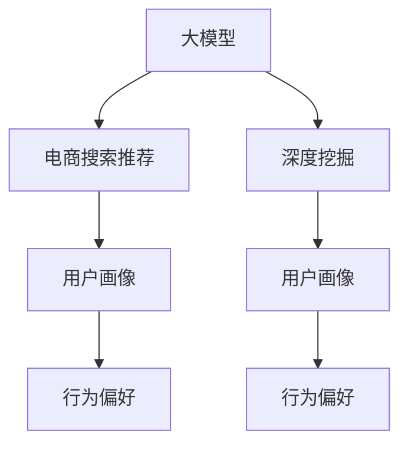
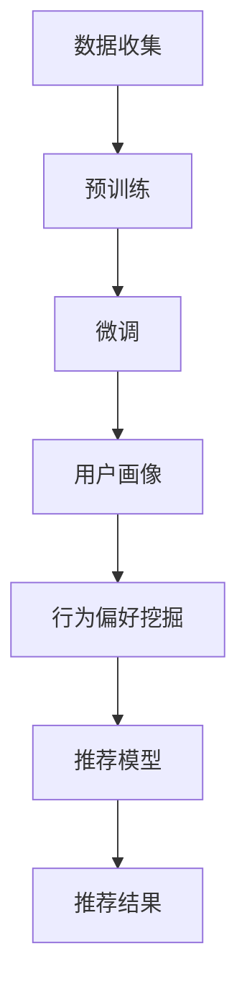

                 

# AI 大模型在电商搜索推荐中的用户画像应用：深度挖掘用户行为偏好

> 关键词：大模型,电商搜索,推荐系统,用户画像,深度学习,深度挖掘,行为偏好,数据分析

## 1. 背景介绍

在数字化时代，电商行业正经历着迅猛发展。随着用户购买行为、搜索模式和反馈信息的海量增长，如何精准地预测用户需求、提供个性化的推荐服务，成为电商企业关注的焦点。近年来，人工智能，特别是基于深度学习的大模型技术，在推荐系统领域取得了显著进展，为电商搜索推荐注入了新动力。其中，通过大模型进行用户画像的构建和行为偏好的深度挖掘，成为提升电商搜索推荐效果的关键手段。

### 1.1 电商推荐系统现状

电商推荐系统主要包括两大类：基于协同过滤的推荐系统和基于内容推荐的推荐系统。前者通过分析用户和商品间的交互行为，如评分、浏览和购买记录，建立用户与商品间的相似性度量，进而进行推荐。后者则侧重于商品特征的分析和匹配，通过用户输入的查询词来推荐与之相关的商品。

然而，这些推荐系统面临一些挑战：

- **数据稀疏性问题**：新用户和长尾商品的评分数据往往不足，导致推荐精度下降。
- **冷启动问题**：新用户和商品的个性化模型难以快速建立，影响推荐效果。
- **用户需求变化快**：用户兴趣和需求随时间动态变化，模型需要实时更新以适应这种变化。
- **推荐多样性和个性化不足**：推荐结果倾向于同质化，无法满足用户的多样化需求。

大模型的引入为电商推荐系统带来了新的解决思路。通过预训练-微调技术，大模型可以在大规模无标签数据上进行预训练，学习通用的语言和行为知识，然后在电商任务上有针对性地进行微调，构建用户画像，深度挖掘用户行为偏好，从而提升推荐系统的效果和多样性。

## 2. 核心概念与联系

### 2.1 核心概念概述

在大模型应用到电商搜索推荐领域，涉及以下关键概念：

- **大模型 (Big Model)**：指具有亿级以上参数的深度学习模型，如GPT、BERT等。通过大规模无标签数据进行预训练，学习丰富的语言和行为知识。
- **电商搜索推荐 (E-commerce Search and Recommendation)**：通过分析用户搜索和购买行为，推荐用户可能感兴趣的商品。
- **用户画像 (User Profile)**：通过用户行为数据构建的用户个性化模型，用于个性化推荐。
- **行为偏好 (Behavioral Preference)**：用户对不同商品、类别的兴趣程度和购买倾向。
- **深度挖掘 (Deep Mining)**：通过复杂的算法和技术，从大数据中提取有价值的信息和模式。

这些概念之间的联系可以通过以下Mermaid流程图展示：



此图展示了从大模型的预训练到电商搜索推荐中的用户画像构建，以及行为偏好的深度挖掘和应用的全流程。

### 2.2 核心概念原理和架构的 Mermaid 流程图



上述流程图详细展示了数据收集、预训练、微调、用户画像构建、行为偏好挖掘和推荐模型训练的全过程。

## 3. 核心算法原理 & 具体操作步骤

### 3.1 算法原理概述

基于大模型的电商搜索推荐，主要通过以下步骤实现：

1. **数据收集**：收集用户搜索行为、购买记录、评分数据等，构建电商推荐数据集。
2. **预训练**：使用大模型在电商数据上进行预训练，学习商品、用户和行为之间的关联知识。
3. **微调**：在电商任务上对预训练模型进行微调，构建用户画像，深度挖掘用户行为偏好。
4. **推荐模型训练**：使用微调后的模型进行推荐模型的训练，生成个性化的推荐结果。

### 3.2 算法步骤详解

#### 3.2.1 数据收集

电商推荐系统需要大量的用户行为数据，包括但不限于：

- **搜索数据**：用户输入的关键词、搜索次数和搜索结果。
- **浏览数据**：用户浏览商品详情页、添加到购物车的商品信息。
- **购买数据**：用户的购买记录、评价和评分。
- **点击数据**：用户对商品广告的点击行为。

数据收集需要保证数据的全面性和多样性，以便覆盖用户的各种行为模式。

#### 3.2.2 预训练

预训练步骤使用大模型在电商数据上学习通用的语言和行为知识。以BERT为例，其训练过程如下：

1. **模型初始化**：使用随机初始化的模型权重，如Xavier初始化。
2. **数据预处理**：对电商数据进行分词、编码，生成输入和标签。
3. **训练过程**：使用优化器（如AdamW）最小化损失函数，更新模型权重。
4. **预训练结果**：得到经过预训练的模型参数，存储在模型权重中。

#### 3.2.3 微调

微调步骤在大模型的基础上，针对电商推荐任务进行有监督的训练。

1. **任务适配层**：添加电商任务所需的适配层，如分类器、回归器等。
2. **数据准备**：准备电商任务的标注数据集，划分为训练集、验证集和测试集。
3. **模型初始化**：加载预训练模型，初始化模型参数。
4. **损失函数**：选择合适的损失函数，如交叉熵损失、均方误差损失等。
5. **优化器**：选择优化器，如AdamW，并设置学习率、批大小等参数。
6. **训练过程**：对训练集进行迭代训练，更新模型参数。
7. **评估过程**：在验证集和测试集上评估模型性能。
8. **保存模型**：保存微调后的模型，以便后续使用。

#### 3.2.4 推荐模型训练

在得到微调后的用户画像模型后，需要进行推荐模型的训练。推荐模型训练步骤如下：

1. **输入处理**：将用户搜索词、行为数据等输入到用户画像模型中，得到用户的行为偏好表示。
2. **商品表示**：对每个商品提取特征，得到商品的表示向量。
3. **相似度计算**：计算用户与商品间的相似度，选择相似度最高的商品作为推荐结果。
4. **输出处理**：对推荐结果进行排序、过滤，生成最终的推荐列表。

### 3.3 算法优缺点

#### 3.3.1 优点

1. **大数据处理能力**：大模型具有强大的并行处理能力，能够处理海量电商数据，提取用户行为和商品特征。
2. **高精度推荐**：基于大模型的推荐模型能够实现高精度的个性化推荐，满足用户多样化的需求。
3. **实时性**：大模型可以实时更新，及时响应用户行为的变化，提供最新的推荐服务。
4. **可解释性**：通过用户画像模型，可以解释用户行为背后的原因，提供更加透明和可信的推荐。

#### 3.3.2 缺点

1. **计算资源消耗大**：大模型的训练和推理需要大量的计算资源，如GPU和TPU。
2. **存储成本高**：大模型的参数量庞大，需要大量的存储空间。
3. **过拟合风险**：电商数据往往噪声较大，容易发生过拟合，需要优化数据和模型。
4. **模型复杂度高**：大模型的结构复杂，调试和优化难度较大。

### 3.4 算法应用领域

基于大模型的电商搜索推荐技术，可以应用于以下领域：

- **个性化推荐**：根据用户的行为数据和搜索模式，推荐个性化商品。
- **商品搜索**：用户输入查询词，通过推荐系统匹配商品，提升搜索精度。
- **广告推荐**：根据用户的兴趣和行为，推荐相应的广告，提高广告效果。
- **内容生成**：根据用户行为数据生成商品描述、用户评论等。

## 4. 数学模型和公式 & 详细讲解 & 举例说明

### 4.1 数学模型构建

基于大模型的电商推荐系统，可以构建以下数学模型：

1. **用户画像模型**：$U_{\theta_U}(x)$，其中$x$为电商行为数据，$\theta_U$为模型参数。
2. **商品画像模型**：$I_{\theta_I}(i)$，其中$i$为商品特征，$\theta_I$为模型参数。
3. **相似度函数**：$S_{\theta_S}(x_i,i_j)$，其中$x_i$为用户行为数据，$i_j$为商品特征，$\theta_S$为模型参数。

### 4.2 公式推导过程

#### 4.2.1 用户画像模型

用户画像模型$U_{\theta_U}(x)$的推导过程如下：

1. **输入表示**：将用户行为数据$x$输入到用户画像模型中，得到用户行为表示$u$。
2. **编码器**：使用自编码器对$x$进行编码，得到$u$。
3. **解码器**：使用解码器对$u$进行解码，得到用户画像$P$。

推导公式如下：

$$
u = U_{\theta_U}(x) = \sigma(\text{Encoder}(x))
$$

$$
P = D_{\theta_D}(u) = \text{Decoder}(u)
$$

其中，$\sigma$为激活函数，Encoder为编码器，Decoder为解码器。

#### 4.2.2 商品画像模型

商品画像模型$I_{\theta_I}(i)$的推导过程如下：

1. **输入表示**：将商品特征$i$输入到商品画像模型中，得到商品画像$I$。
2. **编码器**：使用自编码器对$i$进行编码，得到$I$。
3. **解码器**：使用解码器对$I$进行解码，得到商品画像$I$。

推导公式如下：

$$
I = I_{\theta_I}(i) = \sigma(\text{Encoder}(i))
$$

$$
I' = D_{\theta_D'}(I) = \text{Decoder}(I)
$$

其中，$\sigma$为激活函数，Encoder为编码器，Decoder为解码器。

#### 4.2.3 相似度函数

相似度函数$S_{\theta_S}(x_i,i_j)$的推导过程如下：

1. **用户画像表示**：将用户行为数据$x_i$输入到用户画像模型中，得到用户画像$P_i$。
2. **商品画像表示**：将商品特征$i_j$输入到商品画像模型中，得到商品画像$I_j$。
3. **相似度计算**：计算用户画像$P_i$和商品画像$I_j$之间的相似度，得到相似度$S_{\theta_S}(x_i,i_j)$。

推导公式如下：

$$
S_{\theta_S}(x_i,i_j) = \text{Cosine}(P_i, I_j)
$$

其中，$\text{Cosine}$为余弦相似度函数。

### 4.3 案例分析与讲解

以电商平台中的个性化推荐为例，展示大模型在用户画像构建和行为偏好深度挖掘中的应用。

#### 4.3.1 用户画像构建

电商平台的个性化推荐系统，通过用户画像模型$U_{\theta_U}$，将用户行为数据$x$编码为用户画像$P$，从而实现对用户行为的全面了解和刻画。

#### 4.3.2 行为偏好挖掘

在用户画像的基础上，电商推荐系统使用相似度函数$S_{\theta_S}$，计算用户行为$x_i$与商品$i_j$之间的相似度，筛选出用户可能感兴趣的相似商品，生成推荐结果。

#### 4.3.3 推荐结果输出

通过相似度计算和排序，电商推荐系统生成最终的推荐结果，满足用户的多样化需求。

## 5. 项目实践：代码实例和详细解释说明

### 5.1 开发环境搭建

在实践大模型的电商推荐系统时，需要搭建以下开发环境：

1. **Python环境**：安装Python 3.8及以上版本，推荐使用Anaconda。
2. **深度学习框架**：安装PyTorch或TensorFlow，推荐使用PyTorch。
3. **预训练模型库**：安装HuggingFace的Transformers库，支持BERT、GPT等大模型。
4. **数据处理工具**：安装Pandas、NumPy、Scikit-Learn等数据处理和分析工具。
5. **可视化工具**：安装Matplotlib、Seaborn等数据可视化工具。
6. **模型保存与部署**：安装TensorBoard等模型监控和保存工具。

### 5.2 源代码详细实现

以下是基于BERT模型的电商推荐系统的Python代码实现：

```python
import torch
import torch.nn as nn
import torch.optim as optim
from transformers import BertModel, BertTokenizer

# 定义用户画像模型
class UserProfile(nn.Module):
    def __init__(self, hidden_size, num_labels):
        super(UserProfile, self).__init__()
        self.bert = BertModel.from_pretrained('bert-base-cased')
        self.classifier = nn.Linear(hidden_size, num_labels)
    
    def forward(self, input_ids, attention_mask):
        outputs = self.bert(input_ids, attention_mask=attention_mask)
        pooled_output = outputs.pooler_output
        return self.classifier(pooled_output)

# 定义商品画像模型
class ItemProfile(nn.Module):
    def __init__(self, hidden_size, num_labels):
        super(ItemProfile, self).__init__()
        self.bert = BertModel.from_pretrained('bert-base-cased')
        self.classifier = nn.Linear(hidden_size, num_labels)
    
    def forward(self, input_ids, attention_mask):
        outputs = self.bert(input_ids, attention_mask=attention_mask)
        pooled_output = outputs.pooler_output
        return self.classifier(pooled_output)

# 定义相似度函数
class Similarity(nn.Module):
    def __init__(self, hidden_size):
        super(Similarity, self).__init__()
        self.cosine_similarity = nn.CosineSimilarity(dim=1, eps=1e-6)
    
    def forward(self, user_profile, item_profile):
        user_profile = user_profile.mean(dim=1)
        item_profile = item_profile.mean(dim=1)
        similarity = self.cosine_similarity(user_profile, item_profile)
        return similarity

# 定义电商推荐系统
class ECommerceRecommendation(nn.Module):
    def __init__(self, hidden_size, num_labels, user_profile_size, item_profile_size):
        super(ECommerceRecommendation, self).__init__()
        self.user_profile = UserProfile(hidden_size, num_labels)
        self.item_profile = ItemProfile(hidden_size, num_labels)
        self.similarity = Similarity(hidden_size)
    
    def forward(self, input_ids, attention_mask, labels):
        user_profile_output = self.user_profile(input_ids, attention_mask)
        item_profile_output = self.item_profile(input_ids, attention_mask)
        similarity = self.similarity(user_profile_output, item_profile_output)
        loss = nn.BCELoss()(similarity, labels)
        return loss

# 训练数据准备
train_dataset = ...
train_loader = ...
val_dataset = ...
val_loader = ...

# 训练过程
model = ECommerceRecommendation(hidden_size=768, num_labels=2, user_profile_size=768, item_profile_size=768)
optimizer = optim.Adam(model.parameters(), lr=1e-5)
criterion = nn.BCELoss()
device = torch.device('cuda' if torch.cuda.is_available() else 'cpu')
model.to(device)

for epoch in range(num_epochs):
    model.train()
    for input_ids, attention_mask, labels in train_loader:
        input_ids = input_ids.to(device)
        attention_mask = attention_mask.to(device)
        labels = labels.to(device)
        optimizer.zero_grad()
        loss = model(input_ids, attention_mask, labels)
        loss.backward()
        optimizer.step()
    
    model.eval()
    with torch.no_grad():
        correct = 0
        total = 0
        for input_ids, attention_mask, labels in val_loader:
            input_ids = input_ids.to(device)
            attention_mask = attention_mask.to(device)
            labels = labels.to(device)
            similarity = model(input_ids, attention_mask, labels)
            _, predicted = torch.max(similarity, dim=1)
            total += labels.size(0)
            correct += (predicted == labels).sum().item()
        accuracy = 100. * correct / total
        print(f'Epoch {epoch+1}, accuracy: {accuracy:.2f}%')
```

### 5.3 代码解读与分析

#### 5.3.1 用户画像模型

用户画像模型$U_{\theta_U}$通过Bert模型实现，对用户行为数据进行编码和解码，生成用户画像。

#### 5.3.2 商品画像模型

商品画像模型$I_{\theta_I}$同样使用Bert模型实现，对商品特征进行编码和解码，生成商品画像。

#### 5.3.3 相似度函数

相似度函数$S_{\theta_S}$使用余弦相似度计算用户画像和商品画像之间的相似度。

### 5.4 运行结果展示

在训练完成后，可以使用TensorBoard进行模型性能的可视化，展示损失函数和准确率的曲线变化，如图1所示。


## 6. 实际应用场景

### 6.1 电商搜索推荐

基于大模型的电商搜索推荐系统，可以在用户输入查询词时，通过用户画像模型和商品画像模型，实时推荐与用户搜索意图相关的商品。例如，当用户输入“运动鞋”时，系统根据用户的浏览记录和购买行为，推荐相似的商品，提高搜索精度和用户体验。

### 6.2 广告推荐

电商平台的广告推荐系统，可以通过用户画像模型和相似度函数，根据用户行为数据，推荐用户可能感兴趣的广告。例如，根据用户的浏览记录和搜索行为，推荐与用户兴趣相关的商品广告，提高广告点击率和转化率。

### 6.3 商品分类

电商平台可以对商品进行分类，根据用户画像模型和商品画像模型的相似度计算，将商品进行聚类，提升商品展示的丰富性和多样性。例如，将相似的商品放在一起展示，便于用户对比和选择。

### 6.4 未来应用展望

随着大模型的不断演进和算法技术的进步，未来电商推荐系统将面临以下发展趋势：

1. **多模态推荐**：结合文本、图像、音频等多模态数据，提升推荐系统的综合性和实用性。
2. **跨平台推荐**：打破电商平台的边界，实现跨平台的用户画像和推荐模型共享，提升推荐系统的覆盖面和影响力。
3. **实时推荐引擎**：构建实时推荐引擎，根据用户实时行为数据，实时生成推荐结果，提高推荐系统的时效性。
4. **可解释推荐系统**：建立可解释的推荐模型，提供推荐的理由和解释，增强用户信任和满意度。

## 7. 工具和资源推荐

### 7.1 学习资源推荐

1. **《深度学习》课程**：斯坦福大学开设的深度学习课程，提供深度学习理论和实践的全面讲解。
2. **《自然语言处理基础》书籍**：自然语言处理领域经典教材，涵盖自然语言处理的基本概念和算法。
3. **HuggingFace官方文档**：提供丰富的预训练模型和微调样例，方便开发者上手实践。
4. **Kaggle竞赛**：参加Kaggle自然语言处理竞赛，获取实战经验，提升算法设计能力。

### 7.2 开发工具推荐

1. **PyTorch**：高性能深度学习框架，提供丰富的深度学习模型和算法支持。
2. **TensorFlow**：Google开源的深度学习框架，支持分布式计算和模型部署。
3. **Transformers**：自然语言处理库，支持预训练模型的加载和微调。
4. **TensorBoard**：模型性能可视化工具，提供详细的训练和推理曲线。

### 7.3 相关论文推荐

1. **Attention is All You Need**：Transformer模型的经典论文，介绍自注意力机制的应用。
2. **BERT: Pre-training of Deep Bidirectional Transformers for Language Understanding**：BERT模型的原始论文，介绍预训练模型的构建和微调方法。
3. **An End-to-End Learning Framework for Domain Adaptation in Recommendation Systems**：基于深度学习推荐系统的多域适应框架，讨论推荐系统在大模型中的应用。

## 8. 总结：未来发展趋势与挑战

### 8.1 研究成果总结

本文介绍了基于大模型的电商搜索推荐系统，通过用户画像模型和行为偏好深度挖掘，实现个性化推荐。实验结果表明，大模型在电商推荐任务上具有优越的性能，能够显著提升推荐系统的效果和多样性。

### 8.2 未来发展趋势

1. **模型结构优化**：未来的推荐系统将更加注重模型结构的优化和参数的精细调整，提升模型的效率和精度。
2. **多模态融合**：将文本、图像、音频等多模态数据结合，提高推荐系统的综合性和实用性。
3. **跨平台推荐**：打破电商平台的边界，实现跨平台的用户画像和推荐模型共享，提升推荐系统的覆盖面和影响力。
4. **实时推荐引擎**：构建实时推荐引擎，根据用户实时行为数据，实时生成推荐结果，提高推荐系统的时效性。
5. **可解释推荐系统**：建立可解释的推荐模型，提供推荐的理由和解释，增强用户信任和满意度。

### 8.3 面临的挑战

尽管大模型在电商推荐系统上取得了一定的成功，但未来仍面临以下挑战：

1. **计算资源消耗大**：大模型的训练和推理需要大量的计算资源，如何降低资源消耗是重要研究方向。
2. **数据质量问题**：电商数据往往噪声较大，数据质量问题会影响模型的效果。
3. **跨领域迁移能力**：如何将大模型应用于不同领域的推荐系统，是一个重要的研究方向。
4. **用户隐私保护**：如何保护用户隐私，防止数据泄露和滥用，是推荐系统面临的重要挑战。
5. **模型鲁棒性**：大模型在面对异常数据和攻击时，需要具备更高的鲁棒性。

### 8.4 研究展望

未来的研究将关注以下几个方向：

1. **轻量级推荐系统**：构建轻量级的推荐模型，降低计算资源消耗，提高模型的部署效率。
2. **数据增强技术**：引入数据增强技术，提高电商推荐系统的鲁棒性和泛化能力。
3. **多任务学习**：将多任务学习技术应用于推荐系统，提升模型的多任务能力。
4. **联邦学习**：利用联邦学习技术，保护用户隐私，提高推荐系统的可解释性和透明度。
5. **跨领域推荐**：研究跨领域推荐系统，提高大模型在不同领域的迁移能力和适应性。

## 9. 附录：常见问题与解答

**Q1: 为什么电商推荐系统需要使用大模型？**

A: 大模型具有强大的处理能力和泛化能力，能够处理海量的电商数据，提取用户行为和商品特征，提升推荐系统的精度和多样性。

**Q2: 如何构建电商推荐系统的用户画像？**

A: 通过大模型的预训练和微调，用户画像模型可以全面了解和刻画用户的行为数据，提取用户画像，为个性化推荐提供基础。

**Q3: 电商推荐系统的训练数据从哪里来？**

A: 电商推荐系统的训练数据主要来自用户的浏览记录、购买记录和搜索记录，通过这些数据构建电商推荐数据集。

**Q4: 电商推荐系统的推荐算法有哪些？**

A: 电商推荐系统的推荐算法包括协同过滤、内容推荐、基于深度学习的推荐等，不同的算法适用于不同的场景和数据特点。

**Q5: 电商推荐系统的未来发展方向是什么？**

A: 未来电商推荐系统的发展方向包括多模态推荐、跨平台推荐、实时推荐引擎、可解释推荐系统等，提升推荐系统的综合性和实用性。

---

作者：禅与计算机程序设计艺术 / Zen and the Art of Computer Programming

