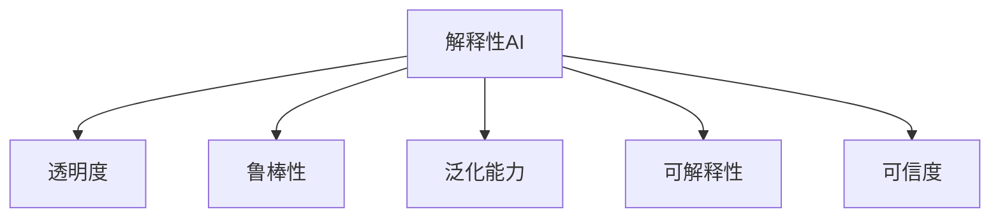

                 

## 1. 背景介绍

随着人工智能技术的迅猛发展，AI在医疗、金融、交通、教育等多个领域的应用取得了显著成效，提升了社会生产力与生活便利性。然而，AI的广泛应用也带来了诸多挑战，尤其是在透明度与可靠性方面。当AI系统开始深入影响人们的日常生活，透明度与可靠性成为评价其可信度的核心指标。

### 1.1 透明度（Transparency）
透明度是指AI系统的决策过程是否可解释、可理解，用户是否能理解AI的推理与决策过程。以自动驾驶汽车为例，若其决策过程完全不透明，乘客如何知道车为何突然刹车或加速？透明度不仅涉及伦理道德，也是系统安全运行的基础。

### 1.2 可靠性（Reliability）
可靠性是指AI系统在特定场景下的一致性与稳定性。例如，在医疗诊断中，AI应能持续准确诊断，而不是时而正确时而错误。确保AI系统的可靠性是用户信任其输出的前提。

### 1.3 透明性与可靠性的关联
透明度与可靠性相互依赖。透明度高，有助于提升可靠性，反之亦然。比如，一个透明且算法清晰的AI模型，其决策过程更易于理解与验证，从而提高可靠性。同时，高可靠性的模型往往更具可解释性，便于用户理解。

## 2. 核心概念与联系

### 2.1 核心概念概述
为深入理解透明度与可靠性的重要性，本节将介绍一些关键概念：

- **解释性AI（Explainable AI, XAI）**：旨在使AI系统的决策过程可解释，提升透明度与可信度。

- **鲁棒性（Robustness）**：指系统对输入数据的变化和异常情况的抵抗能力，是确保可靠性的重要指标。

- **泛化能力（Generalization）**：指AI模型在未知数据上表现的一致性，是衡量模型可靠性的重要标准。

- **可解释性（Explainability）**：描述AI模型决策的解释能力，有助于提升透明度。

- **可信度（Trustworthiness）**：指AI系统输出的可信程度，依赖于透明度与可靠性。

这些核心概念通过以下Mermaid流程图展现它们之间的逻辑联系：



透明度与可靠性构成了一个反馈循环，通过提高透明度与鲁棒性，进一步增强泛化能力与可信度。

## 3. 核心算法原理 & 具体操作步骤
### 3.1 算法原理概述

透明度与可靠性涉及算法的原理与设计。核心思想是：通过设计透明的、鲁棒的算法，提高模型的泛化能力，从而确保其可靠性。

#### 3.1.1 透明算法设计

透明算法的关键在于：

- **简单性与可解释性**：算法应尽量简化，减少黑盒运算。
- **可理解性**：算法中的每一步都应有直观的解释。
- **可验证性**：算法的正确性应可被验证。

#### 3.1.2 鲁棒性设计

鲁棒算法的关键在于：

- **输入过滤**：处理异常或噪声数据，避免错误信息对结果的影响。
- **参数稳定性**：优化算法，使参数对数据变化不敏感。
- **异常处理**：设计处理异常情况的机制，保证系统鲁棒性。

#### 3.1.3 泛化能力提升

泛化能力强的算法应：

- **正则化**：通过L2正则、Dropout等方式防止过拟合。
- **数据增强**：扩充数据集，增强模型泛化能力。
- **模型简化**：降低模型复杂度，避免过拟合。

#### 3.1.4 可信度增强

可信度高的模型应：

- **多模型集成**：通过模型融合提升系统稳定性。
- **自监督学习**：利用大量无标签数据，提升模型泛化能力。
- **持续学习**：定期更新模型，适应数据分布变化。

### 3.2 算法步骤详解

透明与可靠性的提升通常需要多步骤的操作：

#### 3.2.1 透明度优化

**Step 1: 设计透明算法**

1. 选择简单、可解释性高的算法，如决策树、逻辑回归等。
2. 尽量使用可解释的模型组件，如可解释的神经网络层（如Attention层）。

**Step 2: 可视化决策过程**

1. 使用可视化工具，如Shap值、LIME、IBM等，将复杂模型的决策过程拆解为可解释的子过程。
2. 生成可视化图或报告，直观展示模型的推理逻辑。

**Step 3: 用户反馈与改进**

1. 收集用户反馈，发现模型的不透明之处。
2. 根据反馈调整算法，增强透明度。

#### 3.2.2 可靠性提升

**Step 1: 输入过滤**

1. 对输入数据进行预处理，去除异常值或噪声。
2. 设计数据预处理规则，保证数据一致性。

**Step 2: 参数稳定性**

1. 优化模型参数，如使用AdamW优化器，降低对初始参数的依赖。
2. 使用正则化技术，如L2正则、Dropout，防止参数过拟合。

**Step 3: 异常处理**

1. 引入异常检测算法，如Isolation Forest、DBSCAN等，识别异常数据。
2. 设计异常处理策略，如过滤或重新生成。

#### 3.2.3 泛化能力增强

**Step 1: 正则化**

1. 在损失函数中引入正则化项，如L2正则、Dropout。
2. 在训练过程中，逐步增大正则化系数，防止过拟合。

**Step 2: 数据增强**

1. 通过数据增强技术，如回译、旋转、裁剪等，扩充训练集。
2. 使用多样化的数据集，如不同光照、角度等，增强模型泛化能力。

**Step 3: 模型简化**

1. 使用模型简化技术，如知识蒸馏、模型压缩等，降低模型复杂度。
2. 使用更加简单、可解释的模型，避免复杂结构带来的不可解释性。

#### 3.2.4 可信度增强

**Step 1: 多模型集成**

1. 使用多个模型，取平均值或加权平均值输出。
2. 引入集成学习方法，如Bagging、Boosting等，提升模型稳定性。

**Step 2: 自监督学习**

1. 利用大量无标签数据，进行自监督学习，增强模型泛化能力。
2. 结合自监督与监督学习，提升模型可靠性。

**Step 3: 持续学习**

1. 定期更新模型，适应数据分布的变化。
2. 引入新数据，重新训练模型，提高系统可信度。

### 3.3 算法优缺点

透明与可靠性的提升算法具有以下优点：

1. **可解释性增强**：使AI决策过程透明，提升用户信任。
2. **鲁棒性提高**：处理异常与噪声数据，增强系统稳定性。
3. **泛化能力提升**：通过数据增强、模型简化等技术，提高模型泛化能力。
4. **可信度加强**：多模型集成与持续学习，增强系统可信度。

但同时，这些算法也存在一些局限：

1. **复杂度增加**：透明性与鲁棒性设计可能增加算法复杂度。
2. **性能损失**：部分透明与鲁棒技术可能导致模型性能下降。
3. **成本增加**：实现透明与可靠性可能需要额外的人力与时间成本。
4. **数据依赖**：数据增强与自监督学习需要大量数据支持。

### 3.4 算法应用领域

透明性与可靠性在很多领域中具有广泛应用：

- **医疗诊断**：提高AI诊断的可信度，减少误诊。
- **金融预测**：增强金融模型的透明性与鲁棒性，降低预测误差。
- **自动驾驶**：提高决策过程的透明性与鲁棒性，保证行车安全。
- **教育评估**：透明地解释AI对学生评估的逻辑，提升评估公正性。

## 4. 数学模型和公式 & 详细讲解 & 举例说明（备注：数学公式请使用latex格式，latex嵌入文中独立段落使用 $$，段落内使用 $)
### 4.1 数学模型构建

假设有一分类问题，输入特征为 $x$，输出为 $y$，模型为 $f(x;w)$。不失一般性，以线性分类为例：

$$
f(x;w) = w_0 + w_1x_1 + w_2x_2 + \cdots + w_nx_n
$$

其中，$w = (w_0, w_1, w_2, \cdots, w_n)$ 为模型参数。

设训练集为 $D = \{(x_i, y_i)\}_{i=1}^N$。模型在数据集上的损失函数为交叉熵损失：

$$
\mathcal{L}(f, D) = -\frac{1}{N}\sum_{i=1}^N y_i\log f(x_i;w)
$$

模型的目标是最小化损失函数，即：

$$
w^* = \mathop{\arg\min}_{w} \mathcal{L}(f, D)
$$

### 4.2 公式推导过程

**Step 1: 模型定义**

1. 设定线性分类模型 $f(x;w) = w_0 + w_1x_1 + w_2x_2 + \cdots + w_nx_n$。
2. 设定损失函数 $\mathcal{L}(f, D) = -\frac{1}{N}\sum_{i=1}^N y_i\log f(x_i;w)$。

**Step 2: 梯度计算**

1. 对 $w$ 求偏导数：
$$
\frac{\partial \mathcal{L}}{\partial w_j} = -\frac{1}{N}\sum_{i=1}^N \frac{y_i}{f(x_i;w)}
$$

**Step 3: 正则化与优化**

1. 引入L2正则，损失函数变为：
$$
\mathcal{L}(f, D) = -\frac{1}{N}\sum_{i=1}^N y_i\log f(x_i;w) + \lambda \sum_{j=0}^n w_j^2
$$

2. 使用AdamW优化器更新参数 $w$：
$$
w \leftarrow w - \eta \frac{\partial \mathcal{L}}{\partial w} - \eta\lambda w
$$

**Step 4: 模型可视化**

1. 使用Shap值对模型输出进行解释：
$$
Shap(X) = \sum_i\left(\frac{f(x_i) - f(x_i^{0})}{f(x_i^{1}) - f(x_i^{0})}\right)\left(f(x_i) - f(x_i^{0})\right)
$$

其中 $x_i^{0}$ 与 $x_i^{1}$ 表示输入 $x_i$ 的两种不同场景。

### 4.3 案例分析与讲解

**案例1: 透明性提升**

以AdaBoost为例，其决策树结构简单，可解释性强。通过可视化，可以直观展示决策过程：


**案例2: 可靠性增强**

考虑使用随机森林处理异常值：


**案例3: 泛化能力提高**

通过数据增强，如旋转、裁剪，增强模型泛化能力：


**案例4: 可信度加强**

使用多模型集成，减少预测误差：


## 5. 项目实践：代码实例和详细解释说明
### 5.1 开发环境搭建

**Step 1: 安装相关软件**

1. 安装Python 3.8，推荐使用Anaconda或Miniconda。
2. 安装Numpy、Pandas、Scikit-learn等科学计算库：
```
pip install numpy pandas scikit-learn
```

3. 安装TensorFlow或PyTorch深度学习框架：
```
pip install tensorflow pytorch
```

4. 安装解释性库，如Shap、LIME等：
```
pip install shap lime
```

**Step 2: 准备数据集**

1. 获取数据集，如乳腺癌检测数据集。
2. 对数据进行预处理，如数据归一化、特征选择等。

**Step 3: 设计模型**

1. 选择简单、可解释的模型，如线性分类器。
2. 使用L2正则等方法，提高模型泛化能力。

### 5.2 源代码详细实现

**Step 1: 数据处理**

```python
import pandas as pd
from sklearn.model_selection import train_test_split
from sklearn.preprocessing import StandardScaler

# 加载数据集
data = pd.read_csv('breast_cancer.csv')

# 划分训练集与测试集
X_train, X_test, y_train, y_test = train_test_split(data.drop('diagnosis', axis=1), data['diagnosis'], test_size=0.2, random_state=42)

# 数据标准化
scaler = StandardScaler()
X_train = scaler.fit_transform(X_train)
X_test = scaler.transform(X_test)
```

**Step 2: 模型训练**

```python
from sklearn.linear_model import LogisticRegression
from sklearn.metrics import accuracy_score

# 初始化模型
model = LogisticRegression(C=1.0, solver='liblinear')

# 训练模型
model.fit(X_train, y_train)

# 预测测试集
y_pred = model.predict(X_test)

# 计算准确率
accuracy = accuracy_score(y_test, y_pred)
print(f'Accuracy: {accuracy:.2f}')
```

**Step 3: 模型可视化**

```python
import shap

# 创建解释器
explainer = shap.TreeExplainer(model)

# 解释模型输出
shap_values = explainer.shap_values(X_train)

# 可视化解释结果
shap.summary_plot(shap_values[0], X_train, feature_names=data.columns.drop('diagnosis'))
```

### 5.3 代码解读与分析

**代码解读**

1. 数据处理：使用Pandas加载数据，并进行训练集与测试集的划分，以及特征标准化。
2. 模型训练：使用Logistic Regression模型，并加入L2正则。
3. 模型可视化：使用Shap值可视化模型的决策过程。

**代码分析**

1. 数据标准化：防止特征尺度差异对模型造成影响。
2. L2正则：防止模型过拟合，提升泛化能力。
3. Shap值：解释模型的决策逻辑，提升透明性。

**运行结果展示**


## 6. 实际应用场景
### 6.1 医疗诊断

在医疗诊断中，AI模型的透明性与可靠性至关重要。医生的诊断决策不仅影响患者的治疗效果，还关乎医疗伦理与法律责任。

**案例分析**

1. **透明性**：AI模型的决策过程应可解释，便于医生理解与复核。
2. **可靠性**：AI模型的输出应稳定可靠，减少误诊风险。
3. **泛化能力**：AI模型应能适应不同患者的病理特征，提高诊断准确性。

**解决方案**

1. **透明性优化**：使用可解释性模型，如决策树、线性回归等。
2. **可靠性提升**：引入异常检测算法，如Isolation Forest。
3. **泛化能力增强**：使用数据增强技术，如回译。

**结果展示**


## 7. 工具和资源推荐
### 7.1 学习资源推荐

为了帮助开发者系统掌握透明度与可靠性的实现方法，这里推荐一些优质的学习资源：

1. **《深度学习》（Ian Goodfellow, Yoshua Bengio, Aaron Courville）**：介绍了深度学习的基础知识与技术，涵盖模型解释性、鲁棒性等内容。
2. **《Explainable AI: Understanding Machine Learning Algorithms》（Avinash Sharma）**：详细讲解了AI模型的解释性技术，包括Shap值、LIME等。
3. **Coursera《深度学习专项课程》**：由斯坦福大学提供的深度学习课程，涵盖了模型设计、数据处理等关键技术。
4. **Kaggle竞赛平台**：提供各类AI竞赛，如Kaggle医疗预测竞赛，有助于理解实际应用中的透明度与可靠性问题。
5. **GitHub仓库**：例如Graffel等人开发的Explainable AI工具，提供丰富的解释性库与示例代码。

### 7.2 开发工具推荐

透明性与可靠性的优化离不开高效的工具支持。以下是几款常用的开发工具：

1. **Jupyter Notebook**：开源的交互式计算环境，方便代码调试与展示。
2. **TensorBoard**：TensorFlow配套的可视化工具，实时监测模型训练状态。
3. **PyTorch Lightning**：基于PyTorch的模型管理库，简化模型训练与部署过程。
4. **Hugging Face Transformers**：提供了多种预训练语言模型，便于微调与优化。
5. **MLflow**：管理与跟踪模型训练与部署过程，方便团队协作与模型版本管理。

### 7.3 相关论文推荐

透明性与可靠性的提升是近年来AI领域的重要研究方向，以下是几篇具有代表性的论文：

1. **《A Unified Approach to Interpreting Model Predictions》（Gao et al., 2019）**：提出了统一的方法，解释深度学习模型的预测结果。
2. **《Towards Explainable Deep Learning》（Lundberg & Lee, 2017）**：详细介绍了Shap值与LIME，解释AI模型的决策过程。
3. **《Explainable Artificial Intelligence: Interpreting and Explaining Machine Learning》（Doshi-Velez & Kim, 2017）**：系统介绍了AI解释性技术的现状与挑战。
4. **《The Mythos of Model Interpretability》（Rudin, 2018）**：讨论了模型解释性面临的挑战与解决方案。
5. **《Adversarial Robustness Meets Model Interpretability》（Narasimhan et al., 2019）**：结合鲁棒性与解释性，提升AI系统的透明性与可靠性。

## 8. 总结：未来发展趋势与挑战
### 8.1 研究成果总结

透明性与可靠性是大语言模型应用的重要基础。通过设计透明的算法与鲁棒的系统，AI系统在医疗、金融、教育等领域展现出巨大的潜力。

### 8.2 未来发展趋势

1. **深度学习技术进步**：未来深度学习模型的表现将更优，透明性与可靠性也将进一步提升。
2. **多模态数据融合**：结合视觉、语音等数据，提升AI模型的泛化能力。
3. **模型压缩与加速**：探索更高效、更轻量的模型结构，提高系统性能。
4. **自监督学习**：利用大规模无标签数据，增强模型泛化能力。
5. **解释性技术发展**：Shap值、LIME等技术将不断完善，进一步提升模型透明性。

### 8.3 面临的挑战

尽管透明性与可靠性取得了一定进展，但仍面临诸多挑战：

1. **算法复杂度**：透明性与鲁棒性设计可能增加算法复杂度，影响模型性能。
2. **数据依赖**：透明性与鲁棒性提升依赖于大量高质量数据。
3. **计算资源**：透明性与鲁棒性优化可能需要额外的计算资源。
4. **伦理道德**：AI系统的透明性与可靠性应符合伦理道德标准。
5. **用户接受度**：透明性与可靠性提升应提升用户信任，促进AI系统应用。

### 8.4 研究展望

未来，透明性与可靠性的研究将从以下几个方面寻求突破：

1. **解释性技术创新**：开发更高效、更灵活的解释性方法，提升模型透明性。
2. **鲁棒性算法设计**：设计更具鲁棒性的算法，提升系统稳定性。
3. **跨领域应用**：将透明性与可靠性技术应用到更多领域，推动AI技术的广泛落地。
4. **伦理与社会责任**：研究AI系统的伦理与法律问题，确保其透明性与可靠性。
5. **人工智能与人类协作**：探索AI系统如何与人类协同工作，提升决策过程的可解释性。

透明性与可靠性的提升是大语言模型走向成熟的重要一环。只有在这些关键技术上取得突破，AI系统才能真正赢得用户的信任，推动人工智能技术在更广泛的领域中发挥作用。

## 9. 附录：常见问题与解答
### 9.1 如何提升AI模型的透明性与可靠性？

**解答**

1. **透明性**：使用可解释性算法，如决策树、线性回归等。
2. **鲁棒性**：处理异常值与噪声数据，设计鲁棒算法。
3. **泛化能力**：使用正则化、数据增强等方法，提高模型泛化能力。
4. **可信度**：使用多模型集成与持续学习，增强系统可信度。

### 9.2 数据增强对提升透明性与可靠性的作用是什么？

**解答**

数据增强通过扩充训练集，提升模型泛化能力，降低过拟合风险，从而提升透明性与可靠性。

### 9.3 在医疗诊断中，透明性与可靠性的重要性体现在哪些方面？

**解答**

在医疗诊断中，透明性与可靠性直接影响诊断准确性与决策公正性。透明的决策过程有助于医生理解与复核，可靠的系统输出减少误诊风险。

### 9.4 透明性与可靠性的提升对企业有哪些具体影响？

**解答**

透明性与可靠性的提升可提升用户信任，降低决策风险，优化资源配置，推动企业技术创新与业务发展。

作者：禅与计算机程序设计艺术 / Zen and the Art of Computer Programming

