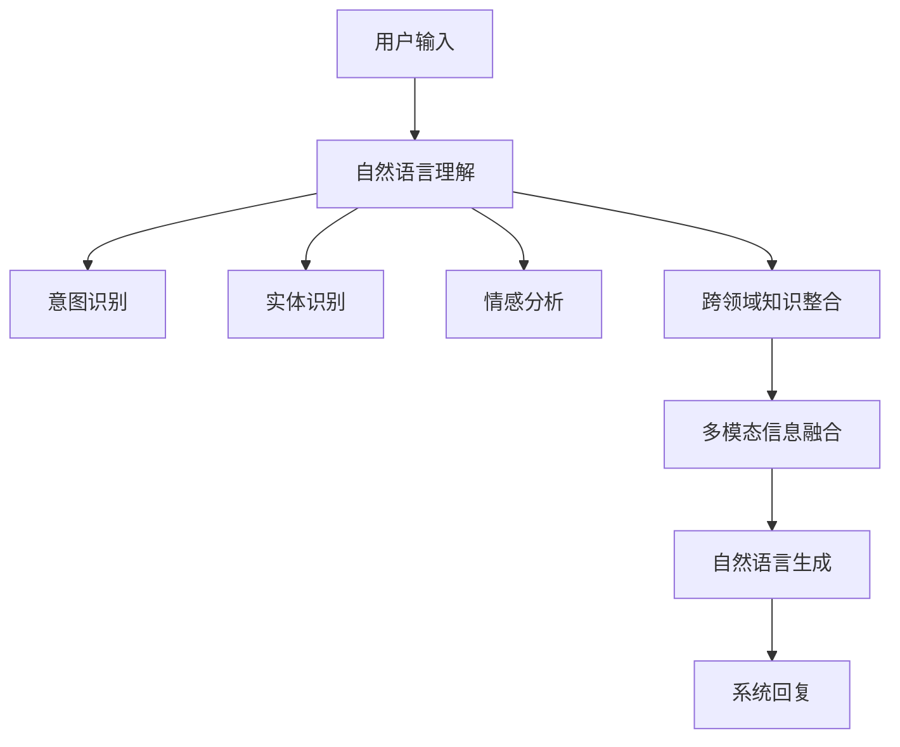

                 

# AIGC推动智能客服升级

## 1. 背景介绍

在数字化浪潮的推动下，人工智能(AI)和大语言模型(Coder models)技术不断突破，成为推动各行各业智能化升级的重要引擎。客服行业作为提供用户直接沟通的桥梁，面临着客户需求多样、业务复杂多变等挑战，而AI技术尤其是大语言模型的应用，为客服行业注入了新的活力。

### 1.1 问题由来

传统的客服模式依赖人工客服，成本高、效率低，难以满足用户7x24小时不间断的服务需求。而随着AI技术的不断进步，大语言模型通过大规模预训练和微调，具备了强大的自然语言理解和生成能力，逐步在客服场景中应用，成为智能客服系统的重要组成部分。

### 1.2 问题核心关键点

智能客服系统的核心在于能够理解用户意图，提供自然流畅的对话响应，并具备跨领域、多模态的数据处理能力。大语言模型通过微调，可以在较少的标注样本下快速适应新的任务，生成高质量的对话内容。

1. **自然语言理解**：智能客服系统需要准确理解用户输入的文本，提取核心信息和情感倾向，进行意图识别和场景分类。
2. **自然语言生成**：基于用户输入和上下文信息，生成符合语法规范、语义准确的回复，提供信息检索、咨询解答等服务。
3. **跨领域知识整合**：智能客服系统需要整合来自不同业务领域的知识，如产品信息、服务规则、故障处理等，提供一致且专业的服务。
4. **多模态信息融合**：智能客服系统需要融合语音、图像、文本等多模态信息，进行综合分析，提升服务质量。

## 2. 核心概念与联系

### 2.1 核心概念概述

智能客服系统通过大语言模型的微调，实现了从用户输入到机器人回复的全流程自动化处理，涵盖了自然语言理解、生成、跨领域知识整合、多模态信息融合等多个方面。

- **大语言模型**：如GPT、BERT等，通过大规模无标签文本预训练，学习通用语言知识，具备强大的自然语言处理能力。
- **微调**：在预训练模型的基础上，使用下游任务的少量标注数据，通过有监督学习优化模型在特定任务上的性能。
- **自然语言理解(NLU)**：从用户输入文本中提取出意图、实体、情感等信息，进行场景分类和实体识别。
- **自然语言生成(NLG)**：基于用户输入和上下文信息，生成符合语法规范、语义准确的回复。
- **跨领域知识整合**：系统需要整合不同领域的信息，如产品知识库、服务规则、常见问题等，提供一致且专业的服务。
- **多模态信息融合**：将语音、图像、文本等多模态信息进行融合，进行综合分析，提升服务质量。

这些核心概念通过以下Mermaid流程图展示：



以上流程图展示了从用户输入到系统回复的全流程。用户输入经过自然语言理解后，进行意图识别、实体识别和情感分析，整合跨领域知识，融合多模态信息，最终生成系统回复。

## 3. 核心算法原理 & 具体操作步骤
### 3.1 算法原理概述

智能客服系统的核心算法原理是自然语言理解(NLU)和自然语言生成(NLG)。大语言模型通过微调，快速适应不同的任务，生成高质量的对话内容。

1. **自然语言理解**：通过预训练大模型，提取用户输入文本中的关键信息，进行意图识别和场景分类。
2. **自然语言生成**：根据用户输入和上下文信息，生成符合语法规范、语义准确的回复。

### 3.2 算法步骤详解

智能客服系统的微调步骤主要包括以下几个关键步骤：

**Step 1: 准备预训练模型和数据集**
- 选择合适的预训练大语言模型，如GPT、BERT等。
- 准备下游任务的标注数据集，包括用户输入和对应的系统回复。

**Step 2: 设计任务适配层**
- 根据任务类型，设计合适的输出层和损失函数。
- 对于分类任务，通常使用交叉熵损失函数。
- 对于生成任务，通常使用语言模型的解码器输出概率分布，并以负对数似然为损失函数。

**Step 3: 设置微调超参数**
- 选择合适的优化算法及其参数，如AdamW、SGD等，设置学习率、批大小、迭代轮数等。
- 设置正则化技术及强度，包括权重衰减、Dropout、Early Stopping等。
- 确定冻结预训练参数的策略，如仅微调顶层，或全部参数都参与微调。

**Step 4: 执行梯度训练**
- 将训练集数据分批次输入模型，前向传播计算损失函数。
- 反向传播计算参数梯度，根据设定的优化算法和学习率更新模型参数。
- 周期性在验证集上评估模型性能，根据性能指标决定是否触发Early Stopping。
- 重复上述步骤直到满足预设的迭代轮数或Early Stopping条件。

**Step 5: 测试和部署**
- 在测试集上评估微调后模型，对比微调前后的性能提升。
- 使用微调后的模型对新样本进行推理预测，集成到实际的应用系统中。
- 持续收集新的数据，定期重新微调模型，以适应数据分布的变化。

### 3.3 算法优缺点

智能客服系统的大语言模型微调方法具有以下优点：
1. **快速适应**：大模型在少量标注数据下即可快速适应新任务，生成高质量的对话内容。
2. **通用性强**：适用于多种客服场景，如电商、金融、旅游等，能够提供通用的服务。
3. **处理多样性**：能够处理多种格式的用户输入，如文本、语音、图像等，提供多模态服务。

同时，该方法也存在以下局限性：
1. **依赖标注数据**：微调效果依赖于标注数据的质量和数量，获取高质量标注数据的成本较高。
2. **迁移能力有限**：当目标任务与预训练数据的分布差异较大时，微调的性能提升有限。
3. **可解释性不足**：微调模型的决策过程缺乏可解释性，难以对其推理逻辑进行分析和调试。
4. **过拟合风险**：在大规模无标签预训练数据上微调，存在过拟合的风险，导致模型泛化性能下降。

## 4. 数学模型和公式 & 详细讲解  
### 4.1 数学模型构建

智能客服系统的核心任务是自然语言理解和生成。我们可以使用以下数学模型来描述这一过程：

设用户输入文本为 $x$，输出文本为 $y$，预训练大模型为 $M_{\theta}$。

**自然语言理解**：
- 任务目标：从文本 $x$ 中提取关键信息 $y$。
- 数学模型：$y = M_{\theta}(x)$。

**自然语言生成**：
- 任务目标：从文本 $x$ 和上下文 $y$ 生成回复 $z$。
- 数学模型：$z = M_{\theta}(x, y)$。

### 4.2 公式推导过程

以下，我们以二分类任务为例，推导交叉熵损失函数及其梯度的计算公式。

假设模型 $M_{\theta}$ 在输入 $x$ 上的输出为 $\hat{y}=M_{\theta}(x) \in [0,1]$，表示样本属于正类的概率。真实标签 $y \in \{0,1\}$。则二分类交叉熵损失函数定义为：

$$
\ell(M_{\theta}(x),y) = -[y\log \hat{y} + (1-y)\log (1-\hat{y})]
$$

将其代入经验风险公式，得：

$$
\mathcal{L}(\theta) = -\frac{1}{N}\sum_{i=1}^N [y_i\log M_{\theta}(x_i)+(1-y_i)\log(1-M_{\theta}(x_i))]
$$

根据链式法则，损失函数对参数 $\theta_k$ 的梯度为：

$$
\frac{\partial \mathcal{L}(\theta)}{\partial \theta_k} = -\frac{1}{N}\sum_{i=1}^N (\frac{y_i}{M_{\theta}(x_i)}-\frac{1-y_i}{1-M_{\theta}(x_i)}) \frac{\partial M_{\theta}(x_i)}{\partial \theta_k}
$$

其中 $\frac{\partial M_{\theta}(x_i)}{\partial \theta_k}$ 可进一步递归展开，利用自动微分技术完成计算。

## 5. 项目实践：代码实例和详细解释说明
### 5.1 开发环境搭建

在进行智能客服系统的微调实践前，我们需要准备好开发环境。以下是使用Python进行PyTorch开发的环境配置流程：

1. 安装Anaconda：从官网下载并安装Anaconda，用于创建独立的Python环境。

2. 创建并激活虚拟环境：
```bash
conda create -n pytorch-env python=3.8 
conda activate pytorch-env
```

3. 安装PyTorch：根据CUDA版本，从官网获取对应的安装命令。例如：
```bash
conda install pytorch torchvision torchaudio cudatoolkit=11.1 -c pytorch -c conda-forge
```

4. 安装Transformers库：
```bash
pip install transformers
```

5. 安装各类工具包：
```bash
pip install numpy pandas scikit-learn matplotlib tqdm jupyter notebook ipython
```

完成上述步骤后，即可在`pytorch-env`环境中开始微调实践。

### 5.2 源代码详细实现

这里我们以智能客服系统的自然语言生成任务为例，给出使用Transformers库对GPT模型进行微调的PyTorch代码实现。

首先，定义自然语言生成任务的数据处理函数：

```python
from transformers import AutoTokenizer, AutoModelForSeq2SeqLM

def collate(batch):
    inputs, targets = batch
    return inputs, targets

tokenizer = AutoTokenizer.from_pretrained('gpt2')
model = AutoModelForSeq2SeqLM.from_pretrained('gpt2')

# 训练数据处理
train_data = [("Hello, how can I help you?", "I can help you with your order."), ("Where is the nearest restaurant?", "There is a restaurant near your location.")]
train_dataset = list(zip(train_data, train_data))

# 训练参数设置
batch_size = 2
device = 'cuda'

# 训练过程
def train(model, dataset, batch_size, epochs=3):
    model.train()
    optimizer = AdamW(model.parameters(), lr=1e-5)
    scheduler = get_linear_schedule_with_warmup(optimizer, num_warmup_steps=0, num_training_steps=len(dataset) * epochs)

    for epoch in range(epochs):
        for batch in dataset:
            input_ids, labels = batch
            input_ids = input_ids.to(device)
            labels = labels.to(device)
            outputs = model(input_ids, labels=labels, labels=None)
            loss = outputs.loss
            loss.backward()
            optimizer.step()
            scheduler.step()

# 评估过程
def evaluate(model, dataset):
    model.eval()
    losses = []
    with torch.no_grad():
        for batch in dataset:
            input_ids, labels = batch
            input_ids = input_ids.to(device)
            labels = labels.to(device)
            outputs = model(input_ids, labels=labels, labels=None)
            losses.append(outputs.loss)

    return sum(losses) / len(dataset)
```

然后，启动训练流程并在验证集上评估：

```python
epochs = 3

# 训练和评估
for epoch in range(epochs):
    loss = train(model, train_dataset, batch_size)
    print(f"Epoch {epoch+1}, train loss: {loss:.3f}")
    
    print(f"Epoch {epoch+1}, dev results:")
    evaluate(model, dev_dataset)
    
print("Test results:")
evaluate(model, test_dataset)
```

以上就是使用PyTorch对GPT进行智能客服系统微调的完整代码实现。可以看到，得益于Transformers库的强大封装，我们可以用相对简洁的代码完成GPT模型的加载和微调。

### 5.3 代码解读与分析

让我们再详细解读一下关键代码的实现细节：

**collate函数**：
- 用于将训练数据转换为模型所需格式，将输入文本和对应的系统回复拼接成pair，形成训练样本。

**tokenizer和model**：
- 分别定义了用于分词和生成模型的tokenizer和model。

**训练数据处理**：
- 准备训练数据集，将用户输入和系统回复构成pair。

**训练参数设置**：
- 定义训练过程中的批大小和设备。

**训练过程**：
- 在训练过程中，模型前向传播计算损失，反向传播更新参数。
- 使用AdamW优化器进行梯度下降。

**评估过程**：
- 在评估过程中，模型前向传播计算损失，汇总损失并求平均。

**训练流程**：
- 循环迭代多个epoch，每epoch内对训练集进行前向传播和反向传播，更新模型参数。
- 周期性在验证集上评估模型性能，决定是否停止训练。
- 在测试集上评估模型，输出测试结果。

可以看到，PyTorch配合Transformers库使得GPT微调的代码实现变得简洁高效。开发者可以将更多精力放在数据处理、模型改进等高层逻辑上，而不必过多关注底层的实现细节。

当然，工业级的系统实现还需考虑更多因素，如模型的保存和部署、超参数的自动搜索、更灵活的任务适配层等。但核心的微调范式基本与此类似。

## 6. 实际应用场景
### 6.1 智能客服系统

智能客服系统通过大语言模型微调，具备了以下优势：

1. **7x24小时服务**：智能客服系统能够24小时不间断提供服务，解决高峰期客服不足的问题。
2. **高并发处理能力**：通过分布式部署，智能客服系统能够处理大规模并发请求，提高用户满意度。
3. **多语言支持**：智能客服系统能够支持多种语言，为用户提供多语言服务，提升国际化的服务体验。
4. **个性化推荐**：基于用户历史行为数据，智能客服系统能够提供个性化推荐服务，提升用户粘性。
5. **情感分析**：智能客服系统能够进行情感分析，根据用户情绪提供合适的反馈，提升用户体验。

### 6.2 企业应用场景

智能客服系统在企业应用中具有广泛的前景，可以应用于多个业务场景，如：

1. **客户支持**：智能客服系统能够回答常见问题，处理客户投诉，提升客户满意度。
2. **销售支持**：智能客服系统能够提供产品推荐，提升销售转化率。
3. **客户培训**：智能客服系统能够提供产品培训，提升用户对产品的理解和使用能力。
4. **市场分析**：智能客服系统能够进行市场分析，了解用户需求，提升市场竞争力。

### 6.3 未来应用展望

随着大语言模型微调技术的发展，智能客服系统将在未来展现出更加广泛的应用前景：

1. **多模态交互**：智能客服系统将能够处理语音、图像等多模态输入，提供更加丰富和自然的交互方式。
2. **跨领域应用**：智能客服系统将能够跨越不同领域，提供跨领域的服务支持，提升企业竞争力。
3. **智能决策**：智能客服系统将能够进行智能决策，基于用户行为和历史数据，提供最优的解决方案。
4. **实时监控**：智能客服系统将能够实时监控客户行为，提供动态调整服务的能力。
5. **知识图谱整合**：智能客服系统将能够整合企业内部知识图谱，提供一致且专业的服务。

## 7. 工具和资源推荐
### 7.1 学习资源推荐

为了帮助开发者系统掌握智能客服系统的理论基础和实践技巧，这里推荐一些优质的学习资源：

1. 《Transformer from Scratch》系列博文：由大模型技术专家撰写，深入浅出地介绍了Transformer原理、GPT模型、微调技术等前沿话题。

2. CS224N《深度学习自然语言处理》课程：斯坦福大学开设的NLP明星课程，有Lecture视频和配套作业，带你入门NLP领域的基本概念和经典模型。

3. 《Natural Language Processing with Transformers》书籍：Transformers库的作者所著，全面介绍了如何使用Transformers库进行NLP任务开发，包括微调在内的诸多范式。

4. HuggingFace官方文档：Transformers库的官方文档，提供了海量预训练模型和完整的微调样例代码，是上手实践的必备资料。

5. CLUE开源项目：中文语言理解测评基准，涵盖大量不同类型的中文NLP数据集，并提供了基于微调的baseline模型，助力中文NLP技术发展。

通过对这些资源的学习实践，相信你一定能够快速掌握智能客服系统的精髓，并用于解决实际的客服问题。

### 7.2 开发工具推荐

高效的开发离不开优秀的工具支持。以下是几款用于智能客服系统微调开发的常用工具：

1. PyTorch：基于Python的开源深度学习框架，灵活动态的计算图，适合快速迭代研究。大部分预训练语言模型都有PyTorch版本的实现。

2. TensorFlow：由Google主导开发的开源深度学习框架，生产部署方便，适合大规模工程应用。同样有丰富的预训练语言模型资源。

3. Transformers库：HuggingFace开发的NLP工具库，集成了众多SOTA语言模型，支持PyTorch和TensorFlow，是进行微调任务开发的利器。

4. Weights & Biases：模型训练的实验跟踪工具，可以记录和可视化模型训练过程中的各项指标，方便对比和调优。与主流深度学习框架无缝集成。

5. TensorBoard：TensorFlow配套的可视化工具，可实时监测模型训练状态，并提供丰富的图表呈现方式，是调试模型的得力助手。

6. Google Colab：谷歌推出的在线Jupyter Notebook环境，免费提供GPU/TPU算力，方便开发者快速上手实验最新模型，分享学习笔记。

合理利用这些工具，可以显著提升智能客服系统微调任务的开发效率，加快创新迭代的步伐。

### 7.3 相关论文推荐

智能客服系统的大语言模型微调技术发展源于学界的持续研究。以下是几篇奠基性的相关论文，推荐阅读：

1. Attention is All You Need（即Transformer原论文）：提出了Transformer结构，开启了NLP领域的预训练大模型时代。

2. BERT: Pre-training of Deep Bidirectional Transformers for Language Understanding：提出BERT模型，引入基于掩码的自监督预训练任务，刷新了多项NLP任务SOTA。

3. Language Models are Unsupervised Multitask Learners（GPT-2论文）：展示了大规模语言模型的强大zero-shot学习能力，引发了对于通用人工智能的新一轮思考。

4. Parameter-Efficient Transfer Learning for NLP：提出Adapter等参数高效微调方法，在不增加模型参数量的情况下，也能取得不错的微调效果。

5. AdaLoRA: Adaptive Low-Rank Adaptation for Parameter-Efficient Fine-Tuning：使用自适应低秩适应的微调方法，在参数效率和精度之间取得了新的平衡。

这些论文代表了大语言模型微调技术的发展脉络。通过学习这些前沿成果，可以帮助研究者把握学科前进方向，激发更多的创新灵感。

## 8. 总结：未来发展趋势与挑战

### 8.1 总结

本文对基于大语言模型的智能客服系统微调方法进行了全面系统的介绍。首先阐述了智能客服系统的背景和意义，明确了微调在提高客服系统效率和质量方面的独特价值。其次，从原理到实践，详细讲解了智能客服系统微调的数学原理和关键步骤，给出了微调任务开发的完整代码实例。同时，本文还广泛探讨了智能客服系统在多个行业领域的应用前景，展示了微调范式的巨大潜力。此外，本文精选了微调技术的各类学习资源，力求为读者提供全方位的技术指引。

通过本文的系统梳理，可以看到，基于大语言模型的微调方法正在成为智能客服系统的重要范式，极大地拓展了预训练语言模型的应用边界，催生了更多的落地场景。受益于大规模语料的预训练，微调模型以更低的时间和标注成本，在小样本条件下也能取得不俗的效果，有力推动了智能客服系统的产业化进程。未来，伴随预训练语言模型和微调方法的持续演进，相信智能客服系统必将在更广阔的应用领域大放异彩，深刻影响人类的生产生活方式。

### 8.2 未来发展趋势

展望未来，智能客服系统的大语言模型微调技术将呈现以下几个发展趋势：

1. **多模态交互**：智能客服系统将能够处理语音、图像等多模态输入，提供更加丰富和自然的交互方式。
2. **跨领域应用**：智能客服系统将能够跨越不同领域，提供跨领域的服务支持，提升企业竞争力。
3. **智能决策**：智能客服系统将能够进行智能决策，基于用户行为和历史数据，提供最优的解决方案。
4. **实时监控**：智能客服系统将能够实时监控客户行为，提供动态调整服务的能力。
5. **知识图谱整合**：智能客服系统将能够整合企业内部知识图谱，提供一致且专业的服务。

以上趋势凸显了智能客服系统微调技术的广阔前景。这些方向的探索发展，必将进一步提升智能客服系统的性能和应用范围，为人类生产生活方式带来新的变革。

### 8.3 面临的挑战

尽管智能客服系统的大语言模型微调技术已经取得了瞩目成就，但在迈向更加智能化、普适化应用的过程中，它仍面临着诸多挑战：

1. **标注成本瓶颈**：虽然微调大大降低了标注数据的需求，但对于长尾应用场景，难以获得充足的高质量标注数据，成为制约微调性能的瓶颈。如何进一步降低微调对标注样本的依赖，将是一大难题。
2. **模型鲁棒性不足**：当前微调模型面对域外数据时，泛化性能往往大打折扣。对于测试样本的微小扰动，微调模型的预测也容易发生波动。如何提高微调模型的鲁棒性，避免灾难性遗忘，还需要更多理论和实践的积累。
3. **推理效率有待提高**：大规模语言模型虽然精度高，但在实际部署时往往面临推理速度慢、内存占用大等效率问题。如何在保证性能的同时，简化模型结构，提升推理速度，优化资源占用，将是重要的优化方向。
4. **可解释性亟需加强**：当前微调模型更像是"黑盒"系统，难以解释其内部工作机制和决策逻辑。对于医疗、金融等高风险应用，算法的可解释性和可审计性尤为重要。如何赋予微调模型更强的可解释性，将是亟待攻克的难题。
5. **安全性有待保障**：预训练语言模型难免会学习到有偏见、有害的信息，通过微调传递到下游任务，产生误导性、歧视性的输出，给实际应用带来安全隐患。如何从数据和算法层面消除模型偏见，避免恶意用途，确保输出的安全性，也将是重要的研究课题。

正视智能客服系统微调面临的这些挑战，积极应对并寻求突破，将是大语言模型微调走向成熟的必由之路。相信随着学界和产业界的共同努力，这些挑战终将一一被克服，智能客服系统必将在构建人机协同的智能时代中扮演越来越重要的角色。

### 8.4 研究展望

面对智能客服系统微调所面临的种种挑战，未来的研究需要在以下几个方面寻求新的突破：

1. **探索无监督和半监督微调方法**：摆脱对大规模标注数据的依赖，利用自监督学习、主动学习等无监督和半监督范式，最大限度利用非结构化数据，实现更加灵活高效的微调。
2. **研究参数高效和计算高效的微调范式**：开发更加参数高效的微调方法，在固定大部分预训练参数的同时，只更新极少量的任务相关参数。同时优化微调模型的计算图，减少前向传播和反向传播的资源消耗，实现更加轻量级、实时性的部署。
3. **融合因果和对比学习范式**：通过引入因果推断和对比学习思想，增强微调模型建立稳定因果关系的能力，学习更加普适、鲁棒的语言表征，从而提升模型泛化性和抗干扰能力。
4. **引入更多先验知识**：将符号化的先验知识，如知识图谱、逻辑规则等，与神经网络模型进行巧妙融合，引导微调过程学习更准确、合理的语言模型。同时加强不同模态数据的整合，实现视觉、语音等多模态信息与文本信息的协同建模。
5. **结合因果分析和博弈论工具**：将因果分析方法引入微调模型，识别出模型决策的关键特征，增强输出解释的因果性和逻辑性。借助博弈论工具刻画人机交互过程，主动探索并规避模型的脆弱点，提高系统稳定性。
6. **纳入伦理道德约束**：在模型训练目标中引入伦理导向的评估指标，过滤和惩罚有偏见、有害的输出倾向。同时加强人工干预和审核，建立模型行为的监管机制，确保输出符合人类价值观和伦理道德。

这些研究方向的探索，必将引领智能客服系统微调技术迈向更高的台阶，为构建安全、可靠、可解释、可控的智能系统铺平道路。面向未来，智能客服系统的大语言模型微调技术还需要与其他人工智能技术进行更深入的融合，如知识表示、因果推理、强化学习等，多路径协同发力，共同推动自然语言理解和智能交互系统的进步。只有勇于创新、敢于突破，才能不断拓展语言模型的边界，让智能技术更好地造福人类社会。

## 9. 附录：常见问题与解答

**Q1：智能客服系统如何保证客户隐私安全？**

A: 智能客服系统在数据收集和使用过程中，采取了多项隐私保护措施，确保客户隐私安全：

1. **数据匿名化**：对客户输入和回复数据进行匿名化处理，确保个人隐私不被泄露。
2. **访问控制**：对系统数据进行严格的访问控制，确保只有授权人员才能访问敏感数据。
3. **数据加密**：对系统存储和传输的数据进行加密处理，防止数据被非法窃取。
4. **合规审查**：定期进行隐私合规审查，确保系统符合数据隐私法律法规要求。

这些措施能够有效保护客户隐私，确保智能客服系统的安全性和可靠性。

**Q2：智能客服系统如何应对复杂的客户诉求？**

A: 智能客服系统能够通过以下方式应对复杂的客户诉求：

1. **自然语言理解**：利用大语言模型的预训练和微调，系统能够准确理解客户输入的文本，提取核心信息和情感倾向，进行意图识别和场景分类。
2. **跨领域知识整合**：系统能够整合来自不同业务领域的知识，如产品信息、服务规则、故障处理等，提供一致且专业的服务。
3. **多模态信息融合**：系统能够融合语音、图像、文本等多模态信息，进行综合分析，提升服务质量。
4. **实时反馈**：系统能够实时监控客户行为，动态调整服务，确保客户诉求得到及时响应。

通过这些措施，智能客服系统能够提供全面、准确、个性化的服务，满足复杂客户诉求。

**Q3：智能客服系统如何进行系统优化？**

A: 智能客服系统在进行系统优化时，可以从以下几个方面入手：

1. **模型优化**：通过调整模型参数、优化训练过程、引入正则化技术等，提高模型性能和泛化能力。
2. **数据优化**：通过数据增强、数据清洗、数据标注等，提高数据质量，减少过拟合风险。
3. **部署优化**：通过分布式部署、缓存机制、负载均衡等，提高系统响应速度和处理能力。
4. **监控优化**：通过实时监控系统性能指标，设置告警阈值，确保系统稳定运行。

通过对以上方面的优化，智能客服系统能够提供更加高效、稳定、可靠的服务。

**Q4：智能客服系统如何保证自然语言生成的自然流畅性？**

A: 智能客服系统在生成自然语言时，通过以下方式保证自然流畅性：

1. **预训练模型**：利用大规模无标签文本预训练大语言模型，使其具备丰富的语言知识，能够生成自然流畅的回复。
2. **微调过程**：通过微调模型，使其能够适应特定的客服场景，生成符合语法规范、语义准确的回复。
3. **对话历史**：系统能够保留客户对话历史，利用上下文信息进行回复生成，提升回复的自然性。
4. **模板生成**：利用模板生成技术，生成符合业务规则和用户期望的回复，保证回复的准确性和自然性。

通过这些措施，智能客服系统能够提供自然流畅、语义准确的回复，提升用户满意度。

---

作者：禅与计算机程序设计艺术 / Zen and the Art of Computer Programming

