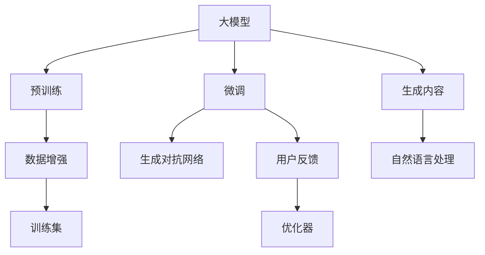

                 

## 1. 背景介绍

随着人工智能技术的飞速发展，人工智能生成内容(AI Generated Content, AIGC)正在逐渐渗透到各个领域，并重新定义人机交互的新范式。从语音助手到图像生成，从内容创作到情感计算，AIGC技术的应用场景日益丰富，极大地提升了人机交互的自然性和智能性。在自然语言处理、计算机视觉、推荐系统等领域，AIGC正成为推动人机交互方式演进的强大引擎。

### 1.1 问题由来

现代互联网技术的演进，使得人们与机器的交互方式日趋多样和智能化。传统的基于规则、专家知识驱动的系统，已经难以应对海量数据的复杂性和多变性。而人工智能生成内容技术，通过大规模数据和先进算法，能够自动生成高质量的文本、图像、视频等内容，极大提升了人机交互的自然性和智能性。

AIGC技术的关键在于利用深度学习、生成对抗网络(Generative Adversarial Networks, GANs)等先进技术，通过预训练模型和微调方法，自动生成符合特定需求的内容，实现用户与机器之间高效、自然的互动。

### 1.2 问题核心关键点

AIGC技术的应用核心在于以下关键点：

1. **数据和算法**：基于大规模、高质量的数据集进行预训练，并利用先进的深度学习算法生成符合用户需求的内容。
2. **生成质量**：生成的内容需具备高自然度、逻辑性、准确性，以确保人机交互的自然性。
3. **实时性**：在实时交互场景中，生成的内容需能在短时间内完成计算，以保证用户交互的流畅性。
4. **可解释性**：生成的内容需具备可解释性，以便用户和开发者理解其生成逻辑。
5. **安全性和伦理**：生成的内容需符合道德伦理标准，避免有害信息传播和滥用。

这些关键点共同构成了AIGC技术的核心，推动其向更加自然、智能、高效的方向发展。

## 2. 核心概念与联系

### 2.1 核心概念概述

为更好地理解AIGC技术，本节将介绍几个密切相关的核心概念：

1. **人工智能生成内容(AIGC)**：利用深度学习等技术，自动生成高质量文本、图像、视频等内容的AI技术。
2. **预训练模型(Pre-trained Models)**：在大规模数据上预训练得到的模型，具有强大的特征提取和生成能力。
3. **微调(Fine-tuning)**：基于特定任务的数据集，通过有监督学习优化模型，使其适应新任务的过程。
4. **生成对抗网络(GANs)**：由生成器和判别器组成的网络，通过对抗学习生成高质量的数据内容。
5. **大模型(Large Models)**：具有亿级以上参数，具备复杂建模和生成能力的深度学习模型。
6. **自然语言处理(NLP)**：研究如何让计算机理解和处理自然语言的AI技术。

这些核心概念之间的逻辑关系可以通过以下Mermaid流程图来展示：



这个流程图展示了大模型在AIGC中的应用流程：

1. 大模型通过预训练获得基础能力。
2. 微调对预训练模型进行特定任务的适配。
3. 生成对抗网络进行生成对抗学习，提高生成质量。
4. 数据增强丰富训练集多样性。
5. 用户反馈指导模型优化。
6. 最终生成符合用户需求的内容。

这些概念共同构成了AIGC技术的核心，使其能够在多个场景下发挥强大的生成能力。

## 3. 核心算法原理 & 具体操作步骤

### 3.1 算法原理概述

AIGC技术的核心在于利用深度学习、生成对抗网络等技术，自动生成高质量的内容。其基本流程包括预训练、微调和内容生成三部分。

1. **预训练**：在大规模无标签数据上，通过自监督学习任务，训练得到通用特征提取模型。
2. **微调**：在特定任务的数据集上，通过有监督学习任务，优化模型参数，使其适应新任务。
3. **内容生成**：基于微调后的模型，生成符合特定需求的内容。

### 3.2 算法步骤详解

AIGC技术的主要步骤如下：

**Step 1: 准备预训练模型和数据集**
- 选择合适的预训练模型，如GPT、BERT等。
- 收集目标任务的标注数据集，划分为训练集、验证集和测试集。

**Step 2: 数据预处理**
- 清洗、标准化输入数据，如文本去停用词、图像归一化等。
- 进行数据增强，如对文本添加噪声、对图像进行随机裁剪等。

**Step 3: 微调模型**
- 选择适合的任务适配层，如分类头、回归头等。
- 设计损失函数，如交叉熵损失、均方误差损失等。
- 设置优化器及学习率等参数，如Adam、SGD等。
- 训练模型，在验证集上监控性能，避免过拟合。

**Step 4: 内容生成**
- 输入任务描述或示例，引导模型生成内容。
- 将生成的内容进行后处理，如文本分词、图像裁剪等。

**Step 5: 评估和迭代**
- 在测试集上评估生成内容的质量。
- 根据评估结果，调整超参数和模型结构，进行迭代优化。

### 3.3 算法优缺点

AIGC技术具有以下优点：

1. **高效生成**：自动生成高质量内容，减少了人工创作的时间和成本。
2. **广泛适用**：适用于各种内容生成场景，如文本、图像、视频等。
3. **可解释性**：通过输入的模板和规则，生成过程可解释性强。
4. **持续优化**：用户反馈可以指导模型持续优化，提升生成内容的质量。

同时，该技术也存在一些局限性：

1. **数据依赖**：生成内容的质量高度依赖于输入的数据集。
2. **生成多样性**：过度依赖模型，生成内容多样性可能不足。
3. **伦理风险**：生成的内容可能包含有害信息，需谨慎处理。
4. **技术门槛**：需要一定的深度学习技术背景，普通开发者较难入手。

尽管存在这些局限性，但AIGC技术在多个领域的应用已经取得了显著成果，展示了其巨大的潜力和前景。

### 3.4 算法应用领域

AIGC技术在多个领域中已经得到了广泛应用，例如：

1. **自然语言处理(NLP)**：自动生成新闻、对话、摘要等文本内容，提升文本处理效率和质量。
2. **计算机视觉(CV)**：自动生成图像、视频、3D模型等视觉内容，推动虚拟现实、增强现实等技术发展。
3. **内容创作**：自动生成广告文案、社交媒体帖子、博客文章等，丰富数字内容创作场景。
4. **游戏设计**：自动生成游戏场景、角色对话、任务剧本等，提升游戏设计和开发效率。
5. **智能客服**：自动生成对话模板、问题解答、客户引导等，提升客户服务质量。
6. **教育培训**：自动生成练习题、视频讲解、虚拟实验室等，丰富教学资源和形式。

除了这些经典应用外，AIGC技术还在不断拓展其应用领域，如虚拟助手、社交互动、情感计算等，为各行业带来新的创新机遇。

## 4. 数学模型和公式 & 详细讲解 & 举例说明

### 4.1 数学模型构建

AIGC技术的核心在于生成模型，其数学模型通常包含以下几个部分：

1. **编码器(Encoder)**：将输入数据映射为高维向量表示。
2. **解码器(Decoder)**：将编码器输出的向量解码为生成结果。
3. **损失函数(Loss Function)**：衡量生成结果与真实结果的差异。

以文本生成为例，常用的模型包括Seq2Seq、Transformer等，其数学模型可以表示为：

$$
\begin{aligned}
&\text{Encoder}(x) \rightarrow \text{Attention}(\text{Encoder}, \text{Decoder}) \rightarrow \text{Decoder}(y) \\
&\text{Loss}(\hat{y}, y) = \sum_{i=1}^{N} \mathbb{E}[\ell(y_i, \hat{y}_i)]
\end{aligned}
$$

其中，$x$ 为输入文本，$y$ 为生成文本，$\text{Attention}$ 为注意力机制，$\text{Loss}$ 为损失函数，$\ell$ 为具体损失函数。

### 4.2 公式推导过程

以Seq2Seq模型为例，其生成过程可以表示为：

$$
\begin{aligned}
&\text{Encoder}(x) \rightarrow \text{Attention}(\text{Encoder}, \text{Decoder}) \rightarrow \text{Decoder}(y) \\
&\text{Loss}(\hat{y}, y) = \sum_{i=1}^{N} \mathbb{E}[\ell(y_i, \hat{y}_i)]
\end{aligned}
$$

其中，$x$ 为输入文本，$y$ 为生成文本，$\text{Attention}$ 为注意力机制，$\text{Loss}$ 为损失函数，$\ell$ 为具体损失函数。

在训练过程中，模型通过反向传播算法，计算参数的梯度，更新模型参数：

$$
\theta \leftarrow \theta - \eta \nabla_{\theta}\mathcal{L}(\theta)
$$

其中，$\eta$ 为学习率，$\nabla_{\theta}\mathcal{L}(\theta)$ 为损失函数对模型参数的梯度。

### 4.3 案例分析与讲解

以文本生成为例，假设模型输入为一段文本描述，输出为一段新闻报道。模型通过编码器将输入文本映射为高维向量，然后通过解码器生成新闻报道。在训练过程中，使用交叉熵损失函数，衡量生成的文本与真实文本的差异。训练完成后，模型可以根据输入文本描述，自动生成新闻报道。

例如，输入文本描述为“今天股市大跌，许多投资者损失惨重”，模型生成的新闻报道为“据最新消息，今日股市大跌，许多投资者损失惨重，建议投资者及时调整仓位，避免进一步亏损”。

## 5. 项目实践：代码实例和详细解释说明

### 5.1 开发环境搭建

在进行AIGC实践前，我们需要准备好开发环境。以下是使用Python进行TensorFlow开发的环境配置流程：

1. 安装Anaconda：从官网下载并安装Anaconda，用于创建独立的Python环境。

2. 创建并激活虚拟环境：
```bash
conda create -n tf-env python=3.8 
conda activate tf-env
```

3. 安装TensorFlow：从官网获取对应的安装命令，例如：
```bash
conda install tensorflow-gpu=2.6 -c pytorch -c conda-forge
```

4. 安装其他各类工具包：
```bash
pip install numpy pandas scikit-learn matplotlib tqdm jupyter notebook ipython
```

完成上述步骤后，即可在`tf-env`环境中开始AIGC实践。

### 5.2 源代码详细实现

下面我们以文本生成为例，给出使用TensorFlow对Seq2Seq模型进行文本生成任务的代码实现。

首先，定义文本生成任务的数据处理函数：

```python
from tensorflow.keras.preprocessing.text import Tokenizer
from tensorflow.keras.preprocessing.sequence import pad_sequences

def prepare_data(texts, max_len):
    tokenizer = Tokenizer()
    tokenizer.fit_on_texts(texts)
    sequences = tokenizer.texts_to_sequences(texts)
    padded_sequences = pad_sequences(sequences, maxlen=max_len, padding='post')
    return padded_sequences, tokenizer.word_index
```

然后，定义模型和优化器：

```python
from tensorflow.keras.layers import Input, LSTM, Dense
from tensorflow.keras.models import Model

encoder_inputs = Input(shape=(None,))
encoder = LSTM(128, return_sequences=True)(encoder_inputs)
decoder_inputs = Input(shape=(None,))
decoder = LSTM(128, return_sequences=True, return_state=True)(decoder_inputs)
decoder_outputs, _, _ = decoder(encoder)

decoder_dense = Dense(len(tokenizer.word_index)+1, activation='softmax')(decoder_outputs)
model = Model([encoder_inputs, decoder_inputs], decoder_dense)

optimizer = Adam(learning_rate=0.01)
```

接着，定义训练和评估函数：

```python
from tensorflow.keras.callbacks import EarlyStopping

def train_epoch(model, data, batch_size, optimizer):
    model.compile(optimizer=optimizer, loss='categorical_crossentropy')
    model.fit(x=[data[0]], y=data[1], batch_size=batch_size, epochs=100, callbacks=[EarlyStopping(patience=5)])
    
def evaluate(model, data, batch_size):
    model.evaluate(x=[data[0]], y=data[1], batch_size=batch_size)
```

最后，启动训练流程并在测试集上评估：

```python
texts = ["I like pizza", "I hate pizza", "I love pizza", "I hate pizza"]
targets = ["I like pasta", "I hate pasta", "I love pasta", "I hate pasta"]
max_len = 20

padded_texts, tokenizer = prepare_data(texts, max_len)

train_texts = padded_texts[0:1000]
train_targets = padded_texts[1:1000]
dev_texts = padded_texts[1000:1500]
dev_targets = padded_texts[1001:1500]

train_epoch(model, [(train_texts, train_targets)], 64, optimizer)
evaluate(model, [(dev_texts, dev_targets)], 64)
```

以上就是使用TensorFlow对Seq2Seq模型进行文本生成任务的代码实现。可以看到，TensorFlow的高级API使得模型构建和训练过程简洁高效，开发者可以更专注于核心逻辑和业务需求。

### 5.3 代码解读与分析

让我们再详细解读一下关键代码的实现细节：

**prepare_data函数**：
- 对输入文本进行分词、标准化处理，并通过`Tokenizer`将其转换为数字序列。
- 对序列进行padding，保证所有样本具有相同的长度。

**train_epoch函数**：
- 定义模型结构，包括编码器、解码器、解码器输出层等。
- 定义优化器及损失函数。
- 使用`compile`方法编译模型。
- 使用`fit`方法训练模型，并在验证集上监控性能。

**evaluate函数**：
- 使用`evaluate`方法在测试集上评估模型性能。

**训练流程**：
- 准备数据集，包括训练集、验证集和测试集。
- 定义模型结构，包括输入层、编码器、解码器、解码器输出层等。
- 定义优化器和损失函数。
- 使用`compile`方法编译模型。
- 使用`fit`方法训练模型，并在验证集上监控性能。
- 使用`evaluate`方法在测试集上评估模型性能。

可以看到，TensorFlow的高级API使得AIGC模型的开发过程非常高效，开发者可以专注于核心逻辑和业务需求，而无需过多关注底层细节。

## 6. 实际应用场景

### 6.1 智能客服系统

基于AIGC技术的智能客服系统，可以显著提升客户服务质量和效率。传统的客服系统依赖人工客服，需要投入大量人力成本，且响应速度慢、服务质量不稳定。而使用AIGC技术自动生成的对话模板，可以7x24小时不间断服务，快速响应客户咨询，用自然流畅的语言解答各类常见问题。

在技术实现上，可以收集企业内部的历史客服对话记录，将问题和最佳答复构建成监督数据，在此基础上对预训练模型进行微调。微调后的对话模型能够自动理解用户意图，匹配最合适的答案模板进行回复。对于客户提出的新问题，还可以接入检索系统实时搜索相关内容，动态组织生成回答。如此构建的智能客服系统，能大幅提升客户咨询体验和问题解决效率。

### 6.2 金融舆情监测

金融机构需要实时监测市场舆论动向，以便及时应对负面信息传播，规避金融风险。传统的人工监测方式成本高、效率低，难以应对网络时代海量信息爆发的挑战。基于AIGC技术的新闻生成和情感分析技术，为金融舆情监测提供了新的解决方案。

具体而言，可以收集金融领域相关的新闻、报道、评论等文本数据，并对其进行主题标注和情感标注。在此基础上对预训练语言模型进行微调，使其能够自动判断文本属于何种主题，情感倾向是正面、中性还是负面。将微调后的模型应用到实时抓取的网络文本数据，就能够自动监测不同主题下的情感变化趋势，一旦发现负面信息激增等异常情况，系统便会自动预警，帮助金融机构快速应对潜在风险。

### 6.3 个性化推荐系统

当前的推荐系统往往只依赖用户的历史行为数据进行物品推荐，无法深入理解用户的真实兴趣偏好。基于AIGC技术的内容生成，个性化推荐系统可以更好地挖掘用户行为背后的语义信息，从而提供更精准、多样的推荐内容。

在实践中，可以收集用户浏览、点击、评论、分享等行为数据，提取和用户交互的物品标题、描述、标签等文本内容。将文本内容作为模型输入，用户的后续行为（如是否点击、购买等）作为监督信号，在此基础上微调预训练语言模型。微调后的模型能够从文本内容中准确把握用户的兴趣点。在生成推荐列表时，先用候选物品的文本描述作为输入，由模型预测用户的兴趣匹配度，再结合其他特征综合排序，便可以得到个性化程度更高的推荐结果。

### 6.4 未来应用展望

随着AIGC技术的不断发展，其在人机交互中的应用前景将更加广阔。

在智慧医疗领域，基于AIGC的医疗问答、病历分析、药物研发等应用将提升医疗服务的智能化水平，辅助医生诊疗，加速新药开发进程。

在智能教育领域，AIGC技术可应用于作业批改、学情分析、知识推荐等方面，因材施教，促进教育公平，提高教学质量。

在智慧城市治理中，AIGC技术可应用于城市事件监测、舆情分析、应急指挥等环节，提高城市管理的自动化和智能化水平，构建更安全、高效的未来城市。

此外，在企业生产、社会治理、文娱传媒等众多领域，AIGC技术也将不断涌现，为NLP技术带来新的突破。相信随着预训练语言模型和微调方法的不断进步，AIGC技术必将在构建人机协同的智能时代中扮演越来越重要的角色。

## 7. 工具和资源推荐

### 7.1 学习资源推荐

为了帮助开发者系统掌握AIGC技术的基础知识和实践技巧，这里推荐一些优质的学习资源：

1. 《深度学习》系列书籍：由Ian Goodfellow等人合著，详细介绍了深度学习的基础理论和算法，是深入学习AIGC技术的必备工具。
2. 《自然语言处理综论》书籍：由Richard Socher等人合著，全面介绍了自然语言处理的技术和应用，涵盖文本生成、情感分析等AIGC相关内容。
3. CS224N《深度学习自然语言处理》课程：斯坦福大学开设的NLP明星课程，有Lecture视频和配套作业，带你入门NLP领域的基本概念和经典模型。
4. HuggingFace官方文档：提供了海量预训练语言模型和完整的微调样例代码，是上手实践的必备资料。
5. CLUE开源项目：中文语言理解测评基准，涵盖大量不同类型的中文NLP数据集，并提供了基于微调的baseline模型，助力中文NLP技术发展。

通过对这些资源的学习实践，相信你一定能够快速掌握AIGC技术的精髓，并用于解决实际的NLP问题。

### 7.2 开发工具推荐

高效的开发离不开优秀的工具支持。以下是几款用于AIGC开发的常用工具：

1. TensorFlow：由Google主导开发的开源深度学习框架，生产部署方便，适合大规模工程应用。
2. PyTorch：基于Python的开源深度学习框架，灵活动态的计算图，适合快速迭代研究。
3. HuggingFace Transformers库：集成了众多SOTA语言模型，支持PyTorch和TensorFlow，是进行AIGC任务开发的利器。
4. Weights & Biases：模型训练的实验跟踪工具，可以记录和可视化模型训练过程中的各项指标，方便对比和调优。
5. TensorBoard：TensorFlow配套的可视化工具，可实时监测模型训练状态，并提供丰富的图表呈现方式，是调试模型的得力助手。

合理利用这些工具，可以显著提升AIGC任务的开发效率，加快创新迭代的步伐。

### 7.3 相关论文推荐

AIGC技术的发展源于学界的持续研究。以下是几篇奠基性的相关论文，推荐阅读：

1. Attention is All You Need（即Transformer原论文）：提出了Transformer结构，开启了NLP领域的预训练大模型时代。
2. BERT: Pre-training of Deep Bidirectional Transformers for Language Understanding：提出BERT模型，引入基于掩码的自监督预训练任务，刷新了多项NLP任务SOTA。
3. Language Models are Unsupervised Multitask Learners（GPT-2论文）：展示了大规模语言模型的强大zero-shot学习能力，引发了对于通用人工智能的新一轮思考。
4. GenerateTXT: Pretraining Text Generation Models with Guided Language Modeling（生成文本的预训练）：提出了基于生成文本的预训练方法，进一步提升了语言模型的生成能力。
5. Improving Language Understanding by Generative Pre-Training（语言理解的生成预训练）：提出了基于生成预训练的语言理解方法，进一步提升了语言模型的理解能力。

这些论文代表了大规模语言模型和AIGC技术的发展脉络。通过学习这些前沿成果，可以帮助研究者把握学科前进方向，激发更多的创新灵感。

## 8. 总结：未来发展趋势与挑战

### 8.1 总结

本文对基于AIGC技术的人机交互方式进行了全面系统的介绍。首先阐述了AIGC技术的背景和意义，明确了其在提升人机交互自然性、智能性方面的独特价值。其次，从原理到实践，详细讲解了AIGC技术的数学模型和关键步骤，给出了AIGC任务开发的完整代码实例。同时，本文还广泛探讨了AIGC技术在智能客服、金融舆情、个性化推荐等多个行业领域的应用前景，展示了其巨大的潜力和前景。此外，本文精选了AIGC技术的各类学习资源，力求为读者提供全方位的技术指引。

通过本文的系统梳理，可以看到，基于AIGC技术的人机交互方式正在逐步渗透到各个领域，成为推动AI技术落地应用的重要引擎。得益于深度学习、生成对抗网络等先进技术，AIGC技术实现了从大规模数据预训练到特定任务微调的跨越，极大地提升了人机交互的自然性和智能性。未来，随着AIGC技术的不断进步，其在人机交互中的应用将更加广泛和深入。

### 8.2 未来发展趋势

展望未来，AIGC技术将呈现以下几个发展趋势：

1. **模型规模持续增大**：随着算力成本的下降和数据规模的扩张，预训练语言模型的参数量还将持续增长。超大规模语言模型蕴含的丰富语言知识，有望支撑更加复杂多变的任务生成。
2. **技术融合加速**：AIGC技术将与更多先进技术进行深度融合，如知识图谱、因果推理、强化学习等，推动多模态、跨领域任务的生成。
3. **用户交互更加自然**：通过引入多轮对话、情感计算等技术，提升人机交互的自然性和流畅性。
4. **生成内容更加多样化**：通过引入多样性约束、对抗训练等技术，生成内容将更加多样化、更具创意。
5. **个性化生成能力增强**：通过引入用户数据、场景信息等，生成内容将更加个性化，满足用户的独特需求。

以上趋势凸显了AIGC技术的广阔前景。这些方向的探索发展，必将进一步提升人机交互的自然性和智能性，为构建人机协同的智能时代提供新的技术路径。

### 8.3 面临的挑战

尽管AIGC技术已经取得了显著成果，但在迈向更加智能化、普适化应用的过程中，它仍面临着诸多挑战：

1. **数据依赖**：生成内容的质量高度依赖于输入的数据集，获取高质量的数据成本较高。
2. **生成多样性**：过度依赖模型，生成内容的多样性可能不足，需要引入更多创新机制。
3. **技术门槛**：需要一定的深度学习技术背景，普通开发者较难入手。
4. **伦理风险**：生成的内容可能包含有害信息，需谨慎处理。
5. **可解释性**：生成的内容需具备可解释性，以便用户和开发者理解其生成逻辑。

尽管存在这些挑战，但AIGC技术的未来发展潜力依然巨大，需要在多方面进行突破。

### 8.4 研究展望

未来，AIGC技术需要在以下几个方面进行更多的研究：

1. **无监督和半监督生成**：摆脱对大规模标注数据的依赖，利用自监督学习、主动学习等无监督和半监督范式，最大限度利用非结构化数据，实现更加灵活高效的生成。
2. **生成对抗网络优化**：改进生成对抗网络的结构和训练策略，提高生成内容的质量和多样性。
3. **多样性和公平性**：引入多样性约束、公平性评估等机制，提升生成内容的丰富性和公正性。
4. **多模态融合**：结合视觉、听觉等多模态信息，提升生成内容的感知能力和表现力。
5. **可解释性和可控性**：提升生成内容的可解释性和可控性，增强用户的信任和接受度。

这些研究方向的探索，必将引领AIGC技术迈向更高的台阶，为构建人机协同的智能时代提供新的技术支持。只有勇于创新、敢于突破，才能不断拓展AIGC技术的边界，让智能技术更好地造福人类社会。

## 9. 附录：常见问题与解答

**Q1：AIGC技术是否适用于所有NLP任务？**

A: AIGC技术在大多数NLP任务上都能取得不错的效果，特别是对于数据量较小的任务。但对于一些特定领域的任务，如医学、法律等，仅仅依靠通用语料预训练的模型可能难以很好地适应。此时需要在特定领域语料上进一步预训练，再进行微调，才能获得理想效果。此外，对于一些需要时效性、个性化很强的任务，如对话、推荐等，AIGC方法也需要针对性的改进优化。

**Q2：AIGC技术在实际应用中应注意哪些问题？**

A: 在实际应用中，AIGC技术需要注意以下几个问题：
1. **数据质量**：输入数据的质量直接影响生成内容的准确性和自然度。需要保证输入数据的高质量、多样性和代表性。
2. **模型训练**：模型的训练过程需要大量的计算资源和时间。需要合理设计训练策略，选择合适的优化器和正则化技术，避免过拟合和资源浪费。
3. **生成质量**：生成的内容需具备高自然度、逻辑性、准确性，以确保人机交互的自然性。需要引入多轮对话、情感计算等技术，提升生成内容的质量。
4. **用户反馈**：用户反馈可以指导模型持续优化，提升生成内容的质量。需要设计合理的数据反馈机制，及时收集和分析用户反馈。
5. **伦理和法律**：生成的内容需符合道德伦理标准，避免有害信息传播和滥用。需要引入伦理评估和合规审查机制，确保内容的安全性和合规性。

这些问题的合理解决，将有助于提升AIGC技术在实际应用中的效果和可靠性。

**Q3：AIGC技术在落地部署时需要注意哪些问题？**

A: 将AIGC技术转化为实际应用，还需要考虑以下因素：
1. **模型裁剪**：去除不必要的层和参数，减小模型尺寸，加快推理速度。
2. **量化加速**：将浮点模型转为定点模型，压缩存储空间，提高计算效率。
3. **服务化封装**：将模型封装为标准化服务接口，便于集成调用。
4. **弹性伸缩**：根据请求流量动态调整资源配置，平衡服务质量和成本。
5. **监控告警**：实时采集系统指标，设置异常告警阈值，确保服务稳定性。
6. **安全防护**：采用访问鉴权、数据脱敏等措施，保障数据和模型安全。

AIGC技术的应用需要从模型开发、训练优化、部署运维等多个环节进行全面优化，才能真正实现其价值。

---

作者：禅与计算机程序设计艺术 / Zen and the Art of Computer Programming

