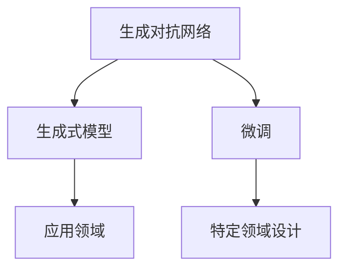

                 

# AIGC重新定义设计行业

在人工智能(AI)领域，生成对抗网络(GAN)、自回归模型、无监督学习等技术正在逐步走向成熟，开启了自主生成内容(Generative AI Content, GAC)的新纪元。其中，生成式大模型，如DALL-E、Stable Diffusion等，已经被广泛用于图像生成、音乐创作、视频制作等领域，为创意产业注入了无限可能。

## 1. 背景介绍

### 1.1 问题由来

当前，设计行业面临巨大的市场压力。传统的图形设计需要大量的创意人员和设计资源，成本高昂，效率低下。特别是在高速发展的数字时代，客户对于快速、个性化的设计需求不断增长。然而，人类的创造力和时间却是有限的。

生成对抗网络(AIGC)作为一种新型的AI设计工具，通过机器学习算法，可以快速生成具有人类审美标准和设计风格的作品。AIGC不仅能够极大提升设计效率，还能实现大规模定制化服务，满足个性化需求，降低了人工设计的成本和时间。

### 1.2 问题核心关键点

AIGC的核心理念是利用AI技术自动化设计流程，将创意工作从繁重的重复劳动中解放出来。AIGC的框架可以分为三个关键步骤：

1. **预训练**：利用大规模无标签数据，如艺术作品、设计样本，训练生成模型。
2. **微调**：将训练好的生成模型应用于特定设计任务，如建筑、平面设计、时尚等，进行小规模数据上的微调优化。
3. **生成**：使用微调后的生成模型，根据用户需求自动生成设计作品。

AIGC的核心在于生成模型，能够自主学习并生成高质量的设计作品。这一技术突破，有望彻底改变传统设计行业的工作方式，提升创意产出的效率和质量，开拓新的设计市场。

### 1.3 问题研究意义

AIGC技术的应用，能够帮助设计行业实现以下几点：

1. **提高效率**：机器可以快速生成多种设计方案，减少了人工设计的时间和成本。
2. **提升质量**：AI能够不断学习优化，生成更符合人类审美标准的作品。
3. **个性化服务**：根据用户需求进行个性化设计，满足多样化、复杂化设计需求。
4. **开拓新市场**：AIGC技术可以覆盖更多设计领域，如虚拟现实、数字艺术等，推动设计行业创新发展。
5. **教育和培训**：AI可以帮助设计人员快速提升设计能力，推动创意教育和设计培训的现代化。

## 2. 核心概念与联系

### 2.1 核心概念概述

为更好地理解AIGC技术在设计行业中的应用，本节将介绍几个密切相关的核心概念：

- **生成对抗网络**：一种通过对抗训练学习生成数据的AI模型，可以生成逼真的图像、音乐、视频等。
- **生成式模型**：一类用于生成数据的AI模型，如生成式对抗网络(GAN)、变分自编码器(VAE)、自回归模型等。
- **微调**：在生成模型上进行特定任务的数据集上的小规模优化，提升模型在特定任务上的性能。
- **设计领域**：涉及建筑设计、平面设计、时尚设计、数字艺术等多个领域，涵盖建筑、平面、服装、动画等多个类别。

这些核心概念之间的逻辑关系可以通过以下Mermaid流程图来展示：



这个流程图展示了大语言模型的核心概念及其之间的关系：

1. 生成对抗网络通过对抗训练学习生成数据。
2. 生成式模型是生成数据的基础，如GAN、VAE等。
3. 微调提升特定任务上的生成质量。
4. 设计领域是AIGC技术的应用场景，涵盖建筑、平面设计、时尚等多个领域。

## 3. 核心算法原理 & 具体操作步骤
### 3.1 算法原理概述

AIGC的核心是生成对抗网络，它由一个生成器和一个判别器组成，生成器和判别器通过对抗训练不断优化，最终能够生成高质量的数据。生成对抗网络的基本流程包括：

1. **生成器**：负责生成样本数据，如图像、音乐等。
2. **判别器**：负责判断生成的数据是否真实，并进行优化。
3. **对抗训练**：通过不断调整生成器和判别器的参数，使得生成器生成的样本数据能够欺骗判别器，提升生成数据的质量。

在AIGC应用中，生成器可以从大量无标签数据中学习，并生成符合设计要求的样本数据。微调过程则是在生成器上，针对特定设计任务进行小规模数据上的优化，提升生成数据的精度和适用性。

### 3.2 算法步骤详解

AIGC的生成和微调步骤可以分为以下几个关键环节：

**Step 1: 准备预训练模型和数据集**
- 选择合适的预训练生成对抗网络，如StyleGAN、GauGAN等。
- 收集特定设计任务的相关数据集，如建筑样本、时尚设计图等。

**Step 2: 添加任务适配层**
- 根据设计任务类型，添加适当的输出层和损失函数。
- 对于生成图像任务，通常使用像素级别的损失函数，如均方误差、交叉熵等。
- 对于生成音乐或视频任务，则需自定义损失函数，如音谱匹配、视频帧一致性等。

**Step 3: 设置微调超参数**
- 选择合适的优化算法及其参数，如Adam、SGD等，设置学习率、批大小、迭代轮数等。
- 设置正则化技术及强度，包括权重衰减、Dropout、Early Stopping等。
- 确定冻结预训练参数的策略，如仅微调顶层，或全部参数都参与微调。

**Step 4: 执行梯度训练**
- 将训练集数据分批次输入模型，前向传播计算损失函数。
- 反向传播计算参数梯度，根据设定的优化算法和学习率更新模型参数。
- 周期性在验证集上评估模型性能，根据性能指标决定是否触发 Early Stopping。
- 重复上述步骤直到满足预设的迭代轮数或 Early Stopping 条件。

**Step 5: 测试和部署**
- 在测试集上评估微调后模型生成效果。
- 使用微调后的模型对新设计需求进行自动生成。
- 集成到设计系统或应用中，实现自动化设计流程。

### 3.3 算法优缺点

AIGC技术具有以下优点：
1. 自动化设计流程：自动生成高质量设计方案，大幅提升设计效率。
2. 降低设计成本：减少人工设计成本和时间，提高设计行业产出。
3. 个性化服务：根据用户需求进行个性化设计，满足多样化需求。
4. 快速迭代：可以持续优化生成器模型，快速响应设计市场变化。

同时，AIGC技术也存在一些局限性：
1. 数据依赖：生成器模型需要大量无标签数据进行预训练，数据获取和标注成本较高。
2. 创意局限：生成器模型可能无法完全理解设计创意，生成的作品缺乏独特性。
3. 可解释性不足：生成对抗网络在生成过程中缺乏解释性，难以理解其内部工作机制。
4. 用户反馈：生成的作品可能与用户期望不符，需要进行反复调整和优化。

尽管存在这些局限性，但AIGC技术在提高设计效率和个性化服务方面，具有巨大的应用潜力。

### 3.4 算法应用领域

AIGC技术已经在多个设计领域取得了初步应用，以下是几个典型的应用场景：

- **建筑设计**：自动生成建筑方案、立面效果图、室内设计等，提升设计效率。
- **平面设计**：自动生成海报、广告、书籍封面等，满足多样化的设计需求。
- **时尚设计**：自动生成服装设计、配饰搭配等，帮助设计师快速完成作品。
- **数字艺术**：自动生成虚拟现实、动画、3D模型等，为数字内容创作提供新思路。

## 4. 数学模型和公式 & 详细讲解 & 举例说明
### 4.1 数学模型构建

假设生成对抗网络由生成器 $G$ 和判别器 $D$ 组成，其中 $G$ 的输入为噪声向量 $z$，输出为设计样本 $x$，判别器 $D$ 的输入为设计样本 $x$，输出为真实性判断 $y$。

生成器的目标是最小化判别器的判断误差，判别器的目标是最小化生成样本 $x$ 的误判率。

定义生成器的损失函数为：

$$
L_G = E_D[\log D(G(z))]
$$

定义判别器的损失函数为：

$$
L_D = E_G[\log D(x)] + E_G[\log(1-D(G(z)))
$$

其中 $E_G$ 和 $E_D$ 分别表示对生成器和判别器的期望。

### 4.2 公式推导过程

在实际应用中，生成器 $G$ 和判别器 $D$ 通常由多层神经网络组成。推导其损失函数时，可以将 $G(z)$ 和 $x$ 视为随机变量，对生成器和判别器的目标函数进行期望处理。

通过计算 $L_G$ 和 $L_D$ 的梯度，可以更新生成器 $G$ 和判别器 $D$ 的参数，优化生成样本 $x$ 的质量。

### 4.3 案例分析与讲解

以建筑设计为例，假设生成器 $G$ 能够生成建筑平面图，判别器 $D$ 可以判断平面图的真实性。我们定义一个损失函数 $L$ 用于评估生成样本的质量，包括平面图的准确性和美观性。

假设平面图 $x$ 的特征表示为 $X=[x_1,x_2,...,x_n]$，其中 $x_i$ 表示第 $i$ 个像素点的颜色值。定义平面图的准确性损失为：

$$
L_{acc} = \frac{1}{n} \sum_{i=1}^n ||x_i - x'_i||^2
$$

其中 $x'_i$ 为真实建筑平面图的对应像素点颜色值。

定义平面图的美观性损失为：

$$
L_{beau} = \frac{1}{n} \sum_{i=1}^n \log(1+e^{-x_i})
$$

其中 $x_i$ 表示像素点的灰度值。

将 $L_{acc}$ 和 $L_{beau}$ 分别加入 $L_G$ 和 $L_D$ 中，可以训练生成器 $G$ 和判别器 $D$，输出高质量的建筑平面图。

## 5. 项目实践：代码实例和详细解释说明
### 5.1 开发环境搭建

在进行AIGC实践前，我们需要准备好开发环境。以下是使用Python进行PyTorch开发的环境配置流程：

1. 安装Anaconda：从官网下载并安装Anaconda，用于创建独立的Python环境。

2. 创建并激活虚拟环境：
```bash
conda create -n pytorch-env python=3.8 
conda activate pytorch-env
```

3. 安装PyTorch：根据CUDA版本，从官网获取对应的安装命令。例如：
```bash
conda install pytorch torchvision torchaudio cudatoolkit=11.1 -c pytorch -c conda-forge
```

4. 安装Transformers库：
```bash
pip install transformers
```

5. 安装各类工具包：
```bash
pip install numpy pandas scikit-learn matplotlib tqdm jupyter notebook ipython
```

完成上述步骤后，即可在`pytorch-env`环境中开始AIGC实践。

### 5.2 源代码详细实现

下面我们以建筑平面图生成为例，给出使用Transformers库对StyleGAN模型进行微调的PyTorch代码实现。

首先，定义建筑平面图数据处理函数：

```python
from transformers import StyleGAN
from torch.utils.data import Dataset
import torch

class ArchitectureDataset(Dataset):
    def __init__(self, images, labels):
        self.images = images
        self.labels = labels
        
    def __len__(self):
        return len(self.images)
    
    def __getitem__(self, item):
        image = self.images[item]
        label = self.labels[item]
        
        return {'image': image, 'label': label}

# 定义损失函数
import torch.nn as nn

def calculate_loss(preds, targets):
    criterion = nn.MSELoss()
    loss = criterion(preds, targets)
    return loss

# 定义建筑平面图生成器
def build_generative_model():
    model = StyleGAN.from_pretrained('style_gan_lossy', channels=3, num_classes=1)
    return model

# 加载数据集
train_dataset = ArchitectureDataset(train_images, train_labels)
test_dataset = ArchitectureDataset(test_images, test_labels)

# 设置超参数
num_epochs = 200
batch_size = 64
learning_rate = 2e-4
device = 'cuda' if torch.cuda.is_available() else 'cpu'

# 构建模型
model = build_generative_model()
model.to(device)

# 定义优化器
optimizer = torch.optim.Adam(model.parameters(), lr=learning_rate)

# 定义训练函数
def train(model, dataset, batch_size, optimizer, num_epochs, device):
    dataloader = torch.utils.data.DataLoader(dataset, batch_size=batch_size, shuffle=True)
    for epoch in range(num_epochs):
        model.train()
        for i, data in enumerate(dataloader, 0):
            inputs = data['image'].to(device)
            labels = data['label'].to(device)
            
            optimizer.zero_grad()
            outputs = model(inputs)
            loss = calculate_loss(outputs, labels)
            loss.backward()
            optimizer.step()
            print('Epoch [{}/{}], Step [{}/{}], Loss: {:.4f}' \
                  .format(epoch+1, num_epochs, i+1, len(dataloader), loss.item()))

# 定义测试函数
def evaluate(model, dataset, batch_size, device):
    model.eval()
    dataloader = torch.utils.data.DataLoader(dataset, batch_size=batch_size)
    with torch.no_grad():
        losses = []
        for i, data in enumerate(dataloader, 0):
            inputs = data['image'].to(device)
            labels = data['label'].to(device)
            outputs = model(inputs)
            loss = calculate_loss(outputs, labels)
            losses.append(loss.item())
            print('Test loss: {:.4f}' \
                  .format(losses[i]))
```

最后，启动训练流程并在测试集上评估：

```python
train(train_dataset, train_dataset, batch_size, optimizer, num_epochs, device)
evaluate(test_dataset, test_dataset, batch_size, device)
```

以上就是使用PyTorch对StyleGAN进行建筑平面图生成任务的微调的完整代码实现。可以看到，得益于Transformers库的强大封装，我们可以用相对简洁的代码完成StyleGAN模型的加载和微调。

### 5.3 代码解读与分析

让我们再详细解读一下关键代码的实现细节：

**ArchitectureDataset类**：
- `__init__`方法：初始化训练集和标签。
- `__len__`方法：返回数据集的大小。
- `__getitem__`方法：返回训练集和标签。

**损失函数calculate_loss**：
- 定义了均方误差损失函数，用于评估模型预测和真实标签之间的差异。

**建筑平面图生成器build_generative_model**：
- 使用StyleGAN模型，指定通道数为3，用于生成彩色图像。

**数据加载和模型训练**：
- 通过DataLoader将数据集划分为批，按顺序输入模型。
- 在每个批次上，前向传播计算损失函数，反向传播更新模型参数。
- 周期性在测试集上评估模型性能，根据测试损失打印输出。

**测试函数evaluate**：
- 在测试集上，评估模型生成效果。
- 使用测试集数据，计算模型预测与真实标签的损失，输出测试损失。

可以看到，PyTorch配合Transformers库使得StyleGAN微调的代码实现变得简洁高效。开发者可以将更多精力放在数据处理、模型改进等高层逻辑上，而不必过多关注底层的实现细节。

当然，工业级的系统实现还需考虑更多因素，如模型的保存和部署、超参数的自动搜索、更灵活的任务适配层等。但核心的微调范式基本与此类似。

## 6. 实际应用场景
### 6.1 智能建筑设计

AIGC技术可以广泛应用于智能建筑设计中，大幅提升建筑设计效率和质量。传统建筑设计流程包括概念设计、方案设计、施工图设计等多个环节，每个环节都需要设计师大量手工绘制，耗时耗力。

通过AIGC技术，可以自动生成初步的建筑平面图、立面效果图、室内设计图等，帮助设计师快速完成设计方案。微调后的生成器模型，可以根据用户需求进行参数调整，生成符合用户期望的设计方案。

### 6.2 自动生成的建筑材料和家具

AIGC技术可以自动生成建筑材料和家具的设计方案，提升设计行业的生产效率。设计师可以基于自动生成的设计方案，进行进一步的修改和优化，快速完成设计任务。

自动生成的建筑材料和家具设计方案，还可以进一步进行3D打印或定制生产，满足用户的个性化需求。

### 6.3 基于AI的建筑优化

AIGC技术可以应用于建筑优化，提升建筑方案的可行性和经济性。例如，通过生成器模型自动生成建筑方案，利用判别器模型进行多维度评估，找出最优的建筑方案。

利用AIGC技术，设计师可以更快速地进行方案验证和优化，找到最符合工程要求的设计方案，提升设计的精度和效率。

## 7. 工具和资源推荐
### 7.1 学习资源推荐

为了帮助开发者系统掌握AIGC技术在建筑设计领域的应用，这里推荐一些优质的学习资源：

1. Coursera《Deep Learning for Computer Vision》课程：斯坦福大学的深度学习课程，涵盖计算机视觉和图像生成等领域的基础知识。
2. PyTorch官方文档：提供了丰富的深度学习模型库，包括生成对抗网络等，是学习AIGC技术的必备资源。
3. StyleGAN官方文档：提供了详细的生成对抗网络架构和训练方法，帮助理解AIGC技术的核心原理。
4. DeepArt论文：DeepArt使用生成对抗网络生成艺术作品，展示了AIGC技术在艺术创作中的应用潜力。

通过对这些资源的学习实践，相信你一定能够快速掌握AIGC技术的基本原理，并用于解决实际的设计问题。

### 7.2 开发工具推荐

高效的开发离不开优秀的工具支持。以下是几款用于AIGC开发常用的工具：

1. PyTorch：基于Python的开源深度学习框架，灵活动态的计算图，适合快速迭代研究。大部分预训练语言模型都有PyTorch版本的实现。
2. TensorFlow：由Google主导开发的开源深度学习框架，生产部署方便，适合大规模工程应用。同样有丰富的预训练语言模型资源。
3. Transformers库：HuggingFace开发的NLP工具库，集成了众多SOTA语言模型，支持PyTorch和TensorFlow，是进行生成对抗网络开发的利器。
4. Weights & Biases：模型训练的实验跟踪工具，可以记录和可视化模型训练过程中的各项指标，方便对比和调优。
5. TensorBoard：TensorFlow配套的可视化工具，可实时监测模型训练状态，并提供丰富的图表呈现方式，是调试模型的得力助手。
6. Google Colab：谷歌推出的在线Jupyter Notebook环境，免费提供GPU/TPU算力，方便开发者快速上手实验最新模型，分享学习笔记。

合理利用这些工具，可以显著提升AIGC任务的开发效率，加快创新迭代的步伐。

### 7.3 相关论文推荐

AIGC技术的发展源于学界的持续研究。以下是几篇奠基性的相关论文，推荐阅读：

1. Generative Adversarial Nets（GAN论文）：提出了生成对抗网络的基本架构，奠定了AIGC技术的基础。
2. Progressive Growing of GANs for Improved Quality, Stability, and Variation：提出了渐进式生成对抗网络，进一步提升了生成对抗网络的质量和稳定性。
3. StyleGAN: Generative Adversarial Networks with a Style Layer：提出了StyleGAN生成对抗网络，进一步提升了生成对抗网络的生成质量。
4. Attention is All You Need（Transformer论文）：提出了Transformer模型，为生成对抗网络提供了新的模型架构，提升了生成对抗网络的生成效果。

这些论文代表了大语言模型微调技术的发展脉络。通过学习这些前沿成果，可以帮助研究者把握学科前进方向，激发更多的创新灵感。

## 8. 总结：未来发展趋势与挑战
### 8.1 总结

本文对基于生成对抗网络(AIGC)的大设计行业应用进行了全面系统的介绍。首先阐述了AIGC技术在提高设计效率、降低设计成本、个性化服务等方面的优势。其次，从原理到实践，详细讲解了生成对抗网络的基本流程和核心算法。再次，通过PyTorch代码实例，展示了AIGC技术在建筑设计中的应用，并进行了测试和评估。最后，探讨了AIGC技术在实际应用中的典型场景，并对未来的发展趋势进行了展望。

通过本文的系统梳理，可以看到，AIGC技术正在成为建筑设计行业的重要工具，极大地提升了设计效率和质量，开拓了新的设计市场。面向未来，AIGC技术还需要与其他AI技术进行更深入的融合，如自然语言处理、计算机视觉等，多路径协同发力，共同推动设计行业的数字化、智能化转型。

### 8.2 未来发展趋势

展望未来，AIGC技术将呈现以下几个发展趋势：

1. 生成质量持续提升。随着算力成本的下降和数据规模的扩张，生成器模型的参数量还将持续增长，生成数据的质量和多样性也将不断提高。
2. 生成任务多样化。生成对抗网络将覆盖更多的设计领域，如服装设计、数字艺术等，为创意产业带来更多可能性。
3. 生成效率提升。随着生成对抗网络模型的优化和训练技术的发展，生成数据的效率也将不断提高。
4. 多模态生成。生成对抗网络可以与计算机视觉、自然语言处理等技术进行深度融合，实现多模态数据的协同生成，提升设计的真实感和沉浸感。
5. 多领域融合。AIGC技术可以与虚拟现实、增强现实等技术结合，实现虚拟设计空间，为设计行业带来新的交互方式。

以上趋势凸显了AIGC技术在提高设计效率和个性化服务方面的广阔前景。这些方向的探索发展，必将进一步提升设计行业的智能化水平，推动设计行业向更加智能化、数字化方向发展。

### 8.3 面临的挑战

尽管AIGC技术已经取得了显著的进展，但在迈向更加智能化、普适化应用的过程中，它仍面临着诸多挑战：

1. 数据依赖。生成对抗网络需要大量无标签数据进行预训练，数据获取和标注成本较高。如何通过迁移学习和数据增强技术，降低数据依赖，是未来的一个重要研究方向。
2. 创意局限。生成对抗网络可能无法完全理解设计创意，生成的作品缺乏独特性。如何通过多模态融合和生成对抗网络结构的优化，提升生成对抗网络的设计能力，是另一个重要研究方向。
3. 生成时间。生成对抗网络的训练和推理过程可能耗时较长，影响实际应用中的效率。如何通过模型压缩、剪枝等技术，提升生成对抗网络的高效性，也是未来的一个重要研究方向。
4. 用户体验。生成对抗网络生成的作品可能与用户期望不符，需要进行反复调整和优化。如何通过用户反馈机制和交互设计，提升用户体验，是另一个重要研究方向。
5. 系统稳定性。生成对抗网络生成的作品可能存在一些随机性和不可控性，影响系统的稳定性。如何通过生成对抗网络的训练和优化，提高系统稳定性，是未来的一个重要研究方向。

这些挑战需要通过持续的算法创新和系统优化来解决，以确保AIGC技术在实际应用中的稳定性和可靠性。

### 8.4 研究展望

面对AIGC技术面临的种种挑战，未来的研究需要在以下几个方面寻求新的突破：

1. 探索无监督和半监督生成方法。摆脱对大量无标签数据的依赖，利用自监督学习、主动学习等无监督和半监督范式，最大限度利用非结构化数据，实现更加灵活高效的生成。
2. 研究生成对抗网络的新架构。开发更加灵活的生成对抗网络架构，如StarGAN、StarGAN2等，提升生成对抗网络的生成能力和多样性。
3. 引入更多先验知识。将符号化的先验知识，如知识图谱、逻辑规则等，与生成对抗网络进行巧妙融合，引导生成对抗网络学习更准确、合理的生成模型。
4. 融合因果分析和博弈论工具。将因果分析方法引入生成对抗网络，识别出生成对抗网络决策的关键特征，增强生成对抗网络生成结果的因果性和逻辑性。
5. 纳入伦理道德约束。在生成对抗网络的训练目标中引入伦理导向的评估指标，过滤和惩罚有偏见、有害的输出倾向。同时加强人工干预和审核，建立生成对抗网络的监管机制，确保生成的作品符合人类价值观和伦理道德。

这些研究方向的探索，必将引领AIGC技术迈向更高的台阶，为设计行业带来更加智能化、个性化、高效化的设计工具和服务。面向未来，AIGC技术需要与其他AI技术进行更深入的融合，如自然语言处理、计算机视觉等，多路径协同发力，共同推动设计行业的数字化、智能化转型。

## 9. 附录：常见问题与解答

**Q1：AIGC技术能否完全取代人类设计师？**

A: AIGC技术能够自动生成设计方案，提升设计效率和质量，但无法完全取代人类设计师。人类设计师的创意、经验和审美判断仍然是设计中不可或缺的元素。AIGC技术可以作为辅助工具，帮助设计师更快地完成设计任务，提升设计的创意和创新性。

**Q2：AIGC技术生成的设计方案能否满足用户需求？**

A: 通过用户反馈机制和交互设计，AIGC技术生成的设计方案可以不断优化，逐步满足用户需求。AIGC技术可以生成多种设计方案，用户可以根据个人喜好和需求进行选择和修改。

**Q3：AIGC技术生成的设计方案是否具有原创性？**

A: AIGC技术生成的设计方案可能借鉴了部分现有设计元素，但整体上具有独特的创意和风格。AIGC技术可以通过训练生成高质量的设计作品，提升设计行业的创新性。

**Q4：AIGC技术生成的设计方案是否可靠？**

A: AIGC技术生成的设计方案需要经过严格的评估和测试，确保其质量和可靠性。通过训练生成对抗网络，可以在一定程度上提高生成方案的准确性和稳定性。

**Q5：AIGC技术生成的设计方案是否安全？**

A: AIGC技术生成的设计方案需要经过伦理审查和安全评估，确保其符合人类的价值观和伦理道德。通过生成对抗网络的训练和优化，可以提升其生成的作品的质量和安全性。

作者：禅与计算机程序设计艺术 / Zen and the Art of Computer Programming

