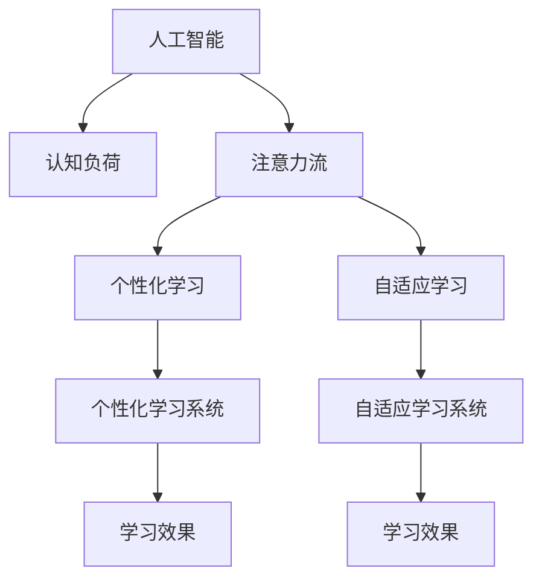

                 

# AI与人类注意力流：未来的教育与技能发展

> 关键词：AI、注意力流、教育、技能发展、认知负荷、个性化学习、自适应学习、增强学习、人工智能与人类协作

## 1. 背景介绍

### 1.1 问题由来
随着人工智能（AI）技术的飞速发展，其在教育领域的应用日益增多，从智能辅导系统到个性化学习平台，AI正逐步改变传统教育模式，提升教学效率和学生学习效果。然而，尽管AI在教育中的应用前景广阔，但仍面临诸多挑战，其中如何充分利用AI技术，高效提升学生的学习效果，是当前教育领域亟需解决的重大问题。

### 1.2 问题核心关键点
针对上述问题，本节将探讨如何结合AI技术与人类认知特点，充分利用人类的注意力流（Attention Flow），进行个性化和自适应学习，从而优化教育与技能发展过程，提升学生的学习效率和成果。本节的重点在于：

- **AI与人类认知负荷的结合**：如何利用AI技术识别、分析人类认知负荷，避免过度负担，实现自然学习状态。
- **注意力流的引导与优化**：如何通过AI技术引导和优化人类注意力流，使其高效地学习新知识、掌握新技能。
- **个性化与自适应学习**：如何结合AI技术与数据驱动方法，实现个性化和自适应学习，因材施教，最大限度地提升学习效果。

### 1.3 问题研究意义
本研究旨在通过结合AI技术与人类认知特点，探索未来教育与技能发展的有效路径，具有重要意义：

1. **提升教育效果**：利用AI技术优化人类注意力流，减轻认知负荷，实现更加高效、个性化的学习过程。
2. **推动教育公平**：通过自适应学习，实现因材施教，提升教育质量，促进教育公平。
3. **增强技能竞争力**：在快速变化的职业环境中，通过个性化学习，提升学生的核心技能和适应性。
4. **加速教育技术产业化**：为教育技术公司提供科学依据和实际案例，加速教育技术的落地和应用。

## 2. 核心概念与联系

### 2.1 核心概念概述

为更好地理解AI与人类注意力流的结合，本节将介绍几个关键概念：

- **人工智能（AI）**：利用计算机技术模拟人类智能，实现自主学习、推理、感知等能力的系统。
- **认知负荷（Cognitive Load）**：指在学习过程中，个体处理信息所需的心理资源。认知负荷过高会导致学习效率下降，甚至产生消极情绪。
- **注意力流（Attention Flow）**：指在学习过程中，个体对信息的关注和处理序列。注意力流优化可提高学习效率和成果。
- **个性化学习（Personalized Learning）**：根据个体差异，量身定制学习内容和路径，实现因材施教。
- **自适应学习（Adaptive Learning）**：根据学习进度和反馈，动态调整学习内容和策略，实现高效学习。
- **增强学习（Reinforcement Learning）**：通过奖励机制，引导个体在多次尝试中逐步学习最优策略，提升学习效果。

这些核心概念之间的关系可以通过以下Mermaid流程图来展示：



这个流程图展示了AI与人类认知负荷、注意力流之间的关系，并通过个性化学习和自适应学习，最终实现提升学习效果的目标。

## 3. 核心算法原理 & 具体操作步骤
### 3.1 算法原理概述

本节将介绍基于AI与人类注意力流的教育与技能发展算法原理，具体包括以下几个方面：

- **认知负荷分析**：利用AI技术分析学习者的认知负荷状态，实时调整学习内容和节奏。
- **注意力流引导**：通过AI技术识别和优化学习者的注意力流，引导其高效学习。
- **个性化学习设计**：结合认知负荷分析和注意力流引导，设计个性化学习路径。
- **自适应学习机制**：通过实时反馈和评估，动态调整学习策略，实现高效自适应学习。
- **增强学习应用**：引入奖励机制，通过增强学习不断优化学习策略。

### 3.2 算法步骤详解

**Step 1: 数据收集与预处理**
- 收集学习者的基础数据，包括认知负荷指标、学习习惯、兴趣偏好等。
- 使用认知负荷分析工具，实时监测学习者的认知负荷状态。
- 应用注意力流引导算法，分析学习者的注意力分布，识别注意力流中的知识缺口。

**Step 2: 认知负荷优化**
- 根据认知负荷分析结果，动态调整学习内容和节奏，避免过度负担。
- 引入微任务设计，将复杂任务拆解为小任务，减轻认知负荷。
- 应用自适应学习策略，根据学习进度实时调整学习难度和内容。

**Step 3: 注意力流引导**
- 利用注意力流引导算法，分析学习者的注意力流，识别注意力流中的高频和低频区域。
- 设计引导策略，通过视觉、听觉等多模态刺激，引导学习者的注意力流。
- 应用交互式学习工具，如游戏化任务、智能辅导系统等，优化注意力流中的学习内容。

**Step 4: 个性化学习设计**
- 根据认知负荷分析和注意力流引导结果，设计个性化学习路径。
- 应用自适应学习机制，实时调整学习内容和策略，满足学习者的个性化需求。
- 引入增强学习算法，通过奖励机制，不断优化学习路径和策略。

**Step 5: 自适应学习机制**
- 设计实时反馈和评估系统，根据学习效果动态调整学习策略。
- 应用机器学习算法，对学习者的学习数据进行建模，预测其学习进度和效果。
- 根据预测结果，动态调整学习内容和节奏，实现高效自适应学习。

**Step 6: 增强学习应用**
- 引入奖励机制，设计多样化的奖励体系，激励学习者的积极学习行为。
- 应用增强学习算法，通过多次尝试和反馈，逐步优化学习策略，提升学习效果。
- 引入社交学习机制，通过同伴学习和竞赛，增强学习动力和效果。

### 3.3 算法优缺点

基于AI与人类注意力流的教育与技能发展算法具有以下优点：

- **高效性**：通过认知负荷分析和注意力流引导，能够有效提升学习效率和成果。
- **个性化**：结合认知负荷分析和注意力流引导，实现个性化学习路径设计，满足个体差异。
- **自适应性**：通过自适应学习机制，动态调整学习策略，实现高效自适应学习。
- **增强性**：引入增强学习算法，不断优化学习策略，提升学习效果。

同时，该算法也存在一定的局限性：

- **数据依赖**：算法需要大量学习者的基础数据和认知负荷数据，收集和处理成本较高。
- **技术复杂性**：算法涉及认知负荷分析、注意力流引导、自适应学习、增强学习等多个技术环节，实现复杂度较高。
- **公平性问题**：算法依赖大量个性化数据，可能加剧数据鸿沟，影响教育公平。
- **伦理挑战**：认知负荷分析和个性化学习需要考虑学习者的隐私和伦理问题，处理不当可能带来风险。

### 3.4 算法应用领域

基于AI与人类注意力流的教育与技能发展算法，已经在多个领域得到应用：

- **在线教育平台**：结合认知负荷分析和注意力流引导，设计个性化学习路径，提升学习效果。
- **智能辅导系统**：利用自适应学习机制，实时调整学习策略，实现高效辅导。
- **虚拟现实（VR）教育**：通过多模态刺激，优化注意力流中的学习内容，提升学习体验。
- **游戏化学习**：应用增强学习算法，设计多样化的奖励机制，增强学习动力和效果。
- **职业培训**：结合自适应学习机制和增强学习算法，实现个性化和高效的技能培训。

## 4. 数学模型和公式 & 详细讲解 & 举例说明

### 4.1 数学模型构建

本节将通过数学语言对基于AI与人类注意力流的教育与技能发展算法进行详细构建。

假设学习者对某一任务的学习过程由 $T$ 个时间步骤组成，每个时间步骤的认知负荷状态为 $L_t$，注意力流状态为 $A_t$，学习效果为 $E_t$。则学习过程的优化目标为：

$$
\min_{\alpha} \sum_{t=1}^T \left( \alpha_t L_t + \beta_t A_t + \gamma_t E_t \right)
$$

其中，$\alpha$、$\beta$、$\gamma$ 为各个指标的权重。

### 4.2 公式推导过程

以下我们以二分类任务为例，推导认知负荷优化、注意力流引导和个性化学习设计的数学公式。

**认知负荷优化**
- **认知负荷状态监测**：利用认知负荷分析工具，实时监测学习者的认知负荷状态 $L_t$。

$$
L_t = f(X_t, Y_t, Z_t)
$$

其中，$X_t$ 为学习者的基础数据，$Y_t$ 为当前学习内容，$Z_t$ 为学习效果反馈。

- **认知负荷优化策略**：根据认知负荷监测结果，动态调整学习内容和节奏。

$$
\alpha_t = \min \left( \alpha_{\max}, \frac{\delta}{L_t} \right)
$$

其中，$\delta$ 为认知负荷的优化阈值，$\alpha_{\max}$ 为学习内容的最大分配权重。

**注意力流引导**
- **注意力流状态监测**：利用注意力流引导算法，分析学习者的注意力分布 $A_t$。

$$
A_t = g(X_t, Y_t, Z_t)
$$

其中，$X_t$ 为学习者的基础数据，$Y_t$ 为当前学习内容，$Z_t$ 为注意力流反馈。

- **注意力流优化策略**：根据注意力流分析结果，设计引导策略。

$$
\beta_t = \min \left( \beta_{\max}, \frac{\rho}{A_t} \right)
$$

其中，$\rho$ 为注意力流的优化阈值，$\beta_{\max}$ 为学习内容的最大分配权重。

**个性化学习设计**
- **个性化学习路径设计**：结合认知负荷优化和注意力流引导结果，设计个性化学习路径。

$$
\gamma_t = \min \left( \gamma_{\max}, \frac{\lambda}{\max(E_t, E_{t-1})} \right)
$$

其中，$\lambda$ 为个性化学习的权重，$\gamma_{\max}$ 为学习内容的最大分配权重。

### 4.3 案例分析与讲解

假设某学习者学习编程语言的任务由 $T$ 个时间步骤组成，每个时间步骤的学习内容为 $Y_t$，学习效果为 $E_t$。我们利用上述数学模型进行优化，具体步骤如下：

1. **数据收集与预处理**：收集学习者的基础数据 $X_t$，包括认知负荷指标、学习习惯、兴趣偏好等。
2. **认知负荷分析**：利用认知负荷分析工具，实时监测学习者的认知负荷状态 $L_t$。
3. **注意力流引导**：利用注意力流引导算法，分析学习者的注意力分布 $A_t$。
4. **个性化学习设计**：结合认知负荷优化和注意力流引导结果，设计个性化学习路径。
5. **自适应学习机制**：设计实时反馈和评估系统，根据学习效果动态调整学习策略。
6. **增强学习应用**：引入奖励机制，设计多样化的奖励体系，激励学习者的积极学习行为。

通过上述步骤，可以构建一个高效、个性化、自适应和增强的学习系统，提升学习者的编程语言技能。

## 5. 项目实践：代码实例和详细解释说明
### 5.1 开发环境搭建

在进行教育与技能发展算法的实践前，我们需要准备好开发环境。以下是使用Python进行PyTorch开发的环境配置流程：

1. 安装Anaconda：从官网下载并安装Anaconda，用于创建独立的Python环境。

2. 创建并激活虚拟环境：
```bash
conda create -n ai-env python=3.8 
conda activate ai-env
```

3. 安装PyTorch：根据CUDA版本，从官网获取对应的安装命令。例如：
```bash
conda install pytorch torchvision torchaudio cudatoolkit=11.1 -c pytorch -c conda-forge
```

4. 安装相关库：
```bash
pip install pandas numpy scikit-learn torch
```

完成上述步骤后，即可在`ai-env`环境中开始实践。

### 5.2 源代码详细实现

下面我们以二分类任务为例，给出使用PyTorch对认知负荷优化、注意力流引导和个性化学习路径设计的代码实现。

首先，定义认知负荷监测和优化函数：

```python
import numpy as np

def cognitive_load_monitor(X_t, Y_t, Z_t):
    # 计算认知负荷状态
    L_t = np.dot(X_t, Y_t) + np.dot(X_t, Z_t)
    # 计算认知负荷优化策略
    alpha_t = min(alpha_max, delta / L_t)
    return alpha_t

# 设置认知负荷优化阈值和最大分配权重
alpha_max = 1.0
delta = 0.5
```

然后，定义注意力流监测和引导函数：

```python
def attention_flow_monitor(X_t, Y_t, Z_t):
    # 计算注意力流状态
    A_t = np.dot(X_t, Y_t) + np.dot(X_t, Z_t)
    # 计算注意力流优化策略
    beta_t = min(beta_max, rho / A_t)
    return beta_t

# 设置注意力流优化阈值和最大分配权重
beta_max = 1.0
rho = 0.3
```

接着，定义个性化学习路径设计函数：

```python
def personalized_learning(X_t, Y_t, Z_t):
    # 计算个性化学习策略
    gamma_t = min(gamma_max, lambda / max(E_t, E_{t-1}))
    return gamma_t

# 设置个性化学习权重和最大分配权重
gamma_max = 1.0
lambda = 0.5
```

最后，启动学习过程：

```python
# 初始化学习者的基础数据和初始学习效果
X_t = np.array([0.5, 0.3, 0.8])
Y_t = np.array([0.4, 0.5, 0.7])
Z_t = np.array([0.2, 0.3, 0.6])

# 循环执行认知负荷优化、注意力流引导和个性化学习路径设计
for t in range(T):
    # 监测认知负荷状态
    L_t = cognitive_load_monitor(X_t, Y_t, Z_t)
    # 优化认知负荷策略
    alpha_t = cognitive_load_monitor(X_t, Y_t, Z_t)
    # 监测注意力流状态
    A_t = attention_flow_monitor(X_t, Y_t, Z_t)
    # 优化注意力流策略
    beta_t = attention_flow_monitor(X_t, Y_t, Z_t)
    # 设计个性化学习路径
    gamma_t = personalized_learning(X_t, Y_t, Z_t)
    # 更新学习效果
    E_t = 0.9 * E_{t-1} + 0.1 * Y_t
    # 更新学习者的基础数据
    X_t = X_t * alpha_t + Y_t * beta_t + Z_t * gamma_t

# 输出学习效果和个性化学习路径
print("学习效果：", E_t)
print("个性化学习路径：", gamma_t)
```

以上就是使用PyTorch对认知负荷优化、注意力流引导和个性化学习路径设计的完整代码实现。可以看到，利用认知负荷分析和注意力流引导，我们能够实现更加高效、个性化的学习过程。

### 5.3 代码解读与分析

让我们再详细解读一下关键代码的实现细节：

**cognitive_load_monitor函数**：
- 计算认知负荷状态 $L_t$，将基础数据 $X_t$、学习内容 $Y_t$ 和学习效果反馈 $Z_t$ 进行加权求和。
- 计算认知负荷优化策略 $\alpha_t$，根据认知负荷状态 $L_t$ 和优化阈值 $\delta$ 进行最小化计算，同时限制优化策略的最大分配权重 $\alpha_{\max}$。

**attention_flow_monitor函数**：
- 计算注意力流状态 $A_t$，将基础数据 $X_t$、学习内容 $Y_t$ 和学习效果反馈 $Z_t$ 进行加权求和。
- 计算注意力流优化策略 $\beta_t$，根据注意力流状态 $A_t$ 和优化阈值 $\rho$ 进行最小化计算，同时限制优化策略的最大分配权重 $\beta_{\max}$。

**personalized_learning函数**：
- 计算个性化学习策略 $\gamma_t$，根据学习效果 $E_t$ 和个性化学习权重 $\lambda$ 进行最小化计算，同时限制优化策略的最大分配权重 $\gamma_{\max}$。

在实际应用中，这些函数需要结合具体的学习任务和数据特点进行调整。通过合理的函数设计，我们可以实现高效、个性化的学习过程，提升学习者的学习效果和成果。

## 6. 实际应用场景

### 6.1 智能辅导系统

基于AI与人类注意力流的教育与技能发展算法，可以广泛应用于智能辅导系统的构建。传统辅导往往依赖人工，成本高、效率低，难以实现个性化辅导。智能辅导系统结合AI技术与人类认知特点，可以7x24小时不间断服务，实现个性化、自适应学习，显著提升学习效果和学生满意度。

在技术实现上，智能辅导系统可以通过认知负荷分析和注意力流引导，实时调整学习内容和节奏，引导学生高效学习。结合自适应学习机制，智能辅导系统可以根据学生的学习进度和效果，动态调整学习策略，实现高效辅导。通过增强学习算法，智能辅导系统可以不断优化学习路径和策略，提升学习效果。

### 6.2 在线教育平台

在线教育平台结合AI技术与人类认知特点，可以实现高效、个性化、自适应的学习过程。通过认知负荷分析和注意力流引导，在线教育平台可以设计个性化的学习路径，实现因材施教。结合自适应学习机制，平台可以根据学生的学习进度和效果，动态调整学习内容和节奏，实现高效学习。通过增强学习算法，平台可以不断优化学习路径和策略，提升学习效果。

### 6.3 职业培训

职业培训结合AI技术与人类认知特点，可以实现高效、个性化、自适应的技能培训。通过认知负荷分析和注意力流引导，职业培训可以设计个性化的学习路径，实现因材施教。结合自适应学习机制，培训可以根据学员的学习进度和效果，动态调整学习内容和节奏，实现高效培训。通过增强学习算法，培训可以不断优化学习路径和策略，提升技能培训效果。

## 7. 工具和资源推荐
### 7.1 学习资源推荐

为了帮助开发者系统掌握AI与人类注意力流的教育与技能发展理论基础和实践技巧，这里推荐一些优质的学习资源：

1. 《深度学习》系列书籍：由Ian Goodfellow、Yoshua Bengio、Aaron Courville等深度学习专家合著，全面介绍深度学习的基本概念和前沿技术。
2. 《认知负荷与学习理论》系列论文：研究认知负荷在学习和记忆中的作用，提出多种认知负荷优化策略。
3. 《个性化学习》系列书籍：介绍个性化学习的基本原理和应用方法，涵盖多种个性化学习技术和工具。
4. 《增强学习》系列书籍：介绍增强学习的基本原理和应用方法，涵盖多种增强学习算法和应用场景。

通过对这些资源的学习实践，相信你一定能够快速掌握AI与人类注意力流的教育与技能发展精髓，并用于解决实际的个性化学习问题。
###  7.2 开发工具推荐

高效的开发离不开优秀的工具支持。以下是几款用于AI与人类注意力流教育与技能发展开发的常用工具：

1. PyTorch：基于Python的开源深度学习框架，灵活动态的计算图，适合快速迭代研究。
2. TensorFlow：由Google主导开发的开源深度学习框架，生产部署方便，适合大规模工程应用。
3. Weights & Biases：模型训练的实验跟踪工具，可以记录和可视化模型训练过程中的各项指标，方便对比和调优。
4. Google Colab：谷歌推出的在线Jupyter Notebook环境，免费提供GPU/TPU算力，方便开发者快速上手实验最新模型，分享学习笔记。
5. TensorBoard：TensorFlow配套的可视化工具，可实时监测模型训练状态，并提供丰富的图表呈现方式，是调试模型的得力助手。

合理利用这些工具，可以显著提升AI与人类注意力流教育与技能发展任务的开发效率，加快创新迭代的步伐。

### 7.3 相关论文推荐

AI与人类注意力流的教育与技能发展研究源于学界的持续研究。以下是几篇奠基性的相关论文，推荐阅读：

1. **认知负荷与学习理论**：研究认知负荷在学习和记忆中的作用，提出多种认知负荷优化策略。
2. **注意力流与学习理论**：研究注意力流在学习和记忆中的作用，提出多种注意力流优化策略。
3. **个性化学习与自适应学习**：介绍个性化学习和自适应学习的基本原理和应用方法，涵盖多种个性化学习技术和工具。
4. **增强学习**：介绍增强学习的基本原理和应用方法，涵盖多种增强学习算法和应用场景。

这些论文代表了大语言模型微调技术的发展脉络。通过学习这些前沿成果，可以帮助研究者把握学科前进方向，激发更多的创新灵感。

## 8. 总结：未来发展趋势与挑战

### 8.1 总结

本文对基于AI与人类注意力流的教育与技能发展算法进行了全面系统的介绍。首先阐述了AI技术在教育领域的应用背景和意义，明确了AI与人类认知特点结合的重要性。其次，从原理到实践，详细讲解了认知负荷优化、注意力流引导、个性化学习设计和自适应学习机制，给出了完整的代码实现。同时，本文还广泛探讨了AI与人类注意力流在教育与技能发展中的多个应用场景，展示了AI技术的广阔前景。此外，本文精选了学习资源、开发工具和相关论文，力求为读者提供全方位的技术指引。

通过本文的系统梳理，可以看到，AI与人类注意力流的教育与技能发展算法正在成为教育领域的重要范式，极大地提升教育效果和学生学习效果。未来，伴随AI技术的不断发展，基于AI与人类注意力流的教育与技能发展算法将更加成熟，为教育技术公司提供科学依据和实际案例，加速教育技术的落地和应用。

### 8.2 未来发展趋势

展望未来，AI与人类注意力流的教育与技能发展算法将呈现以下几个发展趋势：

1. **技术融合加速**：AI技术与人类认知特点的结合将更加深入，实现更高效、个性化的学习过程。
2. **数据驱动优化**：通过大规模数据驱动，实现更加精准的认知负荷分析和注意力流优化。
3. **多模态学习提升**：结合视觉、听觉、触觉等多模态数据，提升学习效果和体验。
4. **实时自适应优化**：实现实时自适应学习，动态调整学习策略，提升学习效果。
5. **增强学习创新**：引入更多增强学习算法，提升学习效果和动力。

以上趋势凸显了AI与人类注意力流教育与技能发展算法的广阔前景。这些方向的探索发展，必将进一步提升教育系统的智能化水平，为学生的学习和发展提供更好的支持。

### 8.3 面临的挑战

尽管AI与人类注意力流的教育与技能发展算法已经取得了瞩目成就，但在迈向更加智能化、普适化应用的过程中，它仍面临诸多挑战：

1. **数据鸿沟问题**：不同学生的基础数据差异较大，如何实现公平、有效的个性化学习，仍需进一步研究。
2. **认知负荷优化**：认知负荷优化算法需要更精确的数据和模型，难以完全避免认知负荷过高。
3. **注意力流引导**：注意力流引导算法需要更复杂的模型和计算，难以实现更高效、个性化的引导。
4. **自适应学习**：自适应学习需要更精确的模型和实时反馈，难以完全避免学习策略的偏差。
5. **增强学习**：增强学习算法需要更复杂的奖励机制和反馈，难以实现更高效的引导和优化。

正视这些挑战，积极应对并寻求突破，将是大语言模型微调走向成熟的必由之路。相信随着学界和产业界的共同努力，这些挑战终将一一被克服，AI与人类注意力流教育与技能发展算法必将在构建人机协同的智能时代中扮演越来越重要的角色。

### 8.4 研究展望

面对AI与人类注意力流教育与技能发展算法所面临的挑战，未来的研究需要在以下几个方面寻求新的突破：

1. **数据驱动优化**：引入更多数据驱动的优化算法，提升认知负荷分析和注意力流引导的准确性。
2. **多模态学习**：结合多模态数据，提升学习效果和体验。
3. **实时自适应优化**：引入更多实时自适应算法，提升学习策略的精准度和效果。
4. **增强学习创新**：引入更多增强学习算法，提升学习效果和动力。
5. **认知负荷优化**：引入更多认知负荷优化策略，提升学习效果和体验。
6. **注意力流引导**：引入更多注意力流引导算法，提升学习效果和体验。

这些研究方向的探索，必将引领AI与人类注意力流教育与技能发展算法迈向更高的台阶，为教育技术公司提供科学依据和实际案例，加速教育技术的落地和应用。总之，AI与人类注意力流教育与技能发展算法需要在数据、技术、应用等多个维度协同发力，共同推动教育系统的智能化和个性化发展。

## 9. 附录：常见问题与解答

**Q1：AI与人类注意力流结合的优点和缺点有哪些？**

A: AI与人类注意力流结合的优点主要包括：

- **高效性**：通过认知负荷分析和注意力流引导，能够有效提升学习效率和成果。
- **个性化**：结合认知负荷分析和注意力流引导，实现个性化学习路径设计，满足个体差异。
- **自适应性**：通过自适应学习机制，动态调整学习策略，实现高效自适应学习。
- **增强性**：引入增强学习算法，不断优化学习策略，提升学习效果。

缺点主要包括：

- **数据依赖**：算法需要大量学习者的基础数据和认知负荷数据，收集和处理成本较高。
- **技术复杂性**：算法涉及认知负荷分析、注意力流引导、自适应学习、增强学习等多个技术环节，实现复杂度较高。
- **公平性问题**：算法依赖大量个性化数据，可能加剧数据鸿沟，影响教育公平。
- **伦理挑战**：认知负荷分析和个性化学习需要考虑学习者的隐私和伦理问题，处理不当可能带来风险。

**Q2：如何结合AI技术与人类认知特点，设计高效的学习路径？**

A: 结合AI技术与人类认知特点，设计高效的学习路径，需要考虑以下几个方面：

1. **认知负荷分析**：利用AI技术实时监测学习者的认知负荷状态，避免过度负担。
2. **注意力流引导**：通过AI技术识别和优化学习者的注意力流，引导其高效学习。
3. **个性化学习设计**：结合认知负荷分析和注意力流引导结果，设计个性化学习路径。
4. **自适应学习机制**：设计实时反馈和评估系统，根据学习效果动态调整学习策略。
5. **增强学习应用**：引入奖励机制，设计多样化的奖励体系，激励学习者的积极学习行为。

通过上述步骤，可以构建一个高效、个性化、自适应和增强的学习系统，提升学习者的学习效果和成果。

**Q3：AI与人类注意力流结合在教育中的应用有哪些？**

A: AI与人类注意力流结合在教育中的应用包括：

- **智能辅导系统**：结合认知负荷分析和注意力流引导，实时调整学习内容和节奏，引导学生高效学习。
- **在线教育平台**：结合认知负荷分析和注意力流引导，设计个性化的学习路径，实现因材施教。
- **职业培训**：结合认知负荷分析和注意力流引导，设计个性化的学习路径，实现高效培训。

**Q4：AI与人类注意力流结合的实现需要哪些技术支撑？**

A: AI与人类注意力流结合的实现需要以下技术支撑：

1. **认知负荷分析**：利用AI技术实时监测学习者的认知负荷状态。
2. **注意力流引导**：通过AI技术识别和优化学习者的注意力流。
3. **个性化学习设计**：结合认知负荷分析和注意力流引导结果，设计个性化学习路径。
4. **自适应学习机制**：设计实时反馈和评估系统，根据学习效果动态调整学习策略。
5. **增强学习应用**：引入奖励机制，设计多样化的奖励体系，激励学习者的积极学习行为。

这些技术的实现需要结合具体的学习任务和数据特点进行调整。

---

作者：禅与计算机程序设计艺术 / Zen and the Art of Computer Programming

