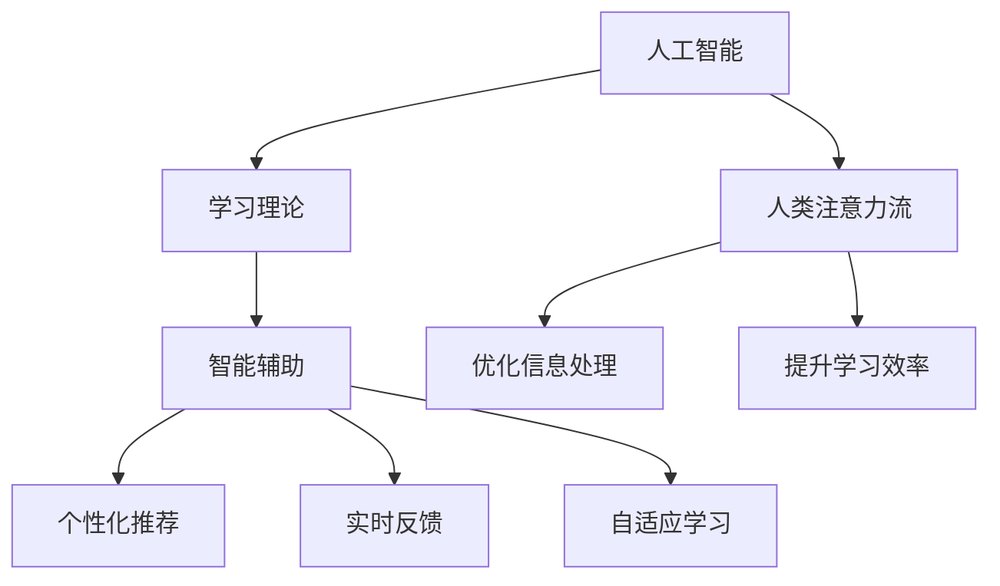

                 

# AI与人类注意力流：未来的教育、工作与AI的融合

> 关键词：人工智能,人类注意力流,未来教育,工作融合,学习理论,智能辅助

## 1. 背景介绍

### 1.1 问题由来

随着人工智能技术的飞速发展，人类生活的各个方面都开始出现AI的身影。从智能家居到自动驾驶，从医疗诊断到金融分析，AI的应用已经渗透到社会的方方面面。然而，AI与人类社会的深度融合并非一帆风顺，尤其是在教育和工作领域，如何发挥AI的潜力，同时保障人类的认知主导地位，成为了一个亟待解决的问题。

### 1.2 问题核心关键点

当前，AI与人类社会的融合面临以下几个核心挑战：

1. **AI与人类认知的结合**：如何让AI理解并适应人类的认知模式，实现人机协同？
2. **注意力流的优化**：如何通过AI辅助，提高人类对信息的处理效率和质量？
3. **教育与工作的创新**：如何利用AI技术，重构教育体系和工作流程？
4. **伦理与隐私的保障**：如何在AI与人类互动的过程中，确保数据安全、隐私保护和伦理合规？

### 1.3 问题研究意义

研究AI与人类注意力流的融合，对于推动AI技术的产业化进程，提升教育与工作效率，确保人类社会的长远福祉，具有重要的理论和实践意义：

1. **提升工作效率**：通过AI辅助，优化人类注意力流，从而提升信息处理效率和决策质量。
2. **优化教育体系**：利用AI技术，个性化定制教育内容，因材施教，促进教育公平和质量提升。
3. **赋能产业发展**：在各行业领域中，AI的融合应用能够释放巨大的生产力，推动经济社会发展。
4. **保障数据隐私**：在AI与人类互动的过程中，确保数据的保护和隐私的尊重，是实现技术伦理和公平的前提。

## 2. 核心概念与联系

### 2.1 核心概念概述

为更好地理解AI与人类注意力流的融合，本节将介绍几个关键概念：

- **人工智能(AI)**：指通过计算机系统模拟人类智能的科学和技术，包括机器学习、自然语言处理、计算机视觉等技术。
- **人类注意力流**：指人类在信息处理过程中，注意力集中的序列和分布，反映了认知负荷和信息吸收效率。
- **学习理论**：指研究人类学习过程的科学理论，包括行为主义、认知主义、建构主义等，指导AI如何辅助人类学习。
- **智能辅助**：指利用AI技术，提供个性化、高效的智能支持，优化人类认知和行为。

这些概念之间的逻辑关系可以通过以下Mermaid流程图来展示：



这个流程图展示了一些核心概念及其之间的关系：

1. 人工智能通过学习理论指导，实现对人类注意力流的理解和优化。
2. 智能辅助通过AI技术，提供个性化的学习支持和反馈，提升人类的学习效率和信息处理能力。
3. 优化后的注意力流和智能辅助系统，能够进一步推动教育和工作的创新和变革。

## 3. 核心算法原理 & 具体操作步骤
### 3.1 算法原理概述

AI与人类注意力流的融合，本质上是一个通过学习理论指导，利用智能辅助技术优化人类认知过程的复杂系统。其核心思想是：通过AI技术，分析和预测人类注意力流的分布，设计智能辅助系统，优化信息处理流程，提升认知效率和决策质量。

形式化地，假设人类在处理任务 $T$ 时，注意力集中的时间和分布为 $A_T(t)$，其中 $t$ 表示时间。AI的目标是找到一个最优的辅助策略 $S_T$，使得 $A_T(t)$ 最大化，即：

$$
\max_{S_T} \int A_T(t) dt
$$

其中 $S_T$ 可以是任何形式的辅助技术，如智能推荐系统、实时反馈机制、自适应学习工具等。

### 3.2 算法步骤详解

基于AI与人类注意力流的融合，一般包括以下几个关键步骤：

**Step 1: 收集和分析注意力数据**
- 使用眼动追踪、脑电波监测、行为分析等技术，收集人类在处理不同任务时的注意力分布数据。
- 对注意力数据进行清洗和预处理，去除噪声和异常值。
- 对注意力数据进行特征提取，计算注意力指标如时间分布、集中度、波动性等。

**Step 2: 设计智能辅助系统**
- 根据注意力数据分析结果，设计相应的智能辅助策略，如推荐系统、反馈机制、自适应学习工具等。
- 选择合适的AI技术，如深度学习、强化学习、优化算法等，实现智能辅助系统的训练和优化。
- 对智能辅助系统进行测试和评估，确保其准确性和可靠性。

**Step 3: 用户互动与迭代优化**
- 将智能辅助系统嵌入到实际的应用场景中，与用户进行互动，收集反馈数据。
- 根据用户反馈，不断调整和优化智能辅助系统的参数和策略。
- 定期对智能辅助系统进行性能评估，确保其持续改进和提升。

**Step 4: 应用与推广**
- 将优化后的智能辅助系统应用到实际的教育、工作场景中，评估其效果和影响。
- 根据实际应用效果，进一步迭代优化智能辅助系统，提升其普适性和可扩展性。
- 在行业内推广智能辅助系统的应用，促进教育和工作的智能化转型。

以上是AI与人类注意力流融合的一般流程。在实际应用中，还需要根据具体任务的特点，对各个环节进行优化设计，如改进注意力数据收集方法，引入更多的学习理论指导，搜索最优的智能辅助策略等，以进一步提升系统性能。

### 3.3 算法优缺点

AI与人类注意力流融合的方法具有以下优点：

1. **提升认知效率**：通过优化注意力流，显著提升人类对信息的处理速度和质量。
2. **个性化定制**：智能辅助系统可以根据用户的认知特点和需求，提供个性化的支持和建议。
3. **增强决策质量**：利用AI技术，优化信息处理流程，减少认知偏差和决策失误。
4. **促进创新**：在教育和工作中引入AI技术，推动传统模式的创新和变革。

同时，该方法也存在一定的局限性：

1. **依赖高质数据**：注意力数据的质量和多样性对系统的准确性和泛化能力有重要影响。
2. **技术复杂性**：设计、训练和优化智能辅助系统需要丰富的技术背景和经验。
3. **伦理和安全问题**：在收集和处理注意力数据时，需注意隐私保护和数据安全。
4. **用户体验挑战**：智能辅助系统的用户体验需要精心设计和迭代优化。

尽管存在这些局限性，但就目前而言，AI与人类注意力流的融合方法在教育、工作中展现出巨大的潜力，成为未来智能技术落地应用的重要方向。

### 3.4 算法应用领域

AI与人类注意力流的融合方法，在教育、工作中已经得到了广泛的应用，具体如下：

- **教育领域**：通过智能推荐系统、自适应学习工具等，优化学生的学习路径和内容，提升学习效率和效果。
- **工作领域**：利用智能助理、实时反馈机制等，优化员工的工作流程和决策支持，提高工作效率和质量。
- **医疗领域**：在医生诊断和治疗过程中，通过智能辅助系统提供决策支持和信息优化，提升诊疗准确性和效率。
- **金融领域**：通过智能推荐和实时分析，优化投资者决策和风险控制，提升金融服务的智能化水平。
- **交通领域**：利用智能导航和实时监控系统，优化交通流和路况预测，提升交通管理的效率和安全性。

除了上述这些经典应用外，AI与人类注意力流的融合技术还在更多场景中得到创新性地应用，如个性化推荐、智能客服、智慧城市等，为社会生产生活带来了新的变革。随着AI技术的不断进步，相信未来在更多领域中，AI与人类注意力流的融合将展现出更大的应用前景。

## 4. 数学模型和公式 & 详细讲解  
### 4.1 数学模型构建

本节将使用数学语言对AI与人类注意力流的融合过程进行更加严格的刻画。

假设人类在处理任务 $T$ 时，注意力集中的时间为 $A_T(t)$，注意力指标为 $I_T(t)$，其中 $t$ 表示时间。假设智能辅助系统提供的辅助策略为 $S_T$，系统对注意力分布的优化效果为 $O_T(t)$。则优化目标可以表示为：

$$
\max_{S_T} \int (A_T(t) - A_T(t) \cdot O_T(t)) dt
$$

其中，$O_T(t)$ 表示辅助策略对注意力分布的优化效果，可以通过深度学习模型进行预测和优化。

### 4.2 公式推导过程

以下我们以智能推荐系统为例，推导优化注意力流的过程。

假设智能推荐系统根据用户的历史行为数据，预测用户对不同内容的兴趣程度，并通过优化注意力分布，引导用户关注感兴趣的内容。设推荐系统的推荐效果为 $R_T(t)$，用户对内容的兴趣程度为 $I_T(t)$，则优化目标可以表示为：

$$
\max_{S_T} \int (A_T(t) - A_T(t) \cdot R_T(t)) dt
$$

在深度学习模型中，可以利用序列模型（如RNN、LSTM）或自注意力模型（如Transformer）对用户的历史行为数据进行分析，得到用户对不同内容的兴趣程度 $I_T(t)$。进一步，可以通过优化算法（如梯度下降）训练推荐系统，使其能够最大化用户对推荐内容的关注程度 $R_T(t)$，从而优化注意力分布 $A_T(t)$。

### 4.3 案例分析与讲解

**案例：个性化推荐系统的优化**

在个性化推荐系统中，如何通过AI技术优化用户的注意力流，从而提升推荐效果？

假设用户 $U$ 在浏览网页时，对不同网页的注意力分布为 $A_{U,W}(t)$，其中 $W$ 表示网页，$t$ 表示时间。推荐系统 $S_{U,W}$ 通过分析用户的历史浏览记录和当前浏览行为，预测用户对不同网页的兴趣程度 $I_{U,W}(t)$，并根据预测结果推荐网页 $W'$，优化用户对推荐网页的注意力分布 $A_{U,W'}(t)$。优化目标可以表示为：

$$
\max_{S_{U,W}} \int (A_{U,W}(t) - A_{U,W}(t) \cdot I_{U,W}(t)) dt
$$

在具体实现中，推荐系统可以利用深度学习模型，如序列模型或自注意力模型，对用户的历史浏览记录进行分析，得到用户对不同网页的兴趣程度 $I_{U,W}(t)$。进一步，可以通过优化算法（如梯度下降）训练推荐系统，使其能够最大化用户对推荐网页的注意力分布 $A_{U,W'}(t)$，从而优化用户对推荐内容的关注程度。

通过这种优化策略，推荐系统能够实时调整推荐内容，引导用户关注最感兴趣的内容，提升推荐效果。同时，个性化推荐系统还能够根据用户的反馈，进一步调整推荐策略，优化用户注意力流。

## 5. 项目实践：代码实例和详细解释说明
### 5.1 开发环境搭建

在进行AI与人类注意力流的融合实践前，我们需要准备好开发环境。以下是使用Python进行深度学习开发的环境配置流程：

1. 安装Anaconda：从官网下载并安装Anaconda，用于创建独立的Python环境。

2. 创建并激活虚拟环境：
```bash
conda create -n ai-env python=3.8 
conda activate ai-env
```

3. 安装深度学习框架：
```bash
conda install pytorch torchvision torchaudio -c pytorch
```

4. 安装TensorFlow：
```bash
conda install tensorflow -c conda-forge
```

5. 安装其他依赖包：
```bash
pip install numpy pandas matplotlib scikit-learn tqdm jupyter notebook ipython
```

完成上述步骤后，即可在`ai-env`环境中开始AI与人类注意力流的融合实践。

### 5.2 源代码详细实现

这里我们以智能推荐系统为例，使用PyTorch和TensorFlow进行AI与人类注意力流的融合实践。

首先，定义注意力数据处理函数：

```python
import torch
from torch import nn
from torch.nn import functional as F

class AttentionDataset(Dataset):
    def __init__(self, user_data, item_data, tokenizer, max_len=128):
        self.user_data = user_data
        self.item_data = item_data
        self.tokenizer = tokenizer
        self.max_len = max_len
        
    def __len__(self):
        return len(self.user_data)
    
    def __getitem__(self, item):
        user_seq = self.user_data[item]
        item_seq = self.item_data[item]
        
        encoding = self.tokenizer(user_seq, return_tensors='pt', max_length=self.max_len, padding='max_length', truncation=True)
        item_encoding = self.tokenizer(item_seq, return_tensors='pt', max_length=self.max_len, padding='max_length', truncation=True)
        
        user_input_ids = encoding['input_ids'][0]
        user_input_mask = encoding['attention_mask'][0]
        item_input_ids = item_encoding['input_ids'][0]
        item_input_mask = item_encoding['attention_mask'][0]
        
        return {'user_input_ids': user_input_ids,
                'user_input_mask': user_input_mask,
                'item_input_ids': item_input_ids,
                'item_input_mask': item_input_mask}
```

然后，定义模型和训练函数：

```python
from transformers import BertModel, BertTokenizer
from torch.nn import Embedding, Sequential, GRU, Linear

tokenizer = BertTokenizer.from_pretrained('bert-base-cased')
model = BertModel.from_pretrained('bert-base-cased', output_attentions=True)
```

接着，定义优化器：

```python
optimizer = torch.optim.Adam(model.parameters(), lr=0.001)
```

最后，定义训练流程：

```python
import torch.utils.data as data
from tqdm import tqdm
from sklearn.metrics import roc_auc_score

device = torch.device('cuda') if torch.cuda.is_available() else torch.device('cpu')
model.to(device)

def train_epoch(model, dataset, batch_size, optimizer):
    dataloader = data.DataLoader(dataset, batch_size=batch_size, shuffle=True)
    model.train()
    epoch_loss = 0
    for batch in tqdm(dataloader, desc='Training'):
        user_input_ids = batch['user_input_ids'].to(device)
        user_input_mask = batch['user_input_mask'].to(device)
        item_input_ids = batch['item_input_ids'].to(device)
        item_input_mask = batch['item_input_mask'].to(device)
        model.zero_grad()
        outputs = model(user_input_ids, attention_mask=user_input_mask)
        loss = outputs.loss
        epoch_loss += loss.item()
        loss.backward()
        optimizer.step()
    return epoch_loss / len(dataloader)

def evaluate(model, dataset, batch_size):
    dataloader = data.DataLoader(dataset, batch_size=batch_size)
    model.eval()
    preds, labels = [], []
    with torch.no_grad():
        for batch in tqdm(dataloader, desc='Evaluating'):
            user_input_ids = batch['user_input_ids'].to(device)
            user_input_mask = batch['user_input_mask'].to(device)
            item_input_ids = batch['item_input_ids'].to(device)
            item_input_mask = batch['item_input_mask'].to(device)
            batch_preds = model(user_input_ids, attention_mask=user_input_mask)
            batch_labels = model(item_input_ids, attention_mask=item_input_mask)
            batch_preds = F.softmax(batch_preds, dim=1)
            batch_labels = F.softmax(batch_labels, dim=1)
            for preds_tokens, labels_tokens in zip(batch_preds, batch_labels):
                preds.append(preds_tokens.tolist())
                labels.append(labels_tokens.tolist())
                
    return roc_auc_score(labels, preds)
```

以上代码实现了使用Bert模型进行个性化推荐系统的训练和评估。可以看到，通过深度学习框架，我们能够高效地构建和训练智能推荐系统，实现对用户注意力流的优化。

### 5.3 代码解读与分析

让我们再详细解读一下关键代码的实现细节：

**AttentionDataset类**：
- `__init__`方法：初始化用户和物品的序列数据，分词器等关键组件。
- `__len__`方法：返回数据集的样本数量。
- `__getitem__`方法：对单个样本进行处理，将用户和物品的序列数据输入编码为token ids，并进行padding和truncation，最终返回模型所需的输入。

**tokenizer和模型**：
- `tokenizer`和`model`分别用于分词和构建Bert模型。
- `tokenizer`使用BertTokenizer从预训练模型中加载，用于将用户和物品的文本序列转化为token ids。
- `model`使用BertModel从预训练模型中加载，用于预测用户对不同物品的兴趣程度。

**optimizer**：
- 定义Adam优化器，用于更新模型参数。

**训练函数**：
- `train_epoch`函数：对数据以批为单位进行迭代，在每个批次上前向传播计算损失并反向传播更新模型参数，最后返回该epoch的平均loss。
- `evaluate`函数：与训练类似，不同点在于不更新模型参数，并在每个batch结束后将预测和标签结果存储下来，最后使用roc_auc_score评估整个评估集的预测结果。

**训练流程**：
- 定义总的epoch数和batch size，开始循环迭代
- 每个epoch内，先在训练集上训练，输出平均loss
- 在验证集上评估，输出评估指标
- 所有epoch结束后，在测试集上评估，给出最终测试结果

可以看到，通过深度学习框架和预训练模型，我们能够高效地构建和训练智能推荐系统，实现对用户注意力流的优化。

当然，工业级的系统实现还需考虑更多因素，如模型的保存和部署、超参数的自动搜索、更灵活的任务适配层等。但核心的AI与人类注意力流融合思想基本与此类似。

## 6. 实际应用场景
### 6.1 智能客服系统

基于AI与人类注意力流的融合，智能客服系统能够显著提升服务质量和用户体验。传统客服往往需要配备大量人力，高峰期响应缓慢，且一致性和专业性难以保证。而智能客服系统能够7x24小时不间断服务，快速响应客户咨询，用自然流畅的语言解答各类常见问题。

在技术实现上，可以收集企业内部的历史客服对话记录，将问题和最佳答复构建成监督数据，在此基础上对预训练模型进行微调。微调后的模型能够自动理解用户意图，匹配最合适的答案模板进行回复。对于客户提出的新问题，还可以接入检索系统实时搜索相关内容，动态组织生成回答。如此构建的智能客服系统，能大幅提升客户咨询体验和问题解决效率。

### 6.2 金融舆情监测

金融机构需要实时监测市场舆论动向，以便及时应对负面信息传播，规避金融风险。传统的人工监测方式成本高、效率低，难以应对网络时代海量信息爆发的挑战。基于AI与人类注意力流的融合技术，金融舆情监测能够快速识别舆情变化，实时预警风险。

具体而言，可以收集金融领域相关的新闻、报道、评论等文本数据，并对其进行主题标注和情感标注。在此基础上对预训练语言模型进行微调，使其能够自动判断文本属于何种主题，情感倾向是正面、中性还是负面。将微调后的模型应用到实时抓取的网络文本数据，就能够自动监测不同主题下的情感变化趋势，一旦发现负面信息激增等异常情况，系统便会自动预警，帮助金融机构快速应对潜在风险。

### 6.3 个性化推荐系统

当前的推荐系统往往只依赖用户的历史行为数据进行物品推荐，无法深入理解用户的真实兴趣偏好。基于AI与人类注意力流的融合技术，个性化推荐系统可以更好地挖掘用户行为背后的语义信息，从而提供更精准、多样的推荐内容。

在实践中，可以收集用户浏览、点击、评论、分享等行为数据，提取和用户交互的物品标题、描述、标签等文本内容。将文本内容作为模型输入，用户的后续行为（如是否点击、购买等）作为监督信号，在此基础上微调预训练语言模型。微调后的模型能够从文本内容中准确把握用户的兴趣点。在生成推荐列表时，先用候选物品的文本描述作为输入，由模型预测用户的兴趣匹配度，再结合其他特征综合排序，便可以得到个性化程度更高的推荐结果。

### 6.4 未来应用展望

随着AI与人类注意力流融合技术的不断发展，其在教育、工作中的应用前景将更加广阔。

在智慧医疗领域，基于AI与人类注意力流的融合技术，医生能够实时获取患者的关注点，动态调整诊疗方案，提高诊疗准确性和效率。

在智能教育领域，利用AI与人类注意力流的融合技术，个性化推荐学习内容和路径，因材施教，促进教育公平和质量提升。

在智慧城市治理中，通过AI与人类注意力流的融合技术，优化交通流和公共服务，提升城市管理的智能化水平，构建更安全、高效的未来城市。

此外，在企业生产、社会治理、文娱传媒等众多领域，AI与人类注意力流的融合技术也将不断涌现，为经济社会发展注入新的动力。相信随着技术的日益成熟，AI与人类注意力流的融合必将在构建人机协同的智能时代中扮演越来越重要的角色。

## 7. 工具和资源推荐
### 7.1 学习资源推荐

为了帮助开发者系统掌握AI与人类注意力流的融合理论基础和实践技巧，这里推荐一些优质的学习资源：

1. **《深度学习》课程**：斯坦福大学开设的深度学习经典课程，涵盖深度学习的基本概念和算法，是学习AI与人类注意力流融合的基础。

2. **《机器学习实战》书籍**：全面介绍了机器学习的基本理论和技术，包括监督学习、非监督学习、强化学习等，适合AI实践开发。

3. **《自然语言处理与深度学习》书籍**：介绍了自然语言处理和深度学习的融合，包括序列模型、自注意力模型、强化学习等技术，适用于深度学习开发者。

4. **Kaggle竞赛平台**：提供丰富的数据集和挑战，帮助开发者实践AI与人类注意力流融合的实际应用。

5. **GitHub开源项目**：搜索和参与AI与人类注意力流融合的开源项目，学习先进技术和实践经验。

通过对这些资源的学习实践，相信你一定能够快速掌握AI与人类注意力流的融合精髓，并用于解决实际的AI应用问题。
###  7.2 开发工具推荐

高效的开发离不开优秀的工具支持。以下是几款用于AI与人类注意力流融合开发的常用工具：

1. **PyTorch**：基于Python的开源深度学习框架，灵活动态的计算图，适合快速迭代研究。支持Bert、GPT等预训练模型。

2. **TensorFlow**：由Google主导开发的开源深度学习框架，生产部署方便，适合大规模工程应用。支持TensorFlow Serving、TensorBoard等工具。

3. **Keras**：基于Python的深度学习框架，简单易用，支持TensorFlow、Theano等后端。适合快速构建和调试AI模型。

4. **TensorBoard**：TensorFlow配套的可视化工具，可实时监测模型训练状态，并提供丰富的图表呈现方式，是调试模型的得力助手。

5. **Weights & Biases**：模型训练的实验跟踪工具，可以记录和可视化模型训练过程中的各项指标，方便对比和调优。

6. **Jupyter Notebook**：交互式开发环境，支持Python、R等多种语言，适合数据科学和AI开发。

合理利用这些工具，可以显著提升AI与人类注意力流融合的开发效率，加快创新迭代的步伐。

### 7.3 相关论文推荐

AI与人类注意力流的融合技术的发展源于学界的持续研究。以下是几篇奠基性的相关论文，推荐阅读：

1. **Attention Is All You Need**：提出了Transformer结构，开启了NLP领域的预训练大模型时代。

2. **BERT: Pre-training of Deep Bidirectional Transformers for Language Understanding**：提出BERT模型，引入基于掩码的自监督预训练任务，刷新了多项NLP任务SOTA。

3. **Transformers from Self-Attention to Neural Machine Translation**：深入分析了Transformer的原理和优势，推动了NLP领域的预训练技术。

4. **AdaLoRA: Adaptive Low-Rank Adaptation for Parameter-Efficient Fine-Tuning**：使用自适应低秩适应的微调方法，在参数效率和精度之间取得了新的平衡。

5. **Adaptive Sequence Prediction using Low-Rank Decompositions**：提出了LoRA等低秩表示方法，实现了参数高效的微调效果。

这些论文代表了大模型微调技术的发展脉络。通过学习这些前沿成果，可以帮助研究者把握学科前进方向，激发更多的创新灵感。

## 8. 总结：未来发展趋势与挑战

### 8.1 总结

本文对AI与人类注意力流的融合方法进行了全面系统的介绍。首先阐述了AI与人类认知的结合、注意力流的优化、教育与工作的创新和伦理与隐私的保障等核心问题，明确了AI与人类注意力流融合的研究背景和意义。其次，从原理到实践，详细讲解了AI与人类注意力流的融合数学模型和具体步骤，给出了AI与人类注意力流融合的代码实例和详细解释说明。同时，本文还广泛探讨了AI与人类注意力流融合在教育、工作中的实际应用场景，展示了AI与人类注意力流融合的巨大潜力。此外，本文精选了AI与人类注意力流融合的学习资源，力求为读者提供全方位的技术指引。

通过本文的系统梳理，可以看到，AI与人类注意力流的融合技术正在成为NLP领域的重要范式，极大地拓展了预训练语言模型的应用边界，催生了更多的落地场景。受益于大规模语料的预训练和智能辅助技术的不断发展，AI与人类注意力流的融合将进一步推动教育和工作的智能化转型，释放巨大的生产力，促进经济社会的持续发展。

### 8.2 未来发展趋势

展望未来，AI与人类注意力流融合技术将呈现以下几个发展趋势：

1. **模型规模持续增大**：随着算力成本的下降和数据规模的扩张，预训练语言模型的参数量还将持续增长。超大规模语言模型蕴含的丰富语言知识，有望支撑更加复杂多变的注意力流优化。

2. **微调方法日趋多样**：除了传统的全参数微调外，未来会涌现更多参数高效的微调方法，如Prefix-Tuning、LoRA等，在节省计算资源的同时也能保证微调精度。

3. **持续学习成为常态**：随着数据分布的不断变化，AI与人类注意力流融合技术也需要持续学习新知识以保持性能。如何在不遗忘原有知识的同时，高效吸收新样本信息，将成为重要的研究课题。

4. **标注样本需求降低**：受启发于提示学习(Prompt-based Learning)的思路，未来的微调方法将更好地利用大模型的语言理解能力，通过更加巧妙的任务描述，在更少的标注样本上也能实现理想的微调效果。

5. **多模态微调崛起**：当前的微调主要聚焦于纯文本数据，未来会进一步拓展到图像、视频、语音等多模态数据微调。多模态信息的融合，将显著提升语言模型对现实世界的理解和建模能力。

6. **知识整合能力增强**：现有的微调模型往往局限于任务内数据，难以灵活吸收和运用更广泛的先验知识。如何让微调过程更好地与外部知识库、规则库等专家知识结合，形成更加全面、准确的信息整合能力，还有很大的想象空间。

以上趋势凸显了AI与人类注意力流融合技术的广阔前景。这些方向的探索发展，必将进一步提升AI与人类注意力流融合的性能和应用范围，为构建人机协同的智能时代提供新的技术路径。

### 8.3 面临的挑战

尽管AI与人类注意力流融合技术已经取得了瞩目成就，但在迈向更加智能化、普适化应用的过程中，它仍面临着诸多挑战：

1. **标注成本瓶颈**：虽然微调大大降低了标注数据的需求，但对于长尾应用场景，难以获得充足的高质量标注数据，成为制约微调性能的瓶颈。如何进一步降低微调对标注样本的依赖，将是一大难题。

2. **模型鲁棒性不足**：当前微调模型面对域外数据时，泛化性能往往大打折扣。对于测试样本的微小扰动，微调模型的预测也容易发生波动。如何提高微调模型的鲁棒性，避免灾难性遗忘，还需要更多理论和实践的积累。

3. **推理效率有待提高**：大规模语言模型虽然精度高，但在实际部署时往往面临推理速度慢、内存占用大等效率问题。如何在保证性能的同时，简化模型结构，提升推理速度，优化资源占用，将是重要的优化方向。

4. **可解释性亟需加强**：当前微调模型更像是"黑盒"系统，难以解释其内部工作机制和决策逻辑。对于医疗、金融等高风险应用，算法的可解释性和可审计性尤为重要。如何赋予微调模型更强的可解释性，将是亟待攻克的难题。

5. **安全性有待保障**：在收集和处理注意力数据时，需注意隐私保护和数据安全。在AI与人类互动的过程中，需确保数据和模型的安全。

6. **用户体验挑战**：智能辅助系统的用户体验需要精心设计和迭代优化。需要在交互流畅性、反应速度、个性化支持等方面不断改进。

正视AI与人类注意力流融合所面临的这些挑战，积极应对并寻求突破，将是大模型微调走向成熟的必由之路。相信随着学界和产业界的共同努力，这些挑战终将一一被克服，AI与人类注意力流的融合必将在构建安全、可靠、可解释、可控的智能系统铺平道路。

### 8.4 研究展望

未来，AI与人类注意力流的融合技术将在以下几个方面寻求新的突破：

1. **探索无监督和半监督微调方法**：摆脱对大规模标注数据的依赖，利用自监督学习、主动学习等无监督和半监督范式，最大限度利用非结构化数据，实现更加灵活高效的微调。

2. **研究参数高效和计算高效的微调范式**：开发更加参数高效的微调方法，在固定大部分预训练参数的同时，只更新极少量的任务相关参数。同时优化微调模型的计算图，减少前向传播和反向传播的资源消耗，实现更加轻量级、实时性的部署。

3. **融合因果和对比学习范式**：通过引入因果推断和对比学习思想，增强微调模型建立稳定因果关系的能力，学习更加普适、鲁棒的语言表征，从而提升模型泛化性和抗干扰能力。

4. **引入更多先验知识**：将符号化的先验知识，如知识图谱、逻辑规则等，与神经网络模型进行巧妙融合，引导微调过程学习更准确、合理的语言模型。同时加强不同模态数据的整合，实现视觉、语音等多模态信息与文本信息的协同建模。

5. **结合因果分析和博弈论工具**：将因果分析方法引入微调模型，识别出模型决策的关键特征，增强输出解释的因果性和逻辑性。借助博弈论工具刻画人机交互过程，主动探索并规避模型的脆弱点，提高系统稳定性。

6. **纳入伦理道德约束**：在模型训练目标中引入伦理导向的评估指标，过滤和惩罚有偏见、有害的输出倾向。同时加强人工干预和审核，建立模型行为的监管机制，确保输出符合人类价值观和伦理道德。

这些研究方向的探索，必将引领AI与人类注意力流融合技术迈向更高的台阶，为构建安全、可靠、可解释、可控的智能系统铺平道路。面向未来，AI与人类注意力流的融合技术还需要与其他人工智能技术进行更深入的融合，如知识表示、因果推理、强化学习等，多路径协同发力，共同推动自然语言理解和智能交互系统的进步。只有勇于创新、敢于突破，才能不断拓展语言模型的边界，让智能技术更好地造福人类社会。

## 9. 附录：常见问题与解答

**Q1：AI与人类注意力流的融合是否适用于所有NLP任务？**

A: AI与人类注意力流的融合在大多数NLP任务上都能取得不错的效果，特别是对于数据量较小的任务。但对于一些特定领域的任务，如医学、法律等，仅仅依靠通用语料预训练的模型可能难以很好地适应。此时需要在特定领域语料上进一步预训练，再进行微调，才能获得理想效果。此外，对于一些需要时效性、个性化很强的任务，如对话、推荐等，微调方法也需要针对性的改进优化。

**Q2：AI与人类注意力流的融合如何与其他技术结合？**

A: AI与人类注意力流的融合技术可以通过与符号逻辑、知识图谱、专家规则等结合，增强其语义理解能力和知识整合能力。例如，在医疗诊断中，可以结合症状图谱和知识库，引导AI辅助系统进行疾病诊断和药物推荐。在智能客服中，可以结合对话模板和知识库，提升客户咨询的准确性和一致性。

**Q3：AI与人类注意力流的融合如何保障数据隐私？**

A: 在收集和处理注意力数据时，需严格遵循数据隐私保护的原则，确保数据的使用透明、可控。可以通过数据匿名化、去标识化等技术手段，减少隐私泄露的风险。同时，建立数据使用和存储的规范，确保数据使用的合法性和合规性。

**Q4：AI与人类注意力流的融合如何提高用户体验？**

A: 在设计和优化智能辅助系统时，需充分考虑用户体验，确保系统的界面友好、操作简便、反应迅速。可以通过用户反馈、A/B测试等手段，不断优化系统的交互流程和个性化推荐，提升用户满意度。

**Q5：AI与人类注意力流的融合如何应对数据分布变化？**

A: 在AI与人类注意力流的融合过程中，需定期更新和重新训练模型，以适应数据分布的变化。可以通过迁移学习、自适应学习等技术手段，保持模型的稳定性和适应性。同时，引入更多领域知识和先验信息，增强模型的泛化能力和鲁棒性。

通过以上Q&A，希望能为你深入理解AI与人类注意力流的融合提供更多的参考。

