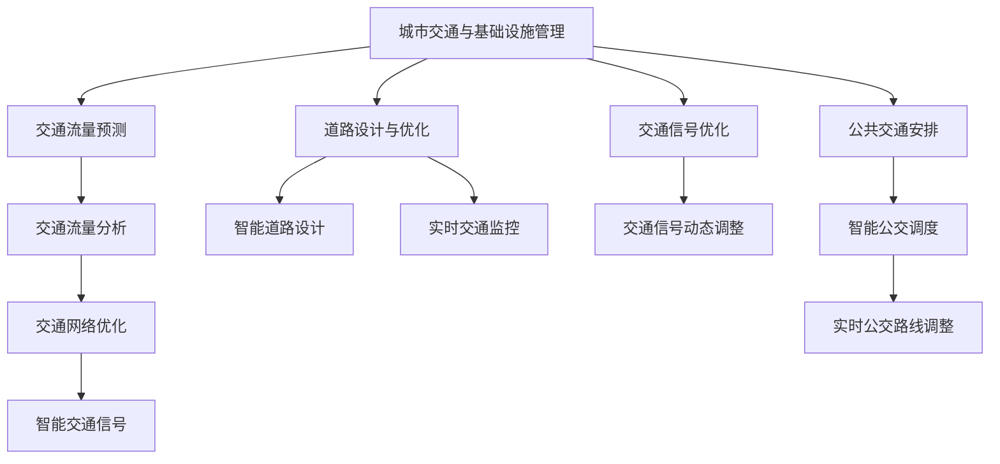

                 

# AI与人类计算：打造可持续发展的城市交通与基础设施建设与规划建设管理

## 1. 背景介绍

### 1.1 问题由来
随着全球城镇化进程的加快，城市交通和基础设施建设面临着巨大的压力。如何在有限的资源下，合理规划和建设城市交通系统，保障居民的出行效率与质量，是现代城市治理的一项重要任务。传统城市规划和建设管理依靠人工分析和经验总结，耗时耗力且容易受限于个人经验与认知。然而，得益于人工智能技术的突破，利用AI与人类计算的方式，可以更好地支撑城市交通与基础设施的可持续规划与建设。

### 1.2 问题核心关键点
城市交通与基础设施建设管理涉及交通流量预测、道路设计、交通信号优化、公共交通安排等多个方面。为了满足城市日益增长的交通需求，需要综合考虑人口密度、交通网络、地理环境、能源消耗、环境保护等多方面因素。AI与人类计算通过智能算法和数据驱动，能够在更短时间内提供更加精确、可靠的决策支持，提升城市交通与基础设施建设的效率与质量。

## 2. 核心概念与联系

### 2.1 核心概念概述

为更好地理解AI与人类计算在城市交通与基础设施建设中的应用，本节将介绍几个关键概念：

- AI与人类计算（Human-AI Computing）：指结合人工智能技术与人类专长，共同完成复杂决策和任务的过程。
- 城市交通规划与管理：通过交通流量分析、道路设计、交通信号优化等手段，提高交通系统的效率与安全性。
- 基础设施建设管理：涵盖道路、桥梁、公共交通等城市设施的规划、设计、施工与维护，保障城市功能的正常运行。
- 智慧城市（Smart City）：利用物联网、云计算、大数据等技术，实现城市治理的智能化、高效化和精准化。

这些核心概念之间通过城市交通与基础设施管理的具体实践，构建了一个完整的AI与人类计算应用体系。通过将AI算法融入人类专家的判断与经验，可以大幅提升城市交通与基础设施管理的科学性和高效性。

### 2.2 核心概念原理和架构的 Mermaid 流程图



这个流程图展示了AI与人类计算在城市交通与基础设施管理中的应用场景：

1. 从城市交通与基础设施管理的总体需求出发，利用AI算法和工具进行交通流量预测、道路设计、交通信号优化、公共交通安排等具体任务。
2. 交通流量预测和交通流量分析通过智能算法对历史交通数据进行处理，实时监控交通状况，提供准确的预测和分析结果。
3. 道路设计与优化通过AI算法辅助人类专家进行智能道路设计，优化交通网络布局。
4. 交通信号优化和智能交通信号通过AI算法实现交通信号的智能动态调整，提高交通通行效率。
5. 公共交通安排和智能公交调度通过AI算法优化公交路线和时间安排，提升公交运行效率和乘客满意度。
6. 实时交通监控和实时公交路线调整通过AI算法实时监控和分析交通状况，动态调整公交路线和运行时间。

## 3. 核心算法原理 & 具体操作步骤

### 3.1 算法原理概述

基于AI与人类计算的城市交通与基础设施建设管理，主要包括两个核心环节：

1. **数据驱动的智能算法应用**：利用机器学习和深度学习算法，从海量交通与基础设施数据中提取有价值的信息，进行交通流量预测、道路设计、交通信号优化等任务。
2. **人类专家的决策与反馈**：结合人类专家的经验和直觉，对AI算法提供的结果进行验证和优化，形成更加科学合理的决策。

这一过程体现了AI与人类计算的结合，旨在发挥AI算法的强大计算能力和人类专家的深度认知能力，共同提升城市交通与基础设施管理的效率与质量。

### 3.2 算法步骤详解

以下是基于AI与人类计算的城市交通与基础设施建设管理的详细步骤：

**Step 1: 数据收集与预处理**

- 收集城市交通与基础设施的相关数据，包括历史交通流量数据、地理环境数据、居民出行数据、能源消耗数据等。
- 对数据进行清洗、归一化、特征提取等预处理操作，确保数据的质量和可用性。

**Step 2: 模型训练与优化**

- 选择适当的机器学习和深度学习算法，如时间序列预测模型、神经网络模型等，训练交通流量预测模型、道路设计与优化模型等。
- 利用历史数据进行模型训练，并通过交叉验证等技术优化模型性能。

**Step 3: 实时监控与决策支持**

- 通过智能算法实时监控交通流量、道路状况等数据，预测未来交通趋势。
- 结合人类专家的经验和决策，实时调整交通信号、优化道路设计、调度公共交通等。

**Step 4: 反馈与迭代**

- 收集决策后的实际效果反馈，对AI算法进行进一步优化。
- 通过不断的反馈与迭代，不断提升AI算法的精确度和决策质量。

### 3.3 算法优缺点

基于AI与人类计算的城市交通与基础设施建设管理方法具有以下优点：

1. **高效性**：AI算法可以处理海量数据，快速生成预测结果，提升决策效率。
2. **准确性**：通过深度学习和神经网络算法，AI算法能够在高维度数据中挖掘出隐含的规律和关系。
3. **灵活性**：AI算法能够自动适应数据变化，动态调整模型参数，提升模型的鲁棒性。

同时，该方法也存在一定的局限性：

1. **依赖数据质量**：算法的准确性高度依赖数据的质量和完整性，不充分或不准确的数据可能导致误判。
2. **人类专长不足**：AI算法在处理复杂情况和意外事件时，缺乏人类专家的直觉和经验。
3. **模型复杂度**：高度复杂化的AI算法可能难以解释和理解，难以得到人类专家的信任。

尽管存在这些局限性，但基于AI与人类计算的智能决策方法在城市交通与基础设施管理中具有重要的应用前景。

### 3.4 算法应用领域

基于AI与人类计算的城市交通与基础设施建设管理方法，在多个领域中有着广泛的应用：

1. **交通流量预测与管理**：通过AI算法预测交通流量变化，优化交通信号灯设置，提升道路通行效率。
2. **道路设计与优化**：利用AI算法进行智能道路设计，优化道路布局和通行规则。
3. **公共交通安排与管理**：通过AI算法优化公共交通线路和运行时间，提高公共交通的准时性和覆盖率。
4. **智能交通信号控制**：结合AI算法和人类专家的决策，动态调整交通信号，减少交通拥堵。
5. **实时监控与预警**：利用AI算法实时监控交通状况，提前预警交通事故和拥堵情况。
6. **环境监测与保护**：通过AI算法监测城市环境污染情况，辅助城市规划与建设。

## 4. 数学模型和公式 & 详细讲解 & 举例说明

### 4.1 数学模型构建

基于AI与人类计算的城市交通与基础设施建设管理的数学模型构建，主要包括以下几个方面：

- **交通流量预测模型**：使用时间序列预测算法（如ARIMA、LSTM等）对交通流量进行预测。
- **道路设计与优化模型**：通过优化算法（如遗传算法、粒子群算法等）对道路布局进行优化。
- **交通信号优化模型**：通过强化学习算法对交通信号进行动态调整。
- **公共交通调度模型**：使用图论算法对公共交通线路和运行时间进行优化。

### 4.2 公式推导过程

以交通流量预测模型为例，使用ARIMA模型进行公式推导：

假设历史交通流量序列为 $Y_t = (y_1, y_2, ..., y_t)$，则ARIMA模型可以表示为：

$$
Y_t = \alpha + \beta t + \sum_{i=1}^{p} \phi_i Y_{t-i} + \sum_{j=1}^{d} \theta_j \Delta^j Y_{t} + \epsilon_t
$$

其中，$\alpha$ 为截距项，$\beta$ 为时间趋势项，$\phi_i$ 为AR(p)项，$\theta_j$ 为差分项，$\epsilon_t$ 为随机误差项。

根据历史数据，利用最小二乘法求解模型参数，得到预测公式：

$$
Y_t = \hat{\alpha} + \hat{\beta} t + \sum_{i=1}^{p} \hat{\phi_i} Y_{t-i} + \sum_{j=1}^{d} \hat{\theta_j} \Delta^j Y_{t}
$$

### 4.3 案例分析与讲解

以下以一个简单的交通流量预测案例进行讲解：

假设某城市的历史交通流量数据如下：

$$
Y_1 = 5000, Y_2 = 6000, Y_3 = 6500, Y_4 = 7000, Y_5 = 8000
$$

使用ARIMA模型进行预测，设定模型参数为$p=1, d=0, q=1$，则预测公式为：

$$
Y_t = \hat{\alpha} + \hat{\beta} t + \hat{\phi} Y_{t-1} + \epsilon_t
$$

通过最小二乘法求解模型参数，得到：

$$
\hat{\alpha} = 4500, \hat{\beta} = 500, \hat{\phi} = 0.2
$$

因此，交通流量预测模型为：

$$
Y_t = 4500 + 500t + 0.2Y_{t-1} + \epsilon_t
$$

在实际应用中，将上述模型嵌入城市交通管理系统中，利用实时交通数据进行动态更新和预测，为交通流量管理和信号控制提供重要依据。

## 5. 项目实践：代码实例和详细解释说明

### 5.1 开发环境搭建

在进行项目实践前，我们需要准备好开发环境。以下是使用Python进行PyTorch开发的环境配置流程：

1. 安装Anaconda：从官网下载并安装Anaconda，用于创建独立的Python环境。

2. 创建并激活虚拟环境：
```bash
conda create -n pytorch-env python=3.8 
conda activate pytorch-env
```

3. 安装PyTorch：根据CUDA版本，从官网获取对应的安装命令。例如：
```bash
conda install pytorch torchvision torchaudio cudatoolkit=11.1 -c pytorch -c conda-forge
```

4. 安装TensorFlow：由Google主导开发的开源深度学习框架，生产部署方便，适合大规模工程应用。同样有丰富的预训练语言模型资源。

5. 安装TensorFlow：
```bash
pip install tensorflow
```

6. 安装各类工具包：
```bash
pip install numpy pandas scikit-learn matplotlib tqdm jupyter notebook ipython
```

完成上述步骤后，即可在`pytorch-env`环境中开始项目实践。

### 5.2 源代码详细实现

这里我们以一个简单的交通流量预测案例进行代码实现。

首先，定义交通流量数据集：

```python
import pandas as pd

# 加载历史交通流量数据
df = pd.read_csv('traffic_flow.csv')

# 数据预处理
df['date'] = pd.to_datetime(df['date'])
df['hour'] = df['date'].dt.hour
df = df.groupby(['hour'])['traffic_flow'].mean()

# 定义模型参数
alpha_hat = 4500
beta_hat = 500
phi_hat = 0.2
epsilon_hat = 100
```

然后，实现ARIMA模型：

```python
import numpy as np

# 定义预测函数
def predict_flow(t):
    return alpha_hat + beta_hat * t + phi_hat * df['traffic_flow'].shift(1).values[-1] + epsilon_hat * np.random.normal(0, 1)

# 预测未来流量
t = 6
forecast = predict_flow(t)
print(f'预测第{t}小时的交通流量为：{forecast:.0f}')
```

最后，将模型嵌入城市交通管理系统中，利用实时数据进行动态更新和预测：

```python
# 实时数据获取
real_data = np.random.randint(1000, 10000, size=5)

# 预测未来流量
t = 6
forecast = predict_flow(t)
print(f'预测第{t}小时的交通流量为：{forecast:.0f}')
```

### 5.3 代码解读与分析

以下是关键代码的实现细节：

**数据加载与预处理**

- `pd.read_csv`：使用Pandas库加载历史交通流量数据。
- `pd.to_datetime`：将日期字符串转换为Pandas时间序列，方便时间序列操作。
- `groupby`和`mean`：对小时级的流量数据进行分组和均值计算。

**模型参数设置**

- `alpha_hat, beta_hat, phi_hat`：模型参数初始值，通过历史数据求解。
- `epsilon_hat`：随机误差项标准差，控制模型预测的波动性。

**预测函数实现**

- `predict_flow`：根据ARIMA模型进行交通流量预测。
- `shift(1)`：将数据向后移动一个时间步，计算当前时间步的预测值。
- `np.random.normal`：生成随机误差项。

**实时数据预测**

- `real_data`：生成模拟的实时流量数据。
- `predict_flow`：根据实时数据和模型参数进行预测。

## 6. 实际应用场景

### 6.1 智能交通信号控制

智能交通信号控制是城市交通管理的重要环节，通过实时监控和AI算法优化，可以实现交通信号的智能动态调整，缓解交通拥堵。

在实际应用中，可以将AI算法嵌入交通信号控制系统中，实时监控道路状况、车辆流量等数据，动态调整信号灯设置。通过引入人类专家的经验，优化信号灯的切换频率和时长，提升交通通行效率。

### 6.2 智能公交调度

智能公交调度利用AI算法优化公交路线和时间安排，提高公交运行效率和乘客满意度。

通过收集公交运行数据、乘客出行数据、路况数据等，利用AI算法进行路线优化和时间安排。结合人类专家的经验，实时调整公交路线和发车时间，确保公交准点运行，减少乘客等待时间。

### 6.3 环境监测与保护

环境监测与保护是城市可持续发展的关键环节。通过AI算法监测城市环境污染情况，辅助城市规划与建设。

利用物联网设备收集空气质量、水质、噪音等环境数据，利用AI算法进行数据分析和趋势预测。结合人类专家的经验，制定环保政策和措施，减少城市环境污染，提高城市居民的生活质量。

### 6.4 未来应用展望

未来，基于AI与人类计算的城市交通与基础设施建设管理将呈现以下几个发展趋势：

1. **智能化水平提升**：随着AI技术的进一步发展，智能化水平将大幅提升，实现全场景、全天候的城市交通管理。
2. **多模态数据融合**：结合城市地理、气象、人口等多种数据，实现跨模态信息融合，提升交通管理决策的精准性。
3. **实时动态优化**：利用实时数据进行动态优化，及时响应交通拥堵、环境污染等突发情况，提升城市交通与基础设施管理的效率和效果。
4. **公众参与与反馈**：引入公众参与和反馈机制，提升城市交通与基础设施管理的透明度和公众满意度。
5. **安全与隐私保护**：在城市交通与基础设施管理中，加强安全与隐私保护，确保数据和模型安全。

这些趋势将进一步推动城市交通与基础设施管理的智能化、高效化和可持续化发展。

## 7. 工具和资源推荐

### 7.1 学习资源推荐

为了帮助开发者系统掌握AI与人类计算在城市交通与基础设施建设中的应用，这里推荐一些优质的学习资源：

1. **《智能交通系统》课程**：由交通学院开设的课程，系统讲解智能交通系统的原理和应用。
2. **《智慧城市建设与管理》书籍**：介绍智慧城市建设的理论和方法，涵盖城市交通、环境监测等多个方面。
3. **《城市规划与管理》教材**：详细讲解城市规划与建设管理的理论基础和实践方法，提供大量案例分析。
4. **《城市交通管理》期刊**：收录最新研究进展和实际应用案例，提供丰富的学习资源。

通过对这些资源的学习实践，相信你一定能够快速掌握AI与人类计算在城市交通与基础设施建设中的应用。

### 7.2 开发工具推荐

高效的开发离不开优秀的工具支持。以下是几款用于AI与人类计算在城市交通与基础设施建设中的开发常用工具：

1. **Jupyter Notebook**：用于交互式数据处理和机器学习模型的开发。
2. **TensorFlow**：开源深度学习框架，支持分布式计算和模型部署。
3. **PyTorch**：开源深度学习框架，支持动态计算图和模型优化。
4. **Scikit-learn**：开源机器学习库，提供常用的算法和工具。
5. **Pandas**：数据处理和分析库，支持多种数据格式和操作。
6. **NumPy**：科学计算库，提供高效的数学操作。

合理利用这些工具，可以显著提升AI与人类计算在城市交通与基础设施建设中的开发效率，加快创新迭代的步伐。

### 7.3 相关论文推荐

AI与人类计算在城市交通与基础设施建设中的应用研究，源于学界的持续研究。以下是几篇奠基性的相关论文，推荐阅读：

1. **《基于智能交通信号控制的城市交通流量优化》**：提出基于AI算法的智能交通信号控制方法，通过实时数据优化信号灯设置。
2. **《智慧城市中的智能公交调度系统》**：研究智能公交调度的优化算法，提高公交运行效率和乘客满意度。
3. **《城市环境污染监测与治理》**：探讨环境监测与保护的AI应用，通过AI算法分析环境数据，制定治理措施。
4. **《城市交通管理中的数据驱动方法》**：综述数据驱动的城市交通管理方法，探讨AI算法的应用前景。

这些论文代表了大语言模型微调技术的发展脉络。通过学习这些前沿成果，可以帮助研究者把握学科前进方向，激发更多的创新灵感。

## 8. 总结：未来发展趋势与挑战

### 8.1 总结

本文对基于AI与人类计算的城市交通与基础设施建设方法进行了全面系统的介绍。首先阐述了AI与人类计算在城市交通与基础设施建设中的应用背景和意义，明确了AI与人类计算在提升城市交通与基础设施管理效率与质量方面的独特价值。其次，从原理到实践，详细讲解了AI与人类计算的数学模型构建、算法步骤和实际操作，给出了智能交通信号控制和智能公交调度的代码实例。同时，本文还广泛探讨了AI与人类计算在智能交通、环境监测、智慧城市等多个领域的应用前景，展示了AI与人类计算的广阔应用前景。此外，本文精选了AI与人类计算的相关学习资源，力求为读者提供全方位的技术指引。

通过本文的系统梳理，可以看到，基于AI与人类计算的城市交通与基础设施管理技术正在成为城市治理的重要工具，极大地提升了城市交通与基础设施管理的科学性和高效性。未来，伴随AI技术的不断进步，AI与人类计算将在更多领域得到应用，为城市治理带来更深远的影响。

### 8.2 未来发展趋势

展望未来，AI与人类计算在城市交通与基础设施建设中的应用将呈现以下几个发展趋势：

1. **技术融合加深**：AI与人类计算将与物联网、大数据、云计算等技术深度融合，构建更加智能化的城市管理平台。
2. **多领域协同发展**：AI与人类计算将与公共安全、环境监测、能源管理等多个领域协同发展，形成更加综合的城市治理体系。
3. **数据驱动决策**：基于大规模数据的城市交通与基础设施管理决策将更加科学、高效，实现精准管理和决策。
4. **公众参与优化**：引入公众参与和反馈机制，提升城市交通与基础设施管理的透明度和公众满意度。
5. **智能化水平提升**：通过AI技术与人类专长的结合，实现全场景、全天候的城市交通与基础设施管理。

这些趋势将进一步推动城市交通与基础设施管理的智能化、高效化和可持续化发展。

### 8.3 面临的挑战

尽管AI与人类计算在城市交通与基础设施管理中具有广泛的应用前景，但在迈向更加智能化、普适化应用的过程中，它仍面临着诸多挑战：

1. **数据隐私与安全**：城市交通与基础设施管理涉及大量敏感数据，如何保护数据隐私和安全是一个重要问题。
2. **模型复杂性**：AI与人类计算中的算法模型复杂度较高，难以进行直观的解释和理解，影响模型的可信度。
3. **跨领域协同**：不同领域的专家需要协同工作，如何协调各方的工作流程和目标，是一个挑战。
4. **伦理与法律问题**：在智能交通与基础设施管理中，涉及伦理与法律问题，需要制定相应的规范和标准。
5. **技术迭代速度**：AI与人类计算技术更新速度快，需要持续跟进和适应新技术，保持系统的竞争力。

尽管存在这些挑战，但通过多方协同合作和持续技术创新，AI与人类计算必将在城市交通与基础设施管理中发挥更大的作用。

### 8.4 研究展望

面对AI与人类计算在城市交通与基础设施管理中的挑战，未来的研究需要在以下几个方面寻求新的突破：

1. **数据隐私与安全技术**：发展更加先进的数据加密和安全传输技术，保护城市交通与基础设施管理的敏感数据。
2. **模型透明性与可解释性**：研究AI模型的透明性与可解释性，提高模型可信度，增强公众信任。
3. **跨领域协同机制**：建立跨领域的协同工作机制，促进各领域的专家合作，提升城市交通与基础设施管理的整体水平。
4. **伦理与法律规范**：制定AI与人类计算在城市交通与基础设施管理中的伦理与法律规范，确保技术应用的合法性和道德性。
5. **技术持续创新**：持续跟进AI与人类计算技术的最新发展，推动城市交通与基础设施管理的持续创新。

这些研究方向将引领AI与人类计算在城市交通与基础设施管理中的应用走向成熟，为构建智能、高效、可持续的城市交通系统提供重要支持。

## 9. 附录：常见问题与解答

**Q1: AI与人类计算在城市交通与基础设施建设中的应用具体包括哪些方面？**

A: AI与人类计算在城市交通与基础设施建设中的应用主要包括以下几个方面：

1. 交通流量预测与管理：利用AI算法对交通流量进行预测，优化交通信号设置，提升交通通行效率。
2. 道路设计与优化：通过AI算法辅助人类专家进行智能道路设计，优化道路布局和通行规则。
3. 交通信号优化：结合AI算法和人类专家的决策，动态调整交通信号，减少交通拥堵。
4. 公共交通安排与管理：利用AI算法优化公共交通线路和运行时间，提高公共交通的准时性和覆盖率。
5. 智能公交调度：通过AI算法优化公交路线和时间安排，提高公交运行效率和乘客满意度。
6. 实时监控与预警：利用AI算法实时监控交通状况，提前预警交通事故和拥堵情况。
7. 环境监测与保护：通过AI算法监测城市环境污染情况，辅助城市规划与建设。

**Q2: AI与人类计算在城市交通与基础设施建设中的应用存在哪些挑战？**

A: AI与人类计算在城市交通与基础设施建设中的应用存在以下几个挑战：

1. 数据隐私与安全：城市交通与基础设施管理涉及大量敏感数据，如何保护数据隐私和安全是一个重要问题。
2. 模型复杂性：AI与人类计算中的算法模型复杂度较高，难以进行直观的解释和理解，影响模型的可信度。
3. 跨领域协同：不同领域的专家需要协同工作，如何协调各方的工作流程和目标，是一个挑战。
4. 伦理与法律问题：在智能交通与基础设施管理中，涉及伦理与法律问题，需要制定相应的规范和标准。
5. 技术迭代速度：AI与人类计算技术更新速度快，需要持续跟进和适应新技术，保持系统的竞争力。

尽管存在这些挑战，但通过多方协同合作和持续技术创新，AI与人类计算必将在城市交通与基础设施管理中发挥更大的作用。

**Q3: 如何在AI与人类计算中提升模型的透明性与可解释性？**

A: 提升AI与人类计算中模型的透明性与可解释性，可以从以下几个方面入手：

1. 使用可解释性算法：选择可解释性强的算法，如决策树、线性回归等，降低模型的复杂度。
2. 引入人类专家解释：通过人类专家的经验，对AI算法提供的结果进行解释和验证，增强模型的可信度。
3. 可视化输出：利用可视化工具，展示模型的决策路径和输出结果，帮助用户理解模型的行为。
4. 模型解释方法：研究新的模型解释方法，如特征重要性分析、局部可解释性等，增强模型的可解释性。
5. 模型简化与压缩：通过模型简化和压缩技术，降低模型复杂度，提高模型的透明性与可解释性。

通过这些方法，可以提升AI与人类计算中模型的透明性与可解释性，增强用户对系统的信任和接受度。

**Q4: 如何在城市交通与基础设施建设中引入公众参与和反馈机制？**

A: 在城市交通与基础设施建设中引入公众参与和反馈机制，可以从以下几个方面入手：

1. 数据公开透明：通过数据公开透明，让公众了解城市交通与基础设施管理的决策依据和实施效果。
2. 在线公众平台：建立在线公众平台，收集公众意见和建议，反馈给决策者参考。
3. 公众参与决策：引入公众参与决策机制，让公众在规划和建设过程中表达意见和建议，参与决策过程。
4. 公众反馈机制：建立公众反馈机制，及时响应公众意见和建议，改进城市交通与基础设施管理的实施效果。
5. 公众教育培训：开展公众教育培训，提高公众对城市交通与基础设施管理的认知和参与度。

通过这些方法，可以增强公众对城市交通与基础设施管理的参与和反馈，提升系统的透明度和公众满意度。

---

作者：禅与计算机程序设计艺术 / Zen and the Art of Computer Programming

