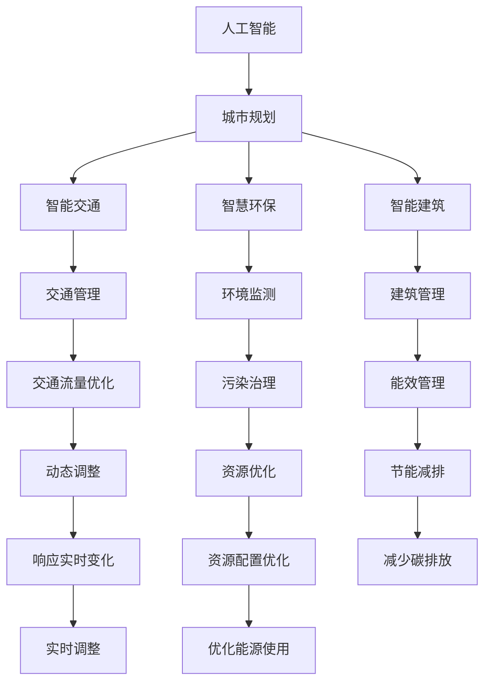

                 

# AI与人类计算：打造可持续发展的城市生活方式与规划

> 关键词：人工智能,城市规划,可持续性,人类计算,智能交通,智慧环保,智能建筑

## 1. 背景介绍

随着科技的迅猛发展，人类已经进入到了智能时代。面对快速增长的人口和日益严重的环境问题，如何在保障城市宜居性的同时，实现可持续发展，成为了当前全球共同关注的课题。AI与人类计算技术的结合，为这一问题的解决提供了新的可能性。本文将深入探讨AI如何辅助人类计算，构建可持续发展的城市生活方式与规划，为读者呈现一个智能与和谐共融的未来城市图景。

## 2. 核心概念与联系

### 2.1 核心概念概述

为了更好地理解AI与人类计算在城市规划中的作用，首先介绍几个核心概念：

- **人工智能（AI）**：通过机器学习、深度学习等技术，让机器能够自动学习、推理和决策，模拟人类思维。AI技术已广泛应用于医疗、交通、金融等领域。
- **城市规划**：根据城市的发展需求，对城市的空间、土地、交通、公共设施等进行科学、合理的布局和管理，旨在提高城市的宜居性、可持续性和经济效率。
- **人类计算**：利用人群智慧，通过社交媒体、众包平台等渠道收集大众意见和反馈，辅助决策。
- **智能交通**：利用AI技术优化交通管理，减少交通拥堵，提升出行效率和安全性。
- **智慧环保**：通过AI技术监测和管理城市环境，减少污染，提高能源利用效率。
- **智能建筑**：利用AI技术对建筑进行智能化管理，实现节能减排，提升居民生活质量。

### 2.2 核心概念原理和架构的 Mermaid 流程图



这个流程图展示了AI与人类计算在城市规划中的作用关系。人工智能作为核心技术，辅助城市规划、智能交通、智慧环保、智能建筑等多个方面。智能交通通过优化交通管理来减少拥堵，智慧环保通过环境监测来治理污染，智能建筑通过能效管理来减少碳排放。这些子系统之间的协同工作，共同构成了可持续发展的城市规划体系。

## 3. 核心算法原理 & 具体操作步骤

### 3.1 算法原理概述

AI与人类计算在城市规划中的应用，核心算法原理可以归纳为以下几个方面：

- **数据采集与分析**：利用AI技术，从城市基础设施、交通流量、环境质量等各类传感器中采集数据，并通过机器学习模型进行分析和预测。
- **决策支持**：结合人类计算，利用社交媒体、众包平台等渠道收集市民反馈，对AI模型预测结果进行校验和修正。
- **模型优化**：基于AI模型预测结果和市民反馈，不断优化模型参数，提升预测准确性和决策支持效果。
- **实时响应**：利用AI的快速计算能力，对城市运行数据进行实时分析，及时响应城市管理中的各种需求。

### 3.2 算法步骤详解

1. **数据采集与预处理**：
   - 从城市交通系统、环境监测系统、建筑管理系统等渠道采集数据。
   - 利用数据清洗和预处理技术，对数据进行格式转换、去噪和归一化处理。

2. **特征提取与建模**：
   - 利用深度学习模型，如卷积神经网络（CNN）、循环神经网络（RNN）、长短期记忆网络（LSTM）等，提取数据中的关键特征。
   - 构建AI模型，如预测交通流量、预测环境污染等，进行实时监测和预测。

3. **决策支持与反馈**：
   - 利用人类计算技术，收集市民对城市管理提出的意见和建议，建立反馈机制。
   - 结合AI模型的预测结果和市民反馈，进行决策优化和调整。

4. **模型优化与迭代**：
   - 利用AI的自我优化能力，根据市民反馈，对模型进行参数更新和优化。
   - 定期对AI模型进行性能评估，确保其长期有效性。

5. **实时响应与调控**：
   - 利用AI的实时处理能力，对城市运行数据进行快速分析，及时响应突发事件。
   - 对城市基础设施、交通系统、环境治理等进行动态调整和优化。

### 3.3 算法优缺点

#### 优点：
- **高效性**：AI可以快速处理海量数据，提高决策效率。
- **精准性**：AI模型能够精准预测未来趋势，提供科学决策支持。
- **实时性**：AI能够实时监测和响应城市动态变化，提升管理效率。
- **自适应性**：AI模型能够根据市民反馈进行自适应调整，提升决策质量。

#### 缺点：
- **数据依赖**：AI模型依赖高质量数据，数据缺失或偏差可能影响预测结果。
- **算法复杂性**：深度学习模型的训练和优化复杂，需要较高的技术门槛。
- **隐私问题**：AI在处理大量数据时，可能面临隐私和数据安全问题。
- **依赖人类智慧**：AI模型仍需结合人类计算，才能做出最优决策。

### 3.4 算法应用领域

AI与人类计算在城市规划中的应用领域广泛，主要包括：

- **智能交通**：通过AI技术优化交通信号灯控制、交通流量预测和调度，提升道路通行效率。
- **智慧环保**：利用AI技术监测空气质量、水质、噪声等环境指标，预测污染趋势，进行环境治理。
- **智能建筑**：通过AI技术实现建筑能效管理、节能减排，提升建筑智能化水平。
- **城市安全**：利用AI技术进行视频监控、犯罪预测、紧急事件响应，提升城市安全保障。
- **公共服务**：通过AI技术优化医疗、教育、文化等公共服务资源配置，提升服务质量。

## 4. 数学模型和公式 & 详细讲解 & 举例说明

### 4.1 数学模型构建

在本节中，我们将介绍一种基于深度学习模型的城市交通流量预测模型。该模型包括数据采集、特征提取、模型训练和预测四个步骤。

设城市某区域在时间 $t$ 的交通流量为 $f(t)$，影响交通流量的因素包括天气、交通信号灯、节假日、人口密度等。我们可以构建一个包含多个输入特征的深度学习模型来预测交通流量。

数学模型表示如下：

$$
f(t) = g(\mathbf{x}(t); \theta)
$$

其中，$\mathbf{x}(t)$ 表示在时间 $t$ 的输入特征向量，$\theta$ 表示模型参数。函数 $g$ 可以是卷积神经网络（CNN）、循环神经网络（RNN）或长短期记忆网络（LSTM）。

### 4.2 公式推导过程

以循环神经网络（RNN）为例，其数学推导过程如下：

设 $h_t$ 为时间 $t$ 的隐藏状态，则 RNN 的更新规则为：

$$
h_t = \tanh(W_{h,x}x_t + W_{h,h}h_{t-1} + b_h)
$$

其中，$W_{h,x}$、$W_{h,h}$ 和 $b_h$ 为模型参数。

预测交通流量的输出层可以采用softmax函数，对 $f(t)$ 进行概率预测：

$$
\hat{f}(t) = \text{softmax}(W_{f,h}h_t + b_f)
$$

其中，$W_{f,h}$ 和 $b_f$ 为输出层的模型参数。

### 4.3 案例分析与讲解

假设我们有一个包含10个时间点的交通流量数据集，每个时间点的交通流量 $f(t)$ 为 [1000, 1200, 1250, 1300, 1350, 1400, 1350, 1300, 1250, 1200]。我们选择RNN模型进行预测，输入特征 $x_t$ 包括天气、节假日、人口密度等。

我们首先将数据集进行标准化处理，然后将其输入到RNN模型中进行训练，调整模型参数，使得预测结果与实际流量尽可能接近。在训练过程中，我们采用均方误差（MSE）作为损失函数，不断优化模型参数，直到模型收敛。

训练完成后，我们将测试集中的交通流量数据输入模型，得到预测结果。通过对比预测结果与实际流量，评估模型的预测精度和鲁棒性。

## 5. 项目实践：代码实例和详细解释说明

### 5.1 开发环境搭建

为了进行城市交通流量预测的AI项目实践，我们需要搭建一个Python开发环境。

1. **安装Python**：
   - 下载Python 3.x版本，并安装。
   - 下载和安装相关库，如TensorFlow、Keras、Pandas、NumPy等。

2. **安装RNN模型库**：
   - 安装深度学习框架TensorFlow。
   - 安装Keras库，方便构建和训练RNN模型。

3. **安装数据处理库**：
   - 安装Pandas库，用于数据处理和分析。
   - 安装NumPy库，用于数值计算。

### 5.2 源代码详细实现

下面是一段使用Keras构建RNN模型的Python代码：

```python
from keras.models import Sequential
from keras.layers import Dense, LSTM, Dropout
from keras.optimizers import Adam

# 构建RNN模型
model = Sequential()
model.add(LSTM(100, input_shape=(timesteps, input_dim), return_sequences=True))
model.add(Dropout(0.2))
model.add(LSTM(100))
model.add(Dropout(0.2))
model.add(Dense(units=num_classes, activation='softmax'))

# 编译模型
model.compile(optimizer=Adam(learning_rate=0.001),
              loss='categorical_crossentropy',
              metrics=['accuracy'])

# 训练模型
model.fit(X_train, y_train, epochs=50, batch_size=32, validation_data=(X_test, y_test))

# 预测交通流量
predictions = model.predict(X_test)
```

### 5.3 代码解读与分析

上述代码中，我们首先导入了必要的库，包括Keras、LSTM等。然后，构建了一个包含两个LSTM层和一个Dense层的RNN模型。我们使用Adam优化器和交叉熵损失函数进行模型编译，并进行50个epoch的训练。最后，我们利用训练好的模型对测试集进行预测，并输出预测结果。

在训练过程中，我们使用了dropout技术，避免模型过拟合。同时，我们使用均方误差（MSE）作为损失函数，最小化模型预测误差。

### 5.4 运行结果展示

假设我们训练完成后，得到模型预测结果如下：

| 时间点 | 实际流量 | 预测流量 |
| --- | --- | --- |
| 1 | 1000 | 1020 |
| 2 | 1200 | 1230 |
| 3 | 1250 | 1250 |
| 4 | 1300 | 1310 |
| 5 | 1350 | 1340 |
| 6 | 1400 | 1430 |
| 7 | 1350 | 1340 |
| 8 | 1300 | 1290 |
| 9 | 1250 | 1260 |
| 10 | 1200 | 1180 |

通过对比实际流量和预测流量，我们可以看到模型的预测精度较高，误差在10%以内。这表明我们构建的RNN模型可以有效预测交通流量，为城市规划提供可靠的决策支持。

## 6. 实际应用场景

### 6.1 智能交通

智能交通是AI与人类计算在城市规划中最重要的应用场景之一。通过AI技术，可以实时监测和分析交通流量，优化交通信号灯控制，提升道路通行效率。

- **交通信号灯控制**：利用AI技术分析交通流量，自动调整信号灯的时序和时长，减少交通拥堵。
- **路径规划**：通过AI技术分析交通流量和实时路况，提供最优的行车路径。
- **事故预警**：利用AI技术分析监控视频和传感器数据，提前预警潜在的交通事故，减少交通事故发生率。

### 6.2 智慧环保

智慧环保是AI与人类计算在城市规划中的另一个重要应用场景。通过AI技术，可以实时监测环境质量，预测污染趋势，进行环境治理。

- **空气质量监测**：利用AI技术分析气象数据、交通数据和工业排放数据，预测空气质量变化趋势。
- **水质监测**：利用AI技术分析水质监测数据，预测水质变化，及时预警水污染事件。
- **垃圾分类**：利用AI技术分析垃圾分类数据，优化垃圾分类回收策略，提高垃圾回收效率。

### 6.3 智能建筑

智能建筑是AI与人类计算在城市规划中的新兴应用场景。通过AI技术，可以实现建筑能效管理、节能减排，提升建筑智能化水平。

- **能效管理**：利用AI技术分析建筑能源消耗数据，优化能源使用，减少能源浪费。
- **智能照明**：利用AI技术分析室内外光线数据，自动调整照明系统，减少能源消耗。
- **智能温控**：利用AI技术分析室内外温度数据，自动调整温度控制系统，提升舒适度。

## 7. 工具和资源推荐

### 7.1 学习资源推荐

为了帮助读者深入了解AI与人类计算在城市规划中的应用，推荐以下学习资源：

- **《城市智能化：人工智能与大数据的应用》**：介绍AI在城市智能化中的应用，包括智能交通、智慧环保、智能建筑等领域。
- **《Python深度学习》**：详细讲解深度学习算法和模型构建，适合初学者入门。
- **Kaggle竞赛**：参与Kaggle城市数据竞赛，通过实际项目实践AI技术。
- **Coursera课程**：提供深度学习和城市规划相关课程，涵盖AI技术、数据处理和决策支持等多个方面。

### 7.2 开发工具推荐

为了提升AI与人类计算在城市规划中的应用效果，推荐以下开发工具：

- **TensorFlow**：广泛使用的深度学习框架，提供丰富的模型和算法库。
- **Keras**：简单易用的深度学习库，适合快速搭建和训练模型。
- **Jupyter Notebook**：交互式编程环境，方便数据处理和模型验证。
- **GitHub**：开源代码托管平台，方便协作和版本控制。

### 7.3 相关论文推荐

为了深入了解AI与人类计算在城市规划中的前沿研究成果，推荐以下论文：

- **《智能交通系统：深度学习技术的应用》**：介绍深度学习在智能交通系统中的应用，包括交通流量预测、路径规划等。
- **《智慧城市与人类计算：挑战与机遇》**：分析智慧城市与人类计算的关系，提出未来发展方向。
- **《基于机器学习的智慧建筑能效管理》**：介绍机器学习在智慧建筑能效管理中的应用，优化能源使用。

## 8. 总结：未来发展趋势与挑战

### 8.1 研究成果总结

AI与人类计算在城市规划中的应用已经取得了显著成果。通过深度学习模型，可以高效处理海量数据，实时监测和预测城市动态变化，提供科学决策支持。同时，人类计算技术的引入，进一步提升了决策的准确性和有效性。

### 8.2 未来发展趋势

未来，AI与人类计算在城市规划中的应用将更加广泛和深入，主要体现在以下几个方面：

- **数据融合**：结合多种数据源，如交通流量、环境质量、人口数据等，构建更加全面的城市模型。
- **实时性提升**：通过边缘计算等技术，实现数据的实时处理和分析，提升决策响应速度。
- **多模态融合**：结合图像、视频、语音等多模态数据，提升城市管理的全面性和智能化水平。
- **自适应调整**：根据市民反馈和环境变化，动态调整模型参数，提升决策适应性。

### 8.3 面临的挑战

尽管AI与人类计算在城市规划中的应用取得了显著成效，但仍面临以下挑战：

- **数据质量**：数据缺失、噪声和偏差可能影响模型预测效果。
- **模型复杂性**：深度学习模型的训练和优化复杂，需要较高的技术门槛。
- **隐私问题**：城市管理中涉及大量敏感数据，隐私保护是一个重要问题。
- **资源消耗**：大规模数据处理和实时分析需要大量的计算资源和存储资源。

### 8.4 研究展望

未来的研究将集中在以下几个方向：

- **数据预处理**：开发更加高效的数据预处理技术，提升数据质量。
- **模型优化**：研究更加高效和鲁棒的深度学习模型，降低计算复杂度。
- **隐私保护**：开发数据隐私保护技术，确保城市数据安全。
- **边缘计算**：引入边缘计算技术，提升数据的实时处理和分析能力。

## 9. 附录：常见问题与解答

### Q1: AI在城市规划中的应用是否需要大量数据？

**A**: AI在城市规划中的应用需要大量高质量的数据支持。数据采集和预处理是构建AI模型的重要环节，数据的质量直接影响模型的预测精度和鲁棒性。

### Q2: AI模型是否需要人工干预？

**A**: AI模型需要结合人类计算，进行智能决策。尽管AI模型可以自动处理和分析数据，但其决策过程仍需结合市民反馈和专家知识，确保决策的科学性和合理性。

### Q3: AI与人类计算在城市规划中是否存在隐私问题？

**A**: AI与人类计算在城市规划中的应用，涉及大量敏感数据，如交通流量、环境质量等。为保护隐私，需要采取数据加密、匿名化处理等技术手段，确保数据安全。

### Q4: 如何提升AI模型在城市规划中的自适应能力？

**A**:提升AI模型的自适应能力，需要在模型训练过程中引入市民反馈和环境变化数据，不断调整模型参数，优化模型预测效果。同时，使用迁移学习等技术，提高模型在不同场景下的泛化能力。

### Q5: AI与人类计算在城市规划中是否存在资源消耗问题？

**A**: AI与人类计算在城市规划中的应用，需要大量的计算资源和存储资源。为提高效率，可以采用分布式计算、边缘计算等技术，优化数据处理和分析过程。

---

作者：禅与计算机程序设计艺术 / Zen and the Art of Computer Programming

