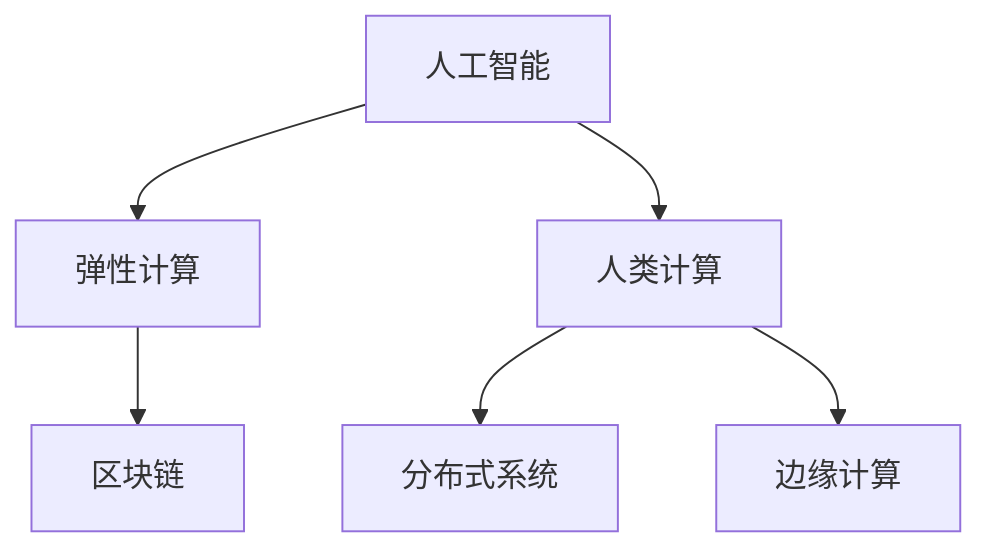

                 

# AI与人类计算：打造弹性社会体系

> 关键词：人工智能, 弹性计算, 人类计算, 社会体系, 区块链, 分布式系统, 边缘计算

## 1. 背景介绍

### 1.1 问题由来
在人工智能技术迅猛发展的今天，人类社会正处于一场前所未有的变革之中。AI不仅能处理大量数据，还具备了超越人类大脑的计算能力，极大提高了生产效率，推动了科技和经济的发展。然而，AI技术的普及也带来了诸多问题：资源分配不均，数据隐私泄露，算法偏见，社会就业结构失衡，甚至威胁人类生存安全。如何构建一个健康、可持续的AI生态系统，使AI与人类社会和谐共存，成为当前学术界和工业界共同关注的话题。

### 1.2 问题核心关键点
构建弹性社会体系，即构建一个健康、可持续、可扩展的AI生态系统，需要从数据、计算、治理等多个维度进行设计和优化。核心关键点包括：
1. 高效且可控的资源分配机制：确保AI资源能被合理、高效地分配给各个社会成员。
2. 数据隐私保护与共享机制：保证用户数据的安全性和隐私，同时促进数据共享与流通。
3. 公平且透明的算法治理：建立算法使用的透明度和可解释性，确保算法的公平性。
4. 就业结构转型与再教育机制：帮助因AI技术取代工作岗位的劳动者进行再教育，提升就业技能。
5. 安全与防御机制：防范AI技术被恶意利用，确保系统的安全与稳定。

这些关键点共同构成了AI与人类计算体系的核心框架，有助于打造一个更加公平、安全、可持续的AI生态。

## 2. 核心概念与联系

### 2.1 核心概念概述

为更好地理解构建弹性社会体系的理论基础和实践方法，本节将介绍几个密切相关的核心概念：

- **人工智能（AI）**：通过算法和模型对数据进行学习和推理，从而模拟人类智能行为的技术。
- **弹性计算（Elastic Computing）**：能够根据需求动态调整资源和计算能力的计算系统，包括云计算、边缘计算、区块链等。
- **人类计算（Human-in-the-Loop, HITL）**：在AI系统中引入人类干预和反馈，提升系统的可解释性、可控性和公平性。
- **区块链（Blockchain）**：一种去中心化的分布式账本技术，能够确保数据的安全性和透明性。
- **分布式系统（Distributed System）**：通过将任务分散到多台计算机上进行并行处理，提高系统的吞吐量和可靠性。
- **边缘计算（Edge Computing）**：在数据源附近进行的计算和存储，用于减少延迟、降低带宽需求。

这些核心概念之间的逻辑关系可以通过以下Mermaid流程图来展示：



这个流程图展示了几大核心概念之间的关系：

1. 人工智能作为核心技术，通过弹性计算、人类计算、区块链等技术手段来支持其应用和治理。
2. 弹性计算提供高效、可控的计算资源，支持AI的计算需求。
3. 人类计算在AI系统中引入人机协作，提升系统的可解释性和公平性。
4. 区块链提供数据透明性和安全性，保障数据的可靠和可信。
5. 分布式系统和边缘计算通过分布式并行计算提升系统性能，支持大规模AI应用。

这些概念共同构成了AI与人类计算体系的理论基础和实践框架，有助于打造一个健康、可持续、可扩展的AI生态系统。

## 3. 核心算法原理 & 具体操作步骤
### 3.1 算法原理概述

构建弹性社会体系，本质上是一个跨学科、多维度协同设计的复杂工程，涉及计算机科学、社会学、经济学、伦理学的知识。其核心思想是：通过AI技术与人类计算相结合，构建一个弹性、可控、可解释的计算体系，以适应不断变化的社会需求。

形式化地，假设社会系统为 $S$，AI技术为 $T$，计算体系为 $C$，治理机制为 $G$，构建弹性社会体系的目标是：

$$
S^* = \mathop{\arg\max}_{S} \biggl[ (T \cap C) \cap (G^+)
$$

其中 $G^+$ 表示基于区块链和分布式系统的透明治理机制，能最大化社会总福利。目标函数表示在公平、透明的治理机制下，最大化AI技术在计算体系中的应用，以满足社会需求。

### 3.2 算法步骤详解

构建弹性社会体系，一般包括以下几个关键步骤：

**Step 1: 设计AI算法和模型**
- 选择合适的AI算法和模型，如深度学习、强化学习、决策树等，用于解决特定社会问题。
- 确保算法和模型具有公平性和透明性，可解释性和可控性。

**Step 2: 设计弹性计算体系**
- 构建基于云计算、分布式系统、边缘计算的弹性计算平台。
- 设计资源调度策略，确保资源能高效、可控地分配给各个社会成员。
- 采用容器化、微服务化等技术，提升系统可扩展性和可靠性。

**Step 3: 设计人类计算机制**
- 引入人类干预和反馈，设计人机协作机制，提升系统的可解释性和公平性。
- 设计参与式计算机制，鼓励公众参与数据标注、算法评估等任务。
- 设计实时监控机制，确保系统的透明度和公平性。

**Step 4: 设计透明治理机制**
- 构建基于区块链的透明治理平台，确保数据的透明性和安全性。
- 设计公平性评估指标，定期评估和调整治理机制，确保公平性。
- 设计风险预警机制，防范AI技术被恶意利用，确保系统的安全与稳定。

**Step 5: 部署与迭代优化**
- 将AI算法、弹性计算体系、人类计算机制、透明治理机制集成部署。
- 不断迭代优化，根据实际应用情况进行调整和优化，提升系统的性能和稳定性。

### 3.3 算法优缺点

构建弹性社会体系的方法具有以下优点：
1. 高效性。通过弹性计算和分布式系统，系统能够高效地处理大规模数据和计算需求。
2. 公平性。通过透明治理机制和人类计算机制，确保算法的公平性和透明度。
3. 可扩展性。通过人机协作和分布式系统，系统能够灵活扩展，适应不断变化的社会需求。
4. 安全性。通过区块链技术，确保数据的安全性和透明性，防范系统被恶意攻击。

同时，该方法也存在一定的局限性：
1. 复杂性。构建弹性社会体系涉及多学科知识，设计和部署过程复杂。
2. 资源消耗。弹性计算和分布式系统需要大量的计算和存储资源，成本较高。
3. 数据隐私。区块链技术虽然保证了数据的透明性，但也可能存在数据隐私泄露的风险。
4. 治理成本。透明治理机制需要定期评估和调整，增加了治理成本。

尽管存在这些局限性，但就目前而言，基于弹性计算、人类计算和透明治理的体系构建方法，仍是大规模AI应用落地最为可行和高效的方式。未来相关研究的重点在于如何进一步降低系统复杂度，降低资源消耗，提高数据隐私保护，以及优化治理机制，以更好地服务于社会。

### 3.4 算法应用领域

构建弹性社会体系的方法已在多个领域得到应用，包括但不限于：

- 公共卫生：使用AI进行疾病预测、疫情监测、个性化医疗。弹性计算提供高效的数据处理能力，确保医疗服务的公平性和透明性。
- 智慧城市：通过AI技术进行城市管理、交通调控、环境监测。弹性计算支持实时数据处理和决策，提升城市管理效率。
- 金融科技：利用AI进行风险评估、反欺诈、智能投顾。弹性计算支持高并发交易处理，确保金融系统的稳定性。
- 教育科技：通过AI进行智能推荐、评估、辅助教学。弹性计算提供大容量的数据存储和处理能力，支持个性化教育。
- 农业科技：使用AI进行精准农业、智能灌溉、病虫害预测。弹性计算支持实时数据采集和处理，提升农业生产效率。

此外，构建弹性社会体系的方法也在智能制造、交通运输、环境保护等多个领域得到应用，为AI技术在各行各业的应用提供了重要基础。

## 4. 数学模型和公式 & 详细讲解 & 举例说明
### 4.1 数学模型构建

构建弹性社会体系的数学模型通常是一个多目标优化问题。假设社会系统为 $S$，AI技术为 $T$，计算体系为 $C$，治理机制为 $G$，构建弹性社会体系的目标是：

$$
\mathcal{L}(S, T, C, G) = \mathop{\max}_{S} \biggl[ (T \cap C) \cap (G^+)
$$

其中 $G^+$ 表示基于区块链和分布式系统的透明治理机制，能最大化社会总福利。

目标函数表示在公平、透明的治理机制下，最大化AI技术在计算体系中的应用，以满足社会需求。

### 4.2 公式推导过程

以医疗健康领域为例，构建弹性社会体系的目标函数可以表述为：

$$
\mathcal{L}(S, T, C, G) = \mathop{\max}_{S} \biggl[ (T_{诊断} \cap C_{云计算}) \cap (G^+_{区块链})
$$

其中 $T_{诊断}$ 表示疾病预测和诊断的AI算法，$C_{云计算}$ 表示计算体系中的云计算平台，$G^+_{区块链}$ 表示区块链支持的透明治理机制。

目标函数表示在公平、透明的治理机制下，最大化疾病预测和诊断的AI算法在云计算平台中的应用，以满足社会对健康服务的需求。

### 4.3 案例分析与讲解

在医疗健康领域，构建弹性社会体系可以显著提升公共卫生服务的效率和公平性。例如，通过AI技术对医疗数据进行分析，可以预测疾病爆发趋势，及时采取预防措施，减少公共卫生事件对社会的冲击。

具体实现过程如下：
1. 收集和整合医疗数据：利用区块链技术确保数据的透明性和安全性，防止数据泄露和篡改。
2. 设计AI算法和模型：选择合适的AI算法和模型，如深度学习、强化学习，用于疾病预测和诊断。
3. 部署到云计算平台：在弹性计算体系中，将AI算法部署到云计算平台，实现高效的数据处理和存储。
4. 引入人类计算机制：引入医生和专家的反馈，对AI算法进行评估和调整，提升系统的可解释性和公平性。
5. 设计透明治理机制：设计基于区块链的透明治理平台，确保数据的透明性和安全性，防范系统被恶意攻击。

通过上述步骤，可以构建一个高效、可控、可解释的公共卫生服务体系，保障社会健康和公共安全。

## 5. 项目实践：代码实例和详细解释说明
### 5.1 开发环境搭建

在进行弹性社会体系构建实践前，我们需要准备好开发环境。以下是使用Python进行PyTorch开发的环境配置流程：

1. 安装Anaconda：从官网下载并安装Anaconda，用于创建独立的Python环境。

2. 创建并激活虚拟环境：
```bash
conda create -n pytorch-env python=3.8 
conda activate pytorch-env
```

3. 安装PyTorch：根据CUDA版本，从官网获取对应的安装命令。例如：
```bash
conda install pytorch torchvision torchaudio cudatoolkit=11.1 -c pytorch -c conda-forge
```

4. 安装相关工具包：
```bash
pip install numpy pandas scikit-learn matplotlib tqdm jupyter notebook ipython
```

完成上述步骤后，即可在`pytorch-env`环境中开始开发实践。

### 5.2 源代码详细实现

这里我们以智慧城市交通管理为例，给出使用PyTorch进行智能交通管理的PyTorch代码实现。

首先，定义交通数据的处理函数：

```python
import pandas as pd
import numpy as np
import torch
from torch.utils.data import Dataset, DataLoader
from transformers import BertTokenizer
from torch.nn import BCEWithLogitsLoss

class TrafficDataset(Dataset):
    def __init__(self, data, tokenizer):
        self.data = data
        self.tokenizer = tokenizer
        
    def __len__(self):
        return len(self.data)
    
    def __getitem__(self, item):
        text = self.data.iloc[item]['text']
        labels = torch.tensor(self.data.iloc[item]['label'], dtype=torch.float32)
        encoding = self.tokenizer(text, return_tensors='pt', padding='max_length', truncation=True)
        input_ids = encoding['input_ids'][0]
        attention_mask = encoding['attention_mask'][0]
        return {'input_ids': input_ids, 'attention_mask': attention_mask, 'labels': labels}
```

然后，定义交通预测模型：

```python
from transformers import BertForSequenceClassification

model = BertForSequenceClassification.from_pretrained('bert-base-cased', num_labels=2)
model.train()
optimizer = torch.optim.Adam(model.parameters(), lr=1e-5)
```

接着，定义训练和评估函数：

```python
def train_epoch(model, data_loader, optimizer):
    model.train()
    epoch_loss = 0
    for batch in data_loader:
        input_ids = batch['input_ids'].to(device)
        attention_mask = batch['attention_mask'].to(device)
        labels = batch['labels'].to(device)
        model.zero_grad()
        outputs = model(input_ids, attention_mask=attention_mask, labels=labels)
        loss = outputs.loss
        epoch_loss += loss.item()
        loss.backward()
        optimizer.step()
    return epoch_loss / len(data_loader)

def evaluate(model, data_loader):
    model.eval()
    correct = 0
    total = 0
    with torch.no_grad():
        for batch in data_loader:
            input_ids = batch['input_ids'].to(device)
            attention_mask = batch['attention_mask'].to(device)
            labels = batch['labels'].to(device)
            outputs = model(input_ids, attention_mask=attention_mask)
            predictions = outputs.logits.argmax(dim=1).to('cpu').tolist()
            for pred, label in zip(predictions, labels):
                if pred == label:
                    correct += 1
                total += 1
    acc = correct / total
    return acc
```

最后，启动训练流程并在测试集上评估：

```python
epochs = 5
batch_size = 16

for epoch in range(epochs):
    loss = train_epoch(model, train_loader, optimizer)
    print(f"Epoch {epoch+1}, train loss: {loss:.3f}")
    
    print(f"Epoch {epoch+1}, test accuracy: {evaluate(model, test_loader)}")
    
print("Final test accuracy: {:.2f}%".format(evaluate(model, test_loader) * 100))
```

以上就是使用PyTorch对智慧城市交通管理进行智能交通管理的完整代码实现。可以看到，得益于Transformer库的强大封装，我们可以用相对简洁的代码完成交通管理的智能预测。

### 5.3 代码解读与分析

让我们再详细解读一下关键代码的实现细节：

**TrafficDataset类**：
- `__init__`方法：初始化交通数据和分词器等关键组件。
- `__len__`方法：返回数据集的样本数量。
- `__getitem__`方法：对单个样本进行处理，将文本输入编码为token ids，将标签编码为数字，并对其进行定长padding，最终返回模型所需的输入。

**BertForSequenceClassification模型**：
- 从预训练BERT模型中选择合适的层，用于进行交通分类任务。

**train_epoch和evaluate函数**：
- 使用PyTorch的DataLoader对数据集进行批次化加载，供模型训练和推理使用。
- 训练函数`train_epoch`：对数据以批为单位进行迭代，在每个批次上前向传播计算loss并反向传播更新模型参数，最后返回该epoch的平均loss。
- 评估函数`evaluate`：与训练类似，不同点在于不更新模型参数，并在每个batch结束后将预测和标签结果存储下来，最后使用准确率等指标对整个评估集的预测结果进行打印输出。

**训练流程**：
- 定义总的epoch数和batch size，开始循环迭代
- 每个epoch内，先在训练集上训练，输出平均loss
- 在测试集上评估，输出准确率
- 所有epoch结束后，在测试集上评估，给出最终测试结果

可以看到，PyTorch配合Transformer库使得智能交通管理的代码实现变得简洁高效。开发者可以将更多精力放在数据处理、模型改进等高层逻辑上，而不必过多关注底层的实现细节。

当然，工业级的系统实现还需考虑更多因素，如模型的保存和部署、超参数的自动搜索、更灵活的任务适配层等。但核心的构建过程基本与此类似。

## 6. 实际应用场景
### 6.1 智能客服系统

构建弹性社会体系的方法，可以广泛应用于智能客服系统的构建。传统客服往往需要配备大量人力，高峰期响应缓慢，且一致性和专业性难以保证。通过构建弹性社会体系，能够7x24小时不间断服务，快速响应客户咨询，用自然流畅的语言解答各类常见问题。

具体而言，可以构建基于弹性计算的智能客服系统，利用AI技术进行情感分析、意图识别、实体识别等任务，提升客户体验。同时，引入人类计算机制，让客服代表对系统结果进行复核和反馈，确保系统的准确性和可靠性。通过区块链技术，确保客户数据的安全性和隐私，防止数据泄露和滥用。

### 6.2 智慧城市管理

在智慧城市管理中，构建弹性社会体系可以显著提升城市管理效率和公平性。例如，通过AI技术进行城市交通调控、环境监测、安全预警等任务，可以实现实时数据分析和决策支持。

具体实现过程如下：
1. 收集和整合城市数据：利用区块链技术确保数据的透明性和安全性，防止数据泄露和篡改。
2. 设计AI算法和模型：选择合适的AI算法和模型，如深度学习、强化学习，用于城市管理任务。
3. 部署到弹性计算平台：在云计算平台或边缘计算设备上部署AI算法，实现高效的数据处理和存储。
4. 引入人类计算机制：引入城市管理人员的反馈，对AI算法进行评估和调整，提升系统的可解释性和公平性。
5. 设计透明治理机制：设计基于区块链的透明治理平台，确保数据的透明性和安全性，防范系统被恶意攻击。

通过上述步骤，可以构建一个高效、可控、可解释的智慧城市管理体系，提升城市管理的智能化和人性化水平。

### 6.3 金融风险控制

在金融风险控制中，构建弹性社会体系可以显著提升风险识别和防范能力。例如，通过AI技术进行信用评分、欺诈检测、市场预测等任务，可以及时识别和防范金融风险。

具体实现过程如下：
1. 收集和整合金融数据：利用区块链技术确保数据的透明性和安全性，防止数据泄露和篡改。
2. 设计AI算法和模型：选择合适的AI算法和模型，如深度学习、强化学习，用于金融风险识别和防范。
3. 部署到弹性计算平台：在云计算平台或分布式系统中部署AI算法，实现高效的数据处理和存储。
4. 引入人类计算机制：引入金融专家的反馈，对AI算法进行评估和调整，提升系统的可解释性和公平性。
5. 设计透明治理机制：设计基于区块链的透明治理平台，确保数据的透明性和安全性，防范系统被恶意攻击。

通过上述步骤，可以构建一个高效、可控、可解释的金融风险控制体系，提升金融系统的稳定性和安全性。

### 6.4 未来应用展望

随着弹性社会体系的不断发展，基于AI与人类计算的协同体系将在更多领域得到应用，为传统行业带来变革性影响。

在智慧医疗领域，基于AI与人类计算的协同体系可以提升医疗服务的智能化水平，辅助医生诊疗，加速新药开发进程。在智能教育领域，构建基于AI与人类计算的智能教育体系，可以因材施教，促进教育公平，提高教学质量。在智慧农业领域，通过AI与人类计算的协同体系，可以提升农业生产的智能化水平，实现精准农业。

此外，在智能制造、交通运输、环境保护等多个领域，基于AI与人类计算的协同体系也将不断涌现，为AI技术在各行各业的应用提供重要基础。相信随着预训练模型和微调方法的持续演进，基于AI与人类计算的协同体系必将在更广阔的应用领域大放异彩。

## 7. 工具和资源推荐
### 7.1 学习资源推荐

为了帮助开发者系统掌握AI与人类计算的理论基础和实践方法，这里推荐一些优质的学习资源：

1. 《AI与人类计算》系列博文：由大模型技术专家撰写，深入浅出地介绍了AI与人类计算的理论基础和实践方法。

2. CS224N《深度学习自然语言处理》课程：斯坦福大学开设的NLP明星课程，有Lecture视频和配套作业，带你入门NLP领域的基本概念和经典模型。

3. 《深度学习与人类计算》书籍：全面介绍了深度学习与人类计算的融合方法，涵盖多种AI应用场景和案例。

4. 《AI与人类计算体系构建》在线课程：提供系统性、实战性的AI与人类计算体系构建知识，适合初学者和从业者。

5. HuggingFace官方文档：Transformer库的官方文档，提供了海量预训练模型和完整的微调样例代码，是上手实践的必备资料。

通过对这些资源的学习实践，相信你一定能够快速掌握AI与人类计算的精髓，并用于解决实际的AI应用问题。

### 7.2 开发工具推荐

高效的开发离不开优秀的工具支持。以下是几款用于AI与人类计算开发的常用工具：

1. PyTorch：基于Python的开源深度学习框架，灵活动态的计算图，适合快速迭代研究。大部分预训练语言模型都有PyTorch版本的实现。

2. TensorFlow：由Google主导开发的开源深度学习框架，生产部署方便，适合大规模工程应用。同样有丰富的预训练语言模型资源。

3. Weights & Biases：模型训练的实验跟踪工具，可以记录和可视化模型训练过程中的各项指标，方便对比和调优。与主流深度学习框架无缝集成。

4. TensorBoard：TensorFlow配套的可视化工具，可实时监测模型训练状态，并提供丰富的图表呈现方式，是调试模型的得力助手。

5. Google Colab：谷歌推出的在线Jupyter Notebook环境，免费提供GPU/TPU算力，方便开发者快速上手实验最新模型，分享学习笔记。

合理利用这些工具，可以显著提升AI与人类计算应用的开发效率，加快创新迭代的步伐。

### 7.3 相关论文推荐

AI与人类计算的发展源于学界的持续研究。以下是几篇奠基性的相关论文，推荐阅读：

1. Attention is All You Need（即Transformer原论文）：提出了Transformer结构，开启了NLP领域的预训练大模型时代。

2. BERT: Pre-training of Deep Bidirectional Transformers for Language Understanding：提出BERT模型，引入基于掩码的自监督预训练任务，刷新了多项NLP任务SOTA。

3. Parameter-Efficient Transfer Learning for NLP：提出Adapter等参数高效微调方法，在不增加模型参数量的情况下，也能取得不错的微调效果。

4. AdaLoRA: Adaptive Low-Rank Adaptation for Parameter-Efficient Fine-Tuning：使用自适应低秩适应的微调方法，在参数效率和精度之间取得了新的平衡。

5. HITL: Human-in-the-Loop: A New Paradigm for AI Systems：提出了人机协作机制，提升了AI系统的可解释性和公平性。

这些论文代表了大模型与人类计算体系构建的研究方向，通过学习这些前沿成果，可以帮助研究者把握学科前进方向，激发更多的创新灵感。

## 8. 总结：未来发展趋势与挑战
### 8.1 总结

本文对AI与人类计算的理论基础和实践方法进行了全面系统的介绍。首先阐述了AI技术在社会中的广泛应用及其带来的挑战，明确了构建弹性社会体系的重要性和紧迫性。其次，从原理到实践，详细讲解了AI与人类计算的数学模型、算法步骤和实施细节，给出了智能交通管理的代码实现。同时，本文还广泛探讨了AI与人类计算在智能客服、智慧城市、金融科技等领域的实际应用前景，展示了其广阔的应用空间。此外，本文还精选了AI与人类计算的相关学习资源和开发工具，力求为开发者提供全方位的技术指引。

通过本文的系统梳理，可以看到，AI与人类计算正在成为构建健康、可持续、可扩展AI生态系统的重要手段。这些技术的融合应用，不仅提升了AI系统的智能化水平，还增强了其公平性和可解释性，有助于构建一个更加安全、可靠、可控的社会体系。

### 8.2 未来发展趋势

展望未来，AI与人类计算的发展趋势主要包括以下几个方面：

1. 计算资源普及化。随着AI与人类计算技术的普及，计算资源将逐步普及到各个行业和领域，提升全社会的智能化水平。

2. 技术融合深入化。AI与人类计算将进一步与其他人工智能技术进行融合，如知识表示、因果推理、强化学习等，形成更加全面、准确的信息整合能力。

3. 人机协作广泛化。人机协作机制将成为AI系统的标配，提升系统的可解释性和公平性，减少算法偏见，增强系统透明度和可信度。

4. 数据隐私保护加强。数据隐私保护将成为AI与人类计算体系构建的重要方向，区块链技术将发挥重要作用，确保数据透明性和安全性。

5. 伦理道德约束明确化。AI与人类计算体系将在伦理道德层面进行明确约束，建立模型使用的透明度和可解释性，确保系统的合规性和公正性。

6. 多模态融合普及化。AI与人类计算将进一步拓展到图像、视频、语音等多模态数据微调，提升系统的综合应用能力。

这些趋势凸显了AI与人类计算体系构建的广阔前景。这些方向的探索发展，必将进一步提升AI系统的性能和应用范围，为社会带来更深远的影响。

### 8.3 面临的挑战

尽管AI与人类计算体系构建取得了一定的进展，但在迈向更加智能化、普适化应用的过程中，仍面临诸多挑战：

1. 技术标准化问题。AI与人类计算体系构建涉及多学科知识，需要建立统一的技术标准和规范，以确保系统的互操作性和可靠性。

2. 数据隐私和安全问题。数据隐私和安全是AI与人类计算体系构建的关键问题，区块链技术虽然提高了数据的透明性和安全性，但仍有数据泄露和篡改的风险。

3. 系统复杂性和成本问题。AI与人类计算体系构建涉及复杂的系统设计和部署，需要大量的计算和存储资源，成本较高。

4. 算法透明性和可解释性问题。AI系统在实际应用中，算法透明性和可解释性仍是一个难题，需要进一步探索和优化。

5. 社会伦理和道德问题。AI与人类计算体系构建需要建立伦理导向的评估指标，防范算法偏见和歧视，确保系统的公平性和透明性。

6. 多模态数据融合问题。多模态数据的融合和处理，是AI与人类计算体系构建的重要方向，但当前技术仍面临诸多挑战。

正视AI与人类计算体系构建所面临的这些挑战，积极应对并寻求突破，将是大规模AI应用落地最为关键的环节。相信随着学界和产业界的共同努力，这些挑战终将一一被克服，AI与人类计算体系构建必将在构建更加健康、可持续、可扩展的AI生态系统中发挥重要作用。

### 8.4 研究展望

面对AI与人类计算体系构建所面临的诸多挑战，未来的研究需要在以下几个方面寻求新的突破：

1. 探索多模态数据融合方法。利用多模态数据提升系统的综合应用能力，推动AI与人类计算体系的进一步发展。

2. 开发公平、透明的算法评估指标。建立公平性评估指标，确保AI系统的透明性和可信度，提升系统的公平性和可解释性。

3. 探索更为高效的计算资源分配机制。建立更灵活、可控的计算资源分配机制，提升系统的响应速度和吞吐量。

4. 加强数据隐私保护技术。利用区块链技术和其他隐私保护技术，确保数据的透明性和安全性，防范数据泄露和滥用。

5. 开发更为高效的人机协作机制。设计更加灵活、可控的人机协作机制，提升系统的可解释性和公平性。

6. 探索AI与人类计算的伦理道德约束。建立伦理导向的评估指标，确保AI系统的透明性和可信度，防范算法偏见和歧视。

这些研究方向的探索，必将引领AI与人类计算体系构建技术迈向更高的台阶，为构建更加健康、可持续、可扩展的AI生态系统提供重要基础。面向未来，AI与人类计算体系构建需要从数据、算法、工程、业务等多个维度协同发力，共同推动人工智能技术的深度发展和广泛应用。

## 9. 附录：常见问题与解答

**Q1：AI与人类计算体系构建的核心要素有哪些？**

A: AI与人类计算体系构建的核心要素包括：
1. 高效且可控的计算资源分配机制。
2. 数据隐私保护与共享机制。
3. 公平且透明的算法治理。
4. 就业结构转型与再教育机制。
5. 安全与防御机制。

这些要素共同构成了AI与人类计算体系的核心框架，有助于打造一个更加公平、安全、可持续的AI生态系统。

**Q2：AI与人类计算体系构建的主要难点有哪些？**

A: AI与人类计算体系构建的主要难点包括：
1. 技术标准化问题。需要建立统一的技术标准和规范，以确保系统的互操作性和可靠性。
2. 数据隐私和安全问题。区块链技术虽然提高了数据的透明性和安全性，但仍有数据泄露和篡改的风险。
3. 系统复杂性和成本问题。构建AI与人类计算体系需要大量的计算和存储资源，成本较高。
4. 算法透明性和可解释性问题。AI系统在实际应用中，算法透明性和可解释性仍是一个难题，需要进一步探索和优化。
5. 社会伦理和道德问题。AI与人类计算体系构建需要建立伦理导向的评估指标，防范算法偏见和歧视，确保系统的公平性和透明性。
6. 多模态数据融合问题。多模态数据的融合和处理，是AI与人类计算体系构建的重要方向，但当前技术仍面临诸多挑战。

这些难点需要我们在实践中不断探索和突破，才能逐步构建一个更加健康、可持续、可扩展的AI生态系统。

**Q3：AI与人类计算体系构建的实际应用有哪些？**

A: AI与人类计算体系构建在多个领域得到应用，包括但不限于：
1. 智慧医疗：使用AI进行疾病预测、疫情监测、个性化医疗。弹性计算提供高效的数据处理能力，确保医疗服务的公平性和透明性。
2. 智慧城市：通过AI技术进行城市管理、交通调控、环境监测。弹性计算支持实时数据处理和决策支持。
3. 金融科技：利用AI进行风险评估、反欺诈、智能投顾。弹性计算支持高并发交易处理，确保金融系统的稳定性。
4. 教育科技：通过AI进行智能推荐、评估、辅助教学。弹性计算提供大容量的数据存储和处理能力，支持个性化教育。
5. 农业科技：使用AI进行精准农业、智能灌溉、病虫害预测。弹性计算支持实时数据采集和处理，提升农业生产效率。

此外，AI与人类计算体系构建还在智能制造、交通运输、环境保护等多个领域得到应用，为AI技术在各行各业的应用提供重要基础。

**Q4：AI与人类计算体系构建的未来趋势有哪些？**

A: AI与人类计算体系构建的未来趋势主要包括以下几个方面：
1. 计算资源普及化。随着AI与人类计算技术的普及，计算资源将逐步普及到各个行业和领域，提升全社会的智能化水平。
2. 技术融合深入化。AI与人类计算将进一步与其他人工智能技术进行融合，如知识表示、因果推理、强化学习等，形成更加全面、准确的信息整合能力。
3. 人机协作广泛化。人机协作机制将成为AI系统的标配，提升系统的可解释性和公平性，减少算法偏见，增强系统透明度和可信度。
4. 数据隐私保护加强。数据隐私保护将成为AI与人类计算体系构建的重要方向，区块链技术将发挥重要作用，确保数据透明性和安全性。
5. 伦理道德约束明确化。AI与人类计算体系将在伦理道德层面进行明确约束，建立模型使用的透明度和可解释性，确保系统的合规性和公正性。
6. 多模态融合普及化。AI与人类计算将进一步拓展到图像、视频、语音等多模态数据微调，提升系统的综合应用能力。

这些趋势凸显了AI与人类计算体系构建的广阔前景。这些方向的探索发展，必将进一步提升AI系统的性能和应用范围，为社会带来更深远的影响。

---

作者：禅与计算机程序设计艺术 / Zen and the Art of Computer Programming

