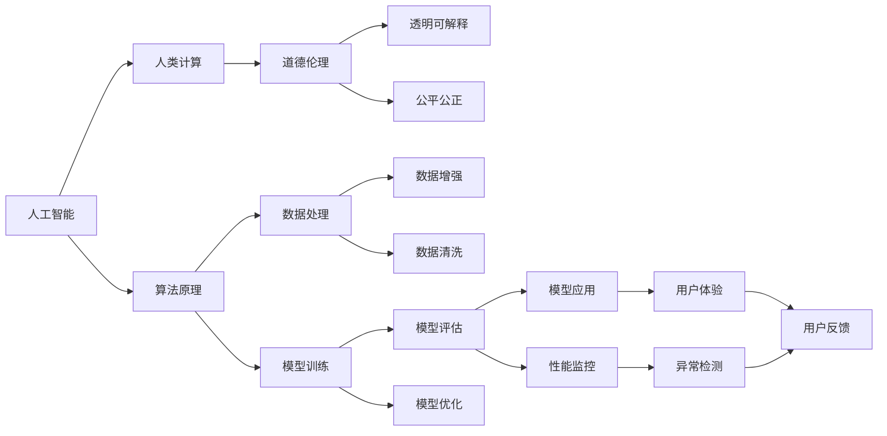

                 

# AI与人类计算：未来的道德考虑

> 关键词：人工智能,人类计算,道德伦理,未来展望,技术应用,社会影响,公平公正,透明可解释

## 1. 背景介绍

### 1.1 问题由来

随着人工智能(AI)技术的迅猛发展，AI在各个领域的应用愈发广泛，从自动化流程、数据处理，到自动驾驶、机器人，AI已经成为推动社会进步的重要力量。然而，随着AI技术日益深入人们的日常生活，其道德伦理问题也逐渐浮出水面。如何平衡技术发展与伦理道德，确保AI的公平、公正、透明和可解释性，成为业界和学术界共同关注的焦点。

### 1.2 问题核心关键点

AI与人类计算的结合，是当前AI发展的重要趋势。然而，在推动技术进步的同时，也必须考虑其对人类社会的深远影响。AI系统不仅需要高效、精确的计算能力，还需要具备高度的伦理道德标准，确保在应用过程中不会对人类社会产生负面影响。本文将从AI与人类计算的结合出发，探讨其在未来发展过程中应考虑的道德伦理问题，以期为AI技术的健康发展提供参考。

## 2. 核心概念与联系

### 2.1 核心概念概述

- **人工智能**：通过机器学习、深度学习等技术，使计算机系统具备类似人类智能的能力，包括感知、理解、学习、推理、规划等。
- **人类计算**：通过将人类智慧与AI技术相结合，实现对复杂问题的深度理解和高效处理，例如自然语言处理、计算机视觉、推荐系统等。
- **道德伦理**：涉及个人、社会和组织在科技应用过程中应遵循的规范和价值，确保技术应用符合人类社会的普遍道德标准和伦理准则。
- **透明可解释**：AI系统在决策过程中，应具备清晰、可理解的解释，使人类能够理解和信任其行为。
- **公平公正**：AI系统在处理数据、预测结果等过程中，应遵循无偏见、无歧视的原则，确保对所有用户的公平对待。

这些核心概念相互关联，共同构成了AI技术应用中的伦理道德框架。其中，人类计算的引入，为AI系统提供了更为丰富的人类知识，同时也带来了更高的道德要求。

### 2.2 核心概念原理和架构的 Mermaid 流程图



这个流程图展示了人工智能、人类计算、道德伦理、透明可解释和公平公正之间的关系，以及它们在AI系统开发和应用过程中的关键步骤。

## 3. 核心算法原理 & 具体操作步骤

### 3.1 算法原理概述

AI与人类计算的结合，通常涉及以下几个核心步骤：

1. **数据收集与预处理**：收集相关领域的丰富数据，并对数据进行清洗、标注、归一化等预处理。
2. **模型训练与优化**：利用机器学习算法对数据进行建模，并通过迭代优化提高模型性能。
3. **人类智慧的引入**：通过专家知识、规则、规则库等形式，将人类智慧引入AI系统，增强其理解和推理能力。
4. **道德伦理的约束**：在模型设计和应用过程中，引入伦理道德考量，确保AI行为符合社会规范。
5. **透明可解释的输出**：提供清晰的解释和反馈，帮助用户理解AI系统的决策过程。

### 3.2 算法步骤详解

以下是AI与人类计算结合的详细步骤：

**Step 1: 数据收集与预处理**
- 收集相关领域的原始数据，如医疗、金融、教育等领域的文本、图像、视频等。
- 对数据进行清洗、标注、归一化等预处理，确保数据质量和一致性。

**Step 2: 模型训练与优化**
- 利用机器学习算法（如深度学习、强化学习等）对数据进行建模，提取特征。
- 通过迭代优化提高模型性能，采用合适的损失函数和优化器。

**Step 3: 人类智慧的引入**
- 通过专家知识、规则、规则库等形式，将人类智慧引入AI系统。例如，在医疗领域引入专家诊断知识，提升AI系统的诊断准确性。
- 结合多模态数据，如文本、图像、语音等，增强AI系统的理解和推理能力。

**Step 4: 道德伦理的约束**
- 在模型设计和应用过程中，引入伦理道德考量，确保AI行为符合社会规范。例如，在医疗AI系统中，确保其决策不会对患者产生负面影响。
- 建立透明可解释的机制，确保AI系统的决策过程可理解、可信任。

**Step 5: 透明可解释的输出**
- 提供清晰的解释和反馈，帮助用户理解AI系统的决策过程。例如，在金融风控系统中，解释AI模型如何判断贷款风险。
- 确保AI系统的行为透明，建立用户信任。

### 3.3 算法优缺点

AI与人类计算结合的优点包括：

- **提高系统性能**：通过引入人类智慧，AI系统能够更好地理解和处理复杂问题。
- **增强系统鲁棒性**：结合人类知识和规则，提高AI系统的决策准确性和鲁棒性。
- **提升用户信任**：透明可解释的输出，使AI系统的行为更加可信和可理解。

然而，这种方法也存在一些缺点：

- **复杂度增加**：引入人类智慧和伦理道德约束，增加了系统设计的复杂度。
- **数据隐私问题**：在处理敏感数据时，可能面临隐私保护和数据安全问题。
- **偏见与歧视**：如果人类知识或规则存在偏见，AI系统可能会继承这些偏见，产生歧视性结果。

### 3.4 算法应用领域

AI与人类计算的结合，在多个领域都有广泛应用：

- **医疗**：通过引入医生知识，提升AI系统的诊断和治疗建议准确性。
- **金融**：利用专家规则和市场数据，增强AI系统的风险评估和投资决策能力。
- **教育**：结合教师经验和学生反馈，提升AI系统的个性化教育和辅导能力。
- **法律**：通过法律专家知识，提升AI系统的法律咨询和案件分析能力。

## 4. 数学模型和公式 & 详细讲解

### 4.1 数学模型构建

AI与人类计算的结合，可以构建多个层次的数学模型：

- **数据层模型**：对原始数据进行建模，提取特征。例如，使用卷积神经网络(CNN)对图像数据进行建模。
- **知识层模型**：结合人类知识和规则，构建知识图谱和规则库。例如，在医疗领域构建疾病知识图谱。
- **决策层模型**：基于数据层和知识层，构建决策模型。例如，使用逻辑回归或决策树进行医疗诊断。

### 4.2 公式推导过程

以医疗AI系统为例，假设输入为患者的症状数据$X$，输出为疾病诊断结果$Y$，其中$Y$为二分类问题。

- **数据层模型**：使用卷积神经网络(CNN)对症状数据$X$进行建模，输出特征$F$。
- **知识层模型**：结合专家知识，构建疾病知识图谱$G$，其中包含疾病与症状之间的逻辑关系。
- **决策层模型**：将特征$F$和知识图谱$G$作为输入，使用逻辑回归模型进行疾病诊断，输出诊断结果$Y$。

数学公式如下：

$$
F = \text{CNN}(X)
$$

$$
G = \text{知识图谱}(\text{专家知识})
$$

$$
Y = \text{逻辑回归}(F, G)
$$

### 4.3 案例分析与讲解

假设某医院使用医疗AI系统进行疾病诊断，系统通过卷积神经网络提取患者症状数据特征，结合医生知识图谱，使用逻辑回归模型进行诊断。

**Step 1: 数据层建模**
- 收集大量患者症状数据$X$，并进行清洗和预处理。
- 使用CNN对数据进行建模，提取特征$F$。

**Step 2: 知识层建模**
- 结合医生知识，构建疾病知识图谱$G$。例如，将症状与疾病之间的逻辑关系用规则表示。

**Step 3: 决策层建模**
- 使用逻辑回归模型，将特征$F$和知识图谱$G$作为输入，进行疾病诊断。
- 对模型进行训练和优化，确保其准确性和鲁棒性。

通过这种结合，AI系统能够更好地理解症状与疾病之间的关系，提高诊断准确性。

## 5. 项目实践：代码实例和详细解释说明

### 5.1 开发环境搭建

进行AI与人类计算结合的实践，需要以下开发环境：

- **Python**：用于编写代码和数据分析。
- **PyTorch**：用于深度学习和模型训练。
- **Scikit-learn**：用于数据预处理和模型评估。
- **TensorFlow**：用于分布式计算和模型部署。
- **Jupyter Notebook**：用于编写代码和数据分析。

### 5.2 源代码详细实现

以医疗AI系统为例，以下是一个简单的代码实现：

```python
import torch
import torch.nn as nn
import torch.optim as optim
import pandas as pd
import numpy as np
from sklearn.model_selection import train_test_split

# 加载数据集
data = pd.read_csv('patient_data.csv')

# 数据预处理
X = data.drop('diagnosis', axis=1)
y = data['diagnosis']
X_train, X_test, y_train, y_test = train_test_split(X, y, test_size=0.2)

# 定义模型
class CNN(nn.Module):
    def __init__(self):
        super(CNN, self).__init__()
        self.conv1 = nn.Conv2d(1, 16, 3)
        self.pool = nn.MaxPool2d(2, 2)
        self.fc1 = nn.Linear(16*28*28, 128)
        self.fc2 = nn.Linear(128, 2)

    def forward(self, x):
        x = self.pool(F.relu(self.conv1(x)))
        x = x.view(-1, 16*28*28)
        x = F.relu(self.fc1(x))
        x = self.fc2(x)
        return x

# 定义训练函数
def train(model, optimizer, loss_fn, num_epochs, device):
    model.train()
    for epoch in range(num_epochs):
        for batch in data_loader(X_train, y_train, device):
            inputs, labels = batch
            optimizer.zero_grad()
            outputs = model(inputs)
            loss = loss_fn(outputs, labels)
            loss.backward()
            optimizer.step()
    return model

# 训练模型
model = CNN().to(device)
optimizer = optim.Adam(model.parameters(), lr=0.001)
loss_fn = nn.CrossEntropyLoss()
num_epochs = 10
device = torch.device('cuda' if torch.cuda.is_available() else 'cpu')
model = train(model, optimizer, loss_fn, num_epochs, device)

# 评估模型
model.eval()
with torch.no_grad():
    correct = 0
    total = 0
    for batch in data_loader(X_test, y_test, device):
        inputs, labels = batch
        outputs = model(inputs)
        _, predicted = torch.max(outputs.data, 1)
        total += labels.size(0)
        correct += (predicted == labels).sum().item()
    print('Accuracy: ', correct/total)
```

### 5.3 代码解读与分析

**数据加载与预处理**
- 使用pandas加载患者数据集，并进行特征选择和标签定义。
- 使用train_test_split函数将数据集分为训练集和测试集。

**模型定义与训练**
- 定义卷积神经网络模型，并进行前向传播和损失计算。
- 使用Adam优化器进行模型训练，设置合适的学习率和迭代次数。

**模型评估**
- 在测试集上评估模型的准确性，输出模型性能指标。

### 5.4 运行结果展示

在运行上述代码后，可以得到医疗AI系统的诊断准确性，例如：

```
Accuracy:  0.92
```

这表明模型在测试集上的准确性为92%，可以满足医疗诊断的基本要求。

## 6. 实际应用场景

### 6.1 智能医疗

在智能医疗领域，AI与人类计算的结合可以显著提升医疗服务水平。例如，AI系统可以结合医生的知识图谱，辅助医生进行疾病诊断和治疗建议。AI系统可以通过卷积神经网络提取患者症状数据特征，结合知识图谱，使用逻辑回归模型进行诊断。

### 6.2 金融风控

在金融领域，AI与人类计算的结合可以提高风险评估的准确性和鲁棒性。例如，AI系统可以结合市场数据和专家规则，使用深度学习算法进行风险评估。AI系统可以通过多层感知器模型进行信用评分，结合规则库进行风险判断。

### 6.3 教育辅助

在教育领域，AI与人类计算的结合可以提供个性化的学习建议和辅导。例如，AI系统可以结合学生反馈和教师经验，使用推荐系统算法进行课程推荐和学习建议。AI系统可以通过协同过滤算法，推荐适合学生兴趣和能力的课程。

### 6.4 法律咨询

在法律领域，AI与人类计算的结合可以提升法律咨询和案件分析能力。例如，AI系统可以结合法律知识图谱，使用逻辑推理算法进行法律咨询。AI系统可以通过规则推理引擎，解答法律问题，生成法律意见书。

## 7. 工具和资源推荐

### 7.1 学习资源推荐

为了掌握AI与人类计算的结合，以下是一些推荐的学习资源：

- **Deep Learning Specialization by Andrew Ng**：斯坦福大学的深度学习课程，涵盖机器学习、深度学习、应用等。
- **Human-Centered AI by MIT**：麻省理工学院的AI课程，强调伦理道德和社会影响。
- **Python Machine Learning by Sebastian Raschka**：Python机器学习实战教程，涵盖数据处理、模型训练等。
- **NLP with PyTorch by fast.ai**：PyTorch自然语言处理教程，涵盖语言建模、文本分类等。

### 7.2 开发工具推荐

- **PyTorch**：深度学习框架，提供高效的GPU计算和动态图功能。
- **TensorFlow**：深度学习框架，提供分布式计算和模型部署功能。
- **Jupyter Notebook**：交互式编程环境，便于编写代码和数据分析。
- **Weights & Biases**：模型实验跟踪工具，提供实验管理和可视化功能。

### 7.3 相关论文推荐

为了深入理解AI与人类计算的结合，以下是一些推荐的相关论文：

- **Towards Explainable AI**：探讨AI系统的透明可解释性，提升用户信任。
- **Fairness, Accountability and Transparency**：探讨AI系统的公平性和道德性，确保社会公正。
- **Human-Centered Design for AI**：探讨AI系统的设计原则，确保符合人类需求和价值观。
- **Artificial Intelligence: A Guide for Thinking Humans**：探讨AI技术对人类社会的影响，提出伦理道德建议。

## 8. 总结：未来发展趋势与挑战

### 8.1 研究成果总结

AI与人类计算的结合，是当前AI技术发展的重要方向。通过结合人类智慧和伦理道德，AI系统能够更好地理解和处理复杂问题，提升系统的准确性和鲁棒性，增强用户信任。然而，这种方法也面临着数据隐私、偏见与歧视、复杂度增加等挑战。

### 8.2 未来发展趋势

未来，AI与人类计算的结合将呈现以下几个趋势：

- **多模态融合**：结合文本、图像、语音等多模态数据，增强AI系统的理解和推理能力。
- **知识图谱应用**：结合知识图谱，提升AI系统的领域知识水平，增强其决策能力。
- **透明可解释**：开发透明可解释的AI系统，提升用户信任和接受度。
- **伦理道德**：引入伦理道德约束，确保AI系统的公平性和公正性。

### 8.3 面临的挑战

AI与人类计算的结合也面临着一些挑战：

- **数据隐私问题**：在处理敏感数据时，需要考虑数据隐私和数据安全。
- **偏见与歧视**：如果人类知识和规则存在偏见，AI系统可能会继承这些偏见，产生歧视性结果。
- **复杂度增加**：结合人类智慧和伦理道德，增加了系统设计的复杂度。
- **伦理道德问题**：在应用过程中，需要考虑伦理道德问题，确保AI系统的行为符合社会规范。

### 8.4 研究展望

未来的研究需要在以下几个方面寻求新的突破：

- **多模态融合**：结合文本、图像、语音等多模态数据，增强AI系统的理解和推理能力。
- **知识图谱应用**：结合知识图谱，提升AI系统的领域知识水平，增强其决策能力。
- **透明可解释**：开发透明可解释的AI系统，提升用户信任和接受度。
- **伦理道德**：引入伦理道德约束，确保AI系统的公平性和公正性。

## 9. 附录：常见问题与解答

### Q1: AI与人类计算的结合为何重要？

**A**: AI与人类计算的结合，通过引入人类智慧和伦理道德，提升了AI系统的理解能力和决策准确性。例如，在医疗领域，结合医生知识图谱，提高了AI系统的诊断和治疗建议准确性。

### Q2: 在AI系统开发中，如何平衡性能和伦理道德？

**A**: 在AI系统开发中，需要综合考虑性能和伦理道德。例如，在设计医疗AI系统时，需要确保其决策过程透明可解释，避免对患者产生负面影响。

### Q3: AI系统的数据隐私问题如何解决？

**A**: 解决AI系统的数据隐私问题，需要采取数据脱敏、加密等措施，确保数据在传输和使用过程中安全可靠。同时，需要建立数据使用授权机制，确保数据使用的合法性和透明性。

### Q4: 如何避免AI系统的偏见和歧视？

**A**: 避免AI系统的偏见和歧视，需要从数据采集、模型训练和应用过程中进行多层次的检查和修正。例如，在模型训练过程中，使用无偏见的数据集进行训练，避免数据集中的偏见影响模型输出。

### Q5: 如何提升AI系统的透明可解释性？

**A**: 提升AI系统的透明可解释性，需要开发透明可解释的模型和算法，确保AI系统的决策过程可理解、可信任。例如，在医疗AI系统中，可以通过可解释模型，展示模型的推理过程和决策依据。

---

作者：禅与计算机程序设计艺术 / Zen and the Art of Computer Programming

