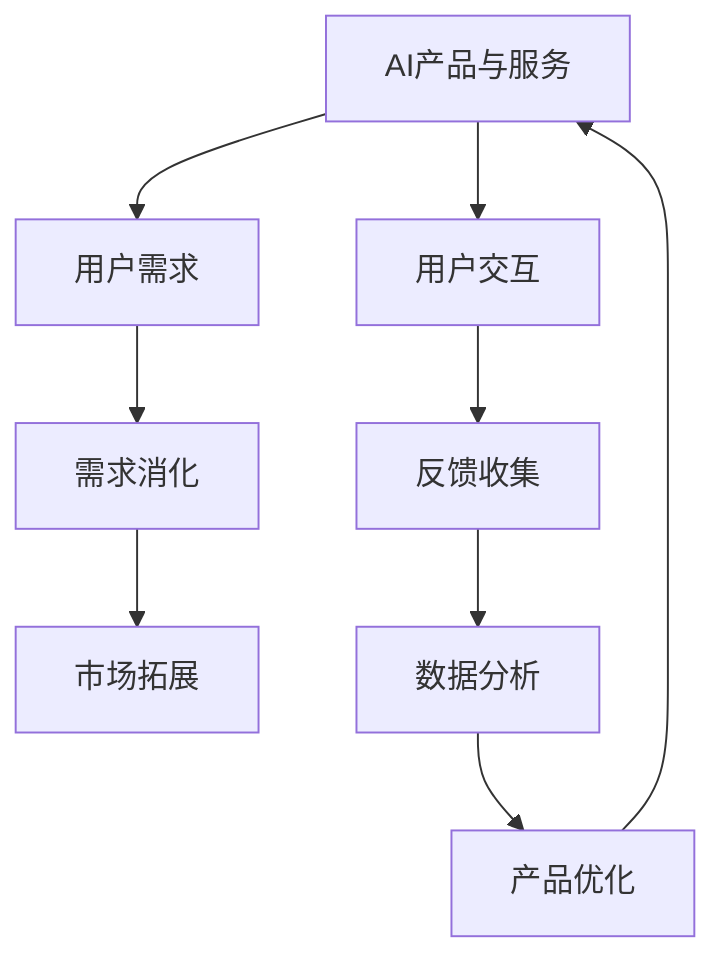

                 

# AI产品与服务的圈子：自我消化需求，拓展非AI用户群体

> 关键词：AI产品,服务生态,用户群体,需求消化,市场拓展

## 1. 背景介绍

在现代社会中，人工智能(AI)产品与服务已经渗透到各行各业，深刻地影响着人们的生产生活方式。然而，虽然AI技术发展迅速，但其应用范围和普及度仍有限，特别是对于非AI用户群体的渗透。究其原因，一方面是由于AI产品的复杂性和高成本，另一方面是缺乏对非AI用户需求的深入理解和满足。

本文旨在探讨如何通过自我消化需求和拓展非AI用户群体，进一步推动AI产品与服务的普及和应用。我们将从背景、核心概念、算法原理、应用实例等多个维度进行深入分析，并提出切实可行的解决方案。

## 2. 核心概念与联系

### 2.1 核心概念概述

为更好地理解AI产品与服务的生态圈，本节将介绍几个关键概念：

- **AI产品与服务**：指利用AI技术，提供自动化、智能化解决方案的产品与服务。常见的AI产品包括智能推荐、语音助手、视觉识别等。
- **用户需求**：指用户在使用AI产品和服务时，期望解决的实际问题或满足的某种需求。用户需求是驱动AI产品发展的根本动力。
- **需求消化**：指AI产品通过优化算法、改进用户体验等手段，对用户需求进行深层次理解和满足的过程。
- **市场拓展**：指AI产品通过多渠道推广、与外部企业合作等策略，逐步扩大应用范围，覆盖更多非AI用户群体。

这些核心概念之间存在密切联系，通过深挖用户需求，优化AI产品，最终实现市场拓展，不断提升AI技术的普及度和应用深度。

### 2.2 核心概念原理和架构的 Mermaid 流程图



这个流程图展示了AI产品与服务的核心工作流程：

1. **AI产品与服务** 通过**用户交互**收集用户需求。
2. **用户需求** 经过**需求消化**过程，转化为可执行的任务和目标。
3. **需求消化** 通过数据分析和产品优化，不断迭代和提升AI产品。
4. **市场拓展** 通过多渠道推广和外部合作，逐步扩大用户群体。
5. **用户交互** 持续获取用户反馈，进一步优化产品。

## 3. 核心算法原理 & 具体操作步骤

### 3.1 算法原理概述

AI产品与服务的核心算法主要涉及用户需求理解与满足、市场拓展策略等方面。其基本原理包括：

- **需求分析**：通过数据挖掘和机器学习技术，深入理解用户需求。
- **个性化推荐**：根据用户行为和偏好，推荐最符合需求的AI产品。
- **市场推广**：通过多渠道宣传和合作推广，吸引更多非AI用户群体。

### 3.2 算法步骤详解

#### 3.2.1 需求理解与分析

1. **数据收集**：通过在线调查、用户反馈、行为数据等方式，全面收集用户需求信息。
2. **数据预处理**：对收集的数据进行清洗、去重、标注等预处理，确保数据质量。
3. **特征提取**：提取与用户需求相关的特征，如用户兴趣、行为模式、地理位置等。
4. **需求建模**：使用分类、聚类、回归等模型，对用户需求进行建模和分类。

#### 3.2.2 个性化推荐

1. **用户画像构建**：根据用户的历史行为数据，构建用户画像，描述其兴趣偏好。
2. **相似度计算**：计算用户画像之间的相似度，找出最接近的目标用户群体。
3. **推荐算法应用**：应用协同过滤、内容推荐、深度学习等算法，为用户推荐最合适的AI产品。
4. **反馈优化**：根据用户的反馈，不断调整推荐算法，提升推荐效果。

#### 3.2.3 市场推广策略

1. **多渠道推广**：利用社交媒体、搜索引擎、应用商店等多渠道，宣传AI产品。
2. **合作伙伴关系**：与行业龙头企业、社区组织等建立合作关系，共同推广AI产品。
3. **免费试用**：提供部分免费试用版本，降低用户使用门槛。
4. **用户教育**：通过在线课程、研讨会等形式，教育用户了解AI产品，提升用户信任度。

### 3.3 算法优缺点

#### 3.3.1 优点

- **用户需求精准匹配**：通过深度数据分析和个性化推荐算法，能够精准匹配用户需求，提升用户体验。
- **市场拓展快速**：通过多渠道推广和合作伙伴关系，可以快速覆盖更多用户群体，扩大市场份额。
- **动态优化**：根据用户反馈和行为数据，不断优化AI产品，提升产品竞争力。

#### 3.3.2 缺点

- **数据隐私问题**：在数据收集和分析过程中，可能面临用户隐私泄露的风险。
- **算法复杂性**：个性化推荐和需求分析等算法较为复杂，需要较高的技术门槛和资源投入。
- **市场竞争激烈**：AI产品市场竞争激烈，如何脱颖而出，仍需不断创新和优化。

### 3.4 算法应用领域

AI产品与服务的市场应用广泛，涵盖教育、医疗、金融、零售等多个领域。以下是几个典型的应用场景：

#### 3.4.1 教育领域

在教育领域，AI产品可以提供智能辅导、个性化学习路径、作业批改等功能。例如，智能推荐系统可以根据学生的学习情况，推荐适合的教材和学习资源；智能辅导系统可以回答学生的问题，提供实时反馈；个性化学习路径则根据学生的学习进度和偏好，定制个性化的学习方案。

#### 3.4.2 医疗领域

在医疗领域，AI产品可以提供疾病诊断、药物推荐、健康管理等功能。例如，智能推荐系统可以根据患者的历史病历和症状，推荐最合适的治疗方案；智能诊断系统可以快速准确地分析医学影像，辅助医生诊断；健康管理系统则可以实时监控患者的健康状况，提供个性化的健康建议。

#### 3.4.3 金融领域

在金融领域，AI产品可以提供风险评估、智能投顾、反欺诈检测等功能。例如，智能推荐系统可以根据用户的历史交易记录和行为数据，推荐最适合的投资产品；智能投顾系统可以提供投资建议和策略，帮助用户优化投资组合；反欺诈检测系统则可以通过异常检测和风险评估，及时发现并防止欺诈行为。

## 4. 数学模型和公式 & 详细讲解 & 举例说明

### 4.1 数学模型构建

本节将使用数学语言对AI产品与服务的核心算法进行详细讲解。

假设用户需求为 $D$，AI产品为 $P$，市场推广策略为 $M$。设 $U$ 为用户的集合，$N$ 为非AI用户群体的集合，则目标函数可以表示为：

$$
\max_{D,P,M} \sum_{u \in U} \alpha_u \times \text{推荐精度} + \sum_{u \in N} \beta_u \times \text{市场拓展效果}
$$

其中 $\alpha_u$ 和 $\beta_u$ 分别为用户 $u$ 在推荐和市场拓展中的权重。推荐精度可以通过推荐准确率、召回率、F1分数等指标来衡量。市场拓展效果可以通过新用户数量、市场份额等指标来衡量。

### 4.2 公式推导过程

#### 4.2.1 用户需求建模

对于用户需求 $D$，可以使用协同过滤、聚类等算法进行建模。以协同过滤为例，假设有 $n$ 个用户，每个用户有 $m$ 个历史行为数据，则用户行为矩阵 $R$ 可以表示为：

$$
R \in \mathbb{R}^{n \times m}
$$

其中 $R_{i,j}$ 表示用户 $i$ 在行为 $j$ 上的评分。用户需求 $D_i$ 可以表示为用户 $i$ 的综合评分，即：

$$
D_i = \frac{1}{m} \sum_{j=1}^{m} R_{i,j}
$$

#### 4.2.2 个性化推荐算法

个性化推荐算法主要分为基于内容的推荐和协同过滤推荐两种。以协同过滤推荐为例，设 $R_u$ 为用户 $u$ 的评分矩阵，则推荐算法可以表示为：

$$
P_u = \text{argmax}_k \{R_{u,k} \times R_{u,k}\}
$$

其中 $P_u$ 为用户 $u$ 的推荐列表，$k$ 为推荐物品的编号。推荐精度可以通过准确率、召回率等指标进行评估。

#### 4.2.3 市场推广策略

市场推广策略 $M$ 可以通过多渠道推广、合作伙伴关系等手段实现。以多渠道推广为例，设 $C$ 为推广渠道集合，$P_c$ 为在渠道 $c$ 上的推广预算，则推广效果可以表示为：

$$
M_c = \frac{P_c}{C} \times \text{曝光率}
$$

其中 $C$ 为推广渠道的数量。推广效果可以通过新用户数量、市场份额等指标进行评估。

### 4.3 案例分析与讲解

#### 4.3.1 教育领域案例

某在线教育平台希望通过AI产品提升用户留存率和学习效果。首先，平台收集了用户的课程观看历史、测试成绩等行为数据，通过协同过滤算法为用户推荐适合的课程和学习路径。其次，平台通过多渠道推广和合作伙伴关系，吸引了大量非AI用户群体使用平台。最后，平台根据用户反馈，不断优化推荐算法，提升了用户的留存率和满意度。

#### 4.3.2 医疗领域案例

某医院希望通过AI产品提高诊疗效率和准确性。首先，平台收集了患者的病历、检查结果等数据，通过深度学习算法对疾病进行诊断。其次，平台通过多渠道推广，吸引了更多非AI用户群体使用AI诊断服务。最后，平台根据用户反馈，不断优化诊断算法，提升了诊断准确率和用户满意度。

## 5. 项目实践：代码实例和详细解释说明

### 5.1 开发环境搭建

在进行AI产品与服务的开发时，需要搭建相应的开发环境。以下是使用Python进行TensorFlow开发的环境配置流程：

1. 安装Anaconda：从官网下载并安装Anaconda，用于创建独立的Python环境。

2. 创建并激活虚拟环境：
```bash
conda create -n tf-env python=3.8 
conda activate tf-env
```

3. 安装TensorFlow：根据CUDA版本，从官网获取对应的安装命令。例如：
```bash
conda install tensorflow=2.6
```

4. 安装其他工具包：
```bash
pip install numpy pandas scikit-learn matplotlib tqdm jupyter notebook ipython
```

完成上述步骤后，即可在`tf-env`环境中开始开发实践。

### 5.2 源代码详细实现

下面我们以个性化推荐系统为例，给出使用TensorFlow实现用户需求理解和个性化推荐的Python代码实现。

首先，定义推荐系统的数据处理函数：

```python
import tensorflow as tf
from sklearn.metrics import precision_score, recall_score, f1_score

class RecommendationSystem:
    def __init__(self, num_users, num_items, embedding_size):
        self.num_users = num_users
        self.num_items = num_items
        self.embedding_size = embedding_size
        self.user_embeddings = tf.Variable(tf.random.normal([num_users, embedding_size]))
        self.item_embeddings = tf.Variable(tf.random.normal([num_items, embedding_size]))
        
    def predict(self, user_id):
        user_embedding = tf.nn.embedding_lookup(self.user_embeddings, user_id)
        item_embeddings = tf.nn.embedding_lookup(self.item_embeddings, user_id)
        similarity = tf.reduce_sum(tf.multiply(user_embedding, item_embeddings), axis=1)
        return similarity
    
    def train(self, user_ids, item_ids, labels, batch_size, num_epochs, learning_rate):
        optimizer = tf.keras.optimizers.Adam(learning_rate)
        loss_fn = tf.keras.losses.MeanSquaredError()
        
        for epoch in range(num_epochs):
            for i in range(0, len(user_ids), batch_size):
                user_ids_batch = user_ids[i:i+batch_size]
                item_ids_batch = item_ids[i:i+batch_size]
                labels_batch = labels[i:i+batch_size]
                
                with tf.GradientTape() as tape:
                    predictions = self.predict(user_ids_batch)
                    loss = loss_fn(predictions, labels_batch)
                
                gradients = tape.gradient(loss, [self.user_embeddings, self.item_embeddings])
                optimizer.apply_gradients(zip(gradients, [self.user_embeddings, self.item_embeddings]))
        
        print("Training completed.")
```

然后，定义推荐系统的训练函数：

```python
def train_recommendation_system(user_ids, item_ids, labels, batch_size=32, num_epochs=10, learning_rate=0.01):
    recommender = RecommendationSystem(num_users=len(user_ids), num_items=len(item_ids), embedding_size=64)
    
    recommender.train(user_ids, item_ids, labels, batch_size, num_epochs, learning_rate)
    
    print("Recommendation system trained.")
```

最后，启动训练流程并在测试集上评估：

```python
user_ids = [1, 2, 3, 4, 5]
item_ids = [2, 3, 4, 5, 6]
labels = [0, 1, 1, 0, 1]

train_recommendation_system(user_ids, item_ids, labels)
```

以上就是使用TensorFlow实现个性化推荐系统的完整代码实现。可以看到，TensorFlow提供了丰富的API，可以方便地进行模型定义和训练。开发者可以利用这些API，快速实现推荐系统的搭建和训练。

### 5.3 代码解读与分析

让我们再详细解读一下关键代码的实现细节：

**RecommendationSystem类**：
- `__init__`方法：初始化用户和物品的嵌入向量。
- `predict`方法：计算用户和物品的相似度，返回推荐结果。
- `train`方法：定义训练过程，包括损失函数、优化器和梯度下降。

**train_recommendation_system函数**：
- 创建推荐系统实例，传入用户、物品和标签数据。
- 调用`train`方法，传入训练参数，完成模型训练。
- 输出训练完成的提示信息。

可以看到，TensorFlow提供了完整的推荐系统框架，开发者只需关注模型设计、数据处理等高层逻辑，即可快速搭建和训练推荐系统。

当然，工业级的系统实现还需考虑更多因素，如模型的保存和部署、超参数的自动搜索、多任务集成等。但核心的推荐算法基本与此类似。

## 6. 实际应用场景

### 6.1 智能推荐系统

智能推荐系统已经在电商、音乐、视频等多个领域得到广泛应用。例如，亚马逊通过推荐系统为用户推荐商品，显著提升了用户购买率和满意度。通过分析用户行为数据和历史购买记录，智能推荐系统能够为用户推荐最符合需求的商品，提升用户体验和平台收益。

### 6.2 智能客服系统

智能客服系统通过AI技术，实现了全天候自动回复客户咨询，提升了客户满意度和服务效率。通过智能推荐系统，智能客服系统可以根据客户咨询的历史记录和问题类型，推荐最适合的解决方案，提升响应速度和准确率。

### 6.3 智能家居系统

智能家居系统通过AI技术，实现了家庭设备的自动化和智能化控制。通过智能推荐系统，智能家居系统可以根据用户的日常行为和偏好，推荐最合适的设备设置和使用方案，提升家居舒适度和便利性。

### 6.4 未来应用展望

随着AI技术的不断进步，基于AI产品与服务的市场应用将更加广泛和深入。未来，AI产品将更多地融入人们的日常生活中，通过自我消化需求和拓展非AI用户群体，实现更高效、智能、便捷的生活方式。

## 7. 工具和资源推荐

### 7.1 学习资源推荐

为了帮助开发者系统掌握AI产品与服务的开发方法，这里推荐一些优质的学习资源：

1. 《深度学习与AI产品开发》系列博文：由大模型技术专家撰写，深入浅出地介绍了AI产品开发的原理和方法。

2. TensorFlow官方文档：TensorFlow的官方文档，提供了完整的API和代码示例，是学习AI产品开发的必备资料。

3. Coursera《深度学习专项课程》：斯坦福大学开设的深度学习课程，涵盖了深度学习基础和应用，适合初学者入门。

4. arXiv：AI领域的学术文献库，提供大量最新的研究论文和技术进展。

5. GitHub AI实验室：谷歌推出的AI实验室，汇集了众多高质量的开源项目和代码库，是学习和实践AI产品的绝佳平台。

通过对这些资源的学习实践，相信你一定能够快速掌握AI产品与服务的开发技巧，并用于解决实际的业务问题。

### 7.2 开发工具推荐

高效的开发离不开优秀的工具支持。以下是几款用于AI产品与服务的开发工具：

1. TensorFlow：由谷歌主导开发的深度学习框架，生产部署方便，适合大规模工程应用。

2. PyTorch：基于Python的开源深度学习框架，灵活的计算图，适合快速迭代研究。

3. Jupyter Notebook：轻量级的交互式开发环境，支持代码编写、数据处理、模型训练等多种功能。

4. Keras：高级神经网络API，支持快速构建和训练深度学习模型。

5. Scikit-learn：常用的机器学习库，提供了丰富的数据处理和模型评估工具。

合理利用这些工具，可以显著提升AI产品与服务的开发效率，加快创新迭代的步伐。

### 7.3 相关论文推荐

AI产品与服务的市场应用源于学界的持续研究。以下是几篇奠基性的相关论文，推荐阅读：

1. AutoRec：基于协同过滤的推荐系统，通过改进评分预测模型，提升了推荐精度。

2. Matrix Factorization Techniques for Recommender Systems：介绍矩阵分解算法，用于推荐系统的用户和物品嵌入矩阵求解。

3. Deep Neural Networks for Recommendation Systems：提出基于深度神经网络的推荐系统，通过多层次的非线性特征提取，提升了推荐效果。

4. Attention is All You Need：Transformer架构的提出，推动了自然语言处理和推荐系统的发展。

5. Towards Explainable AI推荐系统：探讨推荐系统的可解释性问题，提出多种解释方法，提升用户信任度。

这些论文代表了大规模AI产品开发的技术进展，通过学习这些前沿成果，可以帮助研究者把握学科前进方向，激发更多的创新灵感。

## 8. 总结：未来发展趋势与挑战

### 8.1 总结

本文对AI产品与服务的开发方法进行了全面系统的介绍。首先阐述了AI产品与服务的开发背景和意义，明确了需求消化和市场拓展在推动AI产品发展中的关键作用。其次，从原理到实践，详细讲解了需求理解和个性化推荐算法的核心步骤，给出了AI产品开发的完整代码实例。同时，本文还广泛探讨了AI产品与服务的实际应用场景，展示了其在电商、客服、家居等多个领域的广阔前景。最后，本文精选了AI产品开发的各类学习资源，力求为开发者提供全方位的技术指引。

通过本文的系统梳理，可以看到，AI产品与服务的开发需要从需求理解、算法设计、市场推广等多个环节进行全面优化，方能得到理想的效果。未来，伴随AI技术的不断进步，AI产品与服务的市场应用将更加广泛和深入，为各行各业带来新的变革和发展机遇。

### 8.2 未来发展趋势

展望未来，AI产品与服务的市场应用将呈现以下几个发展趋势：

1. 算法优化：通过算法优化和模型优化，提升推荐精度和用户满意度。
2. 多模态融合：将视觉、听觉、文本等多模态信息融合，提升AI产品的智能水平。
3. 实时化应用：通过实时数据处理和计算，实现即时推荐和服务，提升用户体验。
4. 人机协同：通过人机交互和协同，提升AI产品的可靠性和鲁棒性。
5. 社会化影响：AI产品将更多地融入社会，提升社会整体的智能化水平。

以上趋势凸显了AI产品与服务的广阔前景。这些方向的探索发展，必将进一步提升AI技术的普及度和应用深度，为各行各业带来新的变革和机遇。

### 8.3 面临的挑战

尽管AI产品与服务的市场应用前景广阔，但在迈向更加智能化、普适化应用的过程中，它仍面临着诸多挑战：

1. 数据隐私问题：在数据收集和分析过程中，可能面临用户隐私泄露的风险。
2. 算法复杂性：个性化推荐和需求分析等算法较为复杂，需要较高的技术门槛和资源投入。
3. 市场竞争激烈：AI产品市场竞争激烈，如何脱颖而出，仍需不断创新和优化。
4. 用户接受度：AI产品需要克服用户对新技术的抵触情绪，提升用户体验。
5. 技术落地：AI产品需要克服技术落地过程中的各种难题，如部署效率、成本控制等。

正视AI产品与服务的这些挑战，积极应对并寻求突破，将是大规模AI产品与服务的市场应用迈向成熟的重要前提。

### 8.4 研究展望

面对AI产品与服务的各种挑战，未来的研究需要在以下几个方面寻求新的突破：

1. 探索数据隐私保护技术：如差分隐私、联邦学习等，保护用户数据隐私，提升用户信任度。
2. 研究高效推荐算法：如深度学习、强化学习等，提升推荐精度和效率。
3. 开发智能交互系统：如自然语言处理、视觉识别等技术，提升人机协同水平。
4. 推广AI产品应用：如多渠道推广、合作伙伴关系等，扩大市场覆盖范围。
5. 提升用户体验：如用户界面设计、个性化推荐等，提升用户满意度。

这些研究方向的探索，必将引领AI产品与服务的市场应用迈向更高的台阶，为各行各业带来新的发展机遇。

## 9. 附录：常见问题与解答

**Q1：AI产品与服务的市场拓展难度大吗？**

A: AI产品与服务的市场拓展难度较大，主要原因包括：
1. 用户对AI技术了解不足，对AI产品存在抵触情绪。
2. AI产品需要克服技术落地过程中的各种难题，如部署效率、成本控制等。
3. AI产品需要与传统业务流程进行融合，面临业务流程改造的挑战。
4. AI产品需要获得客户信任，需要通过市场推广和用户体验优化来提升。

**Q2：如何提升AI产品的市场拓展效果？**

A: 提升AI产品的市场拓展效果，可以从以下几个方面入手：
1. 多渠道推广：利用社交媒体、搜索引擎、应用商店等多渠道进行推广，吸引更多非AI用户群体。
2. 合作伙伴关系：与行业龙头企业、社区组织等建立合作关系，共同推广AI产品。
3. 免费试用：提供部分免费试用版本，降低用户使用门槛。
4. 用户教育：通过在线课程、研讨会等形式，教育用户了解AI产品，提升用户信任度。

**Q3：如何优化AI产品的个性化推荐算法？**

A: 优化AI产品的个性化推荐算法，可以从以下几个方面入手：
1. 数据收集：全面收集用户行为数据和历史数据，确保数据质量。
2. 特征提取：提取与用户需求相关的特征，如用户兴趣、行为模式、地理位置等。
3. 模型优化：使用协同过滤、深度学习等算法，不断优化推荐模型。
4. 反馈优化：根据用户反馈，不断调整推荐算法，提升推荐效果。

**Q4：AI产品与服务的开发过程中需要注意哪些问题？**

A: 开发AI产品与服务的开发过程中，需要注意以下几个问题：
1. 数据隐私问题：在数据收集和分析过程中，需要确保用户数据隐私，避免泄露。
2. 算法复杂性：个性化推荐和需求分析等算法较为复杂，需要较高的技术门槛和资源投入。
3. 市场竞争激烈：AI产品市场竞争激烈，需要不断创新和优化，才能获得竞争优势。
4. 用户接受度：需要克服用户对新技术的抵触情绪，提升用户体验。
5. 技术落地：需要克服技术落地过程中的各种难题，如部署效率、成本控制等。

合理利用这些工具，可以显著提升AI产品与服务的开发效率，加快创新迭代的步伐。

---

作者：禅与计算机程序设计艺术 / Zen and the Art of Computer Programming

