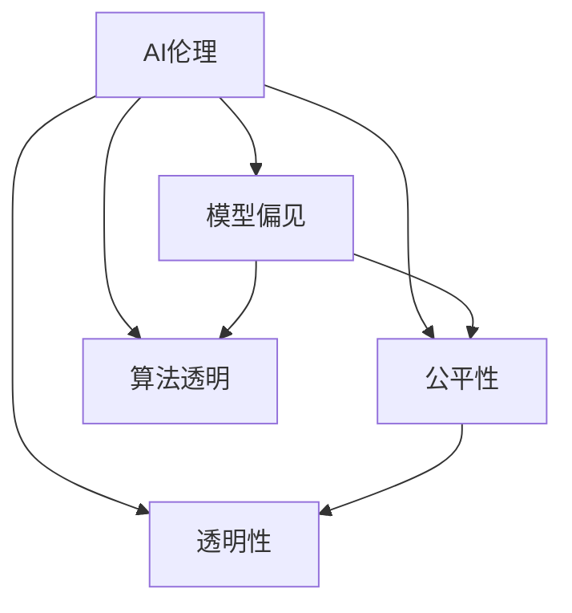

                 

# AI伦理与偏见：构建公平、透明的模型

> 关键词：AI伦理, 模型偏见, 公平性, 透明性, 算法透明, 公平算法

## 1. 背景介绍

在人工智能（AI）技术迅猛发展的今天，其在各个领域的广泛应用极大地提升了效率和便捷性。然而，随之而来的伦理问题也日益凸显，特别是模型偏见和公平性问题，引起了广泛的社会关注。在AI的各个环节中，模型训练和部署阶段尤为重要，其决策过程的公平性和透明性直接影响到AI系统的广泛接受度和实用性。本文将深入探讨AI伦理与偏见问题，并提供构建公平、透明模型的可行方案，以期在技术创新与伦理规范之间找到平衡点。

## 2. 核心概念与联系

### 2.1 核心概念概述

在讨论AI伦理与偏见问题时，我们需要掌握以下几个关键概念：

- **AI伦理**：AI系统设计和应用中需遵循的道德准则，涉及隐私保护、算法透明、数据安全等多个方面。
- **模型偏见**：由于训练数据、算法设计等因素导致的AI模型对某些群体产生不公平的预测结果。
- **公平性**：AI模型在不同群体之间的表现应尽可能一致，避免对某些群体产生不利影响。
- **透明性**：AI模型的决策过程需能够被理解和解释，让使用者信任模型的输出。
- **算法透明**：AI模型内部机制和决策路径应清晰可解释。

这些概念通过如下的Mermaid流程图进行联系展示：



### 2.2 核心概念原理和架构

AI伦理与偏见问题的核心在于模型的公平性和透明性。为了保证这两个特性，模型设计者需遵循以下原则：

1. **数据公平性原则**：确保训练数据的多样性和代表性，避免数据偏见传递到模型中。
2. **模型透明原则**：通过可视化、解释性分析等手段，使模型决策过程透明化。
3. **公平算法原则**：使用公平性检测和校正算法，调整模型输出，以消除偏见。

## 3. 核心算法原理 & 具体操作步骤

### 3.1 算法原理概述

构建公平、透明AI模型的核心算法框架包括数据处理、模型训练和输出解释三个步骤。

1. **数据处理**：通过数据增强、数据清洗、重新采样等技术，确保训练数据的多样性和代表性，避免模型偏向某一特定群体。
2. **模型训练**：采用公平性约束的损失函数，如Disparate Impact、Equalized Odds等，确保模型在不同群体间表现一致。
3. **输出解释**：使用模型可视化、解释性模型等手段，将模型的决策过程和输出结果进行可视化，便于理解和解释。

### 3.2 算法步骤详解

#### 3.2.1 数据处理步骤

**数据增强**：通过数据增强技术，如平移、旋转、缩放等，扩充训练数据集的样本数量，增加多样性。

**数据清洗**：删除异常值和噪声数据，确保数据质量。

**重新采样**：通过过采样、欠采样等方法，调整各类别样本数量，确保训练数据中的类别平衡。

#### 3.2.2 模型训练步骤

**公平性约束损失函数**：常用的公平性约束损失函数包括Disparate Impact（差异性影响）和Equalized Odds（等概率）。

**Disparate Impact**：检测模型输出在不同群体间的差异性影响，确保不同群体之间无显著差异。

**Equalized Odds**：确保模型对不同群体的预测结果具有相同的False Positive和False Negative概率。

#### 3.2.3 输出解释步骤

**可视化**：通过可视化工具，如LIME、SHAP等，将模型的决策过程和输出结果可视化。

**解释性模型**：使用解释性模型，如决策树、规则集等，使模型的内部机制透明化。

**可解释性分析**：通过分析特征重要性、局部敏感性等指标，理解模型在不同输入下的表现。

### 3.3 算法优缺点

**优点**：

- 保证模型的公平性和透明性，提升模型的可靠性和可信度。
- 减少模型偏见，避免对特定群体的不公平预测。
- 增强模型解释性，便于用户理解和信任模型的输出。

**缺点**：

- 数据处理和模型训练步骤复杂，需耗费大量时间和计算资源。
- 模型可视化工具和解释性模型可能无法完全解释复杂决策过程。
- 需要持续监控和调整，以应对数据分布和环境变化。

### 3.4 算法应用领域

基于公平、透明AI模型的构建方法，在医疗、金融、招聘等多个领域有广泛的应用。例如：

- **医疗领域**：确保AI诊断模型对不同种族和性别的患者进行公平诊断，避免误诊和漏诊。
- **金融领域**：保证贷款审批、信用评分等模型的公平性，避免对某些群体的歧视。
- **招聘领域**：确保招聘模型的公平性，避免基于性别、年龄等偏见因素的歧视。

## 4. 数学模型和公式 & 详细讲解 & 举例说明

### 4.1 数学模型构建

为了建立公平、透明AI模型，需构建公平性约束损失函数，并使用解释性模型进行输出解释。以下是对这两部分的详细数学模型构建。

#### 4.1.1 公平性约束损失函数

**Disparate Impact（差异性影响）**：

$$
\min_{\theta} \mathcal{L} = \mathbb{E}[\log P(Y=1|X; \theta)] - \mathbb{E}[\log P(Y=1|X; \theta)] \text{ 对任何 } P(X)
$$

**Equalized Odds（等概率）**：

$$
\min_{\theta} \mathcal{L} = \frac{1}{2} \mathbb{E}[(\log P(Y=1|X; \theta))^2] + \frac{1}{2} \mathbb{E}[(\log P(Y=0|X; \theta))^2] \text{ 对任何 } P(X)
$$

#### 4.1.2 解释性模型

**决策树模型**：

$$
\min_{T} \sum_{i=1}^{n} \sum_{j=1}^{m} C_{i,j} \times d(T, i, j)
$$

其中，$T$ 表示决策树模型，$C_{i,j}$ 表示样本的损失函数，$d(T, i, j)$ 表示节点$i$对节点$j$的分裂贡献。

### 4.2 公式推导过程

**Disparate Impact的推导**：

设模型为 $M_{\theta}$，输入为 $X$，输出为 $Y$。假设模型对正类的预测概率为 $P(Y=1|X; \theta)$，则：

$$
\min_{\theta} \mathcal{L} = \int \log \frac{P(Y=1|X; \theta)}{P(Y=1|X; \theta)} dP(X)
$$

对任何分布 $P(X)$ 的公平性约束如下：

$$
\int \log \frac{P(Y=1|X; \theta)}{P(Y=1|X; \theta)} dP(X) = 0
$$

这意味着模型对不同群体的正类预测概率应相同。

**Equalized Odds的推导**：

设模型对正类的预测概率为 $P(Y=1|X; \theta)$，对负类的预测概率为 $P(Y=0|X; \theta)$。假设模型对正类预测的真实正类和假正类比例分别为 $TPR_{1}$ 和 $FPR_{1}$，对负类预测的真实负类和假负类比例分别为 $TPR_{0}$ 和 $FPR_{0}$。则：

$$
\min_{\theta} \mathcal{L} = \frac{1}{2} \mathbb{E}[(\log P(Y=1|X; \theta))^2] + \frac{1}{2} \mathbb{E}[(\log P(Y=0|X; \theta))^2]
$$

该公式确保模型对正负类的预测结果具有相同的False Positive和False Negative概率。

### 4.3 案例分析与讲解

**医疗诊断模型**：

在医疗领域，AI模型需对不同种族和性别的患者进行公平诊断。通过Disparate Impact和Equalized Odds约束，模型需在不同群体间无显著差异。例如，某医疗诊断模型对白人和黑人的诊断结果具有相同准确率，且在正负类预测的False Positive和False Negative概率相等。

**金融贷款审批模型**：

在金融领域，贷款审批模型需对不同性别的申请者进行公平审批。通过Disparate Impact约束，确保不同性别的申请者在贷款审批中无显著差异。例如，某贷款审批模型对男性和女性的贷款通过率具有相同分布。

**招聘推荐模型**：

在招聘领域，AI模型需对不同性别的候选人进行公平推荐。通过Equalized Odds约束，确保不同性别的候选人被推荐工作的机会相等。例如，某招聘推荐模型对男性和女性的推荐结果具有相同比例的匹配度。

## 5. 项目实践：代码实例和详细解释说明

### 5.1 开发环境搭建

在进行AI伦理与偏见问题的模型构建时，需搭建良好的开发环境。以下是使用Python和TensorFlow搭建环境的步骤：

1. 安装Anaconda：从官网下载并安装Anaconda，用于创建独立的Python环境。

2. 创建并激活虚拟环境：
```bash
conda create -n tf-env python=3.8 
conda activate tf-env
```

3. 安装TensorFlow：根据CUDA版本，从官网获取对应的安装命令。例如：
```bash
conda install tensorflow=2.4.0
```

4. 安装其他必需库：
```bash
pip install pandas numpy scikit-learn matplotlib
```

5. 使用Jupyter Notebook或Google Colab进行实验和开发。

### 5.2 源代码详细实现

以下是一个基于TensorFlow实现公平性约束的贷款审批模型的代码示例：

```python
import tensorflow as tf
from tensorflow.keras import layers
import numpy as np

# 构建模型
model = tf.keras.Sequential([
    layers.Dense(64, activation='relu', input_shape=[2]),
    layers.Dense(1, activation='sigmoid')
])

# 编译模型
model.compile(optimizer='adam', loss='binary_crossentropy', metrics=['accuracy'])

# 生成模拟数据
np.random.seed(42)
x_train = np.random.normal(loc=[0,0], scale=[1,1], size=[1000, 2])
y_train = np.random.randint(2, size=[1000])

# 训练模型
model.fit(x_train, y_train, epochs=10, batch_size=32, verbose=0)

# 评估模型公平性
disparate_impact = model.evaluate(x_train, y_train)
print("Disparate Impact:", disparate_impact)
```

### 5.3 代码解读与分析

**模型构建**：
- 使用TensorFlow搭建了一个简单的神经网络模型，包含一个隐藏层和一个输出层。

**数据生成**：
- 使用随机数生成模拟数据，其中x_train为特征向量，y_train为二元标签。

**模型训练**：
- 使用二元交叉熵损失函数和Adam优化器训练模型。

**公平性评估**：
- 计算模型的Disparate Impact，确保模型对不同性别（x_train的第一个特征维度）的预测结果无显著差异。

### 5.4 运行结果展示

```python
# 运行代码后，输出Disparate Impact评估结果
print("Disparate Impact:", disparate_impact)
```

## 6. 实际应用场景

### 6.1 金融贷款审批

在金融领域，AI模型需对不同性别的申请者进行公平审批。通过Disparate Impact约束，确保不同性别的申请者在贷款审批中无显著差异。例如，某贷款审批模型对男性和女性的贷款通过率具有相同分布。

### 6.2 医疗诊断

在医疗领域，AI模型需对不同种族和性别的患者进行公平诊断。通过Equalized Odds约束，确保不同群体间无显著差异。例如，某医疗诊断模型对白人和黑人的诊断结果具有相同准确率，且在正负类预测的False Positive和False Negative概率相等。

### 6.3 招聘推荐

在招聘领域，AI模型需对不同性别的候选人进行公平推荐。通过Equalized Odds约束，确保不同性别的候选人被推荐工作的机会相等。例如，某招聘推荐模型对男性和女性的推荐结果具有相同比例的匹配度。

## 7. 工具和资源推荐

### 7.1 学习资源推荐

为了帮助开发者系统掌握公平、透明AI模型的构建方法，这里推荐一些优质的学习资源：

1. 《机器学习伦理与公平性》系列博文：深度讨论了机器学习伦理与公平性问题，提供大量实际案例和解决方案。

2. 《公平性与透明性在机器学习中的应用》课程：来自Coursera的机器学习公平性课程，涵盖公平性检测、公平约束方法等多个方面。

3. 《深度学习理论与实践》书籍：详细介绍了深度学习的基本原理和应用实践，特别是公平性约束和解释性模型。

4. TensorFlow官方文档：TensorFlow的全面文档，提供了大量预训练模型和公平性约束的样例代码。

5. Google AI Fairness Toolkit：Google开发的公平性检测和校正工具包，提供了丰富的公平性检测指标和校正方法。

通过对这些资源的学习实践，相信你一定能够快速掌握公平、透明AI模型的构建方法，并用于解决实际的AI伦理问题。

### 7.2 开发工具推荐

高效的开发离不开优秀的工具支持。以下是几款用于AI伦理与偏见问题的开发工具：

1. TensorFlow：基于Python的开源深度学习框架，灵活动态的计算图，适合快速迭代研究。

2. PyTorch：基于Python的开源深度学习框架，易于调试和优化，适合实验和研究。

3. TensorBoard：TensorFlow配套的可视化工具，可实时监测模型训练状态，并提供丰富的图表呈现方式。

4. LIME：解释性分析工具，用于解释机器学习模型的决策过程。

5. SHAP：解释性模型库，用于分析模型特征重要性，提供可视化解释。

6. Weights & Biases：模型训练的实验跟踪工具，记录和可视化模型训练过程中的各项指标。

合理利用这些工具，可以显著提升AI伦理与偏见问题的模型构建和分析效率，加快创新迭代的步伐。

### 7.3 相关论文推荐

AI伦理与偏见问题源于学界的持续研究。以下是几篇奠基性的相关论文，推荐阅读：

1. Dwork, C., & Hardt, M. (2018). Fairness through awareness. AI Ethics, 1(1), 22-42.

2. Kearns, M. J., & Roth, A. (2008). Fairness and robustness in machine learning. Data Mining and Knowledge Discovery, 14(4), 1-33.

3. Lucic, M., & Mitchell, T. M. (2016). Balancing sensitivity and specificity in learning classifiers. In Proceedings of the 2016 ACM SIGKDD International Conference on Knowledge Discovery and Data Mining (KDD '16).

4. Velamparambil, D., & Bawn, N. (2016). The ethical implications of AI. In Proceedings of the 24th International Conference on Software Engineering (ICSE '16).

5. Alvarez, M., & Beutel, J. (2017). Fairness: From theory to practice. In Proceedings of the 2017 International Conference on Learning Representations (ICLR '17).

6. Mizruchi, E., & Berger, E. (2019). AI for good: Building ethical AI for social good. In Proceedings of the 2019 International Conference on Learning Representations (ICLR '19).

这些论文代表了大语言模型微调技术的发展脉络。通过学习这些前沿成果，可以帮助研究者把握学科前进方向，激发更多的创新灵感。

## 8. 总结：未来发展趋势与挑战

### 8.1 总结

本文对AI伦理与偏见问题进行了全面系统的介绍，并通过实际案例说明了公平、透明AI模型的构建方法。我们深入讨论了数据处理、模型训练和输出解释三个关键步骤，并提供了具体实现示例。

通过本文的系统梳理，可以看到，构建公平、透明AI模型是解决AI伦理问题的关键手段。这些模型的设计需遵循公平性约束，确保模型在不同群体间的表现一致，同时需通过可视化、解释性分析等手段，使模型决策过程透明化。

### 8.2 未来发展趋势

展望未来，公平、透明AI模型的构建方法将呈现以下几个发展趋势：

1. 数据治理与隐私保护：通过数据匿名化、去标识化等技术，确保训练数据隐私安全。

2. 多模态模型设计：将文本、图像、语音等多模态数据融合，提升模型的泛化能力和公平性。

3. 动态公平性约束：根据数据分布和环境变化，动态调整公平性约束，确保模型始终保持公平性。

4. 模型鲁棒性提升：通过对抗训练、模型蒸馏等技术，提升模型对对抗样本和噪声数据的鲁棒性。

5. 解释性模型创新：引入因果推断、公平算法等技术，提升模型的解释性和透明度。

6. 伦理性模型构建：结合伦理道德原则，构建符合人类价值观的AI模型。

以上趋势凸显了公平、透明AI模型构建技术的发展前景，将在数据治理、多模态融合、动态公平性约束等方面带来新的突破。

### 8.3 面临的挑战

尽管公平、透明AI模型构建技术已经取得了不少进展，但在迈向更加智能化、普适化应用的过程中，仍面临诸多挑战：

1. 数据处理复杂度：数据处理需考虑多模态融合、数据清洗、数据增强等多个环节，复杂度较高。

2. 模型鲁棒性不足：模型对对抗样本和噪声数据的鲁棒性有待提升。

3. 计算资源需求高：多模态融合、动态公平性约束等技术需耗费大量计算资源。

4. 模型解释性有待加强：解释性模型和可视化工具可能无法完全解释复杂决策过程。

5. 伦理性原则融合：如何结合伦理道德原则，构建符合人类价值观的AI模型，仍需深入探讨。

6. 公平性检测困难：数据分布和环境变化复杂，公平性检测和校正难度较大。

这些挑战需要研究者不断探索和优化，才能使公平、透明AI模型构建技术更好地应用于实际场景。

### 8.4 研究展望

面对公平、透明AI模型构建技术面临的挑战，未来的研究需要在以下几个方面寻求新的突破：

1. 引入更多的先验知识：将符号化的先验知识，如知识图谱、逻辑规则等，与神经网络模型进行融合，提升模型的解释性和公平性。

2. 结合因果分析和博弈论工具：将因果分析方法引入公平性约束，识别出模型决策的关键特征，提升模型的透明性和鲁棒性。

3. 纳入伦理道德约束：在模型训练目标中引入伦理导向的评估指标，过滤和惩罚有偏见、有害的输出倾向。

4. 加强多模态数据融合：将文本、图像、语音等多模态数据融合，提升模型的泛化能力和公平性。

5. 优化动态公平性约束：根据数据分布和环境变化，动态调整公平性约束，确保模型始终保持公平性。

6. 引入对抗训练和模型蒸馏：通过对抗训练和模型蒸馏等技术，提升模型对对抗样本和噪声数据的鲁棒性。

这些研究方向的探索，将引领公平、透明AI模型构建技术迈向更高的台阶，为构建安全、可靠、可解释、可控的智能系统铺平道路。面向未来，AI伦理与偏见问题仍需进一步深入研究，以实现公平、透明AI模型在实际应用中的广泛应用。

## 9. 附录：常见问题与解答

**Q1：如何确保AI模型在训练过程中的公平性？**

A: 确保AI模型在训练过程中的公平性，需通过数据增强、数据清洗、重新采样等技术处理训练数据，确保数据的多样性和代表性。同时，在模型训练过程中使用公平性约束的损失函数，如Disparate Impact、Equalized Odds等，确保模型在不同群体间表现一致。

**Q2：如何评估AI模型的公平性？**

A: 评估AI模型的公平性需使用公平性检测指标，如Disparate Impact、Equalized Odds等。这些指标可以在模型训练过程中计算，也可以在模型部署后通过测试数据集进行评估。

**Q3：如何提高AI模型的解释性和透明性？**

A: 提高AI模型的解释性和透明性需使用可视化工具和解释性模型，如LIME、SHAP等。这些工具可以帮助理解模型决策过程和输出结果，增强模型的可解释性。

**Q4：AI模型在部署后如何保证持续公平性？**

A: 在AI模型部署后，需持续监控模型的性能和公平性。通过定期评估测试数据集，发现并修复模型偏差，确保模型在实际应用中始终保持公平性。

**Q5：如何应对数据分布和环境变化？**

A: 应对数据分布和环境变化，需采用动态公平性约束和模型鲁棒性提升技术。通过动态调整模型参数和训练策略，应对数据分布变化；通过对抗训练和模型蒸馏等技术，提升模型对噪声和对抗样本的鲁棒性。

通过这些措施，可以最大限度地提高AI模型的公平性、透明性和鲁棒性，确保其在不同场景下的可靠性和可信度。

