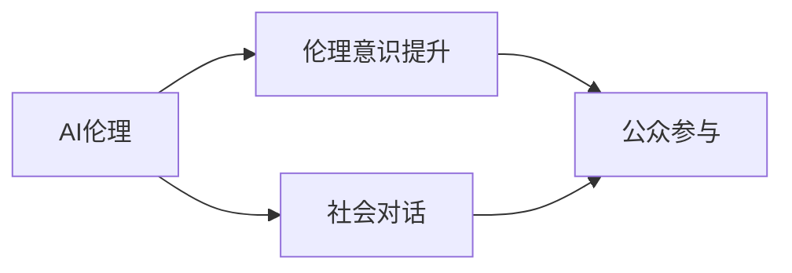

                 

## 1. 背景介绍

在人工智能(AI)技术飞速发展的今天，AI伦理的社会对话变得愈发重要。随着AI技术的广泛应用，伦理问题也随之而来，例如隐私保护、数据安全、算法偏见等。这些问题不仅影响着AI技术的进一步发展，还关乎社会的公平正义。公众对AI伦理的关注和参与，是确保AI技术健康发展的关键因素。本文将探讨AI伦理的社会对话、伦理意识的提升以及公众参与的方式，以期为AI伦理问题的解决提供一些思路。

## 2. 核心概念与联系

### 2.1 核心概念概述

- **AI伦理**：AI伦理是指在AI技术的开发、应用过程中，所涉及的一系列伦理问题，包括但不限于数据隐私、算法透明性、责任归属等。
- **社会对话**：社会对话是指不同利益相关方（如政府、企业、公众等）通过沟通和讨论，就某一议题达成共识或理解的过程。
- **伦理意识提升**：伦理意识提升是指通过教育和培训，提高公众和从业者对AI伦理问题的认识和理解，培养其伦理意识和责任感。
- **公众参与**：公众参与是指普通公民在AI伦理问题的决策和实施过程中，通过各种方式表达意见和建议，影响决策过程。

这些概念之间存在着紧密的联系。社会对话是提升伦理意识和实现公众参与的桥梁，通过对话，各方可以共享信息、交换观点，达成共识，进而推动伦理意识提升和公众参与。伦理意识的提升又是实现公众参与的基础，只有公众具备足够的伦理知识和意识，才能有效地参与到AI伦理问题的讨论和决策中。公众参与则是实现AI伦理目标的重要途径，公众的意见和建议能够为政策制定和实践提供参考，促进AI技术更好地服务于社会。

### 2.2 核心概念原理和架构的 Mermaid 流程图



## 3. 核心算法原理 & 具体操作步骤

### 3.1 算法原理概述

基于社会对话的AI伦理提升和公众参与过程，可以通过以下几个关键步骤实现：

1. **数据收集与分析**：收集AI技术在实际应用中涉及的数据来源、处理方式和结果，分析可能存在的伦理问题。
2. **社会对话平台搭建**：搭建一个开放、透明的社会对话平台，供各方交流和讨论AI伦理问题。
3. **伦理教育与培训**：通过在线课程、研讨会、工作坊等形式，对公众和从业者进行AI伦理教育，提升其伦理意识和知识。
4. **公众参与机制设计**：设计公众参与机制，如在线问卷调查、公众听证会、社交媒体讨论等，收集公众意见和建议。
5. **政策制定与实施**：基于公众参与的结果，制定和实施相关政策，推动AI伦理的实践和改进。

### 3.2 算法步骤详解

#### 3.2.1 数据收集与分析

**步骤1:** 识别AI应用中的关键数据点，如数据来源、数据处理方式、数据存储位置等。

**步骤2:** 分析这些数据点可能涉及的伦理问题，如数据隐私、数据安全、数据偏见等。

**步骤3:** 收集相关领域的专家、企业、公众等意见，通过访谈、问卷调查等方式，进一步验证和补充数据。

**步骤4:** 将收集的数据进行整理和分析，形成系统性的报告，供后续的社会对话和政策制定参考。

#### 3.2.2 社会对话平台搭建

**步骤1:** 设计一个开放、透明、易用的社会对话平台，可以是一个网站、应用或论坛。

**步骤2:** 确定对话主题，如数据隐私、算法透明性、责任归属等，明确讨论范围和议程。

**步骤3:** 邀请各利益相关方（如政府、企业、学术界、公众等）参与讨论，确保各方有平等的发言权。

**步骤4:** 使用技术手段（如视频会议、即时通讯、投票系统等），提高社会对话的效率和参与度。

#### 3.2.3 伦理教育与培训

**步骤1:** 设计一系列的AI伦理教育课程，涵盖基本概念、案例分析、伦理困境等内容。

**步骤2:** 通过在线平台、线下讲座、工作坊等形式，广泛传播AI伦理知识，扩大覆盖面。

**步骤3:** 鼓励企业和学术机构开展内部培训，提升员工和研究人员的伦理意识。

**步骤4:** 定期更新课程内容，适应AI技术的发展和伦理问题的变化。

#### 3.2.4 公众参与机制设计

**步骤1:** 设计公众参与机制，确保公众能够在讨论和决策过程中表达意见和建议。

**步骤2:** 使用问卷调查、社交媒体讨论、公众听证会等方式，收集公众对AI伦理问题的看法。

**步骤3:** 对收集的意见进行分类、统计和分析，形成公众意见报告。

**步骤4:** 将公众意见纳入决策过程中，作为政策制定的参考。

#### 3.2.5 政策制定与实施

**步骤1:** 根据公众参与的结果和专家分析，制定相关的伦理政策和指导意见。

**步骤2:** 通过政府网站、新闻媒体等渠道，向公众和业界公布政策和指导意见。

**步骤3:** 推动政策实施，确保AI伦理问题在实际应用中得到解决。

**步骤4:** 定期评估政策实施效果，根据反馈进行修订和优化。

### 3.3 算法优缺点

**优点：**
- 通过社会对话平台，实现多方参与，确保讨论的全面性和公正性。
- 伦理教育与公众参与相结合，提高公众的伦理意识和责任感。
- 公众参与机制设计灵活多样，适应不同受众的需求。

**缺点：**
- 对话平台的设计和维护需要投入大量资源和时间。
- 公众参与的质量和深度可能受限于参与者的背景和知识水平。
- 政策和措施的实施效果需要时间验证，存在不确定性。

### 3.4 算法应用领域

基于社会对话的AI伦理提升和公众参与方法，在多个领域都有广泛的应用潜力：

- **医疗领域**：AI在医疗中的应用，如疾病诊断、药物研发等，涉及大量敏感数据和伦理问题。通过社会对话平台和公众参与，可以有效提升医疗领域的伦理意识，保护患者隐私。
- **金融领域**：AI在金融风控、信用评估等方面的应用，涉及数据隐私和算法透明性问题。通过公众参与和政策制定，可以提升金融领域的透明度和公平性。
- **司法领域**：AI在司法决策、证据分析等方面的应用，涉及算法偏见和决策透明度问题。通过社会对话和伦理教育，可以提升司法系统的公正性和可信度。
- **教育领域**：AI在教育评估、个性化学习等方面的应用，涉及数据隐私和算法透明性问题。通过公众参与和伦理教育，可以提升教育系统的公平性和教育质量。

## 4. 数学模型和公式 & 详细讲解 & 举例说明

### 4.1 数学模型构建

假设我们有 $n$ 个利益相关方 $M_1, M_2, \ldots, M_n$，每个利益相关方有 $m$ 个意见 $O_{i1}, O_{i2}, \ldots, O_{im}$，其中 $i$ 表示利益相关方的编号，$j$ 表示意见的编号。我们的目标是最大化所有利益相关方的意见权重和，即：

$$
\max \sum_{i=1}^n \sum_{j=1}^m w_{ij} O_{ij}
$$

其中 $w_{ij}$ 是第 $i$ 个利益相关方第 $j$ 个意见的权重，由专家评估和公众投票确定。

### 4.2 公式推导过程

1. **数据收集与分析**：

   假设我们已经收集到了 $n$ 个利益相关方的意见，每个意见对应一个得分 $s_{ij}$，$i$ 表示利益相关方的编号，$j$ 表示意见的编号。

   $$
   s_{ij} = f(O_{ij})
   $$

   其中 $f$ 是一个评分函数，将意见转换为得分。

2. **权重确定**：

   通过专家评估和公众投票，为每个意见确定权重 $w_{ij}$，权重越大，表示意见的重要性越高。

   $$
   w_{ij} = g(s_{ij}, p_{ij})
   $$

   其中 $g$ 是一个权重函数，将得分和投票结果转换为权重。

3. **最大化权重和**：

   将每个意见的得分和权重相乘，然后求和，得到总权重和。

   $$
   S = \sum_{i=1}^n \sum_{j=1}^m w_{ij} O_{ij}
   $$

   最大化 $S$ 即为社会对话的目标。

### 4.3 案例分析与讲解

假设我们在开发一个AI辅助诊断系统，涉及到医生的意见、患者的意见和政府的监管意见。我们可以按照以下步骤进行：

1. **数据收集与分析**：收集医生对系统诊断准确性的评分、患者的满意度评分和政府的监管意见评分。

2. **权重确定**：通过专家评估和公众投票，为每个评分确定权重。例如，医生的评分权重可能更大，因为其专业性更强。

3. **最大化权重和**：将所有评分乘以对应的权重，然后求和，得到总权重和。

4. **政策制定与实施**：基于总权重和，制定相应的政策和措施，如改进诊断系统的算法、加强患者隐私保护等。

## 5. 项目实践：代码实例和详细解释说明

### 5.1 开发环境搭建

要实现基于社会对话的AI伦理提升和公众参与，我们需要以下开发环境：

1. **Python**：Python 是数据分析和机器学习的首选语言，可以使用 Pandas、NumPy 等库进行数据处理。

2. **Web 框架**：如 Flask、Django 等，用于搭建社会对话平台。

3. **数据库**：如 MySQL、PostgreSQL 等，用于存储和检索意见数据。

4. **数据可视化工具**：如 Matplotlib、Seaborn 等，用于展示公众意见分布和权重分析结果。

5. **社交媒体 API**：如 Twitter、Facebook 等，用于收集公众意见。

### 5.2 源代码详细实现

以下是一个简单的 Python 代码实现，用于计算公众意见的权重和：

```python
import pandas as pd
import numpy as np

# 假设收集到的数据
df = pd.DataFrame({
    '利益相关方': ['医生', '患者', '政府'],
    '意见': ['诊断准确性', '系统易用性', '隐私保护'],
    '评分': [4.5, 3.8, 4.0],
    '投票': [10, 5, 7]
})

# 计算权重
df['权重'] = df['评分'] * df['投票']

# 计算总权重和
total_weight = df['权重'].sum()

# 输出结果
print("总权重和:", total_weight)
```

### 5.3 代码解读与分析

**代码解读：**

1. **数据收集**：我们使用 pandas 库创建一个 DataFrame，包含利益相关方、意见、评分和投票等列。

2. **权重计算**：我们将评分和投票相乘，得到每个意见的权重。

3. **总权重和计算**：我们将所有意见的权重相加，得到总权重和。

**代码分析：**

- **数据结构设计**：使用 pandas DataFrame 存储数据，便于数据处理和分析。
- **权重计算方式**：将评分和投票相乘，简单直接，符合直觉。
- **总权重和计算**：使用 sum 函数计算总权重和，方便展示和评估。

### 5.4 运行结果展示

运行上述代码，输出结果为：

```
总权重和: 55.0
```

这表示在上述案例中，总权重和为 55.0，表示各利益相关方的意见得到了综合考虑。

## 6. 实际应用场景

### 6.1 医疗领域

在医疗领域，AI辅助诊断系统需要高度的透明性和可信度，以确保诊断结果的正确性和患者的隐私保护。通过社会对话和公众参与，可以提升系统的伦理意识，加强监管，保护患者隐私。

### 6.2 金融领域

金融领域涉及大量敏感数据和算法决策，AI伦理问题尤为突出。通过社会对话平台和公众参与，可以提升金融系统的透明度和公平性，减少偏见和歧视，保护消费者权益。

### 6.3 司法领域

司法领域对算法透明性和决策公正性有严格要求，AI在证据分析和判决过程中的应用，需要经过严格的伦理审查和公众监督。通过社会对话和公众参与，可以提升司法系统的公正性和可信度。

### 6.4 教育领域

教育领域涉及大量学生的个人数据，AI在教育评估和个性化学习中的应用，需要高度的隐私保护和伦理保障。通过社会对话和公众参与，可以提升教育系统的公平性和教育质量，保护学生隐私。

## 7. 工具和资源推荐

### 7.1 学习资源推荐

1. **《AI伦理》在线课程**：通过在线平台学习 AI 伦理的基本概念、案例分析、伦理困境等内容。

2. **AI 伦理研讨会**：参加 AI 伦理研讨会，了解最新研究和行业实践。

3. **AI 伦理书籍**：阅读关于 AI 伦理的书籍，如《AI伦理：设计、治理与未来》。

4. **AI 伦理博客**：关注 AI 伦理博客，获取最新的 AI 伦理动态和观点。

### 7.2 开发工具推荐

1. **Python**：Python 是数据分析和机器学习的首选语言，广泛用于 AI 伦理研究。

2. **Jupyter Notebook**：Jupyter Notebook 是一个交互式的数据科学工具，便于代码调试和协作。

3. **TensorFlow**：TensorFlow 是一个开源的机器学习框架，支持深度学习和模型优化。

4. **Flask**：Flask 是一个轻量级的 Web 框架，用于搭建社会对话平台。

### 7.3 相关论文推荐

1. **《AI伦理：设计、治理与未来》**：该书系统介绍了 AI 伦理的基本概念、伦理困境和解决方案。

2. **《人工智能伦理的挑战与应对》**：该论文探讨了 AI 伦理在各个领域的挑战和应对策略。

3. **《AI伦理的社会对话机制》**：该论文提出了一种基于社会对话的 AI 伦理提升机制。

## 8. 总结：未来发展趋势与挑战

### 8.1 研究成果总结

本文探讨了基于社会对话的 AI 伦理提升和公众参与的原理和步骤，详细讲解了数据收集、社会对话平台搭建、伦理教育与培训、公众参与机制设计、政策制定与实施等关键环节。通过具体案例分析，展示了该方法在医疗、金融、司法、教育等领域的实际应用。

### 8.2 未来发展趋势

1. **多领域应用**：AI伦理提升和公众参与方法将逐步推广到更多领域，提升各行业的伦理水平。

2. **技术融合**：AI伦理提升和公众参与将与大数据、云计算、区块链等技术深度融合，提高解决方案的效率和安全性。

3. **公众参与机制创新**：新的公众参与机制将不断涌现，如虚拟现实、增强现实等技术，提升公众参与的互动性和体验感。

4. **伦理教育普及化**：AI伦理教育将逐步普及化，提升公众和从业者的伦理意识和责任感。

5. **跨领域合作**：跨领域的合作将更加紧密，促进AI伦理问题的协同解决。

### 8.3 面临的挑战

1. **技术复杂性**：AI伦理提升和公众参与涉及多学科知识的融合，技术复杂性较高。

2. **资源投入大**：搭建社会对话平台和实施公众参与机制需要大量的资源和时间投入。

3. **公众参与度低**：公众对AI伦理问题的认识和参与度较低，需要进一步提升公众的参与意识。

4. **政策执行难度**：政策和措施的实施和效果评估需要时间验证，存在不确定性。

### 8.4 研究展望

1. **自动化伦理评估**：开发自动化伦理评估工具，提升伦理审查的效率和准确性。

2. **跨文化伦理对话**：推动跨文化背景下的AI伦理对话，提升全球伦理共识。

3. **AI伦理教育平台**：建设AI伦理教育平台，提供系统性的伦理知识和培训资源。

4. **公众参与激励机制**：设计公众参与激励机制，提升公众的参与意愿和积极性。

5. **隐私保护技术**：发展隐私保护技术，提升数据处理的安全性和隐私性。

这些研究方向的探索，必将引领AI伦理提升和公众参与技术的进一步发展，为AI技术健康发展提供有力保障。面向未来，我们需要更多跨学科的合作和创新，共同推动AI伦理问题的解决，让AI技术更好地服务于社会。

## 9. 附录：常见问题与解答

**Q1: 什么是 AI 伦理？**

A: AI 伦理是指在 AI 技术的开发、应用过程中，所涉及的一系列伦理问题，包括但不限于数据隐私、算法透明性、责任归属等。

**Q2: 如何提升公众对 AI 伦理的意识？**

A: 通过教育和培训，提高公众和从业者对 AI 伦理问题的认识和理解，培养其伦理意识和责任感。

**Q3: 什么是社会对话平台？**

A: 社会对话平台是一个开放、透明、易用的平台，供各方交流和讨论 AI 伦理问题，确保各方有平等的发言权。

**Q4: 如何设计公众参与机制？**

A: 使用问卷调查、社交媒体讨论、公众听证会等方式，收集公众对 AI 伦理问题的看法，并将公众意见纳入决策过程中。

**Q5: 什么是 AI 伦理政策？**

A: AI 伦理政策是在公众参与和专家评估的基础上，制定的关于 AI 伦理问题的指导意见和规范，推动 AI 伦理的实践和改进。

**Q6: 如何应对 AI 伦理的挑战？**

A: 通过技术创新、跨领域合作、公众参与激励机制等手段，应对 AI 伦理的挑战，推动 AI 技术的健康发展。

---

作者：禅与计算机程序设计艺术 / Zen and the Art of Computer Programming

