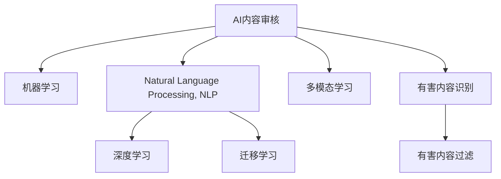

                 

# AI内容审核：保护用户免受有害内容影响

## 1. 背景介绍

随着互联网的普及和社交媒体的兴起，信息传播的速度和范围不断扩大，同时，有害内容的传播也成为影响社会稳定和国家安全的重要问题。针对这一挑战，AI内容审核技术应运而生。AI内容审核是指利用人工智能技术，对用户上传的内容进行自动化筛选和分类，识别并过滤出有害信息，保护用户免受不良信息的影响。本文将系统阐述AI内容审核的核心概念、技术原理和实际应用，为相关实践提供有价值的参考。

## 2. 核心概念与联系

### 2.1 核心概念概述

在介绍AI内容审核的技术原理前，我们首先需要理解几个关键概念：

- **AI内容审核**：指利用人工智能技术，对用户生成内容（User-Generated Content, UGC）进行自动化筛选和分类，识别并过滤出有害信息。

- **有害内容**：包括但不限于仇恨言论、暴力内容、虚假信息、涉黄涉暴等内容，是内容审核技术的主要识别目标。

- **机器学习（Machine Learning, ML）**：利用数据和算法，让计算机系统具备自主学习并改进的能力，是实现AI内容审核的核心技术之一。

- **自然语言处理（Natural Language Processing, NLP）**：研究如何让计算机处理、理解、生成自然语言，是内容审核技术中广泛应用的领域。

- **深度学习（Deep Learning, DL）**：基于多层神经网络，通过大量标注数据训练出复杂的模型，是内容审核技术中的重要组成部分。

- **迁移学习（Transfer Learning）**：利用预训练模型在特定任务上微调，以实现高效的内容审核。

- **多模态学习（Multi-modal Learning）**：结合文本、图像、音频等多种模态的数据，提升内容的全面理解能力。

这些概念构成了AI内容审核技术的基础框架，相互之间有紧密的联系。机器学习提供了实现自动化的手段，自然语言处理和深度学习具体实现了模型的训练和推理，迁移学习利用预训练模型提升效率，多模态学习扩展了内容的理解和识别能力。

### 2.2 核心概念原理和架构的 Mermaid 流程图



这个流程图展示了AI内容审核的核心概念和技术架构：

1. **AI内容审核**：总体目标，贯穿整个技术流程。
2. **机器学习**：基础技术，提供自动化处理能力。
3. **自然语言处理**：具体实现手段，涉及文本分析、语义理解等。
4. **深度学习**：核心技术，提供复杂模型训练与推理。
5. **迁移学习**：提升效率的技术，利用预训练模型加速任务适应。
6. **多模态学习**：扩展理解能力的工具，结合不同模态数据。
7. **有害内容识别**：识别目标，根据定义的规则和标准。
8. **有害内容过滤**：最终目标，根据识别结果进行内容筛选。

## 3. 核心算法原理 & 具体操作步骤

### 3.1 算法原理概述

AI内容审核的核心算法原理基于监督学习和深度学习。具体步骤如下：

1. **数据准备**：收集并标注大量的文本数据，这些数据应涵盖各种类型的有害内容。
2. **模型训练**：使用标注数据训练深度学习模型，学习文本中特定有害内容的特征。
3. **模型评估**：使用未参与训练的数据集评估模型性能，确保模型具有良好的泛化能力。
4. **模型微调**：根据具体应用的特性，对模型进行微调，以适应不同的内容审核需求。
5. **内容审核**：部署训练好的模型，对用户上传的内容进行实时审核，筛选出有害内容。

### 3.2 算法步骤详解

**Step 1: 数据准备**

1. **数据收集**：收集包含各种有害内容的文本数据，如社交媒体帖子、评论、新闻报道等。
2. **数据标注**：由人工或自动化工具对数据进行标注，将每条文本标记为有害或无害。

**Step 2: 模型训练**

1. **选择模型**：根据任务需求选择合适的深度学习模型，如卷积神经网络（CNN）、循环神经网络（RNN）或Transformer等。
2. **数据预处理**：对文本数据进行分词、去除停用词等预处理操作。
3. **特征提取**：利用预训练的语言模型（如BERT、GPT等）提取文本的向量表示。
4. **模型训练**：在标注数据上训练模型，使用交叉熵损失函数优化。

**Step 3: 模型评估**

1. **选择评估指标**：如准确率、召回率、F1分数等，用于评估模型在识别有害内容时的性能。
2. **评估过程**：使用未参与训练的数据集评估模型，确保模型具有较好的泛化能力。
3. **模型优化**：根据评估结果调整模型参数，提升模型性能。

**Step 4: 模型微调**

1. **任务适配**：根据具体应用场景，设计合适的任务适配层，如分类头、情感分析头等。
2. **参数调整**：调整模型的超参数，如学习率、批大小等，以适应特定任务的要求。
3. **迭代训练**：在标注数据上反复训练模型，不断优化模型性能。

**Step 5: 内容审核**

1. **部署模型**：将训练好的模型部署到生产环境，用于实时内容审核。
2. **实时审核**：对用户上传的内容进行实时分析，筛选出有害内容。
3. **结果反馈**：将筛选结果反馈给用户，或进行后续处理，如屏蔽、删除等。

### 3.3 算法优缺点

**优点**：
1. **自动化**：AI内容审核可以自动化处理大量文本数据，节省人力成本。
2. **实时性**：基于深度学习模型的AI内容审核可以实时对用户上传的内容进行审核，保证用户及时获知处理结果。
3. **高准确率**：深度学习模型在识别有害内容方面具有较高的准确率，特别是在处理复杂的语言结构和多模态数据时。

**缺点**：
1. **数据依赖**：模型性能依赖于标注数据的质量和数量，高质量标注数据的获取成本较高。
2. **模型过拟合**：在数据量较小的情况下，模型容易过拟合，泛化能力有限。
3. **误判风险**：深度学习模型可能会产生误判，将无害内容误认为有害内容，或将有害内容误认为无害内容。
4. **隐私问题**：在处理用户上传内容时，涉及用户隐私和数据保护问题。

### 3.4 算法应用领域

AI内容审核技术在多个领域有着广泛的应用，主要包括以下几个方面：

- **社交媒体平台**：如微博、微信、Facebook等，用于审核用户发布的内容，防止仇恨言论、暴力内容等有害信息的传播。
- **在线教育**：如Coursera、EdX等，用于审核学生提交的作业和评论，防止抄袭、恶意攻击等内容。
- **企业内部通讯**：如Slack、Microsoft Teams等，用于审核员工发布的内部消息，防止敏感信息和恶意内容的传播。
- **政府网站**：如政府新闻网站、政策公告等，用于审核用户提交的评论和反馈，防止虚假信息和恶意攻击。

## 4. 数学模型和公式 & 详细讲解 & 举例说明

### 4.1 数学模型构建

假设输入文本为 $X$，有害内容标记为 $Y$，模型为 $M$。内容审核任务可以表示为二分类问题，即判断输入文本是否含有有害内容。模型的输出为 $M(X)$，表示文本含有有害内容的概率。

### 4.2 公式推导过程

假设使用一个二分类模型，如逻辑回归或支持向量机（SVM），其输出为 $M(X) = \sigma(W \cdot X + b)$，其中 $\sigma$ 为激活函数，$W$ 和 $b$ 为模型参数。

根据标注数据 $\{(X_i, Y_i)\}_{i=1}^N$，模型的损失函数为交叉熵损失：

$$
\mathcal{L} = -\frac{1}{N} \sum_{i=1}^N (Y_i \log M(X_i) + (1-Y_i) \log (1-M(X_i)))
$$

使用随机梯度下降（SGD）等优化算法最小化损失函数，更新模型参数 $W$ 和 $b$。

### 4.3 案例分析与讲解

**案例：针对Twitter上的仇恨言论检测**

1. **数据准备**：收集Twitter上关于仇恨言论的帖子，由人工标注为“含有”和“不含有”两种类别。
2. **模型训练**：使用BERT等预训练语言模型提取帖子特征，训练一个二分类模型。
3. **模型评估**：在未参与训练的帖子数据上评估模型性能，使用F1分数等指标。
4. **模型微调**：根据实际应用需求，微调模型适配Twitter的特点，如使用特定情感分析头。
5. **内容审核**：将训练好的模型部署到Twitter平台上，实时审核用户发布的内容，筛选出含有仇恨言论的帖子。

## 5. 项目实践：代码实例和详细解释说明

### 5.1 开发环境搭建

1. **安装Python**：确保开发环境中已经安装Python 3.x版本。
2. **安装PyTorch和TensorFlow**：使用pip安装对应的深度学习框架，确保兼容性和稳定性。
3. **安装Natural Language Toolkit（NLTK）**：用于文本预处理和语言分析。
4. **安装FastAPI**：用于构建API接口，方便内容审核系统的部署和调用。

### 5.2 源代码详细实现

以下是一个基于PyTorch的AI内容审核系统的示例代码：

```python
import torch
from transformers import BertTokenizer, BertForSequenceClassification
from fastapi import FastAPI, HTTPException

# 定义内容审核模型
class ContentReviewer:
    def __init__(self, model_path):
        self.model = BertForSequenceClassification.from_pretrained(model_path)
        self.tokenizer = BertTokenizer.from_pretrained(model_path)
    
    def predict(self, text):
        inputs = self.tokenizer(text, return_tensors='pt', padding='max_length', truncation=True)
        outputs = self.model(**inputs)
        scores = outputs.logits.squeeze(0).tolist()
        return scores

# 初始化FastAPI应用
app = FastAPI()

# 定义内容审核API
@app.get('/review/{text}')
def review(text: str):
    reviewer = ContentReviewer('path/to/model')
    scores = reviewer.predict(text)
    if scores[1] > 0.5:
        raise HTTPException(status_code=400, detail='该文本含有有害内容')
    else:
        return {'status': 'safe'}

if __name__ == '__main__':
    app.run(host='0.0.0.0', port=8000)
```

### 5.3 代码解读与分析

**代码解读**：
1. **ContentReviewer类**：用于加载和预测有害内容。
2. **predict方法**：使用预训练的BERT模型对输入文本进行特征提取和分类预测。
3. **FastAPI应用**：定义API接口，接收用户上传的内容并返回是否含有有害内容的结果。

**分析**：
1. **模型加载**：使用预训练的BERT模型，无需重新训练，节省时间和资源。
2. **API设计**：使用FastAPI构建RESTful API，方便与外部系统集成。
3. **异常处理**：利用HTTPException对有害内容进行错误处理，确保系统稳定性。

### 5.4 运行结果展示

运行上述代码后，可以在浏览器中访问 `http://localhost:8000/review/your_content`，获取是否含有有害内容的结果。

## 6. 实际应用场景

### 6.1 社交媒体平台

社交媒体平台上，用户发布的内容多样且复杂，涉及个人隐私、政治观点、社会事件等多种话题。AI内容审核技术可以在社交媒体平台上部署，实时筛选和过滤有害内容，防止谣言、仇恨言论、暴力内容等的传播。例如，Twitter和Facebook都采用了类似的技术，对用户发布的内容进行审核。

### 6.2 在线教育平台

在线教育平台，如Coursera和EdX，学生和教师在平台上发布大量的讨论和反馈。AI内容审核技术可以用于审核学生提交的作业和评论，防止抄袭、恶意攻击等内容，确保教育环境的健康和积极。

### 6.3 企业内部通讯

企业内部通讯系统，如Slack和Microsoft Teams，员工在平台上发布各种消息和文件。AI内容审核技术可以用于审核员工发布的内部消息，防止敏感信息和恶意内容的传播，确保企业安全和信息安全。

### 6.4 政府网站

政府网站，如政府新闻网站和政策公告，用户可以留言和反馈。AI内容审核技术可以用于审核用户提交的评论和反馈，防止虚假信息和恶意攻击，确保政府网站的公信力和权威性。

## 7. 工具和资源推荐

### 7.1 学习资源推荐

1. **自然语言处理课程**：如斯坦福大学的CS224N《深度学习自然语言处理》课程，系统介绍NLP的基本概念和前沿技术。
2. **深度学习框架教程**：如TensorFlow和PyTorch的官方文档和社区教程，学习如何使用深度学习框架进行模型训练和推理。
3. **AI内容审核项目**：如GitHub上的OpenAI的Content Moderator项目，提供了开源的代码和模型，可以参考其实现。
4. **书籍推荐**：如《Deep Learning for Natural Language Processing》，详细介绍了NLP中的深度学习技术。

### 7.2 开发工具推荐

1. **PyTorch**：深度学习领域最受欢迎的框架之一，提供了丰富的预训练模型和工具。
2. **TensorFlow**：Google开发的深度学习框架，支持多种硬件和设备，适用于大规模模型训练。
3. **FastAPI**：基于FastAPI构建的RESTful API，方便构建和部署Web应用。
4. **NLTK**：自然语言处理工具包，提供了丰富的文本处理和分析功能。

### 7.3 相关论文推荐

1. **《Twitter上的仇恨言论检测》**：详细介绍了使用深度学习模型检测Twitter上的仇恨言论的技术。
2. **《自然语言处理中的深度学习》**：系统介绍了深度学习在自然语言处理中的应用，包括文本分类、情感分析、语言生成等。
3. **《内容审核中的迁移学习》**：探讨了迁移学习在内容审核中的作用，如何利用预训练模型提升审核效率。

## 8. 总结：未来发展趋势与挑战

### 8.1 总结

本文对AI内容审核的核心概念、技术原理和实际应用进行了系统阐述。通过分析有害内容的识别和过滤过程，介绍了基于深度学习的AI内容审核模型，并提供了相应的代码实现。我们通过具体的案例分析，展示了AI内容审核技术在多个领域的应用前景。

通过本文的系统梳理，可以看到，AI内容审核技术已经在多个场景中得到了广泛应用，为保护用户免受有害内容影响提供了有效的解决方案。未来，伴随技术的不断进步，AI内容审核将变得更加智能化、高效化和普适化，进一步提升社会安全和网络环境的质量。

### 8.2 未来发展趋势

1. **深度学习模型的进一步优化**：未来深度学习模型将更加复杂和强大，能够处理更复杂的文本结构和多模态数据。
2. **自动化标注工具的发展**：自动化标注工具将进一步提升标注数据的获取效率，降低人工成本。
3. **联邦学习和隐私保护**：联邦学习和隐私保护技术将提升内容审核的隐私性和安全性。
4. **跨领域和多模态内容审核**：跨领域和多模态内容审核技术将提升内容的全面理解和识别能力。

### 8.3 面临的挑战

1. **数据获取和标注的困难**：高质量标注数据的获取和标注仍是一个挑战，尤其是对于冷门和专业领域的标注数据。
2. **模型的泛化能力**：模型在处理新的和未见过的数据时，泛化能力仍然是一个问题。
3. **隐私保护**：内容审核涉及用户隐私，如何保护用户隐私和数据安全是一个重要的挑战。
4. **对抗样本的威胁**：对抗样本攻击可能影响内容审核系统的准确性和安全性。

### 8.4 研究展望

1. **自动化标注工具的研发**：研发高效的自动化标注工具，降低人工标注成本。
2. **模型的隐私保护技术**：研究和应用隐私保护技术，确保内容审核过程中用户数据的隐私和安全。
3. **跨领域和多模态内容审核**：开发跨领域和多模态内容审核技术，提升内容的全面理解能力。
4. **对抗样本检测技术**：研究对抗样本检测技术，提升内容审核系统的鲁棒性和安全性。

## 9. 附录：常见问题与解答

**Q1：AI内容审核的准确率如何保证？**

A: AI内容审核的准确率依赖于训练数据的质量和数量，以及模型的复杂度和训练策略。使用大规模标注数据和高性能深度学习模型可以显著提高准确率。此外，使用数据增强和对抗训练等技术，可以有效提升模型的泛化能力和鲁棒性。

**Q2：AI内容审核的系统如何保证实时性？**

A: 使用高性能深度学习框架（如PyTorch和TensorFlow）和高效的模型推理引擎（如ONNX Runtime），可以显著提升内容审核系统的实时性。同时，优化数据处理和模型推理的流程，减少不必要的计算和存储开销，也是保证实时性的重要手段。

**Q3：AI内容审核是否会影响用户隐私？**

A: AI内容审核系统需要收集用户上传的内容，涉及用户隐私和数据保护问题。需要在系统设计和部署时，严格遵守数据隐私保护法律法规，如GDPR等。同时，采用数据脱敏和加密等技术，保护用户数据的安全和隐私。

**Q4：AI内容审核如何处理多语言内容？**

A: 多语言内容审核需要分别针对每种语言设计专用的模型和规则。可以使用多语言预训练模型，如mBERT和XLM-R，进行多语言内容的特征提取和分类预测。同时，结合多语言数据集和标注工具，进行模型训练和优化。

通过本文的系统介绍，我们深入了解了AI内容审核技术的原理和应用，并提供了具体的代码实现和案例分析。未来，伴随技术的不断进步，AI内容审核将变得更加高效、智能和普适，为保护用户免受有害内容影响提供更为有力的支持。

