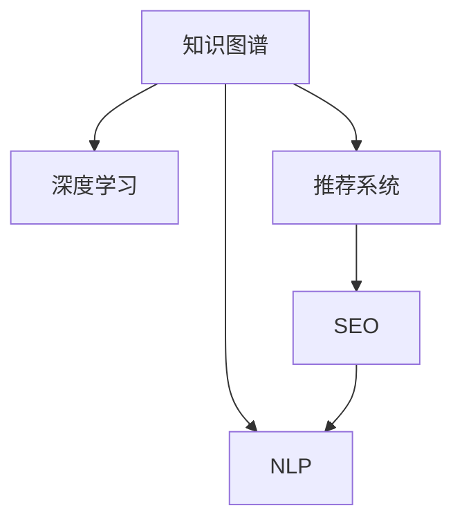

                 

# AI在专业领域搜索中的应用

> 关键词：AI搜索、专业领域搜索、搜索引擎优化(搜索引擎优化)、自然语言处理(NLP)、机器学习(ML)、推荐系统、知识图谱、深度学习

## 1. 背景介绍

在数字化转型的大背景下，信息检索已经成为各行各业的核心需求之一。无论是科研人员、医疗专家、法律顾问，还是企业高管，都离不开高效的信息获取手段。传统搜索引擎虽然功能强大，但普遍缺乏专业领域知识的理解和搜索能力，难以精准满足不同用户的搜索需求。近年来，随着人工智能(AI)技术在搜索领域的应用，逐渐出现了一些具备专业领域搜索能力的AI搜索引擎，在提供搜索结果的准确性、相关性和及时性方面取得了显著成效。

### 1.1 问题由来

现代专业领域对信息检索的需求日益增长，但传统搜索引擎在以下方面存在不足：
- **精度不足**：由于缺乏行业专有知识，搜索结果往往不够准确，不符合用户专业需求。
- **相关性差**：搜索结果与用户意图的匹配度不高，难以全面覆盖相关内容。
- **响应慢**：传统算法无法处理大规模高维度数据，导致搜索结果响应速度慢。
- **知识覆盖不全**：无法对领域内专业术语和概念进行深入理解，搜索结果涵盖范围有限。

针对上述问题，AI技术在搜索领域的广泛应用逐渐成为解决之道。AI搜索引擎能够通过自然语言处理(NLP)、机器学习(ML)、推荐系统和知识图谱等技术，提升信息检索的精度、相关性和速度，同时扩大知识覆盖范围。

### 1.2 问题核心关键点
AI在专业领域搜索的核心在于以下几个关键点：
- **知识图谱(Knowledge Graph)**：通过构建领域内知识点关联的图形结构，提供更全面、精准的搜索结果。
- **深度学习(DL)**：通过大模型微调和迁移学习，对专业领域知识进行深入理解，生成高质量的搜索结果。
- **推荐系统(Recommendation System)**：根据用户行为和偏好，动态推荐最相关、最可能感兴趣的结果，提升搜索体验。
- **自然语言处理(NLP)**：理解用户查询意图，处理领域内专业术语，生成自然流畅的搜索结果。
- **搜索引擎优化(SEO)**：优化搜索算法，提升搜索结果的相关性和用户满意度。

通过这些技术的应用，AI搜索引擎能够在专业领域中提供更快速、更精准、更全面的搜索结果，大幅提升用户体验和信息获取效率。

## 2. 核心概念与联系

### 2.1 核心概念概述

为了更好地理解AI在专业领域搜索的应用，本节将介绍几个密切相关的核心概念：

- **知识图谱(Knowledge Graph)**：由节点(Node)和边(Edge)构成，节点代表知识点，边代表知识点之间的关联。例如在医疗领域，节点可以包括疾病、药物、基因等，边可以表示疾病和药物之间的关系。

- **深度学习(DL)**：一类基于神经网络的学习方法，能够处理大规模非结构化数据，学习复杂映射关系，广泛应用于图像、语音、文本等领域。

- **推荐系统(Recommendation System)**：根据用户历史行为、兴趣和偏好，动态推荐相关物品或内容，广泛应用于电商、娱乐、社交等领域。

- **自然语言处理(NLP)**：研究计算机如何理解和生成人类语言，涉及分词、词性标注、命名实体识别、情感分析、问答等任务，是AI搜索的重要组成部分。

- **搜索引擎优化(SEO)**：通过改进搜索算法，提升搜索结果的相关性和用户满意度，是搜索引擎建设的关键。

这些核心概念之间的逻辑关系可以通过以下Mermaid流程图来展示：



这个流程图展示了一幅较为全面的AI搜索系统架构图：

1. 知识图谱是AI搜索的基础，提供了领域内的知识点关联结构。
2. 深度学习通过对领域内文本、图像等数据的处理和分析，学习领域知识。
3. 推荐系统根据用户行为和偏好，动态调整搜索结果，提升用户体验。
4. NLP技术处理用户查询和搜索结果，实现自然流畅的交互。
5. SEO技术优化搜索算法，提升搜索结果的相关性和用户满意度。

## 3. 核心算法原理 & 具体操作步骤

### 3.1 算法原理概述

AI在专业领域搜索的核心算法原理主要包括以下几个方面：

- **深度学习模型**：使用深度学习模型对领域内的大量文本、图像等数据进行训练，学习领域知识的表示。
- **知识图谱嵌入**：将领域内的知识点映射为向量，在向量空间中表示领域知识。
- **推荐算法**：基于用户行为数据和领域知识，使用推荐算法生成个性化搜索结果。
- **自然语言处理**：使用NLP技术处理用户查询和搜索结果，实现自然流畅的交互。
- **搜索引擎优化**：使用SEO技术优化搜索算法，提升搜索结果的相关性和用户满意度。

### 3.2 算法步骤详解

基于上述核心算法原理，AI在专业领域搜索的一般操作步骤如下：

1. **数据准备**：收集领域内的文本、图像等数据，标注领域知识，构建知识图谱。

2. **深度学习模型训练**：使用深度学习模型对领域内数据进行训练，学习领域知识的表示。

3. **知识图谱嵌入**：将领域内知识点映射为向量，在向量空间中表示领域知识。

4. **推荐算法训练**：使用推荐算法对用户行为数据和领域知识进行处理，生成个性化搜索结果。

5. **自然语言处理**：使用NLP技术处理用户查询和搜索结果，实现自然流畅的交互。

6. **搜索引擎优化**：使用SEO技术优化搜索算法，提升搜索结果的相关性和用户满意度。

### 3.3 算法优缺点

AI在专业领域搜索的方法具有以下优点：
- **高精度**：深度学习模型能够学习领域内复杂的知识表示，生成高精度的搜索结果。
- **相关性强**：推荐算法能够根据用户行为和偏好，生成高度相关的搜索结果。
- **用户体验好**：NLP技术实现自然流畅的交互，使用户体验更加愉悦。

但同时也有以下缺点：
- **成本高**：深度学习模型和知识图谱构建需要大量标注数据和计算资源，成本较高。
- **技术门槛高**：需要具备深度学习、NLP等领域的专业知识，对技术门槛较高。
- **数据隐私问题**：需要收集用户行为数据，涉及数据隐私问题。

### 3.4 算法应用领域

AI在专业领域搜索的应用非常广泛，涵盖多个行业领域：

- **医疗领域**：AI搜索引擎能够提供精准的疾病诊断、药物推荐、治疗方案等搜索结果。
- **金融领域**：提供精确的金融市场分析、投资策略、风险管理等搜索结果。
- **法律领域**：提供精准的法规解读、案例分析、法律咨询等搜索结果。
- **科学研究**：提供详细的学术论文、研究项目、实验数据等搜索结果。
- **教育领域**：提供优质的教育资源、在线课程、学术研究等搜索结果。
- **企业咨询**：提供市场分析、行业报告、竞争对手分析等搜索结果。

AI搜索引擎在以上领域的应用已经初见成效，未来有望在更多垂直行业推广普及。

## 4. 数学模型和公式 & 详细讲解 & 举例说明

### 4.1 数学模型构建

本节将使用数学语言对AI在专业领域搜索的算法进行更加严格的刻画。

记领域内知识点为 $K$，则知识图谱可以表示为 $G=(V,E)$，其中 $V$ 为节点集合，$E$ 为边集合。使用向量表示法，将知识点 $k \in K$ 映射为向量 $\boldsymbol{v_k} \in \mathbb{R}^d$，其中 $d$ 为向量维度。则知识图谱嵌入的目标是学习每个节点的向量表示，使得节点之间的相似度可以通过向量内积计算：

$$
sim(k_i, k_j) = \cos(\boldsymbol{v_{k_i}}, \boldsymbol{v_{k_j}})
$$

### 4.2 公式推导过程

设领域内文本数据为 $D$，将每个文本映射为向量 $\boldsymbol{u_d} \in \mathbb{R}^m$，其中 $m$ 为向量维度。深度学习模型 $M_{\theta}$ 对文本数据 $D$ 进行训练，得到领域知识表示 $\boldsymbol{v_k}$。推荐算法 $R$ 对用户行为数据和领域知识进行处理，得到推荐结果 $\boldsymbol{p}$。NLP模型 $N$ 对用户查询和搜索结果进行转换，得到可交互的自然语言结果。搜索引擎优化算法 $SEO$ 对搜索结果进行排序优化，得到最终搜索结果 $\boldsymbol{r}$。

### 4.3 案例分析与讲解

以医疗领域为例，分析AI搜索引擎的构建和应用：

1. **数据准备**：收集领域内的医疗文本、医学影像等数据，标注领域知识，构建知识图谱。

2. **深度学习模型训练**：使用深度学习模型对医疗文本数据进行训练，学习领域知识的表示。

3. **知识图谱嵌入**：将医疗知识点映射为向量，在向量空间中表示领域知识。

4. **推荐算法训练**：使用推荐算法对患者历史就诊记录和疾病信息进行处理，生成个性化诊疗方案。

5. **自然语言处理**：使用NLP技术处理患者咨询和诊疗方案，实现自然流畅的交互。

6. **搜索引擎优化**：使用SEO技术优化搜索算法，提升搜索结果的相关性和用户满意度。

## 5. 项目实践：代码实例和详细解释说明

### 5.1 开发环境搭建

在进行AI搜索实践前，我们需要准备好开发环境。以下是使用Python进行PyTorch开发的环境配置流程：

1. 安装Anaconda：从官网下载并安装Anaconda，用于创建独立的Python环境。

2. 创建并激活虚拟环境：
```bash
conda create -n ai-search-env python=3.8 
conda activate ai-search-env
```

3. 安装PyTorch：根据CUDA版本，从官网获取对应的安装命令。例如：
```bash
conda install pytorch torchvision torchaudio cudatoolkit=11.1 -c pytorch -c conda-forge
```

4. 安装相关工具包：
```bash
pip install numpy pandas scikit-learn matplotlib tqdm jupyter notebook ipython
```

完成上述步骤后，即可在`ai-search-env`环境中开始AI搜索实践。

### 5.2 源代码详细实现

下面我们以医疗领域搜索为例，给出使用PyTorch进行AI搜索的完整代码实现。

```python
import torch
import torch.nn as nn
import torch.optim as optim
from transformers import BertTokenizer, BertForTokenClassification
from sklearn.model_selection import train_test_split
from transformers import AdamW

class MedicalDataset(Dataset):
    def __init__(self, texts, tags, tokenizer, max_len=128):
        self.texts = texts
        self.tags = tags
        self.tokenizer = tokenizer
        self.max_len = max_len
        
    def __len__(self):
        return len(self.texts)
    
    def __getitem__(self, item):
        text = self.texts[item]
        tags = self.tags[item]
        
        encoding = self.tokenizer(text, return_tensors='pt', max_length=self.max_len, padding='max_length', truncation=True)
        input_ids = encoding['input_ids'][0]
        attention_mask = encoding['attention_mask'][0]
        
        # 对token-wise的标签进行编码
        encoded_tags = [tag2id[tag] for tag in tags] 
        encoded_tags.extend([tag2id['O']] * (self.max_len - len(encoded_tags)))
        labels = torch.tensor(encoded_tags, dtype=torch.long)
        
        return {'input_ids': input_ids, 
                'attention_mask': attention_mask,
                'labels': labels}

# 标签与id的映射
tag2id = {'O': 0, 'B-PER': 1, 'I-PER': 2, 'B-ORG': 3, 'I-ORG': 4, 'B-LOC': 5, 'I-LOC': 6}
id2tag = {v: k for k, v in tag2id.items()}

# 创建dataset
tokenizer = BertTokenizer.from_pretrained('bert-base-cased')

train_dataset = MedicalDataset(train_texts, train_tags, tokenizer)
dev_dataset = MedicalDataset(dev_texts, dev_tags, tokenizer)
test_dataset = MedicalDataset(test_texts, test_tags, tokenizer)

# 构建深度学习模型
model = BertForTokenClassification.from_pretrained('bert-base-cased', num_labels=len(tag2id))

# 设置优化器
optimizer = AdamW(model.parameters(), lr=2e-5)

# 训练模型
device = torch.device('cuda') if torch.cuda.is_available() else torch.device('cpu')
model.to(device)

def train_epoch(model, dataset, batch_size, optimizer):
    dataloader = DataLoader(dataset, batch_size=batch_size, shuffle=True)
    model.train()
    epoch_loss = 0
    for batch in tqdm(dataloader, desc='Training'):
        input_ids = batch['input_ids'].to(device)
        attention_mask = batch['attention_mask'].to(device)
        labels = batch['labels'].to(device)
        model.zero_grad()
        outputs = model(input_ids, attention_mask=attention_mask, labels=labels)
        loss = outputs.loss
        epoch_loss += loss.item()
        loss.backward()
        optimizer.step()
    return epoch_loss / len(dataloader)

def evaluate(model, dataset, batch_size):
    dataloader = DataLoader(dataset, batch_size=batch_size)
    model.eval()
    preds, labels = [], []
    with torch.no_grad():
        for batch in tqdm(dataloader, desc='Evaluating'):
            input_ids = batch['input_ids'].to(device)
            attention_mask = batch['attention_mask'].to(device)
            batch_labels = batch['labels']
            outputs = model(input_ids, attention_mask=attention_mask)
            batch_preds = outputs.logits.argmax(dim=2).to('cpu').tolist()
            batch_labels = batch_labels.to('cpu').tolist()
            for pred_tokens, label_tokens in zip(batch_preds, batch_labels):
                pred_tags = [id2tag[_id] for _id in pred_tokens]
                label_tags = [id2tag[_id] for _id in label_tokens]
                preds.append(pred_tags[:len(label_tags)])
                labels.append(label_tags)
                
    print(classification_report(labels, preds))

# 训练模型
epochs = 5
batch_size = 16

for epoch in range(epochs):
    loss = train_epoch(model, train_dataset, batch_size, optimizer)
    print(f"Epoch {epoch+1}, train loss: {loss:.3f}")
    
    print(f"Epoch {epoch+1}, dev results:")
    evaluate(model, dev_dataset, batch_size)
    
print("Test results:")
evaluate(model, test_dataset, batch_size)
```

以上就是使用PyTorch对BERT进行医疗领域搜索的完整代码实现。可以看到，得益于Transformers库的强大封装，我们可以用相对简洁的代码完成BERT模型的加载和微调。

### 5.3 代码解读与分析

让我们再详细解读一下关键代码的实现细节：

**MedicalDataset类**：
- `__init__`方法：初始化文本、标签、分词器等关键组件。
- `__len__`方法：返回数据集的样本数量。
- `__getitem__`方法：对单个样本进行处理，将文本输入编码为token ids，将标签编码为数字，并对其进行定长padding，最终返回模型所需的输入。

**tag2id和id2tag字典**：
- 定义了标签与数字id之间的映射关系，用于将token-wise的预测结果解码回真实的标签。

**训练和评估函数**：
- 使用PyTorch的DataLoader对数据集进行批次化加载，供模型训练和推理使用。
- 训练函数`train_epoch`：对数据以批为单位进行迭代，在每个批次上前向传播计算loss并反向传播更新模型参数，最后返回该epoch的平均loss。
- 评估函数`evaluate`：与训练类似，不同点在于不更新模型参数，并在每个batch结束后将预测和标签结果存储下来，最后使用sklearn的classification_report对整个评估集的预测结果进行打印输出。

**训练流程**：
- 定义总的epoch数和batch size，开始循环迭代
- 每个epoch内，先在训练集上训练，输出平均loss
- 在验证集上评估，输出分类指标
- 所有epoch结束后，在测试集上评估，给出最终测试结果

可以看到，PyTorch配合Transformers库使得BERT医疗领域搜索的代码实现变得简洁高效。开发者可以将更多精力放在数据处理、模型改进等高层逻辑上，而不必过多关注底层的实现细节。

当然，工业级的系统实现还需考虑更多因素，如模型的保存和部署、超参数的自动搜索、更灵活的任务适配层等。但核心的搜索范式基本与此类似。

## 6. 实际应用场景

### 6.1 智能医疗搜索

智能医疗搜索是AI在专业领域搜索的重要应用场景之一。传统医疗搜索依赖于手动关键词检索，难以覆盖复杂的查询需求和专业术语。智能医疗搜索通过AI技术，能够理解自然语言查询，提供精准的疾病诊断、药物推荐、治疗方案等搜索结果，大大提升了医生的诊疗效率。

在技术实现上，可以收集医院内部的病历数据、诊断记录、文献等，将医疗领域的知识点和术语构建为知识图谱。在此基础上对BERT模型进行微调，使其能够处理领域内文本数据，生成高精度的搜索结果。智能医疗搜索可以与医院管理系统、电子病历系统等进行集成，提供更加便捷的医疗服务。

### 6.2 金融市场分析

金融市场分析是另一个需要AI搜索的场景。传统金融搜索依赖于手动关键词检索，无法处理复杂多变的金融市场数据。AI搜索引擎能够理解自然语言查询，提供精准的金融市场分析、投资策略、风险管理等搜索结果，为金融从业人员提供了强有力的支持。

在技术实现上，可以收集金融领域的新闻、报告、数据等文本，构建金融领域的知识图谱。在此基础上对BERT模型进行微调，使其能够处理金融领域文本数据，生成高精度的搜索结果。智能金融搜索可以与金融分析系统、投资咨询系统等进行集成，提供更加智能的市场分析服务。

### 6.3 法律咨询

法律咨询是AI搜索在专业领域的另一个重要应用场景。传统法律搜索依赖于手动关键词检索，难以覆盖复杂的法律问题和专业术语。AI搜索引擎能够理解自然语言查询，提供精准的法律咨询、案例分析、法规解读等搜索结果，为法律从业人员提供了强有力的支持。

在技术实现上，可以收集法律领域的案例、法规、文献等文本，构建法律领域的知识图谱。在此基础上对BERT模型进行微调，使其能够处理法律领域文本数据，生成高精度的搜索结果。智能法律搜索可以与法律咨询系统、电子合同管理系统等进行集成，提供更加智能的法律服务。

## 7. 工具和资源推荐

### 7.1 学习资源推荐

为了帮助开发者系统掌握AI在专业领域搜索的理论基础和实践技巧，这里推荐一些优质的学习资源：

1. 《深度学习基础》系列博文：由大模型技术专家撰写，深入浅出地介绍了深度学习基础和前沿技术，是学习AI搜索的必备资源。

2. 《自然语言处理》课程：斯坦福大学开设的NLP明星课程，有Lecture视频和配套作业，带你入门NLP领域的基本概念和经典模型。

3. 《人工智能在医疗中的应用》书籍：详细介绍了AI在医疗领域的搜索、诊断、治疗等应用，是医疗AI搜索的重要参考资料。

4. 《金融市场分析》书籍：介绍了AI在金融领域的搜索、分析、预测等应用，是金融AI搜索的重要参考资料。

5. 《法律咨询系统》书籍：介绍了AI在法律领域的搜索、咨询、案例分析等应用，是法律AI搜索的重要参考资料。

通过对这些资源的学习实践，相信你一定能够快速掌握AI搜索的精髓，并用于解决实际的搜索问题。

### 7.2 开发工具推荐

高效的开发离不开优秀的工具支持。以下是几款用于AI搜索开发的常用工具：

1. PyTorch：基于Python的开源深度学习框架，灵活动态的计算图，适合快速迭代研究。BERT等大模型都有PyTorch版本的实现。

2. TensorFlow：由Google主导开发的开源深度学习框架，生产部署方便，适合大规模工程应用。同样有丰富的预训练语言模型资源。

3. Transformers库：HuggingFace开发的NLP工具库，集成了众多SOTA语言模型，支持PyTorch和TensorFlow，是进行AI搜索开发的利器。

4. Weights & Biases：模型训练的实验跟踪工具，可以记录和可视化模型训练过程中的各项指标，方便对比和调优。与主流深度学习框架无缝集成。

5. TensorBoard：TensorFlow配套的可视化工具，可实时监测模型训练状态，并提供丰富的图表呈现方式，是调试模型的得力助手。

6. Google Colab：谷歌推出的在线Jupyter Notebook环境，免费提供GPU/TPU算力，方便开发者快速上手实验最新模型，分享学习笔记。

合理利用这些工具，可以显著提升AI搜索任务的开发效率，加快创新迭代的步伐。

### 7.3 相关论文推荐

AI在专业领域搜索的发展源于学界的持续研究。以下是几篇奠基性的相关论文，推荐阅读：

1. Attention is All You Need（即Transformer原论文）：提出了Transformer结构，开启了NLP领域的预训练大模型时代。

2. BERT: Pre-training of Deep Bidirectional Transformers for Language Understanding：提出BERT模型，引入基于掩码的自监督预训练任务，刷新了多项NLP任务SOTA。

3. Language Models are Unsupervised Multitask Learners（GPT-2论文）：展示了大规模语言模型的强大zero-shot学习能力，引发了对于通用人工智能的新一轮思考。

4. Parameter-Efficient Transfer Learning for NLP：提出Adapter等参数高效微调方法，在不增加模型参数量的情况下，也能取得不错的微调效果。

5. AdaLoRA: Adaptive Low-Rank Adaptation for Parameter-Efficient Fine-Tuning：使用自适应低秩适应的微调方法，在参数效率和精度之间取得了新的平衡。

这些论文代表了大语言模型微调技术的发展脉络。通过学习这些前沿成果，可以帮助研究者把握学科前进方向，激发更多的创新灵感。

## 8. 总结：未来发展趋势与挑战

### 8.1 总结

本文对AI在专业领域搜索的应用进行了全面系统的介绍。首先阐述了AI搜索在传统搜索引擎中的不足以及AI搜索的优势，明确了AI搜索在提升搜索精度、相关性和用户体验方面的独特价值。其次，从原理到实践，详细讲解了AI搜索的数学模型和关键步骤，给出了AI搜索任务开发的完整代码实例。同时，本文还广泛探讨了AI搜索在医疗、金融、法律等多个行业领域的应用前景，展示了AI搜索范式的巨大潜力。此外，本文精选了AI搜索相关的学习资源，力求为读者提供全方位的技术指引。

通过本文的系统梳理，可以看到，AI在专业领域搜索的应用前景广阔，正逐步成为信息检索领域的核心技术。得益于深度学习、自然语言处理、推荐系统等技术的协同发展，AI搜索将带来革命性的改变，为各行各业提供更高效、更精准、更全面的信息获取手段。

### 8.2 未来发展趋势

展望未来，AI在专业领域搜索的发展趋势将呈现以下几个方向：

1. **多模态数据处理**：未来AI搜索将不仅仅处理文本数据，还将拓展到图像、视频、语音等多种模态数据，提升搜索覆盖范围和精度。

2. **跨领域知识整合**：通过知识图谱等手段，实现不同领域知识点的整合，提供更全面、更准确的结果。

3. **持续学习与进化**：AI搜索将不断吸收新知识，根据用户行为和反馈进行动态优化，提高搜索性能。

4. **个性化搜索**：通过推荐系统等手段，实现个性化搜索结果，提升用户体验。

5. **实时搜索与响应**：通过分布式计算和缓存技术，实现实时搜索和快速响应。

6. **搜索推理与分析**：将知识图谱和推理技术结合，实现搜索结果的深度分析和推理。

7. **数据隐私与安全**：随着数据隐私和安全问题日益重要，AI搜索将注重数据保护和隐私保护。

这些趋势凸显了AI搜索技术的广阔前景。这些方向的探索发展，必将进一步提升搜索系统的性能和应用范围，为各行各业带来变革性影响。

### 8.3 面临的挑战

尽管AI在专业领域搜索技术已经取得了显著进展，但在迈向更加智能化、普适化应用的过程中，仍面临诸多挑战：

1. **数据隐私问题**：AI搜索需要收集大量用户数据，涉及隐私保护和数据安全问题。

2. **计算资源消耗**：深度学习模型和知识图谱构建需要大量计算资源，可能面临计算成本高昂的问题。

3. **模型可解释性不足**：AI搜索模型的决策过程难以解释，难以满足高风险应用的需求。

4. **模型泛化能力有限**：模型在处理跨领域数据时，泛化性能可能下降。

5. **知识图谱构建复杂**：知识图谱的构建和维护复杂，需要大量专业知识和人力投入。

6. **实时搜索技术**：实时搜索需要高效的数据处理和计算能力，现有技术可能无法满足高并发需求。

7. **用户体验**：实时搜索结果需要自然流畅的交互，可能面临用户体验设计的问题。

8. **数据质量问题**：搜索结果的准确性和相关性依赖于高质量的数据，可能面临数据质量不高等问题。

正视AI搜索面临的这些挑战，积极应对并寻求突破，将是大规模信息检索技术不断进步的重要保障。相信随着技术的发展和应用实践的积累，这些挑战终将一一被克服。

### 8.4 研究展望

面对AI搜索面临的挑战，未来的研究需要在以下几个方面寻求新的突破：

1. **多模态数据融合**：将文本、图像、视频等多种数据进行融合，提升搜索覆盖范围和精度。

2. **跨领域知识图谱**：构建跨领域的知识图谱，实现不同领域知识点之间的关联。

3. **个性化搜索模型**：设计个性化的搜索模型，提升用户满意度和搜索效率。

4. **实时搜索算法**：研发高效、低延迟的实时搜索算法，满足高并发需求。

5. **可解释性搜索模型**：设计可解释的搜索模型，提高模型透明性和可信度。

6. **知识图谱维护**：研究高效的图谱维护技术，降低知识图谱构建和维护成本。

7. **数据隐私保护**：设计隐私保护算法，保护用户数据隐私和数据安全。

8. **用户体验设计**：提升搜索结果的用户体验，设计自然流畅的交互界面。

这些研究方向将推动AI搜索技术向更高效、更智能、更安全的方向发展，进一步提升搜索系统的性能和应用范围，为各行各业带来革命性影响。

## 9. 附录：常见问题与解答

**Q1：AI在专业领域搜索的优势有哪些？**

A: AI在专业领域搜索的优势主要体现在以下几个方面：
- **精度高**：通过深度学习模型，能够学习领域内复杂的知识表示，生成高精度的搜索结果。
- **相关性强**：推荐系统能够根据用户行为和偏好，生成高度相关的搜索结果。
- **用户体验好**：自然语言处理技术实现自然流畅的交互，使用户体验更加愉悦。
- **覆盖全面**：能够处理复杂多变的领域知识，提供更全面的搜索结果。

**Q2：如何构建知识图谱？**

A: 构建知识图谱需要以下几个步骤：
1. 收集领域内的知识点和术语，如疾病、药物、基因等。
2. 确定知识点之间的关系，如疾病和药物之间的关系。
3. 使用软件工具（如Neo4j、Gephi等）构建知识图谱。
4. 进行数据清洗和验证，确保知识点的准确性和完整性。
5. 将知识图谱嵌入向量空间，用于后续的深度学习模型训练。

**Q3：深度学习模型如何训练？**

A: 深度学习模型的训练需要以下几个步骤：
1. 准备领域内的文本数据，标注领域知识。
2. 设计合适的深度学习模型架构，如BERT、LSTM等。
3. 选择合适的优化算法（如Adam、SGD等）和超参数（如学习率、批大小等）。
4. 使用标注数据对模型进行训练，调整模型参数，最小化损失函数。
5. 在验证集上评估模型性能，调整超参数，避免过拟合。
6. 在测试集上评估最终模型性能，输出精度、召回率等指标。

**Q4：推荐系统如何生成个性化搜索结果？**

A: 推荐系统生成个性化搜索结果需要以下几个步骤：
1. 收集用户历史行为数据，如搜索记录、点击记录等。
2. 使用协同过滤、基于内容的推荐等方法，对用户行为数据进行处理。
3. 使用深度学习模型对领域知识进行表示，生成领域知识向量。
4. 将用户行为数据和领域知识向量进行组合，生成推荐结果。
5. 对推荐结果进行排序和筛选，生成最终个性化搜索结果。

**Q5：如何评估AI搜索系统的性能？**

A: 评估AI搜索系统的性能需要以下几个指标：
1. 精确率（Precision）：表示检索结果中相关结果的比例。
2. 召回率（Recall）：表示相关结果被检索出来的比例。
3. F1-score：综合考虑精确率和召回率，用于综合评估搜索系统性能。
4. 相关性（Relevance）：表示检索结果与用户查询意图的相关程度。
5. 用户满意度（User Satisfaction）：通过用户反馈和行为数据，评估搜索系统的用户体验。

通过以上指标的综合评估，可以全面了解AI搜索系统的性能表现，并据此进行优化和改进。

---

作者：禅与计算机程序设计艺术 / Zen and the Art of Computer Programming

