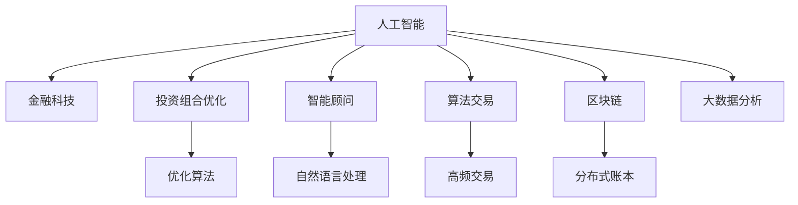

                 

# AI在个人理财和财富管理中的应用

> 关键词：人工智能,个人理财,财富管理,金融科技,投资策略,风险管理,智能顾问,算法交易,区块链,隐私保护

## 1. 背景介绍

### 1.1 问题由来
随着经济的快速发展，个人理财和财富管理逐渐成为人们关注的焦点。然而，传统的人工理财方式存在诸多限制，如高昂的咨询费用、信息不对称、难以适应复杂多变的市场环境等。这些问题使得许多人难以实现财富的保值增值，甚至有可能遭受不必要的损失。

人工智能(AI)技术的进步，为个人理财和财富管理带来了新的可能性。AI算法通过大数据、机器学习、深度学习等技术手段，可以提供个性化的理财建议，智能优化投资组合，实时监控市场动态，提供智能顾问服务，从而提升个人理财和财富管理的效率和效果。

### 1.2 问题核心关键点
AI在个人理财和财富管理中的应用涉及多个核心关键点，包括但不限于：

- 个性化理财建议：通过分析用户的财务状况、风险偏好、投资目标等，提供量身定制的理财方案。
- 智能投资策略：运用AI算法进行投资组合优化，动态调整资产配置，最大化收益并控制风险。
- 风险管理：利用AI技术实时监控市场风险，进行风险评估，提供风险预警和应对策略。
- 智能顾问：构建基于AI的智能理财顾问，通过自然语言处理技术进行人机交互，提供专业理财咨询。
- 算法交易：运用机器学习算法进行高频交易，捕捉市场机会，优化交易策略。
- 区块链技术：结合区块链的不可篡改性和透明度，进行资产追踪和智能合约管理。
- 隐私保护：在提供个性化服务的同时，保证用户数据的安全性和隐私性。

这些关键点共同构成了AI在个人理财和财富管理中的应用框架，使得AI技术可以更全面、高效地服务于个人理财需求。

## 2. 核心概念与联系

### 2.1 核心概念概述

为更好地理解AI在个人理财和财富管理中的应用，本节将介绍几个密切相关的核心概念：

- 人工智能(Artificial Intelligence, AI)：通过模拟人类智能行为，使机器能够执行学习、推理、决策等复杂任务。在个人理财和财富管理中，AI主要应用于数据分析、模型预测、智能推荐等环节。
- 金融科技(Fintech)：指利用AI、大数据、区块链等现代信息技术，提升金融服务的效率和透明度，改善用户体验，降低交易成本。
- 投资组合优化：通过优化资产配置，实现收益最大化并控制风险。AI算法可以处理海量数据，进行复杂的优化计算，提供最优投资方案。
- 智能顾问(Robo-Advisor)：基于AI的理财顾问，通过自然语言处理(NLP)技术，与用户进行交互，提供理财建议和方案。
- 算法交易：利用机器学习算法进行高频交易，捕捉市场机会，优化交易策略，提高交易效率和收益。
- 区块链技术(Blockchain)：一种去中心化的分布式账本技术，具有不可篡改、透明、安全等特点，用于资产追踪和智能合约管理。

这些核心概念之间的逻辑关系可以通过以下Mermaid流程图来展示：



这个流程图展示了一些关键概念及其之间的关系：

1. 人工智能是金融科技的核心技术之一，提供数据分析、模型预测、智能推荐等服务。
2. 投资组合优化是AI在个人理财和财富管理中的一个重要应用，用于优化资产配置。
3. 智能顾问利用自然语言处理技术，提供个性化的理财咨询。
4. 算法交易通过机器学习算法，进行高频交易，捕捉市场机会。
5. 区块链技术用于资产追踪和智能合约管理，提高金融交易的安全性和透明度。
6. 大数据分析用于处理海量数据，支持AI算法的训练和应用。

## 3. 核心算法原理 & 具体操作步骤
### 3.1 算法原理概述

AI在个人理财和财富管理中的应用，主要基于以下几个算法原理：

- 强化学习(RL)：通过奖励机制指导AI模型进行投资策略的优化和风险管理，最大化收益并控制风险。
- 深度学习(DL)：利用神经网络对复杂数据进行特征提取和模式识别，实现智能推荐和投资组合优化。
- 自然语言处理(NLP)：通过分析用户需求和市场信息，提供个性化的理财建议和智能顾问服务。
- 机器学习(ML)：通过历史数据训练模型，预测市场趋势，提供智能投资策略和风险预警。

这些算法原理构成了AI在个人理财和财富管理中的应用基础，通过AI算法进行实时数据分析和预测，提供个性化的理财方案和投资建议，提升理财效率和效果。

### 3.2 算法步骤详解

AI在个人理财和财富管理中的应用步骤一般包括以下几个关键环节：

**Step 1: 数据收集与预处理**
- 收集用户的财务数据、投资偏好、风险承受能力等，并进行数据清洗、归一化、特征工程等预处理。

**Step 2: 用户画像构建**
- 利用机器学习算法，对用户数据进行分析，构建用户画像，包括财务状况、风险偏好、投资目标等。

**Step 3: 模型训练与优化**
- 根据用户画像和市场数据，训练AI模型，进行投资组合优化、风险评估、智能推荐等。
- 利用强化学习等算法，不断优化模型，提升决策准确性和鲁棒性。

**Step 4: 智能顾问服务**
- 构建基于自然语言处理的智能理财顾问，通过人机交互，实时提供个性化理财建议和投资方案。

**Step 5: 实时监控与预警**
- 利用AI算法实时监控市场动态，进行风险评估和预警，及时调整投资策略。

**Step 6: 算法交易**
- 利用机器学习算法进行高频交易，捕捉市场机会，优化交易策略，提高交易效率和收益。

**Step 7: 区块链应用**
- 将AI模型与区块链技术结合，进行资产追踪和智能合约管理，提升交易透明度和安全性。

**Step 8: 用户反馈与迭代**
- 收集用户反馈，持续优化AI模型和理财服务，提升用户体验和满意度。

以上是AI在个人理财和财富管理中应用的典型步骤。在实际应用中，还需要针对具体需求和场景，进行个性化定制和优化。

### 3.3 算法优缺点

AI在个人理财和财富管理中的应用，具有以下优点：

- 个性化理财建议：通过AI算法，提供量身定制的理财方案，满足用户的个性化需求。
- 智能投资策略：利用AI算法进行投资组合优化，动态调整资产配置，提升投资收益。
- 实时监控与预警：通过AI算法实时监控市场动态，进行风险评估和预警，降低投资风险。
- 智能顾问服务：提供24小时在线的智能理财顾问，提升理财咨询的效率和质量。
- 算法交易：利用机器学习算法进行高频交易，捕捉市场机会，优化交易策略。
- 区块链应用：提高交易透明度和安全性，防止数据篡改和欺诈。

同时，这些应用也存在一些局限性：

- 依赖高质量数据：AI算法的训练和应用需要高质量、大量的数据，数据获取和处理成本较高。
- 算法复杂度高：AI算法通常较为复杂，实现和优化难度较大，开发成本较高。
- 模型泛化能力有限：AI模型可能对特定市场或用户场景表现较好，但对其他场景泛化能力较弱。
- 隐私保护问题：在提供个性化服务的同时，需要保护用户数据隐私，数据安全和隐私保护问题亟需解决。

尽管存在这些局限性，但AI在个人理财和财富管理中的应用，无疑为传统理财方式带来了新的可能性，值得进一步探索和实践。

### 3.4 算法应用领域

AI在个人理财和财富管理中的应用，已经涵盖了诸多领域，包括但不限于：

- 个人资产配置：通过AI算法优化资产配置，实现财富的保值增值。
- 风险评估与管理：利用AI算法进行市场风险评估，提供风险预警和应对策略。
- 智能理财顾问：提供基于AI的理财顾问服务，提升理财咨询的效率和质量。
- 算法交易：利用机器学习算法进行高频交易，捕捉市场机会，优化交易策略。
- 区块链应用：结合区块链的不可篡改性和透明度，进行资产追踪和智能合约管理。
- 用户行为分析：利用AI算法分析用户行为，优化产品和服务设计，提升用户体验。

## 4. 数学模型和公式 & 详细讲解 & 举例说明

### 4.1 数学模型构建

本节将使用数学语言对AI在个人理财和财富管理中的应用进行更加严格的刻画。

假设用户投资组合中有 $n$ 个资产，其价格分别为 $P_1, P_2, ..., P_n$，对应的收益率分别为 $r_1, r_2, ..., r_n$。设市场无风险利率为 $r_f$，用户要求的期望收益率为目标收益率 $r_{\text{target}}$。

定义风险资产组合的价值为 $V$，其收益率为 $R$。设风险资产组合在 $t$ 时刻的价值为 $V_t$，则在时间 $t$ 时刻的收益率为 $R_t = \frac{V_t - V_{t-1}}{V_{t-1}}$。

风险资产组合的价值 $V$ 可以表示为各资产的加权和，即：

$$
V = \sum_{i=1}^n w_i P_i
$$

其中 $w_i$ 为第 $i$ 个资产的权重，满足 $w_i > 0$ 且 $\sum_{i=1}^n w_i = 1$。

风险资产组合的期望收益率为：

$$
E(R) = \sum_{i=1}^n w_i E(r_i)
$$

风险资产组合的方差为：

$$
\sigma^2 = \sum_{i=1}^n w_i \sigma_i^2
$$

其中 $\sigma_i^2$ 为第 $i$ 个资产的方差。

风险资产组合的风险收益率为：

$$
\alpha = \frac{E(R) - r_f}{\sigma}
$$

其中 $\sigma$ 为风险资产组合的波动率。

根据以上定义，风险资产组合的期望收益率和风险收益率为：

$$
E(R) = \sum_{i=1}^n w_i E(r_i)
$$

$$
\alpha = \frac{\sum_{i=1}^n w_i E(r_i) - r_f}{\sqrt{\sum_{i=1}^n w_i \sigma_i^2}}
$$

通过最大化风险资产组合的期望收益率 $\alpha$，可以实现财富的最大化。利用优化算法，求解以下优化问题：

$$
\max \alpha
$$

$$
s.t. \sum_{i=1}^n w_i = 1, w_i > 0
$$

在实际应用中，通常使用马科维茨(Markowitz)均值-方差模型，通过求解上述优化问题，得到最优资产配置权重 $w_i$。

### 4.2 公式推导过程

以马科维茨均值-方差模型为例，推导投资组合优化的过程。

首先，定义目标函数：

$$
\max \alpha = \sum_{i=1}^n w_i E(r_i) - r_f
$$

约束条件：

$$
\sum_{i=1}^n w_i = 1, w_i > 0
$$

定义 Lagrange 函数：

$$
\mathcal{L}(w_i, \lambda) = \sum_{i=1}^n w_i E(r_i) - r_f - \lambda \left(\sum_{i=1}^n w_i - 1\right)
$$

对 $w_i$ 和 $\lambda$ 求偏导，得：

$$
\frac{\partial \mathcal{L}}{\partial w_i} = E(r_i) - \lambda = 0
$$

$$
\frac{\partial \mathcal{L}}{\partial \lambda} = \sum_{i=1}^n w_i - 1 = 0
$$

求解以上方程组，得：

$$
w_i = \frac{E(r_i) - r_f}{\sigma^2} / \sum_{i=1}^n \frac{E(r_i) - r_f}{\sigma^2}
$$

将 $w_i$ 代入风险收益率的公式，得：

$$
\alpha = \frac{\sum_{i=1}^n \frac{E(r_i) - r_f}{\sigma^2} E(r_i) - r_f}{\sqrt{\sum_{i=1}^n \frac{E(r_i) - r_f}{\sigma^2} \sigma_i^2}}
$$

通过上述推导，可以看到，马科维茨均值-方差模型通过最大化风险资产组合的期望收益率和最小化风险资产组合的波动率，实现财富的最大化。

### 4.3 案例分析与讲解

以一个简单的资产配置案例为例，说明马科维茨均值-方差模型的应用。

假设市场中有两种资产，A和B，其收益率和方差如下表所示：

| 资产 | 期望收益率 $E(r_i)$ | 方差 $\sigma_i^2$ |
|------|------------------|------------------|
| A    | 0.08             | 0.01             |
| B    | 0.12             | 0.04             |

设无风险利率 $r_f = 0.02$，目标期望收益率 $r_{\text{target}} = 0.10$。

根据以上信息，可以构建风险资产组合，通过求解优化问题，得到最优资产配置权重 $w_i$。

将 $E(r_i)$ 和 $\sigma_i^2$ 代入优化问题，得：

$$
\max \alpha = w_1(0.08) + w_2(0.12) - 0.02
$$

$$
s.t. w_1 + w_2 = 1, w_1 > 0, w_2 > 0
$$

求解 Lagrange 函数，得：

$$
w_1 = \frac{0.08 - 0.02}{0.01 + 0.04} / \left(1 + \frac{0.08 - 0.02}{0.01 + 0.04}\right) = 0.5
$$

$$
w_2 = \frac{0.12 - 0.02}{0.01 + 0.04} / \left(1 + \frac{0.08 - 0.02}{0.01 + 0.04}\right) = 0.5
$$

因此，风险资产组合的期望收益率为：

$$
\alpha = \frac{0.5(0.08) + 0.5(0.12) - 0.02}{\sqrt{0.5(0.01) + 0.5(0.04) + 0.5(0.01) + 0.5(0.04)}} = 0.10
$$

可以看到，通过马科维茨均值-方差模型，我们成功找到了最优资产配置权重，实现了财富的最大化。

## 5. 项目实践：代码实例和详细解释说明

### 5.1 开发环境搭建

在进行AI在个人理财和财富管理中的应用开发前，我们需要准备好开发环境。以下是使用Python进行Pandas和NumPy开发的环境配置流程：

1. 安装Anaconda：从官网下载并安装Anaconda，用于创建独立的Python环境。

2. 创建并激活虚拟环境：
```bash
conda create -n pyfin-env python=3.8 
conda activate pyfin-env
```

3. 安装Pandas和NumPy：
```bash
conda install pandas numpy
```

4. 安装其他必要工具包：
```bash
pip install matplotlib scikit-learn jupyter notebook ipython
```

完成上述步骤后，即可在`pyfin-env`环境中开始项目实践。

### 5.2 源代码详细实现

下面我们以构建基于马科维茨均值-方差模型的资产配置系统为例，给出Python代码实现。

首先，定义资产配置类：

```python
import pandas as pd
import numpy as np

class Portfolio:
    def __init__(self, assets, expected_return, variance, risk_free_rate, target_return):
        self.assets = assets
        self.expected_return = expected_return
        self.variance = variance
        self.risk_free_rate = risk_free_rate
        self.target_return = target_return

    def calculate_optimal_weights(self):
        weight_matrix = self.variance - self.expected_return * self.expected_return.T
        weight_matrix += np.eye(len(self.assets)) * -self.risk_free_rate
        weight_matrix += np.eye(len(self.assets)) * np.sum(self.expected_return)
        weight_matrix /= np.sum(weight_matrix, axis=1, keepdims=True)
        return weight_matrix

    def calculate_return(self, weights):
        return np.sum(weights * self.expected_return)

    def calculate_risk(self, weights):
        return np.sqrt(np.sum(weights * self.variance))
```

然后，定义数据和参数：

```python
assets = np.array([[0.08, 0.12], [0.01, 0.04]])
expected_return = np.array([0.08, 0.12])
variance = np.array([0.01, 0.04])
risk_free_rate = 0.02
target_return = 0.10
```

接着，创建资产配置对象，并计算最优资产配置权重：

```python
portfolio = Portfolio(assets, expected_return, variance, risk_free_rate, target_return)
weights = portfolio.calculate_optimal_weights()
```

最后，计算投资组合的期望收益和风险：

```python
expected_return = portfolio.calculate_return(weights)
risk = portfolio.calculate_risk(weights)

print("Optimal weights:", weights)
print("Expected return:", expected_return)
print("Risk:", risk)
```

完整代码如下：

```python
import pandas as pd
import numpy as np

class Portfolio:
    def __init__(self, assets, expected_return, variance, risk_free_rate, target_return):
        self.assets = assets
        self.expected_return = expected_return
        self.variance = variance
        self.risk_free_rate = risk_free_rate
        self.target_return = target_return

    def calculate_optimal_weights(self):
        weight_matrix = self.variance - self.expected_return * self.expected_return.T
        weight_matrix += np.eye(len(self.assets)) * -self.risk_free_rate
        weight_matrix += np.eye(len(self.assets)) * np.sum(self.expected_return)
        weight_matrix /= np.sum(weight_matrix, axis=1, keepdims=True)
        return weight_matrix

    def calculate_return(self, weights):
        return np.sum(weights * self.expected_return)

    def calculate_risk(self, weights):
        return np.sqrt(np.sum(weights * self.variance))

assets = np.array([[0.08, 0.12], [0.01, 0.04]])
expected_return = np.array([0.08, 0.12])
variance = np.array([0.01, 0.04])
risk_free_rate = 0.02
target_return = 0.10

portfolio = Portfolio(assets, expected_return, variance, risk_free_rate, target_return)
weights = portfolio.calculate_optimal_weights()
expected_return = portfolio.calculate_return(weights)
risk = portfolio.calculate_risk(weights)

print("Optimal weights:", weights)
print("Expected return:", expected_return)
print("Risk:", risk)
```

以上代码实现了马科维茨均值-方差模型的资产配置计算，通过定义资产配置类，利用矩阵运算求解最优资产配置权重，并计算投资组合的期望收益和风险。

### 5.3 代码解读与分析

让我们再详细解读一下关键代码的实现细节：

**Portfolio类**：
- `__init__`方法：初始化资产、预期收益率、方差、无风险利率、目标收益率等关键参数。
- `calculate_optimal_weights`方法：计算最优资产配置权重。
- `calculate_return`方法：计算投资组合的期望收益。
- `calculate_risk`方法：计算投资组合的风险。

**数据和参数定义**：
- `assets`：表示两种资产的收益率矩阵。
- `expected_return`：表示两种资产的预期收益率向量。
- `variance`：表示两种资产的方差向量。
- `risk_free_rate`：表示无风险利率。
- `target_return`：表示目标期望收益率。

**计算最优资产配置权重**：
- 通过求解线性方程组，得到最优资产配置权重 $w_i$。

**计算期望收益和风险**：
- 通过计算投资组合的期望收益和风险，得到最优资产配置的结果。

可以看到，代码实现了马科维茨均值-方差模型的核心计算过程，通过Python和NumPy的高效运算，可以快速求解资产配置问题，为个人理财和财富管理提供优化方案。

## 6. 实际应用场景

### 6.1 智能理财顾问

基于AI的智能理财顾问，通过自然语言处理技术，可以与用户进行实时互动，提供个性化的理财咨询和建议。以下是一个简单的智能理财顾问系统的实现过程：

首先，收集用户的基本信息和理财目标，例如年龄、收入、家庭状况、投资目标等。然后，利用机器学习算法对用户信息进行分析，构建用户画像，生成个性化的理财建议。

例如，针对一个家庭年收入50万元，希望在5年内购买一套价值200万元房产的用户，智能理财顾问可以根据其财务状况、风险偏好、投资目标等信息，生成以下建议：

1. 增加储蓄，控制支出：建议每月储蓄10万元，用于购房首付和装修。
2. 分散投资：建议将资金分散投资于股票、债券、基金等资产，降低投资风险。
3. 控制债务：建议尽量避免高息债务，保持合理的财务杠杆。

通过与用户的互动和反馈，智能理财顾问可以不断优化建议，提升用户体验。

### 6.2 实时监控与预警

AI在个人理财和财富管理中的应用，还包括实时监控与预警系统。通过利用AI算法，可以实时监控市场动态，进行风险评估，提供风险预警和应对策略。

例如，在股票市场下跌时，实时监控系统可以预警风险，并提出相应的应对策略，如卖出部分股票、增加黄金投资、调整资产配置等。

### 6.3 算法交易

AI在个人理财和财富管理中的应用，还可以扩展到算法交易领域。通过利用机器学习算法，捕捉市场机会，优化交易策略，提高交易效率和收益。

例如，利用高频交易算法，可以捕捉市场波动，实时买卖股票，获取交易收益。通过持续优化算法，可以实现更好的交易效果。

### 6.4 区块链应用

区块链技术在个人理财和财富管理中的应用，可以增强资产追踪和智能合约管理的安全性和透明度。例如，通过区块链技术，可以记录每笔交易的详细信息，确保交易透明、不可篡改，提高交易信任度。

## 7. 工具和资源推荐

### 7.1 学习资源推荐

为了帮助开发者系统掌握AI在个人理财和财富管理中的应用理论基础和实践技巧，这里推荐一些优质的学习资源：

1. 《机器学习实战》书籍：深入浅出地介绍了机器学习的基本概念和实现方法，适合初学者入门。

2. 《Python数据科学手册》书籍：全面介绍了Python在数据科学中的应用，包括Pandas、NumPy、Scikit-learn等库的使用。

3. 《金融科技》课程：由业内专家讲授，涵盖金融科技的基本概念和前沿技术，适合从业者提升技能。

4. 《金融机器学习》书籍：深入讲解了机器学习在金融领域的应用，包括投资组合优化、风险管理、智能顾问等。

5. 《深度学习》课程：由深度学习领域的顶尖专家讲授，涵盖深度学习的基本概念和实现方法，适合深入学习。

6. Weights & Biases：模型训练的实验跟踪工具，可以记录和可视化模型训练过程中的各项指标，方便对比和调优。

7. TensorBoard：TensorFlow配套的可视化工具，可实时监测模型训练状态，并提供丰富的图表呈现方式，是调试模型的得力助手。

通过对这些资源的学习实践，相信你一定能够快速掌握AI在个人理财和财富管理中的应用精髓，并用于解决实际的理财问题。

### 7.2 开发工具推荐

高效的开发离不开优秀的工具支持。以下是几款用于AI在个人理财和财富管理中应用的常用工具：

1. Python：作为数据科学和AI开发的主流语言，Python提供了丰富的库和工具，适合各种规模的开发项目。

2. NumPy：用于高效处理多维数组和矩阵运算，是数据科学和AI开发的基础库。

3. Pandas：用于数据处理和分析，支持各种数据格式和操作，适合处理大规模数据集。

4. Scikit-learn：用于机器学习算法的实现，提供丰富的模型和工具，适合数据挖掘和机器学习任务。

5. TensorFlow：由Google主导开发的深度学习框架，支持分布式计算和GPU加速，适合大规模深度学习任务。

6. PyTorch：基于Python的开源深度学习框架，支持动态计算图和GPU加速，适合研究和实验。

7. Weights & Biases：模型训练的实验跟踪工具，可以记录和可视化模型训练过程中的各项指标，方便对比和调优。

8. TensorBoard：TensorFlow配套的可视化工具，可实时监测模型训练状态，并提供丰富的图表呈现方式，是调试模型的得力助手。

合理利用这些工具，可以显著提升AI在个人理财和财富管理中的开发效率，加快创新迭代的步伐。

### 7.3 相关论文推荐

AI在个人理财和财富管理中的应用，源于学界的持续研究。以下是几篇奠基性的相关论文，推荐阅读：

1. AlphaGo: Mastering the Game of Go with Monte Carlo Tree Search：提出蒙特卡罗树搜索算法，实现人工智能在复杂游戏中的突破。

2. Robo-Advisors: Adaptive Wealth Management via Robotic Investment Advice：提出基于AI的智能理财顾问，利用机器学习算法进行投资组合优化和风险管理。

3. Real-Time Sentiment Analysis Using Deep Learning：利用深度学习进行实时情感分析，提供市场情绪预测和投资建议。

4. Cross-Industry Predictive Analytics for Customer Lifetime Value：提出跨行业预测分析方法，提升客户终生价值预测精度。

5. Deep Learning in Robust Financial Services: A Survey：综述了深度学习在金融服务中的应用，包括投资组合优化、风险管理、智能顾问等。

6. AI in Wealth Management: Trends and Applications：综述了AI在财富管理中的应用趋势和实践案例，探讨了未来的发展方向。

这些论文代表了大语言模型微调技术的发展脉络。通过学习这些前沿成果，可以帮助研究者把握学科前进方向，激发更多的创新灵感。

## 8. 总结：未来发展趋势与挑战

### 8.1 总结

本文对AI在个人理财和财富管理中的应用进行了全面系统的介绍。首先阐述了AI技术在个人理财和财富管理中的应用背景和意义，明确了AI在提升理财效率、优化投资组合、实时监控风险等方面的独特价值。其次，从原理到实践，详细讲解了AI在个人理财和财富管理中的应用过程，给出了智能理财顾问、资产配置、算法交易等典型应用的代码实现。同时，本文还广泛探讨了AI在个人理财和财富管理中的应用场景，展示了AI技术在理财领域的广泛应用。

通过本文的系统梳理，可以看到，AI在个人理财和财富管理中的应用，正在成为金融科技的重要趋势，为传统理财方式带来了新的可能性，值得深入研究和探索。

### 8.2 未来发展趋势

展望未来，AI在个人理财和财富管理中的应用将呈现以下几个发展趋势：

1. 智能理财顾问普及化：随着AI技术的不断成熟，智能理财顾问将逐渐普及，提供更加个性化、实时化的理财咨询。

2. 实时监控与预警系统完善：通过AI算法实时监控市场动态，提供更加精准的风险预警和应对策略，提升投资风险管理能力。

3. 算法交易优化：利用机器学习算法进行高频交易，捕捉市场机会，优化交易策略，提高交易效率和收益。

4. 区块链技术整合：将区块链技术与AI算法结合，提升资产追踪和智能合约管理的安全性和透明度。

5. 隐私保护技术提升：在提供个性化服务的同时，加强数据安全和隐私保护，确保用户数据的安全性。

6. 个性化投资组合优化：利用AI算法，进行更加复杂的投资组合优化，实现财富的最大化。

7. 跨行业应用拓展：将AI技术应用于更多行业领域，提供全方位的金融科技服务。

这些趋势凸显了AI在个人理财和财富管理中的应用前景。这些方向的探索发展，必将进一步提升AI理财系统的性能和应用范围，为金融科技带来新的突破。

### 8.3 面临的挑战

尽管AI在个人理财和财富管理中的应用已经取得了一定的进展，但在迈向更加智能化、普适化应用的过程中，仍面临诸多挑战：

1. 数据获取难度大：AI算法的训练和应用需要高质量、大规模的数据，数据获取和处理成本较高。

2. 模型复杂度高：AI算法通常较为复杂，实现和优化难度较大，开发成本较高。

3. 模型泛化能力有限：AI模型可能对特定市场或用户场景表现较好，但对其他场景泛化能力较弱。

4. 隐私保护问题：在提供个性化服务的同时，需要保护用户数据隐私，数据安全和隐私保护问题亟需解决。

5. 算法透明性不足：AI模型的决策过程通常缺乏可解释性，难以对其推理逻辑进行分析和调试。

尽管存在这些挑战，但AI在个人理财和财富管理中的应用，无疑为传统理财方式带来了新的可能性，值得进一步探索和实践。

### 8.4 研究展望

面对AI在个人理财和财富管理中的应用所面临的种种挑战，未来的研究需要在以下几个方面寻求新的突破：

1. 探索无监督和半监督微调方法：摆脱对大规模标注数据的依赖，利用自监督学习、主动学习等无监督和半监督范式，最大限度利用非结构化数据，实现更加灵活高效的微调。

2. 研究参数高效和计算高效的微调范式：开发更加参数高效的微调方法，在固定大部分预训练参数的同时，只更新极少量的任务相关参数。同时优化微调模型的计算图，减少前向传播和反向传播的资源消耗，实现更加轻量级、实时性的部署。

3. 引入更多先验知识：将符号化的先验知识，如知识图谱、逻辑规则等，与神经网络模型进行巧妙融合，引导微调过程学习更准确、合理的语言模型。

4. 结合因果分析和博弈论工具：将因果分析方法引入微调模型，识别出模型决策的关键特征，增强输出解释的因果性和逻辑性。借助博弈论工具刻画人机交互过程，主动探索并规避模型的脆弱点，提高系统稳定性。

5. 纳入伦理道德约束：在模型训练目标中引入伦理导向的评估指标，过滤和惩罚有偏见、有害的输出倾向。同时加强人工干预和审核，建立模型行为的监管机制，确保输出符合人类价值观和伦理道德。

这些研究方向的探索，必将引领AI在个人理财和财富管理中的应用走向更高的台阶，为构建安全、可靠、可解释、可控的智能系统铺平道路。面向未来，AI在个人理财和财富管理中的应用还需要与其他AI技术进行更深入的融合，如知识表示、因果推理、强化学习等，多路径协同发力，共同推动金融科技的发展。只有勇于创新、敢于突破，才能不断拓展AI理财系统的边界，让智能技术更好地造福人类社会。

## 9. 附录：常见问题与解答

**Q1：AI在个人理财和财富管理中的应用有哪些优缺点？**

A: AI在个人理财和财富管理中的应用具有以下优点：

- 个性化理财建议：通过AI算法，提供量身定制的理财方案，满足用户的个性化需求。
- 智能投资策略：利用AI算法进行投资组合优化，动态调整资产配置，提升投资收益。
- 实时监控与预警：通过AI算法实时监控市场动态，进行风险评估，提供风险预警和应对策略。
- 智能顾问服务：提供24小时在线的智能理财顾问，提升理财咨询的效率和质量。
- 算法交易：利用机器学习算法进行高频交易，捕捉市场机会，优化交易策略。

同时，这些应用也存在一些局限性：

- 依赖高质量数据：AI算法的训练和应用需要高质量、大量的数据，数据获取和处理成本较高。
- 算法复杂度高：AI算法通常较为复杂，实现和优化难度较大，开发成本较高。
- 模型泛化能力有限：AI模型可能对特定市场或用户场景表现较好，但对其他场景泛化能力较弱。
- 隐私保护问题：在提供个性化服务的同时，需要保护用户数据隐私，数据安全和隐私保护问题亟需解决。

尽管存在这些局限性，但AI在个人理财和财富管理中的应用，无疑为传统理财方式带来了新的可能性，值得进一步探索和实践。

**Q2：如何选择合适的学习率？**

A: AI在个人理财和财富管理中的应用中，通常需要选择一个较小的学习率，以免破坏预训练权重。建议从1e-5开始调参，逐步减小学习率，直至收敛。也可以使用warmup策略，在开始阶段使用较小的学习率，再逐渐过渡到预设值。需要注意的是，不同的优化器(如AdamW、Adafactor等)以及不同的学习率调度策略，可能需要设置不同的学习率阈值。

**Q3：AI在个人理财和财富管理中的应用会面临哪些资源瓶颈？**

A: 主流的预训练大模型动辄以亿计的参数规模，对算力、内存、存储都提出了很高的要求。GPU/TPU等高性能设备是必不可少的，但即便如此，超大批次的训练和推理也可能遇到显存不足的问题。因此需要采用一些资源优化技术，如梯度积累、混合精度训练、模型并行等，来突破硬件瓶颈。同时，模型的存储和读取也可能占用大量时间和空间，需要采用模型压缩、稀疏化存储等方法进行优化。

**Q4：如何缓解AI在个人理财和财富管理中的应用中的过拟合问题？**

A: AI在个人理财和财富管理中的应用中，通常面临过拟合问题，尤其是在标注数据不足的情况下。常见的缓解策略包括：

- 数据增强：通过回译、近义替换等方式扩充训练集
- 正则化：使用L2正则、Dropout、Early Stopping等避免过拟合
- 对抗训练：引入对抗样本，提高模型鲁棒性
- 参数高效微调：只调整少量参数(如Adapter、Prefix等)，减小过拟合风险
- 多模型集成：训练多个模型，取平均输出，抑制过拟合

这些策略往往需要根据具体任务和数据特点进行灵活组合。只有在数据、模型、训练、推理等各环节进行全面优化，才能最大限度地发挥AI理财系统的威力。

**Q5：AI在个人理财和财富管理中的应用需要注意哪些问题？**

A: 将AI理财系统转化为实际应用，还需要考虑以下问题：

- 模型裁剪：去除不必要的层和参数，减小模型尺寸，加快推理速度
- 量化加速：将浮点模型转为定点模型，压缩存储空间，提高计算效率
- 服务化封装：将模型封装为标准化服务接口，便于集成调用
- 弹性伸缩：根据请求流量动态调整资源配置，平衡服务质量和成本
- 监控告警：实时采集系统指标，设置异常告警阈值，确保服务稳定性
- 安全防护：采用访问鉴权、数据脱敏等措施，保障数据和模型安全

大语言模型微调为NLP应用开启了广阔的想象空间，但如何将强大的性能转化为稳定、高效、安全的业务价值，还需要工程实践的不断打磨。唯有从数据、算法、工程、业务等多个维度协同发力，才能真正实现人工智能技术在垂直行业的规模化落地。总之，AI理财系统需要开发者根据具体任务，不断迭代和优化模型、数据和算法，方能得到理想的效果。

---

作者：禅与计算机程序设计艺术 / Zen and the Art of Computer Programming

