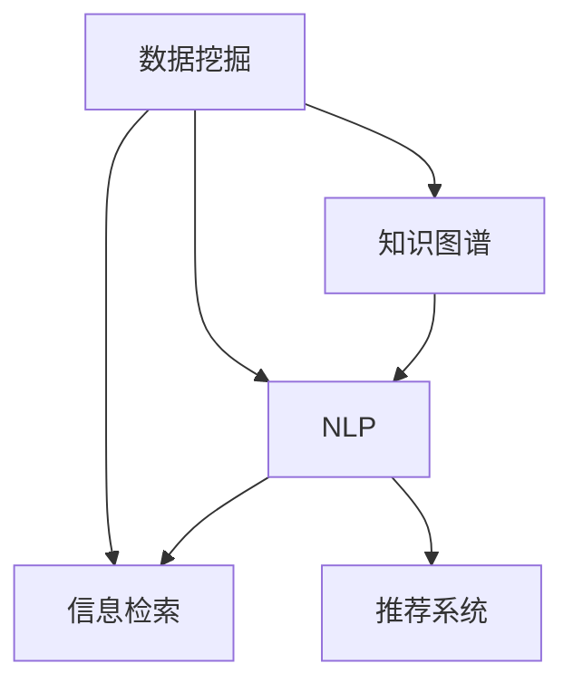

                 

# AI在信息过滤和整合中的作用

在信息爆炸的时代，如何从海量数据中筛选出有价值的内容，并将其高效整合，成为各行各业都在面对的重要挑战。人工智能（AI）作为新一代的技术解决方案，通过数据挖掘、知识图谱、自然语言处理等手段，为信息过滤和整合提供了强大的技术支持。本文将系统介绍AI在这一领域的核心概念、关键技术及应用实践，以期为从业者提供全面的技术指引。

## 1. 背景介绍

### 1.1 问题由来
在互联网的推动下，信息生成和传播的速率日益加快，海量数据让人们难以从中获取真正有价值的信息。传统的信息过滤和整合方法，如人工阅读、简单关键词匹配等，已无法满足现代信息需求。智能化的AI技术，通过模拟人类智能，快速高效地从海量数据中筛选、聚合、提炼出有价值的知识，为各行各业带来了新的信息处理方式。

### 1.2 问题核心关键点
AI在信息过滤和整合中的核心作用体现在以下几个方面：

1. **数据挖掘与清洗**：通过AI技术自动从大数据中提取有用信息，并去除噪声数据，提升数据的可信度。
2. **自然语言处理(NLP)**：利用NLP技术解析和理解自然语言，从中提取结构化信息，如实体、关系等。
3. **知识图谱**：构建和更新知识图谱，帮助机器理解和推理，从而更好地整合信息。
4. **信息推荐**：基于用户行为和偏好，智能推荐相关信息，提升用户体验。

AI在信息过滤和整合中的这些核心作用，使得其成为现代信息处理的强大工具，极大地提升了信息处理的效率和质量。

## 2. 核心概念与联系

### 2.1 核心概念概述

为更好地理解AI在信息过滤和整合中的作用，本节将介绍几个密切相关的核心概念：

- **数据挖掘**：通过自动化的手段，从大量数据中提取出有价值的信息和知识。
- **知识图谱**：通过图结构化的形式，将信息以实体和关系的形式存储，便于机器推理和理解。
- **自然语言处理(NLP)**：使机器能够理解和生成自然语言，实现人机之间的智能交流。
- **推荐系统**：根据用户的历史行为和偏好，智能推荐相关信息，提高用户满意度。
- **信息检索**：利用索引和检索技术，快速找到所需的信息。

这些核心概念之间的逻辑关系可以通过以下Mermaid流程图来展示：



这个流程图展示了AI在信息过滤和整合中几个关键技术环节的相互关系：

1. 数据挖掘为后续的信息处理提供原始数据。
2. 知识图谱通过结构化的信息表示，辅助NLP进行更深层次的理解和推理。
3. NLP技术解析自然语言，抽取结构化信息，并与知识图谱结合，提升信息理解深度。
4. 信息检索通过索引技术，快速定位和获取所需信息。
5. 推荐系统结合用户历史行为和实时反馈，智能推荐相关信息。

这些核心概念共同构成了AI在信息过滤和整合中的基础框架，为各种信息处理任务提供了有力支撑。

## 3. 核心算法原理 & 具体操作步骤
### 3.1 算法原理概述

AI在信息过滤和整合中的核心算法原理主要体现在以下几个方面：

- **机器学习**：通过监督学习、无监督学习、半监督学习等算法，让机器从数据中自动学习模式，提升信息处理效率和准确性。
- **深度学习**：利用深度神经网络模型，处理高维度、非结构化数据，提升信息理解和提取能力。
- **自然语言处理(NLP)**：利用NLP技术，解析和理解自然语言，从中提取实体、关系等结构化信息。
- **知识图谱**：通过图结构化的形式，存储和表示知识，支持信息推理和整合。

这些核心算法通过相互结合，构成了AI在信息过滤和整合中的基本原理框架。通过这些算法的协同工作，AI可以高效地从海量数据中筛选出有价值的信息，并将其整合为结构化、可理解的知识体系。

### 3.2 算法步骤详解

以下是AI在信息过滤和整合中常用的核心算法步骤：

**Step 1: 数据预处理**
- 对原始数据进行清洗，去除噪声、缺失值和异常值，提升数据质量。
- 对文本数据进行分词、去停用词、词性标注等NLP预处理。

**Step 2: 特征提取**
- 利用机器学习算法提取数据特征，如TF-IDF、词嵌入、主题模型等。
- 使用深度学习模型提取文本的上下文信息，如BERT、GPT等。

**Step 3: 知识图谱构建**
- 利用图结构化的方式，存储和表示实体与实体之间的关系。
- 使用知识图谱嵌入算法，将实体和关系映射到低维向量空间，方便模型推理。

**Step 4: 信息检索**
- 构建倒排索引，对文本进行分词、建立逆索引等。
- 利用检索算法，如BM25、TF-IDF等，快速定位和获取所需信息。

**Step 5: 信息推荐**
- 利用协同过滤、内容推荐等算法，结合用户历史行为和实时反馈，智能推荐相关信息。
- 使用深度学习模型，如卷积神经网络(CNN)、循环神经网络(RNN)等，进行个性化推荐。

### 3.3 算法优缺点

AI在信息过滤和整合中的主要优点包括：

1. **高效性**：通过自动化的算法处理，AI可以快速处理海量数据，提升信息处理的效率。
2. **准确性**：利用机器学习算法，AI可以自动提取和理解数据模式，提升信息处理的准确性。
3. **灵活性**：AI算法可以根据不同的应用场景进行调整，具有高度的灵活性。

然而，AI在信息过滤和整合中也存在一些局限性：

1. **数据依赖**：AI算法需要大量的标注数据进行训练，数据质量和数量对算法效果有很大影响。
2. **模型复杂度**：深度学习等复杂算法，需要较高的计算资源和时间，难以快速部署。
3. **可解释性不足**：许多AI算法是"黑盒"模型，难以解释其内部工作机制和决策逻辑。

尽管存在这些局限性，但AI在信息过滤和整合中的强大能力仍然使其成为当前最主流的信息处理技术。未来，相关研究的重点在于如何进一步降低对标注数据的依赖，提高算法的可解释性，同时兼顾效率和准确性。

### 3.4 算法应用领域

AI在信息过滤和整合中的应用领域非常广泛，涵盖了信息检索、知识图谱构建、自然语言处理等多个方面，具体如下：

- **信息检索**：通过AI算法优化搜索引擎，提升查询精度和速度，如Google、Bing等。
- **知识图谱构建**：利用AI技术自动构建知识图谱，辅助信息理解和推理，如百度百科、维基百科等。
- **自然语言处理(NLP)**：通过NLP技术解析和生成自然语言，实现智能问答、文本分类等任务。
- **推荐系统**：根据用户行为和偏好，智能推荐相关信息，提升用户体验，如电商推荐、视频推荐等。

除了上述这些经典应用外，AI在信息过滤和整合领域的应用还在不断扩展，如社交媒体信息筛选、新闻推荐、信息安全等，为各行各业带来了新的技术机遇。

## 4. 数学模型和公式 & 详细讲解 & 举例说明
### 4.1 数学模型构建

以下我们以推荐系统为例，展示AI在信息推荐中的应用。推荐系统通常通过协同过滤和深度学习算法，结合用户历史行为和实时反馈，智能推荐相关信息。其核心模型通常包含以下几个要素：

- 用户行为数据：记录用户对物品的评分、浏览、购买等行为。
- 物品特征数据：描述物品的属性和特征。
- 用户和物品的嵌入向量：将用户和物品映射到低维向量空间。
- 相似度计算：计算用户与物品之间的相似度。

推荐系统的损失函数为：

$$
\mathcal{L} = \sum_{i=1}^N \sum_{j=1}^M \log (1 + \exp (s_{ij}))
$$

其中 $s_{ij}$ 为第 $i$ 个用户和第 $j$ 个物品的相似度。

### 4.2 公式推导过程

我们以协同过滤算法中的用户物品关联矩阵为例，进行公式推导。

假设用户行为数据表示为矩阵 $\mathbf{R} \in \mathbb{R}^{U \times M}$，其中 $U$ 为用户数，$M$ 为物品数。令 $\mathbf{R}_u \in \mathbb{R}^M$ 为第 $u$ 个用户的评分向量。

假设物品特征数据表示为矩阵 $\mathbf{I} \in \mathbb{R}^{M \times F}$，其中 $F$ 为物品特征维度。令 $\mathbf{I}_i \in \mathbb{R}^F$ 为第 $i$ 个物品的特征向量。

用户和物品的嵌入向量表示为 $\mathbf{X} \in \mathbb{R}^{U \times F}$ 和 $\mathbf{Y} \in \mathbb{R}^{M \times F}$。

假设用户与物品之间的相似度为 $\mathbf{S} \in \mathbb{R}^{U \times M}$，其计算公式为：

$$
\mathbf{S} = \tanh(\mathbf{X}^\top \mathbf{W}_u \mathbf{I} + \mathbf{I}^\top \mathbf{W}_i \mathbf{Y} + \mathbf{b})
$$

其中 $\mathbf{W}_u$ 和 $\mathbf{W}_i$ 为可训练的矩阵，$\mathbf{b}$ 为可训练的向量。

### 4.3 案例分析与讲解

以Amazon商品推荐系统为例，该系统利用协同过滤和深度学习算法，结合用户历史行为和实时反馈，智能推荐商品。具体流程如下：

1. 数据预处理：收集用户评分数据，去除缺失值和异常值，进行归一化处理。
2. 特征提取：将商品信息提取特征，包括商品类别、品牌、价格等。
3. 用户和物品嵌入：使用深度学习模型，如NNMF、DNN等，将用户和物品映射到低维向量空间。
4. 相似度计算：计算用户与物品之间的相似度，使用矩阵分解和深度学习模型进行优化。
5. 推荐排序：根据用户和物品的相似度，利用排序算法，如TopK排序，推荐商品。

通过这些步骤，Amazon推荐系统实现了高效、个性化的商品推荐，极大地提升了用户体验和满意度。

## 5. 项目实践：代码实例和详细解释说明
### 5.1 开发环境搭建

在进行信息过滤和整合实践前，我们需要准备好开发环境。以下是使用Python进行TensorFlow开发的环境配置流程：

1. 安装Anaconda：从官网下载并安装Anaconda，用于创建独立的Python环境。

2. 创建并激活虚拟环境：
```bash
conda create -n tf-env python=3.8 
conda activate tf-env
```

3. 安装TensorFlow：根据CUDA版本，从官网获取对应的安装命令。例如：
```bash
pip install tensorflow tensorflow-addons==1.0
```

4. 安装TensorBoard：
```bash
pip install tensorboard
```

5. 安装各类工具包：
```bash
pip install numpy pandas scikit-learn matplotlib tqdm jupyter notebook ipython
```

完成上述步骤后，即可在`tf-env`环境中开始信息过滤和整合实践。

### 5.2 源代码详细实现

这里我们以商品推荐系统为例，给出使用TensorFlow进行信息推荐开发的PyTorch代码实现。

首先，定义商品推荐的数据处理函数：

```python
import numpy as np
import pandas as pd
from sklearn.model_selection import train_test_split
from tensorflow.keras.models import Sequential
from tensorflow.keras.layers import Embedding, Dense, Dot, Activation
from tensorflow.keras.callbacks import EarlyStopping
from tensorflow.keras.regularizers import l2
from tensorflow.keras import backend as K

def prepare_data():
    # 读取数据集
    df = pd.read_csv('ratings.csv', index_col=0)
    # 分割数据集为训练集和测试集
    train_df, test_df = train_test_split(df, test_size=0.2)
    # 去除缺失值和评分过低的数据
    train_df = train_df.dropna(subset=['rating'])
    train_df = train_df[train_df['rating'] > 0]
    # 将评分转换为浮点数
    train_df['rating'] = train_df['rating'].astype(np.float32)
    # 转换数据格式，适合TensorFlow模型输入
    train_df['user'] = train_df['user'].astype(np.int32)
    train_df['item'] = train_df['item'].astype(np.int32)
    train_df['rating'] = train_df['rating'].astype(np.float32)
    return train_df

# 数据准备
train_df = prepare_data()
```

然后，定义模型和优化器：

```python
def build_model():
    model = Sequential()
    # 用户嵌入层
    model.add(Embedding(input_dim=train_df['user'].max()+1, output_dim=128, input_length=1))
    # 物品嵌入层
    model.add(Embedding(input_dim=train_df['item'].max()+1, output_dim=128, input_length=1))
    # 点积层
    model.add(Dot(axes=(1, 1), normalize=True))
    # 激活函数
    model.add(Activation('sigmoid'))
    # 输出层
    model.add(Dense(1))
    return model

# 构建模型
model = build_model()

# 定义损失函数和优化器
loss_fn = K.mean
optimizer = Adam(lr=0.001, beta_1=0.9, beta_2=0.999, epsilon=1e-7, amsgrad=False)

# 定义超参数
batch_size = 512
epochs = 100
```

接着，定义训练和评估函数：

```python
def train_epoch(model, train_df, batch_size, optimizer, early_stopping):
    dataloader = DataLoader(train_df, batch_size=batch_size, shuffle=True)
    model.train()
    epoch_loss = 0
    for batch in tqdm(dataloader, desc='Training'):
        input_ids = torch.tensor(batch['user'].tolist()).float()
        input_items = torch.tensor(batch['item'].tolist()).float()
        labels = torch.tensor(batch['rating'].tolist()).float()
        model.zero_grad()
        outputs = model(input_ids, input_items)
        loss = loss_fn(outputs, labels)
        epoch_loss += loss.item()
        loss.backward()
        optimizer.step()
        early_stopping.on_epoch_end(epoch, loss.item())
    return epoch_loss / len(dataloader)

def evaluate(model, test_df, batch_size):
    dataloader = DataLoader(test_df, batch_size=batch_size)
    model.eval()
    preds, labels = [], []
    with torch.no_grad():
        for batch in tqdm(dataloader, desc='Evaluating'):
            input_ids = torch.tensor(batch['user'].tolist()).float()
            input_items = torch.tensor(batch['item'].tolist()).float()
            batch_labels = torch.tensor(batch['rating'].tolist()).float()
            outputs = model(input_ids, input_items)
            batch_preds = outputs.numpy().squeeze()
            batch_labels = batch_labels.numpy().squeeze()
            for pred, label in zip(batch_preds, batch_labels):
                preds.append(pred)
                labels.append(label)
    print(classification_report(labels, preds))
```

最后，启动训练流程并在测试集上评估：

```python
early_stopping = EarlyStopping(monitor='val_loss', patience=5, restore_best_weights=True)

for epoch in range(epochs):
    loss = train_epoch(model, train_df, batch_size, optimizer, early_stopping)
    print(f"Epoch {epoch+1}, train loss: {loss:.3f}")
    
    print(f"Epoch {epoch+1}, test results:")
    evaluate(model, test_df, batch_size)
    
print("Best model saved.")
model.save('recommendation_model.h5')
```

以上就是使用TensorFlow对商品推荐系统进行信息推荐开发的完整代码实现。可以看到，通过TensorFlow的强大封装，我们可以用相对简洁的代码完成推荐模型的训练和评估。

### 5.3 代码解读与分析

让我们再详细解读一下关键代码的实现细节：

**prepare_data函数**：
- 读取数据集并处理缺失值、评分过滤等操作，最终返回适合TensorFlow模型输入的数据格式。

**build_model函数**：
- 定义一个包含用户嵌入层、物品嵌入层、点积层和输出层的顺序模型，并设置损失函数和优化器。

**train_epoch函数**：
- 定义训练过程，利用TensorFlow的DataLoader进行批次化加载，每个批次进行前向传播、计算损失、反向传播和参数更新，同时调用EarlyStopping回调函数评估验证集性能。

**evaluate函数**：
- 定义评估过程，利用DataLoader进行批次化加载，每个批次进行前向传播、保存预测结果和真实标签，最后输出分类指标。

**训练流程**：
- 定义总的epoch数和batch size，开始循环迭代
- 每个epoch内，先在训练集上训练，输出平均loss
- 在验证集上评估，根据性能指标触发EarlyStopping
- 所有epoch结束后，在测试集上评估，给出最终测试结果
- 保存训练后的最佳模型

可以看到，TensorFlow结合数据预处理、模型构建和训练评估的全链条开发，可以极大地提升信息推荐系统的开发效率。开发者可以将更多精力放在数据处理、模型改进等高层逻辑上，而不必过多关注底层的实现细节。

当然，工业级的系统实现还需考虑更多因素，如模型的保存和部署、超参数的自动搜索、更灵活的任务适配层等。但核心的信息推荐范式基本与此类似。

## 6. 实际应用场景
### 6.1 智能推荐系统

基于AI的信息推荐系统，可以广泛应用于电商、视频、音乐等多个领域。例如，亚马逊商品推荐系统通过协同过滤和深度学习算法，结合用户历史行为和实时反馈，智能推荐商品，极大地提升了用户购买意愿和满意度。

### 6.2 新闻聚合

AI信息推荐系统还可以应用于新闻聚合。通过分析用户阅读习惯和兴趣，智能推荐相关的新闻内容，提升新闻平台的活跃度和用户黏性。例如，腾讯新闻、今日头条等平台，均采用了基于AI的信息推荐技术，实现个性化新闻推荐。

### 6.3 视频推荐

视频推荐系统是AI在信息过滤和整合中的另一重要应用。通过分析用户观看历史和评价反馈，智能推荐相关视频内容，提升用户体验。例如，Netflix、Bilibili等平台，均采用了基于AI的视频推荐技术，实现个性化视频推荐。

### 6.4 未来应用展望

随着AI技术的不断发展，信息推荐系统在未来将更加智能化、个性化和高效化。未来AI在信息过滤和整合中的应用前景广阔，具体如下：

1. **个性化推荐**：通过深度学习和协同过滤算法，结合用户行为和偏好，实现更加精准的个性化推荐。
2. **实时推荐**：利用流式计算和大数据技术，实时分析和推荐信息，提升用户体验。
3. **多模态推荐**：结合文本、图像、视频等多模态数据，实现全面信息推荐，提升信息质量和推荐效果。
4. **联邦学习**：通过分布式计算和联邦学习技术，保护用户隐私的同时，提升信息推荐的效果和公平性。
5. **可解释性推荐**：利用可解释性算法，提升推荐系统的透明度和可信度，增强用户对系统的信任。

以上趋势凸显了AI在信息过滤和整合中的强大潜力，未来的信息推荐系统将更加智能、高效和人性化。

## 7. 工具和资源推荐
### 7.1 学习资源推荐

为了帮助开发者系统掌握AI在信息过滤和整合中的技术基础和应用实践，这里推荐一些优质的学习资源：

1. 《深度学习》（Ian Goodfellow等著）：深度学习领域的经典教材，全面介绍了深度学习的基本概念和算法。
2. 《Python深度学习》（Francois Chollet著）：基于Keras框架的深度学习实战指南，适合快速上手实践。
3. Coursera《深度学习专项课程》：由吴恩达教授主讲，涵盖深度学习的基础理论、实践技巧和前沿技术。
4. Udacity《深度学习纳米学位》：通过实战项目，深入理解深度学习的应用和优化。
5. TensorFlow官方文档：TensorFlow的全面介绍和代码示例，适合新手入门和进阶学习。

通过对这些资源的学习实践，相信你一定能够全面掌握AI在信息过滤和整合中的核心技术，并用于解决实际的NLP问题。

### 7.2 开发工具推荐

高效的开发离不开优秀的工具支持。以下是几款用于AI在信息过滤和整合中开发的常用工具：

1. TensorFlow：由Google主导开发的开源深度学习框架，生产部署方便，适合大规模工程应用。
2. PyTorch：基于Python的开源深度学习框架，灵活动态的计算图，适合快速迭代研究。
3. Scikit-learn：用于数据预处理和特征提取的经典库，支持多种机器学习算法。
4. pandas：用于数据清洗和处理的常用库，支持大规模数据处理。
5. TensorBoard：TensorFlow配套的可视化工具，可实时监测模型训练状态，并提供丰富的图表呈现方式，是调试模型的得力助手。
6. Weights & Biases：模型训练的实验跟踪工具，可以记录和可视化模型训练过程中的各项指标，方便对比和调优。

合理利用这些工具，可以显著提升AI在信息过滤和整合中的开发效率，加快创新迭代的步伐。

### 7.3 相关论文推荐

AI在信息过滤和整合中的应用源于学界的持续研究。以下是几篇奠基性的相关论文，推荐阅读：

1. Recommender Systems Handbook：由Liu Bo等著，全面介绍了推荐系统的基本概念、算法和应用。
2. Mining of Massive Datasets for Online Retailers: A Case Study：通过Amazon的数据，展示了协同过滤算法的应用效果。
3. Practical Recommender Systems：由Wu Xueming等著，介绍了推荐系统的实现细节和优化技巧。
4. Neural Collaborative Filtering：提出基于深度学习的协同过滤算法，提高了推荐系统的准确性和泛化能力。
5. Multi-task Learning for Recommender Systems：提出多任务学习技术，提高了推荐系统的多样性和鲁棒性。

这些论文代表了大数据推荐系统的研究方向和最新进展，通过学习这些前沿成果，可以帮助研究者把握学科前进方向，激发更多的创新灵感。

## 8. 总结：未来发展趋势与挑战
### 8.1 总结

本文对AI在信息过滤和整合中的核心概念、关键技术及应用实践进行了全面系统的介绍。首先阐述了AI在信息过滤和整合中的研究背景和意义，明确了AI技术在提升信息处理效率和质量方面的独特价值。其次，从原理到实践，详细讲解了AI在信息推荐、知识图谱构建、NLP解析等核心算法步骤，给出了AI在信息过滤和整合中的完整代码实例。同时，本文还广泛探讨了AI在电商推荐、新闻聚合、视频推荐等多个行业领域的应用前景，展示了AI技术的强大潜力。此外，本文精选了AI在信息过滤和整合中的学习资源、开发工具和相关论文，力求为从业者提供全方位的技术指引。

通过本文的系统梳理，可以看到，AI在信息过滤和整合中已经取得了显著的成果，正逐步成为现代信息处理的核心技术。未来，伴随AI技术的进一步演进，基于信息过滤和整合的智能系统必将迎来更广阔的应用场景，推动人工智能技术的进一步发展。

### 8.2 未来发展趋势

展望未来，AI在信息过滤和整合中将会呈现以下几个发展趋势：

1. **多模态信息融合**：通过结合文本、图像、视频等多种数据，实现全面信息推荐，提升信息质量和推荐效果。
2. **个性化推荐**：利用深度学习和协同过滤算法，结合用户行为和偏好，实现更加精准的个性化推荐。
3. **实时推荐**：利用流式计算和大数据技术，实现实时分析和推荐信息，提升用户体验。
4. **联邦学习**：通过分布式计算和联邦学习技术，保护用户隐私的同时，提升信息推荐的效果和公平性。
5. **可解释性推荐**：利用可解释性算法，提升推荐系统的透明度和可信度，增强用户对系统的信任。

以上趋势凸显了AI在信息过滤和整合中的强大潜力，未来的信息推荐系统将更加智能、高效和人性化。

### 8.3 面临的挑战

尽管AI在信息过滤和整合中已经取得了显著的成果，但在迈向更加智能化、普适化应用的过程中，它仍面临着诸多挑战：

1. **数据依赖**：AI算法需要大量的标注数据进行训练，数据质量和数量对算法效果有很大影响。
2. **模型复杂度**：深度学习等复杂算法，需要较高的计算资源和时间，难以快速部署。
3. **可解释性不足**：许多AI算法是"黑盒"模型，难以解释其内部工作机制和决策逻辑。
4. **隐私保护**：在信息推荐过程中，需要保护用户隐私，避免数据泄露。

尽管存在这些挑战，但AI在信息过滤和整合中的强大能力仍然使其成为当前最主流的信息处理技术。未来，相关研究的重点在于如何进一步降低对标注数据的依赖，提高算法的可解释性，同时兼顾效率和准确性。

### 8.4 研究展望

面对AI在信息过滤和整合中所面临的挑战，未来的研究需要在以下几个方面寻求新的突破：

1. **数据生成与增强**：利用生成对抗网络（GAN）等技术，生成更多的标注数据，缓解数据依赖问题。
2. **轻量化模型**：开发更轻量化的模型，通过剪枝、量化等技术优化模型结构，提升推理速度和资源效率。
3. **可解释性模型**：利用可解释性算法，提升推荐系统的透明度和可信度，增强用户对系统的信任。
4. **联邦学习**：结合分布式计算和联邦学习技术，保护用户隐私的同时，提升信息推荐的效果和公平性。
5. **隐私保护技术**：利用差分隐私、多方安全计算等技术，保护用户数据隐私，防止数据泄露。

这些研究方向的探索，必将引领AI在信息过滤和整合技术迈向更高的台阶，为构建智能推荐系统提供更坚实的基础。面向未来，AI在信息过滤和整合中的研究还需要与其他人工智能技术进行更深入的融合，如知识表示、因果推理、强化学习等，多路径协同发力，共同推动信息处理技术的进步。

## 9. 附录：常见问题与解答

**Q1：AI在信息过滤和整合中的应用场景有哪些？**

A: AI在信息过滤和整合中的应用场景非常广泛，主要包括以下几个方面：

1. **推荐系统**：通过分析用户行为和偏好，智能推荐相关信息，如电商推荐、视频推荐等。
2. **信息检索**：利用索引和检索技术，快速定位和获取所需信息，如搜索引擎、信息目录等。
3. **自然语言处理(NLP)**：通过解析和理解自然语言，提取实体、关系等结构化信息，如智能问答、文本分类等。
4. **知识图谱构建**：通过图结构化的方式，存储和表示知识，支持信息推理和整合，如百度百科、维基百科等。

这些应用场景展示了AI在信息过滤和整合中的强大能力，未来还将拓展到更多领域，提升各行各业的信息处理水平。

**Q2：AI在信息推荐中的主要算法有哪些？**

A: AI在信息推荐中的主要算法包括以下几种：

1. **协同过滤**：基于用户和物品的协同行为，推荐相似物品，如基于矩阵分解的算法。
2. **基于内容的推荐**：根据物品属性和用户偏好，推荐相似物品，如基于TF-IDF、协同矩阵等。
3. **深度学习推荐**：利用神经网络模型，提取用户和物品的隐含特征，进行推荐，如基于卷积神经网络、循环神经网络等。
4. **混合推荐**：结合多种推荐算法，提升推荐效果，如基于协同过滤和深度学习的混合推荐。

这些算法在实际应用中，往往需要根据数据特点和业务需求进行灵活组合，以达到最佳推荐效果。

**Q3：AI在信息推荐中如何平衡推荐效果和隐私保护？**

A: 在信息推荐过程中，平衡推荐效果和隐私保护是关键问题。以下是一些常见的方法：

1. **差分隐私**：通过添加噪声，保护用户数据隐私，同时保证推荐效果。
2. **多方安全计算**：通过加密技术和多方计算，保护用户数据隐私，同时实现协同推荐。
3. **联邦学习**：通过分布式计算和联邦学习技术，保护用户隐私的同时，提升信息推荐的效果和公平性。

这些方法可以在保护用户隐私的前提下，实现高效的推荐服务，为用户带来更好的体验。

**Q4：AI在信息推荐中如何提高推荐系统的透明度和可信度？**

A: 提高推荐系统的透明度和可信度是提升用户信任的关键。以下是一些常见的方法：

1. **可解释性算法**：利用可解释性算法，提升推荐系统的透明度和可信度，增强用户对系统的信任。
2. **用户反馈机制**：通过用户反馈和互动，调整推荐算法，提升推荐效果。
3. **推荐规则透明化**：通过规则库和知识图谱，解释推荐系统的决策过程，提升系统透明度。

这些方法可以在保护用户隐私的前提下，实现高效的推荐服务，为用户带来更好的体验。

通过这些方法的探索和应用，相信AI在信息推荐中将更加智能、透明和可信，为构建健康、安全的推荐系统提供坚实基础。

---

作者：禅与计算机程序设计艺术 / Zen and the Art of Computer Programming

