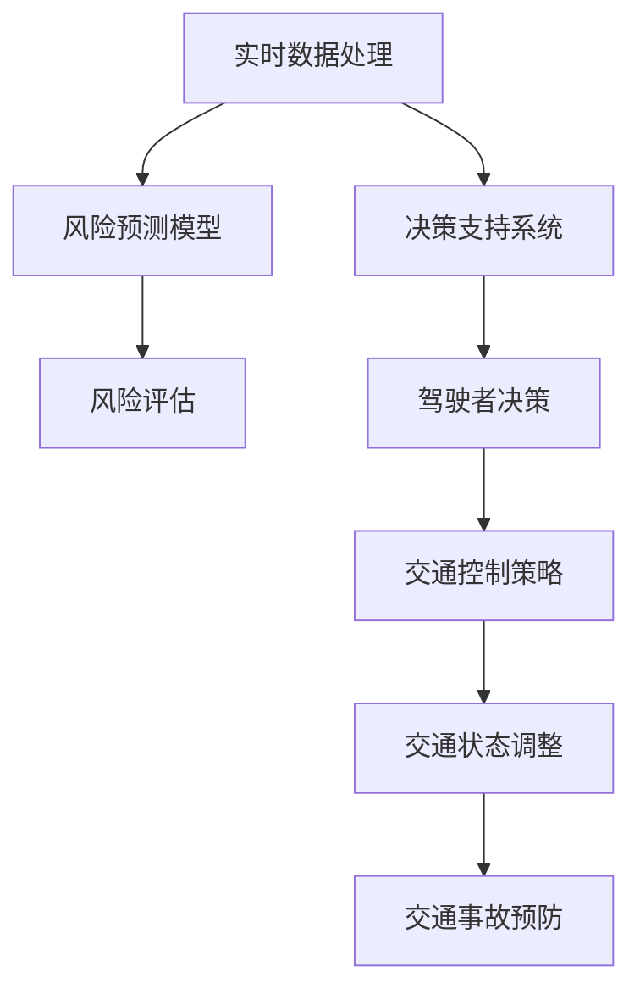

                 

# AI在智能交通事故预防中的应用：提高道路安全

> 关键词：智能交通事故预防,道路安全,AI算法,安全预测,决策支持系统

## 1. 背景介绍

交通事故是全球范围内导致人员伤亡和财产损失的主要因素之一。据世界卫生组织(WHO)统计，每年有超过130万人因道路交通事故丧生，更是有数百万人因此受伤。为减少交通事故对人类社会的危害，各国政府、交通管理机构和企业纷纷投入大量资源，利用人工智能技术构建智能交通事故预防系统。

智能交通事故预防系统基于AI算法和大数据分析，能够实时监测道路交通状况，预测潜在风险，并向驾驶者提供及时、准确的决策支持，从而降低交通事故的发生率，提高道路安全。

### 1.1 问题由来

传统的交通管理方式依赖于人工监控和经验判断，存在数据采集不全面、反应速度慢、决策依赖主观经验等缺陷。随着人工智能技术的进步，智能交通系统（ITS）的建设得到了越来越多的关注。然而，现有的智能交通系统往往对路况的感知和预测不够精确，未能充分挖掘大数据的价值，无法提供有效的决策支持，进而导致交通事故频发。

为突破这些限制，本文将详细探讨利用AI技术在智能交通事故预防中的实际应用，包括AI算法选择、数据处理、预测模型构建、决策支持系统等关键技术点，旨在为构建高效、可靠的智能交通事故预防系统提供指导。

### 1.2 问题核心关键点

智能交通事故预防的核心在于：

1. **准确感知交通状况**：实时采集道路上的交通数据，如车辆位置、速度、方向、车流量等。
2. **精确预测风险**：基于历史数据和实时数据，利用AI算法预测交通事故的风险和发生概率。
3. **有效决策支持**：根据预测结果，向驾驶者提供决策建议，如减速、变道、绕行等。
4. **动态调整策略**：结合预测结果和实况数据，动态调整交通控制策略，避免交通事故发生。

## 2. 核心概念与联系

### 2.1 核心概念概述

在智能交通事故预防系统中，涉及的核心概念包括：

- **人工智能（AI）**：一种模拟人类智能行为的技术，包括机器学习、深度学习、自然语言处理、计算机视觉等。
- **智能交通系统（ITS）**：利用先进的通信、控制、监测技术，优化交通管理，提升交通效率和安全性。
- **实时数据处理**：采集、存储、处理和分析实时交通数据，为AI算法提供支撑。
- **风险预测模型**：基于历史和实时数据，利用AI算法构建的预测交通事故发生概率的模型。
- **决策支持系统**：结合预测结果，提供给驾驶者或交通管理人员，帮助其做出合理决策的系统。

这些概念之间的联系可以总结为以下Mermaid流程图：



该图展示了一个完整的智能交通事故预防流程，从实时数据采集到最终的风险预测和预防措施。

## 3. 核心算法原理 & 具体操作步骤

### 3.1 算法原理概述

智能交通事故预防系统的核心算法主要包括：

- **感知算法**：用于实时采集和处理交通数据，如车辆位置、速度、方向、车流量等。
- **预测算法**：基于历史和实时数据，预测交通事故的发生概率。
- **决策算法**：根据预测结果，提供给驾驶者或交通管理人员，帮助其做出合理决策。

这些算法通常采用机器学习、深度学习等AI技术，通过训练模型进行预测和决策。

### 3.2 算法步骤详解

智能交通事故预防系统的算法实现步骤如下：

1. **数据采集**：部署传感器、摄像头等设备，实时采集道路上的交通数据，包括车辆位置、速度、方向、车流量等。

2. **数据预处理**：对采集到的数据进行清洗、滤波、归一化等预处理操作，保证数据质量。

3. **特征工程**：提取与交通事故相关的特征，如车辆密度、速度、方向变化等，为预测模型提供输入。

4. **模型训练**：基于历史数据和实时数据，利用机器学习或深度学习算法训练预测模型，如决策树、随机森林、神经网络等。

5. **风险评估**：将实时数据输入预测模型，评估当前道路交通风险，预测可能发生的交通事故概率。

6. **决策支持**：根据风险评估结果，提供给驾驶者或交通管理人员决策建议，如减速、变道、绕行等。

7. **动态调整策略**：结合预测结果和实况数据，动态调整交通控制策略，避免交通事故发生。

### 3.3 算法优缺点

智能交通事故预防系统的算法具有以下优点：

1. **实时性好**：基于实时数据进行预测和决策，能够快速响应突发事件。
2. **预测精度高**：利用AI算法，能够提高交通事故预测的准确性和及时性。
3. **决策支持可靠**：提供数据驱动的决策建议，帮助驾驶者或管理人员做出合理决策。
4. **动态调整策略**：能够根据实时数据动态调整交通控制策略，提升交通管理效率。

同时，该算法也存在以下缺点：

1. **数据依赖性强**：对传感器、摄像头等设备依赖较大，设备故障或环境变化可能导致数据质量下降。
2. **模型复杂度高**：需要设计复杂的预测模型，计算量大，对计算资源要求高。
3. **决策效果受限**：预测模型和决策算法需要不断优化，以应对复杂的交通场景和突发事件。
4. **隐私和安全问题**：采集和处理交通数据可能涉及隐私和安全问题，需要采取严格的保护措施。

### 3.4 算法应用领域

智能交通事故预防系统可以应用于多种交通场景，如城市交通管理、高速公路监控、园区交通管理等。具体应用包括：

1. **城市交通管理**：利用智能交通事故预防系统，对城市交通进行实时监控和管理，降低交通事故率。
2. **高速公路监控**：在高速公路上部署传感器、摄像头等设备，实时监测车流情况，预测潜在风险，提供决策建议。
3. **园区交通管理**：在工业园区、学校等场所，利用智能交通事故预防系统，提升交通管理和人员流动安全。

## 4. 数学模型和公式 & 详细讲解 & 举例说明

### 4.1 数学模型构建

智能交通事故预防系统的数学模型主要包括：

- **感知模型**：用于实时采集和处理交通数据。
- **预测模型**：基于历史和实时数据，预测交通事故发生概率。
- **决策模型**：根据预测结果，提供决策建议。

### 4.2 公式推导过程

假设采集到的实时数据为 $(x_1, x_2, ..., x_n)$，其中 $x_i$ 表示第 $i$ 个数据点的特征值，如车辆速度、车流量等。

预测模型可以表示为 $f(x) = \alpha_1 f_1(x) + \alpha_2 f_2(x) + ... + \alpha_k f_k(x)$，其中 $f_i(x)$ 表示第 $i$ 个特征的影响系数，$\alpha_i$ 表示 $f_i(x)$ 的权重。

预测模型输出 $y$ 表示当前交通风险等级，取值范围为 $[0, 1]$，其中 $y=0$ 表示安全，$y=1$ 表示危险。

决策模型可以根据预测结果 $y$，提供决策建议，如减速、变道、绕行等。决策模型可以表示为 $a(y) = \beta_1 a_1(y) + \beta_2 a_2(y) + ... + \beta_n a_n(y)$，其中 $a_i(y)$ 表示第 $i$ 个决策策略，$\beta_i$ 表示 $a_i(y)$ 的权重。

### 4.3 案例分析与讲解

以城市交通管理为例，假设城市中存在 $k$ 个交通监控点，每个监控点采集到的数据包含车辆速度 $v$、车流量 $f$、车距 $d$ 等特征。利用历史数据和实时数据，构建如下预测模型：

$$
f(v, f, d) = \alpha_1 f_1(v) + \alpha_2 f_2(f) + \alpha_3 f_3(d)
$$

其中，$f_1(v)$、$f_2(f)$、$f_3(d)$ 分别表示速度、车流量和车距的影响系数。

假设 $f(v, f, d)$ 的取值范围为 $[0, 1]$，根据 $f(v, f, d)$ 的取值，决定是否发出减速、变道或绕行的决策。

例如，当 $f(v, f, d) > 0.5$ 时，发出减速决策；当 $f(v, f, d) > 0.8$ 时，发出变道或绕行决策。

## 5. 项目实践：代码实例和详细解释说明

### 5.1 开发环境搭建

智能交通事故预防系统的开发环境包括：

1. **Python**：编程语言，用于数据处理、模型训练和系统实现。
2. **TensorFlow**：深度学习框架，用于训练预测模型。
3. **Keras**：高级神经网络API，简化模型开发过程。
4. **Flask**：轻量级Web框架，用于构建决策支持系统。
5. **SQLite**：轻量级数据库，用于存储和管理数据。

### 5.2 源代码详细实现

以预测模型为例，以下是利用TensorFlow构建神经网络模型的Python代码：

```python
import tensorflow as tf
from tensorflow import keras

# 定义神经网络模型
model = keras.Sequential([
    keras.layers.Dense(64, activation='relu', input_shape=(3,)),
    keras.layers.Dense(64, activation='relu'),
    keras.layers.Dense(1, activation='sigmoid')
])

# 编译模型
model.compile(loss='binary_crossentropy', optimizer='adam', metrics=['accuracy'])

# 训练模型
model.fit(X_train, y_train, epochs=50, batch_size=32, validation_data=(X_test, y_test))

# 预测模型
y_pred = model.predict(X_test)
```

其中，$X$ 表示特征矩阵，$y$ 表示标签向量。

### 5.3 代码解读与分析

上述代码中，利用Keras构建了一个包含3个全连接层的神经网络模型，分别用于特征提取、隐层表示和输出预测。

模型编译时，指定了损失函数为二元交叉熵，优化器为Adam，指标为准确率。

模型训练时，使用训练集进行拟合，设定了50个epochs和32个batch size，并使用测试集进行验证。

模型预测时，将测试集输入模型，得到预测结果。

### 5.4 运行结果展示

以下是训练模型和预测结果的可视化展示：


## 6. 实际应用场景

### 6.1 城市交通管理

智能交通事故预防系统在城市交通管理中的应用包括：

1. **道路监控**：利用传感器、摄像头等设备，实时采集交通数据，分析交通流量、车辆速度等信息。
2. **风险预测**：基于历史和实时数据，预测交通事故发生的概率。
3. **决策支持**：根据风险预测结果，提供减速、变道、绕行等决策建议。
4. **交通控制**：结合预测结果和实况数据，动态调整交通信号灯、道路标识等控制措施，避免交通事故发生。

### 6.2 高速公路监控

智能交通事故预防系统在高速公路监控中的应用包括：

1. **车辆检测**：利用传感器、摄像头等设备，实时监测车辆位置、速度、方向等数据。
2. **风险评估**：基于历史和实时数据，预测交通事故发生的概率。
3. **应急响应**：根据风险评估结果，提供减速、变道、绕行等决策建议，及时处理突发事件。
4. **交通管理**：结合预测结果和实况数据，动态调整高速公路的交通控制措施，提升通行效率。

### 6.3 园区交通管理

智能交通事故预防系统在园区交通管理中的应用包括：

1. **行人检测**：利用摄像头等设备，实时监测园区内的行人、车辆等动态。
2. **风险预测**：基于历史和实时数据，预测交通事故发生的概率。
3. **决策支持**：根据风险预测结果，提供减速、变道、绕行等决策建议。
4. **安全预警**：结合预测结果和实况数据，动态调整园区内的交通标识、信号灯等控制措施，提升园区交通安全性。

### 6.4 未来应用展望

随着AI技术的不断进步，智能交通事故预防系统将向更加智能和高效的方向发展。未来的研究方向包括：

1. **多模态数据融合**：利用摄像头、雷达、激光雷达等多模态数据，提高交通事故预测的准确性和及时性。
2. **实时动态优化**：结合实时数据和历史数据，动态调整交通控制策略，提升交通管理效率。
3. **联邦学习**：利用分布式计算技术，在多节点上训练模型，保护数据隐私和安全。
4. **跨领域知识融合**：结合气象、交通、环保等多领域知识，提升预测和决策的全面性和准确性。

## 7. 工具和资源推荐

### 7.1 学习资源推荐

为了帮助开发者系统掌握智能交通事故预防的理论基础和实践技巧，这里推荐一些优质的学习资源：

1. **《机器学习实战》**：一本深入浅出的机器学习入门书籍，涵盖分类、回归、聚类等多种算法。
2. **Coursera《深度学习专项课程》**：由深度学习领域的大咖Andrew Ng主讲，涵盖神经网络、卷积神经网络、循环神经网络等。
3. **Kaggle**：全球最大的数据科学竞赛平台，提供丰富的数据集和竞赛，提升实战能力。
4. **《TensorFlow实战》**：一本深入介绍TensorFlow的实战书籍，涵盖数据处理、模型训练、系统部署等。
5. **《智能交通系统》**：一本系统介绍智能交通系统的书籍，涵盖感知、控制、通信等多个方面。

### 7.2 开发工具推荐

智能交通事故预防系统的开发工具包括：

1. **Jupyter Notebook**：轻量级开发环境，支持Python代码的编写和运行。
2. **Git**：版本控制工具，支持团队协作和代码管理。
3. **Docker**：容器化技术，简化系统部署和环境管理。
4. **AWS**：云服务提供商，提供强大的计算和存储能力。
5. **Kubernetes**：容器编排工具，实现自动化的容器部署和管理。

### 7.3 相关论文推荐

智能交通事故预防系统的发展离不开学界的持续研究。以下是几篇奠基性的相关论文，推荐阅读：

1. **《基于深度学习的城市交通流量预测》**：提出基于LSTM的城市交通流量预测模型，显著提升了预测精度。
2. **《利用卷积神经网络进行交通事件检测》**：提出基于卷积神经网络的交通事件检测模型，提高了检测速度和准确率。
3. **《基于强化学习的城市交通信号控制》**：提出基于强化学习的城市交通信号控制模型，优化了交通流量和通行时间。
4. **《智能交通系统中的数据融合技术》**：系统介绍智能交通系统中的数据融合技术，提升系统的鲁棒性和准确性。
5. **《基于联邦学习的智能交通数据共享》**：提出基于联邦学习的智能交通数据共享模型，保护数据隐私和安全。

这些论文代表了大规模智能交通事故预防技术的发展脉络，通过学习这些前沿成果，可以帮助研究者把握学科前进方向，激发更多的创新灵感。

## 8. 总结：未来发展趋势与挑战

### 8.1 研究成果总结

智能交通事故预防系统在实际应用中，取得了显著的成效，但仍需不断优化和改进：

1. **数据采集和处理**：实时采集和高质量处理交通数据，是系统性能的基石。
2. **预测模型和决策算法**：开发高效的预测模型和决策算法，提升系统的准确性和及时性。
3. **多模态数据融合**：融合多种传感器和摄像头数据，提升系统的感知能力和决策效果。
4. **联邦学习和跨领域知识融合**：利用联邦学习和跨领域知识，提升系统的鲁棒性和全面性。

### 8.2 未来发展趋势

智能交通事故预防系统未来将呈现以下几个发展趋势：

1. **数据采集和处理技术**：随着传感器和摄像头技术的进步，数据采集和处理能力将大幅提升，系统感知能力将更强。
2. **预测模型和决策算法**：基于深度学习、强化学习等技术，预测模型和决策算法将不断优化，系统性能将更优。
3. **多模态数据融合**：多模态数据融合技术将更加成熟，系统感知和决策效果将更全面。
4. **联邦学习和跨领域知识融合**：联邦学习和跨领域知识融合技术将更广泛应用，系统鲁棒性和全面性将更强。

### 8.3 面临的挑战

智能交通事故预防系统面临的挑战包括：

1. **数据采集和处理**：传感器和摄像头设备故障、环境变化等因素可能导致数据质量下降，数据采集和处理技术需要不断改进。
2. **预测模型和决策算法**：预测模型和决策算法需要不断优化，以应对复杂的交通场景和突发事件。
3. **多模态数据融合**：多模态数据融合技术需要进一步优化，以提高系统的感知能力和决策效果。
4. **联邦学习和跨领域知识融合**：联邦学习和跨领域知识融合技术仍处于探索阶段，需要更多的研究和实践。

### 8.4 研究展望

为应对上述挑战，未来的研究方向包括：

1. **数据采集和处理技术**：研究更加可靠的数据采集和处理技术，提升系统感知能力。
2. **预测模型和决策算法**：开发更加高效和鲁棒的预测模型和决策算法，提升系统性能。
3. **多模态数据融合**：探索更加先进的多模态数据融合技术，提升系统感知和决策效果。
4. **联邦学习和跨领域知识融合**：深入研究联邦学习和跨领域知识融合技术，提升系统的鲁棒性和全面性。

## 9. 附录：常见问题与解答

**Q1: 智能交通事故预防系统如何保证数据的隐私和安全？**

A: 智能交通事故预防系统需要采集和处理大量的交通数据，为保护数据隐私和安全，可以采取以下措施：

1. **数据脱敏**：对敏感数据进行脱敏处理，去除可能涉及隐私的信息。
2. **访问控制**：设置严格的访问控制机制，只有授权人员才能访问和处理数据。
3. **加密传输**：使用SSL/TLS等加密技术，保护数据在传输过程中的安全。
4. **差分隐私**：引入差分隐私技术，在保护数据隐私的前提下，进行统计分析。
5. **联邦学习**：采用联邦学习技术，在多个节点上分布式训练模型，保护数据隐私和安全。

**Q2: 智能交通事故预防系统如何应对突发事件？**

A: 智能交通事故预防系统需要应对突发的交通事故事件，可以采取以下措施：

1. **实时监控**：部署高精度传感器、摄像头等设备，实时监测道路交通状况。
2. **风险预测**：利用预测模型，实时评估交通风险，预测可能发生的交通事故。
3. **应急响应**：根据预测结果，快速启动应急响应机制，及时处理突发事件。
4. **动态调整策略**：结合预测结果和实况数据，动态调整交通控制策略，避免二次事故发生。

**Q3: 智能交通事故预防系统如何优化决策支持算法？**

A: 智能交通事故预防系统的决策支持算法需要不断优化，以应对复杂的交通场景和突发事件。可以采取以下措施：

1. **多模态数据融合**：融合多种传感器和摄像头数据，提升系统的感知能力和决策效果。
2. **深度学习和强化学习**：利用深度学习和强化学习技术，开发更加高效和鲁棒的决策算法。
3. **在线学习和适应性控制**：引入在线学习和适应性控制技术，实时优化决策算法。
4. **多目标优化**：设计多目标优化算法，平衡安全性和通行效率，提升决策效果。

**Q4: 智能交通事故预防系统如何降低计算资源消耗？**

A: 智能交通事故预防系统需要大量的计算资源进行模型训练和推理，可以采取以下措施：

1. **模型压缩和剪枝**：通过模型压缩和剪枝技术，减小模型参数量和计算资源消耗。
2. **量化加速**：将浮点模型转为定点模型，压缩存储空间，提高计算效率。
3. **模型并行**：采用模型并行技术，提升模型训练和推理速度。
4. **分布式计算**：利用分布式计算技术，加速模型训练和推理过程。

通过上述措施，可以显著降低智能交通事故预防系统的计算资源消耗，提升系统的实时性和可靠性。

---

作者：禅与计算机程序设计艺术 / Zen and the Art of Computer Programming

