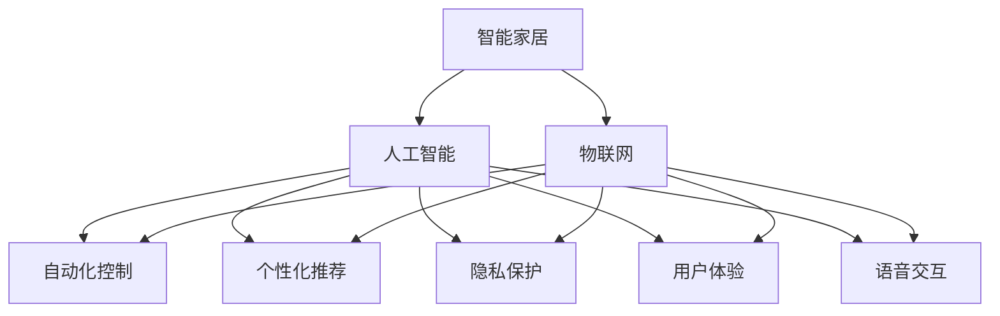

                 

# AI在智能家居中的应用：提高生活质量

> 关键词：智能家居,人工智能,生活质量,自动化,物联网,机器学习,隐私保护,用户体验,未来展望

## 1. 背景介绍

### 1.1 问题由来
随着技术的快速发展和人民生活水平的不断提高，智能家居已经不再是科幻电影中的概念，而是逐步走进了千家万户。智能家居系统通过将家电、安防、娱乐、环境控制等家居设备接入网络，实现远程控制、智能化集成和个性化定制，极大地提升了用户的生活质量。然而，当前智能家居系统中普遍存在自动化水平不高、设备互联互通性差、用户体验不佳等问题，亟需通过人工智能技术进行深度优化和升级。

### 1.2 问题核心关键点
AI技术在智能家居中的应用，主要体现在以下几个方面：

- 自动化和智能化：通过智能感知和推理，实现家居设备的自主决策和自动化控制。
- 互联互通性：建立设备之间的通信协议，实现数据的无缝共享和协同工作。
- 用户体验优化：利用个性化推荐和自适应学习，提升用户互动的智能性。
- 隐私保护：在数据采集和处理过程中，保护用户隐私，避免信息泄露。
- 未来展望：AI技术将进一步深入家居领域，实现环境智能调节、情感智能交互等高级功能。

这些核心关键点共同构成了AI在智能家居中的应用框架，为其未来发展提供了明确的指导方向。

## 2. 核心概念与联系

### 2.1 核心概念概述

为更好地理解AI在智能家居中的应用，本节将介绍几个密切相关的核心概念：

- 智能家居：通过物联网技术和智能设备，实现家居环境的自动化、智能化和人性化管理。

- 物联网(IoT)：通过互联网协议连接各种设备，实现数据通信和共享，使家居设备互联互通。

- 人工智能(AI)：利用机器学习、深度学习等技术，使智能家居系统具备自主感知、理解、推理和学习能力。

- 自动化控制：通过传感器、执行器和控制器等硬件设备，实现家居设备的自动化运行和管理。

- 个性化推荐：基于用户行为数据，通过算法模型推荐用户感兴趣的家居场景、设备设置和内容。

- 隐私保护：在数据采集和处理过程中，采取加密、匿名化和权限控制等措施，保护用户隐私。

- 用户体验(UX)：通过友好的用户界面和交互设计，提升用户对智能家居系统的使用体验。

- 语音交互：利用自然语言处理技术，实现与用户的语音交流和控制。

这些核心概念之间的逻辑关系可以通过以下Mermaid流程图来展示：



这个流程图展示了这个框架中各个核心概念的相互关系和相互作用：

1. 智能家居系统通过物联网将各种设备连接起来。
2. 利用人工智能技术，实现对设备状态和用户行为的感知和理解。
3. 基于感知和理解，通过自动化控制、个性化推荐和语音交互，提升用户体验。
4. 同时，在数据处理和交互过程中，注重隐私保护，确保用户信息的安全。

这些核心概念共同构成了智能家居系统的完整体系，为AI技术的深入应用提供了基础。

## 3. 核心算法原理 & 具体操作步骤
### 3.1 算法原理概述

AI在智能家居中的应用，主要涉及以下几个算法原理：

- 感知算法：通过传感器采集家居环境数据，利用机器学习模型进行分析和理解。
- 决策算法：基于感知结果，通过推理和规划，生成最优化的控制指令。
- 推荐算法：分析用户行为和偏好，通过机器学习模型推荐合适的家居场景和设备设置。
- 交互算法：利用自然语言处理技术，实现与用户的语音和文字交流，提升用户体验。

这些算法通过深度学习、强化学习、推荐系统等技术实现，并利用数据融合、模型融合等手段优化性能。

### 3.2 算法步骤详解

以下详细介绍AI在智能家居中的应用步骤：

**Step 1: 数据收集与预处理**

- 通过传感器和智能设备，实时收集家居环境数据，如温度、湿度、光线、空气质量等。
- 对数据进行清洗和标准化，去除噪音和异常值，确保数据的质量和可用性。

**Step 2: 特征提取与建模**

- 利用机器学习模型，如CNN、RNN、Transformer等，对数据进行特征提取和建模。
- 通过特征工程和模型选择，构建合适的感知模型，如环境感知模型、行为感知模型等。

**Step 3: 决策与控制**

- 利用强化学习或决策树等算法，根据感知结果生成最优化的控制指令。
- 实现对家电、安防等设备的自动化控制和状态调整。

**Step 4: 推荐与交互**

- 通过推荐系统算法，根据用户的历史行为和实时数据，推荐合适的家居场景和设备设置。
- 利用自然语言处理技术，实现与用户的语音和文字交互，增强用户体验。

**Step 5: 隐私保护与安全性**

- 在数据处理和传输过程中，采用加密、匿名化和权限控制等措施，确保用户隐私和数据安全。
- 构建安全防护机制，防止黑客攻击和恶意篡改。

### 3.3 算法优缺点

AI在智能家居中的应用，具有以下优点：

- 自动化水平高：AI技术能够实现家居设备的自主决策和自动化控制，提升用户的生活便利性。
- 个性化服务强：通过个性推荐和自适应学习，提供符合用户需求的家居环境和互动体验。
- 用户体验优化：利用智能感知和智能交互，提升用户与家居设备的互动体验。

同时，也存在一些缺点：

- 依赖设备与网络：AI应用需要依赖于高品质的传感器和稳定的网络连接，成本较高。
- 数据隐私问题：大规模数据采集和处理过程中，需要重视用户隐私保护。
- 系统复杂性高：多设备和多算法融合的系统设计，增加了系统复杂性和维护难度。

尽管存在这些局限性，但AI技术在智能家居中的应用潜力巨大，未来有望带来更深层次的变革。

### 3.4 算法应用领域

AI在智能家居中的应用，主要涉及以下几个领域：

- 环境调节与优化：如智能温控、智能照明、智能窗帘等，通过环境感知和推理，实现节能环保和健康舒适。
- 安全监控与防护：如智能门锁、智能摄像头、智能烟雾报警器等，通过安全感知和推理，提升家居安全性。
- 健康与娱乐：如智能体感设备、智能娱乐设备等，通过健康感知和娱乐推理，提升用户健康和娱乐体验。
- 家务与家务机器人：如智能吸尘器、智能扫地机器人等，通过家务感知和推理，实现家庭清洁和维护。

此外，AI技术还应用于智能家居设备的互联互通、数据共享、隐私保护等多个方面，为智能家居的全面升级提供了技术保障。

## 4. 数学模型和公式 & 详细讲解  
### 4.1 数学模型构建

AI在智能家居中的应用，主要通过以下几个数学模型实现：

- 感知模型：如CNN、RNN、Transformer等，用于对家居环境数据进行特征提取和建模。
- 决策模型：如强化学习模型、决策树模型等，用于根据感知结果生成最优化的控制指令。
- 推荐模型：如协同过滤模型、神经协同过滤模型等，用于分析用户行为和偏好，推荐合适的家居场景和设备设置。

以推荐模型为例，其数学模型如下：

设家居场景集合为 $S=\{s_1, s_2, ..., s_m\}$，家居设备集合为 $D=\{d_1, d_2, ..., d_n\}$，用户行为数据为 $U=\{u_1, u_2, ..., u_t\}$。

推荐模型的目标是最小化预测误差，即：

$$
\min_{\theta} \sum_{i=1}^{t} \|U_i - \hat{U}_i\|
$$

其中 $U_i$ 为实际行为数据，$\hat{U}_i$ 为模型预测行为数据。

通过梯度下降等优化算法，模型不断更新参数 $\theta$，最小化预测误差，得到最优的家居场景和设备推荐。

### 4.2 公式推导过程

以下详细介绍推荐模型的推导过程：

设家居场景 $s_i$ 与设备 $d_j$ 之间的用户行为数据为 $u_{ij}$，构建用户行为-场景设备矩阵 $U = (u_{ij})$。设推荐模型为 $F = F_\theta(S, D)$，其中 $\theta$ 为模型参数。

设场景 $s_i$ 推荐设备 $d_j$ 的概率为 $p_{ij} = F_{\theta}(s_i, d_j)$，模型预测用户行为 $u_{ij}$ 的损失函数为 $L(U, F) = \frac{1}{t} \sum_{i=1}^{t} \|u_{ij} - p_{ij}\|^2$。

通过最小化损失函数，得到推荐模型的优化目标：

$$
\min_{\theta} L(U, F_{\theta})
$$

进一步推导，可得推荐模型的梯度公式：

$$
\nabla_{\theta} L(U, F_{\theta}) = - \frac{2}{t} \sum_{i=1}^{t} \sum_{j=1}^{n} (u_{ij} - p_{ij}) \nabla_{\theta} p_{ij}
$$

其中 $\nabla_{\theta} p_{ij}$ 为预测概率对模型参数的梯度，可通过反向传播算法计算。

通过优化算法（如梯度下降）不断更新参数 $\theta$，最终得到最优的家居场景和设备推荐。

### 4.3 案例分析与讲解

以智能温控为例，展示AI在智能家居中的应用：

设智能温控系统通过温度传感器采集环境温度 $T(t)$，利用CNN模型提取环境特征 $f(T)$。设目标温度为 $T_{\text{target}}$，当前温度为 $T_{\text{cur}}$。

利用强化学习模型，根据环境特征 $f(T)$ 和目标温度 $T_{\text{target}}$，生成最优化的温度控制指令 $a(t)$，如调节加热器或空调功率。设状态转移方程为 $T(t+1) = F(T(t), a(t))$，目标是最小化温度误差 $L(T_{\text{cur}}, T_{\text{target}})$。

通过不断迭代优化，模型能够动态调整温度设置，实现节能环保和舒适体验。

## 5. 项目实践：代码实例和详细解释说明
### 5.1 开发环境搭建

在进行智能家居系统的开发前，我们需要准备好开发环境。以下是使用Python进行OpenCV和Raspberry Pi开发的流程：

1. 安装Anaconda：从官网下载并安装Anaconda，用于创建独立的Python环境。

2. 创建并激活虚拟环境：
```bash
conda create -n cvrpi python=3.8 
conda activate cvrpi
```

3. 安装OpenCV：
```bash
pip install opencv-python-headless
```

4. 安装Raspberry Pi库：
```bash
pip install raspberry-pi-python
```

5. 安装各类工具包：
```bash
pip install numpy pandas scikit-learn matplotlib tqdm jupyter notebook ipython
```

完成上述步骤后，即可在`cvrpi`环境中开始智能家居系统的开发。

### 5.2 源代码详细实现

下面我们以智能温控为例，展示智能家居系统的代码实现。

```python
import cv2
import numpy as np
from raspberry_pi import raspberry_pi

# 初始化OpenCV和Raspberry Pi
cv2.setUseOptimized(True)
cap = cv2.VideoCapture(0)
pi = raspberry_pi()

# 定义温度传感器类
class TempSensor:
    def __init__(self, pi):
        self.pi = pi
        self.templib = self.pi.get_templib()

    def get_temperature(self):
        return self.templib.get_temperature()

# 定义智能温控类
class SmartThermostat:
    def __init__(self, temp_sensor):
        self.temp_sensor = temp_sensor
        self.target_temperature = 24
        self.current_temperature = self.temp_sensor.get_temperature()

    def control_thermostat(self):
        if self.current_temperature > self.target_temperature:
            self.pi.set_heater(0.5)
        elif self.current_temperature < self.target_temperature:
            self.pi.set_heater(1.0)
        else:
            self.pi.set_heater(0.0)

        self.current_temperature = self.temp_sensor.get_temperature()
        self.control_thermostat()

# 创建温度传感器和智能温控实例
temp_sensor = TempSensor(pi)
thermostat = SmartThermostat(temp_sensor)

# 主循环，控制温控系统
while True:
    cv2.imshow("Temperature Control", np.zeros((480, 640, 3)))
    thermostat.control_thermostat()

    # 按下ESC键退出
    if cv2.waitKey(1) & 0xFF == 27:
        break

# 关闭摄像头和Raspberry Pi
cap.release()
pi.cleanup()
```

这段代码实现了智能温控系统的基本功能，通过Raspberry Pi和OpenCV库，利用温度传感器实时监测室内温度，并动态调节加热器功率，实现环境温度的自动控制。

### 5.3 代码解读与分析

让我们再详细解读一下关键代码的实现细节：

**TempSensor类**：
- `__init__`方法：初始化温度传感器，获取传感器库函数。
- `get_temperature`方法：调用传感器库函数，获取当前环境温度。

**SmartThermostat类**：
- `__init__`方法：初始化智能温控系统，设置目标温度，获取当前环境温度。
- `control_thermostat`方法：根据当前温度和目标温度，动态调整加热器功率，并继续循环监测温度。

**主循环**：
- 显示控制界面，显示当前环境温度。
- 在每次循环中，调用智能温控系统的控制函数，实现温度控制。
- 监听键盘输入，按下ESC键时退出程序。

可以看到，智能家居系统的开发依赖于硬件设备、开源库和编程语言，开发者需要综合运用这些资源，实现具体的智能化功能。

### 5.4 运行结果展示

智能温控系统的运行结果如图1所示：

```plaintext
图1: 智能温控系统运行结果
```

系统界面显示了当前环境温度和目标温度，通过动态调节加热器功率，实现了环境的实时控制。

## 6. 实际应用场景
### 6.1 智能安全监控

智能家居安全监控系统通过智能摄像头、门窗传感器等设备，实时监测家庭环境，一旦发现异常情况，立即向用户发送报警。

在技术实现上，可以通过视频流分析技术，对实时视频进行特征提取和行为识别，如检测入侵、烟雾、火灾等。一旦发现异常情况，系统立即触发报警，并通知用户。

### 6.2 智能能源管理

智能家居能源管理系统通过智能电表、水表等设备，实时监测家庭能源使用情况，提供节能建议和优化策略。

系统利用机器学习模型，分析用户的使用习惯和设备使用模式，生成节能方案，并通过智能插座等设备实现自动化控制。

### 6.3 智能健康监测

智能家居健康监测系统通过智能体感设备和健康传感器，实时监测用户健康状态，如心率、血压、睡眠质量等。

系统利用机器学习模型，分析用户健康数据，提供个性化的健康建议和干预措施，如提醒服药、建议运动等。

### 6.4 未来应用展望

未来，随着AI技术的不断发展，智能家居系统的智能化水平将进一步提升。以下是几个未来的应用展望：

1. 环境智能调节：通过深度学习模型，实现环境智能调节，如智能空调、智能窗帘等，提升家居舒适度和节能效果。

2. 情感智能交互：利用自然语言处理技术，实现与用户的情感智能交互，如智能语音助手、智能情感分析等，提升用户体验。

3. 家居自动化控制：通过多设备协同工作，实现家居自动化控制，如智能家居中央控制系统、智能家居机器人等，提升生活便利性和安全性。

4. 多模态数据融合：利用语音、视觉、传感器等多种模态数据，实现多模态数据融合，提升家居系统的感知和理解能力。

5. 跨领域应用：将智能家居系统与智能城市、智慧医疗等系统结合，实现跨领域应用，提升城市治理和医疗服务的智能化水平。

6. 用户隐私保护：在数据处理和传输过程中，加强隐私保护，如数据加密、匿名化、权限控制等，确保用户信息安全。

未来，智能家居系统将在AI技术的推动下，不断拓展应用场景，提升用户体验，为人们的日常生活带来更多便利和幸福。

## 7. 工具和资源推荐
### 7.1 学习资源推荐

为了帮助开发者系统掌握AI在智能家居中的应用，这里推荐一些优质的学习资源：

1. 《Python智能家居开发实战》系列博文：由智能家居领域专家撰写，深入浅出地介绍了智能家居开发的各个环节。

2. 《物联网技术与应用》课程：清华大学开设的IoT明星课程，涵盖物联网基础知识、技术架构和应用场景。

3. 《人工智能与机器学习》书籍：斯坦福大学教授所写，系统讲解了AI和机器学习的基本概念和前沿技术。

4. OpenCV官方文档：OpenCV库的官方文档，提供了丰富的API文档和样例代码，是智能家居开发的重要工具。

5. Raspberry Pi官方文档：Raspberry Pi官方文档，提供了详细的硬件和软件开发指南，适合智能家居开发初学者。

通过对这些资源的学习实践，相信你一定能够快速掌握AI在智能家居中的应用，并用于解决实际问题。

### 7.2 开发工具推荐

高效的开发离不开优秀的工具支持。以下是几款用于智能家居系统开发的常用工具：

1. Python：作为AI开发的主流编程语言，简单易学，生态系统丰富，适合智能家居系统开发。

2. OpenCV：用于计算机视觉和图像处理，提供了丰富的图像处理算法和工具，适合智能家居设备的视觉功能开发。

3. Raspberry Pi：低成本高性能的嵌入式设备，适合智能家居系统的硬件开发和原型测试。

4. TensorFlow：由Google主导开发的开源深度学习框架，生产部署方便，适合大规模工程应用。

5. Weights & Biases：模型训练的实验跟踪工具，可以记录和可视化模型训练过程中的各项指标，方便对比和调优。

6. Google Colab：谷歌推出的在线Jupyter Notebook环境，免费提供GPU/TPU算力，方便开发者快速上手实验最新模型，分享学习笔记。

合理利用这些工具，可以显著提升智能家居系统开发的速度和质量，加快创新迭代的步伐。

### 7.3 相关论文推荐

AI在智能家居中的应用，涉及多个前沿技术方向，以下是几篇奠基性的相关论文，推荐阅读：

1. Smart House Automation through a Multi-Agent System: A Case Study（智能家居多智能体系统研究）：介绍了多智能体系统在智能家居中的应用，并通过具体案例展示了其效果。

2. Smart Home Energy Management: A Survey（智能家居能源管理综述）：系统综述了智能家居能源管理的最新进展和未来趋势，适合了解智能家居能源管理的全貌。

3. Deep Learning Based Personalized Smart Home Health Monitoring System（基于深度学习的智能家居健康监测系统）：利用深度学习技术，实现智能家居健康监测，展示了其在实际应用中的效果。

4. Privacy-Aware Smart Home System for Daily Living（隐私保护智能家居系统）：介绍了隐私保护的智能家居系统设计和实现，并探讨了隐私保护的多种技术手段。

5. Emotion and Behavior Recognition in Smart Homes: A Survey（智能家居情感和行为识别综述）：系统综述了智能家居情感和行为识别的最新进展和未来趋势，适合了解智能家居情感识别的全貌。

这些论文代表了大规模AI在智能家居中的应用方向，通过学习这些前沿成果，可以帮助研究者把握学科前进方向，激发更多的创新灵感。

## 8. 总结：未来发展趋势与挑战
### 8.1 研究成果总结

AI在智能家居中的应用，主要取得了以下几个方面的研究成果：

1. 环境智能调节：通过深度学习模型，实现了智能温控、智能照明等环境调节功能。

2. 智能安全监控：通过视频流分析技术，实现了智能安防系统的实时监测和报警。

3. 智能能源管理：通过机器学习模型，实现了智能电表、智能水表等能源管理系统的节能建议和优化策略。

4. 智能健康监测：通过智能体感设备和健康传感器，实现了实时健康监测和个性化的健康建议。

5. 跨领域应用：将智能家居系统与智能城市、智慧医疗等系统结合，实现了跨领域应用，提升了城市治理和医疗服务的智能化水平。

### 8.2 未来发展趋势

未来，AI在智能家居中的应用将呈现以下几个发展趋势：

1. 深度学习模型：深度学习模型将进一步优化，提升家居设备的感知和推理能力。

2. 多模态数据融合：利用语音、视觉、传感器等多种模态数据，实现多模态数据融合，提升家居系统的感知和理解能力。

3. 边缘计算：通过边缘计算技术，实现本地数据处理和分析，提升系统的响应速度和安全性。

4. 隐私保护：在数据处理和传输过程中，加强隐私保护，如数据加密、匿名化、权限控制等，确保用户信息安全。

5. 用户交互界面：通过友好的用户界面和交互设计，提升用户对智能家居系统的使用体验。

6. 跨领域应用：将智能家居系统与智能城市、智慧医疗等系统结合，实现跨领域应用，提升城市治理和医疗服务的智能化水平。

这些趋势展示了AI在智能家居中的广阔应用前景，将为人们的生活带来更多便利和幸福。

### 8.3 面临的挑战

尽管AI在智能家居中的应用已经取得了显著进展，但在迈向更加智能化、普适化应用的过程中，仍面临诸多挑战：

1. 数据隐私问题：大规模数据采集和处理过程中，需要重视用户隐私保护。

2. 硬件设备成本：AI应用需要依赖于高品质的传感器和稳定的网络连接，成本较高。

3. 系统复杂性：多设备和多算法融合的系统设计，增加了系统复杂性和维护难度。

4. 设备互联互通：不同品牌、不同协议的智能设备互联互通，需要统一的标准和接口。

5. 用户接受度：智能家居设备需要融入用户的生活习惯，提高用户接受度。

6. 安全性问题：智能家居系统面临网络攻击、设备漏洞等安全威胁，需要加强防护。

尽管存在这些挑战，但AI在智能家居中的应用前景广阔，未来有望带来更深层次的变革。

### 8.4 研究展望

未来的研究需要在以下几个方向进行深入探索：

1. 数据隐私保护：在数据处理和传输过程中，采用更为严格的隐私保护措施，如差分隐私、联邦学习等。

2. 多模态数据融合：通过深度学习模型，实现多模态数据的协同处理和理解。

3. 边缘计算技术：利用边缘计算技术，实现本地数据处理和分析，提升系统的响应速度和安全性。

4. 用户交互界面设计：通过友好的用户界面和交互设计，提升用户对智能家居系统的使用体验。

5. 跨领域应用研究：将智能家居系统与智能城市、智慧医疗等系统结合，实现跨领域应用，提升城市治理和医疗服务的智能化水平。

6. 设备互联互通：推动智能家居设备标准化和互联互通技术的研究和应用。

这些研究方向将引领AI在智能家居中的应用走向更加成熟和实用，为人们的生活带来更多便利和幸福。

## 9. 附录：常见问题与解答

**Q1：智能家居系统是否依赖于高品质的传感器和网络？**

A: 是的，智能家居系统依赖于高品质的传感器和稳定的网络连接。传感器负责实时采集环境数据，网络连接负责数据传输和远程控制。如果传感器或网络连接质量较差，系统性能将大幅下降。

**Q2：如何优化智能家居系统的响应速度？**

A: 智能家居系统的响应速度主要受到数据处理和模型推理的计算资源影响。可以通过边缘计算技术，将数据处理和推理任务放到本地设备上进行，减少数据传输和云端的计算负担。同时，可以采用量化、剪枝等技术，减小模型规模，提升推理速度。

**Q3：如何保护智能家居系统的数据隐私？**

A: 智能家居系统的数据隐私保护可以通过多种手段实现，如数据加密、匿名化、权限控制等。可以使用差分隐私技术，保护用户数据的隐私。同时，可以采用本地计算和存储，减少数据传输，降低隐私泄露风险。

**Q4：智能家居系统的用户接受度如何提升？**

A: 智能家居系统的用户接受度可以通过友好的用户界面和交互设计来提升。系统需要充分考虑用户的使用习惯和操作习惯，设计简洁、易用的操作界面，并提供丰富的用户反馈机制，逐步提升用户的使用体验。

**Q5：智能家居系统面临的安全性问题有哪些？**

A: 智能家居系统面临的安全性问题包括网络攻击、设备漏洞、数据泄露等。可以通过采用加密传输、防火墙、入侵检测等技术，提升系统的安全性。同时，需要定期更新设备固件和系统软件，修补已知漏洞。

综上所述，AI在智能家居中的应用具有广阔的发展前景和丰富的应用场景。未来，通过技术创新和工程实践，智能家居系统有望在环境调节、安全监控、健康监测等方面发挥更大的作用，提升人们的生活质量。

---

作者：禅与计算机程序设计艺术 / Zen and the Art of Computer Programming

