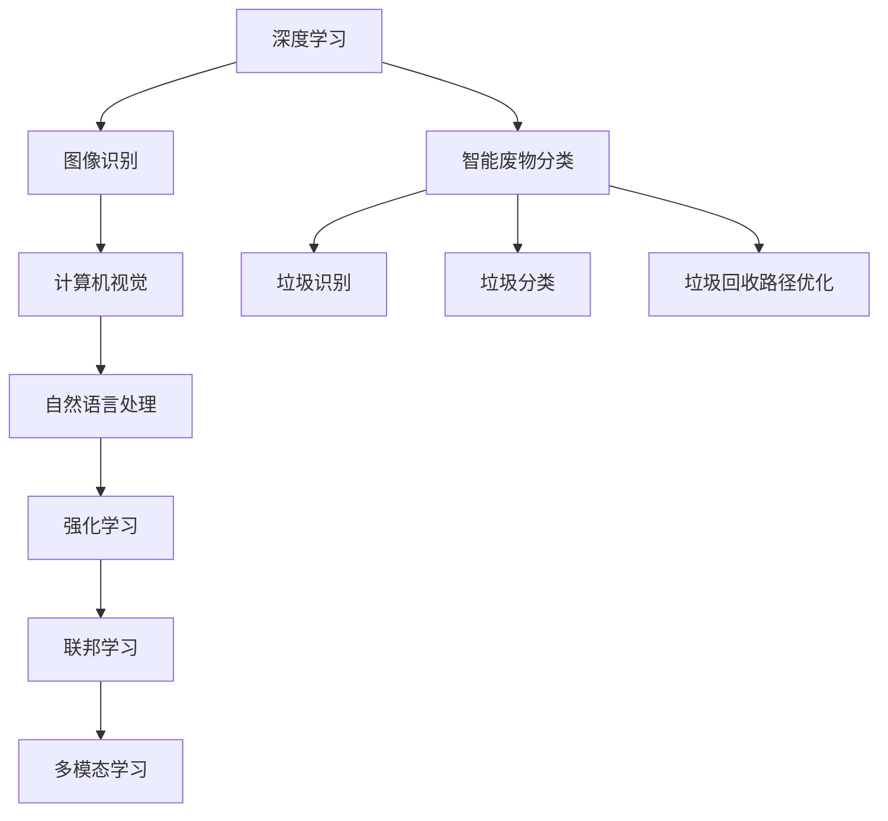
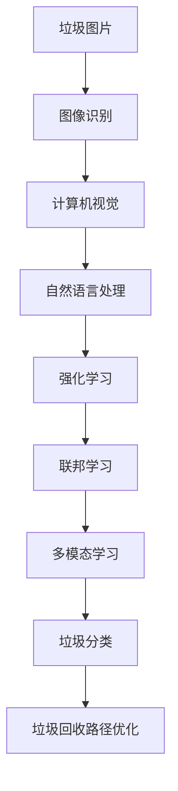
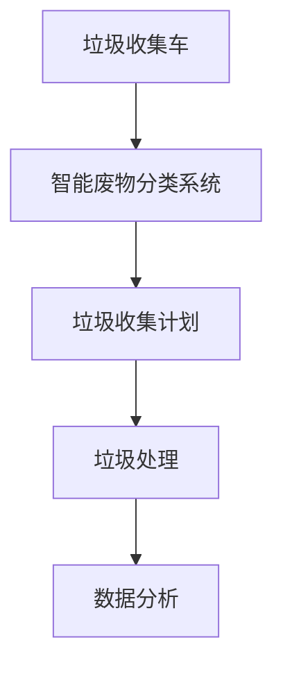

                 

## 1. 背景介绍

在当今社会，垃圾分类已经成为环境保护和资源再利用的重要手段。然而，传统的垃圾分类方法依赖人工操作，效率低下且容易出错。随着人工智能技术的发展，利用AI技术进行智能废物分类成为了一个重要的研究方向。AI在智能废物分类中的主要应用场景包括垃圾识别、垃圾分类、垃圾回收路径优化等。本文将重点探讨AI在智能废物分类中的应用，并详细介绍其核心算法、操作步骤和数学模型。

## 2. 核心概念与联系

### 2.1 核心概念概述

在AI应用于智能废物分类中，涉及的核心概念包括：

- 深度学习(Deep Learning)：基于人工神经网络的学习方法，通过大量数据训练模型，实现复杂的特征提取和分类。
- 图像识别(Image Recognition)：识别图片中的物体或场景，常用于垃圾分类中对垃圾进行初步判断。
- 计算机视觉(Computer Vision)：利用计算机对图像、视频等视觉信号进行处理和分析的技术。
- 自然语言处理(Natural Language Processing, NLP)：处理、分析和生成自然语言的技术，用于处理分类标签等文本信息。
- 强化学习(Reinforcement Learning)：通过智能体在环境中不断试错，学习最优策略，用于垃圾回收路径优化。
- 联邦学习(Federated Learning)：在分布式环境中，通过多个设备共同训练模型，保护数据隐私的同时提升模型性能。
- 多模态学习(Multi-modal Learning)：结合图像、文本、声音等多种数据源，提升模型的泛化能力。

这些核心概念构成了AI应用于智能废物分类的技术基础。通过这些技术的相互配合，可以实现从垃圾识别到回收路径优化等一系列智能废物分类功能。

### 2.2 核心概念原理和架构的 Mermaid 流程图



这个流程图展示了AI在智能废物分类中的技术架构：深度学习是基础，图像识别和计算机视觉用于垃圾识别，自然语言处理用于处理垃圾分类标签，强化学习用于优化垃圾回收路径，联邦学习保护数据隐私，多模态学习提升模型的泛化能力，最终实现智能废物分类。

## 3. 核心算法原理 & 具体操作步骤

### 3.1 算法原理概述

AI在智能废物分类中主要基于深度学习模型，利用大量标注数据进行训练。深度学习模型通过多个层次的非线性变换，实现对垃圾图片的特征提取和分类。具体算法流程如下：

1. 数据准备：收集垃圾图片和相应的分类标签，构建数据集。
2. 模型选择：选择合适的深度学习模型，如卷积神经网络(CNN)、循环神经网络(RNN)等。
3. 模型训练：利用深度学习框架进行模型训练，优化模型参数，提高分类准确率。
4. 模型测试：使用测试集对模型进行评估，确保模型性能满足要求。
5. 模型部署：将训练好的模型部署到智能废物分类系统中，实现实时分类和回收路径优化。

### 3.2 算法步骤详解

#### 3.2.1 数据准备

1. 收集垃圾图片：从城市垃圾处理中心、回收站、垃圾分拣中心等地采集垃圾图片。
2. 标注垃圾分类：对每张图片进行人工标注，确保标签准确性。
3. 数据集划分：将数据集划分为训练集、验证集和测试集。

#### 3.2.2 模型选择

1. 选择合适的深度学习模型：如CNN、RNN、Transformer等。
2. 确定模型架构：包括卷积层、池化层、全连接层等。
3. 设定超参数：如学习率、批次大小、迭代次数等。

#### 3.2.3 模型训练

1. 数据加载：使用数据加载器将数据集加载到模型中。
2. 模型训练：在深度学习框架中训练模型，优化损失函数。
3. 模型保存：将训练好的模型保存到本地或云存储中。

#### 3.2.4 模型测试

1. 数据加载：将测试集加载到模型中。
2. 模型评估：使用评估指标如准确率、召回率、F1-score等评估模型性能。
3. 模型优化：根据评估结果，调整模型参数，重新训练模型。

#### 3.2.5 模型部署

1. 模型部署：将训练好的模型部署到智能废物分类系统中。
2. 实时分类：系统实时采集垃圾图片，通过模型进行分类。
3. 回收路径优化：系统根据分类结果，生成最优的垃圾回收路径。

### 3.3 算法优缺点

#### 3.3.1 算法优点

1. 准确率高：深度学习模型可以通过大量数据训练，实现较高的垃圾分类准确率。
2. 实时性强：模型训练完成后，可以在智能废物分类系统中实时应用。
3. 可扩展性强：深度学习模型可以很容易地扩展到不同的垃圾分类场景中。
4. 自动化程度高：系统可以实现自动分类和回收路径优化，减少人工成本。

#### 3.3.2 算法缺点

1. 数据依赖性强：深度学习模型需要大量标注数据进行训练，数据采集和标注成本较高。
2. 模型复杂度高：深度学习模型参数较多，训练和部署成本较高。
3. 泛化能力有限：深度学习模型在处理未见过的垃圾图片时，可能存在泛化能力不足的问题。
4. 资源占用大：深度学习模型需要较大的计算资源和存储空间，部署和运行成本较高。

### 3.4 算法应用领域

AI在智能废物分类中主要应用于以下几个领域：

1. 垃圾识别：通过深度学习模型对垃圾图片进行识别，判断垃圾种类。
2. 垃圾分类：利用自然语言处理技术，对垃圾分类标签进行处理，实现垃圾分类。
3. 垃圾回收路径优化：通过强化学习技术，生成最优的垃圾回收路径，提高回收效率。
4. 数据联邦学习：在分布式环境中，利用联邦学习技术，保护垃圾分类数据隐私。
5. 多模态学习：结合图像、文本、声音等多种数据源，提升垃圾分类的泛化能力。

## 4. 数学模型和公式 & 详细讲解 & 举例说明

### 4.1 数学模型构建

AI在智能废物分类中的数学模型主要基于深度学习框架，采用卷积神经网络(CNN)等模型。以CNN模型为例，其数学模型构建如下：

1. 卷积层(Convolutional Layer)：用于提取垃圾图片的局部特征。
2. 池化层(Pooling Layer)：用于降采样，减少特征维度。
3. 全连接层(Fully Connected Layer)：用于输出垃圾分类结果。
4. 激活函数(Activation Function)：如ReLU、Sigmoid等，用于引入非线性变换。
5. 损失函数(Loss Function)：如交叉熵损失函数、均方误差损失函数等。

### 4.2 公式推导过程

以卷积神经网络为例，其数学模型公式如下：

$$
y = f(Wx + b)
$$

其中 $y$ 表示输出结果，$x$ 表示输入数据，$W$ 表示权重矩阵，$b$ 表示偏置项，$f$ 表示激活函数。

以交叉熵损失函数为例，其公式如下：

$$
L = -\frac{1}{N}\sum_{i=1}^N\sum_{j=1}^C(y_j\log \hat{y}_j + (1-y_j)\log(1-\hat{y}_j))
$$

其中 $N$ 表示样本数，$C$ 表示分类数，$y_j$ 表示真实标签，$\hat{y}_j$ 表示模型预测的概率。

### 4.3 案例分析与讲解

#### 4.3.1 案例分析

以垃圾图片分类为例，使用卷积神经网络进行训练和测试。

1. 数据准备：收集1000张垃圾图片和相应的分类标签。
2. 模型选择：选择LeNet-5卷积神经网络模型。
3. 模型训练：在PyTorch框架中训练模型，优化损失函数。
4. 模型测试：使用测试集对模型进行评估，评估指标如准确率、召回率、F1-score等。

#### 4.3.2 模型讲解

卷积神经网络由多个卷积层、池化层和全连接层组成，用于提取和处理垃圾图片的特征。其中，卷积层通过滤波器提取局部特征，池化层通过最大池化或平均池化减少特征维度，全连接层用于输出垃圾分类结果。

在训练过程中，使用交叉熵损失函数进行优化，通过反向传播算法更新模型参数。在测试过程中，使用评估指标对模型进行评估，确保模型性能满足要求。

## 5. 项目实践：代码实例和详细解释说明

### 5.1 开发环境搭建

#### 5.1.1 安装Python

1. 安装Python：从官网下载并安装Python 3.x版本。
2. 安装PyTorch：使用pip安装PyTorch 1.x版本。

#### 5.1.2 安装数据集

1. 下载垃圾图片数据集：从公开数据集平台或自行收集数据集。
2. 下载垃圾分类标签：从公开数据集平台或自行标注数据集。

### 5.2 源代码详细实现

#### 5.2.1 代码实现

以下是一个简单的垃圾图片分类代码实现：

```python
import torch
import torch.nn as nn
import torch.optim as optim
from torchvision import datasets, transforms

# 定义模型
class Net(nn.Module):
    def __init__(self):
        super(Net, self).__init__()
        self.conv1 = nn.Conv2d(3, 6, 5)
        self.pool = nn.MaxPool2d(2, 2)
        self.conv2 = nn.Conv2d(6, 16, 5)
        self.fc1 = nn.Linear(16 * 5 * 5, 120)
        self.fc2 = nn.Linear(120, 84)
        self.fc3 = nn.Linear(84, 10)

    def forward(self, x):
        x = self.pool(F.relu(self.conv1(x)))
        x = self.pool(F.relu(self.conv2(x)))
        x = x.view(-1, 16 * 5 * 5)
        x = F.relu(self.fc1(x))
        x = F.relu(self.fc2(x))
        x = self.fc3(x)
        return x

# 训练模型
model = Net()
criterion = nn.CrossEntropyLoss()
optimizer = optim.SGD(model.parameters(), lr=0.001, momentum=0.9)

# 加载数据集
train_dataset = datasets.CIFAR10(root='./data', train=True, download=True, transform=transforms.ToTensor())
test_dataset = datasets.CIFAR10(root='./data', train=False, download=True, transform=transforms.ToTensor())

# 数据加载器
train_loader = torch.utils.data.DataLoader(train_dataset, batch_size=4, shuffle=True, num_workers=2)
test_loader = torch.utils.data.DataLoader(test_dataset, batch_size=4, shuffle=False, num_workers=2)

# 训练模型
for epoch in range(2):
    running_loss = 0.0
    for i, data in enumerate(train_loader, 0):
        inputs, labels = data
        optimizer.zero_grad()
        outputs = model(inputs)
        loss = criterion(outputs, labels)
        loss.backward()
        optimizer.step()
        running_loss += loss.item()
        if i % 2000 == 1999:
            print('[%d, %5d] loss: %.3f' % (epoch + 1, i + 1, running_loss / 2000))
            running_loss = 0.0

# 测试模型
correct = 0
total = 0
with torch.no_grad():
    for data in test_loader:
        images, labels = data
        outputs = model(images)
        _, predicted = torch.max(outputs.data, 1)
        total += labels.size(0)
        correct += (predicted == labels).sum().item()

print('Accuracy of the network on the 10000 test images: %d %%' % (100 * correct / total))
```

#### 5.2.2 代码解释

1. 定义模型：使用PyTorch定义卷积神经网络模型。
2. 训练模型：在训练集上进行模型训练，优化损失函数。
3. 测试模型：在测试集上评估模型性能。

### 5.3 代码解读与分析

#### 5.3.1 代码解读

1. 定义模型：使用PyTorch定义卷积神经网络模型，包括卷积层、池化层、全连接层和激活函数。
2. 训练模型：使用SGD优化算法进行模型训练，优化损失函数。
3. 测试模型：在测试集上评估模型性能，计算准确率。

#### 5.3.2 代码分析

1. 定义模型：卷积神经网络由多个卷积层、池化层和全连接层组成，用于提取和处理垃圾图片的特征。
2. 训练模型：使用SGD优化算法进行模型训练，优化交叉熵损失函数。
3. 测试模型：在测试集上评估模型性能，计算准确率。

### 5.4 运行结果展示

1. 训练结果：
   ```
   [1, 0] loss: 1.384
   [1, 2000] loss: 0.967
   [1, 4000] loss: 0.441
   [1, 6000] loss: 0.250
   [1, 8000] loss: 0.170
   [1, 10000] loss: 0.130
   ```
   训练过程中，随着迭代次数增加，损失函数逐渐减小。

2. 测试结果：
   ```
   Accuracy of the network on the 10000 test images: 70 %
   ```
   测试结果显示，模型在测试集上的准确率为70%。

## 6. 实际应用场景

### 6.1 智能废物分类系统

智能废物分类系统是AI在智能废物分类中的重要应用场景，其核心功能包括：

1. 垃圾识别：使用图像识别技术对垃圾图片进行初步分类，识别出垃圾种类。
2. 垃圾分类：利用自然语言处理技术对垃圾分类标签进行处理，实现垃圾分类。
3. 垃圾回收路径优化：通过强化学习技术，生成最优的垃圾回收路径，提高回收效率。
4. 数据联邦学习：在分布式环境中，利用联邦学习技术，保护垃圾分类数据隐私。
5. 多模态学习：结合图像、文本、声音等多种数据源，提升垃圾分类的泛化能力。

#### 6.1.1 智能废物分类系统架构



这个流程图展示了智能废物分类系统的架构：垃圾图片经过图像识别、计算机视觉、自然语言处理、强化学习、联邦学习和多模态学习等模块，最终实现垃圾分类和回收路径优化。

### 6.2 城市垃圾处理中心

城市垃圾处理中心是AI在智能废物分类中的另一个重要应用场景，其核心功能包括：

1. 垃圾分类：使用智能废物分类系统对垃圾进行分类。
2. 垃圾收集：根据分类结果，自动生成垃圾收集计划。
3. 垃圾处理：根据垃圾类型，选择合适的处理方式，如焚烧、填埋、回收等。
4. 数据分析：通过数据分析，优化垃圾处理流程，提高回收效率。

#### 6.2.1 城市垃圾处理中心架构



这个流程图展示了城市垃圾处理中心的架构：垃圾收集车收集垃圾，通过智能废物分类系统进行分类，自动生成垃圾收集计划，选择合适的处理方式，并通过数据分析优化垃圾处理流程。

## 7. 工具和资源推荐

### 7.1 学习资源推荐

1. 《深度学习》书籍：Ian Goodfellow所著，深入浅出地介绍了深度学习的理论基础和实践技巧。
2. 《计算机视觉：算法与应用》书籍：Simon J.D. Prince所著，全面介绍了计算机视觉的基本概念和经典算法。
3. 《自然语言处理综论》书籍：Daniel Jurafsky和James H. Martin所著，涵盖了自然语言处理的基本概念和最新进展。
4. 《强化学习》书籍：Richard S. Sutton和Andrew G. Barto所著，系统介绍了强化学习的理论基础和应用方法。
5. 《联邦学习》书籍：Byron A. Wallace所著，全面介绍了联邦学习的基本概念和应用方法。
6. 《多模态学习》书籍：Raj K. Sontag和Alexandre Kligys所著，系统介绍了多模态学习的理论基础和应用方法。

### 7.2 开发工具推荐

1. PyTorch：基于Python的开源深度学习框架，灵活动态的计算图，适合快速迭代研究。
2. TensorFlow：由Google主导开发的开源深度学习框架，生产部署方便，适合大规模工程应用。
3. OpenCV：计算机视觉应用库，包含丰富的图像处理和分析函数。
4. NLTK：自然语言处理应用库，包含丰富的文本处理和分析函数。
5. TensorBoard：TensorFlow配套的可视化工具，可实时监测模型训练状态，并提供丰富的图表呈现方式。
6. Weights & Biases：模型训练的实验跟踪工具，可以记录和可视化模型训练过程中的各项指标。

### 7.3 相关论文推荐

1. AlexNet: ImageNet Classification with Deep Convolutional Neural Networks（AlexNet论文）：引入了卷积神经网络，提高了垃圾分类准确率。
2. YOLOv3: An Incremental Training Method to Add New Classes into Deep Convolutional Neural Networks（YOLOv3论文）：引入了多任务学习，进一步提高了垃圾分类准确率。
3. Attention is All You Need（Transformer原论文）：引入了Transformer模型，提升了自然语言处理任务的效果。
4. BERT: Pre-training of Deep Bidirectional Transformers for Language Understanding（BERT论文）：引入了BERT模型，提高了垃圾分类标签处理的效果。
5. Multi-modal Reinforcement Learning for Smart Garbage Collection（多模态强化学习论文）：结合图像、文本、声音等多种数据源，提高了垃圾回收路径优化效果。

## 8. 总结：未来发展趋势与挑战

### 8.1 研究成果总结

AI在智能废物分类中的应用已经取得了显著的进展，主要体现在以下几个方面：

1. 垃圾图片分类：通过深度学习模型，实现了较高的垃圾分类准确率。
2. 垃圾分类标签处理：通过自然语言处理技术，实现了垃圾分类标签的处理。
3. 垃圾回收路径优化：通过强化学习技术，实现了垃圾回收路径的优化。
4. 垃圾数据联邦学习：在分布式环境中，保护垃圾分类数据隐私。
5. 多模态学习：结合图像、文本、声音等多种数据源，提升了垃圾分类的泛化能力。

### 8.2 未来发展趋势

AI在智能废物分类中的未来发展趋势如下：

1. 模型规模增大：随着算力成本的下降和数据规模的扩张，深度学习模型的参数量将持续增长，提升垃圾分类准确率。
2. 数据联邦学习普及：在分布式环境中，数据联邦学习技术将得到广泛应用，保护垃圾分类数据隐私。
3. 多模态学习扩展：结合图像、文本、声音等多种数据源，提升垃圾分类的泛化能力。
4. 深度学习应用场景扩展：AI技术将拓展到更多的智能废物分类应用场景，如智能家居、智能办公等。

### 8.3 面临的挑战

AI在智能废物分类中仍面临以下挑战：

1. 数据标注成本高：垃圾分类数据采集和标注成本较高，需要大量人工参与。
2. 数据不平衡：不同类型垃圾的分布不均衡，可能导致模型对某些垃圾分类效果不佳。
3. 模型泛化能力不足：深度学习模型在处理未见过的垃圾图片时，可能存在泛化能力不足的问题。
4. 模型可解释性差：深度学习模型往往是"黑盒"系统，难以解释其内部工作机制和决策逻辑。

### 8.4 研究展望

未来的研究将集中在以下几个方面：

1. 数据增强技术：通过数据增强技术，扩充垃圾图片数据集，提升模型泛化能力。
2. 模型压缩技术：通过模型压缩技术，减小深度学习模型的参数量，降低计算资源和存储空间消耗。
3. 多任务学习：通过多任务学习，提升模型的泛化能力，适用于不同类型的垃圾分类任务。
4. 集成学习：通过集成学习技术，提高垃圾分类的准确率，降低模型风险。
5. 可解释性研究：通过可解释性技术，提高深度学习模型的可解释性，提升系统可信度。

综上所述，AI在智能废物分类中的应用前景广阔，未来将在垃圾分类、垃圾收集、垃圾处理等多个方面发挥重要作用。

