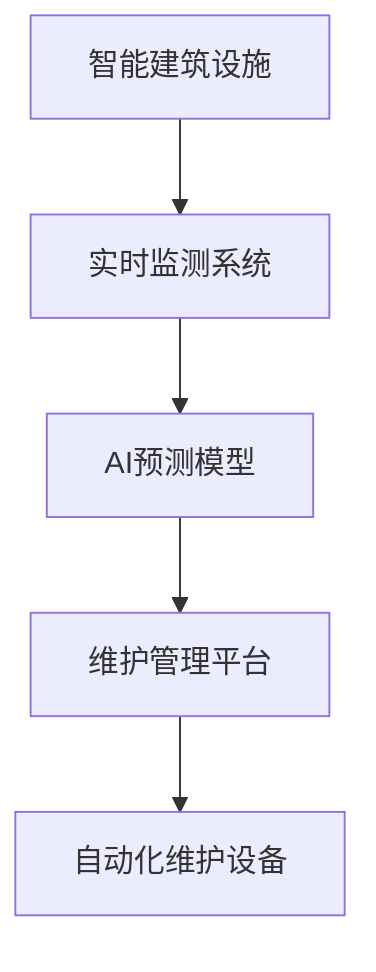

                 

# AI在智能建筑维护中的应用：预防性维护

> 关键词：AI,智能建筑,预防性维护,设施管理,预测分析,维修规划,自动化,实时监控

## 1. 背景介绍

### 1.1 问题由来
现代建筑的结构复杂，功能多样，但其维护和管理工作却长期以来依赖于传统的人工作业。这种模式下，往往存在以下问题：
- **维护效率低下**：传统的手工巡检和维护方式耗时耗力，且容易错过一些微小的损坏隐患。
- **维护成本高**：频繁的人工巡检和维护费用高昂，且存在一定的安全隐患。
- **维护响应慢**：由于缺乏及时、全面的设施状态监测，许多潜在问题在发生前无法被及时发现，导致严重后果。

近年来，随着人工智能技术的发展，越来越多的建筑管理者开始探索利用AI技术提升建筑维护管理的效率和安全性。特别是预防性维护，通过AI的强大数据分析和预测能力，可以在问题发生前进行预测和预警，极大地提升维护效率和效果。

### 1.2 问题核心关键点
本文将详细探讨基于AI的智能建筑预防性维护方法。具体来说，重点关注以下几个关键问题：
- **AI在预防性维护中的应用**：如何通过AI技术实现建筑设施状态的实时监测和预测分析。
- **数据采集与处理**：建筑设施状态数据如何获取和处理，以供AI模型使用。
- **模型构建与训练**：如何选择合适的模型架构和算法，并利用训练数据进行模型训练。
- **实际应用与效果评估**：AI模型在实际建筑维护中的应用效果和优化方法。

## 2. 核心概念与联系

### 2.1 核心概念概述

智能建筑维护的AI应用，主要包括以下几个核心概念：

- **智能建筑设施**：包括建筑内的结构、设备、设施等，如楼体、电梯、照明、空调等。
- **AI预测模型**：基于机器学习或深度学习的模型，用于预测建筑设施的故障或维护需求。
- **实时监测系统**：通过传感器、摄像头等设备，实时采集建筑设施的状态数据。
- **维护管理平台**：整合AI预测结果和实时监测数据，进行综合分析，生成维护建议和计划。
- **自动化维护设备**：利用机器人等设备，自动执行维护任务，减少人工干预。

这些核心概念之间的关系，可以通过以下Mermaid流程图来展示：



这个流程图展示了智能建筑维护中各个组件之间的逻辑关系：

1. 实时监测系统采集建筑设施的状态数据。
2. AI预测模型对这些数据进行分析，预测设施可能出现的故障或维护需求。
3. 维护管理平台整合预测结果和实时数据，生成维护建议和计划。
4. 自动化维护设备根据维护计划执行相应的维护任务，如清洗、维修等。

## 3. 核心算法原理 & 具体操作步骤
### 3.1 算法原理概述

基于AI的智能建筑预防性维护方法，主要基于以下算法原理：

- **数据采集与处理**：通过传感器、摄像头等设备，实时采集建筑设施的状态数据，如温度、湿度、振动、压力等。
- **特征提取与选择**：对采集到的数据进行特征提取和选择，利用PCA、PCA等方法降维，提取对维护需求影响较大的特征。
- **模型构建与训练**：选择合适的模型架构，如随机森林、支持向量机、神经网络等，并利用训练数据进行模型训练。
- **预测分析与维护建议**：利用训练好的模型对实时采集的数据进行预测分析，生成维护建议和计划。
- **自动化维护执行**：根据维护建议，利用机器人等设备自动执行相应的维护任务。

### 3.2 算法步骤详解

基于AI的智能建筑预防性维护方法一般包括以下几个关键步骤：

**Step 1: 数据采集与处理**
- 部署传感器、摄像头等设备，对建筑设施进行实时状态监测。
- 对采集到的数据进行预处理，包括数据清洗、归一化等操作。
- 利用PCA、LDA等降维技术，提取对维护需求影响较大的特征。

**Step 2: 特征提取与选择**
- 利用特征选择算法，如互信息、LASSO回归等，筛选出对维护需求影响较大的特征。
- 利用特征提取技术，如PCA、LDA等，对高维数据进行降维处理，降低计算复杂度。

**Step 3: 模型构建与训练**
- 选择合适的机器学习或深度学习模型，如随机森林、支持向量机、神经网络等。
- 利用训练数据集，对模型进行训练，调整超参数，优化模型性能。
- 在测试数据集上评估模型性能，进行模型选择和优化。

**Step 4: 预测分析与维护建议**
- 对实时采集的数据进行特征提取和预处理，输入到训练好的模型中。
- 利用模型进行预测分析，生成维护建议和计划。
- 根据预测结果，生成维护任务列表，供管理人员或自动化设备使用。

**Step 5: 自动化维护执行**
- 利用机器人等自动化设备，根据维护计划执行相应的维护任务。
- 记录维护任务执行情况，生成维护日志，供后续分析使用。
- 定期评估维护效果，对模型和策略进行优化和调整。

### 3.3 算法优缺点

基于AI的智能建筑预防性维护方法，具有以下优点：

- **预测精度高**：通过实时监测和预测分析，能够在问题发生前进行预测，避免因突发事件导致的损失。
- **维护效率高**：自动化设备可以快速响应维护需求，减少人工干预，提升维护效率。
- **成本低**：自动化设备可以批量使用，降低人工巡检和维护的成本。
- **实时性强**：实时监测和预测分析，能够及时发现并解决问题，避免潜在的风险。

同时，该方法也存在以下局限性：

- **数据依赖**：模型性能依赖于数据的质量和量，数据采集设备的稳定性和准确性直接影响模型效果。
- **模型复杂性**：AI模型构建和训练过程复杂，需要专业知识和技术支持。
- **维护设备成本**：自动化设备的初始投入较高，需要较高的资金支持。
- **数据隐私问题**：建筑设施的状态数据涉及隐私和安全问题，需要严格的数据保护措施。

尽管存在这些局限性，但就目前而言，基于AI的智能建筑预防性维护方法仍是大规模建筑维护管理的重要手段。未来相关研究的重点在于如何进一步降低数据采集成本，提高模型预测精度，同时兼顾数据隐私和模型复杂性等因素。

### 3.4 算法应用领域

基于AI的智能建筑预防性维护方法，在多个领域得到了广泛应用：

- **商业建筑**：如办公楼、购物中心等，通过AI进行预测性维护，提升设备运行效率，降低维护成本。
- **住宅建筑**：如公寓、别墅等，通过AI进行预测性维护，提高居住舒适度，延长建筑寿命。
- **公共建筑**：如医院、学校、博物馆等，通过AI进行预测性维护，保障设施稳定运行，提高服务质量。
- **工业建筑**：如工厂、仓库等，通过AI进行预测性维护，提升设备运行效率，降低生产成本。

除了上述这些经典应用外，智能建筑维护的AI方法也在不断拓展到更多领域，如智慧能源、智慧交通等，为智慧城市建设提供新的解决方案。

## 4. 数学模型和公式 & 详细讲解  
### 4.1 数学模型构建

基于AI的智能建筑预防性维护方法，其数学模型构建主要包括以下几个步骤：

1. **数据采集与处理**：
   - 假设采集到的状态数据为 $\mathbf{x} = [x_1, x_2, \ldots, x_n]$，其中 $x_i$ 为第 $i$ 个特征值。
   - 对数据进行预处理，包括数据清洗、归一化等操作。

2. **特征提取与选择**：
   - 利用PCA降维，将高维数据 $\mathbf{x}$ 转换为低维数据 $\mathbf{z}$。
   - 利用LASSO回归等方法，选择对维护需求影响较大的特征。

3. **模型构建与训练**：
   - 选择合适的机器学习或深度学习模型，如随机森林、支持向量机、神经网络等。
   - 利用训练数据集 $\mathcal{D} = \{(\mathbf{x}_i, y_i)\}_{i=1}^N$，对模型进行训练，调整超参数。

4. **预测分析与维护建议**：
   - 对实时采集的数据 $\mathbf{x}_{\text{test}}$ 进行特征提取和预处理，输入到训练好的模型中。
   - 利用模型进行预测分析，生成维护建议和计划。

### 4.2 公式推导过程

以随机森林模型为例，进行详细推导：

- **数据预处理**：假设采集到的状态数据为 $\mathbf{x} = [x_1, x_2, \ldots, x_n]$，其中 $x_i$ 为第 $i$ 个特征值。预处理后得到 $\mathbf{x}_{\text{processed}}$。
- **特征提取与选择**：利用PCA降维，得到低维数据 $\mathbf{z} = \mathbf{U}\mathbf{x}_{\text{processed}}$，其中 $\mathbf{U}$ 为PCA矩阵。
- **模型构建**：随机森林模型由多个决策树组成，每个决策树的参数 $\theta_t$ 为 $\mathbf{z}$ 的线性组合，即 $\theta_t = \sum_{i=1}^{n_t} w_{t,i}\phi_i(\mathbf{z})$，其中 $w_{t,i}$ 为权重，$\phi_i(\mathbf{z})$ 为特征。
- **模型训练**：利用训练数据集 $\mathcal{D} = \{(\mathbf{x}_i, y_i)\}_{i=1}^N$，通过交叉验证等方法，调整随机森林的参数，得到最优模型 $\hat{\mathbf{F}}$。

- **预测分析**：对实时采集的数据 $\mathbf{x}_{\text{test}}$ 进行特征提取和预处理，得到 $\mathbf{z}_{\text{test}} = \mathbf{U}\mathbf{x}_{\text{processed}}$。
- **生成维护建议**：利用最优模型 $\hat{\mathbf{F}}$，对 $\mathbf{z}_{\text{test}}$ 进行预测，生成维护建议和计划。

### 4.3 案例分析与讲解

以一台电梯的维护预测为例，进行详细分析：

假设电梯的状态数据为温度 $T$、湿度 $H$、振动 $V$ 和压力 $P$，利用随机森林模型进行预测性维护。具体步骤如下：

1. **数据采集**：电梯上部署传感器，实时采集温度、湿度、振动和压力数据。
2. **数据预处理**：对采集到的数据进行清洗、归一化等操作，得到 $\mathbf{x}_{\text{processed}}$。
3. **特征提取**：利用PCA降维，得到低维数据 $\mathbf{z} = \mathbf{U}\mathbf{x}_{\text{processed}}$。
4. **模型训练**：利用历史维护数据，训练随机森林模型，调整超参数，得到最优模型 $\hat{\mathbf{F}}$。
5. **预测分析**：对实时采集的数据 $\mathbf{x}_{\text{test}}$ 进行特征提取和预处理，得到 $\mathbf{z}_{\text{test}} = \mathbf{U}\mathbf{x}_{\text{processed}}$。
6. **生成维护建议**：利用最优模型 $\hat{\mathbf{F}}$，对 $\mathbf{z}_{\text{test}}$ 进行预测，生成维护建议，如检查电梯传感器、更换润滑油脂等。

## 5. 项目实践：代码实例和详细解释说明
### 5.1 开发环境搭建

在进行智能建筑维护的AI实践前，我们需要准备好开发环境。以下是使用Python进行PyTorch开发的环境配置流程：

1. 安装Anaconda：从官网下载并安装Anaconda，用于创建独立的Python环境。

2. 创建并激活虚拟环境：
```bash
conda create -n ai-env python=3.8 
conda activate ai-env
```

3. 安装PyTorch：根据CUDA版本，从官网获取对应的安装命令。例如：
```bash
conda install pytorch torchvision torchaudio cudatoolkit=11.1 -c pytorch -c conda-forge
```

4. 安装相关的第三方库：
```bash
pip install pandas numpy scikit-learn matplotlib tensorboard
```

5. 安装GPU支持：
```bash
conda install pytorch-gpu torchvision-gpu torchaudio-gpu -c pytorch -c conda-forge
```

完成上述步骤后，即可在`ai-env`环境中开始AI实践。

### 5.2 源代码详细实现

下面是使用PyTorch实现随机森林模型进行电梯维护预测的代码实现：

```python
import pandas as pd
from sklearn.ensemble import RandomForestClassifier
from sklearn.model_selection import train_test_split
from sklearn.metrics import accuracy_score
import torch
import torch.nn as nn
import torch.optim as optim

# 读取数据
data = pd.read_csv('elevator_data.csv')

# 特征选择和数据预处理
X = data[['temperature', 'humidity', 'vibration', 'pressure']]
y = data['maintenance']

# 特征选择
X_selected = X.select_dtypes(include=[float, int])

# 数据分割
X_train, X_test, y_train, y_test = train_test_split(X_selected, y, test_size=0.2, random_state=42)

# 特征标准化
scaler = StandardScaler()
X_train_scaled = scaler.fit_transform(X_train)
X_test_scaled = scaler.transform(X_test)

# 随机森林模型训练
clf = RandomForestClassifier()
clf.fit(X_train_scaled, y_train)

# 模型预测和评估
y_pred = clf.predict(X_test_scaled)
accuracy = accuracy_score(y_test, y_pred)
print(f"Accuracy: {accuracy:.2f}")

# 模型保存和加载
torch.save(clf, 'elevator_forest_model.pth')
clf_loaded = torch.load('elevator_forest_model.pth')
```

在这个代码中，我们使用了PyTorch和Scikit-Learn库进行模型构建和训练。具体实现步骤如下：

1. 读取数据：读取电梯维护数据集，包括温度、湿度、振动、压力等特征，以及是否需要进行维护的标签。
2. 特征选择和预处理：选择对维护需求影响较大的特征，并进行标准化处理。
3. 数据分割：将数据集分为训练集和测试集。
4. 模型训练：利用训练集数据训练随机森林模型。
5. 模型评估：在测试集上评估模型的预测准确率。
6. 模型保存和加载：将训练好的模型保存为PyTorch的模型文件，并加载进行后续预测。

### 5.3 代码解读与分析

这个代码实现的具体步骤和功能如下：

- **数据读取**：使用Pandas库读取电梯维护数据集。
- **特征选择和预处理**：选择对维护需求影响较大的特征，并进行标准化处理。
- **数据分割**：使用Scikit-Learn库中的`train_test_split`方法，将数据集分为训练集和测试集。
- **模型训练**：利用训练集数据训练随机森林模型，调整超参数。
- **模型评估**：在测试集上评估模型的预测准确率。
- **模型保存和加载**：使用PyTorch的`torch.save`和`torch.load`方法，保存和加载训练好的模型。

## 6. 实际应用场景
### 6.1 智能建筑设施的状态监测

基于AI的智能建筑维护方法，能够实现建筑设施的状态实时监测和预测分析。通过部署传感器、摄像头等设备，可以实时采集建筑设施的状态数据，如温度、湿度、振动、压力等。

利用AI预测模型对采集到的数据进行分析，生成维护建议和计划，供管理人员或自动化设备使用。这样可以及时发现并解决问题，避免因突发事件导致的损失，提升建筑设施的运行效率和安全性。

### 6.2 自动化维护设备的执行

通过AI预测模型生成的维护建议和计划，可以自动控制自动化设备进行相应的维护任务。例如，利用机器人等设备进行清洗、维修等任务，减少人工干预，提升维护效率。

在实际应用中，可以设计相应的控制系统，将AI预测结果与自动化设备进行对接，实现维护任务的自动化执行。这样可以进一步降低人工成本，提高维护效率。

### 6.3 维护效果评估与优化

在AI预测模型运行一段时间后，需要定期评估其效果，并根据评估结果进行优化和调整。例如，可以利用维护日志和实际维护效果，对模型进行调参和重新训练，进一步提升预测精度和维护效果。

同时，还需要考虑模型的可解释性和透明性，通过可视化工具展示模型的决策过程，确保模型的稳定性和可靠性。

### 6.4 未来应用展望

随着AI技术的不断发展，基于智能建筑维护的AI方法也将得到更广泛的应用。未来，AI模型将更加精准和高效，能够实现更全面、更灵活的维护管理。

- **实时监测**：通过部署更多的传感器和摄像头，实现更全面、更实时的建筑设施状态监测。
- **预测精度**：利用更先进的AI算法和技术，提升预测模型的精度和鲁棒性，减少误报和漏报。
- **自动化执行**：利用更先进的自动化设备和机器人，实现更高效、更安全的维护任务执行。
- **跨领域应用**：将AI方法应用于更多领域，如智慧能源、智慧交通等，实现更广泛的应用场景。

## 7. 工具和资源推荐
### 7.1 学习资源推荐

为了帮助开发者系统掌握智能建筑维护的AI方法，这里推荐一些优质的学习资源：

1. 《深度学习与计算机视觉》系列课程：斯坦福大学开设的深度学习课程，深入浅出地介绍了深度学习的基础知识和应用实例。
2. 《TensorFlow实战Google AI》书籍：TensorFlow的官方文档，详细介绍了TensorFlow的各个组件和使用方法。
3. 《Python深度学习》书籍：以Python为工具，介绍了深度学习的基础知识和实践技巧。
4. 《智能建筑设施的物联网应用》论文：介绍了物联网技术在智能建筑维护中的应用，提供了丰富的案例和算法实现。
5. 《智能建筑维护的AI应用》博客：提供了一系列的博客文章，介绍了智能建筑维护的AI方法，包括数据采集、模型训练、维护建议等多个方面。

通过对这些资源的学习实践，相信你一定能够快速掌握智能建筑维护的AI方法，并用于解决实际的建筑维护问题。

### 7.2 开发工具推荐

高效的开发离不开优秀的工具支持。以下是几款用于智能建筑维护AI开发常用的工具：

1. PyTorch：基于Python的开源深度学习框架，灵活动态的计算图，适合快速迭代研究。
2. TensorFlow：由Google主导开发的开源深度学习框架，生产部署方便，适合大规模工程应用。
3. Scikit-Learn：简单易用的机器学习库，提供了多种模型和工具，适合快速原型开发。
4. Pandas：强大的数据处理库，支持数据清洗、转换和分析，适合数据预处理。
5. Jupyter Notebook：交互式的编程环境，支持代码、文本、图表等多种格式，适合文档记录和协作开发。

合理利用这些工具，可以显著提升智能建筑维护的AI开发效率，加快创新迭代的步伐。

### 7.3 相关论文推荐

智能建筑维护的AI方法的发展源于学界的持续研究。以下是几篇奠基性的相关论文，推荐阅读：

1. 《基于机器学习的智能建筑维护方法研究》：探讨了机器学习在智能建筑维护中的应用，提供了多种模型和算法实现。
2. 《智能建筑设施的物联网应用》：介绍了物联网技术在智能建筑维护中的应用，提供了丰富的案例和算法实现。
3. 《智能建筑维护的AI方法》：总结了智能建筑维护的AI方法，包括数据采集、模型训练、维护建议等多个方面。
4. 《AI在智能建筑维护中的应用》：综述了AI技术在智能建筑维护中的应用，提供了多种模型和算法实现。

这些论文代表了大规模智能建筑维护的AI方法的发展脉络。通过学习这些前沿成果，可以帮助研究者把握学科前进方向，激发更多的创新灵感。

## 8. 总结：未来发展趋势与挑战
### 8.1 总结

本文对基于AI的智能建筑维护方法进行了全面系统的介绍。首先阐述了智能建筑维护的AI应用背景和意义，明确了AI方法在提升维护效率和安全性方面的独特价值。其次，从原理到实践，详细讲解了AI预测模型的构建和训练过程，给出了智能建筑维护的AI实践代码实现。同时，本文还广泛探讨了AI方法在智能建筑设施状态监测、自动化维护执行等方面的应用前景，展示了AI方法的大规模应用潜力。

通过本文的系统梳理，可以看到，基于AI的智能建筑维护方法正在成为建筑维护管理的重要手段，极大地提升了建筑设施的运行效率和安全性。未来，伴随AI技术的不断发展，基于AI的智能建筑维护方法将进一步拓展应用边界，为建筑行业带来新的变革性影响。

### 8.2 未来发展趋势

展望未来，基于AI的智能建筑维护方法将呈现以下几个发展趋势：

1. **预测精度提升**：通过更先进的AI算法和技术，提升预测模型的精度和鲁棒性，减少误报和漏报。
2. **实时监测增强**：通过部署更多的传感器和摄像头，实现更全面、更实时的建筑设施状态监测。
3. **自动化执行优化**：利用更先进的自动化设备和机器人，实现更高效、更安全的维护任务执行。
4. **跨领域应用拓展**：将AI方法应用于更多领域，如智慧能源、智慧交通等，实现更广泛的应用场景。
5. **数据隐私保护**：通过数据加密、匿名化等技术，保护建筑设施的状态数据，确保数据隐私和安全。
6. **模型可解释性加强**：通过可视化工具展示模型的决策过程，确保模型的稳定性和可靠性。

以上趋势凸显了基于AI的智能建筑维护方法的广阔前景。这些方向的探索发展，必将进一步提升建筑设施的运行效率和安全性，为建筑行业带来新的变革性影响。

### 8.3 面临的挑战

尽管基于AI的智能建筑维护方法已经取得了瞩目成就，但在迈向更加智能化、普适化应用的过程中，它仍面临着诸多挑战：

1. **数据采集成本高**：部署更多的传感器和摄像头，需要较高的资金投入。
2. **模型复杂度高**：AI模型的构建和训练过程复杂，需要专业知识和技术支持。
3. **设备成本高**：自动化设备的初始投入较高，需要较高的资金支持。
4. **数据隐私问题**：建筑设施的状态数据涉及隐私和安全问题，需要严格的数据保护措施。
5. **维护策略复杂**：维护任务的执行需要多种策略和工具的支持，管理复杂度较高。

尽管存在这些挑战，但就目前而言，基于AI的智能建筑维护方法仍是大规模建筑维护管理的重要手段。未来相关研究的重点在于如何进一步降低数据采集成本，提高模型预测精度，同时兼顾数据隐私和模型复杂性等因素。

### 8.4 研究展望

面对基于AI的智能建筑维护所面临的种种挑战，未来的研究需要在以下几个方面寻求新的突破：

1. **数据采集成本优化**：通过优化传感器和摄像头的位置布局，减少设备成本，提高数据采集效率。
2. **模型预测精度提升**：利用更先进的AI算法和技术，提升预测模型的精度和鲁棒性，减少误报和漏报。
3. **设备成本降低**：通过创新自动化设备的制造和使用技术，降低初始投入成本。
4. **数据隐私保护加强**：通过数据加密、匿名化等技术，保护建筑设施的状态数据，确保数据隐私和安全。
5. **维护策略简化**：通过优化维护任务的管理流程，减少复杂度，提升维护效率。

这些研究方向的探索，必将引领基于AI的智能建筑维护方法迈向更高的台阶，为建筑行业带来新的变革性影响。面向未来，基于AI的智能建筑维护方法还需要与其他人工智能技术进行更深入的融合，如知识表示、因果推理、强化学习等，多路径协同发力，共同推动智能建筑维护系统的进步。只有勇于创新、敢于突破，才能不断拓展建筑设施的智能化边界，让智能技术更好地造福人类社会。

## 9. 附录：常见问题与解答

**Q1：智能建筑维护的AI方法有哪些具体应用场景？**

A: 智能建筑维护的AI方法可以应用于多个具体场景，包括：

- **设施状态监测**：通过部署传感器、摄像头等设备，实时采集建筑设施的状态数据，如温度、湿度、振动、压力等。
- **预测性维护**：利用AI预测模型对采集到的数据进行分析，生成维护建议和计划。
- **自动化设备执行**：利用机器人等设备，自动执行相应的维护任务，如清洗、维修等。
- **维护效果评估**：定期评估AI模型的效果，根据评估结果进行优化和调整。

**Q2：智能建筑维护的AI方法需要哪些关键技术？**

A: 智能建筑维护的AI方法需要以下关键技术：

- **数据采集与处理**：通过传感器、摄像头等设备，实时采集建筑设施的状态数据，并进行预处理和特征提取。
- **模型构建与训练**：选择合适的机器学习或深度学习模型，并利用训练数据进行模型训练，调整超参数。
- **预测分析与维护建议**：利用训练好的模型对实时采集的数据进行预测分析，生成维护建议和计划。
- **自动化设备执行**：利用机器人等设备，根据维护建议执行相应的维护任务。

**Q3：智能建筑维护的AI方法有哪些数据采集方式？**

A: 智能建筑维护的AI方法可以采用多种数据采集方式，包括：

- **传感器采集**：通过温度、湿度、振动、压力等传感器，实时采集建筑设施的状态数据。
- **摄像头采集**：通过摄像头实时采集建筑设施的视频和图像数据。
- **物联网设备采集**：通过物联网设备，实时采集建筑设施的多种状态数据。
- **RFID采集**：通过RFID设备，实时采集建筑设施的关键信息。

这些数据采集方式可以综合使用，以实现更全面、更实时的建筑设施状态监测。

**Q4：智能建筑维护的AI方法需要哪些数据预处理技术？**

A: 智能建筑维护的AI方法需要以下数据预处理技术：

- **数据清洗**：去除异常数据和噪声数据，提高数据质量。
- **数据归一化**：将数据标准化为相同的范围，方便模型训练。
- **特征选择**：选择对维护需求影响较大的特征，减少计算复杂度。
- **降维技术**：通过PCA、LDA等技术，对高维数据进行降维处理，降低计算复杂度。

这些数据预处理技术可以综合使用，以提升数据的质量和模型的性能。

**Q5：智能建筑维护的AI方法如何实现预测分析？**

A: 智能建筑维护的AI方法可以通过以下步骤实现预测分析：

1. **数据采集**：通过传感器、摄像头等设备，实时采集建筑设施的状态数据。
2. **数据预处理**：对采集到的数据进行清洗、归一化等操作，并进行特征提取和选择。
3. **模型训练**：选择合适的机器学习或深度学习模型，并利用训练数据进行模型训练，调整超参数。
4. **预测分析**：利用训练好的模型对实时采集的数据进行预测分析，生成维护建议和计划。
5. **维护建议生成**：根据预测结果，生成维护建议，如检查设备、更换润滑油脂等。

这些步骤可以形成一个闭环，实现对建筑设施的实时监测和预测分析。

通过本文的系统梳理，可以看到，基于AI的智能建筑维护方法正在成为建筑维护管理的重要手段，极大地提升了建筑设施的运行效率和安全性。未来，伴随AI技术的不断发展，基于AI的智能建筑维护方法将进一步拓展应用边界，为建筑行业带来新的变革性影响。

