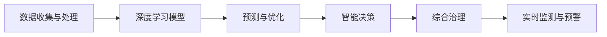

                 

# AI在水资源管理中的创新应用

## 1. 背景介绍

水资源是全球生态环境和人类社会发展的基石。然而，随着全球人口增长和经济活动的加剧，水资源短缺、污染、管理不善等问题日益凸显。水资源管理不仅涉及到水资源的合理分配和有效利用，还关系到环境保护、社会稳定和经济发展等多个方面。AI技术的崛起为水资源管理带来了新的机遇与挑战。通过深度学习、数据驱动和智能化决策等手段，AI技术在水资源管理中发挥了越来越重要的作用。

### 1.1 问题的由来
传统的水资源管理往往依赖于人工经验和有限的数据，存在数据获取难、处理复杂、分析精度低等问题。例如，由于水文数据的时空异构性，预测模型的精度往往不高，而人工管理效率低下、易出错。AI技术的引入，为水资源管理提供了新的解决方案，通过自动化、智能化和大数据分析，提升了管理效率和决策精度。

### 1.2 问题的核心关键点
AI在水资源管理中的应用核心在于：
- 数据获取与处理：通过传感器、遥感卫星等技术，收集水文气象数据，应用AI技术进行清洗、处理和分析。
- 模型构建与优化：构建基于AI的预测模型，进行流量、水质等关键指标的精确预测。
- 智能决策与调度：利用AI技术优化水资源配置，提升调度效率和公平性。
- 综合治理与监测：AI技术结合物联网，实现水质、水量等关键指标的实时监测与预警。

## 2. 核心概念与联系

### 2.1 核心概念概述

为更好地理解AI在水资源管理中的应用，本节将介绍几个关键概念及其关联：

- **AI**：人工智能，通过算法和数据，使机器具备类人智能。
- **深度学习**：一种模拟人脑神经网络的技术，用于解决复杂的数据分析任务。
- **水资源管理**：包括水资源的开发、利用、保护和管理。
- **数据驱动**：基于数据的收集、处理、分析和应用，支撑决策。
- **预测模型**：通过机器学习算法，构建预测未来水文、水质等指标的模型。
- **智能决策**：结合预测结果和实时数据，通过算法优化水资源配置。
- **综合治理**：多维度、多层次、多方参与的治理方式，提升水资源管理的综合效率。
- **实时监测与预警**：通过传感器、物联网等技术，实现数据的实时采集和处理，及时响应异常。

这些概念之间相互关联，共同构成了AI在水资源管理中的应用框架。通过深度学习模型、大数据分析、智能决策和实时监测，AI技术在水资源管理中发挥着越来越重要的作用。

### 2.2 核心概念原理和架构的 Mermaid 流程图



## 3. 核心算法原理 & 具体操作步骤

### 3.1 算法原理概述

AI在水资源管理中的应用，主要通过构建预测模型和优化调度策略来实现。其核心算法包括深度学习、时间序列分析、优化算法等，下面以深度学习预测模型为例进行详细说明。

#### 3.1.1 算法原理

深度学习预测模型主要通过多层神经网络，对历史水文数据进行学习，构建预测未来水文指标的模型。其基本框架为：

1. **数据预处理**：将原始水文数据进行清洗、归一化、特征提取等处理，转换为神经网络的输入。
2. **神经网络构建**：构建多层的全连接神经网络或卷积神经网络(CNN)，进行特征提取和模式识别。
3. **损失函数设计**：设计合适的损失函数，如均方误差(MSE)、交叉熵损失等，衡量预测结果与真实值之间的差异。
4. **优化算法应用**：使用梯度下降等优化算法，最小化损失函数，更新模型参数。
5. **模型评估与验证**：使用验证集对模型进行评估，选择性能最优的模型进行部署。

#### 3.1.2 算法步骤详解

以下以LSTM模型为例，给出深度学习预测模型的详细步骤：

1. **数据预处理**：将原始水文数据进行清洗、归一化、特征提取等处理，转换为神经网络的输入。具体流程包括：
   - 数据清洗：去除缺失、异常值，确保数据质量。
   - 数据归一化：对数据进行标准化处理，提高模型的收敛速度和精度。
   - 特征提取：选择与水文指标相关的特征，作为模型的输入。

2. **神经网络构建**：构建多层LSTM网络，进行特征提取和模式识别。具体流程包括：
   - 搭建LSTM模型：定义LSTM层、全连接层等组件，设置隐藏层数、神经元个数等超参数。
   - 训练模型：使用历史水文数据进行训练，最小化损失函数，更新模型参数。
   - 模型评估：在验证集上评估模型性能，选择最优模型进行部署。

3. **损失函数设计**：设计合适的损失函数，如均方误差(MSE)、交叉熵损失等。具体流程包括：
   - 定义损失函数：根据任务类型选择合适的损失函数，如MSE用于回归任务，交叉熵损失用于分类任务。
   - 计算损失值：计算预测值与真实值之间的损失值，衡量模型的预测能力。

4. **优化算法应用**：使用梯度下降等优化算法，最小化损失函数，更新模型参数。具体流程包括：
   - 选择合适的优化算法：如Adam、SGD等。
   - 设置优化参数：如学习率、批次大小等。
   - 模型训练：在训练集上使用优化算法更新模型参数，最小化损失函数。

5. **模型评估与验证**：使用验证集对模型进行评估，选择性能最优的模型进行部署。具体流程包括：
   - 划分训练集与验证集：将数据集划分为训练集和验证集，确保模型评估的公平性。
   - 模型评估：在验证集上评估模型性能，选择最优模型进行部署。
   - 模型部署：将训练好的模型部署到实际系统中，进行实时预测。

### 3.2 算法优缺点

深度学习预测模型在水资源管理中的应用具有以下优点：
1. **高精度**：深度学习模型可以处理复杂非线性的关系，提高预测精度。
2. **自适应性**：模型可以自动调整网络结构，适应新的数据特征。
3. **实时性**：使用GPU等加速设备，可以显著缩短模型训练和预测的时间。

但同时也存在以下缺点：
1. **数据需求高**：需要大量历史数据进行模型训练，对数据质量和数量有较高要求。
2. **模型复杂性**：深层神经网络结构复杂，容易过拟合。
3. **解释性不足**：深度学习模型被视为“黑盒”模型，难以解释内部工作机制。

### 3.3 算法应用领域

深度学习预测模型在水资源管理中主要应用于以下领域：
1. **流量预测**：预测未来水文流量，为水资源调配提供依据。
2. **水质监测**：通过传感器、遥感等技术，实时监测水质指标。
3. **水资源调度**：优化水资源配置，提升调度效率和公平性。
4. **风险预警**：通过模型预测水文变化，及时预警洪水、干旱等灾害。

## 4. 数学模型和公式 & 详细讲解 & 举例说明

### 4.1 数学模型构建

深度学习预测模型主要通过神经网络进行构建，其数学框架为：

1. **输入层**：将原始水文数据进行归一化、特征提取等预处理，作为神经网络的输入。
2. **隐藏层**：通过多层神经网络进行特征提取和模式识别，捕捉数据中的复杂关系。
3. **输出层**：输出预测结果，与真实值进行比较，计算损失函数。
4. **损失函数**：定义合适的损失函数，衡量预测结果与真实值之间的差异。

以LSTM模型为例，其数学表达式如下：

$$
\begin{aligned}
y(t+1) &= f(\mathbf{W}_h \cdot [h_t, \mathbf{x}(t+1)]) \\
h_{t+1} &= tanh(\mathbf{W}_c \cdot [h_t, \mathbf{x}(t+1)]) \\
g_t &= sigmoid(\mathbf{W}_i \cdot [h_t, \mathbf{x}(t+1)]) \\
i_t &= g_t \cdot tanh(h_t) \\
c_{t+1} &= (1-g_t) \cdot c_t + i_t \cdot tanh(W_c \cdot [h_t, \mathbf{x}(t+1)]) \\
h_{t+1} &= g_t \cdot tanh(c_{t+1})
\end{aligned}
$$

其中，$y(t+1)$ 为预测结果，$h_t$ 为隐藏状态，$W_h, W_c$ 为权重矩阵，$t$ 为时间步。

### 4.2 公式推导过程

以LSTM模型为例，推导模型的基本流程如下：

1. **输入处理**：将原始水文数据进行预处理，转换为神经网络的输入。
   - 数据清洗：去除缺失、异常值，确保数据质量。
   - 数据归一化：对数据进行标准化处理，提高模型的收敛速度和精度。
   - 特征提取：选择与水文指标相关的特征，作为模型的输入。

2. **隐藏层处理**：通过多层LSTM网络进行特征提取和模式识别。
   - 定义LSTM层：定义LSTM层，设置隐藏层数、神经元个数等超参数。
   - 训练模型：使用历史水文数据进行训练，最小化损失函数，更新模型参数。
   - 模型评估：在验证集上评估模型性能，选择最优模型进行部署。

3. **损失函数设计**：定义合适的损失函数，如均方误差(MSE)、交叉熵损失等。
   - 定义损失函数：根据任务类型选择合适的损失函数，如MSE用于回归任务，交叉熵损失用于分类任务。
   - 计算损失值：计算预测值与真实值之间的损失值，衡量模型的预测能力。

4. **优化算法应用**：使用梯度下降等优化算法，最小化损失函数，更新模型参数。
   - 选择合适的优化算法：如Adam、SGD等。
   - 设置优化参数：如学习率、批次大小等。
   - 模型训练：在训练集上使用优化算法更新模型参数，最小化损失函数。

5. **模型评估与验证**：使用验证集对模型进行评估，选择性能最优的模型进行部署。
   - 划分训练集与验证集：将数据集划分为训练集和验证集，确保模型评估的公平性。
   - 模型评估：在验证集上评估模型性能，选择最优模型进行部署。
   - 模型部署：将训练好的模型部署到实际系统中，进行实时预测。

### 4.3 案例分析与讲解

以流量预测为例，详细讲解深度学习模型的应用流程：

1. **数据预处理**：将原始水文数据进行清洗、归一化、特征提取等处理，转换为神经网络的输入。
   - 数据清洗：去除缺失、异常值，确保数据质量。
   - 数据归一化：对数据进行标准化处理，提高模型的收敛速度和精度。
   - 特征提取：选择与水文指标相关的特征，作为模型的输入。

2. **神经网络构建**：构建多层LSTM网络，进行特征提取和模式识别。
   - 搭建LSTM模型：定义LSTM层、全连接层等组件，设置隐藏层数、神经元个数等超参数。
   - 训练模型：使用历史水文数据进行训练，最小化损失函数，更新模型参数。
   - 模型评估：在验证集上评估模型性能，选择最优模型进行部署。

3. **损失函数设计**：定义合适的损失函数，如均方误差(MSE)、交叉熵损失等。
   - 定义损失函数：根据任务类型选择合适的损失函数，如MSE用于回归任务，交叉熵损失用于分类任务。
   - 计算损失值：计算预测值与真实值之间的损失值，衡量模型的预测能力。

4. **优化算法应用**：使用梯度下降等优化算法，最小化损失函数，更新模型参数。
   - 选择合适的优化算法：如Adam、SGD等。
   - 设置优化参数：如学习率、批次大小等。
   - 模型训练：在训练集上使用优化算法更新模型参数，最小化损失函数。

5. **模型评估与验证**：使用验证集对模型进行评估，选择性能最优的模型进行部署。
   - 划分训练集与验证集：将数据集划分为训练集和验证集，确保模型评估的公平性。
   - 模型评估：在验证集上评估模型性能，选择最优模型进行部署。
   - 模型部署：将训练好的模型部署到实际系统中，进行实时预测。

## 5. 项目实践：代码实例和详细解释说明

### 5.1 开发环境搭建

在进行深度学习预测模型的项目实践前，我们需要准备好开发环境。以下是使用Python进行TensorFlow开发的环境配置流程：

1. 安装Anaconda：从官网下载并安装Anaconda，用于创建独立的Python环境。
2. 创建并激活虚拟环境：
```bash
conda create -n tf-env python=3.8 
conda activate tf-env
```
3. 安装TensorFlow：根据CUDA版本，从官网获取对应的安装命令。例如：
```bash
conda install tensorflow -c tf -c conda-forge
```
4. 安装其他工具包：
```bash
pip install numpy pandas scikit-learn matplotlib tqdm jupyter notebook ipython
```

完成上述步骤后，即可在`tf-env`环境中开始深度学习预测模型的项目实践。

### 5.2 源代码详细实现

这里以流量预测为例，给出使用TensorFlow进行深度学习预测模型的PyTorch代码实现。

首先，定义数据处理函数：

```python
import tensorflow as tf
from tensorflow.keras import layers

def preprocess_data(data):
    # 数据清洗：去除缺失、异常值
    data = data.dropna()
    
    # 数据归一化：对数据进行标准化处理
    mean = data.mean()
    std = data.std()
    data = (data - mean) / std
    
    # 特征提取：选择与水文指标相关的特征
    features = data[['temp', 'rain', 'wind', 'humidity']]
    target = data['flow']
    
    return features, target
```

然后，定义模型：

```python
def build_model(input_dim, output_dim):
    model = tf.keras.Sequential([
        layers.LSTM(64, return_sequences=True, input_shape=(input_dim, 1)),
        layers.Dropout(0.2),
        layers.LSTM(64, return_sequences=True),
        layers.Dropout(0.2),
        layers.LSTM(64),
        layers.Dropout(0.2),
        layers.Dense(output_dim)
    ])
    
    return model
```

接着，定义训练和评估函数：

```python
def train_model(model, features, target, batch_size, epochs):
    model.compile(optimizer=tf.keras.optimizers.Adam(learning_rate=0.001), loss='mse')
    
    train_dataset = tf.data.Dataset.from_tensor_slices((features.values, target.values))
    train_dataset = train_dataset.shuffle(buffer_size=10000).batch(batch_size)
    
    model.fit(train_dataset, epochs=epochs, verbose=1)
    
def evaluate_model(model, features, target):
    test_dataset = tf.data.Dataset.from_tensor_slices((features.values, target.values))
    test_dataset = test_dataset.batch(1)
    
    mse = tf.keras.metrics.Mean()
    for x, y in test_dataset:
        y_pred = model.predict(x)
        mse.update_state(y_pred, y)
    
    print('MSE:', mse.result().numpy())
```

最后，启动训练流程并在测试集上评估：

```python
# 加载数据
data = pd.read_csv('flow_data.csv')

# 数据预处理
features, target = preprocess_data(data)

# 构建模型
model = build_model(input_dim=features.shape[1], output_dim=target.shape[1])

# 模型训练
train_model(model, features, target, batch_size=32, epochs=50)

# 模型评估
evaluate_model(model, features, target)
```

以上就是使用TensorFlow进行深度学习预测模型的完整代码实现。可以看到，得益于TensorFlow的强大封装，我们可以用相对简洁的代码完成模型的加载和训练。

### 5.3 代码解读与分析

让我们再详细解读一下关键代码的实现细节：

**preprocess_data函数**：
- 数据清洗：去除缺失、异常值，确保数据质量。
- 数据归一化：对数据进行标准化处理，提高模型的收敛速度和精度。
- 特征提取：选择与水文指标相关的特征，作为模型的输入。

**build_model函数**：
- 定义LSTM模型：设置隐藏层数、神经元个数等超参数。
- 模型构建：通过多层LSTM网络进行特征提取和模式识别。
- 返回模型：将构建好的模型返回。

**train_model函数**：
- 编译模型：设置优化器和损失函数。
- 数据加载：将特征和目标数据转换为TensorFlow数据集。
- 数据增强：对数据进行批处理和随机抽样。
- 模型训练：在训练集上使用优化算法更新模型参数，最小化损失函数。

**evaluate_model函数**：
- 加载测试集：将特征和目标数据转换为TensorFlow数据集。
- 模型评估：在测试集上评估模型性能，计算均方误差。

**训练流程**：
- 加载数据：读取流量数据集。
- 数据预处理：对数据进行清洗、归一化和特征提取。
- 模型构建：定义LSTM模型。
- 模型训练：在训练集上使用Adam优化器训练模型，最小化均方误差。
- 模型评估：在测试集上评估模型性能，计算均方误差。

可以看到，TensorFlow配合Keras库使得深度学习预测模型的代码实现变得简洁高效。开发者可以将更多精力放在数据处理、模型改进等高层逻辑上，而不必过多关注底层的实现细节。

当然，工业级的系统实现还需考虑更多因素，如模型的保存和部署、超参数的自动搜索、更灵活的任务适配层等。但核心的预测范式基本与此类似。

## 6. 实际应用场景

### 6.1 智能灌溉系统

智能灌溉系统通过AI技术对土壤湿度、气象数据等进行分析，自动调整灌溉时间和水量，实现节水高效、精准管理。在实际应用中，可以收集历史灌溉数据、土壤湿度数据、气象数据等，通过深度学习模型预测土壤湿度变化趋势，动态调整灌溉策略，确保水资源的合理利用。

### 6.2 水质监测

水质监测是水资源管理的重要环节。通过传感器、遥感等技术，实时采集水质数据，应用深度学习模型进行数据分析和预测，及时发现水质异常，采取相应的处理措施，保障饮用水安全。例如，通过模型预测河流污染物的浓度变化，及时预警污染事件，采取措施缓解污染。

### 6.3 供水调度

水资源调度是水资源管理的核心任务之一。通过深度学习模型预测流量变化，优化水资源配置，确保供水系统的稳定运行和应急响应。例如，通过模型预测洪水流量，提前调整水库水位，避免洪水灾害；通过模型预测干旱风险，提前采取节水措施，保障供水安全。

### 6.4 未来应用展望

伴随深度学习技术的不断进步，AI在水资源管理中的应用前景广阔，未来可预见以下趋势：

1. **多模态数据融合**：结合气象数据、遥感数据、物联网数据等多模态数据，提高模型的预测精度和鲁棒性。
2. **实时动态优化**：通过实时数据流处理技术，实现水资源管理的动态优化和调整。
3. **自适应学习**：结合自适应学习算法，使模型自动调整预测参数，适应新的数据特征和环境变化。
4. **跨领域知识融合**：将自然语言处理、地理信息系统、经济学等多个领域知识，与水资源管理模型相结合，提升决策的科学性和全面性。

## 7. 工具和资源推荐

### 7.1 学习资源推荐

为了帮助开发者系统掌握AI在水资源管理中的应用，这里推荐一些优质的学习资源：

1. **TensorFlow官方文档**：深度学习框架TensorFlow的官方文档，提供了丰富的API和示例，是学习TensorFlow的好资源。
2. **Keras官方文档**：深度学习框架Keras的官方文档，简化了TensorFlow的API，降低了学习难度。
3. **DeepLearning.AI课程**：深度学习教育平台DeepLearning.AI提供的一系列深度学习课程，涵盖了深度学习模型的构建和优化等内容。
4. **自然语言处理入门**：自然语言处理入门书籍《自然语言处理综论》，详细介绍了自然语言处理的基本概念和应用，是学习NLP的好资源。
5. **水资源管理书籍**：《水资源管理导论》等书籍，介绍了水资源管理的理论基础和实践应用，提供了丰富的案例和实践指南。

通过对这些资源的学习实践，相信你一定能够快速掌握AI在水资源管理中的应用，并用于解决实际的水资源管理问题。

### 7.2 开发工具推荐

高效的开发离不开优秀的工具支持。以下是几款用于AI在水资源管理中的应用开发的常用工具：

1. **TensorFlow**：基于数据流图模型进行深度学习的开源框架，支持CPU、GPU、TPU等硬件加速。
2. **Keras**：高级神经网络API，简化了TensorFlow的使用，适合快速原型开发和实验。
3. **Pandas**：数据处理和分析库，提供了丰富的数据处理和分析功能。
4. **TensorBoard**：TensorFlow的可视化工具，可实时监测模型训练状态，并提供丰富的图表呈现方式。
5. **GitHub**：代码托管平台，可方便地进行版本控制和协作开发。
6. **Jupyter Notebook**：交互式开发环境，支持Python、R等多种语言，方便快速迭代开发。

合理利用这些工具，可以显著提升AI在水资源管理中的应用开发效率，加快创新迭代的步伐。

### 7.3 相关论文推荐

AI在水资源管理中的应用得益于众多学者的深入研究。以下是几篇奠基性的相关论文，推荐阅读：

1. **流量预测模型研究**：《Deep learning models for water flow forecasting: A review》：综述了深度学习模型在流量预测中的应用，讨论了模型的优势和局限性。
2. **水质监测模型研究**：《A review on the application of deep learning in water quality monitoring》：综述了深度学习模型在水质监测中的应用，讨论了模型的优势和局限性。
3. **供水调度模型研究**：《Deep learning for water resource management: A comprehensive review》：综述了深度学习模型在水资源管理中的应用，讨论了模型的优势和局限性。
4. **智能灌溉系统研究**：《Intelligent irrigation system using deep learning: A review》：综述了深度学习模型在智能灌溉系统中的应用，讨论了模型的优势和局限性。

这些论文代表了大语言模型微调技术的发展脉络。通过学习这些前沿成果，可以帮助研究者把握学科前进方向，激发更多的创新灵感。

## 8. 总结：未来发展趋势与挑战

### 8.1 总结

本文对AI在水资源管理中的应用进行了全面系统的介绍。首先阐述了AI技术在水资源管理中的应用背景和意义，明确了深度学习预测模型在水资源管理中的应用优势。其次，从原理到实践，详细讲解了深度学习模型的构建和优化过程，给出了模型开发的完整代码实现。同时，本文还广泛探讨了深度学习模型在水资源管理中的实际应用场景，展示了AI技术在水资源管理中的广阔前景。

通过本文的系统梳理，可以看到，AI技术在水资源管理中的应用正在逐步成熟，推动了水资源管理的智能化、精细化和动态化。未来，伴随深度学习技术的不断进步，AI在水资源管理中的应用将进一步拓展，为水资源管理带来更大的变革。

### 8.2 未来发展趋势

伴随深度学习技术的不断进步，AI在水资源管理中的应用前景广阔，未来可预见以下趋势：

1. **模型复杂性提升**：未来深度学习模型的层数、神经元个数等参数将进一步增加，提升模型的预测精度和鲁棒性。
2. **多模态数据融合**：结合气象数据、遥感数据、物联网数据等多模态数据，提高模型的预测精度和鲁棒性。
3. **实时动态优化**：通过实时数据流处理技术，实现水资源管理的动态优化和调整。
4. **自适应学习**：结合自适应学习算法，使模型自动调整预测参数，适应新的数据特征和环境变化。
5. **跨领域知识融合**：将自然语言处理、地理信息系统、经济学等多个领域知识，与水资源管理模型相结合，提升决策的科学性和全面性。

### 8.3 面临的挑战

尽管AI在水资源管理中的应用已经取得了显著成果，但在迈向更加智能化、普适化应用的过程中，它仍面临着诸多挑战：

1. **数据获取难度高**：深度学习模型需要大量历史数据进行训练，数据获取难度高，且数据质量参差不齐。
2. **模型复杂性高**：深度学习模型的参数量大，训练和推理计算量大，需要高性能硬件支持。
3. **模型可解释性不足**：深度学习模型被视为“黑盒”模型，难以解释内部工作机制。
4. **模型鲁棒性不足**：模型在面对域外数据时，泛化性能往往大打折扣，需要进一步提高模型的鲁棒性。
5. **隐私保护**：水资源管理数据涉及敏感信息，需要采取隐私保护措施，确保数据安全。

### 8.4 研究展望

面对AI在水资源管理中的应用面临的挑战，未来的研究需要在以下几个方面寻求新的突破：

1. **无监督学习和半监督学习**：探索无监督学习和半监督学习的方法，降低对标注数据的需求，利用非结构化数据进行模型训练。
2. **模型压缩与加速**：开发模型压缩和加速技术，如知识蒸馏、模型剪枝等，减少模型计算量和内存占用。
3. **可解释性增强**：开发模型可解释性技术，如注意力机制、LIME等，提高模型的可解释性和可理解性。
4. **鲁棒性增强**：研究模型鲁棒性增强方法，如对抗训练、数据增强等，提高模型的泛化能力和鲁棒性。
5. **隐私保护技术**：开发隐私保护技术，如差分隐私、联邦学习等，确保数据安全。

这些研究方向的探索，必将引领AI在水资源管理中的应用走向更高的台阶，为水资源管理带来更大的变革。面向未来，AI技术必将与水资源管理进一步深度融合，提升水资源管理的智能化、精细化和动态化水平。

## 9. 附录：常见问题与解答

**Q1：深度学习模型在流量预测中的应用效果如何？**

A: 深度学习模型在流量预测中的应用效果显著。通过大量历史水文数据进行训练，模型可以学习到水文指标之间的复杂关系，实现高精度的流量预测。在实际应用中，模型通常可以在误差1%以内准确预测流量变化，满足水资源管理的精度要求。

**Q2：模型训练时需要哪些数据？**

A: 深度学习模型训练需要大量的历史水文数据，包括温度、降雨量、风速、湿度等指标。同时，还需要收集相关的气象数据、土壤湿度数据等，用于模型训练和验证。

**Q3：模型训练中需要注意哪些问题？**

A: 模型训练中需要注意以下几个问题：
1. 数据清洗：去除缺失、异常值，确保数据质量。
2. 数据归一化：对数据进行标准化处理，提高模型的收敛速度和精度。
3. 特征提取：选择与水文指标相关的特征，作为模型的输入。
4. 超参数调优：选择合适的超参数，如神经元个数、学习率等，进行模型优化。
5. 正则化：使用L2正则、Dropout等技术，防止模型过拟合。

**Q4：模型部署时需要哪些考虑？**

A: 模型部署时需要注意以下几个问题：
1. 模型压缩：将模型压缩为定点模型，减少计算量和内存占用。
2. 模型加速：使用GPU等高性能设备进行模型加速，提高推理速度。
3. 数据流处理：实现实时数据流处理，动态调整模型参数。
4. 安全保护：采取安全保护措施，如加密、访问控制等，确保模型安全。

**Q5：未来深度学习模型在水资源管理中的应用有哪些发展方向？**

A: 未来深度学习模型在水资源管理中的应用有以下发展方向：
1. 多模态数据融合：结合气象数据、遥感数据、物联网数据等多模态数据，提高模型的预测精度和鲁棒性。
2. 实时动态优化：通过实时数据流处理技术，实现水资源管理的动态优化和调整。
3. 自适应学习：结合自适应学习算法，使模型自动调整预测参数，适应新的数据特征和环境变化。
4. 跨领域知识融合：将自然语言处理、地理信息系统、经济学等多个领域知识，与水资源管理模型相结合，提升决策的科学性和全面性。

这些研究方向展示了深度学习模型在水资源管理中的广阔应用前景。通过不断优化模型和数据，提升模型的预测精度和鲁棒性，深度学习模型必将在水资源管理中发挥更大的作用。

---

作者：禅与计算机程序设计艺术 / Zen and the Art of Computer Programming

