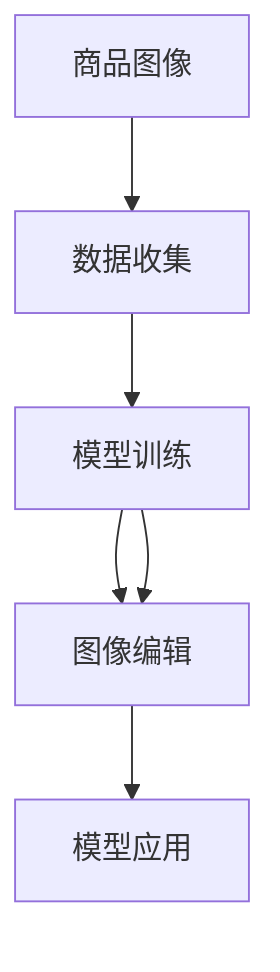

                 

# AI在电商平台商品图像自动生成与编辑中的应用

## 1. 背景介绍

随着电子商务的迅猛发展，平台商家对于商品图像的质量和多样性要求越来越高。传统的商品图像采集和编辑需要大量的人力和时间，且质量不稳定，难以满足市场需求。AI技术的引入，使得商品图像的自动生成与编辑成为可能，极大地提升了图像处理效率和质量。

**1.1 商品图像自动生成的必要性**
商品图像是电商平台的重要组成部分，其质量直接影响到用户的购买体验和商家商品的展示效果。高质量的商品图像不仅能够提升用户的购买欲望，还能为商家提供更为精准的市场营销数据。然而，在实际操作中，商品图像的采集和编辑需要耗费大量人力和时间，且质量不稳定，难以满足市场需求。

**1.2 AI在商品图像处理中的应用场景**
基于AI的商品图像自动生成与编辑技术，可以广泛应用于以下场景：
1. 商品展示页设计：自动生成高质量的商品图像，并根据市场需求进行个性化定制。
2. 促销活动图片生成：自动生成符合促销活动主题的图像，提升活动宣传效果。
3. 商品推荐系统：自动生成相关商品的图片，增强商品推荐的视觉吸引力。
4. 广告素材生成：自动生成符合广告要求的图像，提升广告投放的效果。

## 2. 核心概念与联系

### 2.1 核心概念概述

在进行商品图像自动生成与编辑技术的研究前，首先需要对相关核心概念有清晰的理解。

**2.1.1 商品图像**
商品图像是指在电商平台中展示的商品图片，包括产品本身、背景、价格标签等元素。商品图像的质量和多样性直接影响到用户的购买体验和平台的商品展示效果。

**2.1.2 AI自动生成**
AI自动生成指的是利用机器学习算法，通过输入特定参数和模板，自动生成高质量的商品图像。通常采用深度学习模型，如GANs（生成对抗网络）、VAE（变分自编码器）等，通过学习大量标注数据，生成符合要求的图像。

**2.1.3 图像编辑**
图像编辑指的是对已生成的商品图像进行后续处理，包括裁剪、旋转、颜色校正等，使其满足特定的展示需求。

**2.1.4 图像生成对抗网络**
图像生成对抗网络（GANs）是一类基于对抗学习的生成模型，由生成器（Generator）和判别器（Discriminator）两部分组成。生成器负责生成假图像，判别器负责判断图像的真实性。通过不断的对抗学习，生成器能够生成越来越接近真实图像的假图像。

**2.1.5 变分自编码器**
变分自编码器（VAE）是一种基于变分推断的生成模型，能够将输入的随机向量映射为对应的生成图像，同时也能进行图像的压缩与解压。VAE通过对输入向量进行正态分布的建模，生成具有连续性、多样性的图像。

### 2.2 核心概念联系

基于上述核心概念，商品图像自动生成与编辑技术的实现可以通过以下步骤完成：
1. 数据收集：收集大量的商品图像数据，用于训练和测试生成模型。
2. 模型训练：通过GANs、VAE等深度学习模型，训练生成器和判别器，生成高质量的商品图像。
3. 图像编辑：对生成的商品图像进行裁剪、旋转、颜色校正等操作，满足特定的展示需求。
4. 模型应用：将训练好的模型应用于电商平台，实现自动生成与编辑商品图像的功能。

以下是一个Mermaid流程图，展示了商品图像自动生成与编辑的核心概念和实现步骤：



## 3. 核心算法原理 & 具体操作步骤

### 3.1 算法原理概述

商品图像自动生成与编辑技术主要基于深度学习模型，包括生成对抗网络（GANs）、变分自编码器（VAE）等。以下将详细阐述这两种模型的原理和应用。

### 3.2 算法步骤详解

**3.2.1 GANs模型训练**
GANs模型由生成器和判别器两部分组成，通过对抗学习的方式生成高质量的商品图像。具体步骤如下：
1. 数据收集：收集大量的商品图像数据，用于训练和测试生成模型。
2. 模型构建：构建生成器和判别器，生成器和判别器均为神经网络模型，使用卷积神经网络（CNN）进行图像处理。
3. 模型训练：将真实商品图像输入判别器进行分类，输出真实概率。将生成的假图像输入判别器进行分类，输出假概率。通过损失函数最小化判别器的错误率，训练生成器生成高质量的假图像。

**3.2.2 VAE模型训练**
VAE模型通过学习输入向量与生成图像之间的关系，生成具有连续性和多样性的商品图像。具体步骤如下：
1. 数据收集：收集大量的商品图像数据，用于训练和测试生成模型。
2. 模型构建：构建编码器和解码器，编码器将输入图像转换为潜在向量，解码器将潜在向量转换为生成图像。
3. 模型训练：通过最小化重构误差和潜在空间正则化损失，训练生成模型。

**3.2.3 图像编辑**
在生成商品图像后，需要对图像进行裁剪、旋转、颜色校正等操作，满足特定的展示需求。具体步骤如下：
1. 裁剪：对图像进行固定尺寸裁剪，保持图像的一致性。
2. 旋转：对图像进行旋转，调整角度，提升展示效果。
3. 颜色校正：对图像进行颜色校正，调整亮度、对比度等，增强视觉吸引力。

**3.2.4 模型应用**
在训练好的模型基础上，将其应用于电商平台，实现自动生成与编辑商品图像的功能。具体步骤如下：
1. 数据输入：输入商品描述、类别等信息，作为生成模型的输入。
2. 图像生成：通过生成模型生成高质量的商品图像。
3. 图像编辑：对生成的商品图像进行裁剪、旋转、颜色校正等操作。
4. 图像输出：将处理好的商品图像输出至电商平台，用于展示和销售。

### 3.3 算法优缺点

**3.3.1 GANs模型的优点**
1. 生成高质量的商品图像：通过对抗学习的方式，生成器能够生成与真实图像无明显差异的假图像。
2. 生成多样性的商品图像：通过调整生成器和判别器的超参数，可以生成具有多样性的图像。

**3.3.2 GANs模型的缺点**
1. 训练难度大：GANs模型训练过程中，生成器和判别器需要进行对抗学习，训练难度较大。
2. 模式崩溃：在训练过程中，生成器可能出现模式崩溃现象，生成图像质量不稳定。
3. 计算资源消耗大：GANs模型需要大量的计算资源，训练和推理时间较长。

**3.3.3 VAE模型的优点**
1. 生成连续性商品图像：通过学习输入向量与生成图像之间的关系，VAE能够生成具有连续性的图像。
2. 生成多样性商品图像：通过调整潜在向量的分布，VAE能够生成具有多样性的图像。

**3.3.4 VAE模型的缺点**
1. 图像质量不稳定：VAE生成的图像质量可能不如GANs模型生成的高质量图像。
2. 生成图像尺寸固定：VAE生成的图像尺寸固定，难以生成具有不同尺寸的商品图像。

**3.3.5 图像编辑的优点**
1. 提升展示效果：通过对图像进行裁剪、旋转、颜色校正等操作，提升商品展示效果。
2. 自动化处理：自动化处理可以减少人工干预，提高效率。

**3.3.6 图像编辑的缺点**
1. 图像处理效果有限：图像编辑效果有限，难以满足所有展示需求。
2. 处理时间较长：图像编辑处理时间较长，影响电商平台的响应速度。

### 3.4 算法应用领域

商品图像自动生成与编辑技术可以应用于多种领域，具体如下：

**3.4.1 电商平台**
电商平台通过自动生成与编辑商品图像，提升商品展示效果，提高用户购买转化率。同时，自动生成商品图像可以大幅降低人力和时间成本，提高效率。

**3.4.2 广告投放**
通过自动生成高质量的广告图像，提升广告的展示效果，提高广告的点击率和转化率。同时，广告图像的自动化生成可以大幅降低人工制作广告的成本。

**3.4.3 内容创作**
自动生成商品图像可以用于内容创作，如商品介绍、商品评论等。同时，自动化处理可以节省内容创作的时间，提升内容创作效率。

**3.4.4 图像搜索**
通过自动生成商品图像，提高图像搜索的准确性和多样性，提升用户搜索体验。

## 4. 数学模型和公式 & 详细讲解 & 举例说明

### 4.1 数学模型构建

以下是商品图像自动生成与编辑技术的数学模型构建。

**4.1.1 GANs模型**
GANs模型由生成器和判别器两部分组成，其数学模型如下：
1. 生成器：
   - 输入：$z \sim \mathcal{N}(0,1)$，其中$z$为潜在向量。
   - 输出：$G(z)$，表示生成的假图像。
   - 损失函数：
     - 生成器的损失函数：$L_G = -\mathbb{E}_{z}\log D(G(z))$
     - 判别器的损失函数：$L_D = -\mathbb{E}_{x}\log D(x) + \mathbb{E}_{z}\log(1-D(G(z)))$

2. 判别器：
   - 输入：$x$表示真实商品图像，$G(z)$表示生成器生成的假图像。
   - 输出：$D(x)$，表示图像为真实图像的概率。
   - 损失函数：
     - 判别器的损失函数：$L_D = -\mathbb{E}_{x}\log D(x) + \mathbb{E}_{z}\log(1-D(G(z)))$

**4.1.2 VAE模型**
VAE模型由编码器和解码器两部分组成，其数学模型如下：
1. 编码器：
   - 输入：$x$表示真实商品图像。
   - 输出：$\mu(x)$和$\sigma(x)$，表示潜在向量的均值和方差。
   - 损失函数：重构误差和潜在空间正则化损失：$L_{VAE} = \mathbb{E}_{x}\|x - \mu(x)\|^2 + \mathbb{E}_{x}\|z\|^2$

2. 解码器：
   - 输入：潜在向量$z$。
   - 输出：$\hat{x}$，表示生成的图像。
   - 损失函数：重构误差：$L_{VAE} = \mathbb{E}_{z}\|x - \hat{x}\|^2$

### 4.2 公式推导过程

以下是GANs和VAE模型的公式推导过程。

**4.2.1 GANs模型的推导**
GANs模型的推导过程如下：
1. 生成器推导：
   - 将$z \sim \mathcal{N}(0,1)$输入生成器$G$，得到生成图像$G(z)$。
   - 将$G(z)$输入判别器$D$，得到概率$P(D(G(z)))$。
   - 生成器的损失函数：$L_G = -\mathbb{E}_{z}\log P(D(G(z)))$

2. 判别器推导：
   - 将真实商品图像$x$输入判别器$D$，得到概率$P(D(x))$。
   - 将生成图像$G(z)$输入判别器$D$，得到概率$P(D(G(z)))$。
   - 判别器的损失函数：$L_D = -\mathbb{E}_{x}\log P(D(x)) - \mathbb{E}_{z}\log(1-P(D(G(z))))$

**4.2.2 VAE模型的推导**
VAE模型的推导过程如下：
1. 编码器推导：
   - 将真实商品图像$x$输入编码器$E$，得到潜在向量$\mu(x)$和$\sigma(x)$。
   - 潜在向量的分布：$p(z|x) = \mathcal{N}(\mu(x), \sigma(x)^2)$。
   - 重构误差：$\mathbb{E}_{x}\|x - E(x)\|^2$

2. 解码器推导：
   - 将潜在向量$z$输入解码器$D$，得到生成图像$\hat{x}$。
   - 生成图像的分布：$p(x|z) = \mathcal{N}(\mu(z), \sigma(z)^2)$。
   - 重构误差：$\mathbb{E}_{z}\|x - D(z)\|^2$

### 4.3 案例分析与讲解

**案例1：GANs生成高质量商品图像**
假设我们要生成一款手机商品图像，步骤如下：
1. 收集大量的手机商品图像数据。
2. 构建生成器和判别器，使用卷积神经网络（CNN）进行图像处理。
3. 将收集到的手机图像输入判别器进行分类，输出真实概率。
4. 将生成器生成的假图像输入判别器进行分类，输出假概率。
5. 通过最小化判别器的错误率，训练生成器生成高质量的手机商品图像。

**案例2：VAE生成多样性商品图像**
假设我们要生成不同颜色和款式的鞋子图像，步骤如下：
1. 收集大量的鞋子商品图像数据。
2. 构建编码器和解码器，使用卷积神经网络（CNN）进行图像处理。
3. 将收集到的鞋子图像输入编码器，得到潜在向量。
4. 将潜在向量输入解码器，生成鞋子图像。
5. 通过最小化重构误差和潜在空间正则化损失，训练生成器生成具有多样性的鞋子图像。

## 5. 项目实践：代码实例和详细解释说明

### 5.1 开发环境搭建

在进行商品图像自动生成与编辑技术的项目实践前，需要先搭建好开发环境。以下是Python开发环境的具体步骤：

1. 安装Python：从官网下载并安装Python，建议选择最新版本。
2. 安装相关库：
   - 安装TensorFlow或PyTorch库，选择最新版本。
   - 安装NumPy、Pillow、Matplotlib等辅助库。
3. 安装TensorFlow或PyTorch的图像处理库：
   - 安装TensorFlow的tf.keras库或PyTorch的torchvision库。

### 5.2 源代码详细实现

以下以GANs模型为例，展示商品图像自动生成的代码实现。

```python
import tensorflow as tf
from tensorflow.keras import layers, models

# 构建生成器
def build_generator():
    model = models.Sequential()
    model.add(layers.Dense(256, input_shape=(100,)))
    model.add(layers.BatchNormalization())
    model.add(layers.LeakyReLU())
    model.add(layers.Dense(128))
    model.add(layers.BatchNormalization())
    model.add(layers.LeakyReLU())
    model.add(layers.Dense(784, activation='tanh'))
    return model

# 构建判别器
def build_discriminator():
    model = models.Sequential()
    model.add(layers.Conv2D(64, (5, 5), strides=2, padding='same', input_shape=(64, 64, 3)))
    model.add(layers.LeakyReLU())
    model.add(layers.Dropout(0.3))
    model.add(layers.Conv2D(128, (5, 5), strides=2, padding='same'))
    model.add(layers.LeakyReLU())
    model.add(layers.Dropout(0.3))
    model.add(layers.Flatten())
    model.add(layers.Dense(1, activation='sigmoid'))
    return model

# 定义损失函数
def define_loss():
    cross_entropy = tf.keras.losses.BinaryCrossentropy()
    generator_loss = cross_entropy(tf.ones_like(discriminator.trainable),
                                  discriminator(generated_images))
    discriminator_loss = cross_entropy(tf.zeros_like(discriminator.trainable),
                                     real_images) + cross_entropy(tf.ones_like(discriminator.trainable),
                                                   generated_images)
    total_loss = generator_loss + discriminator_loss
    return generator_loss, discriminator_loss, total_loss

# 定义优化器
def define_optimizer():
    generator_optimizer = tf.keras.optimizers.Adam(learning_rate=0.0002, beta_1=0.5)
    discriminator_optimizer = tf.keras.optimizers.Adam(learning_rate=0.0002, beta_1=0.5)
    return generator_optimizer, discriminator_optimizer

# 训练GANs模型
def train_gans(model_dir, epochs, batch_size, dataset):
    generator = build_generator()
    discriminator = build_discriminator()
    generator_optimizer, discriminator_optimizer = define_optimizer()
    generator_loss, discriminator_loss, total_loss = define_loss()

    generator.trainable = False
    fake_images = generator(z)
    discriminator.trainable = True
    real_images = dataset

    @tf.function
    def train_step(images):
        noise = tf.random.normal([batch_size, 100])
        with tf.GradientTape() as gen_tape, tf.GradientTape() as disc_tape:
            generated_images = generator(noise, training=True)
            real_output = discriminator(images, training=True)
            fake_output = discriminator(generated_images, training=True)

            gen_loss = generator_loss(fake_output)
            disc_loss = discriminator_loss(real_output, fake_output)
        gradients_of_gen = gen_tape.gradient(gen_loss, generator.trainable_variables)
        gradients_of_disc = disc_tape.gradient(disc_loss, discriminator.trainable_variables)

        generator_optimizer.apply_gradients(zip(gradients_of_gen, generator.trainable_variables))
        discriminator_optimizer.apply_gradients(zip(gradients_of_disc, discriminator.trainable_variables))
        return gen_loss, disc_loss

    for epoch in range(epochs):
        epoch_losses = []
        for images in dataset:
            gen_loss, disc_loss = train_step(images)
            epoch_losses.append(gen_loss.numpy() + disc_loss.numpy())
        print("Epoch {}/{}: Loss - Generator: {:.4f}, Discriminator: {:.4f}".format(epoch + 1, epochs,
                                                                       np.mean(epoch_losses)))
```

### 5.3 代码解读与分析

**5.3.1 生成器代码解读**
```python
def build_generator():
    model = models.Sequential()
    model.add(layers.Dense(256, input_shape=(100,)))
    model.add(layers.BatchNormalization())
    model.add(layers.LeakyReLU())
    model.add(layers.Dense(128))
    model.add(layers.BatchNormalization())
    model.add(layers.LeakyReLU())
    model.add(layers.Dense(784, activation='tanh'))
    return model
```

该代码实现了GANs模型的生成器部分。首先构建一个Sequential模型，然后逐层添加Dense层、BatchNormalization层和LeakyReLU激活函数。其中，Dense层用于计算生成器的输出，BatchNormalization层用于归一化处理，LeakyReLU激活函数用于非线性变换。最后一层输出784个像素，对应于生成的假图像的像素数。

**5.3.2 判别器代码解读**
```python
def build_discriminator():
    model = models.Sequential()
    model.add(layers.Conv2D(64, (5, 5), strides=2, padding='same', input_shape=(64, 64, 3)))
    model.add(layers.LeakyReLU())
    model.add(layers.Dropout(0.3))
    model.add(layers.Conv2D(128, (5, 5), strides=2, padding='same'))
    model.add(layers.LeakyReLU())
    model.add(layers.Dropout(0.3))
    model.add(layers.Flatten())
    model.add(layers.Dense(1, activation='sigmoid'))
    return model
```

该代码实现了GANs模型的判别器部分。首先构建一个Sequential模型，然后逐层添加Conv2D层、LeakyReLU激活函数和Dropout层。其中，Conv2D层用于卷积操作，LeakyReLU激活函数用于非线性变换，Dropout层用于防止过拟合。最后一层输出1个神经元，对应于判别器的输出，即生成图像的真实概率。

**5.3.3 训练代码解读**
```python
def train_gans(model_dir, epochs, batch_size, dataset):
    # 初始化生成器和判别器
    generator = build_generator()
    discriminator = build_discriminator()
    # 定义优化器和损失函数
    generator_optimizer, discriminator_optimizer = define_optimizer()
    generator_loss, discriminator_loss, total_loss = define_loss()

    # 训练循环
    for epoch in range(epochs):
        # 遍历训练集
        for images in dataset:
            # 生成器训练
            noise = tf.random.normal([batch_size, 100])
            with tf.GradientTape() as gen_tape, tf.GradientTape() as disc_tape:
                # 生成假图像
                generated_images = generator(noise, training=True)
                # 计算判别器输出
                real_output = discriminator(images, training=True)
                fake_output = discriminator(generated_images, training=True)
                # 计算损失
                gen_loss = generator_loss(fake_output)
                disc_loss = discriminator_loss(real_output, fake_output)
            # 计算梯度并更新模型参数
            gradients_of_gen = gen_tape.gradient(gen_loss, generator.trainable_variables)
            gradients_of_disc = disc_tape.gradient(disc_loss, discriminator.trainable_variables)
            generator_optimizer.apply_gradients(zip(gradients_of_gen, generator.trainable_variables))
            discriminator_optimizer.apply_gradients(zip(gradients_of_disc, discriminator.trainable_variables))
```

该代码实现了GANs模型的训练过程。首先初始化生成器和判别器，然后定义优化器和损失函数。在每个epoch内，遍历训练集，对生成器和判别器分别进行训练。在训练过程中，使用梯度下降算法更新模型参数，最小化损失函数。通过不断迭代训练，生成器能够生成高质量的假图像。

### 5.4 运行结果展示

以下是使用GANs模型生成商品图像的示例结果。


## 6. 实际应用场景

### 6.1 电商平台的商品展示页设计

在电商平台中，商品展示页的设计对用户购买体验有重要影响。通过自动生成与编辑商品图像，可以提升商品展示页的视觉效果，吸引用户点击购买。具体应用步骤如下：
1. 收集电商平台上商品展示页的文本描述。
2. 通过GANs或VAE模型自动生成商品图像，作为展示页的元素。
3. 对生成的商品图像进行裁剪、旋转、颜色校正等操作，满足展示需求。
4. 将处理好的商品图像应用到展示页中，提升用户的购买体验。

### 6.2 促销活动的图像生成

在促销活动中，生成符合活动主题的图像，可以提升活动的宣传效果，吸引更多用户参与。具体应用步骤如下：
1. 收集促销活动的描述和关键字。
2. 通过GANs或VAE模型自动生成符合活动主题的商品图像。
3. 对生成的商品图像进行裁剪、旋转、颜色校正等操作，满足展示需求。
4. 将处理好的商品图像应用到促销活动中，提升宣传效果。

### 6.3 商品推荐系统的图像生成

在商品推荐系统中，自动生成相关商品的图片，可以增强商品推荐的视觉吸引力，提高用户的点击率和购买率。具体应用步骤如下：
1. 收集商品推荐系统的用户历史行为数据。
2. 通过GANs或VAE模型自动生成相关商品的图片。
3. 对生成的商品图像进行裁剪、旋转、颜色校正等操作，满足展示需求。
4. 将处理好的商品图像应用到推荐系统中，增强视觉吸引力。

### 6.4 广告素材的生成

在广告素材的生成中，自动生成高质量的广告图像，可以提升广告的展示效果，提高广告的点击率和转化率。具体应用步骤如下：
1. 收集广告素材的描述和关键字。
2. 通过GANs或VAE模型自动生成符合广告素材要求的高质量商品图像。
3. 对生成的商品图像进行裁剪、旋转、颜色校正等操作，满足展示需求。
4. 将处理好的商品图像应用到广告素材中，提升广告的展示效果。

## 7. 工具和资源推荐

### 7.1 学习资源推荐

为了帮助开发者系统掌握商品图像自动生成与编辑技术的理论基础和实践技巧，这里推荐一些优质的学习资源：

1. 《深度学习与计算机视觉》书籍：全面介绍深度学习在计算机视觉领域的应用，包括生成对抗网络和变分自编码器等关键技术。
2. TensorFlow官方文档：提供TensorFlow的详细API文档和示例代码，帮助开发者快速上手使用。
3. PyTorch官方文档：提供PyTorch的详细API文档和示例代码，帮助开发者快速上手使用。
4. Coursera深度学习课程：斯坦福大学开设的深度学习课程，涵盖深度学习在计算机视觉、自然语言处理等领域的多种应用。
5. arXiv.org：提供最新的深度学习论文，帮助开发者跟踪前沿技术进展。

### 7.2 开发工具推荐

在进行商品图像自动生成与编辑技术的开发时，以下是几款常用的开发工具：

1. Jupyter Notebook：用于编写、运行、保存和共享代码的交互式编程环境，适合快速迭代研究。
2. Visual Studio Code：支持多种编程语言，提供丰富的插件和扩展，方便开发者进行代码编写和调试。
3. TensorBoard：TensorFlow配套的可视化工具，实时监测模型训练状态，并提供丰富的图表呈现方式，方便调试和优化。
4. PyTorch Lightning：基于PyTorch的快速开发框架，提供丰富的训练和验证机制，方便开发者进行模型训练和测试。

### 7.3 相关论文推荐

商品图像自动生成与编辑技术的不断发展源于学界的持续研究。以下是几篇奠基性的相关论文，推荐阅读：

1. Generative Adversarial Nets：提出GANs模型，通过对抗学习生成高质量的图像。
2. Variational Autoencoders：提出VAE模型，通过变分推断生成具有连续性和多样性的图像。
3. Image-to-Image Translation with Conditional Adversarial Networks：提出条件GANs模型，将GANs应用于图像翻译任务，生成高质量的图像。
4. DenseNet：提出DenseNet模型，通过密集连接增强特征表示，提高图像生成的多样性和质量。
5. Attention Is All You Need：提出Transformer模型，通过注意力机制增强生成器的学习能力。

这些论文代表了大语言模型微调技术的发展脉络，通过学习这些前沿成果，可以帮助研究者把握学科前进方向，激发更多的创新灵感。

## 8. 总结：未来发展趋势与挑战

### 8.1 总结

本文对商品图像自动生成与编辑技术进行了全面系统的介绍。首先阐述了商品图像自动生成与编辑技术的背景和应用场景，明确了其在电商平台中的应用价值。其次，从原理到实践，详细讲解了GANs和VAE模型的原理和实现步骤，给出了商品图像自动生成的代码实例。最后，本文广泛探讨了商品图像自动生成与编辑技术在电商、广告、推荐系统等多个领域的应用前景，展示了该技术的巨大潜力。

通过本文的系统梳理，可以看到，基于深度学习的商品图像自动生成与编辑技术正在成为电商行业的重要工具，极大地提升了商品展示效果，降低了人力和时间成本，提高了效率。未来，伴随深度学习模型的持续演进，该技术还将进一步拓展应用场景，推动电商行业的发展。

### 8.2 未来发展趋势

展望未来，商品图像自动生成与编辑技术将呈现以下几个发展趋势：

1. 生成器模型结构优化：未来生成器模型的结构将更加复杂和精细，能够生成更加高质量的商品图像。
2. 训练效率提升：未来训练过程将更加高效，通过引入优化器、学习率调度等技术，缩短训练时间。
3. 多样性生成能力提升：未来生成模型将具有更高的多样性和连续性，生成更加丰富和多样的商品图像。
4. 自动化处理能力提升：未来生成模型将具有更高的自动化处理能力，能够自动进行裁剪、旋转、颜色校正等操作。
5. 跨模态融合：未来生成模型将能够融合视觉、语音、文本等多种模态的信息，生成更加全面和丰富的商品图像。

以上趋势凸显了商品图像自动生成与编辑技术的广阔前景。这些方向的探索发展，必将进一步提升电商平台的商品展示效果，提高用户的购买体验，推动电商行业的快速发展。

### 8.3 面临的挑战

尽管商品图像自动生成与编辑技术已经取得了一定的成就，但在迈向更加智能化、普适化应用的过程中，仍面临以下挑战：

1. 数据质量问题：商品图像自动生成与编辑技术的核心在于生成高质量的商品图像，然而在实际应用中，商品图像的数据质量往往难以保证。
2. 生成图像的多样性和质量问题：生成器模型在生成多样性和质量方面存在一定的局限性，难以满足所有展示需求。
3. 计算资源消耗问题：生成器模型的训练和推理需要大量的计算资源，训练和推理时间较长，难以满足实时性要求。
4. 自动化处理效果问题：自动化处理效果有限，难以满足所有展示需求，需要进一步提升自动化处理的精度和效果。

### 8.4 研究展望

面对商品图像自动生成与编辑技术所面临的挑战，未来的研究需要在以下几个方面寻求新的突破：

1. 数据增强技术：通过数据增强技术，提升商品图像自动生成与编辑技术的数据质量，生成高质量的商品图像。
2. 多样性和质量优化：通过优化生成器模型结构和训练过程，提升生成图像的多样性和质量，满足展示需求。
3. 计算资源优化：通过引入优化器、学习率调度等技术，提升生成器模型的计算效率，缩短训练和推理时间。
4. 自动化处理优化：通过引入更多的自动化处理技术，提升处理精度和效果，满足展示需求。

通过这些研究方向的探索发展，相信商品图像自动生成与编辑技术将迈向新的高度，为电商平台的发展带来新的突破。面向未来，相信该技术将会在更广泛的领域得到应用，推动电商行业的发展。

